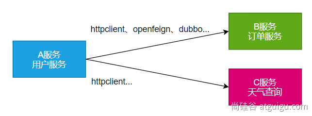

# 第10章 远程调用

**RPC（Remote Procedure Call)：远程过程调用**



**本地过程调用**：a(); b(); a() { b(); } 不同方法都在**同一个JVM运行**

**远程过程调用**：

- 服务提供者：
- 服务消费者：
- 通过连接对方服务器进行请求\响应交互，来实现调用效果

API/SDK的区别是什么？

- api：接口（Application Programming Interface）
  - 远程提供功能；
- sdk：工具包（Software Development Kit）
  - 导入jar包，直接调用功能即可

> **开发过程中**，我们经常需要调用别人写的功能
>
> - 如果是**内部**微服务，可以通过**依赖cloud**、**注册中心**、**openfeign**等进行调用
> - 如果是**外部**暴露的，可以**发送http请求，或遵循外部协议**进行调用
>
> SpringBoot整合提供了很多方式进行远程调用
>
> - 轻量级客户端方式
>
>   - RestTemplate：普通开发
>   - WebClient：响应式编程开发
>   - Http Interface：声明式编程
>
> - Spring Cloud分布式解决方案方式
>
>   - Spring Cloud OpenFeign
>
> - 第三方框架
>
>   - Dubbo
>   - gRPC
>
>   - ……


## 10.1 WebClient

> 非阻塞、响应式HTTP客户端

### 10.1.1 创建与配置

发请求：

- 请求方式：GET\POST\DELETE\xxxx
- 请求路径：/xxx
- 请求参数：aa=bb&cc=dd&xxx
- 请求头：aa=bb,cc=ddd
- 请求体：

创建 <span style="color:red;">`WebClient`</span>非常简单：

- <span style="color:red;">`WebClient.create()`</span>
- <span style="color:red;">`WebClient.create(String baseUrl)`</span>

还可以使用 <span style="color:red;">`WebClient.builder()`</span> 配置更多参数项：

- <span style="color:red;">`uriBuilderFactory`</span>：自定义 <span style="color:red;">`UriBuilderFactory`</span>，定义 baseurl。
- <span style="color:red;">`defaultUriVariables`</span>：默认 uri 变量。
- <span style="color:red;">`defaultHeader`</span>：每个请求默认头
- <span style="color:red;">`defaultCookie`</span>：每个请求默认 cookie。
- <span style="color:red;">`defaultRequest`</span>：<span style="color:red;">`Consumer`</span> 自定义每个请求。
- <span style="color:red;">`filter`</span>：过滤 client 发送的每个请求
- <span style="color:red;">`exchangeStrategies`</span>：HTTP消息 reader/writer 自定义。
- <span style="color:red;">`clientConnector`</span>：HTTP client库设置。

```java
//获取响应完整信息
WebClient client = WebClient.create("https://example.org");
```

### 10.1.2 获取响应

> <span style="color:red;">`retrieve()`</span>方法用来声明如何提取响应数据。比如：

```java
//获取响应完整信息
WebClient client = WebClient.create("https://example.org");
Mono<ResponseEntity<Person>> result = client.get()
        .uri("/persons/{id}", id).accept(MediaType.APPLICATION_JSON)
        .retrieve()
        .toEntity(Person.class);

//只获取body
WebClient client = WebClient.create("https://example.org");
Mono<Person> result = client.get()
        .uri("/persons/{id}", id).accept(MediaType.APPLICATION_JSON)
        .retrieve()
        .bodyToMono(Person.class);

//stream数据
Flux<Quote> result = client.get()
        .uri("/quotes").accept(MediaType.TEXT_EVENT_STREAM)
        .retrieve()
        .bodyToFlux(Quote.class);

//定义错误处理
Mono<Person> result = client.get()
        .uri("/persons/{id}", id).accept(MediaType.APPLICATION_JSON)
        .retrieve()
        .onStatus(HttpStatus::is4xxClientError, response -> ...)
        .onStatus(HttpStatus::is5xxServerError, response -> ...)
        .bodyToMono(Person.class);
```


### 10.1.3 定义请求体

```java
//1、响应式-单个数据
Mono<Person> personMono = ... ;
Mono<Void> result = client.post()
        .uri("/persons/{id}", id)
        .contentType(MediaType.APPLICATION_JSON)
        .body(personMono, Person.class)
        .retrieve()
        .bodyToMono(Void.class);

//2、响应式-多个数据
Flux<Person> personFlux = ... ;
Mono<Void> result = client.post()
        .uri("/persons/{id}", id)
        .contentType(MediaType.APPLICATION_STREAM_JSON)
        .body(personFlux, Person.class)
        .retrieve()
        .bodyToMono(Void.class);

//3、普通对象
Person person = ... ;
Mono<Void> result = client.post()
        .uri("/persons/{id}", id)
        .contentType(MediaType.APPLICATION_JSON)
        .bodyValue(person)
        .retrieve()
        .bodyToMono(Void.class);
```

## 10.2 HTTP Interface

> Spring 允许我们通过定义接口的方式，给任意位置发送 http 请求，实现远程调用，可以用来简化 HTTP 远程访问。需要 <span style="color:red;">`webflux`</span> 场景才可。

### 10.2.1 导入依赖

```properties
<dependency>
    <groupId>org.springframework.boot</groupId>
    <artifactId>spring-boot-starter-webflux</artifactId>
</dependency>
```

### 10.2.2 定义接口

```java
public interface WeatherInterface {

    @GetExchange(url = "https://jisuqgtq.market.alicloudapi.com/weather/query", accept = "application/json")
    Mono<String> getWeather(@RequestParam("city") String city, @RequestHeader("Authorization") String auth);
}
```

### 10.2.3 创建代理&测试

```java
@Configuration
public class WeatherConfiguration {

    @Bean
    public HttpServiceProxyFactory httpServiceProxyFactory() {
        // 1、创建客户端
        WebClient client = WebClient.builder()
                .codecs(clientCodecConfigurer -> {
                    clientCodecConfigurer.defaultCodecs()
                            .maxInMemorySize((256 * 1024 * 1024)); // 响应数据量太大有可能会超出 BufferSize，所以这里设置的大一点。
                }).build();
        // 2、创建工厂
        HttpServiceProxyFactory factory = HttpServiceProxyFactory.builderFor(WebClientAdapter.create(client)).build();
        return factory;
    }

    @Bean
    public WeatherInterface weatherInterface(HttpServiceProxyFactory factory) {
        // 3、获取代理对象
        WeatherInterface weatherInterface = factory.createClient(WeatherInterface.class);
        return weatherInterface;
    }
}
```

