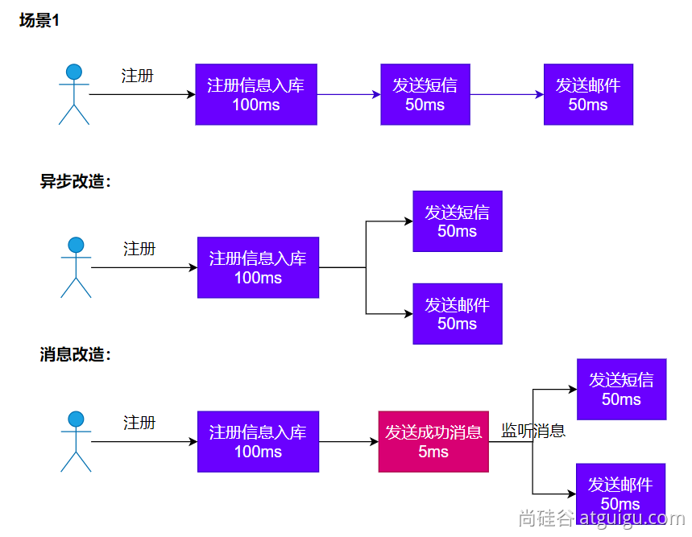
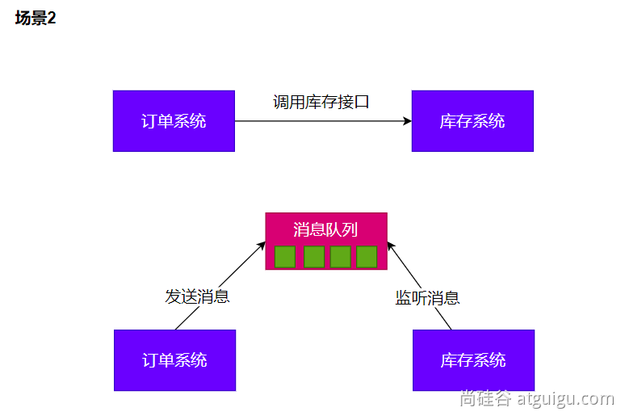
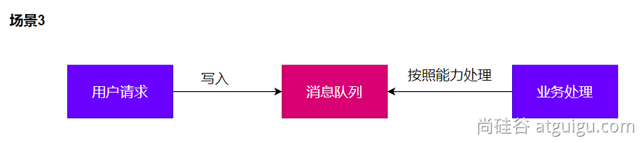
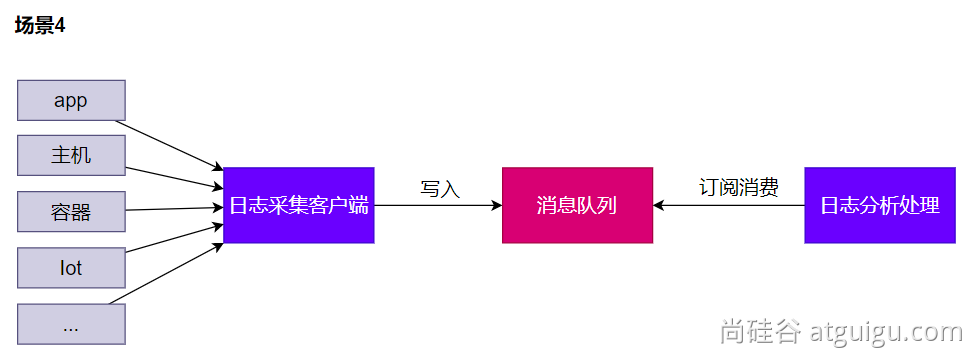
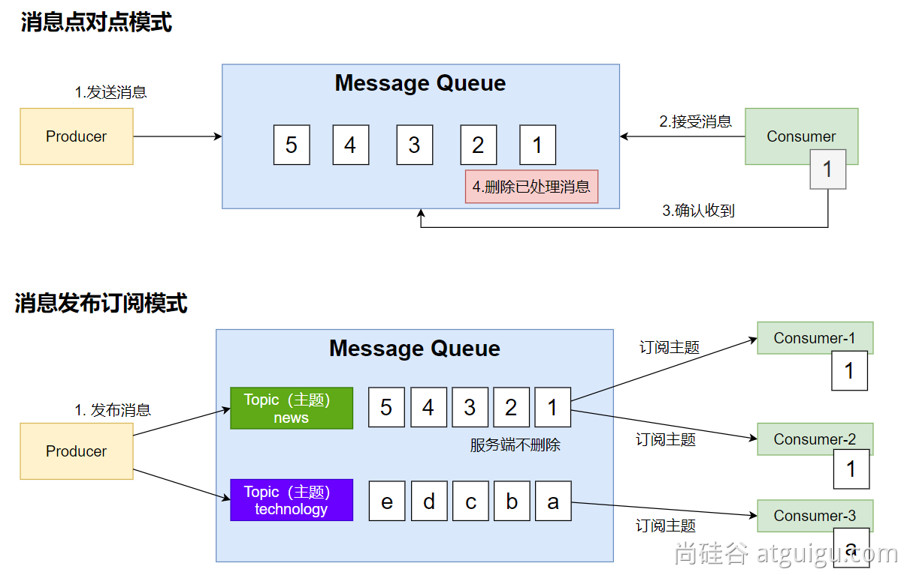
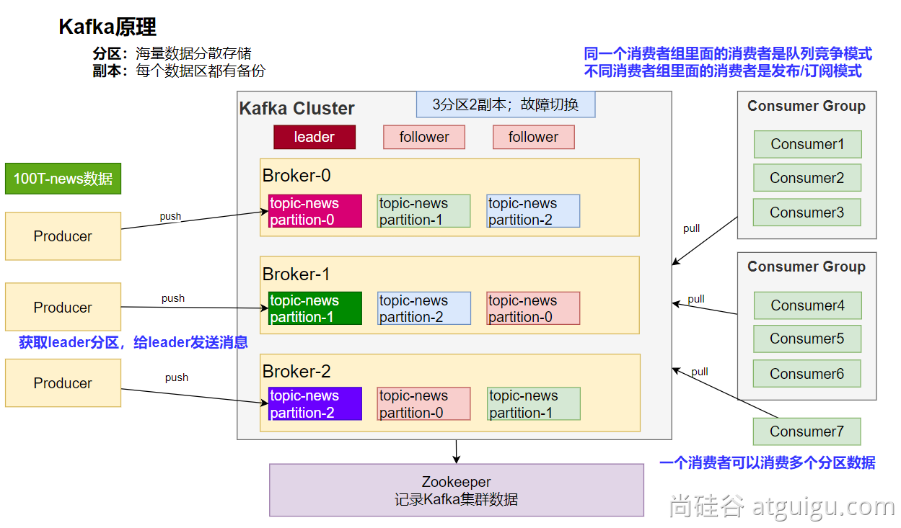

# 第11章 消息服务

## 11.1 消息队列-场景

### 11.1.1 异步



### 11.1.2 解耦



### 11.1.3 削峰



### 11.1.4 缓冲



## 11.2 消息队列-Kafka

https://kafka.apache.org/documentation/ 

### 11.2.1 消息模式



### 11.2.2 Kafka工作原理



### 11.2.3 SpringBoot整合

参照：https://docs.spring.io/spring-kafka/reference/

```xml
<dependency>
    <groupId>org.springframework.kafka</groupId>
    <artifactId>spring-kafka</artifactId>
</dependency>
```

配置

```properties
spring.kafka.bootstrap-servers=192.168.200.116:9092
```

修改`C:\Windows\System32\drivers\etc\hosts`文件，配置`192.168.200.116 kafka`

### 11.2.4 消息发送

```java
@SpringBootTest
class Boot312ApplicationTests {

    @Autowired
    private KafkaTemplate kafkaTemplate;

    @Test
    void contextLoads() {
        StopWatch sw = new StopWatch();

        sw.start();
        CompletableFuture[] futures = new CompletableFuture[10000];
        for (int i = 0; i < 10000; i++) {
            CompletableFuture future = kafkaTemplate.send("news", "haha", "hello kafka");
            futures[i] = future;
        }
        CompletableFuture.allOf(futures).join();
        sw.stop();

        System.out.println("cost time:" + sw.getTotalTimeMillis());
    }

    @Test
    void send() {
        CompletableFuture future = kafkaTemplate.send("news", "person", new Person(1L, "张三", "aaa@qq.com"));
        future.join();
        System.out.println("消息发送成功！");
    }

}
```

### 11.2.5 消息监听

```java
@Component
public class MyTopicListener {
    // 默认仅监听消息队列最新的消息
    @KafkaListener(groupId = "group1", topics = "news")
    public void onMessage1(ConsumerRecord<Object, Object> record) {
        Object key = record.key();
        Object value = record.value();
        System.out.printf("MyTopicListener group1 接收到消息：key=%s,value=%s%n", key, value);
    }

    @KafkaListener(groupId = "group2", topicPartitions = {@TopicPartition(topic = "news",
            partitionOffsets = {@PartitionOffset(partition = "0", initialOffset = "0")})})
    public void onMessage2(ConsumerRecord<Object, Object> record) {
        Object key = record.key();
        Object value = record.value();
        System.out.printf("MyTopicListener group2 接收到消息：key=%s,value=%s%n", key, value);
    }
}

```

### 11.2.6 参数配置

- 消费者

```properties
spring.kafka.consumer.value-deserializer=org.springframework.kafka.support.serializer.JsonDeserializer
spring.kafka.consumer.properties[spring.json.value.default.type]=com.example.Invoice
spring.kafka.consumer.properties[spring.json.trusted.packages]=com.example.main,com.example.another
```

- 生产者

```properties
spring.kafka.producer.key-serializer=org.apache.kafka.common.serialization.StringSerializer
spring.kafka.producer.value-serializer=org.springframework.kafka.support.serializer.JsonSerializer
spring.kafka.producer.properties[spring.json.add.type.headers]=false
```


### 11.2.7 自动配置原理

kafka 自动配置在<span style="color:red;">`KafkaAutoConfiguration`</span>

1. 容器中放了 <span style="color:red;">`KafkaTemplate`</span> 可以进行消息收发

2. 容器中放了<span style="color:red;">`KafkaAdmin`</span> 可以进行 Kafka 的管理，比如创建 topic 等

3. kafka 的配置在 <span style="color:red;">`KafkaProperties`</span> 中

4. <span style="color:red;">`@EnableKafka`</span> 可以开启基于注解的模式（该注解默认启用了）

   `org.springframework.boot.autoconfigure.kafka.KafkaAnnotationDrivenConfiguration`

   ```java
   	@Configuration(proxyBeanMethods = false)
   	@EnableKafka
   	@ConditionalOnMissingBean(name = KafkaListenerConfigUtils.KAFKA_LISTENER_ANNOTATION_PROCESSOR_BEAN_NAME)
   	static class EnableKafkaConfiguration {
   
   	}
   ```


