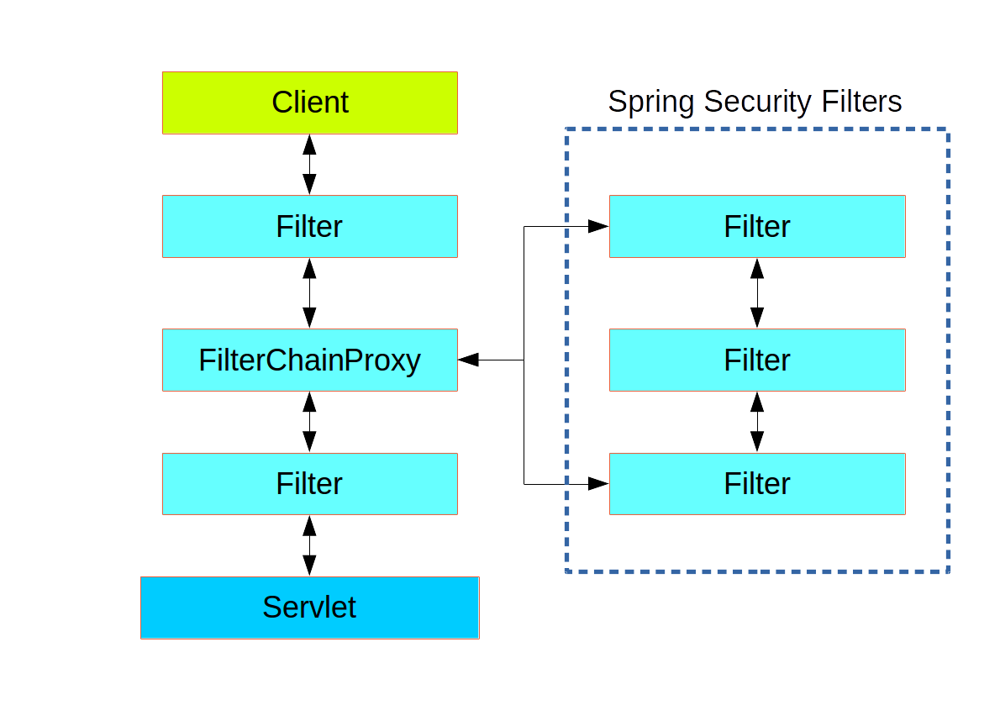
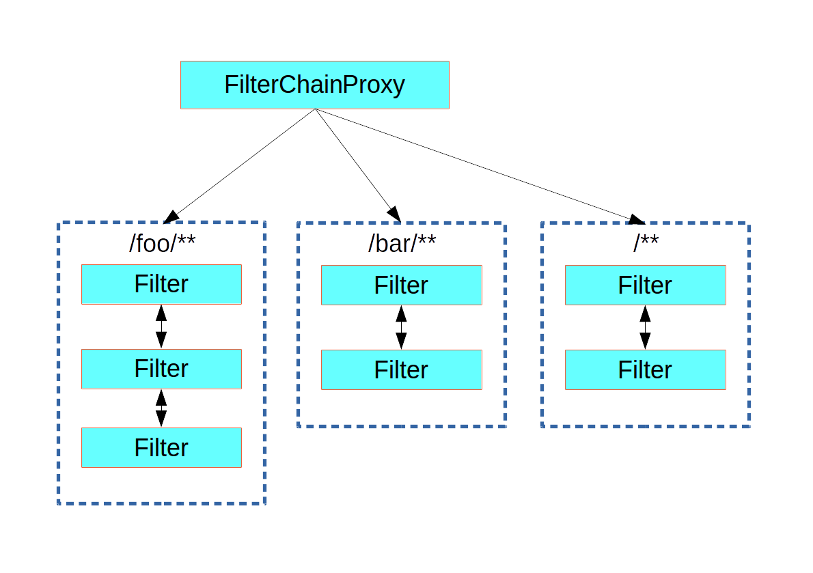
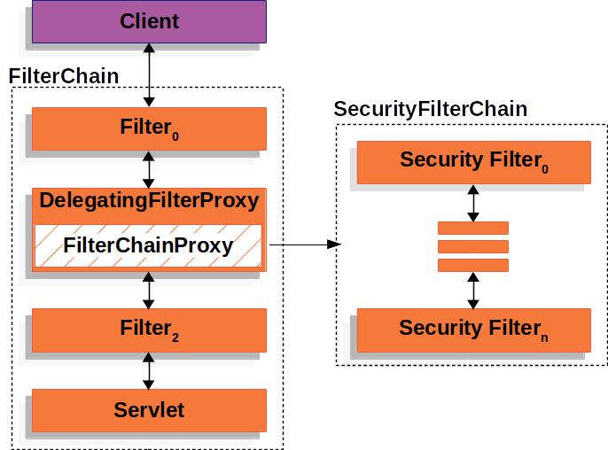

# 第12章 Web安全

- Apache Shiro

- Spring Security
- 自研：Filter

## 12.1 Spring Security

## 12.1 安全架构

### 12.1.1 认证：Authentication

> who are you?
>
> 登录系统，用户系统。

### 12.1.2 授权：Authorization

> what are you allowed to do?
>
> 权限管理，用户授权

### 12.1.3 攻击防护

> - XSS （Cross-site scripting）
> - CSRF（Cross-site request forgery）
> - CORS（Cross-Origin Resource Sharing）
> - SQL注入
> - ……

### 扩展：权限模型

#### 1 RBAC（Role Based Access Controll）

> - 用户（t_user）
>   - id，username，password，xxx
>   - 1，zhangsan
>   - 2，lisi
> - 用户_角色（t_user_role）【N对N关系需要中间表】
>   - zhangsan，admin
>   - zhangsan，common_user
>   - lisi，hr
>   - lisi，common_user
> - 角色_权限（t_role_perm）
>   - admin，文件r
>   - admin，文件w
>   - admin，文件执行
>   - admin，订单query，create，xxx
>   - hr，文件r
> - 权限（t_permission）
>   - id，perm_id
>   - 文件r，w，x
>   - 订单query，create，xxx

#### 2 ACL（Access Controll List）

> 直接用户和权限挂钩
>
> - 用户（t_user）
>
>   - zhangsan
>   - lisi
>
> - 用户——权限（t_user_perm）
>
>   - zhangsan，文件r
>   - zhangsan，文件x
>   - zhangsan，订单query
>
> - 权限（t_permission）
>
>   - id，perm_id
>   - 文件r，w，x
>
>   - 订单query，create，xxx

```java
@Secured("文件 r")
public void readFile(){
    //读文件
}
```

## 12.3 Spring Security原理

### 12.2.1 过滤器链架构

> Spring Security利用 FilterChainProxy 封装一系列拦截器链，实现各种安全拦截功能
>
> Servlet三大组件：Servlet、Filter、Listener



### 12.2.2 FilterChainProxy



### 12.2.3 SecurityFilterChain



## 12.4 使用

### 12.3.1 HttpSecurity

```java
@Configuration
@Order(SecurityProperties.BASIC_AUTH_ORDER - 10)
public class ApplicationConfigurerAdapter extends WebSecurityConfigurerAdapter {
  @Override
  protected void configure(HttpSecurity http) throws Exception {
    http.antMatcher("/match1/**")
      .authorizeRequests()
        .antMatchers("/match1/user").hasRole("USER")
        .antMatchers("/match1/spam").hasRole("SPAM")
        .anyRequest().isAuthenticated();
  }
}
```

### 12.3.2 MethodSecurity

```java
@SpringBootApplication
@EnableGlobalMethodSecurity(securedEnabled = true)
public class SampleSecureApplication {
}

@Service
public class MyService {

  @Secured("ROLE_USER")
  public String secure() {
    return "Hello Security";
  }

}
```

### 核心

- WebSecurityConfigurerAdapter
- @EnableGlobalMethodSecurity：开启全局方法安全配置
  - @Secured
  - @Preauthorize
  - @PostAuthorize
- UserDetailService：去数据库查询用户详细信息的service（用户基本信息、用户角色、用户权限）

## 12.5 实战

### 12.4.1 引入依赖

```xml
    <dependencies>
        <!-- 定义三方包 beg -->
        <dependency>
            <groupId>org.springframework.boot</groupId>
            <artifactId>spring-boot-starter-web</artifactId>
        </dependency>

        <dependency>
            <groupId>org.springframework.boot</groupId>
            <artifactId>spring-boot-starter-test</artifactId>
            <scope>test</scope>
        </dependency>

        <dependency>
            <groupId>org.springframework.boot</groupId>
            <artifactId>spring-boot-starter-security</artifactId>
        </dependency>
        <dependency>
            <groupId>org.springframework.boot</groupId>
            <artifactId>spring-boot-starter-thymeleaf</artifactId>
        </dependency>
        <dependency>
            <groupId>org.springframework.security</groupId>
            <artifactId>spring-security-test</artifactId>
            <scope>test</scope>
        </dependency>
        <dependency>
            <groupId>org.thymeleaf.extras</groupId>
            <artifactId>thymeleaf-extras-springsecurity6</artifactId>
        </dependency>

        <!--热启动功能-->
        <dependency>
            <groupId>org.springframework.boot</groupId>
            <artifactId>spring-boot-devtools</artifactId>
            <optional>true</optional><!--表示依赖不会传递-->
        </dependency>
        <!-- 定义三方包 end -->

        <!-- 定义二方包 beg -->
        <!-- 定义二方包 end -->


        <!-- 定义一方包 beg -->
        <!-- 定义一方包 end -->
    </dependencies>

```

### 12.4.2 页面

**index.html**

```xml
<!DOCTYPE html>
<html lang="en" xmlns:th="http://www.thymeleaf.org">
<head>
    <meta charset="UTF-8">
    <title>Title</title>
</head>
<body>
Welcome to the world of Spring Boot!
<hr>
<a th:href="@{/hello}">hello</a>
<a th:href="@{/world}">world</a>
<a th:href="@{/logout}">logout</a>
</body>
</html>
```

**login.html**

```html
<!DOCTYPE html>
<html lang="en" xmlns:th="http://www.thymeleaf.org">
<head>
    <title>Spring Security Example</title>
</head>
<body>
<div th:if="${param.error}">Invalid username and password.</div>
<div th:if="${param.logout}">You have been logged out.</div>
<form th:action="@{/login}" method="post">
    <div>
        <label> User Name : <input type="text" name="username"/> </label>
    </div>
    <div>
        <label> Password: <input type="password" name="password"/> </label>
    </div>
    <div><input type="submit" value="Sign In"/></div>
</form>
</body>
</html>
```

### 12.4.3 配置类

**Security配置**

```java
package com.coding.boot3.security.config;

import org.springframework.context.annotation.Bean;
import org.springframework.context.annotation.Configuration;
import org.springframework.security.config.annotation.method.configuration.EnableMethodSecurity;
import org.springframework.security.config.annotation.web.builders.HttpSecurity;
import org.springframework.security.core.authority.AuthorityUtils;
import org.springframework.security.core.userdetails.User;
import org.springframework.security.core.userdetails.UserDetails;
import org.springframework.security.core.userdetails.UserDetailsService;
import org.springframework.security.crypto.bcrypt.BCryptPasswordEncoder;
import org.springframework.security.crypto.password.PasswordEncoder;
import org.springframework.security.provisioning.InMemoryUserDetailsManager;
import org.springframework.security.web.SecurityFilterChain;

import static org.springframework.security.config.Customizer.withDefaults;

/**
 * 1、自定义请求授权规则：http.authorizeHttpRequests()
 * 2、自定义登录规则：http.formLogin()
 * 3、自定义用户信息查询规则：http.userDetailsService()
 * 4、开启方法级别的精确权限控制： @EnableMethodSecurity + @PreAuthorize("hasAuthority('world_exec')")
 */
@EnableMethodSecurity // 开启方法权限控制
@Configuration
public class AppSecurityConfiguration {

    @Bean
    SecurityFilterChain securityFilterChain(HttpSecurity http) throws Exception {
        // 请求授权
        http.authorizeHttpRequests((requests) -> {
            requests.requestMatchers("/").permitAll() // 1、首页所有人都允许
//                    .requestMatchers("/admin/**").hasRole("ADMIN")
//                    .requestMatchers("/user/**").hasRole("USER")
                    .anyRequest().authenticated(); // 2、剩下的任意请求都需要认证（登录）
        });

        // 表单登录
        // 表单登录功能：开启默认表单登录功能；Spring Security提供默认登录页
        http.formLogin(formLogin -> {
            formLogin.loginPage("/login").permitAll(); // 3、自定义登录页面，并允许所有人访问
        });
        return http.build();
    }

    // 查询用户信息
    @Bean
    public UserDetailsService userDetailsService(PasswordEncoder passwordEncoder) {
//        return username -> {
//            if ("admin".equals(username)) {
//                return new User(
//                        "admin",
//                        "{noop}123456",
//                        AuthorityUtils.commaSeparatedStringToAuthorityList("ROLE_ADMIN"));
//            }
//            return null;
//        };

        // 一旦配置了passwordEncoder，则需要使用加密后的密码进行登录， {noop} 表示明文密码，不再可用  Encoded password does not look like BCrypt
        UserDetails zsDetails = User.withUsername("zs").password(passwordEncoder.encode("123456")).roles("admin", "hr").authorities("file_read", "file_write").build();
        UserDetails lsDetails = User.withUsername("ls").password("{noop}123456").roles("hr").authorities("file_read").build();
        UserDetails wwDetails = User.withUsername("ww").password(passwordEncoder.encode("123456")).roles("admin").authorities("file_write", "world_exec").build();
        InMemoryUserDetailsManager manager = new InMemoryUserDetailsManager(zsDetails, lsDetails, wwDetails);
        return manager;
    }

    @Bean // 密码加密器
    public PasswordEncoder passwordEncoder() {
        return new BCryptPasswordEncoder();
    }
}
```

