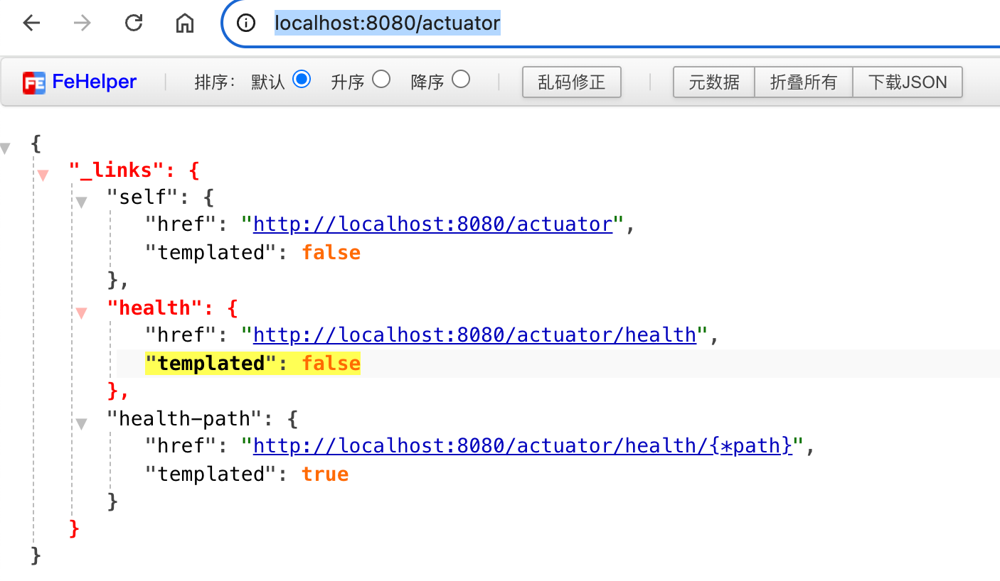
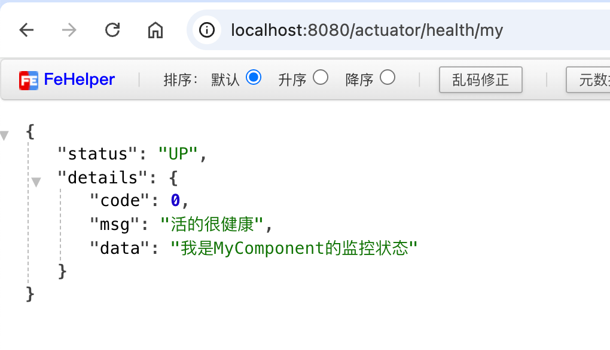
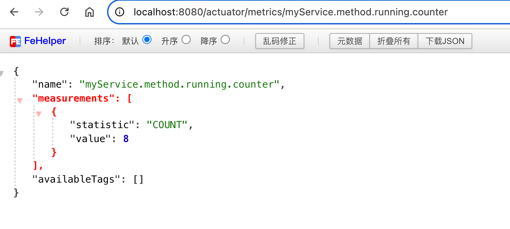
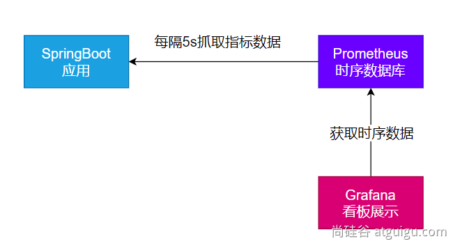
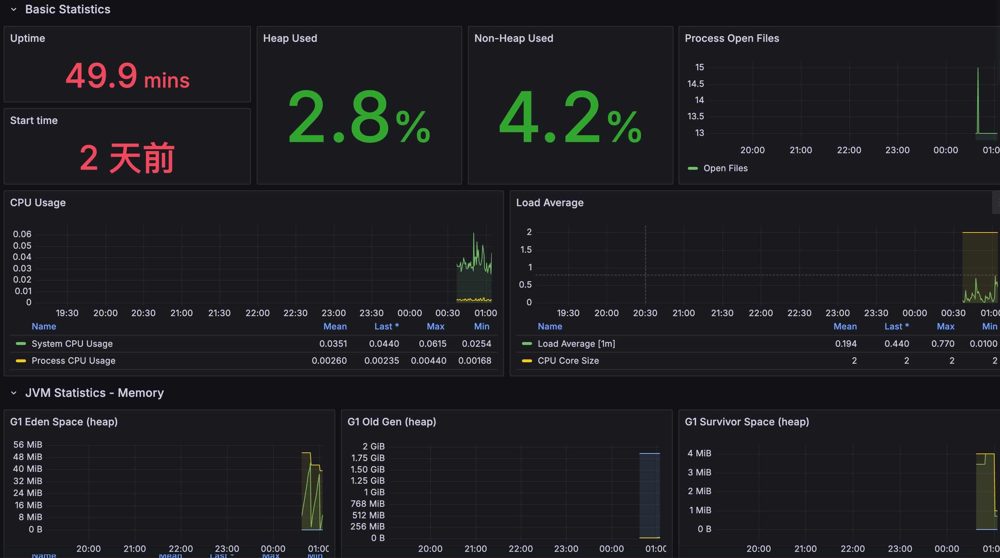

# 第13章 可观测性

> 可观测性 Observability

对线上应用进行观测、监控、预警…

- 健康状况【组件状态、存活状态】Health
- 运行指标【CPU、内存、垃圾回收、吞吐量、响应成功率】Metrics
- 链路追踪
- ……

## 13.1 SpringBoot Actuator

### 13.1.1 实战

**1 场景引入**

```xml
        <!--对微服务端点进行管理和配置监控，可观测性场景启动器，线上指标监控、运行状态监控-->
        <dependency>
            <groupId>org.springframework.boot</groupId>
            <artifactId>spring-boot-starter-actuator</artifactId>
        </dependency>
```

默认效果：

http://localhost:8080/actuator



**2 暴露指标**

```properties
# 定义端点的默认访问规则，是否允许访问；默认 true。目前已经启用，建议 management.endpoints.access.default
#management.endpoints.enabled-by-default=false
# 定义端点的默认访问规则，允许访问的限制；默认 只读访问。可选值 不允许访问、只读访问（会禁用掉 shutdown 等微信行为）和无限制访问
#management.endpoints.access.default=unrestricted
# 以web方式暴露所有监控端点
management.endpoints.web.exposure.include=*
```

**3 访问数据**

- [http://localhost:8080/actuator](http://localhost:8080/actuator/)；展示出所有可以用的监控端点
- http://localhost:8080/actuator/beans
- http://localhost:8080/actuator/configprops
- http://localhost:8080/actuator/metrics
- http://localhost:8080/actuator/metrics/jvm.gc.pause
- [http://localhost:8080/actuator/](http://localhost:8080/actuator/metrics)endpointName/detailPath

### 13.1.2 Endpoint

#### 1 常用端点

| ID                 | 描述                                                         |
| ------------------ | ------------------------------------------------------------ |
| `auditevents`      | 暴露当前应用程序的审核事件信息。需要一个`AuditEventRepository组件`。 |
| `beans`            | 显示应用程序中所有Spring Bean的完整列表。                    |
| `caches`           | 暴露可用的缓存。                                             |
| `conditions`       | 显示自动配置的所有条件信息，包括匹配或不匹配的原因。         |
| `configprops`      | 显示所有`@ConfigurationProperties`。                         |
| `env`              | 暴露Spring的属性`ConfigurableEnvironment`                    |
| `flyway`           | 显示已应用的所有Flyway数据库迁移。 需要一个或多个`Flyway`组件。 |
| `health`           | 显示应用程序运行状况信息。                                   |
| `httptrace`        | 显示HTTP跟踪信息（默认情况下，最近100个HTTP请求-响应）。需要一个`HttpTraceRepository`组件。 |
| `info`             | 显示应用程序信息。                                           |
| `integrationgraph` | 显示Spring `integrationgraph` 。需要依赖`spring-integration-core`。 |
| `loggers`          | 显示和修改应用程序中日志的配置。                             |
| `liquibase`        | 显示已应用的所有Liquibase数据库迁移。需要一个或多个`Liquibase`组件。 |
| `metrics`          | 显示当前应用程序的“指标”信息。                               |
| `mappings`         | 显示所有`@RequestMapping`路径列表。                          |
| `scheduledtasks`   | 显示应用程序中的计划任务。                                   |
| `sessions`         | 允许从Spring Session支持的会话存储中检索和删除用户会话。需要使用Spring Session的基于Servlet的Web应用程序。 |
| `shutdown`         | 使应用程序正常关闭。默认禁用。                               |
| `startup`          | 显示由`ApplicationStartup`收集的启动步骤数据。需要使用`SpringApplication`进行配置`BufferingApplicationStartup`。 |
| `threaddump`       | 执行线程转储。                                               |
| `heapdump`         | 返回`hprof`堆转储文件。                                      |
| `jolokia`          | 通过HTTP暴露JMX bean（需要引入Jolokia，不适用于WebFlux）。需要引入依赖`jolokia-core`。 |
| `logfile`          | 返回日志文件的内容（如果已设置`logging.file.name`或`logging.file.path`属性）。支持使用HTTP`Range`标头来检索部分日志文件的内容。 |
| `prometheus`       | 以Prometheus服务器可以抓取的格式公开指标。需要依赖`micrometer-registry-prometheus`。 |

`threaddump`、`heapdump`、`metrics`

#### 2 定制端点

- 健康监控：返回存活、死亡

- 指标监控：次数、频率

##### HealthEndpoint

- 组件

```java
package com.coding.boot3.actuator.component;

import org.springframework.stereotype.Component;

import java.util.Random;

@Component
public class MyComponent {

    public int check() {
        // 业务代码判断这个组件是否应该是存活状态
        return new Random().nextInt(2);
    }
}

```

- 健康端点

```java
package com.coding.boot3.actuator.health;

import com.coding.boot3.actuator.component.MyComponent;
import org.springframework.beans.factory.annotation.Autowired;
import org.springframework.boot.actuate.health.AbstractHealthIndicator;
import org.springframework.boot.actuate.health.Health;
import org.springframework.stereotype.Component;

/**
 * 1、实现 HealthIndicator 接口来定制组件的健康状态对象（Health）返回
 */
@Component
public class MyHealthIndicator extends AbstractHealthIndicator {

    @Autowired
    private MyComponent component;

    /**
     * 健康检查
     *
     * @param builder the {@link Health.Builder} to report health status and details
     */
    @Override
    protected void doHealthCheck(Health.Builder builder) {
        // 自定义检查方法
        int check = component.check();
        if (check == 0) {
            builder.up().withDetail("code", check).withDetail("msg", "活的很健康").withDetail("data", "我是MyComponent的监控状态").build();
        } else {
            builder.down().withDetail("code", check).withDetail("msg", "error service").withDetail("data", "我是MyComponent的监控状态")
//                    .withException(new RuntimeException())
                    .build();
        }
    }
}

```

- 配置

```properties
management.endpoint.health.access=read_only
# 总是显示详细信息。可显示每个模块的状态信息
management.endpoint.health.show-details=always
```

- 效果

http://localhost:8080/actuator/health/my



##### MetricsEndpoint

- 服务指标

```java
package com.coding.boot3.actuator.service;

import io.micrometer.core.instrument.Counter;
import io.micrometer.core.instrument.MeterRegistry;
import org.springframework.stereotype.Service;

@Service
public class MyService {


    Counter counter;

    /**
     * 若类只有一个有参构造器，则有参构造器的参赛，默认从容器中获取
     *
     * @param meterRegistry - 注入 meterRegistry 来保存和统计所有指标
     */
    public MyService(MeterRegistry meterRegistry) {
        counter = meterRegistry.counter("myService.method.running.counter");
    }


    public void hello() {
        System.out.println("hello");
        counter.increment();
    }
}
```

- 控制器

```java
package com.coding.boot3.actuator.controller;

import com.coding.boot3.actuator.service.MyService;
import org.springframework.beans.factory.annotation.Autowired;
import org.springframework.web.bind.annotation.GetMapping;
import org.springframework.web.bind.annotation.RestController;

@RestController
public class HelloController {

    @Autowired
    private MyService component;

    @GetMapping("/hello")
    public String hello() {
        // 业务调用
        component.hello();
        return "hello";
    }
}

```

- 效果

http://localhost:8080/actuator/metrics/myService.method.running.counter



## 13.2 监控案例落地

> 基于 Prometheus + Grafana
>
> 

### 13.2.1 安装 Prometheus + Grafana

```bash
#安装prometheus:时序数据库
docker run -p 9090:9090 -d \
-v pc:/etc/prometheus \
prom/prometheus

#安装grafana；默认账号密码 admin:admin
docker run -d --name=grafana -p 3000:3000 grafana/grafana
```

### 13.2.2 导入依赖

- pom.xml

```xml
        <dependency>
            <groupId>org.springframework.boot</groupId>
            <artifactId>spring-boot-starter-actuator</artifactId>
        </dependency>
        <dependency>
            <groupId>io.micrometer</groupId>
            <artifactId>micrometer-registry-prometheus</artifactId>
        </dependency>
```

- application.properties

```properties
management.endpoints.web.exposure.include=*
```

访问： http://localhost:8080/actuator/prometheus  验证，返回 prometheus 格式的所有指标

> 部署Java应用，为了避免端口冲突，端口调整为 9999

```bash
# 安装上传工具，Termius终端模拟器不支持ZMODEM协议，会导致卡主，建议直接使用scp或SFTP即可。
yum install lrzsz

# 安装openjdk
# 下载openjdk
wget -cP /usr/local/src/ https://download.oracle.com/otn/java/jdk/17.0.13+10/00d8a0bf05cc4f9087f2bb0f5191ea34/jdk-17.0.13_macos-aarch64_bin.tar.gz?AuthParam=1742139122_bdb4fa5687b00fdd34fe9b8ae544e1c5
# 安装openjdk
mkdir /usr/local/Java
tar -zxvf /usr/local/src/jdk-17.0.13_macos-aarch64_bin.tar.gz\?AuthParam\=1742139122_bdb4fa5687b00fdd34fe9b8ae544e1c5 -C /usr/local/Java/
ln -snf /usr/local/Java/jdk-17.0.13.jdk/ /usr/local/java

# 配置openjdk
sudo vim /etc/profile.d/jdk.sh
# 加入以下内容
export JAVA_HOME=/usr/local/java
export CLASSPATH=.:$JAVA_HOME/jre/lib/rt.jar:$JAVA_HOME/lib/dt.jar:$JAVA_HOME/lib/tools.jar
export PATH=$JAVA_HOME/bin:$PATH

# 环境变量生效
source /etc/profile

# 后台启动java应用
nohup java -jar actuator.jar > output.log 2>&1 &

```

确认可以访问到： http://192.168.200.116:9999/actuator/prometheus

### 13.2.3 配置 Prometheus 拉去数据

```properties
## 修改 prometheus.yml 配置文件
scrape_configs:
  - job_name: 'spring-boot-demo'
    metrics_path: '/actuator/prometheus' #指定抓取的路径
    static_configs:
      - targets: ['192.168.200.116:9999']
        labels:
          nodename: 'app-demo'
```

> 注意：重启 Prometheus （docker restart prometheus） 
>
> 或执行 http://192.168.200.116:9090/-/reload （【API方式已废弃】使用POST/PUT方法）加载新的配置

重启后，访问 Prometheus：http://192.168.200.116:9090/targets 查看是否包含 spring-boot-demo

### 13.2.4 配置 Grafana 监控面板

- 添加数据源（Prometheus）
- 添加面板。可去 dashboard 市场找一个自己喜欢的面板，也可以自己开发面板；[Dashboards | Grafana Labs](https://grafana.com/grafana/dashboards/?plcmt=footer)

### 13.2.5 效果



