# 第14章 AOT

## 14.1 AOT与JIT

<span style="color:#9400D3;font-weight:bold;">AOT</span>：Ahead-of-Time（提前编译）：**程序执行前**，全部被编译成**机器码**。

<span style="color:#9400D3;font-weight:bold;">JIT</span>：Just in Time（即时**编译**）：程序**边编译，边运行**。

**编译：**

- 源代码（.c、.cpp、.go、.java…），编译=====> 机器码

**语言：**

- 编译型语言：编译器
- 解释型语言：解释器

### 14.1.1 Compiler 与 Interpreter

Java：**半编译半解释**

https://anycodes.cn/editor

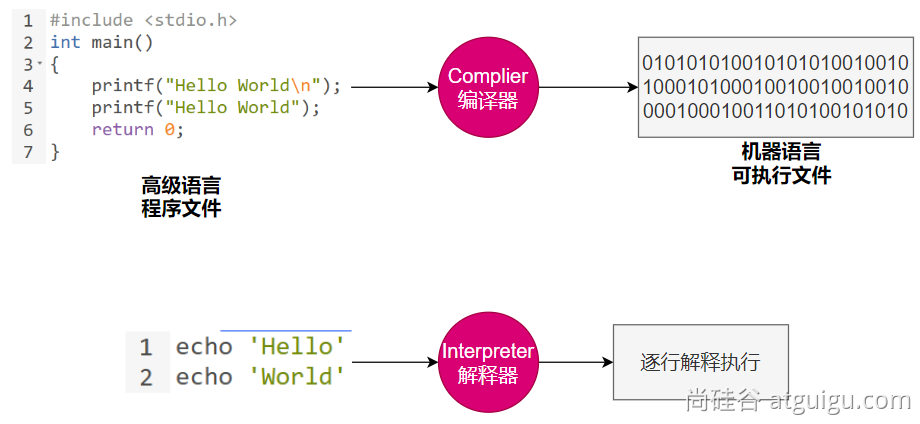

### 14.1.2 AOT与JIT对比

| 对比项                 | **编译器**                                         | **解释器**                                               |
| ---------------------- | -------------------------------------------------- | -------------------------------------------------------- |
| **机器执行速度**       | **快**，因为源代码只需被转换一次                   | **慢**，因为每行代码都需要被解释执行                     |
| **开发效率**           | **慢**，因为需要耗费大量时间编译                   | **快**，无需花费时间生成目标代码，更快的开发和测试       |
| **调试**               | **难以调试**编译器生成的目标代码                   | **容易调试**源代码，因为解释器一行一行地执行             |
| **可移植性（跨平台）** | 不同平台需要重新编译目标平台代码                   | 同一份源码可以跨平台执行，因为每个平台会开发对应的解释器 |
| **学习难度**           | 相对较高，需要了解源代码、编译器以及目标机器的知识 | 相对较低，无需了解机器的细节                             |
| **错误检查**           | 编译器可以在编译代码时检查错误                     | 解释器只能在执行代码时检查错误                           |
| **运行时增强**         | 无                                                 | 可以**动态增强**                                         |

在OpenJDK的官方Wiki上，介绍了HotSpot虚拟机一个相对比较全面的、**即时编译器（JIT）**中采用的[优化技术列表](https://wiki.openjdk.org/display/HotSpot/PerformanceTacticIndex)。

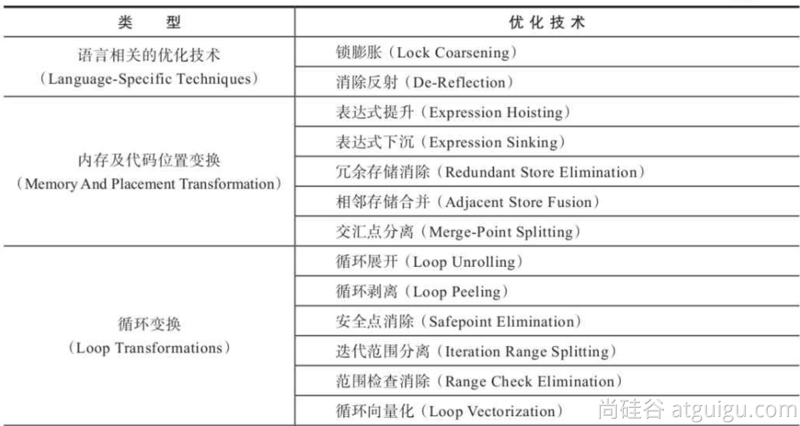


可使用：-XX:+PrintCompilation 打印JIT编译信息


### 14.1.3 JVM架构

.java === .class === 机器码

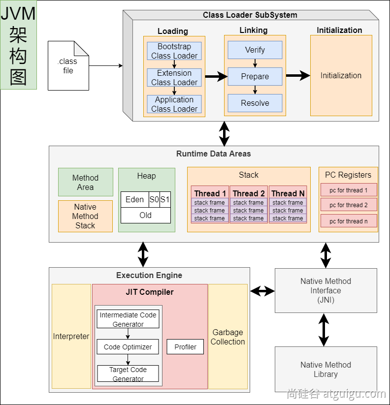

**JVM**：既有**解释器**，又有**编译器（JIT：即时编译）**；


### 14.1.4 Java的执行过程

> 建议阅读：
>
> - 美团技术：https://tech.meituan.com/2020/10/22/java-jit-practice-in-meituan.html
>
> - openjdk官网：https://wiki.openjdk.org/display/HotSpot/Compiler

#### 1 流程概要

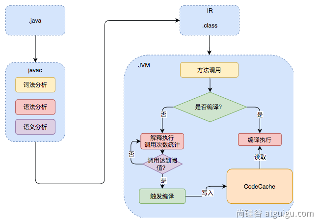

解释执行：

编译执行：

#### 2 详细流程

热点代码：调用次数非常多的代码

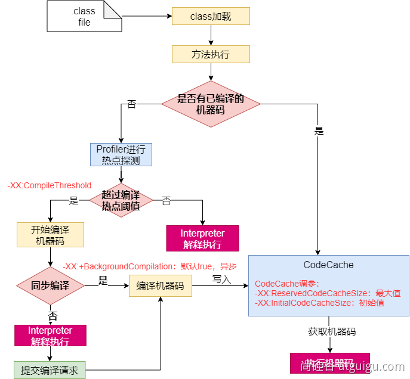

### 14.1.5 JVM编译器

JVM中集成了两种编译器，Client Compiler 和 Server Compiler；

- Client Compiler注重启动速度和局部的优化
- Server Compiler更加关注全局优化，性能更好，但由于会进行更多的全局分析，所以启动速度会慢。

Client Compiler：

- HotSpot VM带有一个Client Compiler **C1编译器**
- 这种编译器**启动速度快**，但是性能比较Server Compiler来说会差一些。
- 编译后的机器码执行效率没有C2的高

Server Compiler：

- Hotspot虚拟机中使用的Server Compiler有两种：**C2** 和 **Graal**。
- 在Hotspot VM中，默认的Server Compiler是**C2编译器。**

### 14.1.6 分层编译

Java 7开始引入了分层编译(**Tiered Compiler**)的概念，它结合了**C1**和**C2**的优势，追求启动速度和峰值性能的一个平衡。分层编译将JVM的执行状态分为了五个层次。**五个层级**分别是：

- 解释执行。
- 执行不带profiling的C1代码。
- 执行仅带方法调用次数以及循环回边执行次数profiling的C1代码。
- 执行带所有profiling的C1代码。
- 执行C2代码。

**profiling就是收集能够反映程序执行状态的数据**。其中最基本的统计数据就是方法的调用次数，以及循环回边的执行次数。

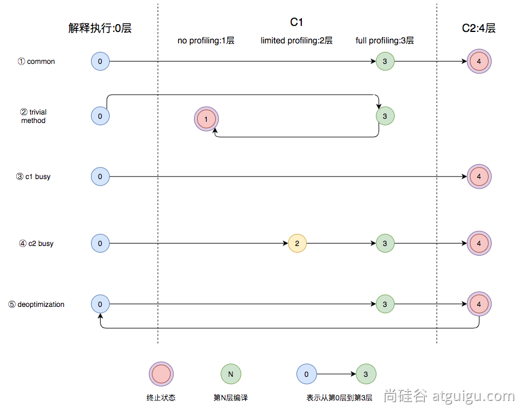

- 图中第①条路径，代表编译的一般情况，**热点方法**从解释执行到被3层的C1编译，最后被4层的C2编译。
- 如果**方法比较小**（比如Java服务中常见的**getter/setter**方法），3层的profiling没有收集到有价值的数据，JVM就会断定该方法对于C1代码和C2代码的执行效率相同，就会执行图中第②条路径。在这种情况下，JVM会在3层编译之后，放弃进入C2编译，**直接选择用1层的C1编译运行**。
- 在**C1忙碌**的情况下，执行图中第③条路径，在解释执行过程中对程序进行**profiling** ，根据信息直接由第4层的**C2编译**。
- 前文提到C1中的执行效率是**1层>2层>3层**，**第3层**一般要比**第2层**慢35%以上，所以在**C2忙碌**的情况下，执行图中第④条路径。这时方法会被2层的C1编译，然后再被3层的C1编译，以减少方法在**3层**的执行时间。
- 如果**编译器**做了一些比较**激进的优化**，比如分支预测，在实际运行时**发现预测出错**，这时就会进行**反优化**，重新进入**解释执行**，图中第⑤条执行路径代表的就是**反优化**。

总的来说，C1的编译速度更快，C2的编译质量更高，分层编译的不同编译路径，也就是JVM根据当前服务的运行情况来寻找当前服务的最佳平衡点的一个过程。从JDK 8开始，JVM默认开启分层编译。

**云原生**：Cloud Native； Java小改版；


最好的效果：

存在的问题：

- java应用如果用jar，解释执行，热点代码才编译成机器码；初始启动速度慢，初始处理请求数量少。
- 大型云平台，要求每一种应用都必须秒级启动。每个应用都要求效率高。

希望的效果：

- java应用也能提前被编译成**机器码**，随时**急速启动**，一启动就急速运行，最高性能
- 编译成机器码的好处：

- 另外的服务器还需要安装Java环境
- 编译成**机器码**的，可以在这个平台 Windows X64 **直接运行**。

**原生**镜像：**native**-image（机器码、本地镜像）

- 把应用打包成能适配本机平台 的可执行文件（机器码、本地镜像）

## 14.2 GraalVM

https://www.graalvm.org/

> **GraalVM**是一个高性能的**JDK**，旨在**加速**用Java和其他JVM语言编写的**应用程序**的**执行**，同时还提供JavaScript、Python和许多其他流行语言的运行时。 
>
> **GraalVM**提供了**两种**运行**Java应用程序**的方式：
>
> - 1. 在HotSpot JVM上使用**Graal即时（JIT）编译器**
> - 2. 作为**预先编译（AOT）**的本机**可执行文件**运行（**本地镜像**）。
>
>  GraalVM的多语言能力使得在单个应用程序中混合多种编程语言成为可能，同时消除了外部语言调用的成本。

### 14.2.1 架构

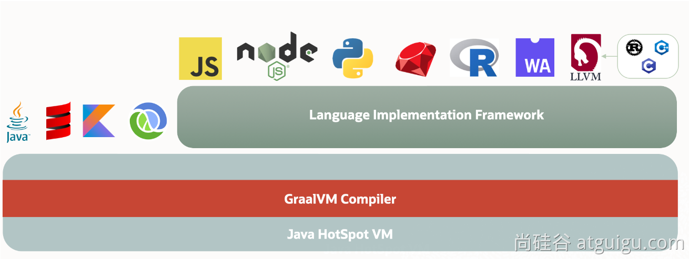

### 14.2.2 Mac 安装

> 跨平台提供原生镜像原理：

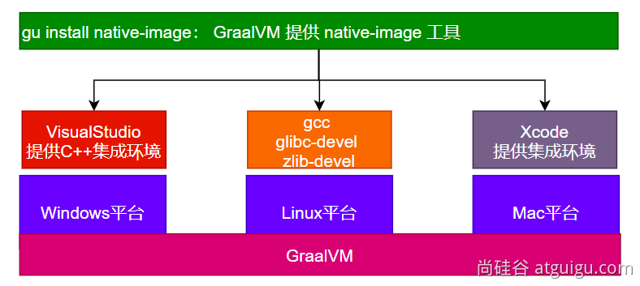

> 各个平台先决条件安装文档介绍：https://www.graalvm.org/latest/reference-manual/native-image/
>
> 其中Windows平台下需要安装 [Visual Studio 2022 version](https://visualstudio.microsoft.com/zh-hans/vs/) 17.6.0 or later,and Microsoft Visual C++(MSVC)。

#### 1 安装 GraavlVM

下载 GraalVM + native-image


1. 添加 GraalVM 的 Homebrew Tap：

```bash
% brew tap graalvm/tap
```

2. 安装 GraalVM（以 Java 17 为例）：

```bash
% brew install graalvm-ce-java17
```

3. 首次使用会收到警告，可以如下命令禁用警告

```bash
% xattr -r -d com.apple.quarantine "/Library/Java/JavaVirtualMachines/graalvm-ce-java17-22.3.1"
```

4. 验证

```bash
% /Library/Java/JavaVirtualMachines/graalvm-ce-java17-22.3.1/Contents/Home/bin/java -version
openjdk version "17.0.6" 2023-01-17
OpenJDK Runtime Environment GraalVM CE 22.3.1 (build 17.0.6+10-jvmci-22.3-b13)
OpenJDK 64-Bit Server VM GraalVM CE 22.3.1 (build 17.0.6+10-jvmci-22.3-b13, mixed mode, sharing)
```

5. 加入 jEnv 管理

```bash
% jenv add /Library/Java/JavaVirtualMachines/graalvm-ce-java17-22.3.1/Contents/Home       
graalvm64-17.0.6 added
17.0.6 added
 17.0 already present, skip installation
 17 already present, skip installation
```

6. 创建graalvm目录，并使用jenv设置改目录java版本

```bash
% mkdir graalvm
% jenv local 17.0.6
# 验证
% java -version
openjdk version "17.0.6" 2023-01-17
OpenJDK Runtime Environment GraalVM CE 22.3.1 (build 17.0.6+10-jvmci-22.3-b13)
OpenJDK 64-Bit Server VM GraalVM CE 22.3.1 (build 17.0.6+10-jvmci-22.3-b13, mixed mode, sharing)
```

7. 查看GraalVM工具链：

```bash
# 应列出已安装的 GraalVM 组件（如 Native Image）。
% gu list
ComponentId              Version             Component name                Stability                     Origin 
---------------------------------------------------------------------------------------------------------------------------------
graalvm                  22.3.1              GraalVM Core                  Experimental  
```

#### 2 安装 Native Image

- 先决条件

**Native Image 编译失败**：安装 Xcode 命令行工具

```bash
% xcode-select --install
```

GraalVM 的 Native Image 工具用于将 Java 应用编译为原生可执行文件：

```bash
% gu install native-image
```

#### 3 验证

```shell
$ native-image --version
zsh: command not found: native-image
$ source ~/.zshrc
% native-image --version
GraalVM 22.3.1 Java 17 CE (Java Version 17.0.6+10-jvmci-22.3-b13)
```

### 14.2.3 Mac 测试

#### 1 创建项目

- 创建普通java项目。编写HelloWorld类；

  - 使用`mvn clean package`进行打包

  - 确认jar包是否可以执行`java -jar xxx.jar`

  - 可能需要给 `MANIFEST.MF`添加 `Main-Class: 你的主类`

#### 2 编译镜像

- 编译为原生镜像（native-image）

```bash
% native-image -cp aot-normal.jar com.coding.boot3.aot.normal.MainApplication -o Haha
```

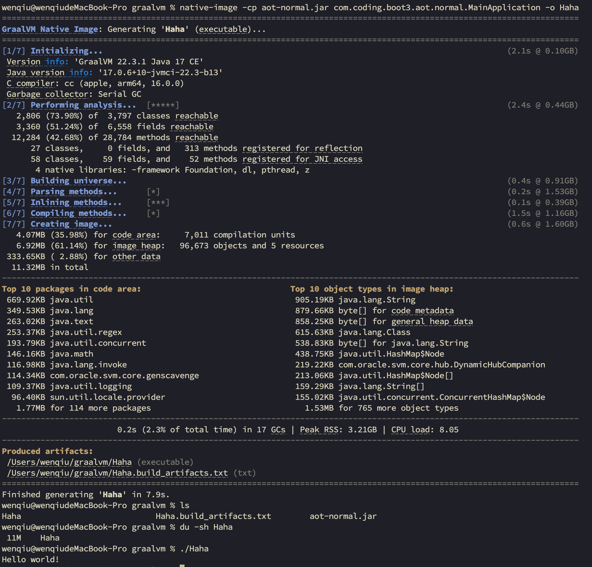

> 也可以直接指定类路径：
>
> ```bash
> % native-image -cp /Users/wenqiu/IdeaProjects/backend-spring-learning/spring-boot-3.x/boot3-15-aot-normal/target/classes com.coding.boot3.aot.normal.MainApplication -o Hehe
> ```

### 14.2.4 Linux平台安装与测试

#### 1 安装gcc等环境

```shell
% sudo dnf install gcc glibc-devel zlib-devel
```

#### 2 安装GraalVM

- 下载：https://www.graalvm.org/downloads/
- 安装：GraalVM、native-image
- 配置：JAVA环境变量为GraalVM

```shell
# 下载
$ wget -cP /usr/local/src/ https://download.oracle.com/otn/utilities_drivers/oracle-labs/graalvm-jdk-17.0.14_linux-aarch64_bin.tar.gz?AuthParam=1742305789_d444dbf2d812480c2f16ffe6c7c01bb5
# 安装
$ mkdir /usr/local/Java
$ tar -zxvf /usr/local/src/graalvm-jdk-17.0.14_linux-aarch64_bin.tar.gz\?AuthParam\=1742305789_d444dbf2d812480c2f16ffe6c7c01bb5 -C /usr/local/Java/
$ ln -snf /usr/local/Java/graalvm-jdk-17.0.14+8.1/ /usr/local/java

# 配置openjdk
sudo vim /etc/profile.d/jdk.sh
# 加入以下内容
export JAVA_HOME=/usr/local/java
export CLASSPATH=.:$JAVA_HOME/jre/lib/rt.jar:$JAVA_HOME/lib/dt.jar:$JAVA_HOME/lib/tools.jar
export PATH=$JAVA_HOME/bin:$PATH

# 环境变量生效
source /etc/profile
```

#### 3 安装native-image

```shell
$ gu install native-image
```

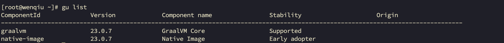

#### 4 编译为原生程序

使用native-image编译jar为原生程序

```shell
$ native-image -cp aot-normal.jar com.coding.boot3.aot.normal.MainApplication -o Haha
```

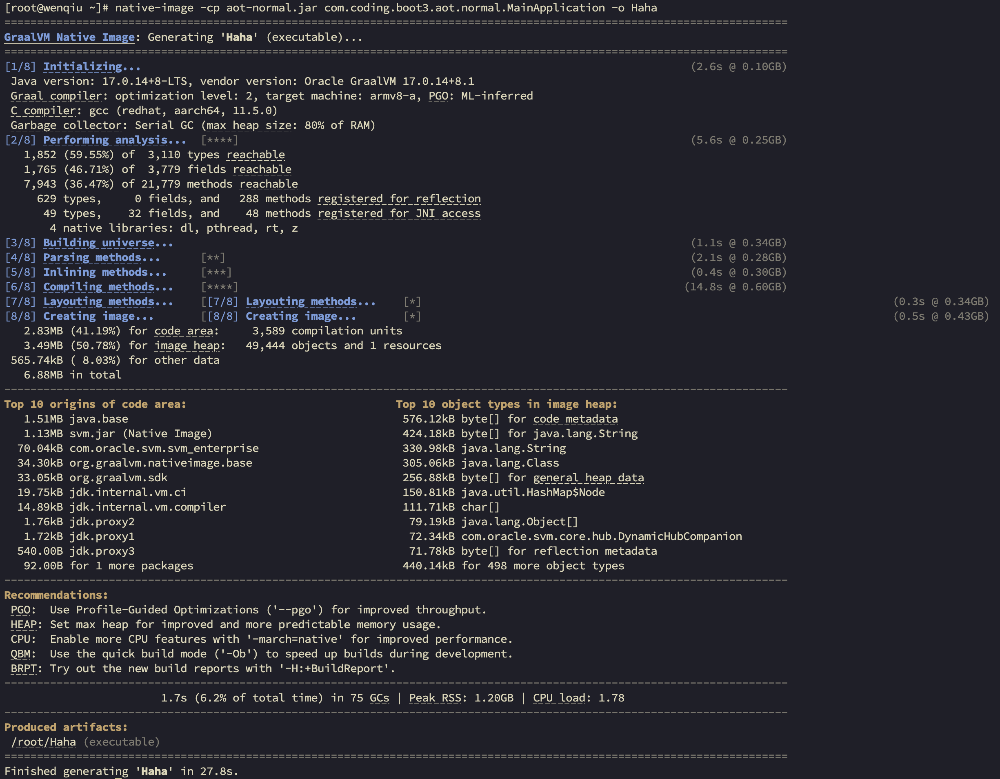

## 14.3 SpringBoot整合

### 14.3.1 依赖导入

```xml
    <build>
        <finalName>aot-springboot</finalName>
        <plugins>
            <plugin>
                <groupId>org.graalvm.buildtools</groupId>
                <artifactId>native-maven-plugin</artifactId>
            </plugin>
            <plugin>
                <groupId>org.springframework.boot</groupId>
                <artifactId>spring-boot-maven-plugin</artifactId>
            </plugin>
        </plugins>
    </build>

```

### 14.3.2 生成native-image

1、运行aot提前处理命令：

```bash
% mvn clean compile spring-boot:process-aot
```

2、运行native打包： （备注：`mvn native:build` 已经过时了）

```bash
% mvn native:compile-no-fork -Pnative
```

> [WARNING] 'native:build' goal is deprecated. Use 'native:compile-no-fork' instead.


# 响应式编程篇

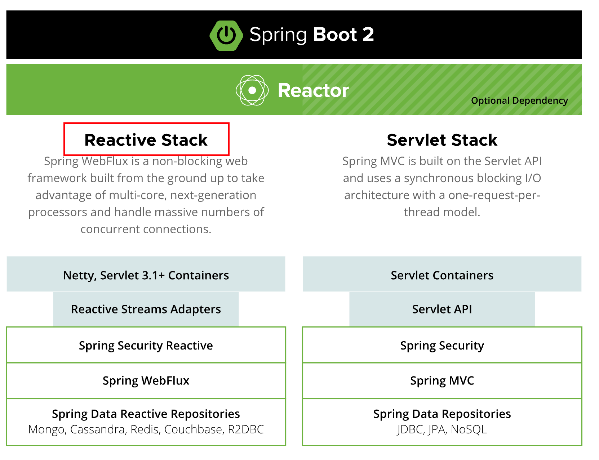

