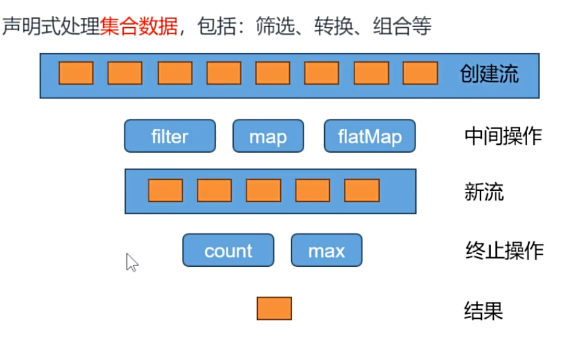
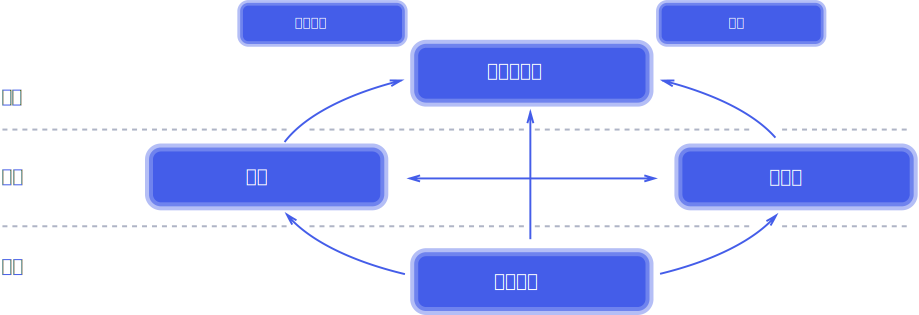
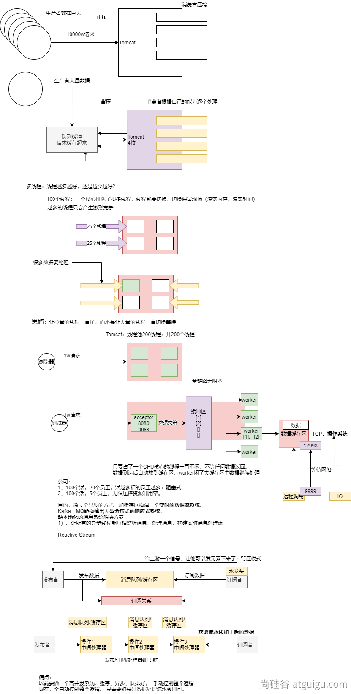
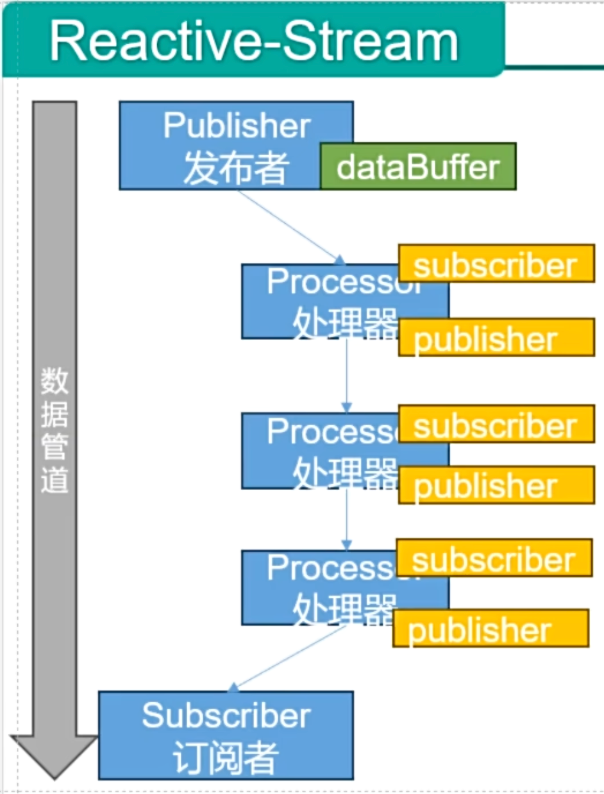
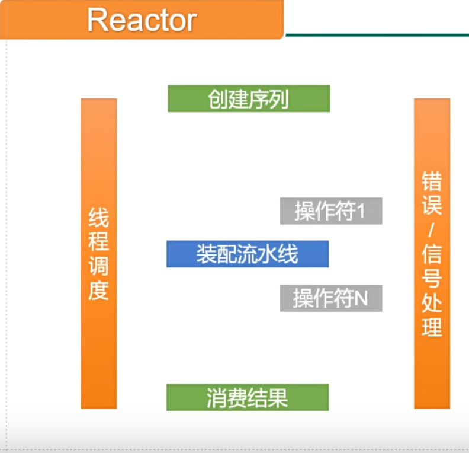
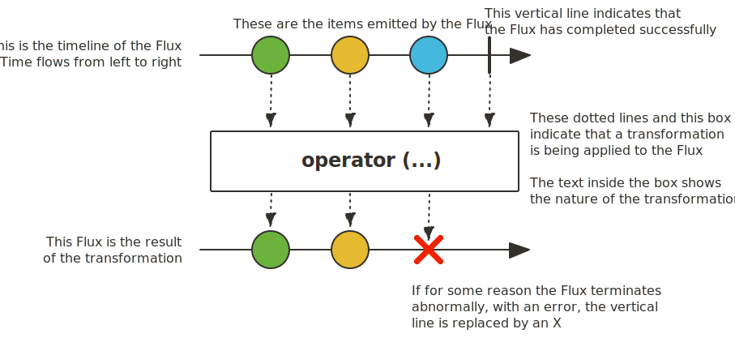
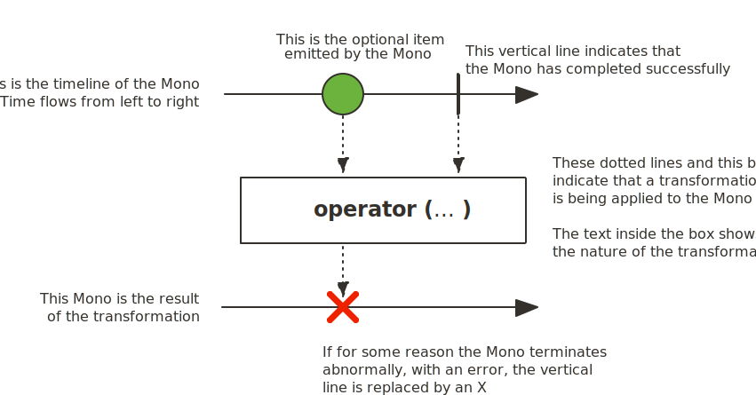

# 第15章 Reactor核心

## 15.1 前置知识

### 15.1.1 Lambda

Java8语法糖：

```java
package com.coding.reactor.stream.lambda;

import java.util.ArrayList;
import java.util.Collections;
import java.util.Comparator;

// 函数式接口：只要是函数式接口就可以用Lambda表达式简化
// 函数式接口，接口中有且只有一个未实现的方法，这个接口就叫函数式接口
@FunctionalInterface
interface MyInterface {
    int sum(int i, int j);
}

@FunctionalInterface // 检查注解，帮我们快速检查我们写的接口是否是函数式接口
interface MyHaha {
    default void haha() {
    }

    void haha2();
}

// 1、自己写实现类
class MyInterfaceImpl implements MyInterface {
    @Override
    public int sum(int i, int j) {
        return i + j;
    }
}

public class Lambda {

    /**
     * Lambda简化函数式接口
     *
     * @param args
     */
    public static void simplifiedFunctionalInterface(String[] args) {
        // 1.自己创建实现类对象
        MyInterface myInterface = new MyInterfaceImpl();
        System.out.println(myInterface.sum(1, 2));

        // 2.创建匿名实现类
        MyInterface myInterface2 = new MyInterface() {
            @Override
            public int sum(int i, int j) {
                return i * i + j * j;
            }
        };
        System.out.println(myInterface2.sum(1, 2));

        // 3.使用lambda表达式
        MyInterface myInterface3 = (i, j) -> i * i + j * j;
        System.out.println(myInterface3.sum(1, 2));
    }

    public static void main(String[] args) {
        var names = new ArrayList<String>();
        names.add("Alice");
        names.add("Bob");
        names.add("Charlie");
        names.add("David");
        names.sort(new Comparator<String>() {
            @Override
            public int compare(String o1, String o2) {
                return o1.compareTo(o2);
            }
        }); // 正序
        // 直接写函数式接口
        names.sort((o1, o2) -> o2.compareTo(o1)); // 倒序
        // 调用工具方法逆向排序
        names.sort(Comparator.naturalOrder()); // 正序
        names.sort(Comparator.reverseOrder()); // 正序
        // 类::方法；引用类中的实例方法
        names.sort(String::compareTo); // 正序

        System.out.println(names);

        // ==================================================华丽的分割线==================================================

        new Thread(new Runnable() {
            @Override
            public void run() {
                System.out.println("Hello，问秋！");
            }
        }).start();
        new Thread(() -> System.out.println("Hello，问秋！")).start();
    }
}

```


### 15.1.2 Function

函数式接口的出入参定义：

1. 有入参，无出参【**消费者**】：function.accept

```java
        BiConsumer<String, String> consumer = (a, b) -> {
            System.out.println("哈哈：" + a + "；呵呵：" + b);
        };
        consumer.accept("1", "2");
```

2. 有入参，有出参【**多功能函数**】：function.apply

```java
        Function<String, Integer> function = Integer::parseInt;
        System.out.println(function.apply("123"));
```

3. 无入参，无出参【**普通函数**】：

```java
        Runnable runnable = () -> System.out.println("runnable");
        new Thread(runnable).start();
```

4. 无入参，有出参【**提供者**】：supplier.get()

```java
        Supplier<String> supplier = () -> UUID.randomUUID().toString();
        System.out.println(supplier.get());
```

java.util.function包下的所有function定义：

- Consumer： 消费者
- Supplier： 提供者
- Predicate： 断言

get/test/apply/accept调用的函数方法；

#### 内置Function

https://blog.csdn.net/TianKongShuLovey/article/details/144897367

| BiConsumer                                                | IntBinayOperator     | ObjDoubleConsumer                                          |
| --------------------------------------------------------- | -------------------- | ---------------------------------------------------------- |
| BiFunction                                                | IntConsumer          | ObjIntConsumer                                             |
| BinaryOperator                                            | IntFunction          | ObjLongConsumer                                            |
| BiPredicate                                               | IntPredicate         | <span style="color:red;font-weight:bold;">Predicate</span> |
| BooleanSupplier                                           | IntSupplier          | <span style="color:red;font-weight:bold;">Supplier</span>  |
| <span style="color:red;font-weight:bold;">Consumer</span> | IntToDoubleFunction  | ToDoubleBiFunction                                         |
| DoubleBinaryOperator                                      | IntToLongFunction    | ToDoubleFunction                                           |
| DoubleConsumer                                            | IntUnaryOperator     | ToIntBiFunction                                            |
| DoubleFunction                                            | LongBinaryOperator   | ToIntFunction                                              |
| DoublePredicate                                           | LongConsumer         | ToLongBiFunction                                           |
| DoubleSupplier                                            | LongFunction         | ToLongFunction                                             |
| DoubleToIntFunction                                       | LongFunction         | UnaryOperator                                              |
| DoubleToLongFunc#                                         | LongPredicate        |                                                            |
| DoubleUnaryOperator                                       | LongSupplier         |                                                            |
| <span style="color:red;font-weight:bold;">Function</span> | LongToDoubleFunction |                                                            |
|                                                           | LongToIntFunction    |                                                            |
|                                                           | LongUnaryOperator    |                                                            |

### 15.1.3 StreamAPI



最佳实战：以后凡是你写for循环处理数据的统一全部用StreamAPI进行替换；

Stream所有数据和操作被组合成流管道：

- 一个数据源（可以是一个数组、集合、生成器函数、I/O管道）
- 零或多个中间操作（将一个流变形成另一个流）
- 一个终止操作（产生最终结果）

#### 创建流

- Stream.of(1, 2, 3);
- Stream.builder().add("11").add("22").build();
- Stream.empty();
- Stream.generate(() -> 1).limit(10);
- Stream.concat(Stream.of(4, 5, 6), integerStream);
- Stream.iterate(0, i -> i + 2).limit(10);

- Stream.ofNullable("给定一个元素，该元素可为null");

#### 中间操作：Intermediate Operations

- filter：过滤；挑出我们用的元素
- map：映射；一一映射，a变成b
  - mapToInt、mapToLong、mapToDouble
- flatMap：打散、散列、展开、扩维：一对多映射

```java
filter、
map、mapToInt、mapToLong、mapToDouble
flatMap、flatMapToInt、flatMapToLong、flatMapToDouble
mapMulti、mapMultiToInt、mapMultiToLong、mapMultiToDouble、
parallel、unordered、onClose、sequential
distinct、sorted、peek、limit、skip、takeWhile、dropWhile、
```

#### 终止操作：Terminal Operations

```java
forEach、forEachOrdered、toArray、reduce、collect、toList、min、
max、count、anyMatch、allMatch、noneMatch、findFirst、findAny、iterator
```

### 15.1.4 Reactive-Streams

#### 1 标准和规范

https://www.reactive-streams.org/

响应式宣言：  https://reactivemanifesto.org/

响应式宣言中文版： https://reactivemanifesto.org/zh-CN

**Reactive Streams是JVM面向流的库的**<span style="color:red;font-weight:bold;">标准和规范</span>

1. 处理可能无限数量的元素
2. 有序
3. 在组件之间异步传递元素
4. 强制性**非阻塞**、**背压模式**



基于异步、消息驱动的全事件回调系统：响应式系统。

<span style="color:#FFD700;font-weight:bold;font-size:18px;">引入一个缓冲区，引入消息队列，就能实现全系统、全异步、不阻塞、不等待、实时响应</span>



#### 2 API Components

1. <span style="color:red;font-weight:bold;">Publisher：发布者</span>产生数据流

2. <span style="color:red;font-weight:bold;">Subscriber：订阅者</span>消费数据流

3. <span style="color:red;font-weight:bold;">Subscription：订阅关系</span>
   1. 订阅关系是发布者和订阅者之间的关键接口。订阅者通过订阅来表示对发布者产生的数据的兴趣。订阅者可以请求一定数量的元素，也可以取消订阅。

4. <span style="color:red;font-weight:bold;">Processor：处理器</span>
   1. 处理器是同时实现了发布者和订阅者接口的组件。它可以接收来自一个发布者的数据，进行处理，并将结果发布给下一个订阅者。处理器在Reactor中充当中间环节，<span style="color:#1E90FF;font-weight:bold;">代表一个处理阶段</span>，允许你在数据流中进行转换、过滤和其他操作。

这种模型遵循 Reactive Streams 规范，确保了异步流的一致性和可靠性。



#### 3 响应式编程：

1. 底层：基于数据缓冲队列 + 消息驱动模型 + 异步回调机制
2. 编码：流式编程 + 链式调用 + 声明式API

3. 效果：优雅全异步 + 消息实时处理 + 高吞吐量 + 占用少量资源

<span style="color:red;font-weight:bold;">使用少量资源处理大量并发的一种解决方案。</span>

#### 4 响应式编程解决的痛点

以前：要做一个高并发系统：缓存、异步、排队；**手动控制整个逻辑**。

现在：**全自动控制整个逻辑**，开发者只需要组装好数据处理流水线即可。

> 高并发：缓存、异步、队排好
>
> 高可用：分片、复制、选领导

非阻塞的原理：缓冲 + 回调

少量线程一直运行 > 大量线程切换等待

## 15.2 Reactor（3.7.4版）

官网：https://projectreactor.io

Reactor是基于 Reactive Streams 的第四代响应式库规范，用于在JVM上构建非阻塞应用程序；

### 15.2.0 响应式编程模型



主要概念：

- 发布者（Publisher）
- 订阅者（Subscriber）
- 订阅关系（Subscription）
- 处理器（Processor）
- 调度器（Scheduler）
- 事件/信号（event/signal）
- 序列/流（sequence/stream）
- 元素（element/item）
- 操作符（operator）


### 15.2.1 快速上手

#### 介绍

Reactor是一个用于JVM的完全非阻塞的响应式编程框架，具备高效的需求管理（即对”背压（backpressure）“的控制）能力。它与Java8函数式API直接集成，比如<span style="color:#FF1493;">CompletableFuture</span>，<span style="color:#FF1493;">Stream</span>以及<span style="color:#FF1493;">Duration</span>。它提供了异步序列API <span style="color:#FF1493;">Flux</span>（用于[N]个元素）和<span style="color:#FF1493;">Mono</span>（用于[0|1]个元素），并完全遵循和实现了“响应式扩展规范”（Reactive Extensions Specification）。

Reactor的 <span style="color:#FF1493;">reactor-ipc</span> 组件还支持非阻塞的进程间通信（inter-process communication，IPC）。Reactor IPC为HTTP（包括Websockets）、TCP和UDP提供了支持背压的网络引擎，从而适合应用于微服务架构。并且完整支持响应式编解码（reactive encoding and decoding）。

#### 依赖定义

```xml
<dependencyManagement>
    <dependencies>
        <dependency>
            <groupId>io.projectreactor</groupId>
            <artifactId>reactor-bom</artifactId>
            <version>2024.0.4</version>
            <type>pom</type>
            <scope>import</scope>
        </dependency>
    </dependencies>
</dependencyManagement>
```

#### 依赖引用

```xml
<dependencies>
    <dependency>
        <groupId>io.projectreactor</groupId>
        <artifactId>reactor-core</artifactId>

    </dependency>
    <dependency>
        <groupId>io.projectreactor</groupId>
        <artifactId>reactor-test</artifactId>
        <scope>test</scope>
    </dependency>
</dependencies>
```

### 15.2.2 响应式编程

> 响应式编程是一种关注于**数据流（data streams）**和**变化传递（propagation of change）**的**异步编程**方式。
>
> 这意味着它可以用既有的编程语言表达静态（如数组）或动态（如事件源）的数据流。

了解历史：

- 在响应式编程方面，微软跨出了第一步，它在 .NET 生态中创建了响应式扩展库（Reactive Extensions library，Rx）。接着 RxJava 在JVM上实现了响应式编程。后来，在 JVM 平台出现了一套标准的响应式编程规范，它定义了一系列标准接口和交互规范。并整合到 Java 9 中（使用<span style="color:#FF1493;font-weight:bold;">Flow</span>类）。
- 响应式编程通常作为面向对象编程中的“观察者模式”（Observer design pattern）的一种扩展。响应式流（reactive streams）与“迭代子模式”（Iterator design pattern）也有相通之处，因为其中也有<span style="color:#FF1493;">Iterable-Iterator</span>这样的对应关系。主要的区别在于，Iterator是基于“拉取”（pull）方式的，而响应式流是基于“推送”（push）方式的。
- 使用 iterator 是一种“命令式”（imperative）编程范式，即使访问元素的方法是 <span style="color:#FF1493;">Iterable</span> 的唯一职责。关键在于，什么时候执行 <span style="color:#FF1493;">next()</span> 获取元素取决于开发者。在响应式流中，相对应的角色是 <span style="color:#FF1493;">Publisher-Subscriber</span>，但是当有新的值到来的时候，却反过来由发布者（Publisher）通知订阅者（Subscriber），这种“推送”模式是响应式的关键。此外，对推送来的数据的操作是通过一种声明式（declaratively）而不是命令式（imperatively）的方式表达的：开发者表达计算的逻辑，而不是描述其确切的控制流。。
- 除了数据推送，对错误处理（error handling）和完成（completion）信号的定义也很完善。一个 <span style="color:#FF1493;">Publisher</span> 可以推送新的值到它的 <span style="color:#FF1493;">Subscriber</span> （调用 <span style="color:#FF1493;">onNext</span> 方法），同样也可以推送错误（调用 <span style="color:#FF1493;">onError</span> 方法）和完成（调用 <span style="color:#FF1493;">onComplete</span> 方法）信号。错误和完成信号都可以终止响应式流。可以用下边的表达式描述：

```R
onNext x 0..N [onError | onComplete]
```

这种方法非常灵活。该模式支持没有值、一个值或 n 个值（包括无限的值序列，例如时钟的连续滴答声）的用例。

但是，为什么我们首先需要这样一个异步响应式库呢？

#### 1 阻塞是对资源的浪费

现代应用需要**应对大量的并发用户**，而且即使现代硬件的处理能力飞速发展，**软件性能仍然是关键问题**。

广义来说我们有两种思路来提升程序性能：

1. **并行化（parallelize）**：使用更多的线程和硬件资源。【异步】
2. **寻求提高**当前资源使用效率。

通常，Java开发者使用阻塞式（blocking）编写代码。这没有问题，在出现性能瓶颈后，我们可以增加处理线程，线程中同样是阻塞的代码。但是这种使用资源的方式会迅速面临资源竞争和并发问题。

更糟糕的是，阻塞会浪费资源。具体来说，比如当一个程序面临延迟（通常是I/O方面，比如数据库读写请求或网络调用），所在线程需要进入 idle 状态等待数据，从而浪费资源。

所以，并行化方式并非银弹。这是挖掘硬件潜力的方式，但是却带来了复杂性，而且容易造成浪费。

#### 2 异步可以解决问题吗？

第二种思路——提高执行效率——可以解决资源浪费问题。通过编写 *异步非阻塞* 的代码，（任务发起异步调用后）执行过程会切换到另一个 **使用同样底层资源** 的活跃任务，然后等异步调用返回结果再去处理。

但是在 JVM 上如何编写异步代码呢？Java 提供了两种异步编程方式：

- **回调（Callbacks）**：异步方法没有返回值，而是采用一个 <span style="color:#FF1493;">callback</span> 作为参数（lambda或匿名类），当结果出来后回调这个 <span style="color:#FF1493;">callback</span>。常见的例子比如 Swings 的 <span style="color:#FF1493;">EventListener</span>。
- **Futures**：异步方法**立即**返回一个 <span style="color:#FF1493;">`Future<T>`</span>，该异步方法要返回结果的是 <span style="color:#FF1493;">T</span> 类型，通过 <span style="color:#FF1493;">Future</span> 封装。这个结果并不是 *立即* 可以拿到，而是等实际处理结束才可用。比如，<span style="color:#FF1493;">ExecutorService</span> 执行 <span style="color:#FF1493;">`Callable<T>`</span> 任务时会返回 <span style="color:#FF1493;">Future</span> 对象。

这些技术够用吗？并非对于每个用例都是如此，两种方式都有局限性。

回调很难组合起来，因为很快就会导致代码难以理解和维护（即所谓的“回调地狱（callback hell）”）。

考虑这样一种情景：

- 在用户界面上显示用户的5个收藏，或者如果没有任何收藏提供5个建议。
- 这需要3个服务（一个提供收藏的ID列表，第二个服务获取收藏内容，第三个提供建议内容）：

回调地狱（Callback Hell）的例子：

```java
userService.getFavorites(userId, new Callback<List<String>>() {
  public void onSuccess(List<String> list) {
    if (list.isEmpty()) {
      suggestionService.getSuggestions(new Callback<List<Favorite>>() {
        public void onSuccess(List<Favorite> list) {
          UiUtils.submitOnUiThread(() -> {
            list.stream()
                .limit(5)
                .forEach(uiList::show);
            });
        }

        public void onError(Throwable error) {
          UiUtils.errorPopup(error);
        }
      });
    } else {
      list.stream()
          .limit(5)
          .forEach(favId -> favoriteService.getDetails(favId,
            new Callback<Favorite>() {
              public void onSuccess(Favorite details) {
                UiUtils.submitOnUiThread(() -> uiList.show(details));
              }

              public void onError(Throwable error) {
                UiUtils.errorPopup(error);
              }
            }
          ));
    }
  }

  public void onError(Throwable error) {
    UiUtils.errorPopup(error);
  }
});
```

Reactor改造后为：

```java
userService.getFavorites(userId)
           .flatMap(favoriteService::getDetails)
           .switchIfEmpty(suggestionService.getSuggestions())
           .take(5)
           .publishOn(UiUtils.uiThreadScheduler())
           .subscribe(uiList::show, UiUtils::errorPopup);
```

​	如果你想确保“收藏的ID”的数据在 800ms 内获得（如果超时，从缓存中获取）呢？在基于回调的代码中，会比较复杂。但 Reactor 中就很简单，在处理链中增加一个 <span style="color:#FF1493;">timeout</span> 的操作符即可。

```java
userService.getFavorites(userId)
           .timeout(Duration.ofMillis(800))
           .onErrorResume(cacheService.cachedFavoritesFor(userId))
           .flatMap(favoriteService::getDetails)
           .switchIfEmpty(suggestionService.getSuggestions())
           .take(5)
           .publishOn(UiUtils.uiThreadScheduler())
           .subscribe(uiList::show, UiUtils::errorPopup);
```

> 额外扩展：
>
> Futures比回调要好一点，但即使在 Java 8 引入了 <span style="color:#FF1493;">CompletableFuture</span>，它对于多个处理的组合仍不够好用。编排多个Futures是可行的，但却不易。此外，<span style="color:#FF1493;">Future</span> 还有一个问题：当对 <span style="color:#FF1493;">Future</span> Future对象最终调用 <span style="color:#FF1493;">get()</span> 方法时，仍然会导致阻塞，并且缺乏对多个值以及更进一步对错误的处理。
>
> 考虑另外一个例子，我们首先得到 ID 的列表，然后通过它进一步获取到“对应的 name 和 statistics”为元素的列表，整个过程用异步方式来实现。
>
> <span style="color:#FF1493;">CompletableFuture</span> 处理组合的例子。

```java
CompletableFuture<List<String>> ids = ifhIds();

CompletableFuture<List<String>> result = ids.thenComposeAsync(l -> {
	Stream<CompletableFuture<String>> zip =
			l.stream().map(i -> {
				CompletableFuture<String> nameTask = ifhName(i);
				CompletableFuture<Integer> statTask = ifhStat(i);

				return nameTask.thenCombineAsync(statTask, (name, stat) -> "Name " + name + " has stats " + stat);
			});
	List<CompletableFuture<String>> combinationList = zip.collect(Collectors.toList());
	CompletableFuture<String>[] combinationArray = combinationList.toArray(new CompletableFuture[combinationList.size()]);

	CompletableFuture<Void> allDone = CompletableFuture.allOf(combinationArray);
	return allDone.thenApply(v -> combinationList.stream()
			.map(CompletableFuture::join)
			.collect(Collectors.toList()));
});

List<String> results = result.join();
assertThat(results).contains(
		"Name NameJoe has stats 103",
		"Name NameBart has stats 104",
		"Name NameHenry has stats 105",
		"Name NameNicole has stats 106",
		"Name NameABSLAJNFOAJNFOANFANSF has stats 121");
```

​	由于 Reactor 具有更多开箱即用的组合运算符，因此可以简化此过程，如下所示：

​	与 future 代码等效的 Reactor 代码示例

```java
Flux<String> ids = ifhrIds();

Flux<String> combinations =
		ids.flatMap(id -> {
			Mono<String> nameTask = ifhrName(id);
			Mono<Integer> statTask = ifhrStat(id);

			return nameTask.zipWith(statTask,
					(name, stat) -> "Name " + name + " has stats " + stat);
		});

Mono<List<String>> result = combinations.collectList();

List<String> results = result.block();
assertThat(results).containsExactly(
		"Name NameJoe has stats 103",
		"Name NameBart has stats 104",
		"Name NameHenry has stats 105",
		"Name NameNicole has stats 106",
		"Name NameABSLAJNFOAJNFOANFANSF has stats 121"
);
```

#### 3 从命令式编程到响应式编程

​	类似 Reactor 这样的响应式库的目标就是要弥补上述“经典”的JVM异步方式所带来的不足，此外还会关注以下几个方面：

- **可编排性（Composability）**以及**可读性（Readability）**
- 数据作为**流** ，使用丰富的**运算符**词汇进行作。
- 在**订阅（Subscriber）**之前什么都不会发生
- **背压（Backpressure）**具体来说即 *消费者能够反向告知生产者生产内容的速度的能力*
- **高层次**（同时也是有高价值的）抽象，从而达到 *并发无关* 的效果

##### 1 可编排性与可读性

​	可编排性，指的是编排多个异步任务的能力。比如我们将前一个任务的结果传递给后一个任务作为输入，或者将多个任务以分解再汇总（fork-join）的形式执行，或者将异步的任务作为离散的组件在系统中进行重用。

​	这种编排任务的能力与代码的可读性和可维护性是紧密相关的。随着异步处理任务数量和复杂度的提高，编写和阅读代码都变得越来越困难。就像我们刚才看到的，回调模式是简单的，但是缺点是在复杂的处理逻辑中，回调中会层层嵌入回调，导致**回调地狱（Callback Hell）**。你能猜到（或有过这种痛苦经历），这样的代码是难以阅读和分析的。

​	Reactor提供了丰富的编排操作，从而代码直观反映了处理流程，并且所有的操作保持在同一层次（尽量避免了嵌套）。

##### 2 就像装配流水线

​	你可以想象数据在响应式应用中的处理，就像流过一条装配流水线。Reactor既是传送带，又是一个个的装配工或机器人。原材料从源头（最初的Publisher）流出，最终被加工为成品，等待被推送到消费者（或者说Subscriber）。

​	原材料会经过不同的中间处理过程，或者作为半成品与其他半成品进行组装。如果某处有齿轮卡主，或者某件产品的包装过程花费了太久时间，相应的工位就可以向上游发出信号来限制或停止发出原材料。

##### 3 操作符（Operators）

​	在 Reactor 中，操作符（operator）就像装配线中的工位（操作员或装配机器人）。<span style="color:red;font-weight:bold;">每一个操作符对Publisher进行相应的处理，然后将Publisher包装为一个新的Publisher。</span>就像一个链条，数据源自第一个Publisher，然后顺链条而下，在每个环节进行相应的处理。<span style="color:red;font-weight:bold;">最终，一个订阅者（Subscriber）终结这个过程。</span>请记住，<span style="color:red;font-weight:bold;">在订阅者（Subscriber）订阅（subscribe）到一个发布者（Publisher）之前，什么都不会发生。</span>

> 理解了操作符会创建新的 <span style="color:#FF1493;">Publisher</span> 实例这一点，能够帮助你避免一个常见的问题，这种问题会让你觉得处理链上的某个操作符没有起作用。

​	虽然响应式流规范（Reactive Streams specification）没有规定任何操作符，类似 Reactor 这样的响应式库所带来的最大附加价值之一就是提供丰富的操作符。包括基础的转换操作，到过滤操作，甚至复杂的编排和错误处理操作。

##### 4 subscribe()之前什么都不会发生

​	在 Reactor 中，当你创建了一条 Publisher 处理链，数据还不会开始生成。事实上，你是创建了一种抽象的对于异步处理流程的描述（从而方便重用和组装。

​	当真正“订阅（subscribe）”的时候，你需要 Publisher 关联到一个 Subscriber，然后才会触发整个链的流动。这时候，Subscriber 会向上游发送一个request信号，一直到达源头的Publisher。


##### 5 背压

​	向上游传递信号这一点也被用于实现 **背压**，就像在装配线上，某个工位的处理速度如果慢于流水线速度，会对上游发送反馈信号一样。

​	在响应式流规范中实际定义的机制同刚才的类比非常接近：订阅者可以无限接受数据并让它的源头“满负荷”推送所有的数据，也可以通过使用 <span style="color:#FF1493;">request</span> 机制来告知源头它一次最多能够处理 <span style="color:#FF1493;">n</span> 个元素。

​	中间环节的操作也可以影响 <span style="color:#FF1493;">request</span>。想象一个能够将每10个元素分批打包的缓存（<span style="color:#FF1493;">buffer</span>）操作。如果订阅者请求一个元素，那么对于源头来说可以生成10个元素。此外预取策略也可以使用了，比如在订阅前预先生成元素。

​	**这样能够将“推送”模式转换为“推送+拉取”混合的模式，如果下游准备好了，可以从上游拉取n个元素；但是如果上游元素还没有准备好，下游还是要等待上游的推送。**


##### 6 热（Hot） vs 冷（Cold）

​	在 Rx 价值的响应式库中，响应式流分为“热”和“冷”两种模型，区别主要在于响应式流如何对订阅者进行响应：

- 一个“冷”的序列，指对于每一个 <span style="color:#FF1493;">Subscriber</span>，都会收到从头开始所有的数据。如果源头生成了一个 HTTP 请求，对于每一个订阅都会创建一个新的 HTTP 请求。
- 一个“热”的序列，指对于一个<span style="color:#FF1493;">Subscriber</span>，只能获取从它开始订阅之后发出的数据。不过注意，有些“热”的响应式流可以缓存部分或全部历史数据。通常意义上来说，一个“热”的响应式流，甚至在即使没有订阅者接收数据的情况下，也可以发出数据（这一点同“<span style="color:#FF1493;">Subscribe()</span>之前什么都不会发生”的规则有冲突）。

### 15.2.3 Reactor 核心特性

​	反应器项目的主要工件是 `reactor-core` ，这是一个专注于反应式流规范并针对 Java 8 的响应式库。

​	反应器引入了可组合的响应式类型，这些类型实现了 `Publisher` ，同时也提供了一套丰富的操作符： `Flux` 和 `Mono` 。一个 `Flux` 对象代表一个 0..N 个元素的响应式序列，而一个 `Mono` 对象代表一个单值或空（0..1）的结果。

​	这种区分将一些语义信息引入到类型中，表示异步处理的粗略基数。例如，HTTP 请求只产生一个响应，因此进行 `count` 操作没有太多意义。将此类 HTTP 调用的结果表示为 `Mono<HttpResponse>` 比表示为 `Flux<HttpResponse>` 更有意义，因为后者只提供与零项或单项上下文相关的操作符。

​	改变处理最大基数的操作符也会切换到相关类型。例如， `count` 操作符存在于 `Flux` 中，但它返回一个 `Mono<Long>` 。

#### 1 0-N 个项目的异步序列：Flux

​	以下图片显示了如何将 `Flux` 转换项目：



​	`Flux<T>` 是一个标准 `Publisher<T>` ，表示从 0 到 N 个发射项的非同步序列，可以选择以完成信号或错误结束。与反应流规范一样，这三种类型的信号转换为对下游订阅者的 `onNext` 、 `onComplete` 和 `onError` 方法的调用。

​	在这个广泛的信号范围内， `Flux` 是一种通用反应类型。请注意，所有事件，即使是终止事件，都是可选的：没有 `onNext` 事件但有一个 `onComplete` 事件表示一个空的有限序列，但移除 `onComplete` ，你将得到一个无限空的序列（除了测试取消之外，并不特别有用）。同样，无限序列不一定是空的。例如， `Flux.interval(Duration)` 产生一个 `Flux<Long>` ，它是无限的，并从时钟中发出定期的滴答声。

#### 2 0-1 个结果的异步：Mono

​	以下图片展示了 `Mono` 如何转换一个项目：



​	`Mono<T>` 是一种特殊的 `Publisher<T>` ，通过 `onNext` 信号最多发射一个项目，然后以 `onComplete` 信号（成功 `Mono` ，无论是否有值）或仅发射一个 `onError` 信号（失败 `Mono` ）终止。

​	大多数 `Mono` 实现都预期在调用 `onNext` 后立即在其 `Subscriber` 上调用 `onComplete` 。 `Mono.never()` 是一个例外：它不发射任何信号，虽然技术上并非禁止，但除了测试之外并不十分有用。另一方面， `onNext` 和 `onError` 的组合是明确禁止的。

​	`Mono` 仅提供了一部分对于 `Flux` 可用的操作符，并且一些操作符（特别是那些将 `Mono` 与另一个 `Publisher` 组合的操作符）会切换到 `Flux` 。例如， `Mono#concatWith(Publisher)` 返回一个 `Flux` ，而 `Mono#then(Mono)` 返回另一个 `Mono` 。

​	注意您可以使用 `Mono` 来表示无值异步过程，这类过程只有完成的概念（类似于 `Runnable` ）。要创建一个这样的过程，您可以使用一个空的 `Mono<Void>` 。

#### 3 创建 Flux 或 Mono 及其订阅的简单方法

​	要开始使用 `Flux` 和 `Mono` ，最简单的方法是使用它们各自类中的众多工厂方法之一。

- 例如，要创建一个 `String` 的序列，您可以逐一列举它们，或者将它们放入一个集合中，然后从它创建 Flux，如下所示：

```java
        Flux<String> seq1 = Flux.just("foo", "bar", "foobar");
        List<String> iterable = Arrays.asList("foo", "bar", "foobar");
        Flux<String> seq2 = Flux.fromIterable(iterable);
        Flux<String> seq3 = Flux.from(seq1);
        // 注意，即使工厂方法没有值，它也仍然遵循泛型类型。
        Flux<Object> seq4 = Flux.empty();
        // 第一个参数是范围的开始，而第二个参数是要生成的项目数量。
        Flux<Integer> seq5 = Flux.range(5, 3);
```

- 在订阅方面， `Flux` 和 `Mono` 使用了 Java 8 的 lambda 表达式。您有多种 `.subscribe()` 变体可供选择，这些变体接受 lambda 表达式，用于不同的回调组合，如下所示的方法签名中所示：

​	基于 Lambda 的订阅变体 `Flux`

```java
        Consumer<Object> consumer = v -> System.out.println("v = " + v);
        Consumer<? super Throwable> errorConsumer = throwable -> System.out.println("throwable = " + throwable);
        Runnable completeConsumer = () -> System.out.println("流结束了...");
        Consumer<? super Subscription> subscriptionConsumer = subscription -> System.out.println("subscription = " + subscription);

        // 订阅并触发序列。
        Flux.empty().subscribe();
        // 对每个产生的值进行处理。
        Flux.empty().subscribe(consumer);
        // 处理值，同时响应错误。
        Flux.empty().subscribe(consumer, errorConsumer);
        // 处理值和错误，并在序列成功完成时运行一些代码。
        Flux.empty().subscribe(consumer, errorConsumer, completeConsumer);
        // 处理值和错误以及成功完成，但也要对由此 subscribe 调用产生的 Subscription 进行一些操作。
        Flux.empty().subscribe(consumer, errorConsumer, completeConsumer, subscriptionConsumer);
        Flux.empty().subscribe(new BaseSubscriber<Object>() {
        });
```

​	这些变体返回一个订阅引用，您可以使用它来取消订阅，当不再需要更多数据时。取消订阅后，源应停止产生值并清理它创建的任何资源。这种取消和清理行为在 Reactor 中通过通用 `Disposable` 接口表示。

##### 1 方法示例

​	对 `subscribe` 方法的五种签名的基本示例。

- 不带参数的基本方法示例：

```java
Flux<Integer> ints = Flux.range(1, 3);
// 以最简单的方式订阅。
ints.subscribe();
```

- 带有一个消费者参数的示例：

```java
Flux<Integer> ints = Flux.range(1, 3);
ints.subscribe(i -> System.out.println(i));
```


##### 2 使用其 `Disposable` 取消 `subscribe()`

​	所有这些基于 lambda 的 `subscribe()` 变体都有一个 `Disposable` 返回类型。在这种情况下， `Disposable` 接口表示可以通过调用其 `dispose()` 方法来取消订阅。

```java
        Disposable subscribe = Flux.range(1, 7)
                .delayElements(Duration.ofSeconds(1))
                .subscribe(System.out::println);

        System.out.println("subscribe.isDisposed() = " + subscribe.isDisposed());
        try {
            Thread.sleep(3000);
            subscribe.dispose();
        } catch (InterruptedException e) {
            throw new RuntimeException(e);
        }
        System.out.println("subscribe.isDisposed() = " + subscribe.isDisposed());
```

​	对于 `Flux` 或 `Mono` ，取消是一个信号，表示源应该停止产生元素。但是，这并不保证是立即的：一些源可能产生元素非常快，以至于它们可能在接收到取消指令之前就已经完成了。

​	在 `Disposables` 类中提供了一些关于 `Disposable` 的实用工具。其中， `Disposables.swap()` 创建了一个 `Disposable` 包装器，允许您原子性地取消并替换一个具体的 `Disposable` 。这在 UI 场景中非常有用，例如，当用户点击按钮时，您希望取消请求并替换为新的请求。销毁包装器本身将关闭它。这样做将销毁当前的实体值以及所有未来的尝试替换。

​	另一个有趣的实用工具是 `Disposables.composite(…)` 。这个组合允许您收集多个 `Disposable` ——例如，与一个服务调用相关的多个正在进行的请求——并在稍后一次性销毁它们。一旦调用了组合的 `dispose()` 方法，任何尝试添加另一个 `Disposable` 都会立即销毁它的。

​	存在一个额外的 `subscribe` 方法，它更通用，接受一个完整的 `Subscriber` 而不是从 lambda 中组合一个。为了帮助编写这样的 `Subscriber` ，我们提供了一个可扩展的类，称为 `BaseSubscriber` 。

##### 3 Lambda 的替代方案： `BaseSubscriber`

​	自定义消费者，推荐直接编写<span style="color:blue;font-weight:bold;">BaseSubscribe 的逻辑</span>；

​	存在一个额外的 `subscribe` 方法，它更通用，接受一个完整的 `Subscriber` 而不是从 lambda 中组合一个。为了帮助编写这样的 `Subscriber` ，我们提供了一个可扩展的类，称为 `BaseSubscriber` 。

> `BaseSubscriber` （或其子类）是单次使用的，这意味着如果一个 `BaseSubscriber` 已经订阅了第二个 `Publisher` ，那么它将取消对第一个 `Publisher` 的订阅。这是因为如果使用一个实例两次，将违反 Reactive Streams 规则，即 `onNext` 方法不能在并行调用中被调用。因此，只有当匿名实现直接在 `Subscriber` 调用中声明时，它们才是可行的。

​	现在我们可以实现其中之一。我们称它为 `SampleSubscriber` 。以下示例展示了它将如何附加到 `Flux` 上：

```java
SampleSubscriber<Integer> ss = new SampleSubscriber<Integer>();
Flux<Integer> ints = Flux.range(1, 4);
ints.subscribe(ss);
```

​	以下示例展示了 `SampleSubscriber` 可能的样子，作为 `BaseSubscriber` 的最小化实现：

```java
import org.reactivestreams.Subscription;

import reactor.core.publisher.BaseSubscriber;

public class SampleSubscriber<T> extends BaseSubscriber<T> {

	@Override
	public void hookOnSubscribe(Subscription subscription) {
		System.out.println("Subscribed");
		request(1);
	}

	@Override
	public void hookOnNext(T value) {
		System.out.println(value);
		request(1);
	}
}
```

​	`SampleSubscriber` 类继承自 `BaseSubscriber` ，这是 Reactor 中用户自定义 `Subscribers` 的推荐抽象类。该类提供了可以覆盖的钩子，以调整订阅者的行为。默认情况下，它触发无界请求，并且行为与 `subscribe()` 完全相同。然而，当您想要自定义请求量时，扩展 `BaseSubscriber` 要更有用得多。

​	对于自定义请求量，最低要求是实现 `hookOnSubscribe(Subscription subscription)` 和 `hookOnNext(T value)` ，就像我们做的那样。在我们的例子中， `hookOnSubscribe` 方法将一条语句打印到标准输出，并执行第一个请求。然后 `hookOnNext` 方法打印一条语句，并逐个执行额外的请求。

​	`BaseSubscriber` 还提供了一个 `requestUnbounded()` 方法来切换到无界模式（相当于 `request(Long.MAX_VALUE)` ），以及一个 `cancel()` 方法。

​	它还具有额外的钩子： `hookOnComplete` ， `hookOnError` ， `hookOnCancel` ，和 `hookFinally` （当序列终止时始终被调用，终止类型作为 `SignalType` 参数传入）

> 你几乎肯定需要实现 `hookOnError` ， `hookOnCancel` ，和 `hookOnComplete` 方法。你可能还需要实现 `hookFinally` 方法。 `SampleSubscriber` 是执行有界请求的 `Subscriber` 的绝对最小实现。

##### 4 一个信号感知+自定义消费者的示例

> 自定义流的信号感知回调

```java
        Flux flux = Flux.just(1, 2, 3, 4, 5).subscribe(
                v -> System.out.println("v = " + v),// 流元素消费
                throwable -> System.out.println("throwable = " + throwable), // 感知异常结束
                () -> System.out.println("流结束了...") // 感知正常结束
        );
```

> 自定义消费者

```java
        flux.subscribe(new BaseSubscriber<Integer>() {

            // 生命周期钩子1： 订阅关系绑定的时候触发
            @Override
            protected void hookOnSubscribe(Subscription subscription) {
                System.out.println("订阅者和发布者绑定......" + subscription);
                // 找发布者要数据
                request(1);
            }

            @Override
            protected void hookOnNext(Integer value) {
                System.out.println("元素到达......" + value);
                if (value < 5) {
                    if (value == 3) {
                        // 会触发 hookOnError；不会触发 doOnError，但会触发 doOnCancel
                        // throw new RuntimeException("数据流异常");
                    }
                } else if (value == 7) {
                    // cancel();
                }
                request(1);
            }

            @Override
            protected void hookOnComplete() {
                System.out.println("数据流完成......");
            }

            @Override
            protected void hookOnError(Throwable throwable) {
                System.out.println("数据流异常......" + throwable);
            }

            @Override
            protected void hookOnCancel() {
                System.out.println("数据流被取消......");
            }

            @Override
            protected void hookFinally(SignalType type) {
                System.out.println("数据流必做之事......" + type);
            }
        })
```

##### 5 背压（Backpressure）和请求重塑（Reshape Requests）

​	在实现 Reactor 中的背压时，消费者压力通过向上游操作员发送 `request` 来传播回源。当前请求的总和有时被称为当前的“需求”或“挂起请求”。需求上限为 `Long.MAX_VALUE` ，表示无界请求（意味着“尽可能快地生产”——基本上禁用背压）。

首次请求来自订阅时的最后一个订阅者，但所有立即触发订阅的最直接方式都会导致对 `Long.MAX_VALUE` 的无界请求

- `subscribe()` 以及其大多数基于 lambda 的变体（除了那个有 `Consumer<Subscription>` 的之外）
- `block()` 、 `blockFirst()` 和 `blockLast()`
- 遍历 `toIterable()` 或 `toStream()`

​	修改原始请求的最简单方法是通过使用一个带有 `hookOnSubscribe` 方法重写的 `BaseSubscriber` ，如下例所示：

```java
Flux.range(1, 10)
    .doOnRequest(r -> System.out.println("request of " + r))
    .subscribe(new BaseSubscriber<Integer>() {

      @Override
      public void hookOnSubscribe(Subscription subscription) {
        request(1);
      }

      @Override
      public void hookOnNext(Integer integer) {
        System.out.println("Cancelling after having received " + integer);
        cancel();
      }
    });
```

​	当操作请求时，你必须小心地产生足够的需求以使序列前进，否则你的 Flux 可能会“卡住”。这就是为什么 `BaseSubscriber` 默认为 `hookOnSubscribe` 的无界请求。当你覆盖这个钩子时，通常你应该至少调用 `request` 一次。

###### 1 改变下游需求的操作符

​	有一个需要注意的事情是，在订阅级别表达的需求可以被上游链中的每个操作符重塑。一个典型的例子是 `buffer(N)` 操作符：如果它收到一个 `request(2)` ，它被解释为对两个完整缓冲区的要求。因此，由于缓冲区需要 `N` 个元素才能被认为是满的， `buffer` 操作符将请求重塑为 `2 x N` 。

**1 buffer、缓冲**

```java
        // 10元素，buffer(3)；消费者请求4次，数据消费完成
        Flux.range(1, 10)
                .buffer(3) // 缓冲区：缓冲3个元素: 消费一次最多可以拿到三个元素； 凑满数批量发给消费者
                .log()
                .subscribe(System.out::println);
```

**2 limit：限流**

```java
Flux.range(1, 1000)
    .log()
    // 限流触发，看上游是怎么限流获取数据的
    .limitRate(100) // 一次预取30个元素； 第一次 request(100)，以后request(75)
    .subscribe();
```

​	你可能也注意到了，一些操作符有变体，它们接受一个名为 `prefetch` 的 `int` 输入参数。这是另一类修改下游请求的操作符。这些操作符通常处理内部序列，从每个传入元素中派生出 `Publisher` （例如 `flatMap` ）。

​	预取是一种调整这些内部序列初始请求的方法。如果没有指定，大多数这些操作符最初都以 `32` 的需求开始。

​	这些操作符通常还实现了补充优化：一旦操作符看到 75% 的预取请求得到满足，它就会从上游重新请求 75%。这是一种启发式优化，使得这些操作符能够主动预测即将到来的请求。

​	最后，有一些操作符允许你直接调整请求： `limitRate` 和 `limitRequest` 。

​	将下游请求分割，以便以更小的批次向上游传播。例如，向 `limitRate(10)` 发起的 `100` 请求最多会向上游传播 `10` 个 `10` 请求。注意，在这种情况下， `limitRate` 实际上实现了前面讨论过的补充优化。

#### 4 以编程方式创建序列-Sink

​	在本节中，我们将介绍通过程序定义其相关事件（ `Flux` 、 `Mono` 、 `onNext` 和 `onError` ）来创建一个 `Flux` 或 `Mono` 的方法。所有这些方法都共享一个事实，即它们提供了一个 API 来触发我们称之为“sink”的事件。实际上，存在几种sink的变体，我们将在稍后讨论。

> Sink.next
>
> Sink.complete

##### 1 同步 generate

​	最简单的程序化创建 `Flux` 的形式是通过 `generate` 方法，该方法接受一个生成器函数。

​	这适用于同步和逐个发射，意味着接收器是 `SynchronousSink` ，并且其 `next()` 方法<span style="color:red;font-weight:bold;">在每个回调调用中最多只能被调用一次</span>。然后您可以额外调用 `error(Throwable)` 或 `complete()` ，但这不是必须的。

​	最有用的变体可能是同时让你保持一个可以在你的下游使用中引用的状态，以决定下一个要发出什么。生成器函数随后变为一个 `BiFunction<S, SynchronousSink<T>, S>` ，其中 `<S>` 是状态对象的类型。你必须提供一个 `Supplier<S>` 作为初始状态，并且你的生成器函数现在在每一轮都返回一个新的状态。

```java
        Flux<Object> generate = Flux.generate(
                // 我们提供初始状态值 0。
                () -> 0,
                (state, sink) -> {
                    if (state == 7) {
                        sink.error(new RuntimeException("我不太喜欢7"));
                    }
                    if (state <= 10) {
                        sink.next("Generated: " + state); // 我们使用状态来选择要发射的内容。
                    } else {
                        sink.complete(); // 我们也用它来选择何时停止。
                    }
                    return state + 1; // 我们返回一个新的状态，我们将在下一次调用中使用它（除非序列在此终止）。
                }
        );
        generate.log().subscribe();
```

​	您还可以使用可变的 `<S>` 。例如，上面的例子可以用单个 `AtomicLong` 作为状态重写，并在每一轮中修改它：

​	如果您的状态对象需要清理一些资源，请使用 `generate(Supplier<S>, BiFunction, Consumer<S>)` 变体来清理最后一个状态实例。

```java
        // 可变状态变体
        Flux<String> flux = Flux.generate(
                AtomicLong::new, // 可变对象作为状态
                (state, sink) -> {
                    long i = state.getAndIncrement(); // 我们在这里修改状态。
                    sink.next("3 x " + i + " = " + 3 * i);
                    if (i == 10) sink.complete();
                    return state; // 返回相同的实例作为新状态。
                },
                (state) -> System.out.println("state: " + state) // 我们看到最后一个状态值（11）作为此 Consumer lambda 的输出。
        );
        flux.subscribe(System.out::println);
```

##### 2 异步和多线程 create

​	`create` 是程序化创建一个 `Flux` 的更高级形式，适用于每轮多次发射，甚至可以从多个线程发射。

​	它公开了一个 `FluxSink` ，以及其 `next` 、 `error` 和 `complete` 方法。与 `generate` 不同，它没有基于状态的变体。另一方面，它可以在回调中触发多线程事件。

> `create` 可以非常有助于将现有的 API 与响应式世界连接起来——例如基于监听器的异步 API。

> `create` 不会并行化你的代码，也不会使其异步，尽管它可以与异步 API 一起使用。如果你在 `create` lambda 中阻塞，你会暴露自己于死锁和类似副作用。即使使用了 `subscribeOn` ，也存在这样的警告：一个长时间阻塞的 `create` lambda（例如调用 `sink.next(t)` 的无限循环）可能会锁定管道：由于循环耗尽了应该从中运行的同一线程，请求将永远不会执行。使用 `subscribeOn(Scheduler, false)` 变体： `requestOnSeparateThread = false` 将使用 `Scheduler` 线程来执行 `create` ，同时通过在原始线程中执行 `request` 来让数据流动。

​	想象你使用了一个基于监听器的 API。它通过数据块处理数据，并有两个事件：（1）数据块已准备好，以及（2）处理完成（终端事件），如 `MyEventListener` 接口所示：

​	您可以使用 `create` 将其桥接到 `Flux<T>` ：

```java
package com.coding.reactor.projectreactor;

import reactor.core.publisher.Flux;

import java.io.IOException;
import java.util.List;

public class FluxCreateExample {
    public static void main(String[] args) {
        MyEventProcessor<String> myEventProcessor = new MyEventProcessor<>();
        Flux<String> bridge = Flux.create(sink -> {
            // 先注册事件，所有这些操作都是在 myEventProcessor 执行时异步完成的。
            myEventProcessor.register(
                    new MyEventListener<>() {
                        public void onDataChunk(List<String> chunk) {
                            for (String s : chunk) {
                                sink.next(s);
                            }
                        }

                        public void processComplete() {
                            sink.complete();
                        }
                    });
        });
        bridge.log().subscribe();

        // 5秒之后触发
        try {
            Thread.sleep(5000);
            // 启动一个线程，模拟外部事件
            new Thread(() -> {
                for (int i = 0; i < 10; i++) {
                    try {
                        Thread.sleep(100);
                        myEventProcessor.listener.onDataChunk(List.of("a" + i, "b" + i, "c" + i));
                    } catch (InterruptedException e) {
                        throw new RuntimeException(e);
                    }
                }
                myEventProcessor.listener.processComplete();
            }).start();
            // 启动一个线程，模拟外部事件
            new Thread(() -> {
                for (int i = 0; i < 10; i++) {
                    try {
                        Thread.sleep(100);
                        myEventProcessor.listener.onDataChunk(List.of("x" + i, "y" + i, "z" + i));
                    } catch (InterruptedException e) {
                        throw new RuntimeException(e);
                    }
                }
                myEventProcessor.listener.processComplete();
            }).start();
        } catch (InterruptedException e) {
            throw new RuntimeException(e);
        }

        try {
            System.in.read();
        } catch (IOException e) {
            throw new RuntimeException(e);
        }
    }


    interface MyEventListener<T> {
        void onDataChunk(List<T> chunk);

        void processComplete();
    }

    static class MyEventProcessor<T> {
        private MyEventListener<T> listener;

        public void register(MyEventListener<T> listener) {
            this.listener = listener;
        }
    }
}

```

​	此外，由于 `create` 可以桥接异步 API 并管理背压，您可以通过指示一个 `OverflowStrategy` 来细化背压行为：

- `IGNORE` 完全忽略下游背压请求。这可能导致 `IllegalStateException` 当队列在下游满时。
- `ERROR` 通知 `IllegalStateException` 当下游无法跟上时。
- `DROP` 如果下游尚未准备好接收，则丢弃传入的信号。
- `LATEST` 允许下游仅从上游获取最新的信号。
- `BUFFER` （默认）如果下游无法跟上，则缓冲所有信号。（这会导致无界缓冲，可能引发 `OutOfMemoryError` 。）

> `Mono` 还有一个 `create` 生成器。Mono 的 create 的 `MonoSink` 不允许多次发射。它将在第一次发射后丢弃所有信号。

##### 3 异步但单线程 push

​	`push` 是介于 `generate` 和 `create` 之间的中间地带，适合处理来自**单个生产者**的事件。在这一点上，它与 `create` 类似，因为也可以异步，并且可以使用 `create` 支持的任何溢出策略来管理背压。然而，一次只能有一个生产线程调用 `next` 、 `complete` 或 `error` 

```java
package com.coding.reactor.projectreactor;

import reactor.core.publisher.Flux;

import java.io.IOException;
import java.util.List;

public class FluxPushExample {
    public static void main(String[] args) {
        MyEventProcessor<String> myEventProcessor = new MyEventProcessor<>();
        Flux<String> bridge = Flux.push(sink -> {
            // 先注册事件，所有这些操作都是在 myEventProcessor 执行时异步完成的。
            myEventProcessor.register(
                    new SingleThreadEventListener<>() {
                        public void onDataChunk(List<String> chunk) {
                            for (String s : chunk) {
                                // 事件由单个监听线程使用 next 推送到接收器。
                                sink.next(s);
                            }
                        }

                        public void processComplete() {
                            // 由同一监听线程生成 complete 事件。
                            sink.complete();
                        }

                        public void processError(Throwable e) {
                            // 由同一监听线程生成的事件
                            sink.error(e);
                        }
                    });
        });
        bridge.log().subscribe();

        // 5秒之后触发
        try {
            Thread.sleep(5000);
            // 启动一个线程，模拟外部事件；若此处启动多个线程，也不会报错，但会数据丢失
            new Thread(() -> {
                for (int i = 0; i < 10; i++) {
                    try {
                        Thread.sleep(100);
                        myEventProcessor.listener.onDataChunk(List.of("a" + i, "b" + i, "c" + i));
                    } catch (InterruptedException e) {
                        throw new RuntimeException(e);
                    }
                }
                myEventProcessor.listener.processComplete();
            }).start();
        } catch (InterruptedException e) {
            throw new RuntimeException(e);
        }

        try {
            System.in.read();
        } catch (IOException e) {
            throw new RuntimeException(e);
        }
    }


    interface SingleThreadEventListener<T> {
        void onDataChunk(List<T> chunk);

        void processComplete();

        void processError(Throwable e);
    }

    static class MyEventProcessor<T> {
        private SingleThreadEventListener<T> listener;

        public void register(SingleThreadEventListener<T> listener) {
            this.listener = listener;
        }
    }
}
```

##### 4 Handle 处理

​	`handle` 方法略有不同：它是一个实例方法，意味着它附加在现有源上（就像常见的操作符一样）。它在 `Mono` 和 `Flux` 中都存在。

​	它与 `generate` 很接近，在意义上它使用 `SynchronousSink` 并且**只允许逐个发射**。然而， `handle` 可以用来从每个源元素生成一个任意值，可能跳过一些元素。这样，它可以作为 `map` 和 `filter` 的组合。handle 的签名如下：

```java
Flux<R> handle(BiConsumer<T, SynchronousSink<R>>);
```

​	让我们考虑一个例子。反应式流规范禁止在序列中使用 `null` 值。如果你想要执行 `map` 操作，但又想使用现有的方法作为 map 函数，而这个方法有时会返回 null 怎么办？
​	例如，以下方法可以安全地应用于整数源：

```java
package com.coding.reactor.projectreactor;

import reactor.core.publisher.Flux;

public class FluxHandleExample {

    public static void main(String[] args) {
        Flux<String> alphabet = Flux.just(-1, 30, 13, 9, 20)
                .handle((i, sink) -> {
                    String letter = alphabet(i); // 映射到字母。
                    if (letter != null) {
                        sink.next(letter);
                    }
                });

        alphabet.subscribe(System.out::println);
    }

    public static String alphabet(int letterNumber) {
        if (letterNumber < 1 || letterNumber > 26) {
            return null;
        }
        int letterIndexAscii = 'A' + letterNumber - 1;
        return "" + (char) letterIndexAscii;
    }
}

```


#### 5 线程和调度器

​	Reactor，就像 RxJava 一样，可以被认为是无并发限制的。也就是说，它不会强制执行并发模型。相反，它将控制权交给了你，开发者。然而，这并不意味着库不能帮助你处理并发。

​	获取一个 `Flux` 或一个 `Mono` 并不一定意味着它在专门的 `Thread` 中运行。相反，大多数操作符会继续在之前操作符执行的 `Thread` 上工作。除非指定，否则最顶层的操作符（源）本身将在 `Thread` 中运行，即 `subscribe()` 调用发生的地方。以下示例在一个新线程中运行 `Mono` ：

```java
package com.coding.reactor.projectreactor;

import reactor.core.publisher.Mono;

public class ThreadAndSchedule {

    public static void main(String[] args) throws InterruptedException {
        final Mono<String> mono = Mono.just("hello "); // Mono<String> 在线程 main 中被组装。

        Thread t = new Thread(() -> mono
                .map(msg -> msg + "thread ")
                .subscribe(v -> // 然而，它在线程 Thread-0 中进行了订阅。
                        System.out.println(v + Thread.currentThread().getName()) // 因此， map 和 onNext 回调实际上都在 Thread-0 中运行。

                )
        );
        t.start();
        t.join();

    }
}

```

​	在 Reactor 中，执行模型和执行发生的位置由所使用的 `Scheduler` 决定。一个 `Scheduler` 具有与 `ExecutorService` 相似的调度职责，但拥有专门的抽象可以做得更多，特别是充当时钟，并允许更广泛的实现（测试中的虚拟时间、弹跳或立即调度等）。

​	`Schedulers` 类具有静态方法，可以访问以下执行上下文：

| **调度器**                | **线程池类型**                 | **线程数量**                 | **队列类型**          | **是否适合阻塞操作** | **适用场景**                                                 | **注意事项**                       |
| :------------------------ | :----------------------------- | :--------------------------- | :-------------------- | :------------------- | :----------------------------------------------------------- | :--------------------------------- |
| **`parallel()`**          | 固定线程池                     | 默认等于 CPU 核心数          | 无界队列              | ❌ 不适合             | 非阻塞计算密集型任务（如数值运算、内存处理）                 | 阻塞任务会导致线程饥饿             |
| **`boundedElastic()`**    | 弹性线程池（有界）             | 最大线程数 = 10 × CPU 核心数 | 有界队列（默认 10万） | ✅ 适合               | IO 密集型或阻塞任务（如 HTTP 调用、数据库查询）              | 防止资源耗尽，默认队列可能积压任务 |
| **`single()`**            | 单线程池                       | 1 个线程                     | 无界队列              | ❌ 不适合             | 需要严格顺序的任务（如事件顺序处理、单线程写入文件）         | 阻塞任务会阻塞整个调度器           |
| **`immediate()`**         | 无线程池（直接在当前线程执行） | 无                           | 无                    | ❌ 不适合             | 快速执行且无需线程切换的任务（如简单同步操作）               | 阻塞操作会卡住当前线程             |
| **`fromExecutor()`**      | 自定义线程池                   | 用户定义                     | 用户定义              | 取决于线程池配置     | 集成现有线程池（如 Tomcat 线程池、自定义 Executor）          | 需手动管理生命周期（如关闭）       |
| **`newParallel()`**       | 固定线程池（可自定义大小）     | 用户定义（默认=CPU 核心数）  | 无界队列              | ❌ 不适合             | 需要控制并行度的非阻塞任务（类似 `parallel()`，但可自定义线程数） | 需手动调用 `dispose()` 释放资源    |
| **`newBoundedElastic()`** | 弹性线程池（可自定义参数）     | 用户定义最大线程数           | 有界队列（用户定义）  | ✅ 适合               | 需要精细控制资源的阻塞任务（如限制并发连接数）               | 需手动配置队列大小和线程数         |

​	您还可以通过使用 `newXXX` 方法创建各种调度程序类型的新实例。例如， `Schedulers.newParallel(yourScheduleName)` 创建了一个名为 `yourScheduleName` 的新并行调度程序。

​	一些操作符默认使用 `Schedulers` 中的特定调度器（并且通常提供提供不同调度器的选项）。例如，调用 `Flux.interval(Duration.ofMillis(300))` 工厂方法会产生一个每 300ms 触发一次的 `Flux<Long>` 。默认情况下，这是通过 `Schedulers.parallel()` 启用的。以下行将调度器更改为类似 `Schedulers.single()` 的新实例：

```java
    public static void main(String[] args) {
        Flux.interval(Duration.ofMillis(300), Schedulers.newSingle("test")).log().subscribe();
    }
```

​	Reactor 提供了两种在响应式链中切换执行上下文（或 `Scheduler` ）的方法： `publishOn` 和 `subscribeOn` 。两者都接受 `Scheduler` 并允许您将执行上下文切换到该调度器。但 `publishOn` 在链中的位置很重要，而 `subscribeOn` 的位置则不重要。要理解这种差异，您首先必须记住，在您订阅之前，什么都不会发生。

​	在 Reactor 中，当你链式调用操作符时，你可以根据需要将多个 `Flux` 和 `Mono` 实现嵌套在一起。一旦你进行订阅，就会创建一个由 `Subscriber` 对象组成的链，从第一个发布者向上（沿着链）。这实际上对你来说是隐藏的。你所看到的就是最外层的 `Flux` （或 `Mono` ）和 `Subscription` ，但真正的操作是在这些中间操作符特定的订阅者中发生的。

​	基于这个知识，我们可以更仔细地看看 `publishOn` 和 `subscribeOn` 操作符：

##### 1 `publishOn` 方法

​	`publishOn` 与任何其他操作符一样，应用于订阅者链的中间。它从上游获取信号，并在关联的 `Scheduler` 上执行回调的同时将它们重新播放到下游。因此，它影响后续操作符的执行位置（直到链入另一个 `publishOn` ），如下所示：

- 将执行上下文更改为由 `Thread` 选择的 `Scheduler`

- 根据规范， `onNext` 调用按顺序发生，因此这会占用单个线程
- 除非它们在特定的 `Scheduler` 上工作，否则 `publishOn` 后的操作将继续在同一线程上执行

​	以下示例使用了 `publishOn` 方法：

```java
    public static void main(String[] args) throws InterruptedException {
        // 创建一个由四个 Thread 实例支持的新的 Scheduler
        Scheduler s = Schedulers.newParallel("parallel-scheduler", 4);

        final Flux<String> flux = Flux
                .range(1, 2)
                .map(i -> 10 + i)
                .publishOn(s)
                .map(i -> "value " + i + Thread.currentThread().getName()); // 这里的打印，使用的是线程调度器 s 中的线程

        //只要不指定线程池，默认发布者用的线程就是订阅者的线程；
        Thread t = new Thread(() -> flux.subscribe(System.out::println));
        t.start();
        t.join();
    }

```

##### 2 `subscribeOn` 方法

​	`subscribeOn` 适用于在构建反向链的订阅过程中。通常建议将其放置在数据源之后，因为中间操作符可能会影响执行上下文。

​	然而，这不会影响后续对 `publishOn` 的调用行为——它们仍然切换它们之后链部分的执行上下文。

> 只有下游链中最接近的 `subscribeOn` 调用才能有效地安排订阅和请求信号到源或可以拦截它们的操作符（ `doFirst` ， `doOnRequest` ）。使用多个 `subscribeOn` 调用将引入没有价值的线程切换。

​	以下示例使用 `subscribeOn` 方法：

```java
    public static void main(String[] args) throws InterruptedException {
        Scheduler s = Schedulers.newParallel("parallel-scheduler", 4);

        final Flux<String> flux = Flux
                .range(1, 2)
                .log()
                .map(i -> 10 + i) // 这里使用的是线程调度器 s 中的线程
                .subscribeOn(s)
                .map(i -> "value " + i + "-" +Thread.currentThread().getName()); // 这里的打印，使用的是线程调度器 s 中的线程

        Thread t = new Thread(() -> flux.subscribe(System.out::println));
        t.start();
        t.join();
    }

```

#### 6 处理错误

​	在响应式流中，错误是终止事件。一旦发生错误，就会停止序列，并将其传播到运算符链的最后一个步骤，即您定义的 `Subscriber` 及其 `onError` 方法。
​	这些错误仍然应该在应用层进行处理。例如，你可以在 UI 中显示错误通知，或者在 REST 端点发送有意义的错误负载。因此，订阅者的 `onError` 方法始终应该被定义。

> 如果没有定义， `onError` 将抛出 `UnsupportedOperationException` 。你可以进一步通过 `Exceptions.isErrorCallbackNotImplemented` 方法检测和分类它。

​	Reactor 还提供了处理链中错误的其他方法，即错误处理操作符。以下示例展示了如何做到这一点：

```java
Flux.just(1, 2, 0)
    .map(i -> "100 / " + i + " = " + (100 / i)) //this triggers an error with 0
    .onErrorReturn("Divided by zero :("); // error handling example
```

​	在学习错误处理操作符之前，你必须记住，任何在反应式序列中的错误都是一个终止事件。即使使用了错误处理操作符，它也不会让原始序列继续。相反，它将 `onError` 信号转换为新序列的开始（回退序列）。换句话说，它替换了其上游终止的序列。

​	现在我们可以逐一考虑每种错误处理方法。当相关时，我们将与命令式编程的 `try` 模式进行类比。

##### 1 错误处理运算符

​	您可能熟悉在 try-catch 块中处理异常的几种方式。最值得注意的是以下几种：

- 捕获并返回一个静态默认值。
- 捕获并执行一个带有回退方法的替代路径。
- 捕获并动态计算一个回退值。
- 捕获，包装到 `BusinessException` ，然后重新抛出。
- 捕获，记录一个错误特定的消息，然后重新抛出。
- 使用 `finally` 块来清理资源或 Java 7 的“try-with-resource”构造。

​	所有这些在 Reactor 中都有等价的操作符，用于错误处理。在探讨这些操作符之前，我们首先想要在反应链和 try-catch 块之间建立一种平行关系。

​	订阅时，链尾的 `onError` 回调类似于 `catch` 块。在那里，如果抛出了 `Exception` ，则执行跳转到 catch，以下示例展示了这一点：

```java
Flux<String> s = Flux.range(1, 10)
    .map(v -> doSomethingDangerous(v)) // 执行可能会抛出异常的转换
    .map(v -> doSecondTransform(v)); // 如果一切顺利，将执行第二个转换
s.subscribe(value -> System.out.println("RECEIVED " + value), // 每个成功转换的值都会被打印出来
            error -> System.err.println("CAUGHT " + error) // 如果发生错误，序列将终止并显示错误消息
);
```

​	上述示例在概念上类似于以下 try-catch 块：

```java
try {
    for (int i = 1; i < 11; i++) {
        String v1 = doSomethingDangerous(i);
        String v2 = doSecondTransform(v1);
        System.out.println("RECEIVED " + v2);
    }
} catch (Throwable t) {
    System.err.println("CAUGHT " + t);
}
```

​	现在我们已经建立了一个并行，我们可以查看不同的错误处理情况及其等效运算符。

###### 15.1 静态回退值（Static Fallback Value）

<span style="color:#1E90FF;font-weight:bold;">Catch and return a static default value.</span>

<span style="color:blue;font-weight:bold;">捕获并返回一个静态默认值</span>

​	“捕获并返回静态默认值”的等效操作为 `onErrorReturn` 。以下示例展示了如何使用它：

```java
try {
  return doSomethingDangerous(10);
}
catch (Throwable error) {
  return "RECOVERED";
}
```

​	以下示例展示了 Reactor 的等效操作：

```java
Flux.just(10)
    .map(this::doSomethingDangerous)
    .onErrorReturn("RECOVERED");
```

​	您还可以选择在异常上应用 `Predicate` 来决定是否恢复，如下例所示：

```java
Flux.just(10)
    .map(this::doSomethingDangerous)
    .onErrorReturn(e -> e.getMessage().equals("boom10"), "recovered10");
```

​	仅在异常消息为 `"boom10"` 时恢复

**示例：**

```java
    /**
     * 1、吃掉异常，消费者无异常感知
     * 2、返回一个默认值
     * 3、流直接中断，并以正常方式结束
     */
    @Test
    void onErrorReturn() {
        Flux.just(1, 2, 0, 5)
                .map(i -> "100 / " + i + " = " + (100 / i))
                .onErrorReturn("Divided by zero :(")
                .subscribe(v -> System.out.println("v = " + v),
                        err -> System.out.println("err = " + err),
                        () -> System.out.println("流结束"));
    }

    @Test
    void onErrorReturn2() {
        Flux.just(1, 2, 0, 5)
                .map(i -> "100 / " + i + " = " + (100 / i))
                .onErrorReturn(NullPointerException.class, "Divided by zero :(")
                .subscribe(v -> System.out.println("v = " + v),
                        err -> System.out.println("err = " + err),
                        () -> System.out.println("流结束"));
    }
```

###### 15.2 捕获并吞掉错误（Catch and swallow the error）【onErrorComplete】

​	如果您甚至不想用回退值替换异常，而是忽略它并仅传播已产生的元素，本质上您需要将 `onError` 信号替换为 `onComplete` 信号。这可以通过 `onErrorComplete` 操作符完成：

```java
Flux.just(10,20,30)
    .map(this::doSomethingDangerousOn30)
    .onErrorComplete();
```

​	通过将 `onError` 转换为 `onComplete` 来恢复

​	类似于 `onErrorReturn` ， `onErrorComplete` 有变体，允许您根据异常的类或基于一个 `Predicate` 来过滤要回退的异常。

**示例：**

```java
    /**
     * 1、吃掉异常，消费者无异常感知
     * 2、流直接中断，并以正常方式结束
     */
    @Test
    void onErrorComplete() {
        Flux.just(1, 2, 0, 5)
                .map(i -> "100 / " + i + " = " + (100 / i))
                .doOnError(original -> {
                    System.out.println("original已被记录 = " + original);
                })
                .onErrorComplete()
                .subscribe(v -> System.out.println("v = " + v),
                        err -> System.out.println("err = " + err),
                        () -> System.out.println("流结束"));
    }

```

###### 15.3 回退方法（Fallback Method）

<span style="color:#1E90FF;font-weight:bold;">Catch and execute an alternative path with a fallback method.</span>

<span style="color:blue;font-weight:bold;">捕获并执行一个带有回退方法的替代路径。</span>

​	如果您需要多个默认值，并且您有处理数据的替代（更安全）方法，您可以使用 `onErrorResume` 。这相当于“捕获并执行带有回退方法的替代路径”。

​	例如，如果您的标准流程是从外部不可靠的服务获取数据，但您还保留了一个可能稍显过时但更可靠的数据本地缓存，您可以这样做：

```java
String v1;
try {
  v1 = callExternalService("key1");
}
catch (Throwable error) {
  v1 = getFromCache("key1");
}

String v2;
try {
  v2 = callExternalService("key2");
}
catch (Throwable error) {
  v2 = getFromCache("key2");
}
```

​	以下示例展示了 Reactor 的等效操作：

```java
Flux.just("key1", "key2")
    .flatMap(k -> callExternalService(k) // 对于每个键，异步调用外部服务。
        .onErrorResume(e -> getFromCache(k)) // 如果外部服务调用失败，则回退到该键的缓存。注意，无论源错误是什么，我们始终应用相同的回退。
    );
```

​	与 `onErrorReturn` 类似， `onErrorResume` 有变体，允许您根据异常的类或基于一个 `Predicate` 来过滤要回退的异常。它接受一个 `Function` 的事实也允许您根据遇到的错误选择不同的回退序列来切换。以下示例显示了如何做到这一点：

```java
Flux.just("timeout1", "unknown", "key2")
    .flatMap(k -> callExternalService(k)
        .onErrorResume(error -> { // 该函数允许动态选择如何继续。
            if (error instanceof TimeoutException) // 如果是超时，则访问本地缓存
                return getFromCache(k);
            else if (error instanceof UnknownKeyException) // 如果是未知键，则创建新条目
                return registerNewEntry(k, "DEFAULT");
            else
                return Flux.error(error); // 在所有其他情况下，重新抛出异常
        })
    );
```

**示例：**

```java
    /**
     * 1、吃掉异常，消费者无异常感知
     * 2、调用一个兜底方法
     * 3、流直接中断，并以正常方式结束
     */
    @Test
    void onErrorResume() {
        Flux.just(1, 2, 0, 5)
                .map(i -> "100 / " + i + " = " + (100 / i))
                .onErrorResume(err -> Mono.just("Divided by zero :("))
                .subscribe(v -> System.out.println("v = " + v),
                        err -> System.out.println("err = " + err),
                        () -> System.out.println("流结束"));
    }
```

###### 15.4 动态回退值（Dynamic Fallback Value）

<span style="color:#1E90FF;font-weight:bold;">Catch and dynamically compute a fallback value</span>

<span style="color:blue;font-weight:bold;">捕获并动态计算一个回退值</span>

​	即使你没有处理数据的替代（更安全）方法，你也可能想从接收到的异常中计算一个回退值。这相当于“捕获并动态计算回退值”。

​	例如，如果你的返回类型（ `MyWrapper` ）有一个专门用于存储异常的变体（想想 `Future.complete(T success)` 与 `Future.completeExceptionally(Throwable error)` ），你可以实例化错误存储变体并传递异常。

​	一个命令式示例将如下所示：

```java
try {
  Value v = erroringMethod();
  return MyWrapper.fromValue(v);
}
catch (Throwable error) {
  return MyWrapper.fromError(error);
}
```

​	您可以通过与回退方法解决方案相同的方式，以响应式的方式执行此操作，通过使用 `onErrorResume` ，添加少量模板代码，如下所示：

```java
erroringFlux.onErrorResume(error -> Mono.just( // 由于您期望错误以 MyWrapper 的形式表示，因此您需要获取 Mono<MyWrapper> 的 onErrorResume 。我们使用 Mono.just() 来实现这一点。
        MyWrapper.fromError(error) // 我们需要计算异常的值。在这里，我们通过使用相关的 MyWrapper 工厂方法来包装异常，实现了这一点。
));
```

**示例：**

```java
    @Test
    void onErrorResume2() {
        Flux.just(1, 2, 0, 5)
                .map(i -> "100 / " + i + " = " + (100 / i))
                .onErrorResume(err -> {
                            if (err instanceof NullPointerException) {
															return Mono.just("Not Allow Divided by zero :(");
                            } else if (err instanceof ArithmeticException) {
                                return Mono.just("Divided by zero :(");
                            }
                            return Mono.error(err);
                        }
                )
                .subscribe(v -> System.out.println("v = " + v),
                        err -> System.out.println("err = " + err),
                        () -> System.out.println("流结束"));
    }
```

###### 15.5 捕获并重新抛出（Catch and Rethrow）

<span style="color:#1E90FF;font-weight:bold;">Catch, wrap to a BusinessException, and re-throw.</span>

<span style="color:blue;font-weight:bold;">捕获，包装到 BusinessException，然后重新抛出。</span>

​	在命令式世界中，“捕获、包装为 `BusinessException` 并重新抛出”看起来如下：

```java
try {
  return callExternalService(k);
}
catch (Throwable error) {
  throw new BusinessException("oops, SLA exceeded", error);
}
```

​	在“回退方法”示例中， `flatMap` 内的最后一行为我们提供了以以下方式实现相同反应性的提示：

```java
Flux.just("timeout1")
    .flatMap(k -> callExternalService(k))
    .onErrorResume(original -> Flux.error(
            new BusinessException("oops, SLA exceeded", original))
    );
```

​	然而，使用 `onErrorMap` 有更直接的方法来实现相同的效果：

```java
Flux.just("timeout1")
    .flatMap(k -> callExternalService(k))
    .onErrorMap(original -> new BusinessException("oops, SLA exceeded", original));
```

**示例：**

```java
    /**
     * 1、吃掉异常
     * 2、抛出新异常，消费者有感知
     * 3、流程异常完成
     * 推荐使用onErrorMap
     */
    @Test
    void onErrorResume3() {
        Flux.just(1, 2, 0, 5)
                .map(i -> "100 / " + i + " = " + (100 / i))
                .onErrorResume(err ->
                        Flux.error(
                                new RuntimeException("oops, SLA exceeded", err))
                )
                .subscribe(v -> System.out.println("v = " + v),
                        err -> System.out.println("err = " + err),
                        () -> System.out.println("流结束"));
    }

    @Test
    void onErrorMap() {
        Flux.just(1, 2, 0, 5)
                .map(i -> "100 / " + i + " = " + (100 / i))
                .onErrorMap(original -> new RuntimeException("oops, SLA exceeded", original))
                .subscribe(v -> System.out.println("v = " + v),
                        err -> System.out.println("err = " + err),
                        () -> System.out.println("流结束"));
    }
```

###### 15.6 在旁边记录或反应（Log or React on the Side）

<span style="color:#1E90FF;font-weight:bold;">Catch, log an error-specific message, and re-throw.</span>

<span style="color:blue;font-weight:bold;">捕获，记录一个错误特定的消息，然后重新抛出。</span>

​	对于您想要错误继续传播但仍然想对其进行反应而不修改序列（例如记录它）的情况，您可以使用 `doOnError` 运算符。这相当于“捕获、记录错误特定消息并重新抛出”的模式，以下示例所示：

```java
try {
  return callExternalService(k);
}
catch (RuntimeException error) {
  //make a record of the error
  log("uh oh, falling back, service failed for key " + k);
  throw error;
}
```

​	`doOnError` 操作符以及所有以 `doOn` 前缀开头的操作符有时被称为具有“副作用”。它们允许您在不修改它们的情况下查看序列的事件。

​	就像前面展示的命令式示例一样，下面的示例仍然传播错误，但至少确保我们记录了外部服务失败的情况：

```java
LongAdder failureStat = new LongAdder();
Flux<String> flux =
Flux.just("unknown")
    .flatMap(k -> callExternalService(k) // 可能会失败的外部服务调用
        .doOnError(e -> {
            failureStat.increment(); // 被装饰了日志和统计副作用
            log("uh oh, falling back, service failed for key " + k);
          // 之后，它仍然会出错，除非我们在这里使用错误恢复操作符
        })
    );
```

​	我们还可以想象我们有一个统计计数器，作为第二个错误副作用来递增。

**示例：**

```java
    /**
     * 异常被捕获，做自己的事情
     * 不影响异常继续顺着流水线传播
     */
    @Test
    void doOnError() {
        Flux.just(1, 2, 0, 5)
                .map(i -> "100 / " + i + " = " + (100 / i))
                .doOnError(original -> {
                    System.out.println("original已被记录 = " + original);
                    throw new RuntimeException("oops, SLA exceeded", original);
                })
                .subscribe(v -> System.out.println("v = " + v),
                        err -> System.out.println("err = " + err),
                        () -> System.out.println("流结束"));
    }

```


###### 15.7 使用资源和Finally块（Using Resources and the Finally Block）

<span style="color:#1E90FF;font-weight:bold;">Use the finally block to clean up resources or a Java7 ”try-with-resource“ construct.</span>

<span style="color:blue;font-weight:bold;">使用 finally 块来清理资源或 Java 7 的”try-with-resource“构造</span>

​	最后与命令式编程相对应的并行操作是可以通过使用“使用 `finally` 块清理资源”或使用“Java 7 try-with-resource 构造”来完成的，如下所示：

​	命令式的 finally 使用

```java
Stats stats = new Stats();
stats.startTimer();
try {
  doSomethingDangerous();
}
finally {
  stats.stopTimerAndRecordTiming();
}
```

**示例：**

```java
    @Test
    void doFinally() {
        Flux.just(1, 2, 0, 5)
                .map(i -> "100 / " + i + " = " + (100 / i))
                .doOnError(original -> {
                    System.out.println("original已被记录 = " + original);
                })
                .doFinally(signalType -> {
                    System.out.println("流信号：" + signalType);
                })
                .subscribe(v -> System.out.println("v = " + v),
                        err -> System.out.println("err = " + err),
                        () -> System.out.println("流结束"));
    }
```


​	命令式的 try-with-resource 使用

```java
try (SomeAutoCloseable disposableInstance = new SomeAutoCloseable()) {
  return disposableInstance.toString();
}
```

​	它们都有 Reactor 的对应物： `doFinally` 和 `using` 。

​	`doFinally` 是关于在序列终止时（使用 `onComplete` 或 `onError` ）或取消时执行副作用的内容。它提供了有关触发副作用的终止类型的信息。以下示例显示了如何使用 `doFinally` ：

```java
Stats stats = new Stats();
LongAdder statsCancel = new LongAdder();

Flux<String> flux =
Flux.just("foo", "bar")
    .doOnSubscribe(s -> stats.startTimer())
    .doFinally(type -> { // doFinally 消耗一个 SignalType 用于终止的类型。
        stats.stopTimerAndRecordTiming(); // 类似于 finally 块，我们始终记录时间。
        if (type == SignalType.CANCEL) // 在取消的情况下，我们也会增加统计信息
          statsCancel.increment();
    })
    .take(1); // 从上游请求 exactly 1个请求，并在发出一个项目后取消。
```

​	另一方面， `using` 处理从资源派生出的 `Flux` 的情况，并且每当处理时都必须对该资源进行操作。在下面的示例中，我们将“try-with-resource”的 `AutoCloseable` 接口替换为 `Disposable` ：

```java
AtomicBoolean isDisposed = new AtomicBoolean();
Disposable disposableInstance = new Disposable() {
    @Override
    public void dispose() {
        isDisposed.set(true);
    }

    @Override
    public String toString() {
        return "DISPOSABLE";
    }
};
```

​	现在我们可以对它执行反应式“try-with-resource”的等效操作，其形式如下：

```java
Flux<String> flux =
Flux.using(
        () -> disposableInstance, // 第一个lambda生成资源。这里，我们返回我们的模拟Disposable
        disposable -> Flux.just(disposable.toString()), // 第二个lambda处理资源，返回一个Flux<T>
        Disposable::dispose // 当第二步中的Flux终止或取消时，第三个lambda被调用，以清理资源。
);
// 订阅并执行序列后， isDisposed 原子布尔值变为 true 。
```

###### 15.8 忽略当前异常，仅通知记录，并继续推进后续元素执行【onErrorContinue】

**示例**

```java
    /**
     * 吃掉错误，让流继续运行下去，不至于中断，最终流可以正常结束
     */
    @Test
    void onErrorContinue() {
        Flux.just(1, 2, 0, 5)
                .map(i -> "100 / " + i + " = " + (100 / i))
                .doOnError(original -> {
                    System.out.println("original已被记录 = " + original);
                })
                .onErrorContinue((throwable, o) -> {
                    System.out.println("err = " + throwable);
                    System.out.println("val = " + o);
                    System.out.println("发现" + o + "有问题了，继续执行");
                })
                .subscribe(v -> System.out.println("v = " + v),
                        err -> System.out.println("err = " + err),
                        () -> System.out.println("流结束"));
    }
```

###### 15.9 遇到错误，停止流，也阻止后续的恢复操作【onErrorStop】

**示例：**

```java
    /**
     * 操作符	        行为
     * onErrorResume	终止原始流，替换为新的 Publisher（如 Mono.empty()）。
     * onErrorContinue	吞掉错误，继续处理原始流的后续元素（需 Reactor 3.3.0+ 支持）。
     * onErrorStop	    强制错误传播到下游，阻止恢复操作符生效。
     */
    @Test
    void onErrorStop() {
        Flux.just(1, 2, 0, 5, 10, 20, 25, 50)
                .map(i -> "100 / " + i + " = " + (100 / i))
                .onErrorStop() // 强制终止，阻止下游恢复；注意：不能放到onErrorContinue后面，必须在之前，才可以在错误时终止流
                .onErrorContinue((err, o) -> {
                    System.out.println("发现" + o + "有问题了，跳过该元素继续执行");
                })
                .subscribe(
                        v -> System.out.println("v = " + v),
                        err -> System.out.println("err = " + err),
                        () -> System.out.println("流结束")
                );
    }

```

###### 15.10 展示 onError 的终端特性

​	为了演示所有这些操作符在发生错误时都会导致上游原始序列终止，我们可以使用一个更直观的例子来展示 `Flux.interval` 。 `interval` 操作符每隔 x 个时间单位就会以递增的 `Long` 值触发。以下示例使用了一个 `interval` 操作符：

```java
Flux<String> flux =
Flux.interval(Duration.ofMillis(250))
    .map(input -> {
        if (input < 3) return "tick " + input;
        throw new RuntimeException("boom");
    })
    .onErrorReturn("Uh oh");

flux.subscribe(System.out::println);
Thread.sleep(2100); // 注意， interval 默认情况下会在计时器 Scheduler 上执行。如果我们想在主类中运行该示例，就需要在这里添加一个 sleep 调用，以防止应用程序在没有产生任何值的情况下立即退出。
```

​	前面的示例每 250 毫秒打印一行，如下所示：

```java
tick 0
tick 1
tick 2
Uh oh
```

​	即使运行时间多一秒钟，也不会从 `interval` 接收到更多的 tick。序列确实是由错误终止的。

###### 15.9 超时与重试

​	与错误处理相关的另一个有趣的操作符，你可能想在上一个章节描述的情况中使用它。正如其名称所示，它允许你重试产生错误的序列。

​	需要注意的是，它是通过重新订阅上游 `Flux` 来实现的。这实际上是一个不同的序列，原始序列仍然被终止。为了验证这一点，我们可以重用之前的示例，并添加一个 `retry(1)` 来重试一次，而不是使用 `onErrorReturn` 。以下示例展示了如何可以做到这一点：

**示例：**

```java
    @Test
    void retryAndTimeout() {
        Flux.interval(Duration.ofMillis(250))
                .map(input -> {
                    if (input < 3) return "tick " + input;
                    throw new RuntimeException("boom");
                })
                .retry(1) // 把流重头开始再执行一次
                .elapsed() // elapsed 将每个值与其上一个值发出的持续时间相关联。
                .subscribe(System.out::println, System.err::println); // 我们也想看到当出现 onError 时的情况。

        try {
            System.in.read();
        } catch (IOException e) {
            throw new RuntimeException(e);
        }
    }
```

​	之前的示例生成了以下输出：

```java
[256,tick 0]
[250,tick 1]
[245,tick 2]
[514,tick 0] // 一个新的 interval 启动了，从 tick 0 开始。额外的 250ms 持续时间来自第 4 个 tick，即导致异常和后续重试的那个 tick。
[250,tick 1]
[245,tick 2]
java.lang.RuntimeException: boom
```

​	如前例所示， `retry(1)` 仅仅重新订阅了原始的 `interval` 一次，从 0 重新启动计时。第二次，由于异常仍然发生，它放弃并向下传播错误。

​	`retry` 有一个更高级的版本（称为 `retryWhen` ），它使用一个“伴随者” `Flux` 来判断是否应该重试特定的失败。这个伴随者 `Flux` 由操作员创建，但由用户装饰，以便自定义重试条件。

​	伴随者 `Flux` 是一个 `Flux<RetrySignal>` ，它被传递给一个 `Retry` 策略/函数，作为 `retryWhen` 的唯一参数。作为用户，您定义该函数并使其返回一个新的 `Publisher<?>` 。 `Retry` 类是一个抽象类，但如果您想使用简单的 lambda（ `Retry.from(Function)` ）转换伴随者，它提供了一个工厂方法。

​	重试周期如下：

1. 每次发生错误（有重试的可能性）时，都会向伴随的 `Flux` 发出一个 `RetrySignal` ，该伴随的 `Flux` 已被您的函数装饰。在这里使用 `Flux` 可以提供一个迄今为止所有尝试的鸟瞰图。 `RetrySignal` 可以访问错误及其相关元数据。
2. 如果伴随的 `Flux` 发出一个值，则会发生重试。
3. 如果伴随的 `Flux` 完成，则错误会被吞没，重试周期停止，结果序列也会完成。
4. 如果伴随的 `Flux` 产生一个错误（ `e` ），则重试周期停止，结果序列会以 `e` 出错。

​	前两种情况之间的区别很重要。仅仅完成伴随操作实际上会吞没错误。考虑以下使用 `retryWhen` 来模拟 `retry(3)` 的方法：

```java
Flux<String> flux = Flux
    .<String>error(new IllegalArgumentException()) // 这会持续产生错误，需要重试尝试
    .doOnError(System.out::println) // 在重试之前使用doOnError可以让我们记录并查看所有失败
    .retryWhen(Retry.from(companion -> // Retry是从一个非常简单的Function lambda中改编的
        companion.take(3))); // 在这里，我们考虑前三个错误为可重试的（take(3)），然后放弃
```

**示例：**

```java
    @Test
    void retryWhenAndTimeout() {
        Mono.fromSupplier(() -> {
                    double random = Math.random();
                    System.out.println("random = " + random);
                    if (random > 0.5) {
                        throw new RuntimeException("服务调用失败");
                    }
                    return "服务调用成功";
                }).retryWhen(Retry
                        .backoff(3, Duration.ofSeconds(1)) // 最大3次重试，初始间隔1秒
                        .maxBackoff(Duration.ofSeconds(10)) // 最大间隔10秒
                        .filter(throwable -> throwable instanceof RuntimeException) // 仅重试IOException
                        .onRetryExhaustedThrow((spec, signal) ->
                                new RuntimeException("重试耗尽，最后错误: " + signal.failure()))
                )
                .subscribe(
                        System.out::println,
                        error -> System.err.println("最终错误: " + error)
                );

        try {
            System.in.read();
        } catch (IOException e) {
            throw new RuntimeException(e);
        }
    }
```

输出：

```bash
random = 0.8988159509042778
random = 0.5902249420139738
random = 0.5101870582580813
random = 0.636319441957303
最终错误: java.lang.RuntimeException: 重试耗尽，最后错误: java.lang.RuntimeException: 服务调用失败
```


##### 2 处理操作符或函数中的异常


#### 7 Sinks 汇聚器

​	在 Reactor 中，sink 是一个允许以独立方式安全手动触发信号的类，创建类似于 `Publisher` 的结构，能够处理多个 `Subscriber` （除了 `unicast()` 版本）。

​	在 `3.5.0` 之前，也存在一套 `Processor` 实现，现已逐步淘汰。

##### 1 通过使用 `Sinks.One` 和 `Sinks.Many` 安全地从多个线程生成

#### 10 常用操作

filter、flatMap、concatMap、flatMapMany、transform、defaultIfEmpty、switchIfEmpty、concat、concatWith、merge、mergeWith、mergeSequential、zip、zipWith……

今日内容：

- **Sinks工具类**

  - **单播**
  - **多播**
  - **重放**
  - **背压**
  - **缓存**

- **阻塞式API**

  - block

  ```java
      @Test
      void block() {
          Mono<List<Integer>> listMono = Flux.just(1, 2, 3, 4).map(i -> i + 10).collectList();
          System.out.println(listMono.block());
      }
  ```

- **Context-API**：响应式中的ThreadLocal

  - ThreadLocal机制失效

  ```java
      /**
       * ThreadLocal在响应式编程中无法使用。
       * 响应式中，数据流期间共享数据，Context API: Context: 读写；ContextView：只读。
       * <p>
       * 响应式流的“组装时”与“订阅时”分离
       * Reactor 的操作符（如 map、filter、contextWrite）在组装阶段（定义流时）被声明，但实际执行是在订阅阶段（调用 subscribe() 时）。
       * <p>
       * 上下文的传递是基于订阅的，而订阅是从下游到上游（即从最后一个操作符到第一个操作符）触发的。因此，contextWrite 的生效顺序需要与订阅顺序一致。
       */
      @Test
      void threadlocal() {
          Flux.just(1, 2, 3)
                  .transformDeferredContextual((flux, context) -> {
                      System.out.println("context = " + context);
                      return flux.map(i -> context.get("prefix").toString() + i);
                  })
                  // 上游能拿到下游的最近一次数据
                  .contextWrite(Context.of("prefix", "哈哈")) // ThreadLocal共享了数据，上游的所有人能看到；Context由下游传播给上游
                  .subscribe(v -> System.out.println("v = " + v));
      }
  ```

  - **ParallelFlux**：

    - 并发流

    ```java
        @Test
        void parallelFlux() {
            Flux.range(1, 100)
                    .buffer(10)
                    .parallel(8) // 并行化，8个线程
                    .runOn(Schedulers.newParallel("yy"))
                    .log()
                    .flatMap(Flux::fromIterable)
                    .collectSortedList(Integer::compareTo)
                    .subscribe(v -> System.out.println("v = " + v));
            try {
                System.in.read();
            } catch (IOException e) {
                throw new RuntimeException(e);
            }
        }
    ```
    

