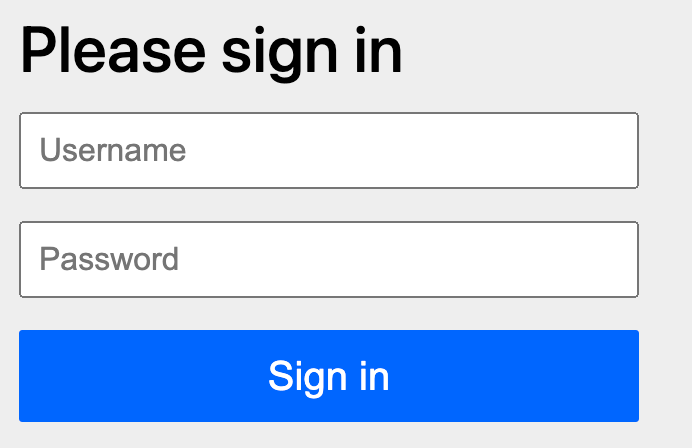

# 第18章 Spring Security Reactive

[官方网站](https://docs.spring.io/spring-security/reference/reactive/getting-started.html)

目标：

SpringBoot +  Webflux + Spring Data R2DBC + Spring Security

今日任务：

- RBAC权限模型
- WebFlux配置：@EnableWebFluxSecurity、@EnableReactiveMethodSecurity
- SecurityFilterChain 组件
- AuthenticationManager  组件
- UserDetailsService  组件
- 基于注解的方法级别授权

## 18.1 整合

```xml
    <dependencies>
        <!-- 定义三方包 beg -->
        <dependency>
            <groupId>org.springframework.boot</groupId>
            <artifactId>spring-boot-starter-webflux</artifactId>
        </dependency>

        <dependency>
            <groupId>org.springframework.boot</groupId>
            <artifactId>spring-boot-starter-test</artifactId>
            <scope>test</scope>
        </dependency>

        <dependency>
            <groupId>org.springframework.boot</groupId>
            <artifactId>spring-boot-starter-data-r2dbc</artifactId>
        </dependency>
        <dependency>
            <groupId>io.asyncer</groupId>
            <artifactId>r2dbc-mysql</artifactId>
        </dependency>
        <!--主动引入mac下arm版的jar依赖包，默认是osx-x86_64，可解决：nable to load io.netty.resolver.dns.macos.MacOSDnsServerAddressStreamProvider, fallback to system defaults. -->
        <dependency>
            <groupId>io.netty</groupId>
            <artifactId>netty-resolver-dns-native-macos</artifactId>
            <classifier>osx-aarch_64</classifier>
        </dependency>

        <dependency>
            <groupId>org.springframework.boot</groupId>
            <artifactId>spring-boot-starter-security</artifactId>
        </dependency>
</dependencies>
```


## 18.2 开发

### 18.2.1 应用安全

- **防止攻击**：
  - DDos、CSRF、XSS、SQL注入...

- **控制权限**
  - 登录的用户能干什么。
  - 用户登录系统以后要控制住用户的所有行为，防止越权；

- 传输加密
  - https
  - X509

- 认证：
  - OAuth2.0
  - JWT


### 18.2.2 RBAC权限模型

Role Based Access Controll： 基于角色的访问控制

一个网站有很多**用户**： zhangsan

每个用户可以有很多**角色**：

一个角色可以关联很多**权限**：

一个人到底能干什么？

权限控制：

- 找到这个人，看他有哪些角色，每个角色能拥有哪些**权限**。  这个人就拥有一堆的 **角色** 或者 **权限**
- 这个人执行方法的时候，我们给方法规定好权限，由权限框架负责判断，这个人是否有指定的权限


所有权限框架：

- 让用户登录进来：  **认证（authenticate）**：用账号密码、各种其他方式，先让用户进来
- 查询用户拥有的所有角色和权限： **授权（authorize）**： 每个方法执行的时候，匹配角色或者权限来判定用户是否可以执行这个方法

导入Spring Security：默认效果

## 18.3 认证

### 18.3.1 静态资源放行

### 18.3.2 其他请求需要登录

```java
package com.coding.boot3.integrated.config;

import com.coding.boot3.integrated.component.AppReactiveUserDetailsService;
import org.springframework.beans.factory.annotation.Autowired;
import org.springframework.boot.autoconfigure.security.reactive.PathRequest;
import org.springframework.context.annotation.Bean;
import org.springframework.context.annotation.Configuration;
import org.springframework.security.authentication.UserDetailsRepositoryReactiveAuthenticationManager;
import org.springframework.security.config.annotation.method.configuration.EnableReactiveMethodSecurity;
import org.springframework.security.config.annotation.web.reactive.EnableWebFluxSecurity;
import org.springframework.security.config.web.server.ServerHttpSecurity;
import org.springframework.security.crypto.factory.PasswordEncoderFactories;
import org.springframework.security.crypto.password.PasswordEncoder;
import org.springframework.security.web.server.SecurityWebFilterChain;

import static org.springframework.security.config.Customizer.withDefaults;

@EnableReactiveMethodSecurity // 开启方法权限控制
@EnableWebFluxSecurity
@Configuration
public class AppSecurityConfiguration {

    @Autowired
    AppReactiveUserDetailsService userDetailsService;

    @Bean
    SecurityWebFilterChain springSecurityFilterChain(ServerHttpSecurity http) {

        // 1、定义哪些请求需要认证
        http.authorizeExchange(exchanges ->
                exchanges
                        // 1.1、允许所有人都可以访问静态资源
                        .matchers(PathRequest.toStaticResources().atCommonLocations()).permitAll()
                        // 1.2、剩下的所有请求都需要认证（登录）
                        .anyExchange().authenticated()
        );
        // 2、开启默认的表单登录
        http.formLogin(withDefaults());
        // 3、关闭CSRF（跨站请求伪造）
        http.csrf(ServerHttpSecurity.CsrfSpec::disable);

        /*
        目前认证：用户名是 user，密码是默认生成的并输出到控制台日志
        期望认证：去数据库查用户名和密码
         */
        // 4、配置认证规则：如何去数据库查询到用户；Spring Security底层使用 ReactiveAuthenticationManager 去查询用户信息
        http.authenticationManager(new UserDetailsRepositoryReactiveAuthenticationManager(userDetailsService));
        // 构建出安全配置
        return http.build();
    }

    @Bean
    PasswordEncoder passwordEncoder() {
        return PasswordEncoderFactories.createDelegatingPasswordEncoder();
    }
}

```




这个界面点击登录，最终Spring Security 框架会使用 ReactiveUserDetailsService 组件，按照表单提交的用户名去**数据库查询**这个**用户详情**（**基本信息**[账号、密码]，**角色**，**权限**）；

把数据库中返回的 **用户详情** 中的密码 和 表单提交的密码进行比对。比对成功则登录成功；

```java
@Component
public class AppReactiveUserDetailsService implements ReactiveUserDetailsService {

    @Autowired
    DatabaseClient databaseClient;

    // 自定义如何按照用户名取数据库查询用户信息
    @Override
    public Mono<UserDetails> findByUsername(String username) {
        return Mono.from(databaseClient.sql("""
                        select tu.*, tr.id rid, tr.name rname, tr.value rvalue, tp.id as pid, tp.value as pvalue, tp.uri, tp.description  from t_user tu\s
                        left join t_user_role tur on tur.user_id = tu.id\s
                        left join t_roles tr on tr.id = tur.role_id\s
                        left join t_role_perm trp on trp.role_id  = tr.id\s
                        left join t_perm tp on tp.id = trp.perm_id\s
                        where tu.username = :username
                        order by tu.username, tr.id, tp.id
                        """).bind("username", username)
                .fetch()
                .all()
                .bufferUntilChanged(rowMap -> rowMap.get("username").toString())
                .map(list -> {
                        /*
                            1、不要混用 roles() 和 authorities()，顺序靠后者会覆盖前者。（哪怕只是 authorities() 执行2次，后者也会覆盖前者）
                            2、角色本质是权限：hasRole('admin') 等价于检查 ROLE_admin 权限。
                            3、最佳实践：统一用 authorities() 显式设置所有权限（包括角色），避免隐式行为。
                         */
                    // 如何同时支持角色和权限？
                    User.UserBuilder userBuilder = User.builder().username(list.get(0).get("username").toString())
                            .password(list.get(0).get("password").toString());
                    Collection<? extends GrantedAuthority> roles = userBuilder.roles(list.stream().map(rowMap -> rowMap.get("rname").toString()).distinct().toArray(String[]::new)).build().getAuthorities();
                    Collection<? extends GrantedAuthority> authorities = userBuilder.authorities(list.stream().map(rowMap -> rowMap.get("pvalue").toString()).distinct().toArray(String[]::new)).build().getAuthorities();
                    Collection<SimpleGrantedAuthority> all = new ArrayList<>();

                    roles.forEach(role -> {
                        if (role instanceof SimpleGrantedAuthority simpleGrantedAuthority) {
                            all.add(simpleGrantedAuthority);
                        }
                    });
                    authorities.forEach(role -> {
                        if (role instanceof SimpleGrantedAuthority simpleGrantedAuthority) {
                            all.add(simpleGrantedAuthority);
                        }
                    });

                    return userBuilder.authorities(all).build();
                }));
    }
}
```


## 18.4 授权

@EnableReactiveMethodSecurity // 开启方法权限控制

```java
package com.coding.boot3.integrated.controller;

import org.springframework.security.access.prepost.PreAuthorize;
import org.springframework.web.bind.annotation.GetMapping;
import org.springframework.web.bind.annotation.RestController;
import reactor.core.publisher.Mono;

@RestController
public class HelloController {

    @PreAuthorize("hasRole('admin')")
    @GetMapping("/hello")
    public Mono<String> hello() {
        return Mono.just("Hello World");
    }

    @PreAuthorize("hasAuthority('download')")
    @GetMapping("/world")
    public Mono<String> world() {
        return Mono.just("World");
    }

}
```

# 补充说明

## 18.1 模块 `spring-boot-3.x/boot3-20-ai/app` 打开方式

请使用 WebStorm 打开该文件开发前端
