# 第2章 JVM

1、请你谈谈对JVM的理解？Java8虚拟机和之前的变化更新？

2、什么是OOM，什么是栈溢出StackOverFlowError？怎么分析？

3、JVM的常用调优参数有哪些？

4、内存快照如何抓取，怎么分析Dump文件？知道吗？

5、谈谈JVM中，类加载器你的认识？

## 2.1 JVM的位置

硬件体系（Intel等）==>操作系统（Win、Linux、Mac）==>JRE-JVM==>App

## 2.2 JVM的内存结构和分区

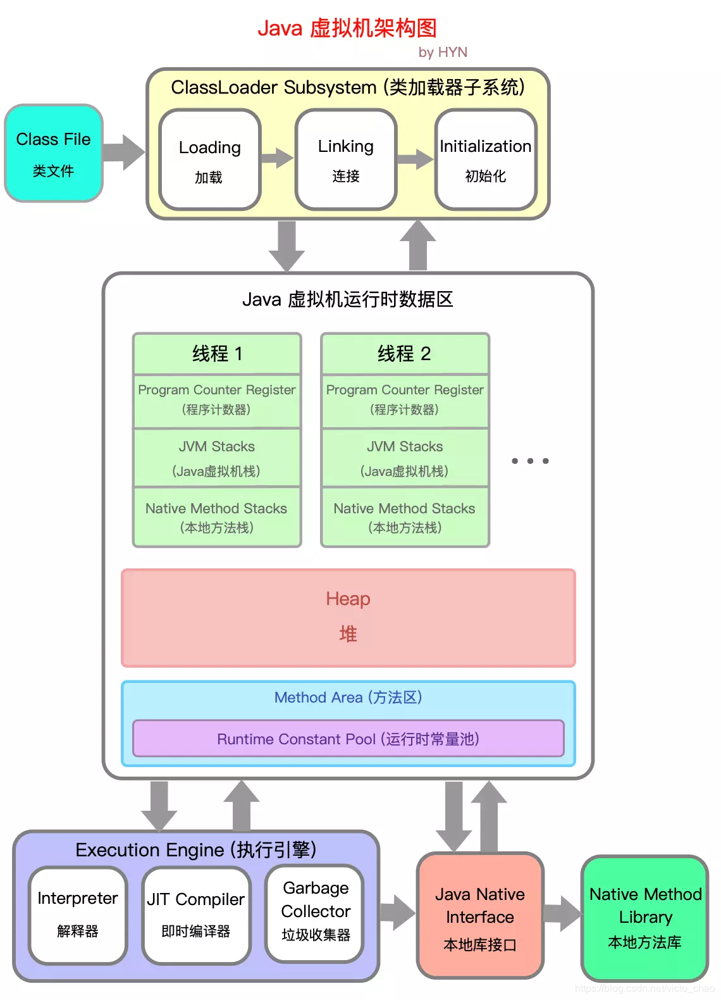

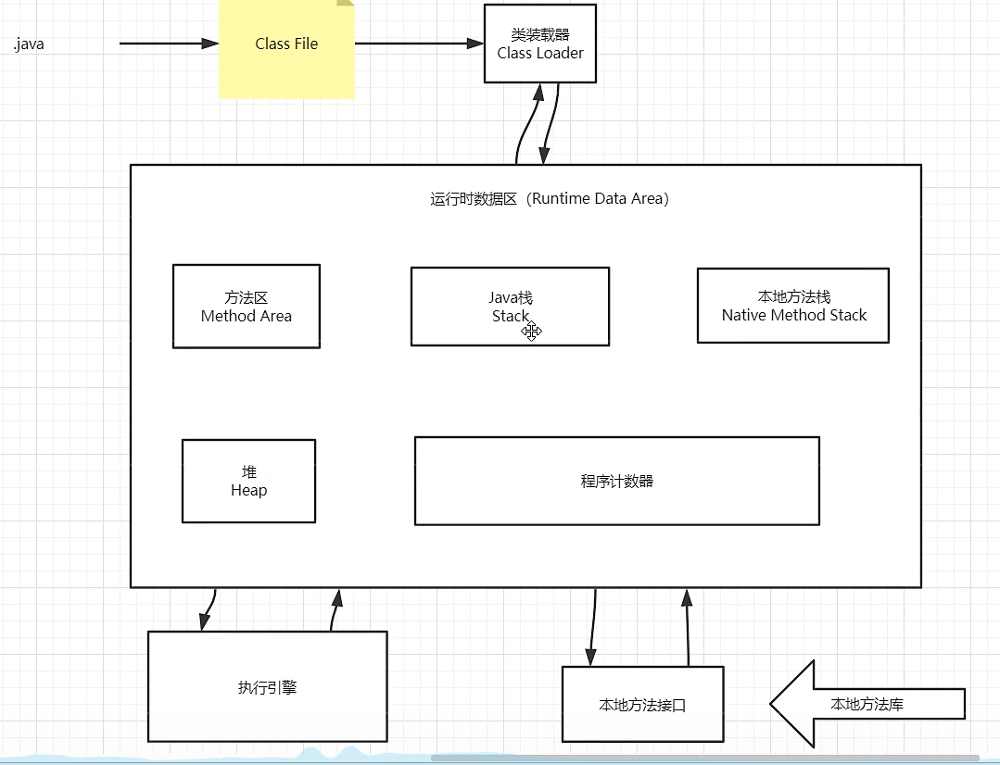

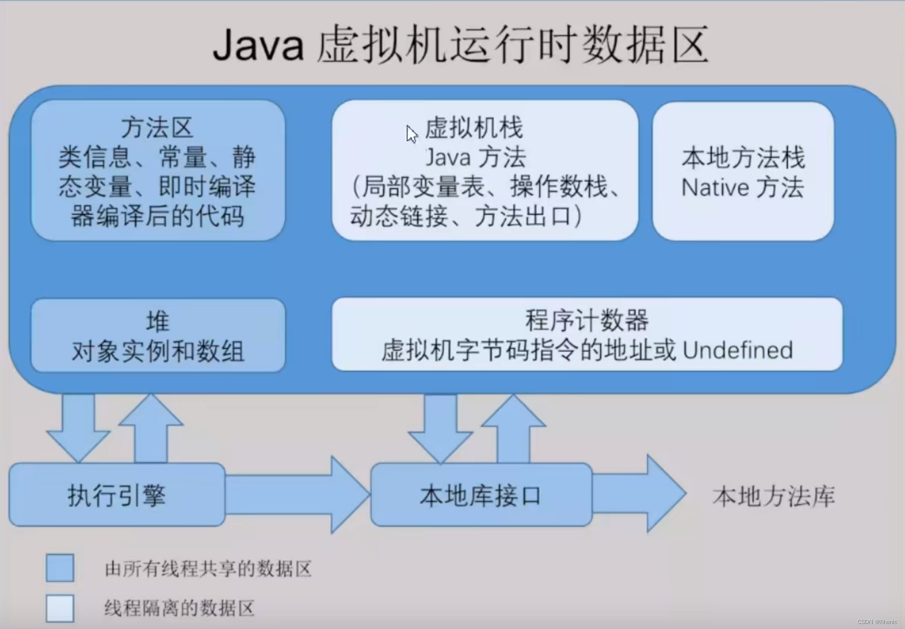

了解jvm吗，说一下成员变量在jvm的存储

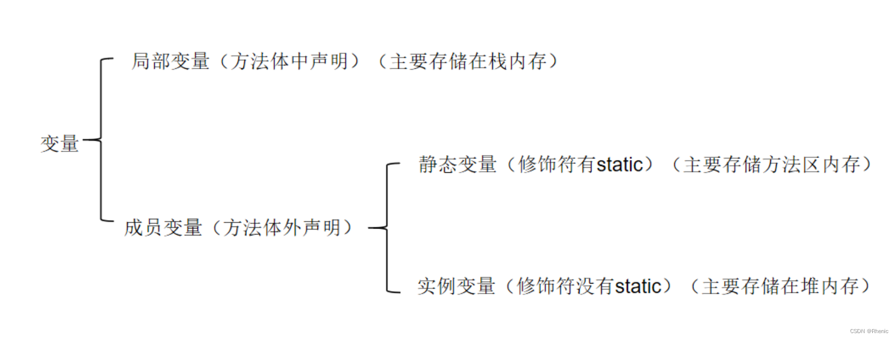

## 2.3 类加载器

作用：加载Class文件

虚拟机自带的加载器

启动类（根）加载器：Bootstrap ClassLoader：主要负责加载核心的类库（java.lang.*等），构造ExtClassLoader和AppClassLoader。

扩展类加载器：ExtClassLoader：主要负责加载jre/lib/ext目录下的一些扩展的jar。

应用程序加载器：AppClassLoader：主要负责加载应用程序的主函数类

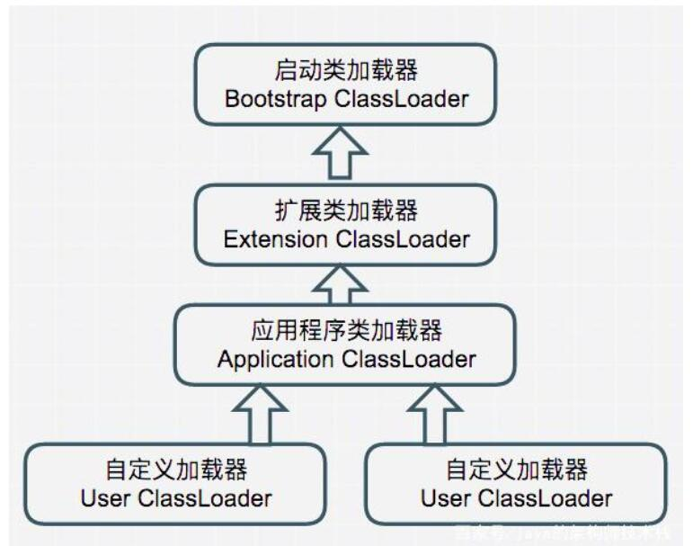

## 2.4 双亲委派机制

作用：保证安全

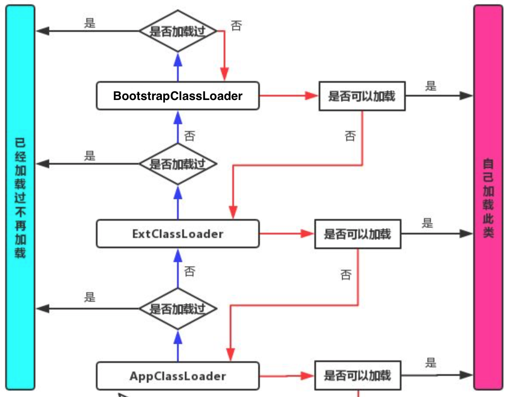

为什么要设计这种机制：

这种设计有个好处是，如果有人想替换系统级别的类：String.java。篡改它的实现，在这种机制下这些系统的类已经被Bootstrap classLoader加载过了（为什么？因为当一个类需要加载的时候，最先去尝试加载的就是BootstrapClassLoader），所以其他类加载器并没有机会再去加载，从一定程度上防止了危险代码的植入。

## 2.5 沙箱安全机制

## 2.6 Native

Native Method Stack

它的具体做法是Native Method Stack中等级native方法，在（Execution Engine）执行引擎执行时加载Native Libraries。【本地库】

## 2.7 PC寄存器：线程私有

程序计数器：Program Counter Register

每个线程都有一个程序计数器，是线程私有的，就是一个指针，指向方法区中的方法字节码（用来存储指向一条指令的地址，也即将要指向的指令代码），在执行引擎读取下一条指令，是一个非常小的内存空间，几乎可以忽略不计！

## 2.8 方法区（Java8的元数据区）：线程共享

Method Area方法区

方法区是被所有线程共享，所有字段和方法字节码，以及一些特殊方法，如构造函数，接口代码也在此定义，简单说所有定义的方法的信息都保存在该区域，此区域属于共享空间！

静态变量、常量、类信息（构造方法、接口定义、普通方法）、运行时的常量池存在方法区中，但是实例变量存储在堆内存中，和方法区无关。

static/final/class/常量池

## 2.9 栈（数据结构）：线程私有

程序=数据结构+算法（不是框架+业务逻辑）

栈：先进后出、后进先出

队列：先进先出（FIFO：First Input First Output）

==喝多了吐就是栈，吃多了拉就是队列==

栈：8大基本类型+对象引用+实例方法

栈是运行时的单位：即程序如何执行，或者说如何处理数据。

栈是线程私有，不存在垃圾的回收。虚拟机栈的生命周期同线程一致。

栈帧：Java中的方法被扔进虚拟机的栈空间后就成为"栈帧"，比如main方法，程序入口；被压栈之后就成为栈帧。

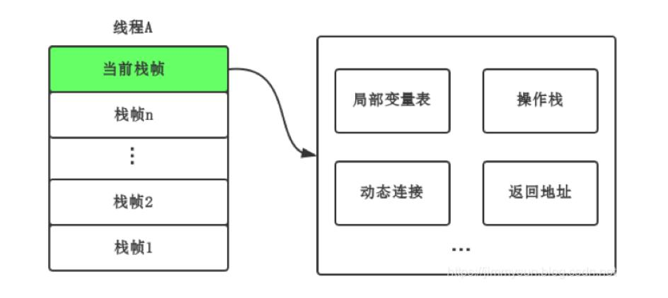

## 2.10 三种JVM

- HotSpot（Oracle）
- BEA `JRockit`
- IBM `J9VM`

## 2.11 堆：线程共享

堆：先进新出、后进后出

堆是存储的单位：堆解决的是数据存储问题，即数据如何存放，放哪里！

Heap，一个JVM只有一个堆内存；堆内存的大小是可以调节的。

新生区：

- 类 诞生 和 成长的地方，甚至是消亡
- 伊甸园 所有的对象都是在 eden 区 new 出来的
- 幸存区

真理：经过研究，99%的对象都是临时对象！

老年区：

永久区：

这个区域常驻内存，用来存放JDK自身携带的Class对象。Interface元数据，存储的是Java运行时的一些环境或类信息~，这个区域不存在垃圾回收！关闭VM虚拟机就会释放这个区域的内存~

​	元空间的OOM：逻辑上存在，物理上不存在；又说元数据不占用JVM堆，但占用物理内存

​	一个启动类，加载了大量第三方jar包。Tomcat部署了太多的应用。大量动态生成的反射类，不断被加载。直到内存慢了，就会OOM。

- JDK1.6之前：永久代，常量池是在方法区
- JDK1.7：永久代，但是慢慢退化了，`去永久代`，常量池在堆中
- JDK1.8之后：无永久代，常量池在元空间

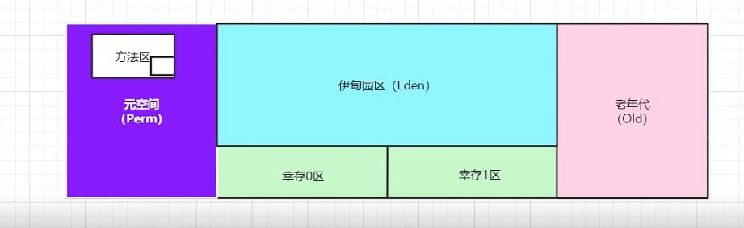

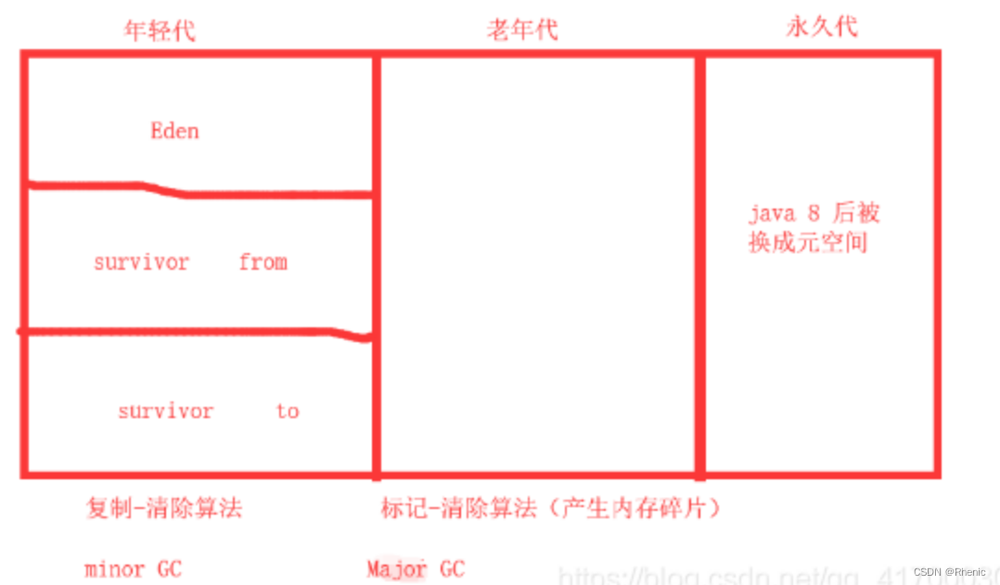

## 2.12 新生代和老年代

## 2.13 永久代

## 2.14 堆内存调优

使用JProfiler。

## 2.15 GC

主要针对堆内存和元空间。

GC两种类型：轻GC（普通GC，Minor GC），重GC（全GC，Full GC）

GC题目：

- JVM的内存模型和分区——详细到每个区放什么？
- 堆里面的分区有哪些？Eden、from、to、老年区，说说他们的特点！
- GC的算法有哪些？
  - 标记清除法
    - 分为标记和清除两阶段。1）标记存活的Java对象；2）回收未被标记的Java对象。
    - 缺点1：执行效率会随着堆的增加而降低，原因是标记需要遍历整个堆。且如果有大量java对象都需要被回收，清除的效率也会很低。
    - 缺点2：产生空间碎片。大量的空间碎片会导致在分配大java对象时没有足够的内存空间，进而提前引发一次垃圾回收。
    - 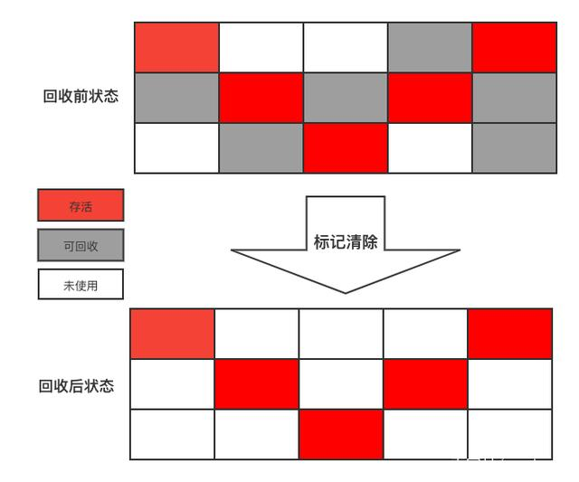
  - 标记整理法
    - 根据老年代的特点，有人对"标记 - 清除"进行改进，提出了"标记 - 整理"算法。"标记 - 整理"算法的标记过程与"标记 - 清除"算法相同，但后续步骤不是直接对可回收对象进行清理，而是让所有存活的对象都向一端移动，然后直接清理掉端边界以外的内存。
    - 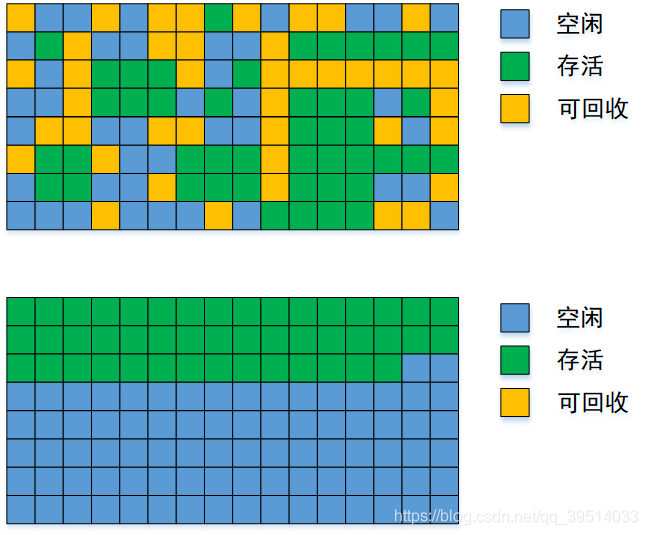
  - 标记复制法
    - 为了解决标记清楚算法对大量可回收Java对象执行效率低的问题。
    - 标记复制算法将内存分为大小相等的两块，每次只使用其中一块。假设这两块区域一块是A，一块是B。先使用A区域分配Java对象，当A用完后，标记A区域的Java对象，将A区域还存活的对象复制到B区域，然后将A区域内存一次性的清理掉。
      - 情况1：A区域多数Java对象是存活的：这时进行复制会产生很大的复制开销。
      - 情况2：A区域少数Java对象存活，复制效率比较高。
    - 缺点1：太费内存，如果是平分内存区域，内存使用率一下降低一半。因为只有一半内存可以使用。
    - 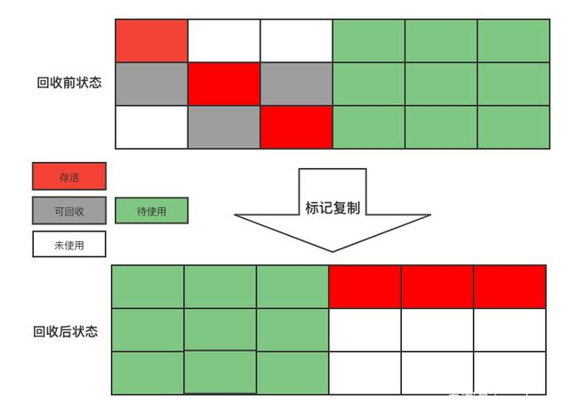
    我们知道绝大所多数java对象都是朝生夕死，特别是在新生代区域，98%的java对象熬不过第一轮收集。因此可以对标记复制算法在特定的场景下进行优化。如：Serial、ParNew等收集器在新生代就是采用这种策略。
  - 引用计数法：最大弱点，无法回收循环引用的对象。
    - 给Java对象添加一个引用计数器，每当一个地方引用它时，计数器加一；当引用失效时，计数器减一；当计数器值为0时，说明这个Java对象不再被使用，将被回收掉。
    - 优点1：【实时性】无需等到内存不够的时候，才开始回收，运行时根据对象的计数器是否为0，就可以直接回收。
    - 优点2：【应用无需挂起】在垃圾回收过程中，应用无需挂起。如果申请内存时，内存不足，则立刻报outofmember 错误。
    - 优点3：【区域性】更新对象的计数器时，只是影响到该对象，不会扫描全部对象
    - 缺点1：浪费cpu，即使内存够用，仍然在运行时进行计数器的统计
    - 缺点2：每次对象被引用时，都需要去更新计数器，有一点时间开销。另外无法解决循环引用问题。

总结：

内存效率：复制算法>标记清除算法->标记整理清除（时间复杂度）

内存整齐度：复制算法=标记整理算法>标记清除算法

内存利用率：标记整理清除=标记清除算法>复制算法

思考一个问题：难道没有最优算法嘛？

答案：没有，没有最好的算法，只有合适的算法-->GC：分代收集算法

年轻代：

- 存活率低
- 复制算法！

老年代：

- 区域大，存活率高
- 标记清除算法+标记整理清除算法

## 2.16 垃圾收集器

- 串行收集器Serial：Serial、Serial Old
- 并行收集器Parallel：Parallel Scavenge、Parallel Old，吞吐量优先【默认】
- 并发收集器Concurrent：CMS、G1，停顿时间优先
  - CMS: `-XX:+UseConcMarkSweepGC -XX:+UseParNewGC`
  - G1:`-XX:+UseG1GC`【JDK8推荐G1，性能高】

停顿时间VS吞吐量：

**停顿时间**：垃圾收集器做垃圾回收中断应用执行的时间。-XX:MaxGCPauseMillis

该参数应谨慎使用。太小的值将导致系统花费过多的时间进行垃圾回收。原因是为满足最大暂停时间，VM将设置更小的堆，以存储相对少量的对象，来提升回收速率，会导致更高频率的GC。

**吞吐量**：花在垃圾收集的时间和花在应用时间的占比。-XX:GCTimeRatio

举个官方的例子，参数设置为19，那么GC最大花费时间的比率=1/(1+19)=5%，程序每运行100分钟，允许GC停顿共5分钟，其吞吐量=1-GC最大花费时间比率=95%

默认情况下，VM设置此值为99，运行用户代码时间是GC停顿时间的99倍，即GC最大花费时间比率为1%

选择此参数应对server端程序是很适合的，设置过大会使堆变大，直至接近最大堆设置的值。

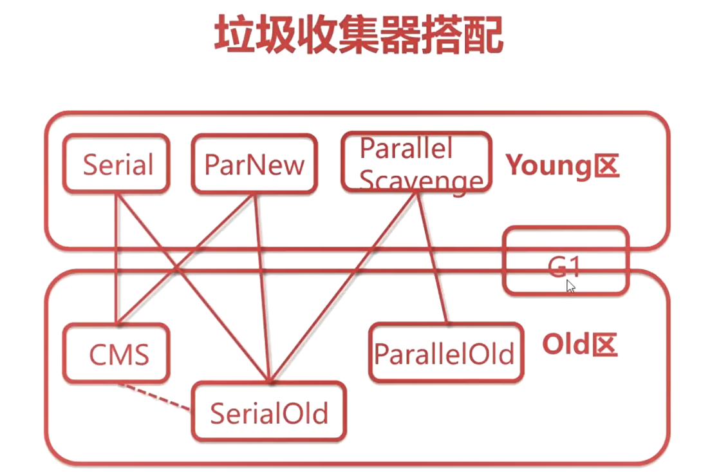

*连线部分，表示可以联合使用。*

GC日志分析神器：

https://gceasy.io/
