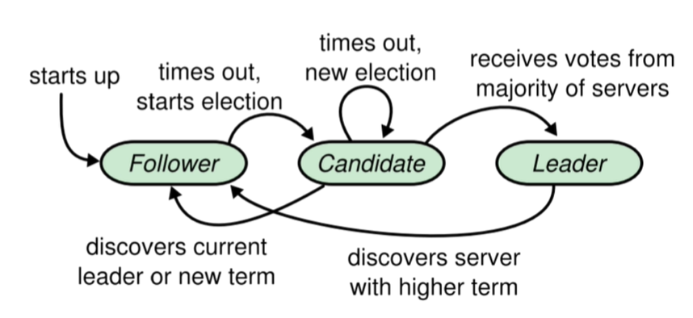
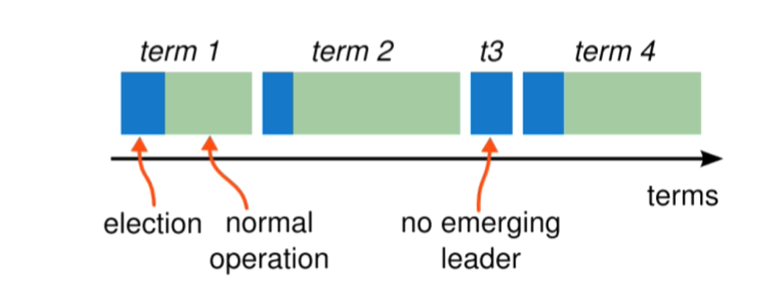
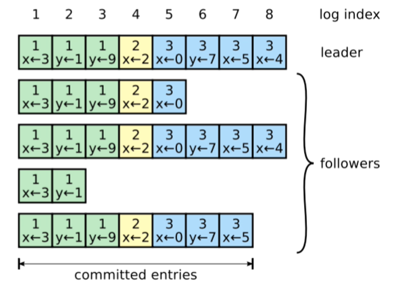
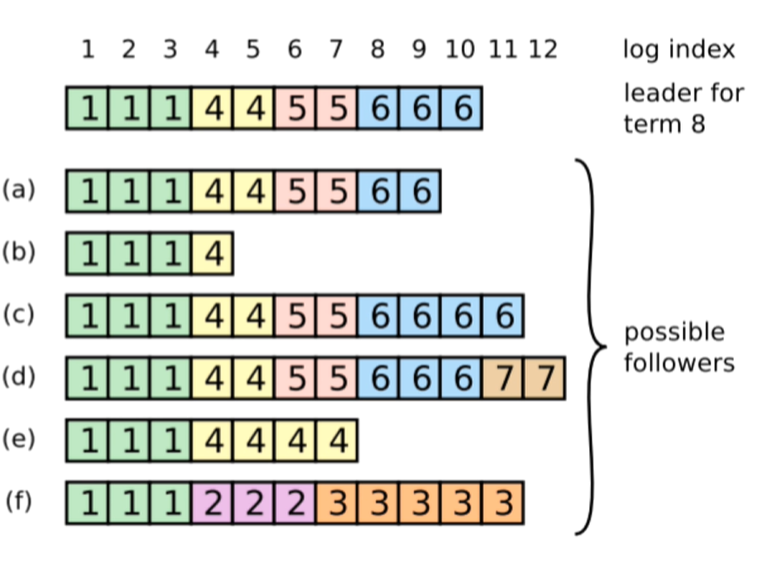
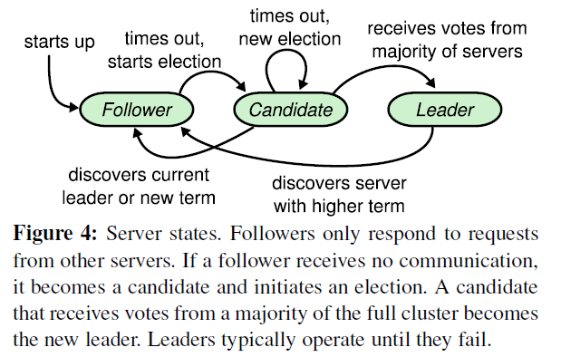
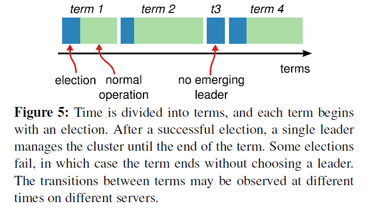

# 第3章 并发、分布式与框架

## 3.1 JMM

- Java Memory Model（Java内存模型），围绕着在并发过程中如何处理可见性、有序性、原子性这三个特性而建立的模型。

内存模型可以理解为在特定的操作协议下，对特定的内存或者高速缓存读写访问的过程抽象描述，不同架构下的物理机拥有不一样的内存模型，Java虚拟机是一个实现了跨平台的虚拟系统，因此它也有自己的内存模型，即Java内存模型。

因此它不是对物理内存的规范，而是在虚拟机基础上进行的规范，从而实现平台一致性，以达到Java程序能够"一次编写，到处运行"。

- JMM结构规范：

JMM规定了所有的变量都存储在主内存（Main Memory）中。每个线程还有自己的工作内存（Working Memory），线程的工作内存中保存了该线程使用到的变量的主内存副本拷贝，线程对变量的所有操作（读取、赋值等）都必须在工作内存中进行，而不能直接读写主内存中的变量（volatile变量仍然有工作内存的拷贝，但是由于它特殊的操作顺序性规定，所以看起来如同直接在主内存中读写访问一般）。不同的线程之间也无法直接访问对方工作内存的变量，线程之间值的传递都需要通过主内存来完成。

在Java中，所有实例域，静态域和数组元素存储在堆内存中，堆内存在线程之间共享（本文使用"共享变量"这个术语代指实例域，静态域和数组元素）。局部变量（Local variables），方法定义参数（Java预约规范称之为 formal method parameters）和异常处理器参数（exception handler parameters）不会在线程之间共享，它们不会有内存可见性问题，也不受内存模型的影响。

- 主内存和本地内存结构

从抽象的角度来看，JMM定义了线程和主内存之间的抽象关系：线程之间的共享变量存储在主内存（main memory）中，每个线程都有一个私有的本地内存（local memory），本地内存中存储了该线程以读/写共享变量的副本。本地内存是JMM的一个抽象概念，并不真实存在。本地内存它涵盖了缓存，写缓冲区，寄存器以及其他的硬件和编译器优化之后的一个数据存放位置。

参考：https://blog.csdn.net/gd_yuzhe/article/details/119031820

## 3.2 Java并发编程

## 3.3 Java数据结构与算法

## 3.4 Java网络编程

## 3.5 HTTP协议

## 3.6 分布式

### CAP

分布式系统CAP解释：

```
分布式系统：在互相隔离的空间中，提供数据服务的系统。
CAP抽象：不同空间的数据，在同一时间，状态一致。

C：一致性，代表状态一致
A：可用性，代表同一时间
P：分区容错性，代表不同空间
CP:不同空间中的数据，如果要求他们所有状态一致，则必然不在同一时间。比如：ZooKeeper
AP:不同空间中，如果要求同一时间都可以从任意的空间拿到数据，则必然数据的状态不一致。比如：一般业务系统，追求AP
CA:不同空间的数据，如果要求任意时间都可以从任意空间拿到状态一致的数据，则空间数必然为1.
```

### BASE理论

BASE 是基本可用（Basically Available）、软状态（Soft State）和最终一致性（Eventually Consistent）三个短语的缩写。

**BASE 理论是对 CAP 中一致性和可用性权衡的结果**，它的核心思想是：即使无法做到强一致性，但每个应用都可以根据自身业务特点，采用适当的方式来使系统达到最终一致性。

### 分布式一致性协议

- Paxos[ˈpæksoʊs] 分布式一致性算法：帕克索斯
- Raft[rɑːft]分布式一致性算法：木筏
  - etcd
  - es
  - consul
- Gossip [ˈɡɒsɪp]分布式一致性算法：流言蜚语
  - Redis Cluster（虚拟槽分区，是哈希的一种，但不是一致性哈希）
- ZAB协议（Zookeeper Atomic Broadcast：ZK原子广播协议）
  - ZooKeeper

### Raft算法（2014年论文）

raft是工程上使用较为广泛的强一致性、去中心化、高可用的分布式协议。在这里强调了是在工程上，因为在学术理论界，最耀眼的还是大名鼎鼎的Paxos。但Paxos是：少数真正理解的人觉得简单，尚未理解的人觉得很难，大多数人都是一知半解。本人也花了很多时间、看了很多材料也没有真正理解。直到看到raft的论文，两位研究者也提到，他们也花了很长的时间来理解Paxos，他们也觉得很难理解，于是研究出了raft算法。

raft协议中，一个节点任一时刻处于以下三个状态之一：

- leader - 领导人
- follower - 追随者
- candidate - 候选人

通信协议-RPC：

- RequestVote 请求投票
- AppendEntries - 追加日志

相比于Paxos，Raft最大的特性就是易于理解（Understandable）。为了达到这个目标，Raft主要做了两方面的事情：

- 1.问题分解

把共识算法分为三个子问题，分别是领导者选举（leader election）、日志复制（log replication）、安全性(safety)

- 2.状态简化

对算法做出一些限制，减少状态数量和可能产生的变动。

#### 复制状态机

复制状态机（Replicated state machine)：相同的初始状态 + 相同的输入 = 相同的结束状态

#### 状态简化

- 在任何时刻，每一个服务器节点都处于leader，follower或candidate这三个状态其中之一。
- 相比Paxos，这一点就极大简化了算法的实现，因为Raft只需要考虑状态的切换，而不用像Paxos那样考虑状态之间的共存和互相影响。



可以看出所有节点启动时都是follower状态；在一段时间内如果没有收到来自leader的心跳，从follower切换到candidate，发起选举；如果收到majority的造成票（含自己的一票）则切换到leader状态；如果发现其他节点比自己更新，则主动切换到follower。

总之，系统中最多只有一个leader，如果在一段时间里发现没有leader，则大家通过选举-投票选出leader。leader会不停的给follower发心跳消息，表明自己的存活状态。如果leader故障，那么follower会转换成candidate，重新选出leader。



term（任期）以选举（election）开始，然后就是一段或长或短的稳定工作期（normal Operation）。从上图可以看到，任期是递增的，这就充当了逻辑时钟的作用；另外，term 3展示了一种情况，就是说没有选举出leader就结束了，然后会发起新的选举，后面会解释这种*split vote*的情况。

- Raft算法中服务器节点之间使用RPC进行通信，并且Raft中只有两种主要的RPC
  - RequestVote RPC（请求投票）：由candidate在选举期间发起。
  - AppendEntries RPC（追加条目）：由leader发起，用来复制日志和提供一种心跳机制。
- Raft在PRC上附加了很多功能
  - 服务器之间通信的时候会**交换当前任期号**；如果一个服务器上的当前任期号比其他的小，该服务器会将自己的任期号更新为较大的那个值。
  - 如果一个candidate或者leader发现自己的任期号过期了，它会立即回到follower状态。
  - 如果一个节点接收到一个包含过期的任期号请求，它会直接拒绝这个请求

#### 领导者选举

- Raft内部有一种心跳机制，如果存在leader，那么它就会周期性地向所有follower发送心跳，来维持自己的地位。如果follower一段时间没有收到心跳，那么他就会认为系统中没有可用的leader了，然后开始进行选举。
- 开始一个选举过程后，follower先增加自己的当前任期号，并转换到candidate状态。然后投票给自己，并且并行地向集群中的其他服务器节点发送投票请求（RequestVote RPC）。

对于以上请求过程，会有三种结果：

1. 它获得**超过半数选票**赢得了选举 ==> 成为leader并开始发送心跳。
2. 其他节点赢得了选举 ==> 收到**新leader的心跳**后，如果**新leader的任期号不小于自己当前的任期号**，那么就说从candidate回到follower状态。
3. 一段时间之后没有任何获胜者 ==> 每个candidate都在一个自己的**随机选举超时时间**后增加任期号开始新一轮投票。

为什么会没有获胜者？比如有多个follower同时成为candidate，得票太过分散，没有任何一个candidate得票超过半数。

论文中给出的随机选举超时时间为150-300ms。

```c
// 请求投票RPC Request
type RequestVoteRequest struct {
    term int, // 自己当前的任期号
    candidateId int, // 自己的ID
    lastLogIndex int, // 自己最后一个日志号
    lastLogTerm int // 自己最后一个日志的任期
}
```

```c
// 请求投票RPC Response
type RequestVoteResponse struct {
    term int, // 自己当前的任期号
    voteGranted bool // 自己会不会投票给这个candidate
}
```

- 对于没有成为candidate的follower节点，对于同一个任期，会按照**先来先得**的原则透出自己的选票。
  - term比自己的大嘛？
  - 请求放的最后一个日志和日志任期号，作为安全校验满足嘛？
- 为什么RequestVote RPC中要有candidate最后一个日志的信息呢？安全性子问题中会给出进一步的说明。

#### 日志复制

- leader被选举出来后，开始为客户端请求提供服务。客户端怎么知道新leader是哪个节点呢？
  - 第一种情况：碰巧发送到leader
  - 第二种情况：发送到follower，该follower通过心跳得知leader的ID，然后可以告知client谁时leader。
  - 第三种情况：发送到的节点宕机了，client只能再次发送！

- leader接收到客户端的指令后，会把指令作为一个新的条目追加到日志中去。一条日志中需要具有三个信息：
  - 状态机指令
  - leader的任期号
  - 日志号（日志索引）



- leader并行发送AppendEntries RPC给follower，让它们复制该条目。该条目被超过半数的follower复制后，leader就可以在本地执行该命令并把结果返回给客户端。
- 我们把本地执行指令，也就是leader应用日志与状态机这一步，成为提交！

如何让落后的follower追上leader，并保证所有的日志都是完整且顺序一致的呢？

在此过程中，leader或follower随时都有崩溃或者缓慢的可能性，Raft必须要在有宕机的情况下继续支持日志复制，并且保证每个副本日志顺序一致（以保证复制状态机的实现）。具体有三种可能：

1. 如果有follower因为某些原因没有给leader相应，那么leader会不断地重发追加条目请求（AppendEntries RPC），哪怕leader已经回复了客户端。
2. 如果有follower崩溃后恢复，这时Raft追加条目的一致性检查生效，保证follower能按顺序恢复崩溃后的缺失的日志。
   Raft的一致性检查：leader在每一个发往follower的追加条目RPC中，会放入**前一个日志条目的索引位置和任期号**，如果follower在它的日志中找不到前一个日志，那么它就会拒绝此日志，leader收到follower的拒绝后，会发送前一个日志条目，从而逐渐向前定位到follower第一个缺失的日志。
3. 如果leader崩溃，那么崩溃的leader可能已经复制了日志到部分follower但还没有提交，而被选出的新leader又可能不具备这些日志，这样就有部分follower中的日志和新leader的日志不相同。
4. Raft在这种情况下，leader通过强制follower复制他的日志来解决不一致的问题，这意味着follower中跟leader冲突的日志条目会被新leader的日志条目覆盖（因为没有提交，所以不违背外部一致性）。



```c
// 请求日志RPC Request
type AppendEntriesRequest struct {
    term int, // 自己当前的任期号
    leaderId int, // leader（也就是自己）的ID
    prevLogIndex int, // 前一个日志号
    prevLogTerm int, // 前一个日志的任期
    entries[] byte, // 当前日志体
    leaderCommit int // leader的已提交日志号
}
```

```c
// 追加日志RPC Response
type AppendEntriesResponse struct {
    term int, // 自己当前任期号
    success bool // 如果follower包括前一个日志，这返回true
}
```

Raft Scope演示：https://raft.github.io/raftscope/index.html

#### 安全性

#### 集群成员变更

#### 总结与性能测试

#### 拓展：ParallelRaft



可以看出所有节点启动时都是follower状态；在一段时间内如果没有收到来自leader的心跳，从follower切换到candidate，发起选举；如果收到majority的造成票（含自己的一票）则切换到leader状态；如果发现其他节点比自己更新，则主动切换到follower。

总之，系统中最多只有一个leader，如果在一段时间里发现没有leader，则大家通过选举-投票选出leader。leader会不停的给follower发心跳消息，表明自己的存活状态。如果leader故障，那么follower会转换成candidate，重新选出leader。



term（任期）以选举（election）开始，然后就是一段或长或短的稳定工作期（normal Operation）。从上图可以看到，任期是递增的，这就充当了逻辑时钟的作用；另外，term 3展示了一种情况，就是说没有选举出leader就结束了，然后会发起新的选举，后面会解释这种*split vote*的情况。

### 分布式ID

### 分布式缓存

### 分布式事务

### 分库分表
