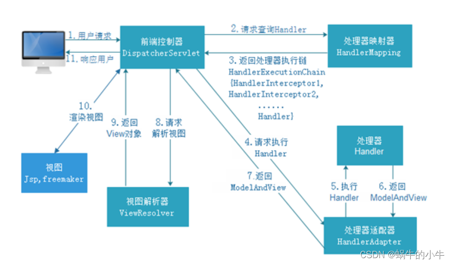
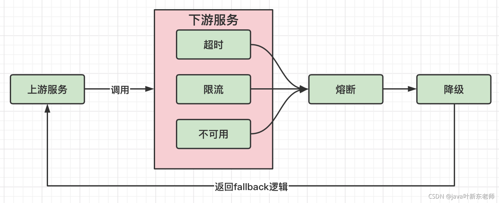
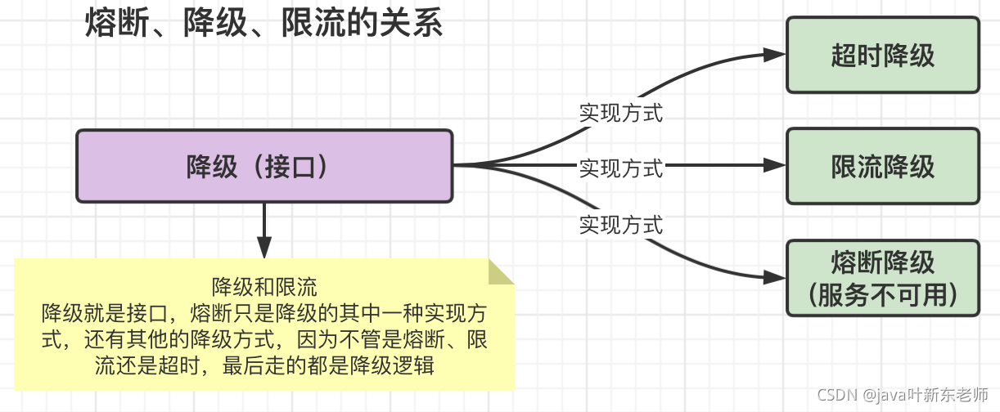
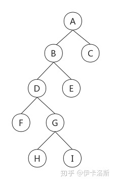

# 第4章 设计模式与框架

## 4.1 BIO/AIO/NIO

## 4.2 Netty

## 4.3 Java设计模式

### 常用设计模式

工厂方法模式

抽象工厂模式

建造者模式

单例模式

外观模式

装饰者模式

适配器模式

享元模式

桥接模式

代理模式

模板方法模式

策略模式

责任链模式

## 4.4 Eureka

### Eureka心跳机制

1.服务器启动成功，等待客户（服务）端注册，在启动过程中如果我们配置了集群，集群之间会同步注册表，每一个Eureka serve都会存在这个集群完整的服务注册表信息

2.Eureka client 启动时根据配置信息，去注册到指定的注册中心

3.Eureka client会每30秒向Eureka server 发送一次心跳请求，证明该客户端服务正常

4.当Eureka server90s内没有接受客户端服务正常，注册中心会认为该节点失效，会注销该实列 （从注册表中删除注册信息）

5.单位时间内如果服务端统计到大量客户端没有发送心跳，则认为网络异常，进去自我保护机制，不在剔除没有发送心跳的客户端

6.当客户端恢复正常之后，服务端就会退出自我保护模式

7.客户端定时全量或增量从注册中心获取服务注册表，并且会缓存到本地

8.服务调用时，客户端会先从本地缓存找到调用服务，如果调取不到 先从注册中心刷新注册表，在同步到本地

9.客户端获取不到目标服务器信息发起服务调用

10.客户端程序关闭时向服务端发送取消请求，服务器将实例从注册表中删除

## 4.5 Spring

### BeanFactory与FactoryBean

BeanFactory:负责生产和管理Bean的一个工厂接口，提供一个Spring Ioc容器规范,

FactoryBean: 一种Bean创建的一种方式，对Bean的一种扩展。对于复杂的Bean对象初始化创建使用其可封装对象的创建细节。

### SpringMVC加载过程

## 4.6 SpringBoot

### SpringBoot四大核心组件

- starter
- autoconfigure
- cli
- actuator

## 4.7 SpringCloud

### SpringCloud的5大组件

- Eureka-注册中心
- Ribbon-软件负载均衡算法
- Hystrix-断路器，保护系统，控制故障范围
- Zuul和Gateway-网关，路由，负载均衡多种作用
- Config-配置中心

### 熔断与降级

降级与熔断

1.1、降级

降级也就是服务降级，当我们的服务器压力剧增，为了保证核心功能的可用性，可以选择性的降低一些功能的可用性，或者直接关闭该功能。典型的弃车保帅！ 就比如贴吧类型的网站，当服务器吃不消的时候，可以选择把发帖功能关闭，注册功能关闭，改密码，改头像这些都关了，为了确保登录和浏览帖子这种核心的功能。

1.2、熔断

降级一般而言是我们自身的系统出现了故障而降级。而熔断一般是指依赖的外部接口出现故障，断绝和外部接口之间的关联。

例如你的A服务里面的一个功能依赖B服务，这时候B服务出问题了，返回的很慢。这种情况可能会因为这么一个功能而拖慢了A服务里面的所有功能，因此我们这时候就需要熔断！即当发现A要调用这B时就直接返回错误(或者返回其他默认值啊啥的)，就不去请求B了。

## 4.8 MySQL

### InnoDB引擎的表数据组织形式：B+树

InnoDB以「页」为基本单位，将一条条记录存储在一个个单独的页中，页内的记录按照主键排序并形成单向链表，页与页之间通过在File Header里记录上一个和下一个页的页号来形成双向链表。

一张表的记录往往是很多的，可能上千万甚至上亿条记录。可即便如此，哪怕上亿条记录的表，我们通过主键或索引检索数据时，速度依然很快，InnoDB是怎么做到的呢？这就是我们今天要介绍的B+树索引。

## 4.9 Redis

## 4.10 MongoDB

## 4.11 RabbitMQ/Kafka

## 4.12 Zookeeper

## 4.13 ES

## 4.14 Java异常调优

## 4.15 K8S

## 4.16 算法

### 二叉树

二叉树是n个有限元素的[集合](https://baike.baidu.com/item/集合/2908117)，该集合或者为空、或者由一个称为根（root）的元素及两个不相交的、被分别称为左子树和右子树的二叉树组成，是有序树。当集合为空时，称该二叉树为空二叉树。在二叉树中，一个元素也称作一个节点。

二叉树：

前序遍历A-B-D-F-G-H-I-E-C

中序遍历F-D-H-G-I-B-E-A-C

后序遍历F-H-I-G-D-E-B-C-A

前序(根左右)，中序(左根右)，后序(左右根)
