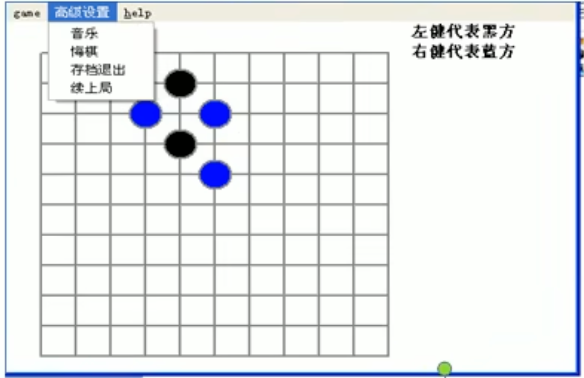

# 第2章 数据结构与算法概述

## 2.1 数据结构和算法的关系

- 数据结构（data-structures）是一门研究组织数据方式的学科，有了编程语言也就有了数据结构，学号数据结构可以编写出更加漂亮，更加有效率的代码。
- 要学号数据结构就要多多考虑如何将生活中遇到的问题，用程序去实现解决。
- 程序=数据结构+算法
- **数据结构是算法的基础**，换言之，想要学好算法，需要把数据结构学到位。

## 2.2 看几个实际编程中遇到的问题

### 2.2.1 问题1：字符串替换问题

- Java代码

```java
public static void main(String[] args) {
  String str = "Java,Java,hello,world!";
  String newStr = str.replaceAll("Java", "尚硅谷~"); // 算法
  System.out.println("newStr=" + newStr);
}
```

问：试写出用**单链表**表示的字符串类及字符串结点类的定义，并依次实现它的构造函数、以及计算串长度、串赋值、判断两串相等、求子串、两串连接、求子串在串中位置等7个成员函数。

- 小结：需要使用到单链表数据结构。

### 2.2.2 问题2：一个五子棋程序



如何判断游戏的输赢，并可以完成存盘退出和继续上局的功能？

1. 棋盘=>二位数组=>稀疏数组（sparsearray）=>写入文件【存档功能】
2. 读取文件=>稀疏数组=>二维数组=>棋盘【续上局】

### 2.2.3 问题3：约瑟夫（Josephu）问题（丢手帕问题）

1. Josephu问题为：设编号为1,2,...n的n个人围坐一圈，约定编号为k（1<=k<=n）的人从1开始报数，数到m的那个人出列，它的下一位又从1开始报数，数到m的那个人又出列，依次类推，直到所有人出列为止，由此产生一个出队编号的序列。
2. 提示：用一个不带头结点的循环链表来处理Josephu问题：先构成一个有n个节点的单循环链表（**单向循环链表**），然后由k节点起从1开始计数，计到m时，对应结点从链表中删除，然后再从被删除节点的下一个节点又从1开始计数，直到最后一个节点从链表中删除算法结束。

### 2.2.4 其他算法问题：

- 修路问题=>最小生成树（加权值）【数据结构】+普利姆算法。
- 最短路径问题=>图+弗洛伊德算法。
- 汉诺塔=>分支算法。
- 八皇后问题=>回溯算法。

## 2.3 线性结构和非线性结构

数据结构包括：线性结构和非线性结构。

### 2.3.1 线性结构

1. 线性结构作为最常用的数据结构，其特点是数据元素之间存在一对一的线性关系
2. 线性结构有两种不同的存储结构，即顺序存储结构和链式存储结构。顺序存储的线性表称为顺序表，顺序表中的存储元素是连续的。
3. 链式存储的线性表称为链表，链表中的存储元素不一定是连续的，元素节点中存放数据元素以及相邻元素的地址信息。
4. 线性结构常见的有：数组、队列、链表和栈。

### 2.3.2 非线性结构

非线性结构包括：二位数组，多维数组，广义表，树结构，图结构。