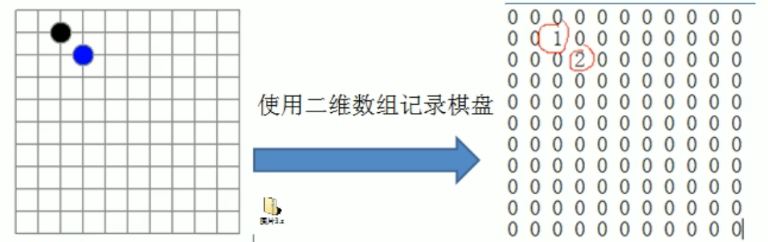
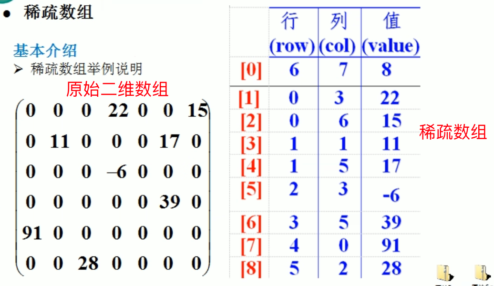
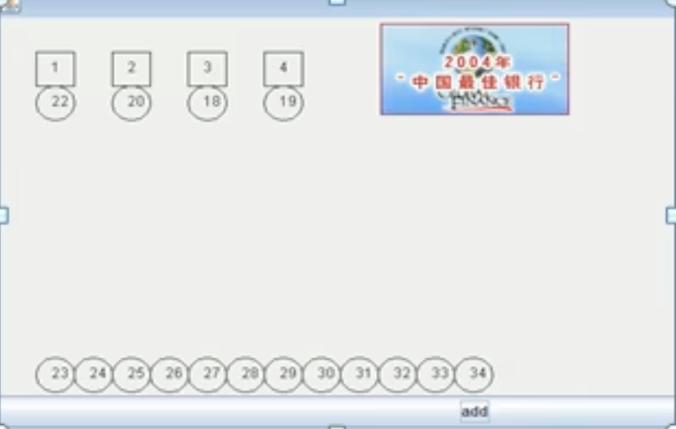
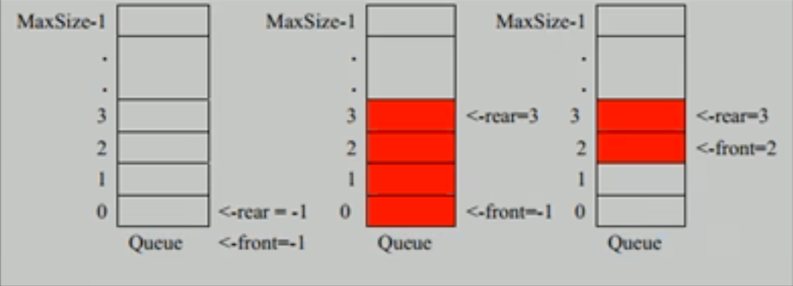

# 第3章 稀疏数组和队列

## 3.1 稀疏数组（sparsearray）

### 3.1.1 一个实际需求

编写的五子棋程序中，有存盘退出和续上盘的功能。



分析问题：

因为该二维数组的很多值是默认值0，因此记录了很多没有意义的数据=>稀疏数组。

### 3.1.2 稀疏数组基本介绍

当一个数组中大部分元素为0，或者为同一个值的数组时，可以使用稀疏数组来保存该数组。

稀疏数组的处理方法是：

1. 记录数组一共有几行几列，有多少个不同的值。
2. 把具有不同值的元素的行列及值记录在一个小规模的数组中，从而缩小程序的规模。



### 3.1.3 应用实例

1. 使用稀疏数组，来保留类似前面的二维数组（棋盘、地图等等）
2. 把稀疏数组存盘，并且可以重新恢复原来的二维数组

**整体思路分析**

- 二维数组转稀疏数组的思路

    1. 遍历原始的二维数组，得到有效数据的个数 sum

    2. 根据sum就可以创建稀疏数组 `sparseArray int[sum+1][3]`

    3. 将二维数组的有效数据存入到稀疏数组

- 稀疏数组转原始的二维数组的思路

    1. 先读取稀疏数组的第一行，根据第一行的数据，创建原始的二维数组，比如上面的 `chessArray=int[11][11]`
    2. 再读取稀疏数组后几行的数据，并赋给原始的二维数组即可

**代码实现**

```java
package com.coding.datastructures.sparsearray;

public class SparseArray {
    public static void main(String[] args) {
        // 创建一个原始的二维数组 11 * 11
        // 0-表示无棋子；1-表示黑色棋子；2-表示蓝色棋子
        int chessArray[][] = new int[11][11];
        chessArray[1][2] = 1;
        chessArray[2][3] = 2;
        // 输出原始的二维数组
        System.out.println("原始的二维数组：");
        for (int[] row : chessArray) {
            for (int data : row) {
                System.out.printf("%d\t", data);
            }
            System.out.println();
        }

        // 将二维数组转稀疏数组
        // 1.遍历原始的二维数组，得到有效数据的个数 sum
        int sum = 0;
        for (int i = 0; i < 11; i++) {
            for (int j = 0; j < 11; j++) {
                if (chessArray[i][j] != 0) {
                    sum++;
                }
            }
        }
        // 2.根据sum就可以创建稀疏数组 `sparseArray int[sum+1][3]`
        int sparseArray[][] = new int[sum + 1][3];
        // 给稀疏数组赋值
        sparseArray[0][0] = 11;
        sparseArray[0][1] = 11;
        sparseArray[0][2] = sum;

        // 3.将二维数组的有效数据存入到稀疏数组
        int count = 0; // count 用于记录是第几个非0数据
        for (int i = 0; i < 11; i++) {
            for (int j = 0; j < 11; j++) {
                if (chessArray[i][j] != 0) {
                    count++;
                    sparseArray[count][0] = i;
                    sparseArray[count][1] = j;
                    sparseArray[count][2] = chessArray[i][j];
                }
            }
        }

        // 输出稀疏数组的形式
        System.out.println();
        System.out.println("得到稀疏数组为~~~~~");
        for (int i = 0; i < sparseArray.length; i++) {
            System.out.printf("%d\t%d\t%d\t\n", sparseArray[i][0], sparseArray[i][1], sparseArray[i][2]);
        }
        System.out.println();

        // 稀疏数组转原始的二维数组
        // 1.先读取稀疏数组的第一行，根据第一行的数据，创建原始的二维数组，比如上面的 `chessArray=int[11][11]`
        chessArray = new int[sparseArray[0][0]][sparseArray[0][1]];
        // 2.再读取稀疏数组后几行的数据，并赋给原始的二维数组即可
        for (int i = 1; i < sparseArray.length; i++) {
            chessArray[sparseArray[i][0]][sparseArray[i][1]] = sparseArray[i][2];
        }

        // 输出恢复后的二维数组
        System.out.println("恢复后的二维数组");
        for (int[] row : chessArray) {
            for (int data : row) {
                System.out.printf("%d\t", data);
            }
            System.out.println();
        }
    }
}

```

## 3.2 队列

### 3.2.1 队列的一个使用场景

银行排队的案例：



### 3.2.2 队列介绍

- 队列是一个有序列表，可以用<span style="color:red;font-weight:bold;">数组</span>
  或是<span style="color:red;font-weight:bold;">链表</span>来实现。
- 遵循<span style="color:red;font-weight:bold;">先入先出</span>的原则。即：先存入队列的数据，要先取出。后存入的要后取。
- 示意图：（使用数组模拟队列示意图）



### 3.2.3 数组模拟队列的一个思路

- 队列本身是有序列表，若使用数组的结构来存储队列的数据，则队列数组的声明如下图，其中maxSize是该队列的最大容量。
- 因为队列的输出、输入是分别从前后端来处理，因此需要两个变量front及rear分别记录队列前后端的下标，front会随着数据输出而改变，而rear则是随着数据输入而改变。

如下图所示：


- 当我们将数据存入队列时称为“addQueue”，addQueue的处理需要有两个步骤：**思路分析**
    1. 将尾指针往后移：rear+1，当front==rear时，表示空队列。
    2. 若尾指针rear小于队列的最大下标maxSize-1，则将数据存入rear所指的数组元素中，否则无法存入数据。rear==maxSize-1时表示队列已满。

**代码实现**

```java
package com.coding.datastructures.queue;

import java.util.Scanner;

public class ArrayQueueDemo {
    public static void main(String[] args) {
        ArrayQueue arrayQueue = new ArrayQueue(3);
        char key = ' '; // 接收用户输入
        Scanner scanner = new Scanner(System.in);
        boolean flag = true;
        while (flag) {
            System.out.println("s(show):显示队列");
            System.out.println("e(exit):退出程序");
            System.out.println("a(add):添加数据到队列");
            System.out.println("g(get):从队列取出数据");
            System.out.println("h(head):查看队列头的数据");
            key = scanner.next().charAt(0); // 接收一个字符
            switch (key) {
                case 's':
                    arrayQueue.showQueue();
                    break;
                case 'e':
                    scanner.close();
                    flag = false;
                    break;
                case 'a':
                    System.out.println("请输入一个数据");
                    int value = scanner.nextInt();
                    arrayQueue.addQueue(value);
                    break;
                case 'g':
                    try {
                        int result = arrayQueue.getQueue();
                        System.out.printf("取出的数据是：%d\n", result);
                    } catch (Exception e) {
                        System.out.println(e.getMessage());
                    }
                    break;
                case 'h':
                    try {
                        int result = arrayQueue.headQueue();
                        System.out.printf("队列头的数据是：%d\n", result);
                    } catch (Exception e) {
                        System.out.println(e.getMessage());
                    }
                    break;
                default:
                    break;
            }
        }
        System.out.println("程序退出 ！");
    }
}

// 使用数组模拟队列-编写一个ArrayQueue类
class ArrayQueue {
    private int maxSize;// 表示数组的最大容量
    private int front; // 队列头
    private int rear; // 队列尾
    private int[] array; // 该数组用于存放数据，模拟队列

    // 创建队列的构造器
    public ArrayQueue(int maxSize) {
        this.maxSize = maxSize;
        this.array = new int[maxSize];
        this.front = -1; // 指向队列的头，分析出front是指向队列头的前一个位置。
        this.rear = -1; // 指向队列的尾，指向队列尾的数据（也即队列最后一个数据）
    }

    // 判断队列是否满
    public boolean isFull() {
        return rear == maxSize - 1;
    }

    // 判断队列是否为空
    public boolean isEmpty() {
        return rear == front;
    }

    // 添加数据到队列
    public void addQueue(int value) {
        if (isFull()) {
            System.out.println("Queue is full");
            return;
        }
        rear++;
        array[rear] = value;
    }

    // 获取队列的数，出队列
    public int getQueue() {
        if (isEmpty()) {
            // 通过抛异常
            throw new RuntimeException("Queue is empty");
        }
        front++; // front后移
        return array[front];
    }

    // 显示队列的所有数据
    public void showQueue() {
        // 遍历
        if (isEmpty()) {
            System.out.println("Queue is empty");
            return;
        }
        for (int i = 0; i < array.length; i++) {
            System.out.printf("array[%d] = %d\n", i, array[i]);
        }
    }

    // 显示队列的头数据，注意不是取出数据
    public int headQueue() {
        if (isEmpty()) {
            throw new RuntimeException("Queue is empty");
        }
        return array[front + 1];
    }
}
```

- 问题分析并优化
    1. 目前数组使用一次就不能再使用了，没有达到复用的效果。
    2. 将这个数组使用算法，改进成一个环形的队列。