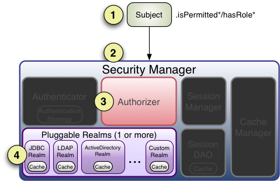

# backend-shiro-learning

Shiro学习：

Shiro：

https://www.bilibili.com/video/BV1j54y1t7jM/?p=77&spm_id_from=pageDriver&vd_source=b850b3a29a70c8eb888ce7dff776a5d1

实现自己的shiro-redis：

https://blog.csdn.net/feiying0canglang/article/details/120319186


# 一、基本信息

## 官网

https://shiro.apache.org/

官方文档：https://shiro.apache.org/reference.html

## Shiro特性图


## Shiro的3个主要概念

Subject/SecurityManager/Realms

3个主要概念的交互图：[来源](https://shiro.apache.org/architecture.html)


## 架构图

[来源](https://shiro.apache.org/architecture.html)


## 架构图中的组件

### Subject（主体）

Subject主体，外部应用与Subject进行交互，Subject将用户作为当前操作的主体，这个主体：可以是一个通过浏览器请求的用户，也可能是一个运行的程序。Subject在Shiro中是一个接口，接口中定义了很多认证授权相关的方法，外部程序通过Subject进行认证授权，而Subject是通过SecurityManager安全管理器进行认证授权。

### SecurityManager（安全管理器）

SecurityManager安全管理器，它是Shiro的核心，负责对所有的Subject进行安全管理。通过SecurityManager可以完成Subject的认证、授权等。SecurityManager是通过Authenticator进行认证，通过Authorizer进行授权，通过SessionManager进行会话管理等。SecurityManager是一个接口，继承了Authenticator、Authorizer、SessionManager这三个接口。

### Authenticator(认证器)

Authenticator即认证器[ɔːˈθɛntɪkeɪtə]，对用户登录时进行身份认证。

authentication认证[ɔːˌθentɪˈkeɪʃn]

principals身份，比如：用户名[ˈprɪnsəpəlz]

credentials证明/凭证，比如：密码[krəˈdenʃlz]

### Authorizer(授权器)

Authorizer即授权器[ˌɔːθəraɪˈzə]，用户通过认证器认证通过，在访问功能时需要通过授权器判断用户是否有此功能的操作权限。

authorization授权[ˌɔːθəraɪˈzeɪʃn]

- 资源（Resource）

在应用中用户科院访问的URL，比如访问JSP页面、查看/编辑某些数据、访问某个业务方法、打印文本等等都是资源。用户只有授权后才能访问。

- 权限（Permission）

安全策略中的原子授权单位，通过权限我们可以表示在应用中用户有没有操作某个资源的权利。即权限表示在应用中用户能不能访问某个资源。如：访问用户列表页面查看/新增/修改/删除用户数据（即很多时候都是CRUD式权限控制）等。权限代表了用户有没有操作某个资源的权利，即反映在某个资源上的操作允不允许。

- Shiro支持的粒度

Shiro支持粗粒度权限（如用户模块的所有权限）和细粒度权限（操作某个用户的权限，即实例级别的）。

- 角色（Role）

权限的集合，一般情况下会赋予用户角色而不是权限，即这样用户可以拥有一组权限，赋予权限时比较方便。典型的如：项目经理、技术总监、CTO、开发工程师等都是角色，不同的角色拥有一组不同的权限。

### Realm(数据库读取+认证功能+授权功能实现)

Realm领域[rɛlm]，相当于DataSource数据源。SecurityManager进行安全认证需要通过Realm获取用户权限数据，比如：

如果用户身份数据在数据库，那么Realm就需要从数据库获取用户身份信息。

注意：不要把Realm理解成只是从数据源取数据，在Realm中还有认证授权校验的相关的代码。

### SessionManager(会话管理器)

SessionManager会话管理，Shiro框架定义了一套会话管理，它不依赖Web容器的Session，所以Shiro可以使用在非Web应用商店，也可以将分布式应用的会话集中在一点管理，此特性可使它实现单点登录。

会话管理器，负责创建和管理用户的会话（Session）生命周期，它能够在任何环境中在本地管理用户会话，即使没有Web/Servlet/EJB容器，也一样可以保存会话。默认情况下，Shiro会检测当前环境中现有的会话机制（比如Servlet容器）进行适配，如果没有（比如独立应用程序或者非Web环境），它将会使用内置的企业会话管理器来提供相应的会话管理服务，其中还涉及一个名为SessionDAO的对象。SessionDAO负责Session的持久化操作（CRUD），允许Session数据写入到后端持久化数据库。


（1）DefaultSessionManager：用于JavaSE环境

（2）ServletContainerSessionManager：用于Web环境，直接使用Servlet容器的会话

（3）DefaultWebSessionManager：用于Web环境，自己维护会话（不使用Servlet容器的会话管理）

获得Session的方式：

（1）实现

```java
Session session = SecurityUtils.getSubject().getSession();
session.setAttribute("key", "value")
```

（2）说明

Controller中的request，在shiro过滤器中的 doFilterInternal 方法，被包装成 ShiroHttpServletRequest。

SecurityManager 和 SessionManager 会话管理器决定 session来源于 ServletRequest 还是由 Shiro 管理的会话。

无论是通过request.getSession或subject.getSession获取到session，操作session，两者都是等价的。

### SessionDAO(会话DAO)

SessionD即会话DAO，是对Session会话操作的一套接口。

比如：可以通过jdbc将会话存储到数据库，也可以把session存储到缓存服务器。

### CacheManager(缓存管理)

CacheManager缓存管理，将用户权限数据存储在缓存，这样可以提高性能。

### Cryptography

Cryptography密码管理[krɪpˈtɒɡrəfi]，Shiro提供了一套加密/解密的组件，方便开发。比如提供常用的散列，加/解密等功能。


# 二、核心

## 认证流程

[来源](https://shiro.apache.org/authentication.html)


### Realm接口


## 授权流程

[来源](https://shiro.apache.org/authorization.html)



1、首先调用Subject.isPermitted/hasRole接口，其会委托给SecurityManager；

2、SecurityManager接着会委托给内部组件Authorizer；

3、Authorizer再将其请求委托给我们的Realm去做；Realm才是真正干活的；

4、Realm将用户请求的参数封装成权限对象，再从我们重写的doGetAuthorizationInfo方法中获取从数据库中查询到的权限集合。

5、Realm将用户传入的权限对象，与从数据库中查询出俩的权限对象，进行一一对比。如果用户传入的权限对象在从数据库中查询出来的权限对象中，则返回true，否则返回false。

进行授权操作的前提：用户必须通过认证。

# 三、Web

## Shiro默认过滤器

org.apache.shiro.web.filter.mgt.DefaultFilter

```java
public enum DefaultFilter {

    anon(AnonymousFilter.class),
    authc(FormAuthenticationFilter.class),
    authcBasic(BasicHttpAuthenticationFilter.class),
    authcBearer(BearerHttpAuthenticationFilter.class),
    logout(LogoutFilter.class),
    noSessionCreation(NoSessionCreationFilter.class),
    perms(PermissionsAuthorizationFilter.class),
    port(PortFilter.class),
    rest(HttpMethodPermissionFilter.class),
    roles(RolesAuthorizationFilter.class),
    ssl(SslFilter.class),
    user(UserFilter.class),
    invalidRequest(InvalidRequestFilter.class);
}
```

### 认证相关

| 过滤器 | 过滤器类                 | 说明                                                         | 默认 |
| ------ | ------------------------ | ------------------------------------------------------------ | ---- |
| authc  | FormAuthenticationFilter | 基于表单的过滤器；如果没有登录会跳到相应的登录页面登录。示例："/**=authc" | 无   |
| logout | LogoutFilter             | 退出过滤器，主要属性 redirectUrl 退出成功后重定向的地址，示例："/logout=logout" | /    |
| anon   | AnonymousFilter          | 匿名过滤器，即不需要登录即可访问；一般用于静态资源过滤；示例："/static/**=anon" | 无   |


### 授权相关

| 过滤器 | 过滤器类                       | 说明                                                         |
| ------ | ------------------------------ | ------------------------------------------------------------ |
| roles  | RolesAuthorizationFilter       | 角色授权过滤器，验证用户是否拥有所有角色；主要属性：loginUrl(/login.jsp)；unauthorizedUrl：未授权后重定向的地址。示例："/admin/**=roles[admin]" |
| perms  | PermissionsAuthorizationFilter | 权限过滤器，验证用户是否拥有所有权限；属性和roles一样。示例："/user/**=perms['user:create']" |
| port   | PortFilter                     | 端口过滤器，主要属性：port(80)，可以通过的端口；             |
| rest   | HttpMethodPermissionFilter     | rest风格过滤器                                               |
| ssl    | SslFilter                      | SSL过滤器，只有请求协议是https才能通过；否则自动跳转到https  |
| user   | UserFilter                     | 登录时勾选了RememberMe                                       |

# 九、授权与角色认证介绍

## @RequiresAuthentication

对应标签：`<shiro:authenticated>`

验证用户是否登录，等同于方法subject.isAuthenticated()

## @RequiresUser

对应标签：`<shiro:user>`

验证用户是否被记忆。

登录认证成功subject.isAuthenticated()为true

登录后被记忆subject.isRemembered()为true

## @RequiresGuest

对应标签：`<shiro:guest>`

验证是否是一个guest的请求，是否是游客的请求，此时subject.getPrincipal()为null

## @RequiresRoles

对应标签：`<shiro:hasRole name="admin"/>`

对应标签：`<shiro:hasAnyRoles name="admin,user"/>`

对应标签：`<shiro:lacksRole name="admin"/>`

验证subject是否有相应角色，有角色访问方法，没有则会抛出异常AuthorizationException

例如：@RequiresRoles("aRoleName")

public void someMethod();

只有subject有aRoleName角色才能访问方法someMethod()

## @RequiresPermissions

对应标签：`<shiro:hasPermission name="user:create"/>`

验证subject是否有相应权限，有权限访问方法，没有则会抛出异常AuthorizationException

例如：@RequiresPermissions("file:read", "write:aFile.txt")

public void someMethod();

subject必须同时含有file:read和write:aFile.txt权限才能访问方法someMethod()

## `<shiro:notAuthenticated>`

用户已经身份验证通过，即没有调用Subject.login进行登录，包括记住我自动登录的也属于未进行身份验证。

## `<shiro:principal/>`

`<shiro:principal property="username"/>`

相当于((User)Subject.getPrincipals()).getUsername()

## <shiro:lacksPermission name="org:create"/>

`<shiro:lacksPermission name="org:create"/>`

如果当前Subject没有权限量显示body体内容。


