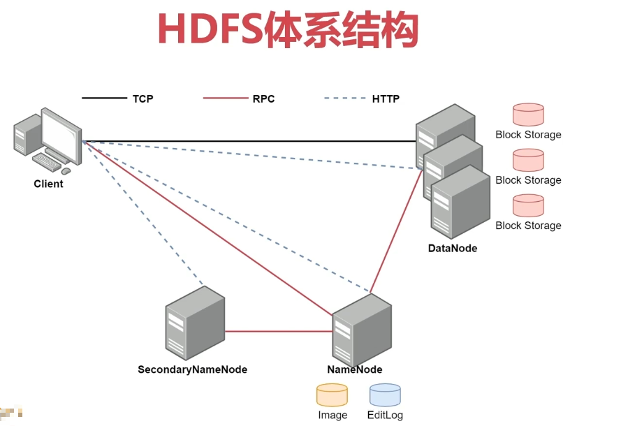

# 第12章 Hadoop伪分布式集群（Apache3版）

### 12.1、Hadoop伪分布式集群（Apache3版）



#### 12.1.1、依赖环境

已配置IP：[配置网络](https://github.com/EmonCodingBackEnd/backend-tutorial/blob/master/tutorials/Linux/LinuxInAction.md#21%E9%85%8D%E7%BD%AE%E7%BD%91%E7%BB%9C)

已设置hostname：[修改主机名](https://github.com/EmonCodingBackEnd/backend-tutorial/blob/master/tutorials/Linux/LinuxInAction.md#13%E4%BF%AE%E6%94%B9%E4%B8%BB%E6%9C%BA%E5%90%8D)

已配置SSH免密登录（emon到emon、emon1和emon2的免密登录）：[配置SSH免密登录](https://github.com/EmonCodingBackEnd/backend-tutorial/blob/master/tutorials/BigData/BigDataInAction.md#1%E9%85%8D%E7%BD%AEssh%E5%85%8D%E5%AF%86%E7%99%BB%E5%BD%95)

已安装JDK：[安装JDK](https://github.com/EmonCodingBackEnd/backend-tutorial/blob/master/tutorials/Linux/LinuxInAction.md#1%E5%AE%89%E8%A3%85jdk)

#### 12.1.2、安装

1. 下载

最新发行版下载页面：https://hadoop.apache.org/releases.html

历史发行版下载页面：https://archive.apache.org/dist/hadoop/common/

```bash
$ wget -cP /usr/local/src/ https://archive.apache.org/dist/hadoop/common/hadoop-3.3.1/hadoop-3.3.1.tar.gz
```

2. 创建安装目录

```bash
$ mkdir /usr/local/Hadoop
```

3. 解压安装

```bash
$ tar -zxvf /usr/local/src/hadoop-3.3.1.tar.gz -C /usr/local/Hadoop/
```

- hadoop软件包常见目录说明

  - `bin`： hadoop客户端命令


  - `etc/hadoop`： hadoop相关的配置文件存放目录


  - `sbin`： 启动hadoop相关进程的脚本


  - `share`： 常用例子

4. 创建软连接

```bash
# 注意：如果ln -s命令，在软连接存在时会导致软连接路径下产生一个无效软连接；-snf会移除旧的
$ ln -snf /usr/local/Hadoop/hadoop-3.3.1/ /usr/local/hadoop
```

5. 配置环境变量

```bash
$ sudo vim /etc/profile.d/hadoop.sh
export HADOOP_HOME=/usr/local/hadoop
export PATH=$HADOOP_HOME/bin:$HADOOP_HOME/sbin:$PATH
```

使之生效：

```bash
$ source /etc/profile
```

#### 12.1.3、配置

##### 1.HDFS配置

- 配置`hadoop-env.sh`

```
$ vim /usr/local/hadoop/etc/hadoop/hadoop-env.sh 
```

```bash
# [新增]
export JAVA_HOME=${JAVA_HOME}
# [新增]
export HADOOP_LOG_DIR=${HADOOP_HOME}/logs
```

- 配置`core-site.xml`

```bash
# 在打开的文件中<configuration>节点内添加属性
$ vim /usr/local/hadoop/etc/hadoop/core-site.xml 
```

```xml
<configuration>
    <property>
        <name>fs.defaultFS</name>
		<value>hdfs://emon:8020</value>
    </property>
    <property>
        <name>hadoop.tmp.dir</name>
        <value>/usr/local/hadoop/tmp</value>
    </property>
</configuration>
```

- 配置`hdfs-site.xml`

```bash
# 修改副本数量
$ vim /usr/local/hadoop/etc/hadoop/hdfs-site.xml 
```

```xml
<configuration>
    <property>
        <name>dfs.replication</name>
        <value>1</value>
    </property>
</configuration>
```

##### 2.YARN配置

1. 配置

- 配置`mapred-site.xml`

```bash
$ vim /usr/local/hadoop/etc/hadoop/mapred-site.xml
```

```xml
<configuration>
    <property>
        <name>mapreduce.framework.name</name>
        <value>yarn</value>
    </property>
</configuration>
```

- 配置`yarn-site.xml`

```bash
$ vim /usr/local/hadoop/etc/hadoop/yarn-site.xml 
```

```xml
<configuration>

<!-- Site specific YARN configuration properties -->
    <property>
        <name>yarn.nodemanager.aux-services</name>
        <value>mapreduce_shuffle</value>
    </property>
    <!-- 白名单 -->
    <property>
    	<name>yarn.nodemanager.env-whitelist</name> 
        <value>JAVA_HOME,HADOOP_COMMON_HOME,HADOOP_HDFS_HOME,HADOOP_CONF_DIR,CLASSPATH_PREPEND_DISTCACHE,HADOOP_YARN_HOME,HADOOP_MAPRED_HOME</value>
    </property>
</configuration>
```

##### 3.节点配置

- `workers`

```bash
$ vim /usr/local/hadoop/etc/hadoop/workers 
```

```bash
# localhost
emon
```

#### 5.3.3、格式化与启动停止

##### 1.HDFS格式化

- 格式化HDFS文件系统：第一次执行的时候一定要格式化文件系统，不要重复执行。

```bash
$ hdfs namenode -format
```

```bash
WARNING: /usr/local/hadoop/logs does not exist. Creating.
2022-01-18 18:20:30,042 INFO namenode.NameNode: STARTUP_MSG: 
/************************************************************
STARTUP_MSG: Starting NameNode
STARTUP_MSG:   host = emon/10.0.0.116
STARTUP_MSG:   args = [-format]
STARTUP_MSG:   version = 3.3.1
STARTUP_MSG:   classpath =......
......省略......
2022-01-18 18:20:31,481 INFO namenode.NameNode: Caching file names occurring more than 10 times
2022-01-18 18:20:31,486 INFO snapshot.SnapshotManager: Loaded config captureOpenFiles: false, skipCaptureAccessTimeOnlyChange: false, snapshotDiffAllowSnapRootDescendant: true, maxSnapshotLimit: 65536
2022-01-18 18:20:31,488 INFO snapshot.SnapshotManager: SkipList is disabled
2022-01-18 18:20:31,494 INFO util.GSet: Computing capacity for map cachedBlocks
2022-01-18 18:20:31,494 INFO util.GSet: VM type       = 64-bit
2022-01-18 18:20:31,495 INFO util.GSet: 0.25% max memory 1.0 GB = 2.7 MB
2022-01-18 18:20:31,495 INFO util.GSet: capacity      = 2^18 = 262144 entries
2022-01-18 18:20:31,502 INFO metrics.TopMetrics: NNTop conf: dfs.namenode.top.window.num.buckets = 10
2022-01-18 18:20:31,502 INFO metrics.TopMetrics: NNTop conf: dfs.namenode.top.num.users = 10
2022-01-18 18:20:31,502 INFO metrics.TopMetrics: NNTop conf: dfs.namenode.top.windows.minutes = 1,5,25
2022-01-18 18:20:31,506 INFO namenode.FSNamesystem: Retry cache on namenode is enabled
2022-01-18 18:20:31,506 INFO namenode.FSNamesystem: Retry cache will use 0.03 of total heap and retry cache entry expiry time is 600000 millis
2022-01-18 18:20:31,508 INFO util.GSet: Computing capacity for map NameNodeRetryCache
2022-01-18 18:20:31,508 INFO util.GSet: VM type       = 64-bit
2022-01-18 18:20:31,509 INFO util.GSet: 0.029999999329447746% max memory 1.0 GB = 326.7 KB
2022-01-18 18:20:31,509 INFO util.GSet: capacity      = 2^15 = 32768 entries
2022-01-18 18:20:31,536 INFO namenode.FSImage: Allocated new BlockPoolId: BP-823583849-10.0.0.116-1642501231529
2022-01-18 18:20:31,563 INFO common.Storage: Storage directory /usr/local/hadoop/tmp/dfs/name has been successfully formatted.
2022-01-18 18:20:31,599 INFO namenode.FSImageFormatProtobuf: Saving image file /usr/local/hadoop/tmp/dfs/name/current/fsimage.ckpt_0000000000000000000 using no compression
2022-01-18 18:20:31,742 INFO namenode.FSImageFormatProtobuf: Image file /usr/local/hadoop/tmp/dfs/name/current/fsimage.ckpt_0000000000000000000 of size 399 bytes saved in 0 seconds .
2022-01-18 18:20:31,767 INFO namenode.NNStorageRetentionManager: Going to retain 1 images with txid >= 0
2022-01-18 18:20:31,796 INFO namenode.FSNamesystem: Stopping services started for active state
2022-01-18 18:20:31,796 INFO namenode.FSNamesystem: Stopping services started for standby state
2022-01-18 18:20:31,806 INFO namenode.FSImage: FSImageSaver clean checkpoint: txid=0 when meet shutdown.
2022-01-18 18:20:31,806 INFO namenode.NameNode: SHUTDOWN_MSG: 
/************************************************************
SHUTDOWN_MSG: Shutting down NameNode at emon/10.0.0.116
************************************************************/
```

##### 2.启动与停止

- 启动

```bash
$ start-all.sh 
# 命令行输出信息
WARNING: Attempting to start all Apache Hadoop daemons as emon in 10 seconds.
WARNING: This is not a recommended production deployment configuration.
WARNING: Use CTRL-C to abort.
Starting namenodes on [emon]
Starting datanodes
Starting secondary namenodes [emon]
Starting resourcemanager
Starting nodemanagers
```

- 停止

```bash
$ stop-all.sh 
WARNING: Stopping all Apache Hadoop daemons as emon in 10 seconds.
WARNING: Use CTRL-C to abort.
Stopping namenodes on [emon]
Stopping datanodes
Stopping secondary namenodes [emon]
Stopping nodemanagers
Stopping resourcemanager
```

- 验证

```bash
$ jps
# 命令行输出信息
115706 NameNode
116051 DataNode
116438 SecondaryNameNode
116671 ResourceManager
116990 NodeManager
117343 Jps
```

- 验证hdfs

**注意**：确保防火墙停止，或者9870端口是放开的！

```bash
$ sudo firewall-cmd --state
not running
```

访问地址：http://emon:9870

可以看到 [Live Nodes](http://emon:9870/dfshealth.html#tab-datanode) 有一个DN节点

- 验证yarn

**注意**：确保防火墙停止，或者8088端口是放开的！

```bash
$ sudo firewall-cmd --state
not running
```

访问地址：http://emon:8088


