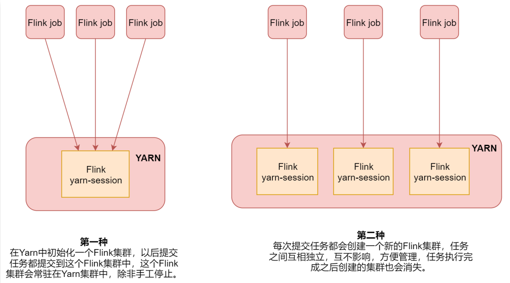
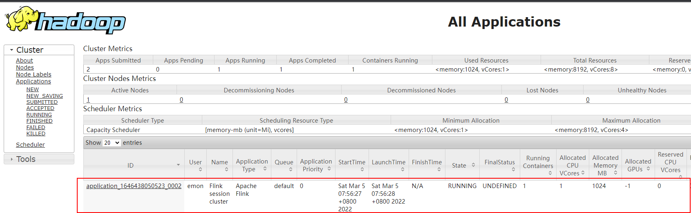

# 第25章 Flink安装

## 25.1、安装Flink

### 25.1、环境依赖

- JDK1.8及以上，配置JAVA_HOME环境变量
- SSH免密登录

### 25.2、Flink安装（Apache版Flink）

#### 25.2.1、安装

1. 下载

官网地址：http://flink.apache.org/

下载地址：https://flink.apache.org/downloads.html

各个版本：https://archive.apache.org/dist/flink/

```bash
$ wget -cP /usr/local/src/ https://dlcdn.apache.org/flink/flink-1.11.6/flink-1.11.6-bin-scala_2.12.tgz --no-check-certificate
```

2. 创建解压目录

```bash
$ mkdir /usr/local/Flink
```

3. 解压安装

```bash
$ tar -zxvf /usr/local/src/flink-1.11.6-bin-scala_2.12.tgz -C /usr/local/Flink/
```

4. 创建软连接

```bash
$ ln -snf /usr/local/Flink/flink-1.11.6/ /usr/local/flink
```

5. 配置环境变量

在`/etc/profile.d`目录创建`flink.sh`文件：

```bash
$ sudo vim /etc/profile.d/flink.sh
export FLINK_HOME=/usr/local/flink
export PATH=$FLINK_HOME/bin:$PATH
```

使之生效：

```bash
$ source /etc/profile
```

#### 25.2.2、Standalone独立集群模式

1. 安装规划

| 机器名 | 角色   | IP1-家庭      | IP2-公司   | 部署内容 |
| ------ | ------ | ------------- | ---------- | -------- |
| emon   | 主节点 | 192.168.1.116 | 10.0.0.116 | master   |
| emon2  | 从节点 | 192.168.1.117 | 10.0.0.117 | slave    |
| emon3  | 从节点 | 192.168.1.118 | 10.0.0.118 | slave    |

2. 配置

- `flink-conf.yaml`

```bash
$ vim /usr/local/flink/conf/flink-conf.yaml 
```

```bash
# [修改]
jobmanager.rpc.address: localhost => jobmanager.rpc.address: emon
```

- `masters`

```bash
$ vim /usr/local/flink/conf/masters 
```

```bash
# localhost:8081
emon:8081
```

- `works`

```bash
$ vim /usr/local/flink/conf/workers 
```

```bash
# localhost
emon2
emon3
```

3. 拷贝到从节点

- 确保emon2和emon3创建安装目录

```bash
[emon@emon2 ~]$ mkdir /usr/local/Flink
[emon@emon3 ~]$ mkdir /usr/local/Flink
```

- 拷贝到emon2和emon3安装目录

```bash
$ scp -rq /usr/local/Flink/flink-1.11.6/ emon@emon2:/usr/local/Flink/
$ scp -rq /usr/local/Flink/flink-1.11.6/ emon@emon3:/usr/local/Flink/
```

- 配置emon2和emon3上软连接

```bash
[emon@emon2 ~]$ ln -snf /usr/local/Flink/flink-1.11.6/ /usr/local/flink
[emon@emon3 ~]$ ln -snf /usr/local/Flink/flink-1.11.6/ /usr/local/flink
```

4. 启动与停止

```bash
$ /usr/local/flink/bin/start-cluster.sh 
```

- 验证主节点

```bash
$ jps
1375 StandaloneSessionClusterEntrypoint
```

- 验证从节点

```bash
[emon@emon2 ~]$ jps
25149 TaskManagerRunner
```

- 验证

http://emon:8081/#/overview

- 停止

```bash
$ /usr/local/flink/bin/stop-cluster.sh
```

5. Standalone集群核心参数

| 参数                            | 解释                                                    |
| ------------------------------- | ------------------------------------------------------- |
| jobmanager.memory.process.size  | 主节点可用内存大小                                      |
| taskmanager.memory.process.size | 从节点可用内存大小                                      |
| taskmanager.numberOfTaskSlots   | 从节点可以启动的进程数量，建议设置为从节点可用的cpu数量 |
| parallelism.default             | Flink任务的默认并行度                                   |

说明：

1：slot是静态的概念，是指taskmanager具有的并发执行能力

2：parallelism是动态的概念，是指Flink程序运行时实际使用的并发能力

3：设置合适的parallelism能提高程序计算效率，太多了和太少了都不好

#### 25.2.3、Flink On YARN

**Flink ON YARN模式依赖Hadoop 2.4.1及以上版本**

##### 1、Flink ON YARN两种使用方式



在工作中建议使用第二种方式。

##### 2、Flink ON YARN第一种方式

**前提：一定确保hadoop启动**

###### 第一步：yarn-session.sh（创建Flink集群）

1. 配置：Hadoop环境配置增加HADOOP_CLASSPATH

- 修改原hadoop环境变量

```bash
$ vim /etc/profile.d/hadoop.sh 
```

```bash
export HADOOP_HOME=/usr/local/hadoop
export PATH=$HADOOP_HOME/bin:$HADOOP_HOME/sbin:$PATH
# 为Flink依赖增加该变量
# ERROR: JAVA_HOME is not set and could not be found.
export JAVA_HOME=/usr/local/java
export HADOOP_CLASSPATH=`$HADOOP_HOME/bin/hadoop classpath`
```

使之生效:

```bash
$ source /etc/profile
```

- 查看hadoop classpath是什么？

```bash
$ hadoop classpath
/usr/local/hadoop/etc/hadoop:/usr/local/hadoop/share/hadoop/common/lib/*:/usr/local/hadoop/share/hadoop/common/*:/usr/local/hadoop/share/hadoop/hdfs:/usr/local/hadoop/share/hadoop/hdfs/lib/*:/usr/local/hadoop/share/hadoop/hdfs/*:/usr/local/hadoop/share/hadoop/mapreduce/lib/*:/usr/local/hadoop/share/hadoop/mapreduce/*:/usr/local/hadoop/share/hadoop/yarn:/usr/local/hadoop/share/hadoop/yarn/lib/*:/usr/local/hadoop/share/hadoop/yarn/*
```

2. 创建一个一直运行的Flink集群

```bash
$ /usr/local/flink/bin/yarn-session.sh -jm 1024m -tm 1024m -d
# 命令行输出结果
......省略......
JobManager Web Interface: http://emon:36484
2022-03-05 07:56:31,921 INFO  org.apache.flink.yarn.cli.FlinkYarnSessionCli                [] - The Flink YARN session cluster has been started in detached mode. In order to stop Flink gracefully, use the following command:
$ echo "stop" | ./bin/yarn-session.sh -id application_1646438050523_0002
If this should not be possible, then you can also kill Flink via YARN's web interface or via:
$ yarn application -kill application_1646438050523_0002
Note that killing Flink might not clean up all job artifacts and temporary files.
```

- 说明：创建一个Flink集群
  - -jm：是指定主节点的内存
  - -tm：是指定从节点的内存
  - -d：是表示把这个进程放到后台去执行
- 访问1：http://emon:36484 该地址以启动日志为准，每次会变化
- 访问2：到YARN的web界面中查看flink这个集群任务

地址：http://emon:8088/cluster




###### 第二步：flink run（提交任务）

3. 执行内置案例验证

```bash
$ /usr/local/flink/bin/flink run /usr/local/flink/examples/batch/WordCount.jar 
# 命令行输出结果
......省略......
2022-03-05 08:06:32,447 INFO  org.apache.flink.yarn.cli.FlinkYarnSessionCli                [] - Found Yarn properties file under /tmp/.yarn-properties-emon.
......省略......
```

注意：`/tmp/.yarn-properties-emon`是启动的Flink集群生成的。

4. 停止Flink集群

```bash
# 从启动日志获取该命令，每次启动的 application_xx 是不一样的
$ yarn application -kill application_1646438050523_0002
```

5. yarn-session命令分析

| 命令                            | 解释                                   |
| ------------------------------- | -------------------------------------- |
| -D `< arg >`                      | 动态属性                               |
| -d,--detached                   | 翻到后台，独立运行                     |
| -j,--jar `<arg>`                  | 指定Flink任务的jar包                   |
| -jm,--jobManagerMemory `< arg >`  | JobManager的内存 [in MB]               |
| -nm,--name                      | 在YARN上为一个自定义的应用设置一个名字 |
| -q,--query                      | 显示YARN中可用的资源（内存，cpu核数）  |
| -qu,--queue `< arg >`             | 指定YARN队列                           |
| -s,--slots `< arg >`              | 每个TaskManager使用的slots数量         |
| -tm,--taskManagerMemory `< arg >` | 每个TaskManager的内存 [in MB]          |


##### 3、Flink ON YARN第二种方式

1. 命令格式

```bash
flink run -m yarn-cluster（创建Flink集群+提交任务）
```

2. 提交内置任务

```bash
$ flink run -m yarn-cluster -yjm 1024 -ytm 1024 /usr/local/flink/examples/batch/WordCount.jar 
```

3. flink run命令解析

| 命令                             | 解释                                               |
| -------------------------------- | -------------------------------------------------- |
| -c,--class `< classname >`         | 动态指定jar包入口类                                |
| -m,--jobmanager `< host:port >`    | 哥你太指定jobmanager（主节点）地址                 |
| -p,--parallelism `< parallelism >` | 哪个台指定程序的并行度，可以覆盖配置文件中的默认值 |


4. 示例

- 默认查找本机`/tmp/.yarn-properties-root`中的节点信息。

```bash
flink run /usr/local/flink/examples/batch/WordCount.jar
```

- 连接指定host和port的jobmanager

```bash
# 提交到已知集群
flink run -m emon:1234 /usr/local/flink/examples/batch/WordCount.jar 
```

- 启动一个新的yarn-session

```bash
# 创建临时集群并提交任务
flink run -m yarn-cluster -yn 2 /usr/local/flink/examples/batch/WordCount.jar 
```

注意：flink可以使用yarn-session.sh中的命令，需要添加一个y前缀。

例如：

```bash
# 创建临时集群并提交任务
flink run -m yarn-cluster -yjm 1024 -ytm 1024 /usr/local/flink/examples/batch/WordCount.jar
```

- 如何停止任务

方式1：在yarn web界面找到applicationId，通过`yarn application -kill applicationId`

方式2：在yarn web界面，点击`ApplicationMaster`进入flink web界面，点击Running Jobs=>点击具体任务进入==>右上角【Cancel Job】

方式3：在yarn web界面找到applicationId，通过`flink cancel -yid applicationId flinkJobId`

其中：flinkJobId和【Cancel Jobe】同一个界面找到

```bash
$ flink cancel -yid application_1646438050523_0004 8df9d2bc80a01ce5b71023e1482f8d3f
```


##### 4、Flink ON YARN的好处

1：提高大数据集群机器的利用率

2： 一套集群，可以执行MR任务，Spark任务，Flink任务等


