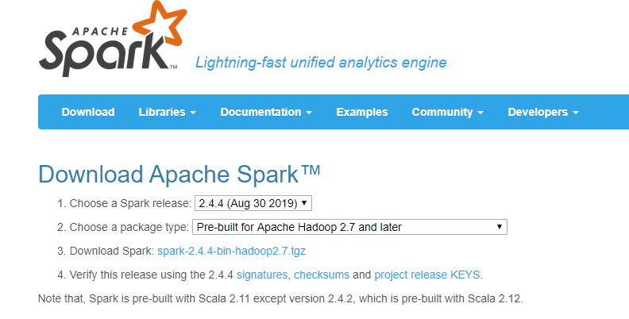

# 第27章 Spark安装（Apache版）

## 27.1、安装Spark

### 27.1.1、基本安装

1. 下载

官网地址：http://spark.apache.org/

下载地址：http://spark.apache.org/downloads.html

各个版本：https://archive.apache.org/dist/spark/



```bash
$ wget -cP /usr/local/src/ https://mirrors.tuna.tsinghua.edu.cn/apache/spark/spark-2.4.4/spark-2.4.4-bin-hadoop2.7.tgz
```

2. 创建安装目录

```bash
$ mkdir /usr/local/Spark
```

3. 解压安装

```bash
$ tar -zxvf /usr/local/src/spark-2.4.4-bin-hadoop2.7.tgz -C /usr/local/Spark/
```

4. 创建软连接

```bash
$ ln -snf /usr/local/Spark/spark-2.4.4-bin-hadoop2.7/ /usr/local/spark
```

5. 配置环境变量

在`/etc/profile.d`目录创建`spark.sh`文件：

```bash
$ sudo vim /etc/profile.d/spark.sh
export SPARK_HOME=/usr/local/spark
export PATH=$SPARK_HOME/bin:$PATH
```

使之生效：

```
$ source /etc/profile
```

6. 修改日志级别（推荐使用默认的WARN）

- 复制

```bash
$ cp /usr/local/spark/conf/log4j.properties.template /usr/local/spark/conf/log4j.properties
```

- 编辑

```bash
$ vim /usr/local/spark/conf/log4j.properties
```

比如，调整为INFO级别：

```bash
log4j.logger.org.apache.spark.repl.Main=INFO
```

### 27.1.2、local模式

- 进入local模式

```bash
emon@emon ~]$ spark-shell 
19/10/05 19:06:45 WARN NativeCodeLoader: Unable to load native-hadoop library for your platform... using builtin-java classes where applicable
Using Spark's default log4j profile: org/apache/spark/log4j-defaults.properties
Setting default log level to "WARN".
To adjust logging level use sc.setLogLevel(newLevel). For SparkR, use setLogLevel(newLevel).
Spark context Web UI available at http://emon:4040
Spark context available as 'sc' (master = local[*], app id = local-1570273742184).
Spark session available as 'spark'.
Welcome to
      ____              __
     / __/__  ___ _____/ /__
    _\ \/ _ \/ _ `/ __/  '_/
   /___/ .__/\_,_/_/ /_/\_\   version 2.4.4
      /_/
         
Using Scala version 2.11.12 (Java HotSpot(TM) 64-Bit Server VM, Java 1.8.0_171)
Type in expressions to have them evaluated.
Type :help for more information.

scala> 
```

- jps查看JAVA进程

```bash
$ jps
60273 Jps
60202 SparkSubmit
15854 jar
```

- 查看60202进程下端口，访问4040端口

```bash
$ sudo netstat -tnlp|grep 60202
tcp6       0      0 :::4040                 :::*                    LISTEN      60202/java          
tcp6       0      0 192.168.1.116:37676     :::*                    LISTEN      60202/java          
tcp6       0      0 192.168.1.116:32793     :::*                    LISTEN      60202/java 
```

http://192.168.1.116:4040

- 退出local模式

```bash
scala> :quit
```

### 27.1.3、Standalone模式


