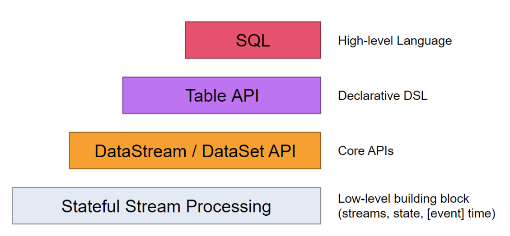
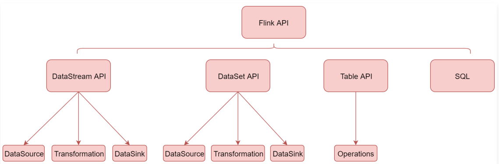

# 第2章 Flink快速上手


## 2.1、Flink任务日志

使用on yarn模式提交Flink任务时，在任务执行中，点击对应任务的Tracking UI列的ApplicationMaster，可以打开Flink界面。

操作路径：在yarn的web界面([http://emon:8088](http://emon:8088/)) ==> 点击对应任务的ApplicationMaster链接（任务执行完成后只能看到history链接）==>点击查看。

如果是history链接，点击进去是看不到flink内容的。

如何解决？开启Flink HistoryServer进程。

任意选择一个服务器开启，选择集群内的节点或者Flink的客户端节点都可以。

下面我们就在这个Flink的客户端节点上启动Flink的historyserver进程。

**说明**：该配置基于Hadoop的MapReduce任务日志配置，请先确保MapReduce的任务日志配置OK！

- `flink-conf.yml`

```bash
$ vim /usr/local/flink/conf/flink-conf.yaml 
```

```yaml
# [新增]
#jobmanager.archive.fs.dir: hdfs:///completed-jobs/
jobmanager.archive.fs.dir: hdfs://emon:8020/tmp/logs/flink-jobs/
# [新增]
#historyserver.web.address: 0.0.0.0
historyserver.web.address: emon
# [新增]
#historyserver.web.port: 8082
historyserver.web.port: 8082
# [新增]
#historyserver.archive.fs.dir: hdfs:///completed-jobs/
historyserver.archive.fs.dir: hdfs://emon:8020/tmp/logs/flink-jobs/
# [新增]
#historyserver.archive.fs.refresh-interval: 10000
historyserver.archive.fs.refresh-interval: 10000
```

注意：在哪个节点上启动Flink的historyserver进程，`historyserver.web.address`的值里面就指定哪个节点的主机名信息。

- 确保日志目录存在

由于不是在根目录(hdfs://emon:8020/)下创建日志目录，需要确保目录已存在。

```bash
# 如果日志目录不存在，启动时会报错
$ hdfs dfs -mkdir -p hdfs://emon:8020/tmp/logs/flink-jobs
```

- 启动

```bash
$ /usr/local/flink/bin/historyserver.sh start
# 命令行输出结果
Starting historyserver daemon on host emon.
```

- 验证

```bash
# 其他进程忽略显示，看到如下进程表示Flink的HistoryServer启动成功
$ jps
13682 HistoryServer
```

访问：

http://emon:8082/#/overview

- 停止

```bash
$ /usr/local/flink/bin/historyserver.sh stop
# 命令行输出结果
Stopping historyserver daemon (pid: 13682) on host emon.
```


## 2.2、Flink核心API



Flink中提供了4中不同层次的API，每种API在简洁和易表达之间有自己的权衡，适用于不同的场景。目前上面3个会用得比较多。

- 低级API（Stateful Stream Processing）：提供了对时间和状态的细粒度控制，简洁性和易用性较差，主要应用在一些复杂事件处理逻辑上。
- 核心API（DataStream/DataSet API）：主要提供了针对流数据和批数据的处理，是针对低级API进行了一些封装，提供了filter、sum、max、min等高级函数，简单易用，所以这些API在工作中应用还是比较广泛的。
- Table API：一般与DataSet或者DataStream紧密关联，可以通过一个DataSet或DataStream创建出一个Table，然后再使用类似于filter，join，或者select这种操作。最后还可以将一个Table对象转换成DataSet或者DataStream。
- SQL：Flink的SQL底层是基于Apache Calcite，Apache Calcite实现了标准的SQL，使用起来比其他API更加灵活，因为可以直接使用SQL语句。Table API和SQL可以很容易地结合在一起使用，因为它们都返回Table对象。

针对这些API我们主要学习下面这些：



下面首先来看一下DataStream API：

### 2.2.1、DataStream API

DataStream API主要分为3块：DataSource、Transformation、DataSink。

DataSource是程序的输入数据源。

Transformation是具体的操作，它对一个或多个输入数据源进行计算处理，例如map、flatMap和filter等操作。

DataSink是程序的输出，它可以把Transformation处理之后的数据输出到指定的存储介质中。

### 2.2.2、DataStream API之DataSource

DataSource是程序的输入数据源，Flink提供了大量内置的DataSource，也支持自定义DataSource，不过目前Flink提供的这些已经足够我们正常使用了。

Flink提供的内置输入数据源：包括基于Socket、基于Collection。

还有就是Flink还提供了一批Connectors，可以实现读取第三方数据源。

| Flink内置             | Apache Bahir |
| --------------------- | ------------ |
| Kafka                 | ActiveMQ     |
| Kinesis Streams       | Netty        |
| RabbitMQ              |              |
| NiFi                  |              |
| Twitter Streaming API |              |
| Google PubSub         |              |

Flink内置：表示Flink中默认自带的。

Apache Bahir：表示需要添加这个依赖包之后才能使用。

当程序出现错误时，Flink的容错机制能恢复并继续运行程序，这种错误包括机器故障、网络故障、程序故障等。

针对Flink提供的常用数据源接口，如果程序开启了checkpoint快照机制，Flink可以提供这些容错性保证。

| DataSource | 容错保证     | 备注                   |
| ---------- | ------------ | ---------------------- |
| DataSource | ad most once |                        |
| Collection | exactly once |                        |
| Kafka      | exactly once | 需要使用0.10及以上版本 |


### 2.2.3、DataStream API之Transformation

transformation是Flink程序的计算算子，负责对数据进行处理，Flink提供了大量的算子，其实Flink中的大部分算子的使用和spark中算子的使用是一样的，下面我们来看一下：

| 算子            | 解释                                                 |
| --------------- | ---------------------------------------------------- |
| map             | 输入一个元素进行处理，返回一个元素                   |
| flatMap         | 输入一个元素进行处理，可以返回多个元素               |
| filter          | 对数据进行过滤，符合条件的数据会被留下               |
| keyBy           | 根据key分组，相同key的数据会进入同一个分区           |
| reduce          | 对当前元素和上一次的结果进行聚合操作                 |
| aggregations    | sum(),min(),max()等                                  |
| union           | 合并多个流，多个流的数据类型必须一致                 |
| connect         | 只能连接两个流，两个流的数据类型可以不同             |
| split           | 根据规则把一个数据流切分为多个流                     |
| shuffle         | random 随机分区                                      |
| rebalance       | rebalance 对数据集进行再平衡，重新分区，消除数据倾斜 |
| rescale         | 重分区                                               |
| broadcast       | 广播分区                                             |
| partitionCustom | custom partition 自定义分区                          |


### 2.2.4、DataStream API之DataSink

DataSink是输出组件，负责把计算好的数据输出到其他存储介质中。

Flink支持把流数据输出到文件中，不过在实际工作中这种场景不多，因为流数据处理之后一般会存储到一些消息队列里面，或者数据库里面，很少会保存到文件中的。

还有就是print，直接打印，这个其实我们已经用过很多次了，这种用法主要是在测试的时候使用的，方便查看输出的结果信息。

Flink提供了一批Connectors，可以实现输出到第三方目的地。

| Flink内置         | Apache Bahir |
| ----------------- | ------------ |
| Kafka             | ActiveMQ     |
| Cassandra         | Flume        |
| Kinesis Streams   | Redis        |
| Elasticsearch     | Akka         |
| Hadoop FileSystem |              |
| RabbitMQ          |              |


针对Sink的这些connector，我们在实际工作中最常用的是Kafka、redis。

针对Flink提供的常用Sink组件，可以提供这些容错性保证：

| DataSink | 容错保证                     | 备注                                                         |
| -------- | ---------------------------- | ------------------------------------------------------------ |
| Redis    | at least once                |                                                              |
| Kafka    | at least once / exactly once | Kafka0.9和0.10提供at least once，Kafka0.11及以上提供exactly once |


> 注意：Redis Sink是在Bahir这个依赖包中，所以在pom.xml中需要添加对应的依赖。


### 2.2.5、DataSet API

DataSet API主要可以分为3块来分析：DataSource、Transformation、Sink。

DataSource是程序的数据源输入。

Transformation是具体的操作，它对一个或多个输入数据源进行计算处理，例如map、flatMap、filter等操作。

DataSink是程序的输出，它可以把Transformation处理之后的数据输出到指定的存储介质中。


### 2.2.6、DataSet API之DataSource

针对DataSet批处理而言，其实最多的就是读取HDFS中的文件数据，所以在这里我们主要介绍两个DataSource组件。

- 基于集合

fromCollection(Collection)，主要是为了方便测试使用。它的用法和DataStreamAPI中的用法一样，我们已经用过很多次了。

- 基于文件

readTextFile(path)，读取hdfs中的数据文件。这个前面我们也使用过了。


### 2.2.7、DataSet API之Transformation

| 算子         | 解释                                   |
| ------------ | -------------------------------------- |
| map          | 输入一个元素进行处理，返回一个元素     |
| mapPartition | 类似map，一次处理一个分区的数据        |
| flatMap      | 输入一个元素进行处理，可以返回多个元素 |
| filter       | 对数据进行过滤，符合条件的数据会被留下 |
| reduce       | 对当前元素和上一次的结果进行聚合操作   |
| aggregate    | sum(),min(),max()等                    |
| distinct     | 返回数据集中去重后的元素·              |
| join         | 内连接，可以连接两份数据集             |
| outerJoin    | 外连接                                 |
| cross        | 获取两个数据集的笛卡尔积               |
| union        | 返回多个数据集的总和，数据类型需要一直 |
| first-n      | 获取集合中的前N个元素                  |


### 2.2.8、Table API&SQL

> 注意：Table API和SQL现在还处于活跃开发阶段，还没有完全实现Flink中所有的特性。不是所有的[Table API, SQL]和[流, 批]的组合都是支持的。

Table API和SQL的由来：

Flink针对标准的流处理和批处理提供了两种关系型API，Table API和SQL。Table API允许用户以一种很直观的方式进行select、filter和join操作。Flink SQL基于Apache Calcite实现标准SQL。针对批处理和流处理可以提供相同的处理语义和结果。

Flink Table API、SQL和Flink的DataStream API、DataSet API是紧密联系在一起的。

Table API和SQL是一种关系型API，用户可以像操作MySQL数据库表一样的操作数据，而不需要写代码，更不需要手工的对代码进行调优。另外，SQL作为一个非程序员可操作的语言，学习成本很低，如果一个系统提供SQL支持，将很容易被用户接受。


### 2.2.9、DataStream、DataSet和Table之间的互相转换

Table API和SQL可以很容易的和DataStream和DataSet程序集成到一块。通过TableEnvironment，可以把DataStream或者DataSet注册为Table，这样就可以使用Table API和SQL查询了。通过TableEnvironment也可以把Table对象转换为DataStream或者DataSet，这样就可以使用DataStream或者DataSet中的相关API了。

1：使用DataStream创建表，主要包含下面两种情况

- 使用DataStream创建view视图
- 使用DataStream创建table对象

2：使用DataSet创建表

> 注意：此时只能使用旧的执行引擎，新的Blink执行引擎不支持和DataSet转换


将Table转换为DataStream或者DataSet时，你需要指定生成的DataStream或者DataSet的数据类型，即，Table的每行数据要转换成的数据类型。通常最方便的选择是转换成Row。

以下列表概述了不同选项的功能：

Row：通过角标映射字段，支持任意数量的字段，支持null值，无类型安全（type-safe）检查。

POJO：Java中的实体类，这个实体类中的字段名称需要和Table中的字段名称保持一致，支持任意数量的字段，支持null值，有类型安全检查。

Case Class：通过角标映射字段，不支持null值，有类型安全检查。

Tuple：通过角标映射字段，Scala中限制22个字段，Java中限制25个字段，不支持null值，有类型安全检查。

Atomic Type：Table必须有一个字段，不支持null值，有类型安全检查。


3：将表转换成DataStream

流式查询的结果Table会被动态地更新，即每个新的记录到达输入流时结果就会发生变化。因此动态查询的DataStream需要对表的更新进行编码。

有几种模式可以将Table转换为DataStream。

- Append Mode：这种模式只适用于当动态表仅由Insert这种操作进行修改时（仅附加），之前添加的数据不会被更新。
- Retract Mode：可以始终使用此模式，它使用一个Boolean标志来编码Insert和Delete更改。


4：将表转换成DataSet


