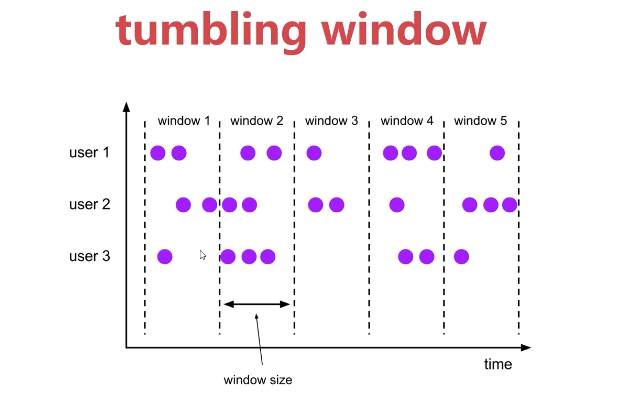
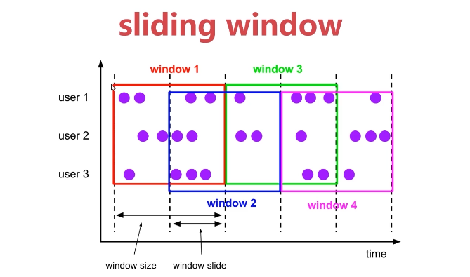
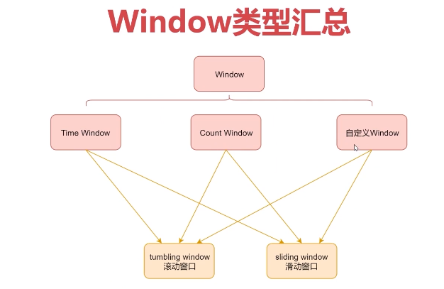
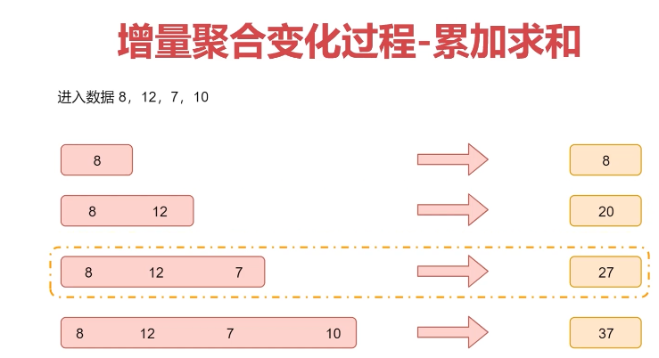
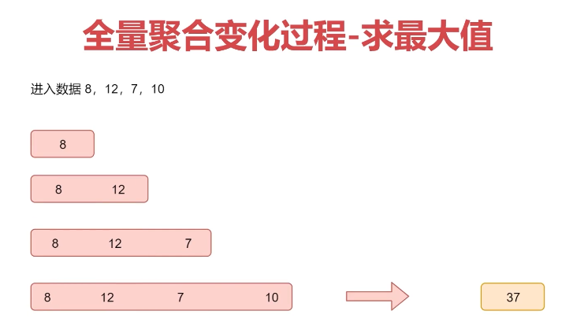
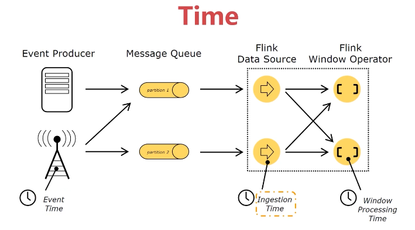

# 第3章 Window与Time详解


## 3.1、Window和Time详解

### 3.1.1、Window（窗口）

- Window是一种可以把无界数据切割为有界数据块的手段
- Window可以是时间驱动的【Time Window】（例如：每30秒），或者数据驱动的【Count Window】（例如：每100个元素）

滚动窗口：



滑动窗口：



Window类型汇总：




### 3.1.2、案例：Window的应用

- 滚动窗口

```scala
// 表示滚动窗口的窗口大小为10秒，对每10秒内的数据进行聚合计算
timeWindow(Time.seconds(10))
// 表示滚动窗口的大小是5个元素，也就是当窗口中填满5个元素的时候，就会对窗口进行计算了
countWindow(5)
```

- 滑动窗口

```scala
// 表示滑动窗口的窗口大小为10秒，滑动间隔5秒，就是每隔5秒计算前10秒
timeWindow(Time.seconds(10),Time.seconds(5))
// 表示滑动窗口的窗口大小是5个元素，滑动的间隔为1个元素，也就是说每新增1个元素就会对前面5个元素计算一次
countWindow(5,1)
```

### 3.1.3、Window聚合

- 增量聚合：窗口中每进入一条数据，就进行一次计算
  - 代表函数：reduce()、aggregate()、sum()、min()、max()




- 全量聚合：等属于窗口的数据到齐，才开始进行聚合计算【可以实现对窗口内的数据进行排序等需求】
  - 代表函数：apply(windowFunction)、process(processWindowFunction)；processWindowFunction比windowFunction提供了更多的上下文信息。




### 3.1.4、Time

- Event Time：事件产生的时间，通常由事件中的时间戳描述

- Ingestion time：事件进入Flink的时间
- Processing Time：事件被处理时当前系统的时间




### 3.1.5、Time案例分析

- 原始日志：2026-01-01 10:00:01 INFO executor.Executor:Finished task in state 0.0
- 日志数据进入Flink的时间是：2026-01-01 20:00:01
- 日志数据到达Window处理的时间是：2026-01-01 20:00:02

如果我们想要统计每分钟内接口调用失败的错误日志个数使用哪个时间才有意义？

原始日志时间。

Flink中Time类型默认是ProcessingTime，可以修改如下：

```scala
env.setStreamTimeCharacteristc(TimeCharacteristic.EventTime)
// 或者：
env.setStreamTimeCharacteristc(TimeCharacteristic.IngestionTime)
```


