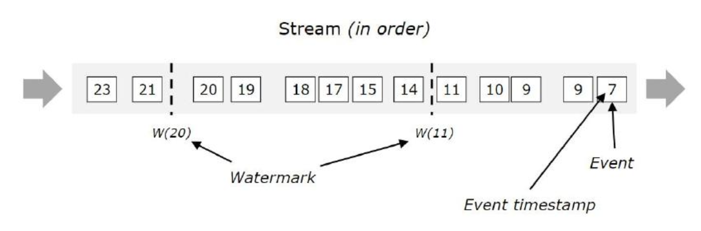
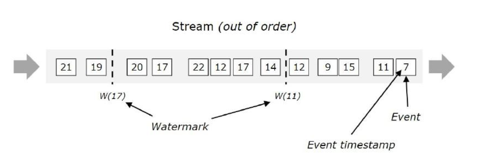
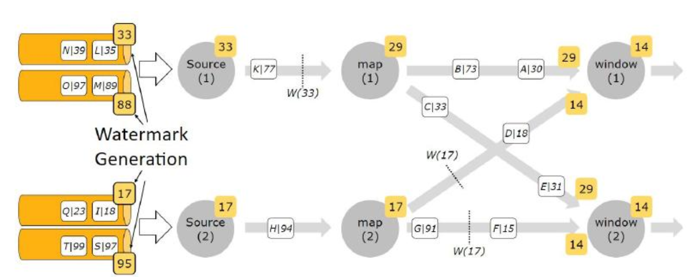
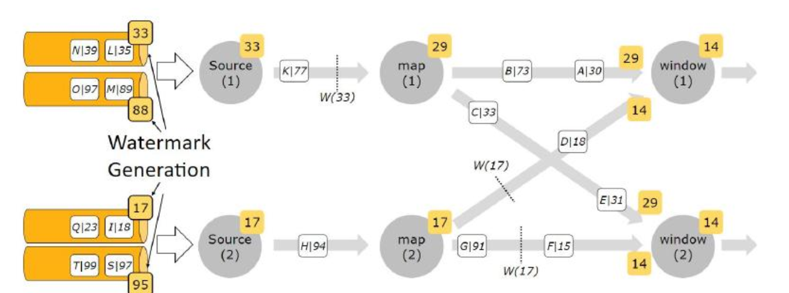

# 第4章 Watermark深入剖析


## 4.1、Watermark概述

### 4.1.1、Watermark

当我们使用EventTime处理流数据的时候会遇到数据乱序的问题，流处理从数据产生，到流经是Source，再到具体的算子，中间是有一个过程和时间的。虽然大部分情况下，传输到算子的数据都是按照数据产生的时间顺序来的，但是也不排除由于网络延迟等原因，导致乱序的产生，特别是使用Kafka的时候，多个分区之间的数据无法保证有序。

所以在进行Window计算的时候，我们又不能无限期地等下去，必须要有一个机制来保证一个特定的时间后，必须触发Window去进行计算了。

**这个特别的机制就是Watermark**。

使用Watermark+EventTime处理乱序数据。Watermark可以翻译为水位线。

### 4.1.2、有序数据流的Watermark



in order：有序的数据流，从左往右。

方块代表的是具体的数据，方块里面的数字代表的是数据产生的时间。

w(11)：表示watermark的值为11，此时表示11之前的数据都到了，可以进行计算了。

w(20)：表示watermark的值为20，此时表示20之前的数据都到了，可以进行计算了。


### 4.1.3、无序数据流的Watermark



out of order：无序的数据流。

w(11)：此时表示11之前的数据都到了，可以对11之前的数据进行计算了，大于11的数据暂时不计算。

w(17)：此时表示17之前的数据都到了，可以对17之前的数据进行计算了，大于17的数据暂时不计算。


### 4.1.4、多并行度数据流的Watermark




注意：在多并行度的情况下，Watermark会有一个对齐机制，这个对齐机制会取所有Channel中最小的Watermark，图中的14和29这两个Watermark，最终取值为14。这样才不会漏掉数据。


### 4.1.5、Watermark的生成方式

通常情况下，在接收到Source的数据后，应该立刻生成Watermark，但是也可以在使用Map或者Filter操作之后，再生成Watermark。

Watermark的生成方式有两种：

- With Periodic Watermarks

周期性触发Watermark的生成和发送。

每隔N秒自动向流里面注入一股Watermark，时间间隔由 `ExecutionConfig.setAutoWatermarkInterval` 决定，现在新版本的Flink默认是 `200ms`。之前默认是 `100ms`。

可以定义一个最大允许乱序的时间，这种比较常用。

- WIth Punctuated Watermarks

基于某些事件触发Watermark的生成和发送。

基于事件向流里面注入一个Watermark，每一个元素都有机会判断是否生成一个Watermark。


### 4.1.6、案例：乱序数据处理

需求分析：

通过socket模拟产生数据，数据的格式为：0001,1790820682000

其中1790820682000是数据产生的时间，也就是EventTime；然后使用map函数对数据进行处理，把数据转换为tuple2的形式。接着再调用`assignTimestampsAndWatermarks`方法抽取timestamp并生成Watermark。

接着再调用Window打印信息来验证Window被触发的时机。最后验证乱序数据的处理方式。


### 4.1.7、通过数据跟踪观察Watermark

在这里重点查看Watermark和Timestamp的时间，通过数据的输出来确定Window的触发时机。

首先我们开启Socket，输入第一条数据。

```bash
$ nc -lk 9000
0001,1790820682000
```

输出的内容：

```tex
key:0001,eventTime:[1790820682000|2026-10-01 10:11:22],currentMaxTimestamp:[1790820682000|2026-10-01 10:11:22],currentWatermark:[1790820672000|2026-10-01 10:11:12]
```

为了查看方便，我们把输出内容汇总到表格中：

| key  | EventTime           | CurrentMaxTimeStamp | Watermark           |
| ---- | ------------------- | ------------------- | ------------------- |
| 0001 | 1790820682000       | 1790820682000       | 1790820672000       |
|      | 2026-10-01 10:11:22 | 2026-10-01 10:11:22 | 2026-10-01 10:11:12 |

此时，Watermark的时间，已经落后于 currentMaxTimestamp 10 秒了，我们继续输入。

```bash
$ nc -lk 9000
0001,1790820686000
```

此时，输出内容如下：

```tex
key:0001,eventTime:[1790820686000|2026-10-01 10:11:26],currentMaxTimestamp:[1790820686000|2026-10-01 10:11:26],currentWatermark:[1790820676000|2026-10-01 10:11:16]
```

我们再次汇总：

| key  | EventTime           | CurrentMaxTimeStamp | Watermark           |
| ---- | ------------------- | ------------------- | ------------------- |
| 0001 | 1790820682000       | 1790820682000       | 1790820672000       |
|      | 2026-10-01 10:11:22 | 2026-10-01 10:11:22 | 2026-10-01 10:11:12 |
| 0001 | 1790820686000       | 1790820686000       | 1790820676000       |
|      | 2026-10-01 10:11:26 | 2026-10-01 10:11:26 | 2026-10-01 10:11:16 |

继续输入。

```bash
$ nc -lk 9000
0001,1790820692000
```

输出内容如下：

```text
key:0001,eventTime:[1790820692000|2026-10-01 10:11:32],currentMaxTimestamp:[1790820692000|2026-10-01 10:11:32],currentWatermark:[1790820682000|2026-10-01 10:11:22]
```

汇总结果如下：

| key  | EventTime                                        | CurrentMaxTimeStamp | Watermark                                        |
| ---- | ------------------------------------------------ | ------------------- | ------------------------------------------------ |
| 0001 | 1790820682000                                    | 1790820682000       | 1790820672000                                    |
|      | <font color='red'>**2026-10-01 10:11:22**</font> | 2026-10-01 10:11:22 | 2026-10-01 10:11:12                              |
| 0001 | 1790820686000                                    | 1790820686000       | 1790820676000                                    |
|      | 2026-10-01 10:11:26                              | 2026-10-01 10:11:26 | 2026-10-01 10:11:16                              |
| 0001 | 1790820692000                                    | 1790820692000       | 1790820682000                                    |
|      | 2026-10-01 10:11:32                              | 2026-10-01 10:11:32 | <font color='red'>**2026-10-01 10:11:22**</font> |

到这里，Window仍然没有被触发，此时Watermark的时间已经等于第一条数据的EventTime了。那么Window到底什么时候被触发呢？我们再次输入。

```bash
$ nc -lk 9000
0001,1790820693000
```

输出内容如下：

```tex
key:0001,eventTime:[1790820693000|2026-10-01 10:11:33],currentMaxTimestamp:[1790820693000|2026-10-01 10:11:33],currentWatermark:[1790820683000|2026-10-01 10:11:23]
```

汇总结果如下：

| key  | EventTime                                        | CurrentMaxTimeStamp | Watermark                                        |
| ---- | ------------------------------------------------ | ------------------- | ------------------------------------------------ |
| 0001 | 1790820682000                                    | 1790820682000       | 1790820672000                                    |
|      | <font color='red'>**2026-10-01 10:11:22**</font> | 2026-10-01 10:11:22 | 2026-10-01 10:11:12                              |
| 0001 | 1790820686000                                    | 1790820686000       | 1790820676000                                    |
|      | 2026-10-01 10:11:26                              | 2026-10-01 10:11:26 | 2026-10-01 10:11:16                              |
| 0001 | 1790820692000                                    | 1790820692000       | 1790820682000                                    |
|      | 2026-10-01 10:11:32                              | 2026-10-01 10:11:32 | 2026-10-01 10:11:22                              |
| 0001 | 1790820693000                                    | 1790820693000       | 1790820683000                                    |
|      | 2026-10-01 10:11:33                              | 2026-10-01 10:11:33 | <font color='red'>**2026-10-01 10:11:23**</font> |

Window仍然没有触发，此时，我们的数据已经发到 2026-10-01 10:11:33 了，根据EventTime来算，最早的数据已经过去了11s了，Window还没有开始计算，那么到底什么时候会触发Window呢？

我们再次增加1s，输入：

```bash
$ nc -lk 9000
0001,1790820694000
```

输出内容如下：

注意：此时窗口执行了。

```tex
key:0001,eventTime:[1790820694000|2026-10-01 10:11:34],currentMaxTimestamp:[1790820694000|2026-10-01 10:11:34],currentWatermark:[1790820684000|2026-10-01 10:11:24]
```

窗口触发后执行的结果：

<font color='red'>*(0001),1,2026-10-01 10:11:22,2026-10-01 10:11:22,2026-10-01 10:11:21,2026-10-01 10:11:24*</font>

汇总结果如下：

| key  | EventTime                                        | CurrentMaxTimeStamp | Watermark                                        | Window_start_time                      | Window_end_time                        |
| ---- | ------------------------------------------------ | ------------------- | ------------------------------------------------ | -------------------------------------- | -------------------------------------- |
| 0001 | 1790820682000                                    | 1790820682000       | 1790820672000                                    |                                        |                                        |
|      | <font color='red'>**2026-10-01 10:11:22**</font> | 2026-10-01 10:11:22 | 2026-10-01 10:11:12                              |                                        |                                        |
| 0001 | 1790820686000                                    | 1790820686000       | 1790820676000                                    |                                        |                                        |
|      | 2026-10-01 10:11:26                              | 2026-10-01 10:11:26 | 2026-10-01 10:11:16                              |                                        |                                        |
| 0001 | 1790820692000                                    | 1790820692000       | 1790820682000                                    |                                        |                                        |
|      | 2026-10-01 10:11:32                              | 2026-10-01 10:11:32 | 2026-10-01 10:11:22                              |                                        |                                        |
| 0001 | 1790820693000                                    | 1790820693000       | 1790820683000                                    |                                        |                                        |
|      | 2026-10-01 10:11:33                              | 2026-10-01 10:11:33 | 2026-10-01 10:11:23                              |                                        |                                        |
| 0001 | 1790820694000                                    | 1790820694000       | 1790820684000                                    |                                        |                                        |
|      | 2026-10-01 10:11:34                              | 2026-10-01 10:11:34 | <font color='red'>**2026-10-01 10:11:24**</font> | <font color='red'>**[10:11:21**</font> | <font color='red'>**10:11:24)**</font> |

到这里，我们做一个说明。

Window的触发机制，是先按照自然时间将Window划分，如果Window大小是3s，那么1min内会把Window划分为如下的形式（左闭右开的区间）。

```tex
[00:00:00,00:00:03)
[00:00:03,00:00:06)
[00:00:06,00:00:09)
[00:00:09,00:00:12)
[00:00:12,00:00:15)
[00:00:15,00:00:18)
[00:00:18,00:00:21)
[00:00:21,00:00:24)
[00:00:24,00:00:27)
[00:00:27,00:00:30)
[00:00:30,00:00:33)
[00:00:33,00:00:36)
[00:00:36,00:00:39)
[00:00:39,00:00:42)
[00:00:42,00:00:45)
[00:00:45,00:00:48)
[00:00:51,00:00:54)
[00:00:54,00:00:57)
[00:00:57,00:01:00)
......
```

Window的设定无关数据本身，而是系统定义好了的。

输入的数据，根据自身的EventTime，将数据划分到不同的Window中，如果Window中有数据，则当Watermark时间>=EventTime时，就符合了Window触发的条件了，最终决定Window触发，还是由数据本身的EventTime所属Window中的window_end_time决定。

上面的测试中，最后一条数据到达后，其水位线（Watermark）已经上升至10:11:24，正好是最早的一条记录所在Window的window_end_time，所以Window就被触发了。

为了验证Window的触发机制，我们继续输入数据：

```bash
$ nc -lk 9000
0001,1790820696000
```

输出内容如下：

```tex
key:0001,eventTime:[1790820696000|2026-10-01 10:11:36],currentMaxTimestamp:[1790820696000|2026-10-01 10:11:36],currentWatermark:[1790820686000|2026-10-01 10:11:26]
```

汇总结果如下：

| key  | EventTime                                        | CurrentMaxTimeStamp | Watermark                                        | Window_start_time | Window_end_time |
| ---- | ------------------------------------------------ | ------------------- | ------------------------------------------------ | ----------------- | --------------- |
| 0001 | 1790820682000                                    | 1790820682000       | 1790820672000                                    |                   |                 |
|      | 2026-10-01 10:11:22                              | 2026-10-01 10:11:22 | 2026-10-01 10:11:12                              |                   |                 |
| 0001 | 1790820686000                                    | 1790820686000       | 1790820676000                                    |                   |                 |
|      | <font color='red'>**2026-10-01 10:11:26**</font> | 2026-10-01 10:11:26 | 2026-10-01 10:11:16                              |                   |                 |
| 0001 | 1790820692000                                    | 1790820692000       | 1790820682000                                    |                   |                 |
|      | 2026-10-01 10:11:32                              | 2026-10-01 10:11:32 | 2026-10-01 10:11:22                              |                   |                 |
| 0001 | 1790820693000                                    | 1790820693000       | 1790820683000                                    |                   |                 |
|      | 2026-10-01 10:11:33                              | 2026-10-01 10:11:33 | 2026-10-01 10:11:23                              |                   |                 |
| 0001 | 1790820694000                                    | 1790820694000       | 1790820684000                                    |                   |                 |
|      | 2026-10-01 10:11:34                              | 2026-10-01 10:11:34 | 2026-10-01 10:11:24                              | 10:11:21          | 10:11:24        |
| 0001 | 1790820696000                                    | 1790820696000       | 1790820686000                                    |                   |                 |
|      | 2026-10-01 10:11:36                              | 2026-10-01 10:11:36 | <font color='red'>**2026-10-01 10:11:26**</font> |                   |                 |

此时，Watermark时间虽然已经等于第二天数据的时间，但是由于其没有达到第二天数据所在Window的结束时间，所以Window并没有被触发。那么，第二条数据所在的Window时间区间如下。

```tex
[00:00:24,00:00:27)
```

也就是说，我们必须输入一个10:11:37的数据，第二条数据所在的Window才会被触发，我们继续输入。

```bash
$ nc -lk 9000
0001,1790820697000
```

输出内容如下：

```tex
key:0001,eventTime:[1790820697000|2026-10-01 10:11:37],currentMaxTimestamp:[1790820697000|2026-10-01 10:11:37],currentWatermark:[1790820687000|2026-10-01 10:11:27]
```

窗口触发后执行的结果：

<font color='red'>*(0001),1,2026-10-01 10:11:26,2026-10-01 10:11:26,2026-10-01 10:11:24,2026-10-01 10:11:27*</font>

汇总结果如下：

| key  | EventTime                                        | CurrentMaxTimeStamp | Watermark                                        | Window_start_time                      | Window_end_time                        |
| ---- | ------------------------------------------------ | ------------------- | ------------------------------------------------ | -------------------------------------- | -------------------------------------- |
| 0001 | 1790820682000                                    | 1790820682000       | 1790820672000                                    |                                        |                                        |
|      | 2026-10-01 10:11:22                              | 2026-10-01 10:11:22 | 2026-10-01 10:11:12                              |                                        |                                        |
| 0001 | 1790820686000                                    | 1790820686000       | 1790820676000                                    |                                        |                                        |
|      | <font color='red'>**2026-10-01 10:11:26**</font> | 2026-10-01 10:11:26 | 2026-10-01 10:11:16                              |                                        |                                        |
| 0001 | 1790820692000                                    | 1790820692000       | 1790820682000                                    |                                        |                                        |
|      | 2026-10-01 10:11:32                              | 2026-10-01 10:11:32 | 2026-10-01 10:11:22                              |                                        |                                        |
| 0001 | 1790820693000                                    | 1790820693000       | 1790820683000                                    |                                        |                                        |
|      | 2026-10-01 10:11:33                              | 2026-10-01 10:11:33 | 2026-10-01 10:11:23                              |                                        |                                        |
| 0001 | 1790820694000                                    | 1790820694000       | 1790820684000                                    |                                        |                                        |
|      | 2026-10-01 10:11:34                              | 2026-10-01 10:11:34 | 2026-10-01 10:11:24                              | 10:11:21                               | 10:11:24                               |
| 0001 | 1790820696000                                    | 1790820696000       | 1790820686000                                    |                                        |                                        |
|      | 2026-10-01 10:11:36                              | 2026-10-01 10:11:36 | 2026-10-01 10:11:26                              |                                        |                                        |
| 0001 | 1790820697000                                    | 1790820697000       | 1790820687000                                    |                                        |                                        |
|      | 2026-10-01 10:11:37                              | 2026-10-01 10:11:37 | <font color='red'>**2026-10-01 10:11:27**</font> | <font color='red'>**[10:11:24**</font> | <font color='red'>**10:11:27)**</font> |

此时，我们已经看到，Window的触发要符合以下几个条件。

1：Watermark时间>=window_end_time。

2：在[window_start_time,window_end_time)区间中有数据存在（注意是左闭右开的区间）。

同时满足了以上2个条件，Window才会触发。

### 4.1.8、Watermark+EventTime处理乱序数据

**程序不需要重启，接着4.2.7继续**

我们上面的测试，数据都是按照时间顺序递增的，现在，我们输入一些乱序的数据，看看Watermark集合EventTime机制，是如何处理乱序数据的。

在上面的基础上再输入两行数据。

```bash
$ nc -lk 9000
0001,1790820699000
0001,1790820691000
```

输出内容如下：

```bash
key:0001,eventTime:[1790820699000|2026-10-01 10:11:39],currentMaxTimestamp:[1790820699000|2026-10-01 10:11:39],currentWatermark:[1790820689000|2026-10-01 10:11:29]
key:0001,eventTime:[1790820691000|2026-10-01 10:11:31],currentMaxTimestamp:[1790820699000|2026-10-01 10:11:39],currentWatermark:[1790820689000|2026-10-01 10:11:29]
```

汇总结果如下：

| key  | EventTime           | CurrentMaxTimeStamp                              | Watermark                                        | Window_start_time | Window_end_time |
| ---- | ------------------- | ------------------------------------------------ | ------------------------------------------------ | ----------------- | --------------- |
| 0001 | 1790820682000       | 1790820682000                                    | 1790820672000                                    |                   |                 |
|      | 2026-10-01 10:11:22 | 2026-10-01 10:11:22                              | 2026-10-01 10:11:12                              |                   |                 |
| 0001 | 1790820686000       | 1790820686000                                    | 1790820676000                                    |                   |                 |
|      | 2026-10-01 10:11:26 | 2026-10-01 10:11:26                              | 2026-10-01 10:11:16                              |                   |                 |
| 0001 | 1790820692000       | 1790820692000                                    | 1790820682000                                    |                   |                 |
|      | 2026-10-01 10:11:32 | 2026-10-01 10:11:32                              | 2026-10-01 10:11:22                              |                   |                 |
| 0001 | 1790820693000       | 1790820693000                                    | 1790820683000                                    |                   |                 |
|      | 2026-10-01 10:11:33 | 2026-10-01 10:11:33                              | 2026-10-01 10:11:23                              |                   |                 |
| 0001 | 1790820694000       | 1790820694000                                    | 1790820684000                                    |                   |                 |
|      | 2026-10-01 10:11:34 | 2026-10-01 10:11:34                              | 2026-10-01 10:11:24                              | 10:11:21          | 10:11:24        |
| 0001 | 1790820696000       | 1790820696000                                    | 1790820686000                                    |                   |                 |
|      | 2026-10-01 10:11:36 | 2026-10-01 10:11:36                              | 2026-10-01 10:11:26                              |                   |                 |
| 0001 | 1790820697000       | 1790820697000                                    | 1790820687000                                    |                   |                 |
|      | 2026-10-01 10:11:37 | 2026-10-01 10:11:37                              | 2026-10-01 10:11:27                              | 10:11:24          | 10:11:27        |
| 0001 | 1790820699000       | 1790820699000                                    | 1790820689000                                    |                   |                 |
|      | 2026-10-01 10:11:39 | 2026-10-01 10:11:39                              | 2026-10-01 10:11:29                              |                   |                 |
| 0001 | 1790820691000       | 1790820699000                                    | 1790820689000                                    |                   |                 |
|      | 2026-10-01 10:11:31 | <font color='red'>**2026-10-01 10:11:39**</font> | <font color='red'>**2026-10-01 10:11:29**</font> |                   |                 |

可以看到，虽然我们输入了一个10:11:31的数据，但是currentMaxTimestamp和Watermark都没变。此时，按照我们上面提到的公式。

1：watermark时间>=window_end_time

2：在[window_start_time,window_end_time)中有数据存在

Watermark时间(10:11:29)<window_end_time(10:11:33)，因此不能触发Window。

备注：`10:11:33`的依据是数据`2026-10-01 10:11:32`在`[00:00:30,00:00:33)`区间。

那如果我们再次输入一条10:11:43的数据，此时Watermark时间会上升到10:11:33，这时的Window一定就会触发了，我们试一试，继续输入内容。

```bash
$ nc -lk 9000
0001,1790820703000
```

输出内容如下：

```tex
key:0001,eventTime:[1790820703000|2026-10-01 10:11:43],currentMaxTimestamp:[1790820703000|2026-10-01 10:11:43],currentWatermark:[1790820693000|2026-10-01 10:11:33]
```

窗口触发后执行的结果：

<font color='red'>*(0001),2,2026-10-01 10:11:31,2026-10-01 10:11:32,2026-10-01 10:11:30,2026-10-01 10:11:33*</font>

汇总结果如下：

| key  | EventTime                                        | CurrentMaxTimeStamp | Watermark           | Window_start_time                      | Window_end_time                        |
| ---- | ------------------------------------------------ | ------------------- | ------------------- | -------------------------------------- | -------------------------------------- |
| 0001 | 1790820682000                                    | 1790820682000       | 1790820672000       |                                        |                                        |
|      | 2026-10-01 10:11:22                              | 2026-10-01 10:11:22 | 2026-10-01 10:11:12 |                                        |                                        |
| 0001 | 1790820686000                                    | 1790820686000       | 1790820676000       |                                        |                                        |
|      | 2026-10-01 10:11:26                              | 2026-10-01 10:11:26 | 2026-10-01 10:11:16 |                                        |                                        |
| 0001 | 1790820692000                                    | 1790820692000       | 1790820682000       |                                        |                                        |
|      | <font color='red'>**2026-10-01 10:11:32**</font> | 2026-10-01 10:11:32 | 2026-10-01 10:11:22 |                                        |                                        |
| 0001 | 1790820693000                                    | 1790820693000       | 1790820683000       |                                        |                                        |
|      | 2026-10-01 10:11:33                              | 2026-10-01 10:11:33 | 2026-10-01 10:11:23 |                                        |                                        |
| 0001 | 1790820694000                                    | 1790820694000       | 1790820684000       |                                        |                                        |
|      | 2026-10-01 10:11:34                              | 2026-10-01 10:11:34 | 2026-10-01 10:11:24 | 10:11:21                               | 10:11:24                               |
| 0001 | 1790820696000                                    | 1790820696000       | 1790820686000       |                                        |                                        |
|      | 2026-10-01 10:11:36                              | 2026-10-01 10:11:36 | 2026-10-01 10:11:26 |                                        |                                        |
| 0001 | 1790820697000                                    | 1790820697000       | 1790820687000       |                                        |                                        |
|      | 2026-10-01 10:11:37                              | 2026-10-01 10:11:37 | 2026-10-01 10:11:27 | 10:11:24                               | 10:11:27                               |
| 0001 | 1790820699000                                    | 1790820699000       | 1790820689000       |                                        |                                        |
|      | 2026-10-01 10:11:39                              | 2026-10-01 10:11:39 | 2026-10-01 10:11:29 |                                        |                                        |
| 0001 | 1790820691000                                    | 1790820699000       | 1790820689000       |                                        |                                        |
|      | <font color='red'>**2026-10-01 10:11:31**</font> | 2026-10-01 10:11:39 | 2026-10-01 10:11:29 |                                        |                                        |
| 0001 | 1790820703000                                    | 1790820703000       | 1790820693000       |                                        |                                        |
|      | 2026-10-01 10:11:43                              | 2026-10-01 10:11:43 | 2026-10-01 10:11:33 | <font color='red'>**[10:11:30**</font> | <font color='red'>**10:11:33)**</font> |

这里我们可以看到，窗口中有2个数据，10:11:31和10:11:32，但是没有10:11:33的数据，原因是窗口是一个前闭后开的区间，10:11:33的数据是属于[10:11:33,10:11:36)这个窗口的。

上边的结果，已经表明，对于迟到的数据，Flink可以通过Watermark来实现处理一定范围内的乱序数据。那么对于“迟到（late element）”太久的数据，Flink是怎么处理的呢？


### 4.1.9、Late Element（延迟数据）的处理方式

**程序需要重启，重新开始**

#### 1：丢弃（默认）

针对延迟太久的数据有3种处理方案。

1：丢弃（默认）

我们输入一个乱序很多的（其实只要Event Time<Watermark时间）数据来测试一下：

输入2行内容。

```bash
$ nc -lk 9000
0001,1790820690000
0001,1790820703000
```

输出内容如下：

```tex
key:0001,eventTime:[1790820690000|2026-10-01 10:11:30],currentMaxTimestamp:[1790820690000|2026-10-01 10:11:30],currentWatermark:[1790820680000|2026-10-01 10:11:20]
key:0001,eventTime:[1790820703000|2026-10-01 10:11:43],currentMaxTimestamp:[1790820703000|2026-10-01 10:11:43],currentWatermark:[1790820693000|2026-10-01 10:11:33]
```

<font color='red'>*(0001),1,2026-10-01 10:11:30,2026-10-01 10:11:30,2026-10-01 10:11:30,2026-10-01 10:11:33*</font>

汇总结果如下：

| key  | EventTime                                        | CurrentMaxTimeStamp | Watermark                                        | Window_start_time                      | Window_end_time                        |
| ---- | ------------------------------------------------ | ------------------- | ------------------------------------------------ | -------------------------------------- | -------------------------------------- |
| 0001 | 1790820690000                                    | 1790820690000       | 1790820689000                                    |                                        |                                        |
|      | <font color='red'>**2026-10-01 10:11:30**</font> | 2026-10-01 10:11:30 | 2026-10-01 10:11:20                              |                                        |                                        |
| 0001 | 1790820703000                                    | 1790820703000       | 1790820693000                                    |                                        |                                        |
|      | 2026-10-01 10:11:43                              | 2026-10-01 10:11:43 | <font color='red'>**2026-10-01 10:11:33**</font> | <font color='red'>**[10:11:30**</font> | <font color='red'>**10:11:33)**</font> |

注意：此时watermark是2026-10-01 10:11:13


下面我们再输入几个EventTime小于Watermark的时间。

```bash
$ nc -lk 9000
0001,1790820690000
0001,1790820691000
0001,1790820692000
```

输出内容如下：

```tex
key:0001,eventTime:[1790820690000|2026-10-01 10:11:30],currentMaxTimestamp:[1790820703000|2026-10-01 10:11:43],currentWatermark:[1790820693000|2026-10-01 10:11:33]
key:0001,eventTime:[1790820691000|2026-10-01 10:11:31],currentMaxTimestamp:[1790820703000|2026-10-01 10:11:43],currentWatermark:[1790820693000|2026-10-01 10:11:33]
key:0001,eventTime:[1790820692000|2026-10-01 10:11:32],currentMaxTimestamp:[1790820703000|2026-10-01 10:11:43],currentWatermark:[1790820693000|2026-10-01 10:11:33]
```

注意：此时并没有触发Window。因为输入的数据所在的窗口已经执行过了，Flink默认对这些迟到的数据的处理方案就是丢弃。


#### 2：allowedLateness指定允许数据延迟的时间

**程序需要重启，重新开始**

在某些情况下，我们希望对迟到的数据再提供一个宽容的时间。

Flink提供了allowedLateness方法可以实现对迟到的数据设置一个延迟时间，在指定延迟时间内到达的数据还是可以触发Window执行的。

添加一行代码，如下：

```scala
    waterMarkStream.keyBy(0)
      // 按照消息的EventTime分配窗口，和调用TimeWindow效果一样
      .window(TumblingEventTimeWindows.of(Time.seconds(3)))
      // 允许数据迟到2秒
      .allowedLateness(Time.seconds(2))
      // 使用全量聚合的方式处理Window中的数据
```

下面我们来验证一下，输入2行内容。

```bash
$ nc -lk 9000
0001,1790820690000
0001,1790820703000
```

输出内容如下：

```tex
key:0001,eventTime:[1790820690000|2026-10-01 10:11:30],currentMaxTimestamp:[1790820690000|2026-10-01 10:11:30],currentWatermark:[1790820680000|2026-10-01 10:11:20]
key:0001,eventTime:[1790820703000|2026-10-01 10:11:43],currentMaxTimestamp:[1790820703000|2026-10-01 10:11:43],currentWatermark:[1790820693000|2026-10-01 10:11:33]
```

<font color='red'>*(0001),1,2026-10-01 10:11:30,2026-10-01 10:11:30,2026-10-01 10:11:30,2026-10-01 10:11:33*</font>

正常触发Window，没什么问题。


汇总结果如下：

| key  | EventTime                                        | CurrentMaxTimeStamp | Watermark                                        | Window_start_time                      | Window_end_time                        |
| ---- | ------------------------------------------------ | ------------------- | ------------------------------------------------ | -------------------------------------- | -------------------------------------- |
| 0001 | 1790820690000                                    | 1790820690000       | 1790820689000                                    |                                        |                                        |
|      | <font color='red'>**2026-10-01 10:11:30**</font> | 2026-10-01 10:11:30 | 2026-10-01 10:11:20                              |                                        |                                        |
| 0001 | 1790820703000                                    | 1790820703000       | 1790820693000                                    |                                        |                                        |
|      | 2026-10-01 10:11:43                              | 2026-10-01 10:11:43 | <font color='red'>**2026-10-01 10:11:33**</font> | <font color='red'>**[10:11:30**</font> | <font color='red'>**10:11:33)**</font> |

此时Watermark是2026-10-01 10:11:33，那么现在我们再输入几条EventTime<Watermark的数据验证一下效果，输入3行内容。

```bash
$ nc -lk 9000
0001,1790820690000
0001,1790820691000
0001,1790820692000
```

输出内容如下：

```
key:0001,eventTime:[1790820690000|2026-10-01 10:11:30],currentMaxTimestamp:[1790820703000|2026-10-01 10:11:43],currentWatermark:[1790820693000|2026-10-01 10:11:33]
(0001),2,2026-10-01 10:11:30,2026-10-01 10:11:30,2026-10-01 10:11:30,2026-10-01 10:11:33
key:0001,eventTime:[1790820691000|2026-10-01 10:11:31],currentMaxTimestamp:[1790820703000|2026-10-01 10:11:43],currentWatermark:[1790820693000|2026-10-01 10:11:33]
(0001),3,2026-10-01 10:11:30,2026-10-01 10:11:31,2026-10-01 10:11:30,2026-10-01 10:11:33
key:0001,eventTime:[1790820692000|2026-10-01 10:11:32],currentMaxTimestamp:[1790820703000|2026-10-01 10:11:43],currentWatermark:[1790820693000|2026-10-01 10:11:33]
(0001),4,2026-10-01 10:11:30,2026-10-01 10:11:32,2026-10-01 10:11:30,2026-10-01 10:11:33
```

在这里看到每条数据都触发了Window执行。

| key  | EventTime           | CurrentMaxTimeStamp | Watermark                                        | Window_start_time                      | Window_end_time                        |
| ---- | ------------------- | ------------------- | ------------------------------------------------ | -------------------------------------- | -------------------------------------- |
| 0001 | 1790820690000       | 1790820690000       | 1790820689000                                    |                                        |                                        |
|      | 2026-10-01 10:11:30 | 2026-10-01 10:11:30 | 2026-10-01 10:11:20                              |                                        |                                        |
| 0001 | 1790820703000       | 1790820703000       | 1790820693000                                    |                                        |                                        |
|      | 2026-10-01 10:11:43 | 2026-10-01 10:11:43 | 2026-10-01 10:11:33                              | [10:11:30                              | 10:11:33)                              |
| 0001 | 1790820690000       | 1790820703000       | 1790820693000                                    |                                        |                                        |
|      | 2026-10-01 10:11:30 | 2026-10-01 10:11:43 | <font color='red'>**2026-10-01 10:11:33**</font> | <font color='red'>**[10:11:30**</font> | <font color='red'>**10:11:33)**</font> |
| 0001 | 1790820691000       | 1790820703000       | 1790820693000                                    |                                        |                                        |
|      | 2026-10-01 10:11:31 | 2026-10-01 10:11:43 | <font color='red'>**2026-10-01 10:11:33**</font> | <font color='red'>**[10:11:30**</font> | <font color='red'>**10:11:33)**</font> |
| 0001 | 1790820692000       | 1790820703000       | 1790820693000                                    |                                        |                                        |
|      | 2026-10-01 10:11:32 | 2026-10-01 10:11:43 | <font color='red'>**2026-10-01 10:11:33**</font> | <font color='red'>**[10:11:30**</font> | <font color='red'>**10:11:33)**</font> |

我们再输入1条数据，把Watermark调整到10:11:34。

```bash
$ nc -lk 9000
0001,1790820704000
```

输出内容如下：

```bash
key:0001,eventTime:[1790820704000|2026-10-01 10:11:44],currentMaxTimestamp:[1790820704000|2026-10-01 10:11:44],currentWatermark:[1790820694000|2026-10-01 10:11:34]
```

| key  | EventTime           | CurrentMaxTimeStamp | Watermark           | Window_start_time | Window_end_time |
| ---- | ------------------- | ------------------- | ------------------- | ----------------- | --------------- |
| 0001 | 1790820690000       | 1790820690000       | 1790820689000       |                   |                 |
|      | 2026-10-01 10:11:30 | 2026-10-01 10:11:30 | 2026-10-01 10:11:20 |                   |                 |
| 0001 | 1790820703000       | 1790820703000       | 1790820693000       |                   |                 |
|      | 2026-10-01 10:11:43 | 2026-10-01 10:11:43 | 2026-10-01 10:11:33 | [10:11:30         | 10:11:33)       |
| 0001 | 1790820690000       | 1790820703000       | 1790820693000       |                   |                 |
|      | 2026-10-01 10:11:30 | 2026-10-01 10:11:43 | 2026-10-01 10:11:33 |                   |                 |
| 0001 | 1790820691000       | 1790820703000       | 1790820693000       |                   |                 |
|      | 2026-10-01 10:11:31 | 2026-10-01 10:11:43 | 2026-10-01 10:11:33 | [10:11:30         | 10:11:33)       |
| 0001 | 1790820692000       | 1790820703000       | 1790820693000       |                   |                 |
|      | 2026-10-01 10:11:32 | 2026-10-01 10:11:43 | 2026-10-01 10:11:33 | [10:11:30         | 10:11:33)       |
| 0001 | 1790820704000       | 1790820704000       | 1790820694000       |                   |                 |
|      | 2026-10-01 10:11:44 | 2026-10-01 10:11:44 | 2026-10-01 10:11:34 |                   |                 |

此时，把Watermark上升到了10:11:34，我们再输入几条EventTime<Watermark的数据验证一下效果，输入3行内容。

```bash
$ nc -lk 9000
0001,1790820690000
0001,1790820691000
0001,1790820692000
```

输出内容如下：

```tex
key:0001,eventTime:[1790820690000|2026-10-01 10:11:30],currentMaxTimestamp:[1790820704000|2026-10-01 10:11:44],currentWatermark:[1790820694000|2026-10-01 10:11:34]
(0001),5,2026-10-01 10:11:30,2026-10-01 10:11:32,2026-10-01 10:11:30,2026-10-01 10:11:33
key:0001,eventTime:[1790820691000|2026-10-01 10:11:31],currentMaxTimestamp:[1790820704000|2026-10-01 10:11:44],currentWatermark:[1790820694000|2026-10-01 10:11:34]
(0001),6,2026-10-01 10:11:30,2026-10-01 10:11:32,2026-10-01 10:11:30,2026-10-01 10:11:33
key:0001,eventTime:[1790820692000|2026-10-01 10:11:32],currentMaxTimestamp:[1790820704000|2026-10-01 10:11:44],currentWatermark:[1790820694000|2026-10-01 10:11:34]
(0001),7,2026-10-01 10:11:30,2026-10-01 10:11:32,2026-10-01 10:11:30,2026-10-01 10:11:33
```

发现输入的3行数据都触发了Window的执行。

我们再输入1行数据，把Watermark调整到10:11:35。

```bash
$ nc -lk 9000
0001,1790820705000
```

输出内容如下：

```bash
key:0001,eventTime:[1790820705000|2026-10-01 10:11:45],currentMaxTimestamp:[1790820705000|2026-10-01 10:11:45],currentWatermark:[1790820695000|2026-10-01 10:11:35]
```

此时，Watermark上升到了10:11:35。


我们再输入几条EventTime<Watermark的数据验证一下效果，输入3条数据。

```bash
$ nc -lk 9000
0001,1790820690000
0001,1790820691000
0001,1790820692000
```

输出内容如下：

```tex
key:0001,eventTime:[1790820690000|2026-10-01 10:11:30],currentMaxTimestamp:[1790820705000|2026-10-01 10:11:45],currentWatermark:[1790820695000|2026-10-01 10:11:35]
key:0001,eventTime:[1790820691000|2026-10-01 10:11:31],currentMaxTimestamp:[1790820705000|2026-10-01 10:11:45],currentWatermark:[1790820695000|2026-10-01 10:11:35]
key:0001,eventTime:[1790820692000|2026-10-01 10:11:32],currentMaxTimestamp:[1790820705000|2026-10-01 10:11:45],currentWatermark:[1790820695000|2026-10-01 10:11:35]
```

发现这几条数据都没有触发Window。

- 分析一下：

当Watermark等于10:11:33的时候，正好是window_end_time，所以会触发[10:11:30~10:11:33)的WIndow执行。

当窗口执行过后，我们再输入[10:11:30~10:11:33)这个WIndow内的数据会发现Window是可以被触发的。

当Watermark提升到10:11:34的时候，我们输入[10:11:30~10:11:33)这个Window内的数据会发现Window也是可以被触发的。

当Watermark提升到10:11:35的时候，我们输入[10:11:30~10:11:33)这个Window内的数据会发现Window不会被触发了。

由于我们在前面设置了allowedLateness(Time.seconds(2))，因此可以允许延迟在2s内的数据继续触发Window执行。所以当Watermark是10:11:34的时候可以触发Window，但是10:11:34的时候就不行了。

- 总结如下：

对于此窗口而言，允许2秒的迟到数据，即第一次触发是在 **Watermark>=window_end_time** 时

第二次（或多次）触发的条件是 **Watermark < window_end_time + allowedLateness**  时间内，这个窗口有Late数据到达时。

当Watermark等于10:11:34的时候，我们输入EventTime为10:11:30、10:11:31、10:11:32的数据的时候，是可以触发的，因为这些数据的window_end_time都是10:11:33，也就是10:11:34（Watermark时间）<10:11:33+2为true。

但是当Watermark等于10:11:35的时候，我们再输入EventTime为10:11:30、10:11:31、10:11:32的数据的时候，这些数据的window_end_time都是10:11:33，此时，10:11:35（Watermark时间）<10:11:33+2为false了，所以最终这些数据迟到的时间太久了，就不会再触发Window的执行操作了。


#### 3：sideOutputLateData收集知道的数据

**程序需要重启，重新开始**

通过sideOutputLateData函数可以把迟到的数据统一收集，统一处理，方便后期排查问题。

需要先调整代码：

```scala
    // 保存被丢弃的数据：第一步
    val outputTag = new OutputTag[Tuple2[String, Long]]("late-data") {}

    val resStream: DataStream[String] = waterMarkStream.keyBy(0)
      // 按照消息的EventTime分配窗口，和调用TimeWindow效果一样
      .window(TumblingEventTimeWindows.of(Time.seconds(3)))
      // 保存被丢弃的数据：第二步
      .sideOutputLateData(outputTag)
      // 使用全量聚合的方式处理Window中的数据

// ==================================================

	// 保存被丢弃的数据：第三步。把迟到的数据取出来，暂时打印到控制台，实际工作中可以选择存储到其它存储介质中，例如：redis，kafka
    val sideOutput = resStream.getSideOutput(outputTag)
    sideOutput.print()
```

我们来输入一些数据验证一下，输入2行数据。

```bash
$ nc -lk 9000
0001,1790820690000
0001,1790820703000
```

输出内容如下：

```tex
key:0001,eventTime:[1790820690000|2026-10-01 10:11:30],currentMaxTimestamp:[1790820690000|2026-10-01 10:11:30],currentWatermark:[1790820680000|2026-10-01 10:11:20]
key:0001,eventTime:[1790820703000|2026-10-01 10:11:43],currentMaxTimestamp:[1790820703000|2026-10-01 10:11:43],currentWatermark:[1790820693000|2026-10-01 10:11:33]
(0001),1,2026-10-01 10:11:30,2026-10-01 10:11:30,2026-10-01 10:11:30,2026-10-01 10:11:33
```

此时，Window被触发执行了，此时Watermark是10:11:33。

下面我们再输入几条EventTime小于Watermark的数据测试一下，输入3行数据。

```bash
$ nc -lk 9000
0001,1790820690000
0001,1790820691000
0001,1790820692000
```

输出内容如下：

```tex
key:0001,eventTime:[1790820690000|2026-10-01 10:11:30],currentMaxTimestamp:[1790820703000|2026-10-01 10:11:43],currentWatermark:[1790820693000|2026-10-01 10:11:33]
(0001,1790820690000)
key:0001,eventTime:[1790820691000|2026-10-01 10:11:31],currentMaxTimestamp:[1790820703000|2026-10-01 10:11:43],currentWatermark:[1790820693000|2026-10-01 10:11:33]
(0001,1790820691000)
key:0001,eventTime:[1790820692000|2026-10-01 10:11:32],currentMaxTimestamp:[1790820703000|2026-10-01 10:11:43],currentWatermark:[1790820693000|2026-10-01 10:11:33]
(0001,1790820692000)
```

此时，针对这几条迟到的数据，都通过sideOutputLateData保存到了outputTag中。

### 4.1.10、多并行度下的Watermark应用

前面在代码中设置了并行度为1.

env.setParallelism(1);

如果这里不设置的话，代码在IDEA中运行的时候会默认读取本机CPU数量来设置并行度，把代码中并行度的代码注释掉。

```scala
    // 设置使用数据产生的时间：EventTime
    env.setStreamTimeCharacteristic(TimeCharacteristic.EventTime)
    // 设置全局并行度为1
    // env.setParallelism(1)
    // 设置自动周期性的产生Watermark，默认值为200毫秒
    env.getConfig.setAutoWatermarkInterval(200)
```

然后在输出内容前面加上线程ID信息。

```scala
              // 计算当前的Watermark，为了打印出来，方便观察数据，没有别的作用
              currentWatermark = currentMaxTimestamp - 10000L
              val threadId = Thread.currentThread().getId
              // 此println语句仅仅是为了在学习阶段观察数据的变化
              println("threadId:" + threadId +
                ",key:" + ele._1
                + ",eventTime:[" + ele._2 + "|" + sdf.format(ele._2) + "]"
                + ",currentMaxTimestamp:[" + currentMaxTimestamp + "|" + sdf.format(currentMaxTimestamp) + "]"
                + ",currentWatermark:[" + currentWatermark + "|" + sdf.format(currentWatermark) + "]"
              )
```

输入如下7行内容。

```bash
$ nc -lk 9000
0001,1790820682000
0001,1790820686000
0001,1790820692000
0001,1790820693000
0001,1790820694000
0001,1790820695000
0001,1790820697000
```

输出内容如下：

```tex
threadId:81,key:0001,eventTime:[1790820682000|2026-10-01 10:11:22],currentMaxTimestamp:[1790820682000|2026-10-01 10:11:22],currentWatermark:[1790820672000|2026-10-01 10:11:12]
threadId:82,key:0001,eventTime:[1790820686000|2026-10-01 10:11:26],currentMaxTimestamp:[1790820686000|2026-10-01 10:11:26],currentWatermark:[1790820676000|2026-10-01 10:11:16]
threadId:91,key:0001,eventTime:[1790820692000|2026-10-01 10:11:32],currentMaxTimestamp:[1790820692000|2026-10-01 10:11:32],currentWatermark:[1790820682000|2026-10-01 10:11:22]
threadId:95,key:0001,eventTime:[1790820693000|2026-10-01 10:11:33],currentMaxTimestamp:[1790820693000|2026-10-01 10:11:33],currentWatermark:[1790820683000|2026-10-01 10:11:23]
threadId:93,key:0001,eventTime:[1790820694000|2026-10-01 10:11:34],currentMaxTimestamp:[1790820694000|2026-10-01 10:11:34],currentWatermark:[1790820684000|2026-10-01 10:11:24]
threadId:97,key:0001,eventTime:[1790820695000|2026-10-01 10:11:35],currentMaxTimestamp:[1790820695000|2026-10-01 10:11:35],currentWatermark:[1790820685000|2026-10-01 10:11:25]
threadId:99,key:0001,eventTime:[1790820697000|2026-10-01 10:11:37],currentMaxTimestamp:[1790820697000|2026-10-01 10:11:37],currentWatermark:[1790820687000|2026-10-01 10:11:27]
```

发现Window没有被触发，因为此时，这7条数据都是被不同的线程处理的，每个线程都有一个Watermark。

因为在多并行度的情况下，Watermark对齐机制会取所有Channel最小的Watermark，但是我们现在默认有12个并行度（取自本机CPU核心数），这7条数据都被不同的线程所处理，到现在还没获取到最小的Watermark，所以Window无法被触发执行。




下面我们来验证一下，把代码中的并行度设置为2。

```scala
    // 设置使用数据产生的时间：EventTime
    env.setStreamTimeCharacteristic(TimeCharacteristic.EventTime)
    // 设置全局并行度为2
    env.setParallelism(2)
    // 设置自动周期性的产生Watermark，默认值为200毫秒
    env.getConfig.setAutoWatermarkInterval(200)
```

输入如下内容。

```bash
$ nc -lk 9000
0001,1790820690000
0001,1790820703000
0001,1790820708000
```

输出内容：

<font color='red'>**threadId:71**</font>,key:0001,eventTime:[1790820690000|2026-10-01 10:11:30],currentMaxTimestamp:[1790820690000|2026-10-01 10:11:30],currentWatermark:[1790820680000|<font color='red'>**2026-10-01 10:11:20**</font>]
<font color='red'>**threadId:70**</font>key:0001,eventTime:[1790820703000|2026-10-01 10:11:43],currentMaxTimestamp:[1790820703000|2026-10-01 10:11:43],currentWatermark:[1790820693000|<font color='red'>**2026-10-01 10:11:33**</font>]
<font color='red'>**threadId:71**</font>,key:0001,eventTime:[1790820708000|2026-10-01 10:11:48],currentMaxTimestamp:[1790820708000|2026-10-01 10:11:48],currentWatermark:[1790820698000|2026-10-01 10:11:38]
<font color='red'>**(0001),1,2026-10-01 10:11:30,2026-10-01 10:11:30,2026-10-01 10:11:30,2026-10-01 10:11:33**</font>


此时会发现，当第3条数据输入完成以后，[10:11:30,10:11:33)这个Window触发了。

前两条数据输入之后，获取到的最小Watermark是10:11:20，这个时候对应的Window中没有数据。

第3条数据输入之后，获取到的最小Watermark是10:11:33，这个时候对应的窗口就是[10:11:30,10:11:33)，所以就触发了。


### 4.1.11、Watermark案例总结

Flink应该如何设置最大乱序时间？

- 这个要结合自己的业务以及数据情况去设置。如果 OutOfOrderness 设置的太小，而自身数据发送时由于网络等原因导致乱序或者迟到太多，那么最终的结果就是会有很多数据被丢弃，对数据的正确性影响太大。
- 对于严重乱序的数据，需要严格统计数据最大延迟时间，才能最大程度保证计算数据的准确度，延迟时间设置太小会影响数据准确性，延迟时间设置太大不仅影响数据的实时性，更会加重Flink作业的负担，不是对EventTime要求特别严格的数据，尽量不要采用EventTime方式来处理。

