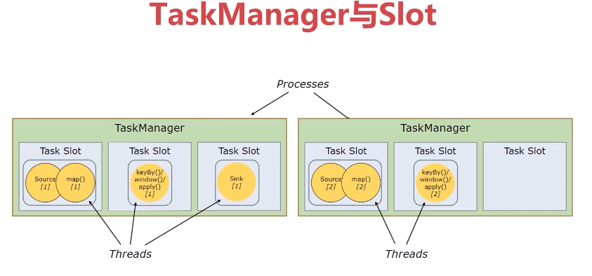
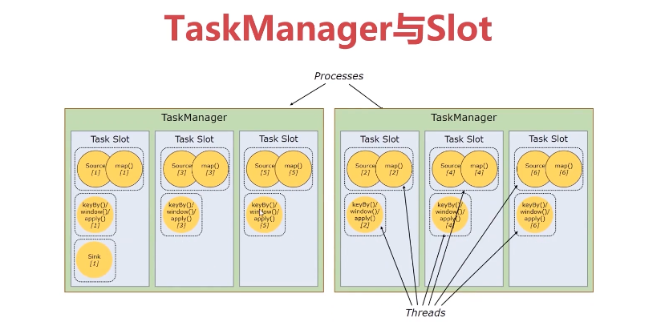
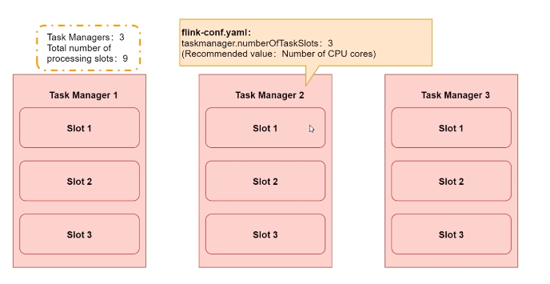
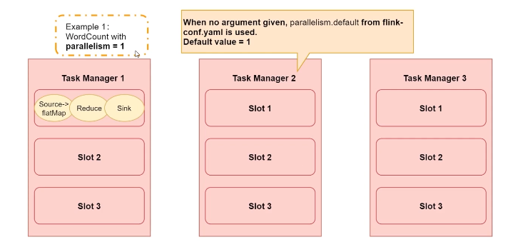
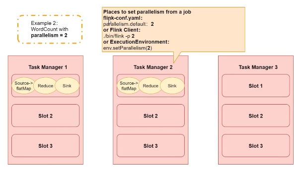
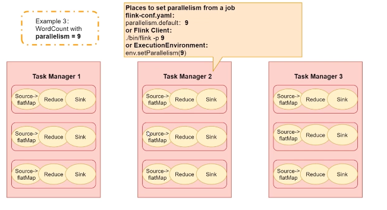
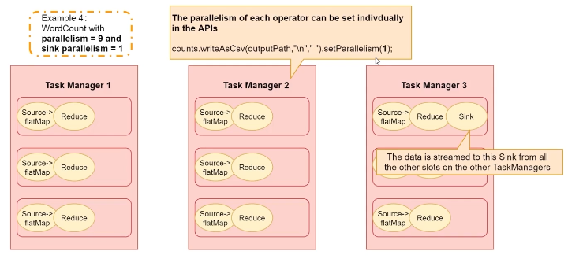

# 第5章 并行度详解


## 5.1、并行度基本概念

### 5.1.1、并行度

- 一个Flink任务由多个组件组成（DataSource、Transformation和DataSink）
- 一个组件由多个并行的实例（线程）来执行，一个组件的并行实例（线程）数目就被称为该组件的并行度

### 5.1.2、TaskManager与Slot

1：Flink中每一个TaskManager都是一个JVM进程，它可能会在独立的线程上执行一个或多个subtask；

2：为了控制一个TaskManager能接收多少个task，TaskManager通过task slot来进行控制（一个TaskManager至少有一个slot）；

3：每个task slot表示TaskManager拥有资源的一个固定大小的子集。**假如一个TaskManager有三个slot，那么它会将其管理的内存分成三份给各个slot**（注：这里不会涉及CPU的隔离，slot仅仅用来隔离task的受管理内存）；

4：可以通过调整task slot的数量去自定义subtask之间的隔离方式。如果一个TaskManager一个slot时，那么每个task group运行在独立的JVM中。而当一个TaskManager多个slot时，多个subtask可以共同享有一个JVM，而在同一个JVM进程中的task将共享TCP连接和心跳消息，也可能共享数据集和数据结构，从而减少每个task的负载。

见下图：



1：默认情况下，Flink允许子任务共享slot，即使它们是不同任务的子任务（前提是它们来自同一个job）。这样的结果是，一个slot可以保存作业的整个管道。

2：Task Slot是静态的概念，是指TaskManager具有的并发执行能力，可以通过参数taskmanager.numberOfTaskSlots进行配置；而并行度parallelism是动态的概念，即TaskManager运行程序时实际使用的并发能力，可以通过参数parallelism.default进行配置。

见下图：



### 5.1.3、并行度的设置

- Flink任务的并行度可以通过4个层面来设置：优先级依次降低！
  - Operator Level（算子层面）
  - Execution Environment Level（执行环境层面）
  - Client Level（客户端层面）
  - System Level（系统层面）

#### 1：算子层面

```scala
wordCount.print().setParallelism(1)
```

#### 2：执行环境层面

```scala
// 设置全局并行度为2
env.setParallelism(2)
```

#### 3：客户端层面

并行度可以在客户端提交Job时设定，通过-p参数指定并行度。

```bash
flink run -p 10 WordCount-java.jar
```

#### 4：系统层面

在系统层面可以通过设置flink-conf.yaml文件中的parallelism.default属性来指定所有执行环境的默认并行度。

```yaml
parallelism.default: 1
```

### 5.1.4、并行度案例分析

举例：如果总共有3个TaskManager，每一个TaskManager中分配了3个TaskSlot，也就是每个TaskManager可以接收3个task，这样我们总共可以接收9个Task Slot。



#### 1：并行度为1

如果我们设置parallelism.default=1，那么当程序运行时9个TaskSlot将只有1个运行，8个都会处于空闲状态，所以要学会合理设置并行度！



#### 2：并行度为2

如果我们设置parallelism.default=2，那么当程序运行时9个TaskSlot将只有2个运行，7个都会处于空闲状态，所以要学会合理设置并行度！



#### 3：并行度为9

最大可设置9个并行度，因为只有9个Slot。



#### 4：Transformation并行度9，但sink并行度为1




