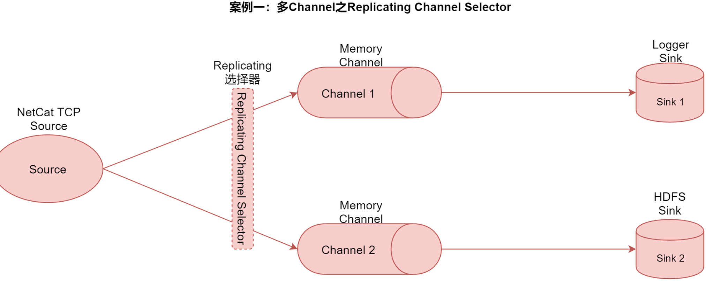
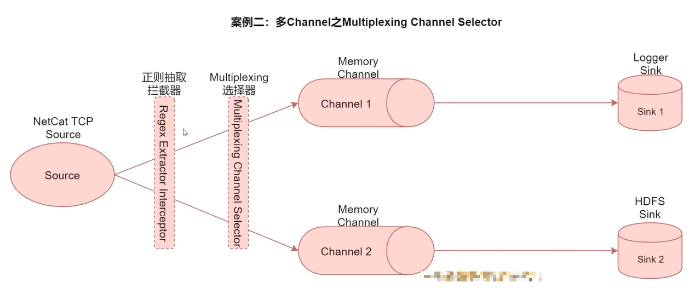
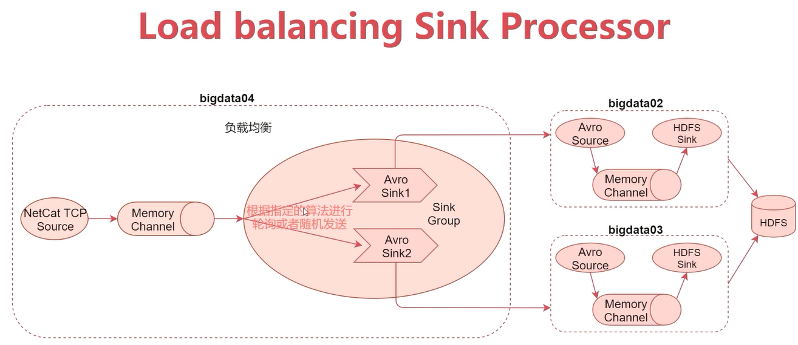
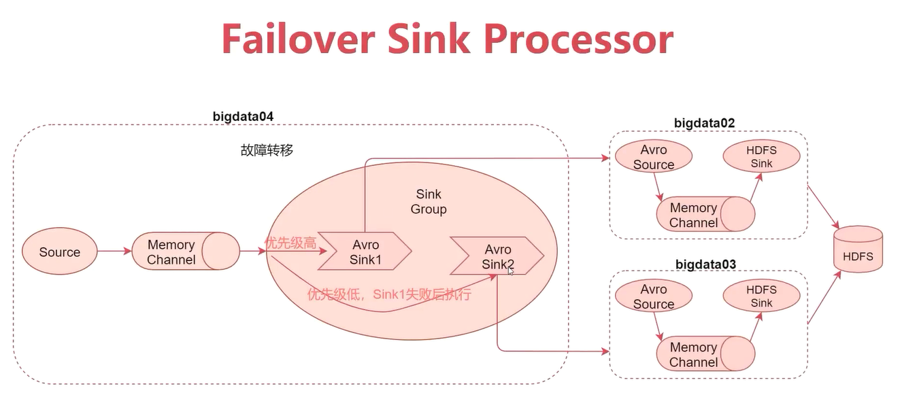

# 第2章 Event与高级组件


## 2.1、Event

Event是Flume传输数据的基本单位，也是事务的基本单位，在文本文件中，通常一行记录就是一个Event。

Event包含header和body。

- body：是采集到的那一行记录的原始内容。
- header：类型为Map<String, String>，里面可以存储一些属性信息，方便后续使用。

我们可以在Source中给每一条数据的header中增加key-value，在Chanel和Sink中使用header中的值了。

## 2.2、高级组件

- Source Interceptors：Source可以指定一个或者多个拦截器，按先后顺序依次对采集到的数据进行处理。

  - > 常见Interceptors类型：Timestamp Interceptor、Host Interceptor、Search and Replace Interceptor、Static Interceptor、Regex Extractor Interceptor等。

  - 简单介绍

    - > Timestamp Interceptor：向event中的header里面添加timestamp时间戳信息。

    - > Host Interceptor：向event中的header里面添加host属性，host的值为当前机器的主机名或者ip。

    - > Search and Replace Interceptor：根据指定的规则查询Event中的body里面的数据，然后进行替换，这个拦截器会修改event中body的值，也就是会修改原始采集到的数据内容。【修改body值】【常用】

    - > Static Interceptor：向event中的header里面添加固定的key和value。

    - > Regex Extractor Interceptor：根据指定的规则从Event中的body里面抽取数据，生成key和value，再把key和value添加到header中。【常用】

- Channel Selectors：Source发往多个Channel的策略设置。

  - > Channel Selectors类型包括：Replicating Channel Selector和Multiplexing Channel Selector，其中Replicating Channel Selector是默认的选择器，它会将Source采集过来的Event发往所有Channel。

- Sink Processors：Sink发送数据的策略设置。

  - > Sink Processors类型包括这三种：Default Sink Processor、Load balancing Sink Processor和Failover Sink Processor

  - 简单介绍

    - > Default Sink Processor是默认的，不用配置sinkgroup，就是咱们现在使用的这种最普通的形式，一个channel后面接一个sink的形式。

    - > Load balancing Sink Processor是负载均衡处理器，一个channel后面可以接多个sink，这多个sink属于一个sinkgroup，根据指定的算法进行轮询或者随机发送，减轻单个sink的压力。

    - > Failover Sink Processor是故障转移处理器，一个channel后面可以接多个sink，这多个sink属于一个sinkgroup，按照sink的优先级，默认先让优先级高的sink来处理数据，如果这个sink出现了故障，则用优先级第一点的sink处理数据，可以保障数据不丢失。

### 2.2.1、案例：对采集到的数据按天按类型分目录存储

需求：对采集到的数据按天按类型分目录存储。

原始数据格式：

```tex
video_info
{"id":"14943445328940974601","uid":"840717325115457536","lat":"53.530598","lnt":"-2.5620373","hots":0,"title":"0","status":"1","topicId":"0","end_time":"1494344570","watch_num":0,"share_num":"1","replay_url":null,"replay_num":0,"start_time":"1494344544","timestamp":1494344571,"type":"video_info"}
user_info
{"uid":"861848974414839801","nickname":"mick","usign":"","sex":1,"birthday":"","face":"","big_face":"","email":"abc@qq.com","mobile":"","reg_type":"102","last_login_time":"1494344580","reg_time":"1494344580","last_update_time":"1494344580","status":"5","is_verified":"0","verified_info":"","is_seller":"0","level":1,"exp":0,"anchor_level":0,"anchor_exp":0,"os":"android","timestamp":1494344580,"type":"user_info"}
gift_record
{"send_id":"834688818270961664","good_id":"223","video_id":"14943443045138661356","gold":"10","timestamp":1494344574,"type":"gift_record"}
```

这份数据中有三种类型的数据，视频信息、用户信息、送礼信息，数据都是json格式的，这些数据还有一个共性就是里面都有一个type字段，type字段的值代表数据类型。

当我们的直播平台正常运行时，会实时产生这些日志数据，我们希望把这些数据采集到hdfs上进行存储，并且要按照数据类型进行分目录存储，视频数据放一块、用户数据放一块、送礼数据放一块，针对这个需求配置agent的话，source使用基于文件的execsource、channel使用基于文件的channel，我们希望保证数据的完整性和准确性，sink使用hdfssink。

但注意，hdfssink中的path不能写死，首先是按照天就是需要动态获取日期，然后是因为不同类型的数据要存储到不同的目录中，也就意味着path路径中肯定要有变量，除了日期变量还有数据类型变量。

这里的数据类型的格式都是单词中间有一个下划线，但是我们的要求是目录中的单次不要出现下划线，使用驼峰的命名格式。

所以，在hdfs中最终生成的目录大致是如下这样的：

```bash
hdfs://emon:8020/moreType/20200101/videoInfo
hdfs://emon:8020/moreType/20200101/userInfo
hdfs://emon:8020/moreType/20210101/giftRecord
```

所以，整体流程如下：
`Exec Source`=>`Search and Replace Interceptor`=>`Regex Extractor Interceptor`=>`File Channel`=>`HDFS Sink`.

- 配置

```bash
$ mkdir /home/emon/bigdata/flume/shell/config/execFileHdfs
$ vim /home/emon/bigdata/flume/shell/config/execFileHdfs/exec-file-hdfs.conf
```

```properties
# agent的名称是a1
# 指定source组件、channel组件和sink组件的名称
a1.sources = r1
a1.sinks = k1
a1.channels = c1

# 配置sources组件
a1.sources.r1.type = exec
a1.sources.r1.command = tail -F /home/emon/bigdata/flume/shell/config/execFileHdfs/moreType.log

# 配置拦截器[多个拦截器按照顺序依次执行]
a1.sources.r1.interceptors = i1 i2 i3 i4
a1.sources.r1.interceptors.i1.type = search_replace
a1.sources.r1.interceptors.i1.searchPattern = "type":"video_info"
a1.sources.r1.interceptors.i1.replaceString = "type":"videoInfo"

a1.sources.r1.interceptors.i2.type = search_replace
a1.sources.r1.interceptors.i2.searchPattern = "type":"user_info"
a1.sources.r1.interceptors.i2.replaceString = "type":"userInfo"

a1.sources.r1.interceptors.i3.type = search_replace
a1.sources.r1.interceptors.i3.searchPattern = "type":"gift_record"
a1.sources.r1.interceptors.i3.replaceString = "type":"giftRecord"

a1.sources.r1.interceptors.i4.type = regex_extractor
a1.sources.r1.interceptors.i4.regex = "type":"(\\w+)"
a1.sources.r1.interceptors.i4.serializers = s1
a1.sources.r1.interceptors.i4.serializers.s1.name = logType

# 配置sink组件
a1.sinks.k1.type = hdfs
a1.sinks.k1.hdfs.path = hdfs://emon:8020/flume/moreType/%Y%m%d/%{logType}
a1.sinks.k1.hdfs.filePrefix = data
a1.sinks.k1.hdfs.fileSuffix	= .log
a1.sinks.k1.hdfs.fileType = DataStream
a1.sinks.k1.hdfs.writeFormat = Text
a1.sinks.k1.hdfs.rollInterval = 3600
# 128M
a1.sinks.k1.hdfs.rollSize = 134217728
a1.sinks.k1.hdfs.rollCount = 0
a1.sinks.k1.hdfs.useLocalTimeStamp = true

# 配置channel组件
a1.channels.c1.type = file
a1.channels.c1.checkpointDir = /home/emon/bigdata/flume/shell/config/execFileHdfs/checkpoint
a1.channels.c1.dataDirs = /home/emon/bigdata/flume/shell/config/execFileHdfs/data

# 把组件连接起来
a1.sources.r1.channels = c1
a1.sinks.k1.channel = c1
```

- 初始化数据

```bash
$ mkdir /home/emon/bigdata/flume/shell/config/execFileHdfs/{checkpoint,data}
$ vim /home/emon/bigdata/flume/shell/config/execFileHdfs/moreType.log
```

```json
{"id":"14943445328940974601","uid":"840717325115457536","lat":"53.530598","lnt":"-2.5620373","hots":0,"title":"0","status":"1","topicId":"0","end_time":"1494344570","watch_num":0,"share_num":"1","replay_url":null,"replay_num":0,"start_time":"1494344544","timestamp":1494344571,"type":"video_info"}
{"uid":"861848974414839801","nickname":"mick","usign":"","sex":1,"birthday":"","face":"","big_face":"","email":"abc@qq.com","mobile":"","reg_type":"102","last_login_time":"1494344580","reg_time":"1494344580","last_update_time":"1494344580","status":"5","is_verified":"0","verified_info":"","is_seller":"0","level":1,"exp":0,"anchor_level":0,"anchor_exp":0,"os":"android","timestamp":1494344580,"type":"user_info"}
{"send_id":"834688818270961664","good_id":"223","video_id":"14943443045138661356","gold":"10","timestamp":1494344574,"type":"gift_record"}
```

- 启动

```bash
$ flume-ng agent --conf /usr/local/flume/conf --conf-file /home/emon/bigdata/flume/shell/config/execFileHdfs/exec-file-hdfs.conf --name a1 -Dflume.root.logger=INFO,console
```


### 3.2.2、案例：多Channel之Replicating Channel Selector



- 配置

```bash
$ mkdir /home/emon/bigdata/flume/shell/config/netcatMemoryToLoggerAndHdfs
$ vim /home/emon/bigdata/flume/shell/config/netcatMemoryToLoggerAndHdfs/netcat-memory-logger-hdfs.conf
```

```properties
# agent的名称是a1
# 指定source组件、channel组件和sink组件的名称
a1.sources = r1
a1.sinks = k1 k2
a1.channels = c1 c2

# 配置sources组件
a1.sources.r1.type = netcat
a1.sources.r1.bind = 0.0.0.0
a1.sources.r1.port = 44444

# 配置sink组件
a1.sinks.k1.type = logger

a1.sinks.k2.type = hdfs
a1.sinks.k2.hdfs.path = hdfs://emon:8020/flume/replicating
a1.sinks.k2.hdfs.filePrefix = data
a1.sinks.k2.hdfs.fileSuffix	= .log
a1.sinks.k2.hdfs.fileType = DataStream
a1.sinks.k2.hdfs.writeFormat = Text
a1.sinks.k2.hdfs.rollInterval = 3600
# 128M
a1.sinks.k2.hdfs.rollSize = 134217728
a1.sinks.k2.hdfs.rollCount = 0
a1.sinks.k2.hdfs.useLocalTimeStamp = true

# 配置channel组件
a1.channels.c1.type = memory
a1.channels.c1.capacity = 1000
a1.channels.c1.transactionCapacity = 100

a1.channels.c2.type = memory
a1.channels.c2.capacity = 1000
a1.channels.c2.transactionCapacity = 100

# 配置channel选择器[默认就是Replication Channel Selector]
a1.sources.r1.selector.type = replicating

# 把组件连接起来
a1.sources.r1.channels = c1 c2
a1.sinks.k1.channel = c1
a1.sinks.k2.channel = c2
```

- 启动

```bash
$ flume-ng agent --conf /usr/local/flume/conf --conf-file /home/emon/bigdata/flume/shell/config/netcatMemoryToLoggerAndHdfs/netcat-memory-logger-hdfs.conf --name a1 -Dflume.root.logger=INFO,console
```

- 验证

```bash
$ telnet emon 44444
```

### 3.2.3、案例：多Channel之Multiplexing Channel Selector



- 配置

```bash
$ mkdir /home/emon/bigdata/flume/shell/config/netcatMemoryToLoggerAndHdfs2
$ vim /home/emon/bigdata/flume/shell/config/netcatMemoryToLoggerAndHdfs2/netcat-memory-logger-hdfs.conf
```

```properties
# agent的名称是a1
# 指定source组件、channel组件和sink组件的名称
a1.sources = r1
a1.sinks = k1 k2
a1.channels = c1 c2

# 配置sources组件
a1.sources.r1.type = netcat
a1.sources.r1.bind = 0.0.0.0
a1.sources.r1.port = 44444

# 配置拦截器[多个拦截器按照顺序依次执行]
a1.sources.r1.interceptors = i1
a1.sources.r1.interceptors.i1.type = regex_extractor
a1.sources.r1.interceptors.i1.regex = "city":"(\\w+)"
a1.sources.r1.interceptors.i1.serializers = s1
a1.sources.r1.interceptors.i1.serializers.s1.name = city

# 配置sink组件
a1.sinks.k1.type = logger

a1.sinks.k2.type = hdfs
a1.sinks.k2.hdfs.path = hdfs://emon:8020/flume/multiplexing
a1.sinks.k2.hdfs.filePrefix = data
a1.sinks.k2.hdfs.fileSuffix	= .log
a1.sinks.k2.hdfs.fileType = DataStream
a1.sinks.k2.hdfs.writeFormat = Text
a1.sinks.k2.hdfs.rollInterval = 3600
# 128M
a1.sinks.k2.hdfs.rollSize = 134217728
a1.sinks.k2.hdfs.rollCount = 0
a1.sinks.k2.hdfs.useLocalTimeStamp = true

# 配置channel组件
a1.channels.c1.type = memory
a1.channels.c1.capacity = 1000
a1.channels.c1.transactionCapacity = 100

a1.channels.c2.type = memory
a1.channels.c2.capacity = 1000
a1.channels.c2.transactionCapacity = 100

# 配置channel选择器
a1.sources.r1.selector.type = multiplexing
a1.sources.r1.selector.header = city
a1.sources.r1.selector.mapping.bj = c1
a1.sources.r1.selector.default = c2

# 把组件连接起来
a1.sources.r1.channels = c1 c2
a1.sinks.k1.channel = c1
a1.sinks.k2.channel = c2
```

- 启动

```bash
$ flume-ng agent --conf /usr/local/flume/conf --conf-file /home/emon/bigdata/flume/shell/config/netcatMemoryToLoggerAndHdfs2/netcat-memory-logger-hdfs.conf --name a1 -Dflume.root.logger=INFO,console
```

- 验证

```bash
$ telnet emon 44444
# 命令行输入信息
{"name":"jack","age":19,"city":"bj"}
{"name":"tom","age":26,"city":"sh"}
```

### 3.2.4、案例：负载均衡



**说明**：这里用`配置1<==>bigdata04`，`配置2<==>bigdata02`，`配置3<==>bigdata03`

- 配置1

```bash
$ mkdir /home/emon/bigdata/flume/shell/config/netcatMemoryAvro
$ vim /home/emon/bigdata/flume/shell/config/netcatMemoryAvro/netcat-memory-avro.conf
```

```properties
# agent的名称是a1
# 指定source组件、channel组件和sink组件的名称
a1.sources = r1
a1.sinks = k1 k2
a1.channels = c1

# 配置sources组件
a1.sources.r1.type = netcat
a1.sources.r1.bind = 0.0.0.0
a1.sources.r1.port = 44444

# 配置sink组件[为了方便演示，把batch-size设置为1]
a1.sinks.k1.type = avro
a1.sinks.k1.hostname = emon
a1.sinks.k1.port = 41414
a1.sinks.k1.batch-size = 1

a1.sinks.k2.type = avro
a1.sinks.k2.hostname = emon
a1.sinks.k2.port = 41415
a1.sinks.k2.batch-size = 1

# 配置sink策略
a1.sinkgroups = g1
a1.sinkgroups.g1.sinks = k1 k2
a1.sinkgroups.g1.processor.type = load_balance
a1.sinkgroups.g1.processor.backoff = true
a1.sinkgroups.g1.processor.selector = round_robin

# 配置channel组件
a1.channels.c1.type = memory
a1.channels.c1.capacity = 1000
a1.channels.c1.transactionCapacity = 100

# 把组件连接起来
a1.sources.r1.channels = c1
a1.sinks.k1.channel = c1
a1.sinks.k2.channel = c1
```

- 配置2

```bash
$ mkdir /home/emon/bigdata/flume/shell/config/avroMemoryHdfs1
$ vim /home/emon/bigdata/flume/shell/config/avroMemoryHdfs1/avro-memory-hdfs.conf
```

```properties
# agent的名称是a1
# 指定source组件、channel组件和sink组件的名称
a1.sources = r1
a1.sinks = k1
a1.channels = c1

# 配置sources组件
a1.sources.r1.type = avro
a1.sources.r1.bind = 0.0.0.0
a1.sources.r1.port = 41414

# 配置sink组件[为了方便演示，把batch-size设置为1]
a1.sinks.k1.type = hdfs
a1.sinks.k1.hdfs.path = hdfs://emon:8020/flume/load_balance
a1.sinks.k1.hdfs.filePrefix = data1
a1.sinks.k1.hdfs.fileSuffix	= .log
a1.sinks.k1.hdfs.fileType = DataStream
a1.sinks.k1.hdfs.writeFormat = Text
a1.sinks.k1.hdfs.rollInterval = 3600
# 128M
a1.sinks.k1.hdfs.rollSize = 134217728
a1.sinks.k1.hdfs.rollCount = 0
a1.sinks.k1.hdfs.useLocalTimeStamp = true

# 配置channel组件
a1.channels.c1.type = memory
a1.channels.c1.capacity = 1000
a1.channels.c1.transactionCapacity = 100

# 把组件连接起来
a1.sources.r1.channels = c1
a1.sinks.k1.channel = c1
```

- 配置3
```bash
$ mkdir /home/emon/bigdata/flume/shell/config/avroMemoryHdfs2
$ vim /home/emon/bigdata/flume/shell/config/avroMemoryHdfs2/avro-memory-hdfs.conf
```

```properties
# agent的名称是a1
# 指定source组件、channel组件和sink组件的名称
a1.sources = r1
a1.sinks = k1
a1.channels = c1

# 配置sources组件
a1.sources.r1.type = avro
a1.sources.r1.bind = 0.0.0.0
a1.sources.r1.port = 41415

# 配置sink组件[为了方便演示，把batch-size设置为1]
a1.sinks.k1.type = hdfs
a1.sinks.k1.hdfs.path = hdfs://emon:8020/flume/load_balance
a1.sinks.k1.hdfs.filePrefix = data2
a1.sinks.k1.hdfs.fileSuffix	= .log
a1.sinks.k1.hdfs.fileType = DataStream
a1.sinks.k1.hdfs.writeFormat = Text
a1.sinks.k1.hdfs.rollInterval = 3600
# 128M
a1.sinks.k1.hdfs.rollSize = 134217728
a1.sinks.k1.hdfs.rollCount = 0
a1.sinks.k1.hdfs.useLocalTimeStamp = true

# 配置channel组件
a1.channels.c1.type = memory
a1.channels.c1.capacity = 1000
a1.channels.c1.transactionCapacity = 100

# 把组件连接起来
a1.sources.r1.channels = c1
a1.sinks.k1.channel = c1
```

- 启动

```bash
# 启动配置2
$ flume-ng agent --conf /usr/local/flume/conf --conf-file /home/emon/bigdata/flume/shell/config/avroMemoryHdfs1/avro-memory-hdfs.conf --name a1 -Dflume.root.logger=INFO,console
# 启动配置3
$ flume-ng agent --conf /usr/local/flume/conf --conf-file /home/emon/bigdata/flume/shell/config/avroMemoryHdfs2/avro-memory-hdfs.conf --name a1 -Dflume.root.logger=INFO,console
# 启动配置1
$ flume-ng agent --conf /usr/local/flume/conf --conf-file /home/emon/bigdata/flume/shell/config/netcatMemoryAvro/netcat-memory-avro.conf --name a1 -Dflume.root.logger=INFO,console
# 向netcat输入
$ telnet emon 44444
```

### 3.2.5、案例：故障转移



**说明**：这里用`配置1<==>bigdata04`，`配置2<==>bigdata02`，`配置3<==>bigdata03`

- 配置1

```bash
$ mkdir /home/emon/bigdata/flume/shell/config/netcatMemoryAvroFailover
$ vim /home/emon/bigdata/flume/shell/config/netcatMemoryAvroFailover/netcat-memory-avro.conf
```

```properties
# agent的名称是a1
# 指定source组件、channel组件和sink组件的名称
a1.sources = r1
a1.sinks = k1 k2
a1.channels = c1

# 配置sources组件
a1.sources.r1.type = netcat
a1.sources.r1.bind = 0.0.0.0
a1.sources.r1.port = 44444

# 配置sink组件[为了方便演示，把batch-size设置为1]
a1.sinks.k1.type = avro
a1.sinks.k1.hostname = emon
a1.sinks.k1.port = 41414
a1.sinks.k1.batch-size = 1

a1.sinks.k2.type = avro
a1.sinks.k2.hostname = emon
a1.sinks.k2.port = 41415
a1.sinks.k2.batch-size = 1

# 配置sink策略
a1.sinkgroups = g1
a1.sinkgroups.g1.sinks = k1 k2
a1.sinkgroups.g1.processor.type = failover
a1.sinkgroups.g1.processor.priority.k1 = 5
a1.sinkgroups.g1.processor.priority.k2 = 10
a1.sinkgroups.g1.processor.maxpenalty = 10000

# 配置channel组件
a1.channels.c1.type = memory
a1.channels.c1.capacity = 1000
a1.channels.c1.transactionCapacity = 100

# 把组件连接起来
a1.sources.r1.channels = c1
a1.sinks.k1.channel = c1
a1.sinks.k2.channel = c1
```

- 配置2

```bash
$ mkdir /home/emon/bigdata/flume/shell/config/avroMemoryHdfsFailover1
$ vim /home/emon/bigdata/flume/shell/config/avroMemoryHdfsFailover1/avro-memory-hdfs.conf
```

```properties
# agent的名称是a1
# 指定source组件、channel组件和sink组件的名称
a1.sources = r1
a1.sinks = k1
a1.channels = c1

# 配置sources组件
a1.sources.r1.type = avro
a1.sources.r1.bind = 0.0.0.0
a1.sources.r1.port = 41414

# 配置sink组件[为了方便演示，把batch-size设置为1]
a1.sinks.k1.type = hdfs
a1.sinks.k1.hdfs.path = hdfs://emon:8020/flume/failover
a1.sinks.k1.hdfs.filePrefix = data1
a1.sinks.k1.hdfs.fileSuffix	= .log
a1.sinks.k1.hdfs.fileType = DataStream
a1.sinks.k1.hdfs.writeFormat = Text
a1.sinks.k1.hdfs.rollInterval = 3600
# 128M
a1.sinks.k1.hdfs.rollSize = 134217728
a1.sinks.k1.hdfs.rollCount = 0
a1.sinks.k1.hdfs.useLocalTimeStamp = true

# 配置channel组件
a1.channels.c1.type = memory
a1.channels.c1.capacity = 1000
a1.channels.c1.transactionCapacity = 100

# 把组件连接起来
a1.sources.r1.channels = c1
a1.sinks.k1.channel = c1
```

- 配置3
```bash
$ mkdir /home/emon/bigdata/flume/shell/config/avroMemoryHdfsFailover2
$ vim /home/emon/bigdata/flume/shell/config/avroMemoryHdfsFailover2/avro-memory-hdfs.conf
```

```properties
# agent的名称是a1
# 指定source组件、channel组件和sink组件的名称
a1.sources = r1
a1.sinks = k1
a1.channels = c1

# 配置sources组件
a1.sources.r1.type = avro
a1.sources.r1.bind = 0.0.0.0
a1.sources.r1.port = 41415

# 配置sink组件[为了方便演示，把batch-size设置为1]
a1.sinks.k1.type = hdfs
a1.sinks.k1.hdfs.path = hdfs://emon:8020/flume/failover
a1.sinks.k1.hdfs.filePrefix = data2
a1.sinks.k1.hdfs.fileSuffix	= .log
a1.sinks.k1.hdfs.fileType = DataStream
a1.sinks.k1.hdfs.writeFormat = Text
a1.sinks.k1.hdfs.rollInterval = 3600
# 128M
a1.sinks.k1.hdfs.rollSize = 134217728
a1.sinks.k1.hdfs.rollCount = 0
a1.sinks.k1.hdfs.useLocalTimeStamp = true

# 配置channel组件
a1.channels.c1.type = memory
a1.channels.c1.capacity = 1000
a1.channels.c1.transactionCapacity = 100

# 把组件连接起来
a1.sources.r1.channels = c1
a1.sinks.k1.channel = c1
```

- 启动

```bash
# 启动配置2
$ flume-ng agent --conf /usr/local/flume/conf --conf-file /home/emon/bigdata/flume/shell/config/avroMemoryHdfsFailover1/avro-memory-hdfs.conf --name a1 -Dflume.root.logger=INFO,console
# 启动配置3
$ flume-ng agent --conf /usr/local/flume/conf --conf-file /home/emon/bigdata/flume/shell/config/avroMemoryHdfsFailover2/avro-memory-hdfs.conf --name a1 -Dflume.root.logger=INFO,console
# 启动配置1
$ flume-ng agent --conf /usr/local/flume/conf --conf-file /home/emon/bigdata/flume/shell/config/netcatMemoryAvroFailover/netcat-memory-avro.conf --name a1 -Dflume.root.logger=INFO,console
# 向netcat输入
$ telnet emon 44444
```

## 3.3、各种自定义组件
