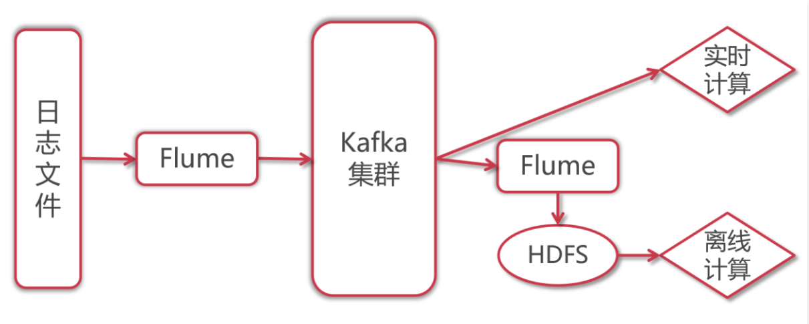

# 第5章 Flume集成Kafka实战


在实际工作中flume和kafka会深度结合使用。

1：flume采集数据，将数据实时写入kafka

2：flume从kafka中消费数据，保存到hdfs，做数据备份

下面我们就来看一个综合案例。

使用flume采集日志文件中产生的实时数据，写入到kafka中，然后再使用flume从kafka中将数据消费出来，保存到hdfs上面。

那为什么不直接使用flume将采集到的日志数据保存到hdfs上面呢？

因为中间使用kafka进行缓冲之后，后面既可以实现实时计算，又可以实现离线数据备份，最终实现离线计算，所以这一份数据就可以实现两种需求，使用起来很方便，所以在工作中一般都会这样做。




下面我们来实现一下这个功能。

其实在Flume中，针对Kafka提供的有KafkaSource和KafkaSink。

- KafkaSource是从Kafka中读取数据；

- KafkaSink是向Kafka中写入数据。

所以针对我们目前这个架构，主要就是配置Flume的Agent。

需要配置两个Agent：

第一个Agent负责实时采集日志文件，将采集到的数据写入Kafka中；

第二个Agent负责从Kafka中读取数据，将数据写入HDFS中进行备份。

针对第一个Agent：

source：ExecSource，使用tail -F监控日志文件即可；

channel：MemoryChannel

sink：KafkaSink

针对第二个Agent：

source：KafkaSource

channel：MemoryChannel

sink：HdfsSink

这里面这些组件其实只有KafkaSource和KafkaSink我们没有使用过，其他的组件都已经用过了。

## 5.1、配置日志到Kafka

文件名：`exec-memory-kafka.conf`

- 配置

```bash
$ mkdir /home/emon/bigdata/flume/shell/config/execMemoryKafka/data
$ vim /home/emon/bigdata/flume/shell/config/execMemoryKafka/exec-memory-kafka.conf
```

```properties
# agent的名称是a1
# 指定source组件、channel组件和sink组件的名称
a1.sources = r1
a1.sinks = k1
a1.channels = c1

# 配置sources组件
a1.sources.r1.type = exec
a1.sources.r1.command = tail -F /home/emon/bigdata/flume/shell/config/execMemoryKafka/data/test.log

# 配置sink组件
a1.sinks.k1.type = org.apache.flume.sink.kafka.KafkaSink
# 指定topic名称
a1.sinks.k1.kafka.topic = test_r2p5
# 指定kafka地址，多个节点地址使用逗号分隔
a1.sinks.k1.kafka.bootstrap.servers = emon:9092,emon2:9092,emon3:9092
# 一次向Kafka中写多少条数据，默认值为100，在这里为了演示方便，改为1
# 在实际工作中这个值具体设置多少需要在传输效率和数据延迟上进行取舍
# 如果Kafka后面的实时计算程序对数据的要求是低延迟，那么这个值小一点比较合适
# 如果Kafka后面的实时计算程序对数据延迟没什么要求，那么就考虑传输性能，一次多传输一些数据，这样吞吐量会有所提升
# 建议这个值的大小和ExecSource每秒钟采集的数据量大致相等，这样不会频繁向Kafka中写数据
a1.sinks.k1.kafka.flumeBatchSize = 1
a1.sinks.k1.kafka.producer.acks = 1
# 一个Batch被创建之后，最多过多久，不管这个Batch有没有写满，都必须发送出去
# linger.ms和flumeBatchSize，哪个先满足先按哪个规则执行，这个值默认是0，在这设置为1
a1.sinks.k1.kafka.producer.linger.ms = 1
# 指定数据传输时的压缩格式，对数据进行压缩，提高传输效率
a1.sinks.k1,kafka.producer.compression.type = snappy

# 配置channel组件
a1.channels.c1.type = memory
a1.channels.c1.capacity = 1000
a1.channels.c1.transactionCapacity = 100

# 把组件连接起来
a1.sources.r1.channels = c1
a1.sinks.k1.channel = c1
```

## 5.2、配置Kafka到Hdfs

- 配置

```bash
$ mkdir /home/emon/bigdata/flume/shell/config/kafkaMemoryHdfs
$ vim /home/emon/bigdata/flume/shell/config/kafkaMemoryHdfs/kafka-memory-hdfs.conf
```

```properties
# agent的名称是a1
# 指定source组件、channel组件和sink组件的名称
a1.sources = r1
a1.sinks = k1
a1.channels = c1

# 配置sources组件
a1.sources.r1.type = org.apache.flume.source.kafka.KafkaSource
# 一次性向channel中写入的最大数据量，在这为了演示方便，设置为1
# 这个参数的值不要大于MemoryChannel中transactionCapacity的值
a1.sources.r1.batchSize = 1
# 最大多长时间向channel写一次数据
a1.sources.r1.batchDurationMillis = 2000
# 指定kafka地址，多个节点地址使用逗号分隔
a1.sources.r1.kafka.bootstrap.servers = emon:9092,emon2:9092,emon3:9092
# topic名称，可以指定一个或者多个，多个topic之间使用逗号隔开
# 也可以使用正则表达式指定一个topic名称规则
a1.sources.r1.kafka.topics = test_r2p5
# 指定消费者组id
a1.sources.r1.kafka.consumer.group.id = flume-con1

# 配置sink组件
a1.sinks.k1.type = hdfs
a1.sinks.k1.hdfs.path = hdfs://emon:8020/flume/kafka
a1.sinks.k1.hdfs.filePrefix = data-
a1.sinks.k1.hdfs.fileSuffix	= .log
a1.sinks.k1.hdfs.fileType = DataStream
a1.sinks.k1.hdfs.writeFormat = Text
a1.sinks.k1.hdfs.rollInterval = 3600
# 128M
a1.sinks.k1.hdfs.rollSize = 134217728
a1.sinks.k1.hdfs.rollCount = 0

# 配置channel组件
a1.channels.c1.type = memory
a1.channels.c1.capacity = 1000
a1.channels.c1.transactionCapacity = 100

# 把组件连接起来
a1.sources.r1.channels = c1
a1.sinks.k1.channel = c1
```

## 5.3、创建Kafka的topic

```bash
$ kafka-topics.sh --create --zookeeper emon:2181 --partitions 2 --replication-factor 2 --topic test_r2p5
```

## 5.4、启动

- 启动第二个Agent

```bash
$ flume-ng agent --conf /usr/local/flume/conf --conf-file /home/emon/bigdata/flume/shell/config/kafkaMemoryHdfs/kafka-memory-hdfs.conf --name a1 -Dflume.root.logger=INFO,console
```

- 启动第一个Agent

```bash
$ flume-ng agent --conf /usr/local/flume/conf --conf-file /home/emon/bigdata/flume/shell/config/execMemoryKafka/exec-memory-kafka.conf --name a1 -Dflume.root.logger=INFO,console
```

- 模拟产生日志数据

```bash
$ echo "hello world" >> /home/emon/bigdata/flume/shell/config/execMemoryKafka/data/test.log
```

- 到HDFS上查看数据，验证结果：

```bash
$ hdfs dfs -ls -R /flume/kafka
-rw-r--r--   1 emon supergroup         12 2022-02-27 17:26 /flume/kafka/data-.1645953988614.log.tmp
```

此时Flume可以通过tail -F命令实时监控文件中的新增数据，发现有新数据就写入kafka，然后kafka后面的flume落盘程序，以及Kafka后面的实时计算程序就可以使用这份数据了。
