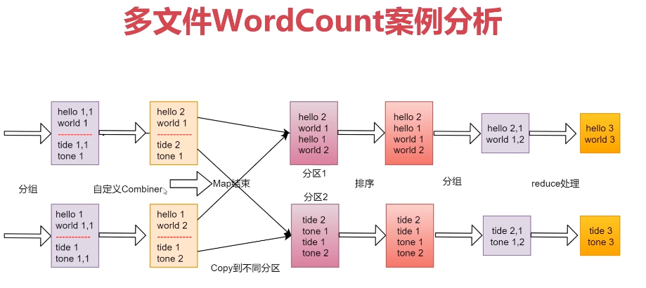
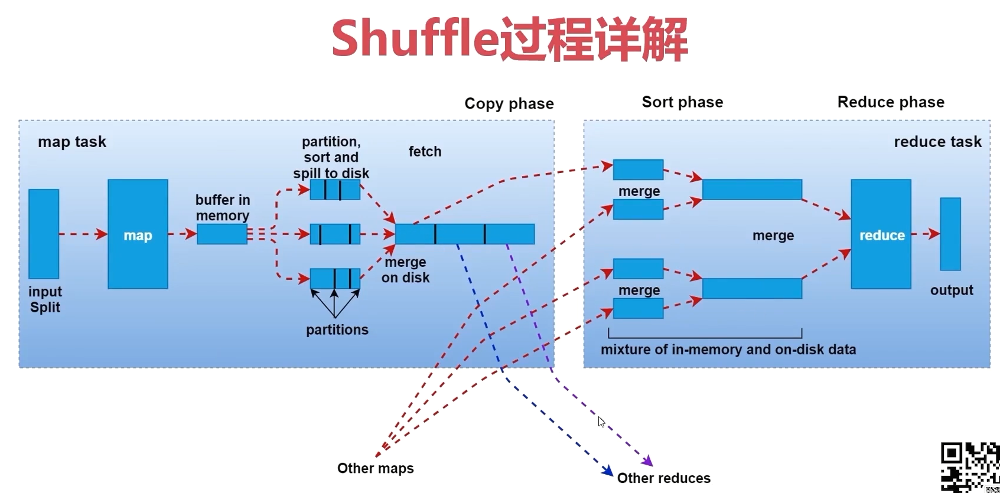

# 第2章 MapReduce详解


## 3.1、多文件WordCount案例分析




## 3.2、MapReduce任务日志查看

### 3.2.1、在yarn的web界面查看日志

默认情况下，在yarn的web界面(http://emon:8088) ==> 点击对应任务的history链接 ==> 打不开链接？

原因：1、window的hosts文件中没有配置emon的解析；2、必须要启动historyserver进程，并且还要开启日志聚合功能，才能在web界面上直接查看任务对应的日志信息，因为默认情况下任务的日志是散落在nodemanager节点上的，要想查看需要找到对应的nodemanager节点上去查看，这样就很不方便，通过日志聚合功能可以把之前本来散落在nodemanager节点上的日志统一收集到hdfs上的指定目录中，这样就可以在yarn的web界面中直接查看了。

如何开启日志聚合功能？

需要通过一个配置来开启，在`yarn-site.xml`中添加如下配置：

```xml
    <!-- 开启日志聚合 -->
    <property>
        <name>yarn.log-aggregation-enable</name>
        <value>true</value>
    </property>
	<!-- 日志聚合HDFS目录 -->
	<property>
		<name>yarn.nodemanager.remote-app-log-dir</name>
		<value>/tmp/logs/yarn-logs</value>
	</property>
	<!-- 日志保存时间30days,单位秒 -->
	<property>
		<name>yarn.log-aggregation.retain-seconds</name>
		<value>2592000</value>
    </property>
    <property>
        <name>yarn.log-server.url</name>
        <value>http://emon:19888/jobhistory/logs</value>
    </property>
```

停止集群 ==> 修改主节点 emon 上的`yarn-site.xml`配置 ==> 同步到其他两个节点 ==> 启动集群：

```bash
$ stop-all.sh 
$ vim /usr/local/hadoop/etc/hadoop/yarn-site.xml
```

```xml
<configuration>

<!-- Site specific YARN configuration properties -->
    <property>
        <name>yarn.nodemanager.aux-services</name>
        <value>mapreduce_shuffle</value>
    </property>
    <!-- 白名单 -->
    <property>
        <name>yarn.nodemanager.env-whitelist</name>
        <value>JAVA_HOME,HADOOP_COMMON_HOME,HADOOP_HDFS_HOME,HADOOP_CONF_DIR,CLASSPATH_PREPEND_DISTCACHE,HADOOP_YARN_HOME,HADOOP_MAPRED_HOME</value>
    </property>
    <!-- 开启日志聚合 -->
    <property>
        <name>yarn.log-aggregation-enable</name>
        <value>true</value>
    </property>
	<!-- 日志聚合HDFS目录 -->
	<property>
		<name>yarn.nodemanager.remote-app-log-dir</name>
		<value>/tmp/logs/yarn-logs</value>
	</property>
	<!-- 日志保存时间30days,单位秒 -->
	<property>
		<name>yarn.log-aggregation.retain-seconds</name>
		<value>2592000</value>
    </property>
    <property>
        <name>yarn.log.server.url</name>
        <value>http://emon:19888/jobhistory/logs</value>
    </property>
</configuration>
```

```bash
# 如果不需要修改默认值，不需要修改[非必须，但推荐]
$ vim /usr/local/hadoop/etc/hadoop/mapred-site.xml 
```

```xml
<configuration>
    <property>
        <name>mapreduce.framework.name</name>
        <value>yarn</value>
    </property>
    <!-- 历史日志服务 jobhistory 相关配置 -->
    <property>
        <name>mapreduce.jobhistory.address</name>
        <value>emon:10020</value>
        <description>历史服务器端口号</description>
    </property>
    <property>
        <name>mapreduce.jobhistory.webapp.address</name>
        <value>emon:19888</value>
        <description>历史服务器的WEB UI端口号</description>
    </property>
    <property>
    	<name>mapreduce.jobhistory.joblist.cache.size</name>
        <value>2000</value>
        <description>内存中缓存的historyfile文件信息（主要是job对应的文件目录）</description>
    </property>
</configuration>
```

```bash
$ scp -rq /usr/local/hadoop/etc/hadoop/yarn-site.xml emon@emon2:/usr/local/hadoop/etc/hadoop/
$ scp -rq /usr/local/hadoop/etc/hadoop/yarn-site.xml emon@emon3:/usr/local/hadoop/etc/hadoop/
$ scp -rq /usr/local/hadoop/etc/hadoop/mapred-site.xml emon@emon2:/usr/local/hadoop/etc/hadoop/
$ scp -rq /usr/local/hadoop/etc/hadoop/mapred-site.xml emon@emon3:/usr/local/hadoop/etc/hadoop/
```

启动集群 ==> 启动emon节点historyserver进程 ==> 启动其他节点historyserver进程。

```bash
$ start-all.sh 
$ mapred --daemon start historyserver
$ jps
39843 NameNode
40196 DataNode
40824 ResourceManager
41689 Jps
41146 NodeManager
40587 SecondaryNameNode
41627 JobHistoryServer <== historserver进程
```

OK，任务日志可查看了！

另外，停止historyserver命令：

```bash
$ mapred --daemon stop historyserver
```

启动成功后，可以访问地址查看历史日志：

http://emon:19888

### 3.2.2、命令行查看日志

从yarnweb上获取applicationId，然后执行命令：

```bash
$ /usr/local/hadoop/bin/yarn logs -applicationId application_1642928361436_0002
```

## 3.3、停止集群任务

```bash
$ /usr/local/hadoop/bin/yarn application -kill <applicationId>
```

```bash
# 示例
$ /usr/local/hadoop/bin/yarn application -kill application_1643078894666_0004
2022-01-25 15:51:26,620 INFO client.DefaultNoHARMFailoverProxyProvider: Connecting to ResourceManager at /0.0.0.0:8032
Killing application application_1643078894666_0004
2022-01-25 15:51:27,919 INFO impl.YarnClientImpl: Killed application application_1643078894666_0004
```


## 3.4、Shuffle过程详解



## 3.5、性能优化

### 3.5.1、剖析小文件问题与企业级解决方案

- Hadoop的HDFS和MapReduce框架是针对大数据文件来设计的，在小文件的处理上不但效率低下，而且十分消耗内存资源。

- HDFS提供了两种类型的容器，SequenceFile和MapFile。

  - > SequenceFile是Hadoop提供的一种二进制文件，这种二进制文件直接将`<key, value>对`序列化到文件中。
    >
    > 一般对小文件可以使用这种文件合并，即将文件名作为key，文件内容作为value序列化到大文件中。
    >
    > 注意：SequenceFile需要一个合并文件的过程，文件较大，且合并后的文件将不方便查看，必须通过遍历查看每一个小文件。

  - > MapFile是排序后的SequenceFile，MapFile由两部分组成，分别是index和data。
    >
    > index作为文件的数据索引，主要记录了每个Record的key值，以及该Record在文件中的偏移位置。
    >
    > 在MapFile被访问的时候，索引文件会被加载到内存，通过索引映射关系可迅速定位到指定Record所在文件位置。


### 3.5.2、数据倾斜问题

在实际工作中，如果我们想提高MapReduce的执行效率，最直接的方法是什么呢？

我们知道MapReduce是分为Map阶段和Reduce阶段，其实提高执行效率就是提高这两个阶段的执行效率。

默认情况下Map阶段中Map任务的个数是和数据的InputSplit相关的，InputSplit的个数一般是和Block块是有关联的，所以可以认为Map任务的个数和数据的block块个数有关系，针对Map任务的个数我们一般是不需要干预的，除非是碰到海量小文件，可以考虑把小文件合并成大文件。其他情况是不需要调整的。

那就剩下Reduce阶段了，默认情况下Reduce的个数是1个，所以现在MapReduce任务的压力就集中在Reduce阶段了，如果说数据量比较大的时候，一个Reduce任务处理起来肯定是比较慢的，我们可以考虑增加Reduce任务的个数，这样就可以实现数据分流，提高计算效率了。

但是注意了，如果增加Reduce的个数，那肯定私钥对数据进行分区的，分区之后，每个分区的数据会被一个Reduce任务处理。

那么如何增加分区呢？

通过观察`job.setPartitionerClass`可以了解到，默认使用的`HashPartitioner`分区：

```bash
public class HashPartitioner<K2, V2> implements Partitioner<K2, V2> {

  public void configure(JobConf job) {}

  /** Use {@link Object#hashCode()} to partition. */
  public int getPartition(K2 key, V2 value,
                          int numReduceTasks) {
    return (key.hashCode() & Integer.MAX_VALUE) % numReduceTasks;
  }

}
```

且默认分区基数`numReduceTasks`值为1，所以分区始终是1个，可以通过：

```java
// Job对象中获取numReduceTasks数量的代码，在JobConf中国
public int getNumReduceTasks() { return getInt(JobContext.NUM_REDUCES, 1); }

// Job对象提供了修改该数量的方法
job.setNumReduceTasks(n)
```

来调整`HashPartitioner`的取模基数，增加分区数量。


增加Reduce任务个数在一定场景下是可以提高效率的，但是在某一些特殊场景下单纯增加Reduce任务个数，是无法达到质的提升的。

下面我们来分析一个场景：

假设我们有一个文件，有1000万条数据，这里面的值主要都是数值，1,2,3,4,5...，我们希望统计出来每个数字出现的次数，其实在私下我们是知道这份数据的大致情况的，这里面的1000万条数据，值为5的数据有910万条左右，剩下的9个数字一共只有90万条，那也就意味着，这份数据中，值为5个数据比较集中，或者说值为5的数据属于**倾斜的数据**，在这一份数据中，它的占比比其他数据多得多。

**这样在分区后，数据5占用了某个分区，该分区处理了1000万数据中的90%以上，会导致整个MR任务变慢！**

针对这种情况怎么办？

把倾斜的数据打散！

**数据倾斜问题**的定义：

> MapReduce程序执行时，Reduce节点大部分执行完毕，但是有一个或者几个Reduce节点运行很慢，导致整个程序时间变得很长，具体表现为：Reduce阶段一直卡着不动。

处理方法：

- 增加Reduce任务个数
- 把倾斜的数据打散


# 四、YARN资源管理模型
