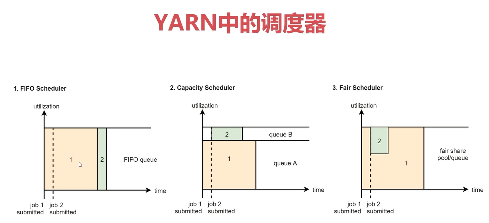
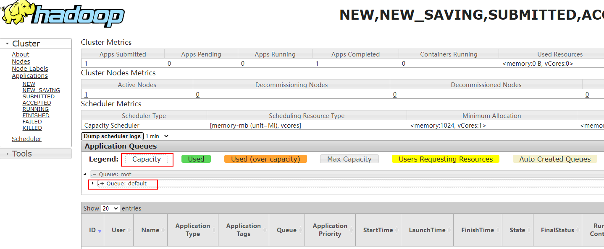

# 第3章 YARN资源管理


- Yarn主要负责集群资源的管理和调度，支持主从架构，主节点最多可以有两个，从节点可以有多个。
  - ResourceManager是主节点，主要负责集群资源的分配和管理
  - NodeMan是从节点，主要负责当前机器资源管理

- YARN主要管理内存和CPU这两种资源类型。

- NodeManager启动时会向ResourceManager注册，注册信息中包含该节点可分配的CPU和内存总量。

  - ```bash
    yarn.nodemanager.resource.memory-mb：单节点可分配的物理内存数量，默认是8MB*1024，即8G
    yarn.nodemanager.resource.cpu-vcores：单节点可分配的虚拟CPU个数，默认值是8
    ```

## 4.1、YARN中的调度器

Yarn中支持三种调度器：

- FIFO Scheduler：先进先出（First in，First out）调度策略
- Capacity Scheduler：FIFO Scheduler的多队列版本【默认】
- Fair Scheduler：多队列，多用户共享资源



在实际工作中我们一般都是使用第二种，CapacityScheduler，从hadoop2开始，CapacityScheduler也是集群中的默认调度器了。

点击 http://emon8088 进入yarn web界面，点击左侧的Scheduler可以看到集群当前调度器类型和队列数量。



下面的root是根的意思，他下面目前只有一个队列，叫default，我们之前提交的任务都会进入到这个队列中。

## 4.2、案例：YARN多资源队列配置和使用

我们的需求是这样的，希望增加2个队列，一个是online队列，一个是offline队列，然后向offline队列中提交一个mapreduce任务。

online队列里面运行实时任务，offline队列里面运行离线任务，我们现在学习的mapreduce就属于离线任务。

### 4.2.1、如何增加YARN调度器队列

停止集群 ==> 修改主节点 emon 上的YARN调度器配置 ==> 同步到其他两个节点 ==> 启动集群：

```bash
$ stop-all.sh 
$ vim /usr/local/hadoop/etc/hadoop/capacity-scheduler.xml 
```

```xml
<!-- 修改 -->
  <property>
    <name>yarn.scheduler.capacity.root.queues</name>
    <value>default,online,offline</value>
    <description>队列列表，多个队列之间使用逗号分隔</description>
    <!--<value>default</value>
    <description>
      The queues at the this level (root is the root queue).
    </description>-->
  </property>
<!-- 修改 -->
  <property>
    <name>yarn.scheduler.capacity.root.default.capacity</name>
    <value>60</value>
    <description>default队列60%</description>
    <!--<value>100</value>
    <description>Default queue target capacity.</description>-->
  </property>
<!-- 新增 -->
  <property>
	<name>yarn.scheduler.capacity.root.online.capacity</name>        
    <value>5</value>
    <description>online队列5%</description>
  </property>
<!-- 新增 -->
  <property>
	<name>yarn.scheduler.capacity.root.offline.capacity</name>        
    <value>35</value>
    <description>offline队列35%</description>
  </property>
<!-- 修改 -->
  <property>
    <name>yarn.scheduler.capacity.root.default.maximum-capacity</name>
    <value>60</value>
    <description>default队列可使用的资源上限.</description>
    <!--<value>100</value>
    <description>
      The maximum capacity of the default queue. 
    </description>-->
  </property>
<!-- 新增 -->
  <property>
	<name>yarn.scheduler.capacity.root.online.maximum-capacity</name>        
    <value>5</value>
    <description>online队列可使用的资源上限.</description>
  </property>
<!-- 新增 -->
  <property>
	<name>yarn.scheduler.capacity.root.offline.maximum-capacity</name>        
    <value>35</value>
    <description>offline队列可使用的资源上限.</description>
  </property>
```

```bash
$ scp -rq /usr/local/hadoop/etc/hadoop/capacity-scheduler.xml emon@emon2:/usr/local/hadoop/etc/hadoop/
$ scp -rq /usr/local/hadoop/etc/hadoop/capacity-scheduler.xml emon@emon3:/usr/local/hadoop/etc/hadoop/
```

**注意**：要保证每一个队列的可用内存不至于太小，而无法启动任务。

```bash
$ tailf /usr/local/hadoop/logs/hadoop-emon-resourcemanager-emon.log 
```

```bash
2022-01-26 18:58:35,908 WARN org.apache.hadoop.yarn.server.resourcemanager.scheduler.capacity.LeafQueue: maximum-am-resource-percent is insufficient to start a single application in queue, it is likely set too low. skipping enforcement to allow at least one application to start
```


