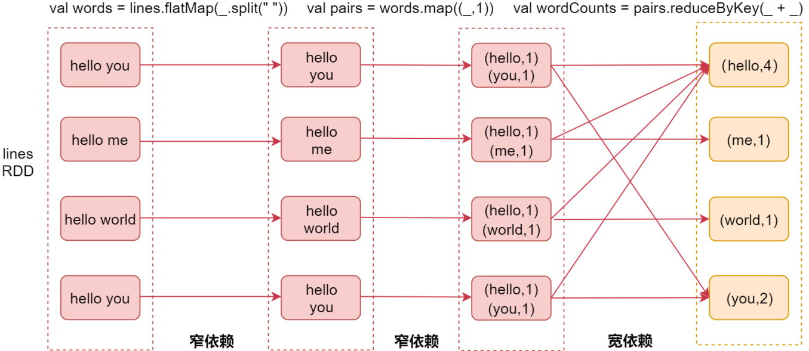
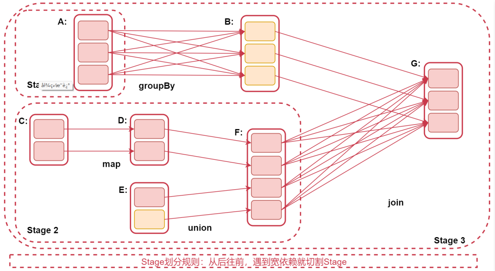
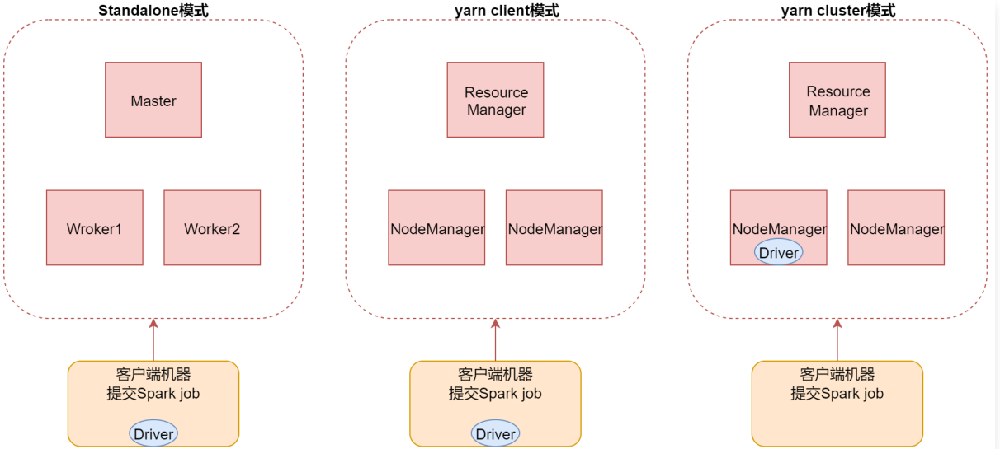
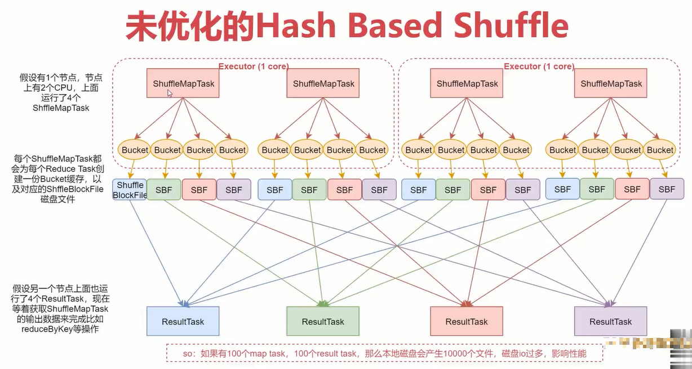
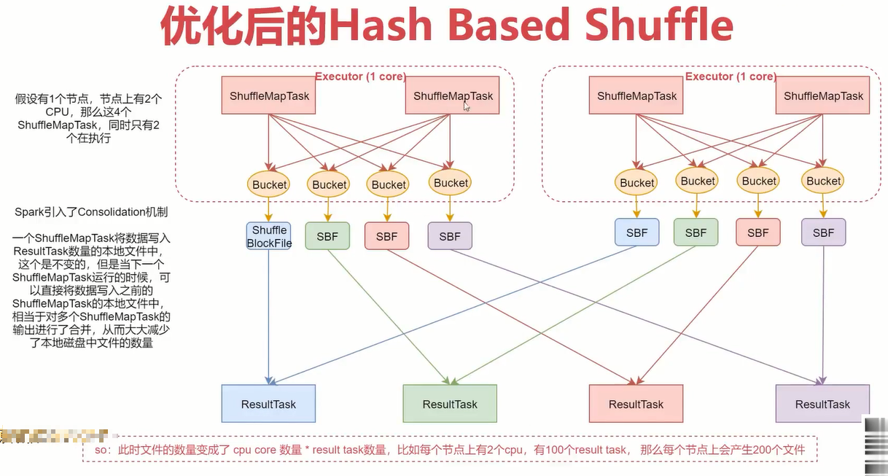
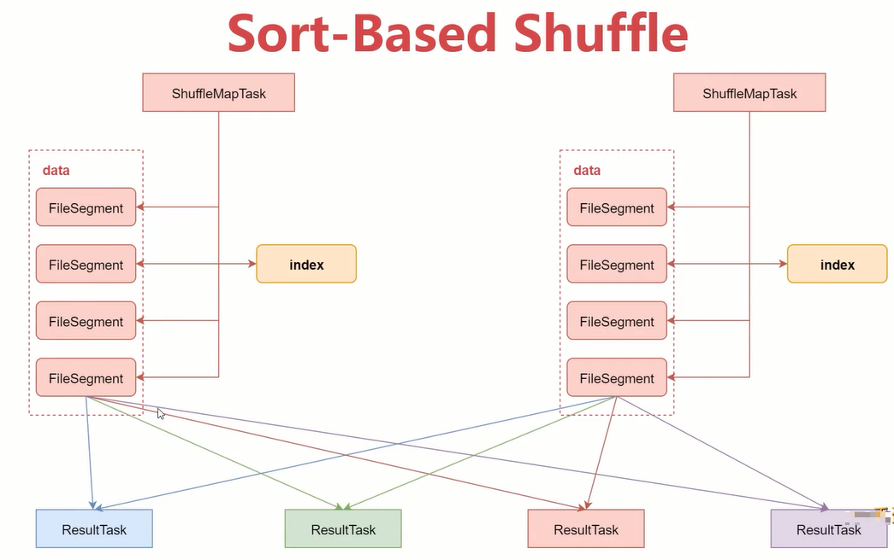
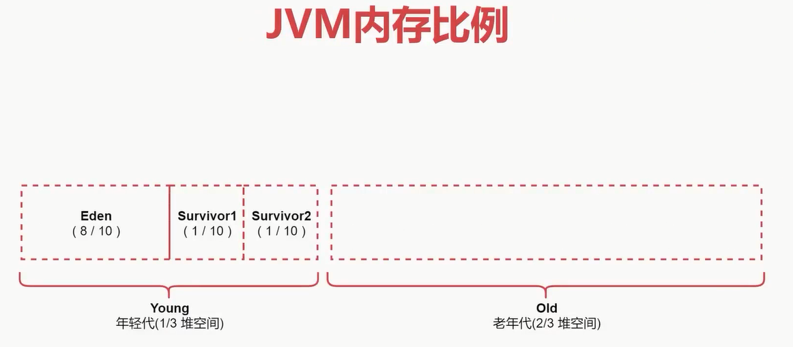
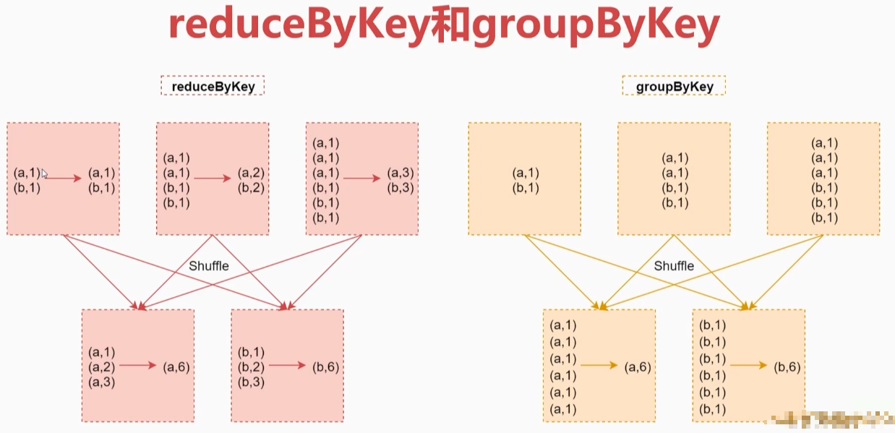

# 第2章 Spark性能优化


## 3.1、宽依赖和窄依赖

- 窄依赖（Narrow Dependency）：指父RDD的每个分区只被子RDD的一个分区所使用，例如map、filter等这些算子。一个RDD，对它的父RDD只有简单的一对一的关系，也就是说，RDD的每个partition仅仅依赖于父RDD中的一个partition，父RDD和子RDD的partition之间的对应关系，是一对一的。
- 宽依赖（Shuffle Dependency）：父RDD的每个分区都可能被子RDD的多个分区使用，例如groupByKey、reduceByKey、sortByKey等算子，这些算子其实都会产生shuffle操作。也就是说，每一个父RDD的partition中的数据都可能会传输一部分到下一个RDD的每个partition中。此时就会出现，父RDD和子RDD的partition之间，具有错综复杂的关系，那么，这种情况就叫做两个RDD之间是宽依赖，同时，他们之间会发生shuffe操作。




也就是说，产生了shuffle就是宽依赖，否则是窄依赖！

这就是宽窄依赖的区别，那么我们在这区分宽窄依赖有什么意义吗？

### 3.1.1、Stage

Spark Job是根据action算子触发的，遇到action算子就会起一个job。

> 注意：stage的划分依据就是看是否产生了shuffle（即宽依赖），遇到一个shuffle操作就划分为前后两个stage。
>
> stage是由一组并行的task组成，stage会将一批task用TaskSet来封装，提交给TaskScheduler进行分配，最后发送到Executor执行。





## 3.2、Spark Job的三种提交模式

- standalone模式：基于Spark自己的standalone集群。

```bash
spark-submit --master spark://emon:7077
```

- yarn的client模式

```bash
spark-submit --master yarn --deploy-mode client
```

> 这种方式主要用于测试，查看日志方便一些，部分日志会直接打印到控制台上面，因为driver进程运行在本地客户端，就是提交Spark任务的那个客户端机器，driver负责调度job，会与yarn集群产生大量的通信。一般情况下Spark客户端机器和Hadoop集群机器无法通过内网通信，只能通过外网，这样在大量通信的情况下会影响通信效率，并且当我们执行一些action操作的时候数据也会返回给driver端，driver端机器的配置一般都不高，可能会导致内存溢出等问题。

- yarn的cluster模式【推荐】

```bash
spark-submit --master yarn --deploy-mode cluster
```

> 这种方式driver进程运行的集群中的某一台机器上，这样集群内部节点之间通信是可以通过内网通信的，并且集群内的机器的配置也会比普通的客户机器配置高，所以就不存在yarn-client模式的一些问题了，只不过这个时候查看日志只能到集群上面看了，这倒也不算啥影响。




## 3.3、Shuffle机制分析

在MapReduce框架中，Shuffle是连接Map和Reduce之间的桥梁，Map阶段通过Shuffle读取数据并输出到对应的Reduce；而Reduce阶段负责从Map端拉取数据并进行计算。在整个Shuffle过程中，往往伴随着大量的磁盘和网络I/O。所以Shuffle性能的高低也直接决定了整个程序的性能高低。Spark也会有自己的Shuffle实现过程。

在Spark中，什么情况下，会发生Shuffle呢？

reduceByKey、groupByKey、sortByKey、countByKey、join等操作都会产生Shuffle。

Spark Shuffle的迭代历程：

1. Spark 0.8及以前，使用未优化的Hash Based Shuffle
2. Spark 0.8.1，优化后的Hash Based Shuffle
3. Spark1.6之后，使用Sort-Based Shuffle

### 3.3.1、未优化的Hash Based Shuffle




注意：那个bucket缓存是非常重要的，ShuffleMapTask会把所有的数据都写入Bucket缓存之后，才会刷写到对应的磁盘文件中，但是这就有一个问题，如果map端数据过多，那么很容易造成内存溢出，所以Spark在优化后的Hash Based Shuffle中对这个问题进行了优化，默认这个内存缓存是100kb，当Bucket中的数据达到了阈值之后，就会将数据一点点地刷写到对应的ShuffleBlockFile磁盘中了。

这种操作的优点，是不容易发生内存溢出。缺点在于，如果内存缓存过小的话，那么可能发生过多的磁盘IO操作。所以，这里的内存缓存大小，是可以根据实际的业务情况进行优化的。

### 3.3.2、优化后的Hash Based Shuffle




此时文件的数量变成了CPU core数量 * ResultTask数量，比如每个节点上有2个CPU，有100个ResultTask，那么每个节点上会产生200个文件，这时候文件数量就变得少多了。

但是如果ResultTask端的并行任务过多的话，则CPU core * ResultTask依旧过大，也会产生很多小文件。


### 3.3.3、Sort-Based Shuffle

引入Consolidation机制虽然在一定程度上减少了磁盘文件数量，但是不足以有效提高Shuffle的性能，这种情况只适合中小型数据规模的数据处理。

为了让Spark能在更大规模的集群上高性能处理大规模的数据，因此Spark引入了Sort-Based Shuffle。




该机制针对每一个ShufleMapTask都只创建一个文件，将所有的ShuffleMapTask的数据都写入同一个文件，并且对应生成一个索引文件。

以前的数据是放在内存中，等到数据写完了再刷写到磁盘，现在为了减少内存的使用，在内存不够用的时候，可以将内存中的数据溢写到磁盘，结束的时候，再讲这些溢写的文件联合内存中的数据一起进行归并，从而减少内存的使用量。一方面文件数量显著减少，另一方面减少缓存所占用的内存大小，而且同时避免GC的风险和频率。


## 3.4、Spark之checkpoint

### 3.4.1、checkpoint概述

- 针对Spark Job，如果我们担心某些关键的，在后面会反复使用的RDD，因为节点故障导致数据丢失，那么可以针对该RDD启动checkpoint机制，实现容错和高可用。
- 首先调用SparkContext的setCheckpointDir()方法，设置一个容错的文件系统目录（HDFS），然后对RDD调用checkpoint()方法。
- 最后，在RDD所在的job运行结束之后，会启动一个单独的job，将checkpoint设置过的RDD的数据写入之前设置的文件系统中。

### 3.4.2、RDD之checkpoint流程

- 第一步：SparkContext设置checkpoint目录，用于存放checkpoint的数据

对RDD调用checkpoint方法，然后它就会被RDDCheckpointData对象进行管理，此时这个RDD的checkpoint状态会被设置为`Initialized`。

- 第二步：待RDD所在的Job运行结束，会调用Job中最后一个RDD的doCheckpoint方法，该方法沿着RDD的血缘关系向上查找被checkpoint方法标记过的RDD，并将其checkpoint状态从`Initialized`设置为`CheckpointingInProgress`。
- 第三步：启动一个单独的Job，来将血缘关系中标记为`CheckpointInProgress`的RDD执行checkpoint操作，也就是将其数据写入checkpoint目录。
- 第四步：将RDD数据写入checkpoint目录之后，会将RDD状态改变为`Checkpointed`

并且还会改变RDD的血缘关系，即会清除掉RDD所有依赖的RDD，最后还会设置其父RDD为新创建的`CheckpointRDD`。

### 3.4.3、checkpoint与持久化的区别

- lineage是否发生变化

lineage（血缘关系）说的就是RDD之间的依赖关系。

持久化，只是将数据保存在内存中或者本地磁盘文件中，RDD的lineage（血缘关系）是不变的；Checkpoint执行之后，RDD就没有依赖的RDD了，也就是它的lineage改变了。

- 丢失数据的可能性

持久化的数据丢失的可能性较大，如果采用persist把数据存在内存中的话，虽然速度最快但是也是最不可靠的，就算放在磁盘上也不是完全可靠的，因为磁盘也会损坏。

checkpoint的数据通常是保存在高可用文件系统中（HDFS），丢失的可能性很低。

> 建议：对需要checkpoint的RDD，先执行persist（StorageLevel.DISK_ONLY)

为什么呢？

因为默认情况下，如果某个RDD没有持久化，但是设置了checkpoint，那么这个时候，本来Spark任务以及执行结束了，但是由于中间的RDD没有持久化，在进行checkpoint的时候想要将这个RDD的数据写入外部存储系统的话，就需要重新计算这个RDD的数据，再将其checkpoint到外部存储系统中。

如果对需要checkpoint的RDD进行了基于磁盘的持久化，那么后面进行checkpoint操作时，就会直接从磁盘上读取RDD的数据了，就不需要重新再计算一次了，这样效率就搞了。


## 3.5、JVM垃圾回收调优

- 如果内存设置不合理会导致大部分时间都消耗在垃圾回收上
- 默认情况下，Spark使用每个executor 60%的内存空间来缓存RDD，那么只有40%的内存空间来存放算子执行期间创建的对象
- 如果垃圾回收频繁发生，就需要对这个比例进行调优，通过参数`spark.storage.memoryFraction`来修改比例
- Java堆空间被划分成了两块空间：年轻代和老年代
- 年轻代存放短时间存活的对象，老年代存放长时间存活的对象
- 年轻代又被划分了三块空间：Ecen、Survivor1、Survivor2




## 3.6、Spark程序性能优化

### 3.6.1、性能优化方案

- 高性能序列化类库
- 持久化或者checkpoint
- JVM垃圾回收调优
- 提高并行度
- 数据本地化
- 算子优化

### 3.6.2、JVM垃圾回收调优

- 如果内存设置不合理会导致大部分时间都消耗在垃圾回收上
- 默认情况下，Spark使用每个executor 60%的内存空间来缓存RDD，那么只有40%的内存空间来存放算子执行期间创建的对象
- 如果垃圾回收频繁发生，就需要对这个比例进行调优，通过参数`spark.storage.memoryFraction`来修改比例
- Java堆空间被划分成了两块空间：年轻代和老年代
- 年轻代存放短时间存活的对象，老年代存放长时间存活的对象
- 年轻代又被划分了三块空间：Ecen、Survivor1、Survivor2


### 3.6.3、提高并行度

- spark-submit脚本常用配置参数

  - `--name mySparkJobName`：指定任务名称
  - `--class com.xxx`：指定入口类
  - `--master yarn`：指定集群地址，on yarn模式指定 yarn
  - `--deploy-mode cluster`：client代表yarn-client，cluster代表yarn-cluster
  - `--executor-memory 1G`：executor进程的内存大小，实际工作中可以设置2~4G即可
  - `--num-executors 2`：分配多少个executor进程
  - `--executor-cores 2`：一个executor进程分配多少个cpu
  - `--driver-cores 1`：driver进程分配多少core，默认为1
  - `--driver-memory 1G`：driver进程的内存，如果需要使用类似于collect之类的action算子向driver端拉取数据，则这里可以设置大一些
  - `--jars jarpath,jar2path`：在这里可以设置job依赖的第三方jar包，支持本地路径或hdfs路径
  - `--packages groupId:artifactId:version,groupId:artifactId:version`：设置job依赖的jar包，通过maven下载
  - `--files filePath,file2Path`：设置job依赖的外援资源文件

### 3.6.4、数据本地化

数据本地化对于Spark Job性能有着巨大的影响。如果数据以及要计算它的代码是在一起的，那么性能当然会非常高。但是，如果数据和计算它的代码是分开的，那么其中之一必须到另外一方的机器上。通常来说，移动代码到其他节点，会比移动数据到代码所在节点，速度要高得多，因为代码比较小。Spark也正是基于这个数据本地化的原则来构建task调度算法的。

数据本地化是指数据离计算它的代码有多近。基于数据距离代码的距离，有几种数据本地化级别：

- PROCESS_LOCAL：进程本地化，性能最好。数据和计算它的代码在同一个JVM进程中。
- NODE_LOCAL：节点本地化，数据和计算它的代码在一个节点上，但是不在一个JVM进程。
- NO_PREF：数据从哪里过来，性能都是一样的。
- RACK_LOCAL：数据和计算它的代码在一个机架上，数据需要通过网络在节点之间进行传输。
- ANY：数据可能在任意地方，比如其他网络环境内，或者其他机架上，性能最差。

Spark倾向使用最好的本地化级别调度task，但这是不现实的。

如果目前我们要处理的数据所在的executor上目前没有空闲的CPU，那么Spark就会降低本地化级别。这是有两个选择：

第一：等待，直到executor上的cpu释放出来，那么就分配task过去。

第二：立即在任意一个其他executor上启动一个task。

Spark默认会等待指定时间，期望task要处理的数据所在的节点上的executor空闲出一个cpu，从而将task分配过去，只要超过了时间，那么Spark就会将task分配到其他任意一个空闲的executor上。

可以设置参数：`spark.locality`系列参数，来调节Spark等待task可以进行数据本地化的时间。

> spark.locality.wait：默认等待3秒，针对所有级别。
>
> spark.locality.wait.proces：:等待指定的时间看能否达到数据和计算它的代码在同一个JVM。
>
> spark.locality.wait.node：等待指定的实际看能否达到数据和计算它的代码在一个节点上执行。
>
> spark.locality.wait.rack：等待指定的时间看能否达到数据和计算它的代码在一个机架上。

### 3.6.5、算子优化

- map vs mapPartitions
  - map操作：对RDD中的每个元素进行操作，一次处理一条数据。
  - mapPartitions操作：对RDD中的每个partition进行操作，一次处理一个分区的数据。

所以，map操作：执行1次map算子只处理1个元素，如果partition中的元素较多，假设当前已经处理了1000个元素，在内存不足的情况下，Spark可以通过GC等方法回收内存（比如将已经处理掉的1000个元素从内存中回收）。因此，map操作通常不会导致OOM异常。

mapPartitions操作：执行1次map算子需要接收该partition中的所有元素，因此一旦元素很多而内存不足，就容易导致OOM的异常，也不是说一定就会产生OOM异常，只是和map算子对比的话，相对来说容易产生OOM异常。

不过一般情况下，mapPartitions的性能更高；初始化操作、数据库链接等操作适合使用mapPartitions操作。

这是因为：假设需要将RDD中的每个元素写入数据库中，这时候就应该把创建数据库链接的操作放置在mapPartitions中，创建数据库链接这个操作本身就是一个比较耗时的操作，如果该操作放在map中执行，将会频繁执行，比较耗时且影响数据库的稳定性。

- foreach vs foreachPartitions
  - foreach：一次处理一条数据
  - foreachPartitions：一次处理一个分区的数据

foreachPartitions和mapPartitions的特性是一样的，唯一的区别就是mapPartitions是transformation操作（不会立即执行），foreachPartitions是action操作（会立即执行）。

- repartition的使用

对RDD进行重新分区，repartition主要有两个应用场景：

1. 可以调整RDD的并行度

针对个别RDD，如果感觉分区数量不合适，想要调整，可以通过repartition进行调整，分区调整了之后，对应的并行度也就可以调整了。

2. 可以解决RDD中数据倾斜的问题

如果RDD中不同分区之间的数据出现了数据倾斜，可以通过repartition实现数据重新分发，可以分发到不同分区中。

- reduceByKey和groupByKey的区别

在实现分组聚合功能时这两个算子有什么区别？

看这两行代码：

```scala
val counts = wordCountRDD.reduceByKey(_ + _)
val count = wordCountRDD.groupByKey().map(wc => (wc._1, wc._2.sum))
```

这两行代码的最终效果是一样的，都是对wordCountRDD中每个单词出现的次数进行聚合统计，那这两种方式在原理层面有什么区别吗？

首先这两个算子在执行的时候都会产生shuffle。

但是：

1. 当采用reduceByKey时，数据在进行shuffle之前会先进行局部聚合。
2. 当使用groupByKey时，数据在shuffle之前不会进行局部聚合，会原样进行shuffle。

这样的话reduceByKey就减少了shuffle的数据传送，所以效率会高一些。

如果能用reduceByKey，那就用reduceByKey，因为它会在map端，先进行本地combine，可以大大减少要传输到reduce端的数据量，减小网络传输的开销。




# 四、Spark SQL
