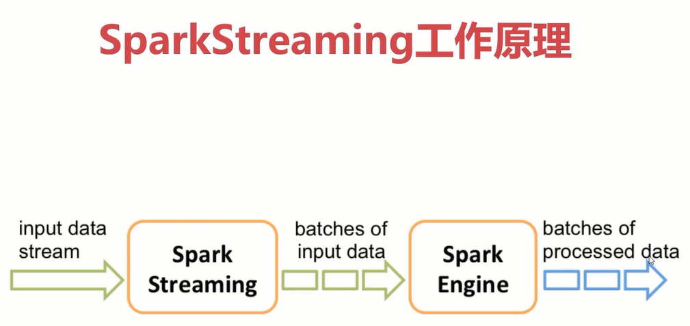

# 第3章 Spark SQL与Streaming

## 4.1、DataFrame

- Spark SQL是Spark的一个模块，主要用于进行结构化数据的处理，它提供的最核心的编程抽象，就是`DataFrame`。
- `DataFrame=RDD+Schema`，它其实和关系型数据库中的表非常类似，DataFrame可以通过很多来源进行构建。它其实和关系型数据库中的表非常类似，RDD可以认为是表中的数据，Schema是表结构信息。DataFrame可以通过很多来源进行构建，包括：结构化的数据文件，Hive中的表，外部的关系型数据库以及RDD。

Spark1.3出现的`DataFrame`，Spark1.6出现了`DataSet`，在Spark2.0中两者统一，`DataFrame`等于`DataSet[Row]`。

- 由于DataFrame等于DataSet[Row],所以可以互相转换。

## 4.2、SparkSession

要使用Spark SQL，首先需要创建一个SparkSession对象。

SparkSession中包含了SparkContext和SqlContext。所以说，想通过SparkSession来操作RDD的话需要先通过它来获取SparkContext。这个SqlContext是使用SparkSQL操作hive的时候会用到的。

# 五、Spark Streaming

Spark Streaming是Spark Core API的一种扩展，它可以用于进行大规模、高吞吐量、容错的实时数据流的处理。

