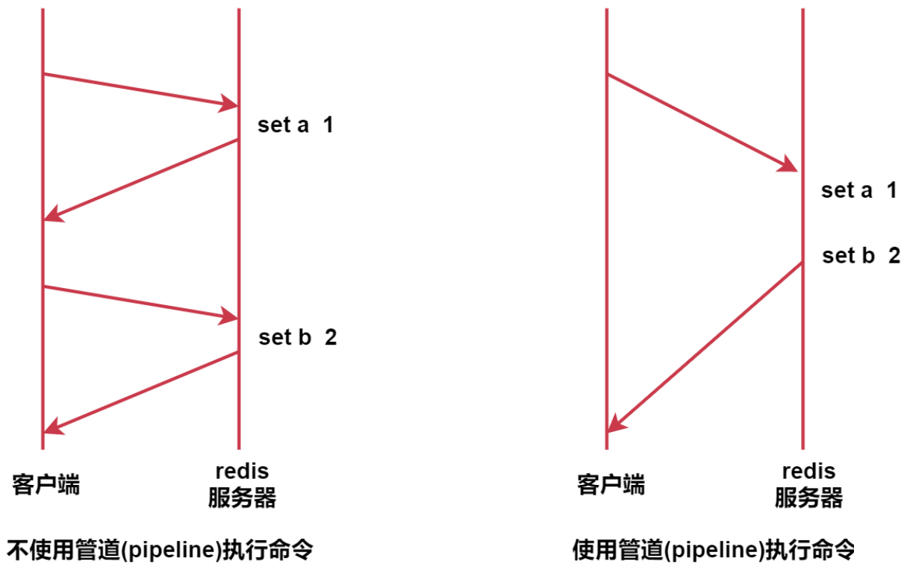

# 第8章 过期策略与管道

## 8.1、expire生存时间

Redis中可以使用expire命令设置一个键的生存时间，到时间后Redis会自动删除它。

> 它的一个典型应用场景时：手机验证码。

我们平时在登录或者注册的时候，手机会收到一个验证码，上面会提示验证码的过期时间，过了这个时间之后这个验证码就不能用了。

expire支持以下操作：

| 命令     | 格式                   | 解释                          |
| -------- | ---------------------- | ----------------------------- |
| expire   | expire key seconds     | 设置key的过期时间（单位：秒） |
| ttl      | ttl key                | 获取key的剩余有效时间         |
| persist  | persist key            | 取消key的过期时间             |
| expireat | expireat key timestamp | 设置UNIX时间戳的过期时间      |

## 8.2、pipeline管道

针对批量操作数据或者批量初始化数据的时候使用，效率高。

Redis的pipeline功能在命令行中没有实现，在Java客户端（jedis）中是可以使用的。

它的原理是这样的：

不使用管道的时候，我们每次执行一条命令都需要和redis服务器交互一次。

使用管道之后，可以实现一次提交一批命令，这一批命令只需要和redis服务器交互一次，所以就提高了性能。

这个功能就类似于MySQL中的batch批处理。
