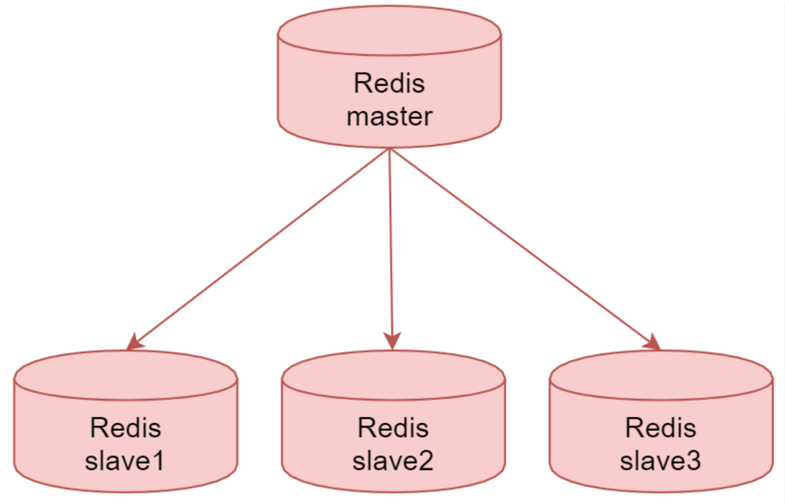
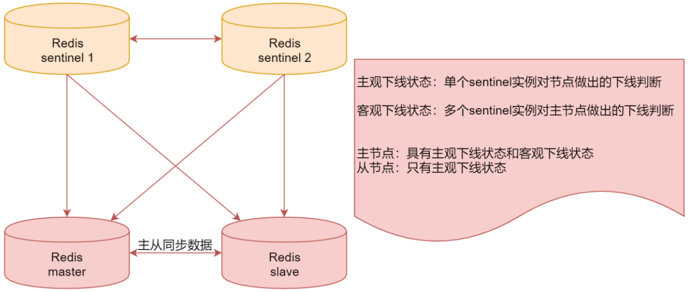
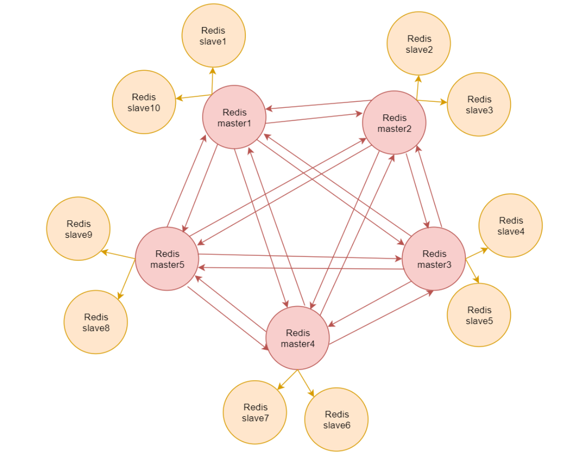

# 第12章 Redis架构演进

## 12.1、单机

现在我们使用的Redis是单机的，单机的Redis存在单点故障的问题，所以Redis提供了主从复制的方案。

## 12.2、主从复制

Redis的复制功能支持多个数据库之间的数据同步；

通过Redis的复制功能可以很好的实现数据库的读写分离，提高服务器的负载能力；

主数据库（Master）主要进行写操作，而从数据库（Slave）负责读操作；

一个主数据库可以有多个从数据库，而一个从数据库只能有一个主数据库。

如下图：

这个就是Redis的主从复制架构：

master节点，是主数据库，负责写操作，下面的3个slave节点是从数据库，负责读操作。

当我们把数据写入到master节点只会，master节点会把数据同步给下面的3个从节点。

这就是Redis的主从复制架构。

这种架构其实存在一个问题，如果主节点挂了，从节点是无法自动切换为主节点的。所以这个时候只能读数据，不能写数据。这样肯定还是存在单点故障的。

所以redis在这个架构的基础上又提供了sentinel哨兵机制。

## 12.3、Sentinel哨兵

这个sentinel哨兵机制提供了三个功能：

1. 监控：sentinel实时监控主服务器和从服务器运行状态
2. 提醒：当贝监控的某个Redis服务器出现问题时，sentinel可以向系统管理员发送通知，也可以通过API向其他程序发送通知
3. 自动故障转移：当一个主服务器不能正常工作时，sentinel可以将一个从服务器升级为主服务器，并对其他从服务器进行配置，让它们使用新的主服务器。

看下面这个图：

上面这两个sentinel1和sentinel2就是使用Redis启动的哨兵服务。

它们两个可以监控下面的这个主从架构的redis，当发现master宕机之后，会把slave切换为，master。

这里面涉及两个概念，大家需要注意下：

一个是主观下线状态，一个是客观下线状态。

主观下线状态表示是单个sentinel实例对节点做出的下线判断；

客观下线状态表示是多个sentinel实例对主节点做出的下线判断。

注意：针对主节点，它具有主观下线状态和客观下线状态，在这个架构里面，如果sentinel1认为master节点挂了，那么会给它标记为主观下线状态，此时，并不会进行故障转移，有可能是sentinel1误判了，当sentinel2也认为master节点挂了，那么此时会给master标记为客观下线状态，因为这个时候不是一个人认为它挂了，当被标记为客观下线状态之后，此时就会进行故障转移了，slave节点就会变成master节点了。

针对从节点而言，只有主观下线状态，就算是误判也没有什么影响。

这就是Redis中的sentinel哨兵机制。

sentinel哨兵机制虽然解决了主从节点故障自动转移的问题，但是还存在一个问题，针对这种架构，不管你使用多少台机器，redis的最终存储能力还是和单台机器有关的。

如果我们想存储海量数据的话，这种架构理论上是实现不了的。

基于此，Redis提供了集群这种架构。

## 12.4、集群

Redis集群是一个无中心的分布式Redis存储架构，可以在多个节点之间数据共享，解决了Redis高可用、可扩展等问题。

一个Redis集群包含16384个哈希槽（hash slot），数据库中的每个数据都属于这16384个哈希槽中的一个。

集群使用公式CRC16(key)%16384来计算键key属于哪个槽，集群中的每一个节点负责维护一部分哈希槽。

集群中的每个节点都有1个至N个复制品，其中一个是主节点其余的是从节点，如果主节点下线了，集群就会把这个主节点的一个从节点设置为新的主节点，继续工作。

> 注意：如果某一个主节点和它所有的从节点都下线的话，集群就会停止工作了。

看这个图：

里面红色的表示是5个master节点，此时redis集群的存储能力就是5个master节点内存的总和。

针对每一个master节点，外面都有两个从节点，master节点宕机之后，对应的slave节点会自动切换为master节点，保证集群的稳定性和可用性。

如果master1和slave1、slave10这三个节点都宕机了，那么此时集群就无法使用了。

针对Redis集群而言，它是一个无中心节点的分布式存储架构。

我们在操作集群的时候，可以连接到集群的任意一个节点去操作，都是可以的，在使用的时候不用管数据到底存储在哪个节点上面，这个是Redis底层去处理的，我们只需要连接到任意一台机器去操作即可。

集群架构里面已经包含了主从架构和sentinel的功能，不需要单独配置了。
