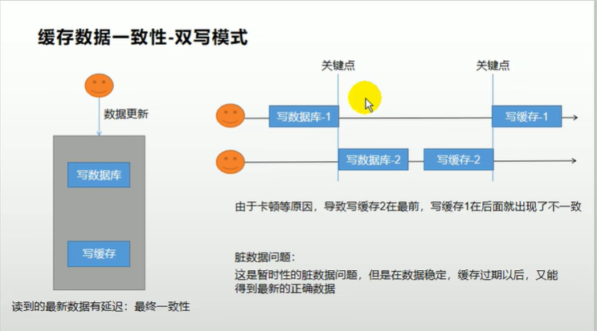
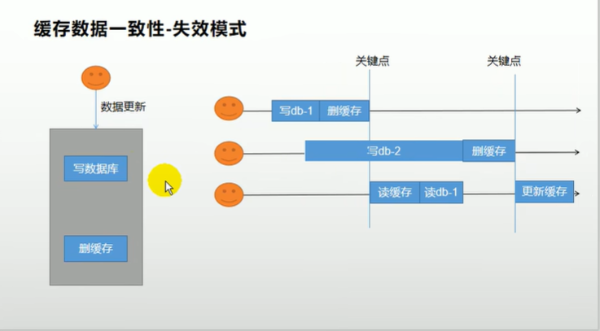
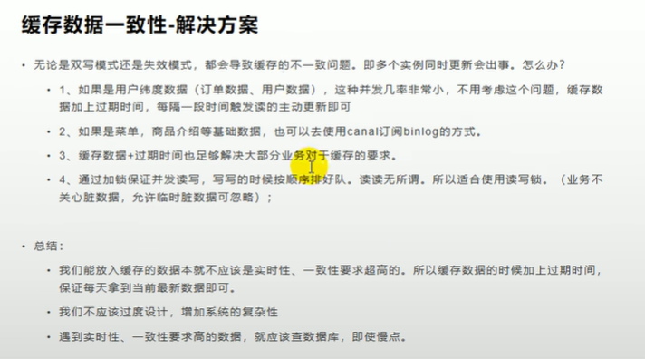

# 第13章 缓存问题

## 13.1、高并发下缓存失效问题

### 13.1.1、缓存穿透

- 概念

指查询一个一定不存在的数据，由于缓存未命中，将去查询数据库，但是数据库也查无此记录，我们并没有将这次查询的null写入缓存，这将导致这个不存在的数据每次请求都要存储层去查询数据库，失去了缓存的意义。

- 风险：

利用不存在的数据进行攻击，数据库瞬时压力增大，最终导致崩溃。

- 解决：

null结果缓存，并加入短暂过期时间。

### 13.1.2、缓存雪崩

- 概念

缓存雪崩是指在我们设置缓存时key采用了相同的过期时间，导致缓存在某一时刻同时失效，请求全部转发到DB，DB瞬时压力过重雪崩。

- 解决

原有的失效时间基础上增加一个随机值，比如1-5分钟随机，这样每个缓存的过期时间的重复率就会降低，就很难引发集体失效的事件。

### 13.1.3、缓存击穿

- 概念

  - 对于一些设置了过期时间的key，如果这些key可能会在某些时间点被超高并发地访问，是一种非常"热点"的数据。

  特指某一个key是热点，但失效了，同时碰到了大批量访问。

  - 如果这个key在大量请求同时进来之前正好失效，那么所有对这个key的数据查询都落到db，我们称之为缓存击穿。

- 解决

加锁。大量并发只让一个去查，其他人等待，查到以后释放锁，其他人获取到锁，先查缓存，就会有数据，不用去db。

## 13.2、缓存一致性问题

### 13.2.1、双写模式

### 13.2.2、失效模式

### 13.2.3、解决方案

## 13.3、Spring Cache

### 13.3.1、简介

- Spring从3.1开始定义了org.springframework.cache.Cache和org.spring.framework.cache.CacheManager接口来统一不同的缓存技术；并支持使用JCache（JSR-107）注解简化我们的开发。
- Cache接口为缓存的组件规范定义，包含缓存的各种操作集合；Cache接口下Spring提供了各种xxxCache的实现；如RedisCache、EnCacheCache、ConcurrentMapCache等。

### 13.3.2、Spring Cache的不足之处

常规数据（读多写少，对及时性和一致性要求不高的数据），可以使用Spring-Cache！！！

特殊数据：需要特殊的设计！！！

- 读模式

  - 缓存穿透-支持

  - 缓存雪崩-加过期时间

  - 缓存击穿-加锁（sync=true，本地锁，一定层度放置击穿）

- 写模式（缓存与数据库一致性）

  - 读写加锁-（SpringCache仅加了本地锁，通过sync=true）
  - 引入Canal，感知到MySQL的binlog
  - 读多写多，直接去数据库查询就行
