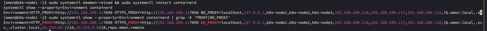

# 第1章 Containerd的安装与配置

[查看官方安装教程](https://github.com/containerd/containerd/blob/main/docs/getting-started.md)


## 1 配置Containerd代理服务器

### 1.0 如何验证代理与地址是否匹配

```bash
# 验证目标请求，在当前代理配置下能否被访问到
$ sudo -E HTTP_PROXY=http://192.168.200.1:7890 HTTPS_PROXY=http://192.168.200.1:7890 NO_PROXY="localhost,127.0.0.1,.svc,.cluster.local,10.233.64.0/18,10.233.0.0/18" curl -k -s --connect-timeout 3 https://10.233.0.1:443 >/dev/null && echo "✅ OK" || echo "❌ FAIL"

# 验证目标请求，是否会跳过代理
$ sudo -E HTTP_PROXY=http://192.168.200.1:7890 HTTPS_PROXY=http://192.168.200.1:7890 NO_PROXY="localhost,127.0.0.1,.svc,.cluster.local,.aliyuncs.com" curl -k -s --connect-timeout 3 https://registry.cn-beijing.aliyuncs.com/v2/ -v

$ sudo -E HTTP_PROXY=http://192.168.200.1:7890 HTTPS_PROXY=http://192.168.200.1:7890 NO_PROXY="localhost,127.0.0.1,.svc,.cluster.local,.myhuaweicloud.com" curl -k -s --connect-timeout 3 https://swr.cn-north-9.myhuaweicloud.com/v2/ -v

# 验证目标请求，是否能通过代理访问到
$ curl -x http://192.168.200.1:7890 https://swr.cn-north-9.myhuaweicloud.com/v2/ -v
```

### 1.1 通过环境变量配置代理（推荐）

适用于通过 `systemd` 管理的 containerd 服务：

若加速器不好使，请使用代理服务器，前提是能科学上网，这里推荐一个：Aurora 和 [ClashX](https://bigbearvpn.sodtool.com/login)

- 配置代理

```bash
$ sudo mkdir -p /etc/systemd/system/containerd.service.d
```

```bash
$ sudo tee /etc/systemd/system/containerd.service.d/proxy.conf <<-'EOF'
[Service]
Environment="HTTP_PROXY=http://192.168.200.1:7890"
Environment="HTTPS_PROXY=http://192.168.200.1:7890"
Environment="NO_PROXY=localhost,127.0.0.1,k8s-node1,k8s-node2,k8s-node3,192.168.200.116,192.168.200.117,192.168.200.118,lb.emon.local,.svc,.cluster.local,10.233.64.0/18,10.233.0.0/18,repo.emon.remote,.aliyuncs.com,.myhuaweicloud.com"
EOF
```

::: details 详解

> NO_PROXY应该包含的地址：
>
> | 类型               | 应包含的内容                                            |
> | ------------------ | ------------------------------------------------------- |
> | 本地回环           | `127.0.0.1`, `localhost`                                |
> | 本机主机名         | `k8s-node1`, `k8s-node2`, `k8s-node3`                   |
> | 本机 IP            | `192.168.200.116`, `192.168.200.117`, `192.168.200.118` |
> | Control Plane 域名 | `lb.emon.local`                                         |
> | K8s 内部域名后缀   | `.svc`, `.cluster.local`                                |
> | Pod & Service CIDR | `10.233.0.0/18` 和 `10.233.64.0/18`                     |
> | 私有harbor         | repo.emon.remote                                        |
>
>
> - 查询K8S内部域名后缀
>
> ```bash
> # 方法一【推荐，无需代理】
> $ kubectl -n kube-system get configmap coredns -o jsonpath='{.data.Corefile}'
> # 方法二
> $ kubectl run -it --rm debug --image=busybox --restart=Never -- cat /etc/resolv.conf
> search default.svc.cluster.local svc.cluster.local cluster.local
> nameserver 169.254.25.10
> options ndots:5
> pod "debug" deleted
> ```
>
> - 查询Pod & Service CIDR
>
> ```bash
> $ kubectl -n kube-system describe pod $(kubectl -n kube-system get pods -l component=kube-controller-manager -o jsonpath='{.items[0].metadata.name}') | grep -E 'cluster-cidr|service-cluster-ip-range' 
> ```
>
> ```bash
> # 输出结果      
>       --cluster-cidr=10.233.64.0/18
>       --service-cluster-ip-range=10.233.0.0/18
> ```
> 
>
> - <span style="color:red;font-weight:bold;">这种代理配置对crictl命令生效，对ctr和nerdctl不生效</span>
>   - `crictl` → 连接 containerd 的 **CRI 插件**（实现 Kubernetes CRI 接口）
>
>   - `ctr` → 直接连接 containerd 的**核心服务**
>
>   **关键区别**：
>
>   | 工具     | 网络操作执行者      | 依赖的环境变量来源    |
>   | :------- | :------------------ | :-------------------- |
>   | `ctr`    | `ctr` 客户端自身    | 当前 Shell 的环境变量 |
>   | `crictl` | containerd 守护进程 | systemd 服务环境变量  |
>
>   - 可以在shell中设置代理，也可以在命令中添加代理
>
>   ```bash
>   $ HTTPS_PROXY=http://192.168.200.1:7890 sudo ctr image pull docker.io/library/openjdk:8-jre
>   $ HTTPS_PROXY=http://192.168.200.1:7890 sudo nerdctl pull openjdk:8-jre
>   ```
>

:::

- 重载并重启服务并查看代理配置情况

```bash
$ sudo systemctl daemon-reload && sudo systemctl restart containerd
$ sudo systemctl show --property=Environment containerd | grep -E 'PROXY|NO_PROXY'
```

>  `systemctl show --property=Environment containerd` # 输出过长时容易显示不全
>
> 

```bash
Environment=HTTP_PROXY=http://192.168.200.1:7890 HTTPS_PROXY=http://192.168.200.1:7890 NO_PROXY=localhost,127.0.0.1,k8s-node1,k8s-node2,k8s-node3,192.168.200.116,192.168.200.117,192.168.200.118,lb.emon.local,.svc,.cluster.local,10.233.64.0/18,10.233.0.0/18,repo.emon.remote,.cluster.local,.myhuaweicloud.com
```

- 拉取镜像测试

```bash
$ sudo crictl pull busybox
$ kubectl run -it --rm debug --image=busybox --restart=Never -- busybox --list | wc -l
```

### 1.2 通过 `config.toml` 配置镜像仓库代理

[K8s containerd 下载加速 - 轩辕镜像配置手册](https://github.com/SeanChang/xuanyuan_docker_proxy/blob/main/containerd-guide.md)

适用于为特定仓库配置代理或镜像加速：

1. **编辑 containerd 主配置**

```bash
sudo vim /etc/containerd/config.toml
```

2. **添加镜像仓库代理配置**（示例为 Docker Hub）

```toml
[plugins."io.containerd.grpc.v1.cri".registry]
  [plugins."io.containerd.grpc.v1.cri".registry.mirrors]
    [plugins."io.containerd.grpc.v1.cri".registry.mirrors."docker.io"]
      endpoint = ["https://registry-1.docker.io"]

  [plugins."io.containerd.grpc.v1.cri".registry.configs]
    [plugins."io.containerd.grpc.v1.cri".registry.configs."docker.io".proxy]
      http_proxy = "http://proxy.example.com:8080"
      https_proxy = "http://proxy.example.com:8080"
```

3. **重启 containerd**

```bash
$ sudo systemctl restart containerd
```

### 1.3 验证代理是否生效

1. **拉取镜像测试**

   bash

   ```
   $ sudo crictl pull nginx
   ```

2. **查看 containerd 日志**

   bash

   ```
   $ sudo journalctl -u containerd -f
   ```

   成功日志示例：

   text

   ```
   INFO[2025-07-13T10:00:00] Fetching image via proxy: http://proxy.example.com:8080 
   ```


