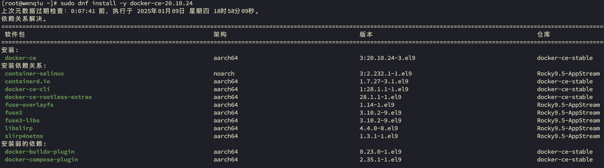

# 第1章 Docker的安装与配置

[查看官方CentOS安装Docker教程](https://docs.docker.com/engine/install/centos/)

## 1 先决条件

安装Docker的基本要求如下：

- Docker只支持64位的CPU架构的计算机，目前不支持32位CPU
- 建议系统的Linux内核版本为3.10及以上
- Linux内核需要开启cgroups和namespace功能
- 对于非Linux内核的平台，如Microsoft Windows和OS X，需要安装使用Boot2Docker工具

::: tip

Docker目前只能运行在64位平台上，并且要求内核版本不低于3.10，实际上内核版本越新越好，过低的内核版本容易造成功能不稳定。
用户可以通过如下命令检查自己的内核版本详细信息：

```bash
$ uname -a
Linux emon 3.10.0-862.el7.x86_64 #1 SMP Fri Apr 20 16:44:24 UTC 2018 x86_64 x86_64 x86_64 GNU/Linux
$ cat /proc/version
Linux version 3.10.0-862.el7.x86_64 (builder@kbuilder.dev.centos.org) (gcc version 4.8.5 20150623 (Red Hat 4.8.5-28) (GCC) ) #1 SMP Fri Apr 20 16:44:24 UTC 2018
```

:::

::: info

- CentOS 9 (stream)

必须启用 `centos-extras` 仓库。此仓库默认已启用。如果您已禁用它，则需要重新启用。

:::

## 2 卸载旧版Docker

::: code-group

```bash [CentOS7]
$ sudo yum remove docker \
                  docker-client \
                  docker-client-latest \
                  docker-common \
                  docker-latest \
                  docker-latest-logrotate \
                  docker-logrotate \
                  docker-engine
```

```bash [Rocky9]
$ sudo dnf remove docker \
                  docker-client \
                  docker-client-latest \
                  docker-common \
                  docker-latest \
                  docker-latest-logrotate \
                  docker-logrotate \
                  docker-engine
```

:::

如果yum报告说以上安装包未安装，未匹配，未删除任何安装包，活码环境干净，没有历史遗留旧版安装。

::: info
在 `/var/lib/docker/` 中存储的镜像、容器、卷和网络在您卸载 Docker 时不会自动删除。
:::

## 3 安装

### 3.1 安装Docker

1. 设置 Docker 仓库

在新主机机器上首次安装 Docker Engine 之前，您需要设置 Docker 仓库。之后，您可以从仓库安装和更新 Docker。

::: code-group

```bash [CentOS7]
# 安装需要的软件包，yum-util提供yum-config-manager功能，另外两个是devicemapper驱动依赖的
$ sudo yum install -y yum-utils device-mapper-persistent-data lvm2
# 设置yum源
$ sudo yum-config-manager --add-repo https://download.docker.com/linux/centos/docker-ce.repo
$ yum clean all && yum makecache
```

```bash [Rocky9]
# 安装 dnf-plugins-core 软件包（提供管理 DNF 仓库的命令）并设置仓库。
$ sudo dnf -y install dnf-plugins-core
# $ sudo dnf config-manager --add-repo https://download.docker.com/linux/centos/docker-ce.repo
$ sudo dnf config-manager --add-repo http://mirrors.aliyun.com/docker-ce/linux/centos/docker-ce.repo
$ dnf clean all && dnf makecache
```

:::

2. 安装 Docker 软件包。

::: code-group

```bash [CentOS7安装最新版]
$ sudo yum install -y docker-ce
```

```bash [CentOS7安装特定版]
# 可以查看所有仓库中所有docker版本，并选择安装特定的版本
$ yum list docker-ce --showduplicates |sort -r
# $ sudo yum install -y docker-ce-18.06.3.ce 【一个使用了很久的版本】
# $ sudo yum install -y docker-ce-19.03.15
$ sudo yum install -y docker-ce-20.10.24
# $ sudo yum install -y docker-ce-23.0.6
# $ sudo yum install -y docker-ce-24.0.9
# $ sudo yum install -y docker-ce-25.0.5
# $ sudo yum install -y docker-ce-26.1.4
```

```bash [Rocky安装最新版]
$ sudo dnf install -y docker-ce
```

```bash [Rocky9安装特定版]
# 可以查看所有仓库中所有docker版本，并选择安装特定的版本
$ dnf list docker-ce --showduplicates | sort -r
$ sudo dnf install -y docker-ce-20.10.24
```

:::

::: tip

```bash
$ sudo dnf install -y docker-ce
```

效果等同于：

```bash
$ sudo dnf install docker-ce docker-ce-cli containerd.io docker-buildx-plugin docker-compose-plugin
```



:::

3. 启动并设置为开机自动启动

```shell
$ sudo systemctl enable --now docker
```

::: info

此操作将 Docker systemd 服务配置为在您启动系统时自动启动。如果您不希望 Docker 自动启动，请使用 `sudo systemctl start docker` 代替。

:::

4. 验证安装

```shell
$ docker version
$ docker info
$ sudo docker run hello-world
```

> 说明：如果docker info有提示：
> WARNING: bridge-nf-call-iptables is disabled
> WARNING: bridge-nf-call-ip6tables is disabled
>
> 解决办法：
>
> ```bash
> [emon@emon2 ~]$ sudo vim /etc/sysctl.conf 
> ```
>
> ```bash
> net.bridge.bridge-nf-call-ip6tables = 1
> net.bridge.bridge-nf-call-iptables = 1
> ```
>
> 使之生效：
>
> ```bash
> [emon@emon2 ~]$ sudo sysctl -p
> ```
>
> 无需重启，此时docker info就看不到此报错了。

5. 隐含安装了compose

```bash
$ docker compose version
Docker Compose version v2.35.1
```

### 3.2 配置Docker加速器

- 配置

  - 阿里云

  登录阿里开发者平台： https://promotion.aliyun.com/ntms/act/kubernetes.html#industry

  点击【镜像搜索】按钮，自动跳转到控制台的镜像搜索，根据提示注册并登录：

  在左侧【镜像工具】中选择【镜像加速器】，右边是生成的加速地址：比如我的：`https://pyk8pf3k.mirror.aliyuncs.com`，执行命令配置上即可：
  
  `daemon.json`文件是一个JSON格式的文件，包含键值对来设置Docker守护进程的参数。以下是一些常见的配置项：
  
    - daemon.json文件结构
  
        - graph设置docker数据目录：选择比较大的分区（如果这里是根目录就不需要配置了，默认为/var/lib/docker）

        - data-root: Docker数据目录，默认为/var/lib/docker。

          > 版本docker-ce-23.0.6以下用 graph 而不是 data-root
          >
          > 版本docker-ce-23.0.6及以上，graph -> data-root，否则报错Active: failed (Result: start-limit

        - exec-root: Docker执行状态文件的存储路径，默认为/var/run/docker。

        - exec-opts：设置cgroup driver（默认是cgroupfs）

          > 比如：  `"exec-opts": ["native.cgroupdriver=cgroupfs"],`
          >
          > 推荐配置systemd，原因：https://kubernetes.io/zh-cn/docs/setup/production-environment/container-runtimes/

        - log-driver: Docker日志驱动类型，默认为json-file。

        - log-level: Docker日志记录级别，如debug、info、warn、error、fatal。
  
        - insecure-registries: 可以通过HTTP连接的镜像仓库地址。

        - registry-mirrors: 镜像仓库加速地址。

        - storage-driver: Docker存储驱动类型，推荐overlay2。
        
        - live-restore: 是否启用“实时恢复”功能，允许Docker在更新或重启时不终止运行中的容器。
        - debug：开启调试，若启动失败，可以在 /var/log/messages 查看原因
  
  ```bash {3,4,13}
  $ sudo tee /etc/docker/daemon.json <<-'EOF'
  {
    "registry-mirrors": ["https://pyk8pf3k.mirror.aliyuncs.com"],
    "exec-opts": ["native.cgroupdriver=systemd"],
    "log-driver": "json-file",
    "log-opts": {
    	"max-size": "100m",
    	"max-file": "5",
    	"compress": "true"
    },
    "storage-driver": "overlay2",
    "storage-opts": [
    	"overlay2.override_kernel_check=true"
    ],
    "insecure-registries": ["emon:5080"]
  }
  EOF
  ```
  

说明：

  1. `  "registry-mirrors": ["https://pyk8pf3k.mirror.aliyuncs.com"],` 阿里云加速器
  2. `  "exec-opts": ["native.cgroupdriver=systemd"],`  // 关键：必须与 kubelet 一致
  3. `  	"overlay2.override_kernel_check=true"` // 解决新内核兼容问题

- 查看

```bash
$ cat /etc/docker/daemon.json 
```

- 重启

```bash
$ sudo systemctl restart docker
```

### 3.3 配置Docker代理服务器

[官网Docker代理配置](https://docs.docker.com/engine/daemon/proxy/#daemon-configuration)

若加速器不好使，请使用代理服务器，前提是能科学上网，这里推荐一个：Aurora 和 [ClashX](https://bigbearvpn.sodtool.com/login)

- 配置Docker代理

```bash
$ mkdir -p /etc/systemd/system/docker.service.d
```

```bash
$ sudo tee /etc/systemd/system/docker.service.d/proxy.conf <<-'EOF'
[Service]
Environment="HTTP_PROXY=http://192.168.200.1:7890"
Environment="HTTPS_PROXY=http://192.168.200.1:7890"
Environment="NO_PROXY=127.0.0.1,localhost,192.168.200.116,emon"
EOF
```

> NO_PROXY需要包含集群内部地址（如 Pod CIDR 、 Service CIDR）、私有仓库、内网域名
>
> ```
> $ kubectl -n kube-system describe pod $(
> kubectl -n kube-system get pods -l component=kube-controller-manager -o jsonpath='{.items[0].metadata.name}'
> ) | grep -E 'cluster-cidr|service-cluster-ip-range'
>   --cluster-cidr=10.233.0.0/17
> --service-cluster-ip-range=10.96.0.0/16
> ```

- 重启Docker并查看代理配置情况

```bash
$ sudo systemctl daemon-reload && sudo systemctl restart docker
$ systemctl show --property=Environment docker
```

```bash
Environment=HTTP_PROXY=http://192.168.200.1:7890 HTTPS_PROXY=http://192.168.200.1:7890 NO_PROXY=127.0.0.1,localhost,192.168.200.116,emon
```

## 4 配置Docker服务

### 4.1 推荐通过配置sudo的方式：

不推荐docker服务启动后，修改/var/run/docker.sock文件所属组为dockerroot，然后为某个user添加附加组dockerroot方式，使得docker命令在user登录后可以执行。

```shell
$ sudo visudo
```

	找到`## Allow root to run any commands anywhere`这样的标识，在下方配置：

```shell
# 备注：如果已经赋予了ALL的操作权限，就没必要配置如下了
emon    ALL=(ALL)       PASSWD:/usr/bin/docker
```


### 4.2 配置alias

配置永久的alias：

```shell
# 如果是root用户安装的，不需要带sudo命令
$ vim ~/.bashrc
alias docker="sudo /usr/bin/docker"
alias dockerps="sudo /usr/bin/docker ps --format \"table{{.ID}}\t{{.Status}}\t{{.Names}}\""
alias dockerpsf="sudo /usr/bin/docker ps --format \"table{{.ID}}\t{{.Names}}\t{{.Status}}\t{{.Image}}\t{{.RunningFor}}\t{{.Ports}}\""
```

使之生效：

```shell
$ source ~/.bashrc
```

使用示例：

```shell
$ docker images
[sudo] emon 的密码：
REPOSITORY          TAG                 IMAGE ID            CREATED             SIZE
```


## 5 升级Docker

### 5.1 卸载低版本Docker

- 查看Docker版本

```bash
$ rpm -qa|grep docker
docker-buildx-plugin-0.23.0-1.el9.aarch64
docker-compose-plugin-2.35.1-1.el9.aarch64
docker-ce-cli-28.1.1-1.el9.aarch64
docker-ce-rootless-extras-28.1.1-1.el9.aarch64
docker-ce-20.10.24-3.el9.aarch64
```

- 查看已安装镜像

```bash
$ sudo docker images
```

- 查看镜像存放路径

```bash
$ sudo docker inspect <image_name>|grep HostsPath
```

> Linux系统下，Docker默认存储路径是`/var/lib/docker`

- 卸载 Docker Engine、CLI、containerd 和 Docker Compose 软件包

```bash [Rocky9]
$ sudo dnf remove docker-ce docker-ce-cli containerd.io docker-buildx-plugin docker-compose-plugin docker-ce-rootless-extras
```

- 镜像、容器、卷或自定义配置文件在您的宿主机上不会被自动删除。要删除所有镜像、容器和卷

```bash
$ sudo rm -rf /var/lib/docker
$ sudo rm -rf /var/lib/containerd
```

::: tip

您必须手动删除任何已编辑的配置文件。

:::


### 5.2 安装高版本Docker

```bash
$ sudo dnf install -y docker-ce-20.10.24
$ sudo systemctl enable docker && systemctl start docker
```


## 6 帮助与启动类命令

- 启动

```bash
$ sudo systemctl start docker
```

- 停止

```bash
$ sudo systemctl stop docker
```

- 重启

```bash
$ sudo systemctl restart docker
```

- 设置开机启动

```bash
$ sudo systemctl enable docker
```

- 查看docker概要信息

```bash
$ sudo docker info
```

- 查看docker版本信息

```bash
$ sudo docker version
```

- 查看docker帮助文档

```bash
$ docker --help
```

- 查看docker命令帮助文档

```bash
$ docker <command> --help
```


