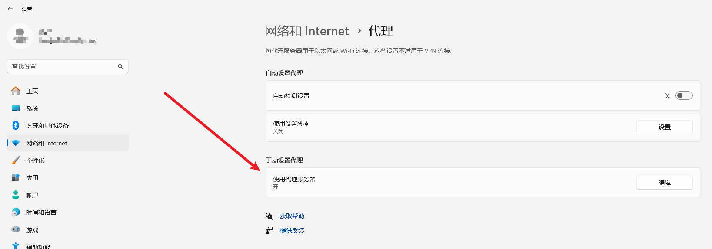
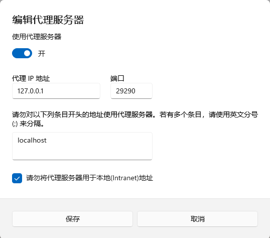
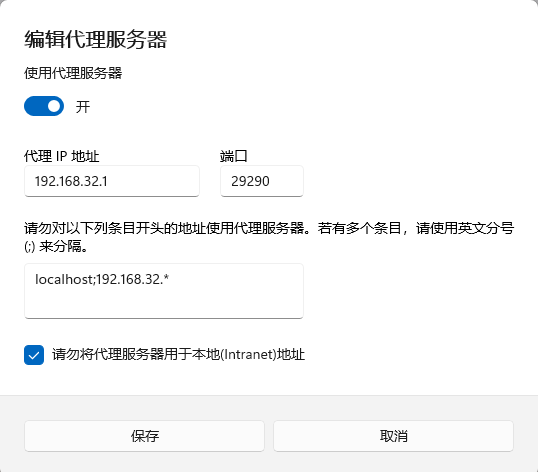

# 第1章 Docker的安装与配置

## 1、安装

[查看官方CentOS安装Docker教程](https://docs.docker.com/engine/install/centos/)

### 1.0、删除旧版Docker

```bash
sudo yum remove docker \
                  docker-client \
                  docker-client-latest \
                  docker-common \
                  docker-latest \
                  docker-latest-logrotate \
                  docker-logrotate \
                  docker-engine
# 必要时：清理yum安装的新版本docker
yum remote -y docker* container-selinux
```

如果yum报告说以上安装包未安装，未匹配，未删除任何安装包，活码环境干净，没有历史遗留旧版安装。

### 1.1、安装要求

	安装Docker的基本要求如下：

- Dockr只支持64位的CPU架构的计算机，目前不支持32位CPU
- 建议系统的Linux内核版本为3.10及以上
- Linux内核需要开启cgroups和namespace功能
- 对于非Linux内核的平台，如Microsoft Windows和OS X，需要安装使用Boot2Docker工具

### 1.2、CentOS环境下安装Docker

	Docker目前只能运行在64位平台上，并且要求内核版本不低于3.10，实际上内核版本越新越好，过低的内核版本容易造成功能不稳定。
	
	用户可以通过如下命令检查自己的内核版本详细信息：

```shell
$ uname -a
Linux emon 3.10.0-862.el7.x86_64 #1 SMP Fri Apr 20 16:44:24 UTC 2018 x86_64 x86_64 x86_64 GNU/Linux
$ cat /proc/version
Linux version 3.10.0-862.el7.x86_64 (builder@kbuilder.dev.centos.org) (gcc version 4.8.5 20150623 (Red Hat 4.8.5-28) (GCC) ) #1 SMP Fri Apr 20 16:44:24 UTC 2018
```

1. 安装需要的软件包，yum-util提供yum-config-manager功能，另外两个是devicemapper驱动依赖的

```shell
$ sudo yum install -y yum-utils device-mapper-persistent-data lvm2
```

2. 设置yum源

```shell
$ sudo yum-config-manager --add-repo https://download.docker.com/linux/centos/docker-ce.repo
```

3. 可以查看所有仓库中所有docker版本，并选择安装特定的版本

```shell
$ yum list docker-ce --showduplicates |sort -r
```

4. 安装docker

```shell
# 安装最新
# $ sudo yum install -y docker-ce
# 安装指定版本
# $ sudo yum install -y docker-ce-18.06.3.ce 【一个使用了很久的版本】
# $ sudo yum install -y docker-ce-19.03.15
$ sudo yum install -y docker-ce-20.10.24
# $ sudo yum install -y docker-ce-23.0.6
# $ sudo yum install -y docker-ce-24.0.9
# $ sudo yum install -y docker-ce-25.0.5
# $ sudo yum install -y docker-ce-26.1.4
```

5. 启动

```shell
$ sudo systemctl start docker
```

6. 验证安装

```shell
$ sudo docker version
$ sudo docker info
$ sudo docker run hello-world
```

> 说明：如果docker info有提示：
> WARNING: bridge-nf-call-iptables is disabled
> WARNING: bridge-nf-call-ip6tables is disabled

解决办法：

```bash
[emon@emon2 ~]$ sudo vim /etc/sysctl.conf 
```

```bash
net.bridge.bridge-nf-call-ip6tables = 1
net.bridge.bridge-nf-call-iptables = 1
```

使之生效：

```bash
[emon@emon2 ~]$ sudo sysctl -p
```

无需重启，此时docker info就看不到此报错了。

### 1.3、配置docker加速器

- 配置

    - DaoCloud

  采用 DaoCloud: https://www.daocloud.io/ 提供的Docker加速器。

  登录DaoCloud，找到小火箭图标，根据说明操作：

  ```bash
  $ curl -sSL https://get.daocloud.io/daotools/set_mirror.sh | sh -s http://f1361db2.m.daocloud.io
  docker version >= 1.12
  {"registry-mirrors": ["https://mirror.baidubce.com","http://f1361db2.m.daocloud.io"]}
  Success.
  You need to restart docker to take effect: sudo systemctl restart docker
  ```

    - 阿里云

  登录阿里开发者平台： https://promotion.aliyun.com/ntms/act/kubernetes.html#industry

  点击【镜像搜索】按钮，自动跳转到控制台的镜像搜索，根据提示注册并登录：

  在左侧【镜像工具】中选择【镜像加速器】，右边是生成的加速地址：比如我的：`https://pyk8pf3k.mirror.aliyuncs.com`，执行命令配置上即可：

  `daemon.json`文件是一个JSON格式的文件，包含键值对来设置Docker守护进程的参数。以下是一些常见的配置项：

    - daemon.json文件结构

        - graph设置docker数据目录：选择比较大的分区（如果这里是根目录就不需要配置了，默认为/var/lib/docker）

        - data-root: Docker数据目录，默认为/var/lib/docker。

          > 版本docker-ce-23.0.6以下用 graph 而不是 data-root
          >
          > 版本docker-ce-23.0.6及以上，graph -> data-root，否则报错Active: failed (Result: start-limit

        - exec-root: Docker执行状态文件的存储路径，默认为/var/run/docker。

        - exec-opts：设置cgroup driver（默认是cgroupfs，不推荐设置systemd）

          > 比如：  `"exec-opts": ["native.cgroupdriver=cgroupfs"],`

        - log-driver: Docker日志驱动类型，默认为json-file。

        - log-level: Docker日志记录级别，如debug、info、warn、error、fatal。

        - insecure-registries: 可以通过HTTP连接的镜像仓库地址。

        - registry-mirrors: 镜像仓库加速地址。

        - storage-driver: Docker存储驱动类型，推荐overlay2。

        - live-restore: 是否启用“实时恢复”功能，允许Docker在更新或重启时不终止运行中的容器。
        - debug：开启调试，若启动失败，可以在 /var/log/messages 查看原因

  ```bash
  sudo tee /etc/docker/daemon.json <<-'EOF'
  {
    "registry-mirrors": ["https://pyk8pf3k.mirror.aliyuncs.com","https://dockerproxy.com","https://mirror.baidubce.com","https://docker.nju.edu.cn","https://docker.mirrors.sjtug.sjtu.edu.cn","https://docker.mirrors.ustc.edu.cn"],
    "graph": "/var/lib/docker",
    "exec-opts": ["native.cgroupdriver=cgroupfs"],
    "insecure-registries": ["emon:5080"]
  }
  EOF
  ```

  说明：

    1. 阿里云加速器
    2. DockerProxy代理加速
    3. 百度云Mirror
    4. 南京大学
    5. 上海交通大学
    6. USTC

- 查看

```bash
$ sudo cat /etc/docker/daemon.json 
{"registry-mirrors": ["http://f1361db2.m.daocloud.io"]}
```

- 重启

```bash
$ sudo systemctl restart docker
```

### 1.4、配置docker代理服务器

若加速器不好使，请使用代理服务器，前提是能科学上网，这里推荐一个：Aurora

- 安装了Aurora后，通过【设置】=>【网络和 Internet】=>【代理】=>【手动设置代理】（发现是开启的）=>编辑，查看代理地址。



点击编辑后，看到的代理配置：



其中127.0.0.1可以更换为其他网卡地址（比如VMware Network Adapter VMnet8）：192.168.32.1



- 配置Docker代理

```bash
$ mkdir -p /etc/systemd/system/docker.service.d
$ vim /etc/systemd/system/docker.service.d/proxy.conf
```

```bash
[Service]
Environment="HTTP_PROXY=http://192.168.32.1:29290"
Environment="HTTPS_PROXY=http://192.168.32.1:29290"
Environment="NO_PROXY=127.0.0.1,localhost,192.168.32.116"
```

- 重启Docker并查看代理配置情况

```bash
$ systemctl daemon-reload && systemctl restart docker
$ systemctl show --property=Environment docker
Environment=HTTP_PROXY=http://192.168.32.1:29290 HTTPS_PROXY=http://192.168.32.1:29290
```

## 2、配置Docker服务

### 2.1、推荐通过配置sudo的方式：

	不推荐docker服务启动后，修改/var/run/docker.sock文件所属组为dockerroot，然后为某个user添加附加组dockerroot方式，使得docker命令在user登录后可以执行。

```shell
$ sudo visudo
```

	找到`## Allow root to run any commands anywhere`这样的标识，在下方配置：

```shell
# 备注：如果已经赋予了ALL的操作权限，就没必要配置如下了
emon    ALL=(ALL)       PASSWD:/usr/bin/docker
```


### 2.2、配置alias

配置永久的alias：

```shell
# 如果是root用户安装的，不需要带sudo命令
$ vim ~/.bashrc
alias docker="sudo /usr/bin/docker"
alias dockerpsf="sudo /usr/bin/docker ps --format \"table{{.ID}}\t{{.Names}}\t{{.Status}}\t{{.Image}}\t{{.RunningFor}}\t{{.Ports}}\""
alias dockerps="sudo /usr/bin/docker ps --format \"table{{.ID}}\t{{.Status}}\t{{.Names}}\""
```

使之生效：

```shell
$ source ~/.bashrc
```

使用示例：

```shell
$ docker images
[sudo] emon 的密码：
REPOSITORY          TAG                 IMAGE ID            CREATED             SIZE
```

## 3、基本信息查看

### 3.1、查看Docker的基本信息

```shell
$ docker info
Containers: 0
 Running: 0
 Paused: 0
 Stopped: 0
Images: 0
Server Version: 18.06.3-ce
Storage Driver: overlay2
 Backing Filesystem: xfs
 Supports d_type: true
 Native Overlay Diff: true
Logging Driver: json-file
Cgroup Driver: cgroupfs
Plugins:
 Volume: local
 Network: bridge host macvlan null overlay
 Log: awslogs fluentd gcplogs gelf journald json-file logentries splunk syslog
Swarm: inactive
Runtimes: runc
Default Runtime: runc
Init Binary: docker-init
containerd version: 468a545b9edcd5932818eb9de8e72413e616e86e
runc version: a592beb5bc4c4092b1b1bac971afed27687340c5
init version: fec3683
Security Options:
 seccomp
  Profile: default
Kernel Version: 3.10.0-1062.el7.x86_64
Operating System: CentOS Linux 7 (Core)
OSType: linux
Architecture: x86_64
CPUs: 4
Total Memory: 4.743GiB
Name: emon
ID: GN4G:MRL4:3LOQ:IHZP:CXV6:TE33:WSIG:FAYD:4UBO:3VU6:VBAZ:5I5I
Docker Root Dir: /var/lib/docker
Debug Mode (client): false
Debug Mode (server): false
Registry: https://index.docker.io/v1/
Labels:
Experimental: false
Insecure Registries:
 127.0.0.0/8
Registry Mirrors:
 http://c018e274.m.daocloud.io/
Live Restore Enabled: false
```

### 3.2、查看Docker版本

```shell
$ docker version
Client:
 Version:           18.06.3-ce
 API version:       1.38
 Go version:        go1.10.3
 Git commit:        d7080c1
 Built:             Wed Feb 20 02:26:51 2019
 OS/Arch:           linux/amd64
 Experimental:      false

Server:
 Engine:
  Version:          18.06.3-ce
  API version:      1.38 (minimum version 1.12)
  Go version:       go1.10.3
  Git commit:       d7080c1
  Built:            Wed Feb 20 02:28:17 2019
  OS/Arch:          linux/amd64
  Experimental:     false
```

## 4、升级Docker

### 4.1、卸载低版本Docker

- 查看Docker版本

```bash
$ rpm -qa|grep docker
docker-ce-18.06.3.ce-3.el7.x86_64
```

- 查看已安装镜像

```bash
$ docker images
```

- 查看镜像存放路径

```bash
$ docker inspect <image_name>|grep HostsPath
```

> Linux系统下，Docker默认存储路径是`/var/lib/docker`

- 删除Docker

```bash
$ yum list docker*
$ yum remove docker*
```

> 注：不删除`/var/lib/docker`目录就不会删除已安装的镜像和容器。

### 4.2、安装高版本Docker

```bash
$ yum install -y docker-ce-20.10.24
$ systemctl enable docker && systemctl start docker
```
