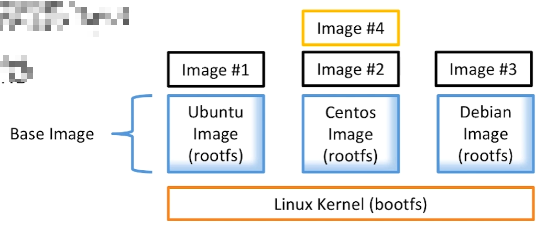

# 第3章 镜像

## 1 什么是Image

- 文件和meta data的集合（root filesystem）
- 分层的，并且每一层都可以添加改变，删除文件，成为一个新的image
- 不同的image可以共享相同的layer
- Image本身是read-only的




## 2 获取镜像

- 获取Docker Hub镜像
    - 镜像是运行容器的前提，官方的Docker Hub网站已经提供了数十万个镜像供开放下载。
    - 命令格式： `docker pull NAME[:TAG]` 其中，NAME是镜像仓库的名称（用来区分镜像），TAG是镜像的标签（往往用来表示版本信息）。通常情况下，描述一个镜像需要包括`名称+标签`信息。
    - 如果不指定TAG，默认选择latest标签，这会下载仓库中最新版本的镜像。

```shell
# 等效于 docker pull registry.hub.docker.com/ubuntu:14.04
$ docker pull ubuntu:14.04
# 我喜欢的centos
$ docker pull centos:7
```

- 获取其他服务器镜像

```shell
$ docker pull hub.c.163.com/public/ubuntu:14.04
```

## 3 查看镜像

- 使用`docker images`命令列出镜像

```shell
$ docker images
# 或者
$ docker image ls
```

- 列名解析：

| 列名       | 释义                                                         |
| ---------- | ------------------------------------------------------------ |
| REPOSITORY | 来自于哪个仓库，比如ubuntu仓库用来保存ubuntu系列基础镜像     |
| TAG        | 镜像的标签信息，比如14.04、latest用来标注不同的版本信息。标签只是标记，不标识镜像内容 |
| IMAGE ID   | 镜像的ID（唯一标识镜像），比如ubuntu:14.04的唯一标志是 971bb384a50a |
| CREATED    | 创建时间，说明镜像最后的更新时间                             |
| SIZE       | 镜像大小，优秀的镜像往往体积比较小                           |

- 命令支持的选项

| 参数名称                | 参数作用                                                     |
| ----------------------- | ------------------------------------------------------------ |
| -a, --all=true\|false   | 列出所有的镜像文件（包括临时文件），默认为否                 |
| --digests=true\|false   | 列出镜像的数字摘要值，默认为否                               |
| -f, --filter=[]         | 过滤列出的镜像，如dangling=true只显示没有被使用的镜像；也可以指定带有特定标注的镜像等 |
| --format="TEMPLATE"     | 控制输出格式，例如`.ID`代表ID信息，`.Repository`代表仓库信息等 |
| --no-trunc=true\|false  | 对输出结果中太长的部分是否进行截断，如镜像的ID信息，默认为是 |
| -q, --quiet=true\|false | 仅输出ID信息，默认为否                                       |

	其中，对输出结果进行控制的选项如-f, --filter=[]、--no-trunc=true|false、-q, --quiet=true|false等，对大部分子命令都支持。

### 3.1 查看镜像的分层信息

```bash
$ docker history <containerId>
```

## 4 为镜像添加标签Tag

	为了方便在后续工作中使用特定镜像，还可以使用`docker tag`命令来为本地镜像任意添加新的标签。

```shell
$ docker tag centos:7 centos:7.8
$ docker images
REPOSITORY          TAG                 IMAGE ID            CREATED             SIZE
centos              7                   b5b4d78bc90c        2 days ago          203MB
centos              7.8                 b5b4d78bc90c        2 days ago          203MB
```

## 5 使用`inspect`命令查看镜像详细信息

```shell
$ docker inspect centos:7
```

## 6 搜寻镜像

	使用docker search命令可以搜索远端仓库中共享的镜像，默认搜索官方仓库中的镜像。支持的参数主要包括：

| 参数名称                          | 参数作用                                                     |
| --------------------------------- | ------------------------------------------------------------ |
| --filter=is-automated=true\|false | 仅显示自动创建的镜像，默认为否                               |
| --no-trunc=true\|false            | 输出信息不截断显示，默认为否                                 |
| --filter=stars=3                  | 指定仅显示评价为指定星级以上的镜像，默认为0，即输出所有镜像。 |
| --filter=is-official=true         | 仅查询官方镜像                                               |
| --limit int                       | 仅显示几条                                                   |

示例：

```shell
$ docker search --filter=stars=3 --filter=is-official=true nginx
```

```bash
$ docker search --filter=stars=0 --limit 5 nginx
```

## 7 删除镜像

- 使用标签删除镜像，命令格式： `docker rmi IMAGE [IMAGE...]`，其中IMAGE可以是标签或者ID

```shell
$ docker rmi centos:7.8
$ docker images
REPOSITORY          TAG                 IMAGE ID            CREATED             SIZE
centos              7                   b5b4d78bc90c        2 days ago          203MB
```

- 使用镜像ID（或者部分ID串前缀）删除镜像

```shell
$ docker rmi -f b5b4d78bc90c
```

	命令含义：会先尝试删除所有指向该镜像的标签，然后删除该镜像文件本身。哪怕基于该镜像启动了容器，也会删除镜像。但不影响容器。

- 批量删除满足条件的镜像

```bash
[emon@emon harbor]$ docker rmi $(docker images goharbor/* -q)
```

## 8 创建镜像

	创建镜像的方法主要有三种：基于已有镜像的容器创建、基于本地模板导入、基于Dockerfile创建。

### 8.1 基于已有镜像的容器创建【不推荐】

<span style="color:red;font-weight:bold;">不会把外部挂载的资源打包到镜像</span>

该方法主要是使用docker commit命令；等效命令：docker container commit

命令格式为`docker commit [OPTIONS] CONTAINTER [REPOSITORY[:TAG]]`，主要选项包括：

| 参数名称         | 参数作用                                                     |
| ---------------- | ------------------------------------------------------------ |
| -a, --author=""  | 作者信息                                                     |
| -c, --change=[]  | 提交的试试执行Dockerfile指令，包括CMD\|ENTRYPOINT\|ENV\|EXPOSE\|LABEL\|ONBUILD\|USER\|VOLUME\|WORKDIR等 |
| -m, --message="" | 提交信息                                                     |
| -p, --pause=true | 提交时暂停容器运行                                           |

1. 首先，启动一个镜像，并在其中进行修改操作，例如创建一个test文件，之后推出：

```shell
$ docker run -it ubuntu:14.04 /bin/bash
root@fe1aa9bd8460:/# touch test
root@fe1aa9bd8460:/# exit
```

记住容器的ID为 fe1aa9bd8460。

此时，该容器跟原ubuntu:14.04镜像相比，已经发生了变化，可以使用`docker commit`命令提交未一个新的镜像。提交时可以使用ID或者名称来指定容器：

```shell
$ docker commit -m "Added a new file" -a "Emon" fe1aa9bd8460 test:0.0.1
```

### 8.2 基于本地模板导入

用户也可以直接从一个操作系统模板文件导入一个镜像，主要使用`docker import`命令。

命令格式为`docker import [OPTIONS] file|URL| - [REPOSITORY[:TAG]]`

### 8.3 基于Dockerfile创建【推荐】

docker build命令；等效命令：docker image build

1：创建目录

```bash
$ mkdir docker-centos-vim
$ cd docker-centos-vim/
```

2：创建Dockerfile

```bash
$ vim Dockerfile 
```

```dockerfile
FROM rockylinux:9
RUN dnf install -y vim
```

3：创建镜像

```bash
# -t 指定repository名称为 rushing/rockylinux-vim:latest 其中rushing是dockerhub用户名； .-当前目录寻找Dockerfile
$ docker build -t rushing/rockylinux-vim .
```

## 9 存出和载入镜像

用户可以使用`docker save`和`docker load`命令来存出和载入镜像。

### 9.1 存出镜像

```shell
$ docker save -o test_0.0.1.tar test:0.0.1
```

说明：由于是通过sudo使用的docker命令，这里到处的镜像属于root用户；该镜像可以分发给其他人导入。

### 9.2 载入镜像

```shell
$ docker load --input test_0.0.1.tar 
```

或者，使用root用户执行：

```shell
[root@emon ~]# docker load < /home/emon/test_0.0.1.tar 
```

或者，使用非root如下执行：

```shell
$ sudo bash -c "chown emon.emon test_0.0.1.tar;docker load < test_0.0.1.tar"
```

说明：直接使用docker load命令，非root用户有权限限制：

```shell
$ docker load < test_0.0.1.tar 
-bash: test_0.0.1.tar: 权限不够
```

## 10 上传镜像

以使用docker push命令上传镜像到仓库，默认上传到Docker Hub官方仓库（需要登录）。命令格式为：

`docker push NAME[:TAG] | [REGISTRY_HOST[:REGISTRY_PORT]/]NAME[:TAG]`

用户在Docker Hub网站注册后可以上传自制的镜像。例如用户user上传本地的test:latest镜像，可以先添加新的标签user/test:latest，然后用docker push命令上传镜像；

**请确保自己在 [Docker Hub](https://hub.docker.com/) 上有注册的用户，并把user替换为自己的用户名**

1. 打标签

```shell
$ docker tag test:0.0.1 rushing/test:0.0.1
```

2. 登录 Docker Hub

```shell
$ docker login
```

3. 上传

```shell
$ docker push rushing/test:0.0.1
```


## 11 查看镜像/容器/数据卷所占空间

```bash
$ docker system df
```

## 12 什么是Docker虚悬镜像

Docker 的 **虚悬镜像（Dangling Images）** 是指没有名称（`<none>`）且没有标签（`<none>`）的镜像。这类镜像通常是由于构建、更新或删除操作后残留的中间层或旧版本镜像造成的，不再与任何有效镜像关联，但仍会占用磁盘空间。

- 查询虚悬镜像

```bash
$ docker image ls -f dangling=true
```

- 虚悬镜像无价值，删除

```bash
$ docker image prune
```

```bash
WARNING! This will remove all dangling images.
Are you sure you want to continue? [y/N] y
......
```

## 13 构建自己的Docker私服【已捐献给CNCF】

::: tip

Docker 注册表曾是容器镜像注册的开源实现。它在 2019 年被捐赠给云原生计算基金会（CNCF），并以“发行版”的名义维护。它仍然是管理和分发容器镜像的基石。

[官网介绍](https://docs.docker.com/retired/#registry-now-cncf-distribution)

:::

- 创建docker私服

访问：https://hub.docker.com/

访问registry私服文档：https://docs.docker.com/registry/spec/api/#listing-repositories

搜索：registry，找到官方提供的registry，用来存储和发布docker image。

```bash
$ docker run -d -p 5000:5000 --restart always --name registry registry:2
```

- 私服安全控制

对文件 `/etc/docker/daemon.json` 追加 `insecure-registries`内容

```bash
{
  "insecure-registries": ["emon:5000"]
}
```

::: warning

注意emon是本地DNS配置：`192.168.200.116	emon`。

:::

重启Docker服务：

```bash
$ sudo systemctl daemon-reload && sudo systemctl restart docker
```

- 对<span style="color:blue;font-weight:bold;">”8.3 基于Dockerfile创建”</span>镜像，重新编译成新的镜像：

```bash
# 注意：这里用户名是 rushing ==> emon:5000
$ docker build -t emon:5000/rockylinux-vim .
$ docker images | grep rockylinux-vim
# 命令行输出结果
emon:5000/rockylinux-vim   latest    849dd25f38d6   5 minutes ago   252MB
```

- 上传到本地docker私服

```bash
[emon@emon hello-world]$ docker push emon:5000/rockylinux-vim
# 命令行输出结果
Using default tag: latest
The push refers to repository [emon:5000/rockylinux-vim]
927de9965fcf: Pushed 
fd4d3cdea43d: Pushed 
latest: digest: sha256:ebc203bd292f48f6cafc865f9b51ede208ed6a38f743fb451dc8585d0aa4e69b size: 740
```

- 验证私服

访问：http://emon:5000/v2/_catalog

- 删除本地的image，并从私服pull下来

```bash
$ docker rmi < imageId >
$ docker pull emon:5000/rockylinux-vim
```

## 14 镜像私服Harbor【推荐】

1. 下载地址

https://github.com/goharbor/harbor/releases

```bash
$ wget -cP /usr/local/src/ https://github.com/goharbor/harbor/releases/download/v2.2.4/harbor-offline-installer-v2.2.4.tgz
```

2. 创建解压目录

```bash
# 创建Harbor解压目录
$ mkdir /usr/local/Harbor
# 创建Harbor的volume目录
$ mkdir /usr/local/dockerv/harbor_home
```

3. 解压

```bash
# 推荐v2.2.4版本，更高版本比如2.3和2.4有docker-compose down -v ==> down-compose up -d时postgresql服务启动不了的bug，数据库重启失败！
$ tar -zxvf /usr/local/src/harbor-offline-installer-v2.2.4.tgz -C 
/usr/local/Harbor/
$ ls /usr/local/Harbor/harbor
common.sh  harbor.v2.2.4.tar.gz  harbor.yml.tmpl  install.sh  LICENSE  prepare
```

4. 创建自签名证书【参考实现，建议走正规渠道的CA证书】【缺少证书无法浏览器登录】

- 创建证书存放目录

```bash
$ mkdir /usr/local/Harbor/cert && cd /usr/local/Harbor/cert
```

- 创建CA根证书

```bash
# 其中C是Country，ST是State，L是local，O是Origanization，OU是Organization Unit，CN是common name(eg, your name or your server's hostname)
[emon@emon cert]$ openssl req -newkey rsa:4096 -nodes -sha256 -keyout ca.key -x509 -days 3650 -out ca.crt \
-subj "/C=CN/ST=ZheJiang/L=HangZhou/O=HangZhou emon Technologies,Inc./OU=IT emon/CN=emon"
# 命令行输出结果
Generating a 4096 bit RSA private key
...........................................................................................................................................................................................................................++
.............................................................................................++
writing new private key to 'ca.key'
-----
# 查看结果
[emon@emon cert]$ ls
ca.crt  ca.key
```

- 生成一个证书签名，设置访问域名为 emon

```bash
[emon@emon cert]$ openssl req -newkey rsa:4096 -nodes -sha256 -keyout emon.key -out emon.csr \
-subj "/C=CN/ST=ZheJiang/L=HangZhou/O=HangZhou emon Technologies,Inc./OU=IT emon/CN=emon"
# 命令行输出结果
Generating a 4096 bit RSA private key
......................................................................................................................................................................................++
.....................++
writing new private key to 'emon.key'
-----
# 查看结果
[emon@emon cert]$ ls
ca.crt  ca.key  emon.csr  emon.key
```

- 生成主机的证书

```bash
[emon@emon cert]$ openssl x509 -req -days 3650 -in emon.csr -CA ca.crt -CAkey ca.key -CAcreateserial -out emon.crt
# 命令行输出结果
Signature ok
subject=/C=CN/ST=ZheJiang/L=HangZhou/O=HangZhou emon Technologies,Inc./OU=IT emon/CN=emon
Getting CA Private Key
# 查看结果
[emon@emon cert]$ ls
ca.crt  ca.key  ca.srl  emon.crt  emon.csr  emon.key
```

5. 编辑配置

```bash
$ cp /usr/local/Harbor/harbor/harbor.yml.tmpl /usr/local/Harbor/harbor/harbor.yml
$ vim /usr/local/Harbor/harbor/harbor.yml
```

```yaml
# 修改
# hostname: reg.mydomain.com
hostname: emon
# 修改
  # port: 80
  port: 5080
# 修改
# https:
  # https port for harbor, default is 443
  # port: 443
  # The path of cert and key files for nginx
  # certificate: /your/certificate/path
  # private_key: /your/private/key/path
  # 修改：注意，这里不能使用软连接目录 /usr/loca/harbor替换/usr/local/Harbor/harbor-2.4.2
  # 否则会发生证书找不到错误：FileNotFoundError: [Errno 2] No such file or directory: 
  certificate: /usr/local/Harbor/cert/emon.crt
  private_key: /usr/local/Harbor/cert/emon.key
# 修改
# data_volume: /data
data_volume: /usr/local/dockerv/harbor_home
```

6. 安装

```bash
# 安装时，确保 /usr/bin/docker-compose 存在，否则会报错：? Need to install docker-compose(1.18.0+) by yourself first and run this script again.
$ sudo /usr/local/Harbor/harbor/install.sh --with-chartmuseum --with-trivy
# 查看服务状态
[emon@emon harbor]$ docker-compose ps
# 命令行输出结果
      Name                     Command                  State                           Ports                     
------------------------------------------------------------------------------------------------------------------
chartmuseum         ./docker-entrypoint.sh           Up (healthy)                                                 
harbor-core         /harbor/entrypoint.sh            Up (healthy)                                                 
harbor-db           /docker-entrypoint.sh 96 13      Up (healthy)                                                 
harbor-jobservice   /harbor/entrypoint.sh            Up (healthy)                                                 
harbor-log          /bin/sh -c /usr/local/bin/ ...   Up (healthy)   127.0.0.1:1514->10514/tcp                     
harbor-portal       nginx -g daemon off;             Up (healthy)                                                 
nginx               nginx -g daemon off;             Up (healthy)   0.0.0.0:5080->8080/tcp, 0.0.0.0:5443->8443/tcp
redis               redis-server /etc/redis.conf     Up (healthy)                                                 
registry            /home/harbor/entrypoint.sh       Up (healthy)                                                 
registryctl         /home/harbor/start.sh            Up (healthy)                                                 
trivy-adapter       /home/scanner/entrypoint.sh      Up (healthy)
```

8. 登录

访问：http://emon:5080 （会被跳转到http://emon:5443）

用户名密码： admin/Harbor12345

harbor数据库密码： root123

登录后创建了用户：emon/Emon@123

9. 修改配置重启

```bash
$ cd /usr/local/Harbor/harbor/
[emon@emon harbor]$ docker-compose down -v
# 如果碰到 postgresql 服务不是UP状态，导致登录提示：核心服务不可用。 请执行下面命令（根据data_volume配置调整路径），这个是该版本的bug。目前，v2.2.4版本可以正确重启，无需删除pg13
# [emon@emon harbor]$ sudo rm -rf /usr/local/dockerv/harbor_home/database/pg13
[emon@emon harbor]$ docker-compose up -d
```

10. 私服安全控制

对文件 `/etc/docker/daemon.json` 追加 `insecure-registries`内容：

```bash
$ sudo vim /etc/docker/daemon.json
```

```bash
{
  "registry-mirrors": ["https://pyk8pf3k.mirror.aliyuncs.com"],
  "insecure-registries": ["emon:5080"]
}
```

对文件 `/lib/systemd/system/docker.service` 追加`EnvironmentFile`：

```bash
$ sudo vim /lib/systemd/system/docker.service 
```

```bash
# 在ExecStart后面一行追加
EnvironmentFile=-/etc/docker/daemon.json
```

重启Docker服务：

```bash
[emon@emon hello-world]$ sudo systemctl daemon-reload
[emon@emon hello-world]$ sudo systemctl restart docker
```

10. 推送镜像

登录harbor后，先创建devops-learning项目，并创建emon用户。

```bash
# 打标签
$ docker tag openjdk:8-jre emon:5080/devops-learning/openjdk:8-jre
# 登录，登录后信息存储在用户目录下的 .docker/config.json
$ docker login -u emon -p Emon@123 emon:5080
# 上传镜像
$ docker push emon:5080/devops-learning/openjdk:8-jre
# 退出登录
$ docker logout emon:5080
```

## 15 几个强大的镜像

| 镜像         | 大小     | Shell      | 包管理    | 适用场景                  | 推荐度 |
| ------------ | -------- | ---------- | --------- | ------------------------- | ------ |
| `busybox`    | 1–5 MB   | ✅ (`ash`)  | ❌         | 快速调试、InitContainer   | ⭐⭐⭐⭐   |
| `alpine`     | 5–7 MB   | ✅ (`ash`)  | ✅ (`apk`) | 通用调试、轻量应用        | ⭐⭐⭐⭐⭐  |
| `distroless` | 2–30 MB  | ❌          | ❌         | 安全生产部署              | ⭐⭐⭐⭐   |
| `scratch`    | 0 MB     | ❌          | ❌         | 静态编译二进制            | ⭐⭐⭐    |
| 专用镜像     | 5–100 MB | 视情况     | ❌         | 特定任务（curl/tshark等） | ⭐⭐⭐⭐   |
| Ubuntu Slim  | 50–80 MB | ✅ (`bash`) | ✅ (`apt`) | glibc 兼容需求            | ⭐⭐⭐    |
