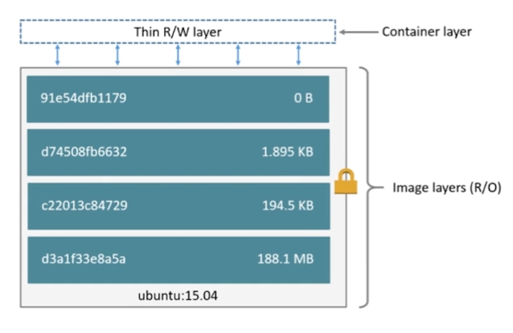

# 第4章 容器

简单来说，容器是镜像的一个运行实例。所不同的是，镜像是静态的只读文件，而容器带有运行时需要的可写层。
如果认为虚拟机是模拟运行的一整套操作系统（包括内核、应用运行态环境和其他系统环境）和跑在上面的应用，
那么Docker容器就是独立运行的一个（或一组）应用，以及它们必需的运行环境。

## 1 什么是Container

- 通过Image创建（Copy）

- 在Image layer之上建立一个container layer（可读写）
- 类比面向对象：类和实例
- Image负责app的存储和分发，Container负责运行app




## 2 查看容器

### 2.1 基本用法

- 命令格式： `docker ps [OPTIIONS]`

| 选项名      | 默认值 | 描述                                                         |
| ----------- | ------ | ------------------------------------------------------------ |
| --all,-a    | false  | 是否显示所有容器（默认仅显示运行中的容器）                   |
| --filter,-f |        | 根据过滤的条件过滤输出结果                                   |
| --format    |        | 使用模板输出格式良好的结果                                   |
| --last,-n   | -1     | 显示最后创建的n个容器（包含所有状态的容器）                  |
| --latest,-l | false  | 显示最后创建的容器（包含所有状态的容器）                     |
| --no-trunc  | false  | 不截断输出                                                   |
| --quiet,-q  | false  | 仅仅显示ID列                                                 |
| --size,-s   | false  | 显示文件大小（容器增量大小和容器虚拟大小（容器真实大小+依赖的镜像大小）） |

- 显示正在运行的容器

```shell
$ docker ps
# 或者
$ docker container ls
```

- 显示所有状态的容器（7种状态：created|restarting|runnning|removing|paused|exited|dead)

```shell
$ docker ps -a
# 或者
$ docker container ls -a
```

- 显示最后被创建的n个容器（不限状态）

```shell
$ docker ps -n 1
```

- 显示最后被创建的容器（不限状态）

```shell
$ docker ps -l
```

- 显示完整输出（正在运行状态的）

```shell
$ docker ps --no-trunc
```

- 只显示容器ID（正在运行状态的）

```shell
$ docker ps -q
```

- 显示容器文件大小（正在运行状态的，该命令显示容器真实大小和容器的虚拟大小=(容器真实大小+容器镜像大小)）

```shell
$ docker ps -s
```

### 2.2 高级用法

如果容器数量过多，或者想排除干扰容器，可以通过--filter或者-f选项，过滤需要显示的容器。

| 过滤条件 | 描述                                                         |
| -------- | ---------------------------------------------------------- |
| id       | 容器ID                                                       |
| label    | `label=<key>或者label=<key>=<value>`                           |
| status   | 支持的状态值有：created/restarting/running/removing/paused/exited/dead |
| health   | starting/healthy/unhealthy/none 基于健康检查状态过滤容器     |

条件很多，但万变不离其宗，只需要记住以下3条准则：

1. 选项后跟的都是键值对key=value(可不带引号)，如果有多个过滤条件，就多次使用filter选项。例如：

```shell
docker ps --filter id=a1b2c3 --filter name=festive_pasteur
```

2. 相同条件之间的关系是或，不同条件之间的关系是与。例如：

```shell
docker ps --filter name=festive --filter name=pasteur --filter status=running
```

以上过滤条件会找出name包含festive或者pasteur并且status为running的容器。

3. id和name，支持正则表达式，使用起来非常灵活。例如：

```shell
docker ps --filter name=^/festive_pasteur$
```

精确匹配name为festive_pasteur的容器。注意，容器实际名称，开头是由一个正斜线/，可用docker inspect一看便知。

```shell
docker ps --filter name=.*festive_pasteur.*
```

匹配name包含festive_pasteur的容器，和--filter name=festive_pasteur效果一致

最后，列举一个复杂点的例子，用于清理名称包含festive_pasteur，且状态为exited或dead的容器，如下：

```shell
docker rm $(docker ps -q --filter name=.*festive_pasteur.* --filter status=exited --filter status=dead 2>/dev/null)
```

如果是非root用户，要使用如下命令：

```shell
docker rm $(sudo bash -c "docker ps -q --filter name=.*festive_pasteur.* --filter status=exited --filter status=dead 2>/dev/null")
```

### 2.3 Format格式化显示

如果想要自定义显示容器字段，可以用格式化选项 -format。

| 占位符      | 描述                                                |
| ----------- |---------------------------------------------------|
| .ID         | 容器ID                                              |
| .Image      | ImageID                                           |
| .Command    | 启动容器的命令                                           |
| .CreatedAt  | 容器创建的时间                                           |
| .RunningFor | 自从容器创建后流逝的时间                                      |
| .Ports      | 暴露的端口                                             |
| .Status     | 容器占用的磁盘大小                                         |
| .Names      | 容器的名称                                             |
| .Labels     | 容器所有被分配的标签                                        |
| .Label      | 容器某个指定标签的值，比如：{`{.Label "com.docker.swarm.cpu"}`} |
| .Mounts     | 容器挂载的卷标名称                                         |
| .Networks   | attached到容器时的网络名称                                 |

1. 当使用了--format选项，那么ps命令只会输出template中指定的内容：

```shell
$ docker ps --format "{{.ID}}:{{.Command}}"
```

2. 如果想带上表格列头，需要在telplate中加上table：

```shell
$ docker ps --format "table{{.ID}}:{{.Command}}"
```

3. 一个比较好用的格式

```bash
$ docker ps --format "table{{.ID}}\t{{.Names}}\t{{.Status}}\t{{.Image}}\t{{.RunningFor}}\t{{.Ports}}"
```

[更多用法](https://www.cnblogs.com/fuyuteng/p/8847331.html)


## 3 创建容器

### 3.1 常规命令

- 新建容器

```shell
$ docker create -it --name centos7.8 centos:7
```

使用docker create命令创建的容器处于停止状态，可以使用docker start命令来启动。

- 启动容器

```shell
$ docker start `<container_id|container_name>`
```

- 新建并启动容器：守护态运行(Daemonized)【推荐的启动方式】

```bash
$ docker run -d --name centos7.8 centos:7 [/bin/bash]
```

- 新建并启动容器：非守护态运行，以交互模式运行容器

```bash
$ docker run -it --name centos7.8 centos:7 [/bin/bash]
```

::: tip

这种运行方式，用户可以按Ctrl+d或者输入exit命令来退出容器：

退出时，使用[Ctrl+D]，这样会结束docker当前线程，容器结束，可以使用[Ctrl+P+Q]退出而不是终止容器。

:::

#### 3.1.1 docker run命令常用参数总结及示例

| 参数                         | 说明                                                         | 示例                                                         |
| ---------------------------- | ------------------------------------------------------------ | ------------------------------------------------------------ |
| `-d`                         | 后台运行容器（detached模式）                                 | `docker run -d nginx`                                        |
| `-it`                        | 以交互模式运行容器（分配终端，常与`/bin/bash`配合使用）      | `docker run -it ubuntu /bin/bash`                            |
| `--name`                     | 为容器指定名称（默认随机生成）                               | `docker run -d –name my_nginx nginx`                         |
| `--rm`                       | 容器退出后自动删除（适合临时测试）                           | `docker run --rm -it alpine /bin/sh`                         |
| `-p <宿主机端口>:<容器端口>` | 将宿主机的端口映射到容器端口（支持TCP/UDP）                  | `docker run -d -p 8080:80 nginx`                             |
| `-P`                         | 自动将容器暴露的端口随机映射到宿主机的高端口（>30000）       | `docker run -d -P nginx`                                     |
| `-v <宿主机路径>:<容器路径>` | 挂载宿主机目录或文件到容器（数据持久化）                     | `docker run -v /opt/data:/var/lib/mysql mysql`               |
| `--mount`                    | 更灵活的挂载方式（支持类型如`volume`,`bind`,`tmpfs`）        | `docker run --mount type=bind,source=/opt/data,target=/data nginx` |
| `-e "KEY=VAL"`               | 设置容器内的环境变量                                         | `docker run -e "MYSQL_ROOT_PASSWORD=1234”`                   |
| `--env-file`                 | 从文件读取环境变量（每行一个`KEY=VAL`）                      | `docker run --env-file .env app`                             |
| `--memory="1g"`              | 限制容器内存使用（单位：`g`/`m`）                            | `docker run --memory="512m" app`                             |
| `--cpus="2"`                 | 限制容器使用的CPU核数                                        | `docker run --cpus="1.5" app`                                |
| `--network`                  | 指定容器使用的网络模式（默认`bridge`）                       | `docker run --network host nginx`                            |
| `--link`                     | 链接到其他容器（旧版方式，推荐改用自定义网络）               | `docker run --link redis:redis app`                          |
| `--restart`                  | 容器退出时的重启策略：<br />`no`-默认不重启<br />`on-failure`-非0退出时重启<br />`always`-总是重启<br />`unless-stopped`-除非手动停止 | `docker run --restart unless-stopped nginx`                  |
| `–entrypoint`                | 覆盖镜像默认的入口命令                                       | `docker run --entrypoint /bin/sh nginx`                      |
| `--user`                     | 指定运行容器的用户（UID或用户名）                            | `docker run --user 1000 app`                                 |
| `--workdir`                  | 设置容器的工作目录                                           | `docker run --workdir /app alpine ls`                        |
| `--privileged`               | 赋予容器几乎与宿主机相同的权限，解除默认的安全限制。         | `docker run --privileged -v /dev:/dev ...`                   |

- 一个综合案例

```bash
$ docker run -d \
  --name mysql_db \
  -p 3306:3306 \
  -v /opt/musql/data:/var/lib/mysql \
  -e MYSQL_ROOT_PASSWORD=123456 \
  --restart unless-stopped \
mysql:8.0
```

::: warning

重要说明：Docker容器后台运行（`-d`参数），就必须有一个前台进程。容器运行的命令如果不是那些一直挂起的命令（比如：top、tail），就会自动退出。

:::

### 3.2 创建容器遇到IPv4错误问题（虚拟机可达但服务不可达的原因）

<span style="color:red;font-weight:bold;">虚拟机恢复到某个快照后会出现虚拟机可达（可telnet通），但其上的docker服务不可达（不可telnet通）的情况，此时ping都是通的，也是这个ipv4转发的原因！</span>

如果创建容器时，发现如下错误的处理办法：

`WARNING: IPv4 forwarding is disabled. Networking will not work.`

```bash
# 检查
$ sudo sysctl -a|grep net.ipv4.ip_forward
# 配置
$ sudo vim /etc/sysctl.conf
net.ipv4.ip_forward=1
# 使之生效
$ sudo sysctl -p
# 重启网络
$ sudo systemctl restart network
```

### 3.3 容器资源限制

- 限定内存

```bash
# 指定分配内存200M（隐含200M的Swap，共400M）
$ docker run --memory=200M rushing/ubuntu-stress --vm 1 --verbose
# 指定分配内存200M（隐含200M的Swap，共400M），指定使用内存500M
$ docker run --memory=200M rushing/ubuntu-stress --vm 1 --verbose --vm-bytes 500M
```

- 限定CPU

```bash
# 设置cpu使用权重，如下test1占用10，test2占用5；如果cpu共享情况下，会按照2:1分配
$ docker run --cpu-shares=10 --name=test1 rushing/ubuntu-stress --cpu 2
$ docker run --cpu-shares=5 --name=test2 rushing/ubuntu-stress --cpu 1
```

### 3.4 虚拟机挂起并恢复后docker网络问题

- 查看设备状态

```bash
$ nmcli device status
```

- 临时unmanaged

```bash
$ nmcli device set xxx managed no
```

- 永久unmanaged

```bash
$ vim /etc/NetworkManager/conf.d/99-unmanaged-devices.conf
```

```bash
[keyfile]
unmanaged-devices=interface-name:docker*;interface-name:veth*;interface-name:br-*;interface-name:vmnet*;interface-name:vboxnet*;interface-name:cni0;interface-name:cali*;interface-name:flannel*
```

- 重启NetworkManager

```bash
$ systemctl restart NetworkManager
```

### 3.5 创建容器失败Operation not permitted

错误场景一：docker 容器启动报错Failed to create thread: Operation not permitted (1)

错误场景二：Docker挂载主机目录访问，如果出现 cannot open directory : Permission denied

解决办法：启动容器时增加选项 `docker run --privileged=true` 即可！

## 4 终止容器

可以使用docker stop来终止一个运行中的容器。该命令的格式为docker stop [-t|--time[=10]][CONTAINER...]。

首先向容器发送SIGTERM信号，等待一段超时时间（默认为10秒）后，再发送SIGKILL信号来终止容器：

```shell
$ docker stop <container_id|container_name>
```

[docker kill 命令会直接发送SIGKILL信号来强制终止容器。]

此外，当Docker容器中指定的应用终结时，容器也会自动终止。

此外，docker restart命令会将一个运行态的容器先终止，然后再重新启动它：

```shell
$ docker restart <container_id|container_name>
```

## 5 进入容器

在使用-d参数时，容器启动后会进入后台，用户无法看到容器中的信息，也无法进行操作。

这个时候如果需要进入容器进行操作，有多种方法，包括使用官方的attach或exec命令，以及第三方的nsenter工具等。

### 5.1 attach命令

- attach命令（连接后执行exit会停止容器）【过时方式】

attach直接进入容器启动命令的终端，不会启动新的进程，用exit退出，会导致容器的停止。

attach是Docker自带的命令，命令格式为：

docker attach [--detach-keys[=[]]][--no-stdin] [--sig-proxy[=true]] CONTAINER

| 选项名             | 默认值 | 描述                                                |
| ------------------ | ------ | --------------------------------------------------- |
| --detach-keys[=[]] |        | 指定退出attach模式的快捷键序列，默认是Ctrl-p Ctrl-q |
| --no-stdin         | false  | 是否关闭标准输入                                    |
| --sig-proxy        | true   | 是否代理收到的系统信号给应用进程                    |

```shell
$ docker attach <container_id|container_name>
```

但是使用attach命令有时候不方便。当多个窗口同时用attach命令连接到同一个容器的时候，所有窗口都会同步显示。当某个窗口因命令阻塞时，其他窗口也无法执行操作了。

### 5.2 exec命令

- exec命令（连接后执行exit，并不会停止容器）【推荐方式】

exec是在容器中打开新的终端，并且可以启动新的进程，用exit退出，不会导致容器的停止。

Docker从1.3.0版本起提供了一个更加方便的exec命令，可以在容器内直接执行任意命令。该命令的基本格式为

docker exec [-d| --detach][--detach-keys[=[]]]	[-i| --interactive] [--privileged][-t| --tty] [-u| --user[=USER]] CONTAINER COMMAND [ARG...]

| 选项名           | 默认值 | 描述                         |
| ---------------- | ------ | ---------------------------- |
| -i,--interactive | false  | 打开标准输入接受用户输入命令 |
| --privileged     | false  | 是否给执行命令以高权限       |
| -t,--tty         | false  | 分配伪终端，默认为false      |
| -u,--user        |        | 执行命令的用户名或者ID       |

- 进入容器

```shell
$ docker exec -it <container_id|container_name> /bin/bash
```

- 还可以执行其他命令

```bash
$ docker exec -it <container_id|container_name> ip addr
```


### 5.3 使用nsenter工具

暂略


## 6 复制容器内容

### 6.1 docker cp

```bash
$ docker cp a1870eec1273:/usr/local/openjdk-8/lib/security/java.security java.security
$ docker cp java.security a1870eec1273:/usr/local/openjdk-8/lib/security/java.security
```


## 7 删除容器

可以使用docker rm 命令来删除处于终止或退出状态的容器，命令格式为：

docker rm [-f|--force][-l|--link] [-v|--volumes] CONTAINER [CONTAINER...]。

| 选项名       | 默认值 | 描述                               |
| ------------ | ------ | ---------------------------------- |
| -f,--force   | false  | 是否强行终止并删除一个运行中的容器 |
| -l,--link    | false  | 删除容器的连接，但保留容器         |
| -v,--volumes | false  | 删除容器挂载的数据卷               |

- 查看并删除停止状态的容器

1. 查看停止状态的容器

```shell
$ docker ps -q -f status=exited
```

2. 删除停止状态的容器

```shell
$ docker rm <container_id|container_name>
```

3. 删除所有停止状态的容器

```bash
$ docker rm $(docker ps -aq --filter status=exited)
# 或者
$ docker rm $(docker container ls -f "status=exited" -q)
```

4. 删除停止状态的容器，并删除其volume（备注：如果是启动时指定的-v，并不会被删除）

```bash
$ docker rm -v <container_id|container_name>
```


- 删除运行状态的容器

1. 查看运行状态的容器

```shell
$ docker ps -q
或者
$ docker ps -q --filter status=running
```

2. 删除运行状态的容器

```shell
$ docker rm -f 3aa0487c2904
```

## 8 导入和导出容器

某些时候，需要将容器从一个系统迁移到另外一个系统，此时可以使用Docker的导入和导出功能。这也是Docker自身提供的一个重要特性。

### 8.1 导出容器

导出容器是指导出一个已经创建的容器到一个文件，不管此时这个容器是否处于运行状态，可以使用docker export命令，该命令的格式为：

docker export [-o|--output[=""]] CONTAINER。

其中，可以通过-o选项来指定导出的tar文件名，也可以直接通过重定向来实现。

1. 查看容器

```shell
$ docker ps -qa
```

2. 导出容器文件

```shell
$ docker export -o test_for_centos.tar 7fcaad938106
```

之后，可将导出的tar文件传输到其他机器上，然后再通过导入命令导入到系统中，从而实现容器的迁移。

### 8.2 导入容器

导出的文件又可以使用docker import命令导入变成镜像，该命令格式为：

docker import [-c|--change[=[]]][-m|--message[=MESSAGE]] file|URL|-[REPOSITORY[:TAG]]

用户可以通过-c, --change=[]选项在导入的同时执行对容器进行修改的Dockerfile指令。

```shell
$ docker import test_for_centos.tar centos:7-test
```

注意：导入容器后，体现为镜像，需要启动才会出现到docker ps -qa列表中。

## 9 查看容器日志

- 命令格式： `docker logs [OPTIONS]` <container_id|container_name>

| 选项名            | 默认值 | 描述                                                         |
| ----------------- | ------ | ------------------------------------------------------------ |
| `--details`       |        | 显示更多的信息                                               |
| `-f,--follow`     |        | 跟踪实时日志                                                 |
| `--since string`  |        | 显示自某个timestamp之后的日志，或相对时间，如42m（即42分钟） |
| `--tail string`   |        | 从日志末尾显示多少行日志，默认是all                          |
| `-t,--timestamps` |        | 显示时间戳                                                   |
| `--until string`  |        | 显示自某个timestamp之前的日志，或者相对时间，如42m（即42分钟） |

- 查看指定时间后的日志，只显示最后100行

```bash
docker logs -f -t --since="2021-02-17" --tail=100 <container_id|container_name>
```

- 查看最近30分钟的日志

```bash
docker logs --since 30 <container_id|container_name>
```

- 查看某个时间之后的日志

```bash
docker logs -t --since="2021-02-17T13:05:30" <container_id|container_name>
```

- 实时查看

```bash
docker logs -f <container_id|container_name>
```

- 普通查看

```bash
docker logs <container_id|container_name>
```


## 10 使用inspect命令查看容器详细信息

```bash
$ docker inspect <container_id|container_name>
```

## 11 更新容器设置

- 设置容器自动重启（在docker重启时）

```bash
docker update <container_id|container_name> --restart=always
```

## 12 查看容器port

- 查看容器的port

```bash
$ docker port <container_id|container_name>
```

::: tip

查看容器通过-p映射的端口情况。

:::