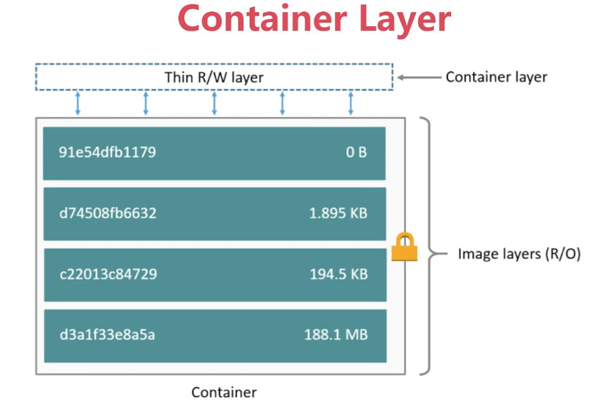
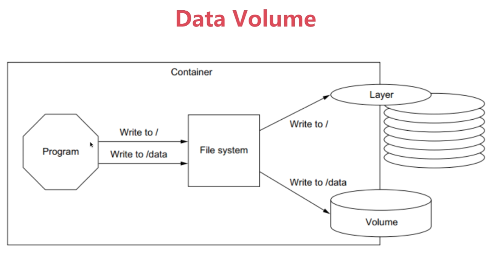

# 第5章 容器卷和数据共享







## 1、Docker持久化数据的方案

### 1.1、Volume存储位置

- 基于本地文件系统的Volume

可以在执行Docker create或Docker run时，通过-v参数将主机的目录作为容器的数据卷。这部分功能便是基于本地文件系统的volume管理。

- 基于plugin的Volume

支持第三方存储方案，比如NAS，AWS，阿里云等等。

### 1.2、Volume的类型

- 受管理的data Volume，由docker后台自动创建。
- 绑定挂在的Volume，具体挂在位置可以由用户指定。

## 2、数据持久化：Data Volume

### 2.1、不指定volume

- 查看volume

```bash
$ docker volume ls
```

- 创建mysq容器，并查看volume

```bash
$ docker run -d --name mysql1 -e MYSQL_ALLOW_EMPTY_PASSWORD=yes mysql
$ docker volume ls
DRIVER              VOLUME NAME
local               97e57d5925b751eb3d8739722854a97f0e69d3370ae471a90af5e638e95dd692
$ docker volume inspect 97e57d5925b751eb3d8739722854a97f0e69d3370ae471a90af5e638e95dd692
[
    {
        "CreatedAt": "2022-03-15T22:44:57+08:00",
        "Driver": "local",
        "Labels": null,
        "Mountpoint": "/var/lib/docker/volumes/97e57d5925b751eb3d8739722854a97f0e69d3370ae471a90af5e638e95dd692/_data",
        "Name": "97e57d5925b751eb3d8739722854a97f0e69d3370ae471a90af5e638e95dd692",
        "Options": null,
        "Scope": "local"
    }
]
$ docker stop mysql1
$ docker rm mysql1
# 可见volume并不会随着容器停止或删除而丢失
$ docker volume ls
DRIVER              VOLUME NAME
local               97e57d5925b751eb3d8739722854a97f0e69d3370ae471a90af5e638e95dd692
```

- 删除volume

```bash
$ docker volume rm 97e57d5925b751eb3d8739722854a97f0e69d3370ae471a90af5e638e95dd692
```

### 2.2、指定volume

- 创建mysql容器

```bash
$ docker run -d -v mysql:/var/lib/mysql --name mysql1 -e MYSQL_ALLOW_EMPTY_PASSWORD=yes mysql
```

​	**权限被拒绝（Permission Denied）？**

- 添加权限标签（如 `:ro` 或 `:rw`）。

```bash
$ docker run -v /宿主机/data:/容器/data:rw nginx
```

- 对于 SELinux，使用 `:z` 或 `:Z`：

```bash
$ docker run -v /宿主机/data:/容器/data:z nginx
```

- 查看volume

```bash
$ docker volume ls
DRIVER              VOLUME NAME
local               mysql
```

- 访问mysql服务并生成数据

```bash
$ sudo docker exec -it mysql1 /bin/bash
# 不需要输入密码，直接回车
root@83fd8a3c376d:/# mysql -u root
mysql> create database docker;
Query OK, 1 row affected (0.01 sec)

mysql> show databases;
+--------------------+
| Database           |
+--------------------+
| docker             |
| information_schema |
| mysql              |
| performance_schema |
| sys                |
+--------------------+
5 rows in set (0.00 sec)
```

- 删除容器

```bash
$ docker rm -f mysql1
```

- 创建容器mysql2

```bash
$ docker run -d -v mysql:/var/lib/mysql --name mysql2 -e MYSQL_ALLOW_EMPTY_PASSWORD=yes mysql
```

- 访问mysql服务并验证docker数据库仍旧存在

```bash
$ sudo docker exec -it mysql2 /bin/bash
# 不需要输入密码，直接回车
root@5559c6857e88:/# mysql -u root
Welcome to the MySQL monitor.  Commands end with ; or \g.
Your MySQL connection id is 8
Server version: 8.0.27 MySQL Community Server - GPL

Copyright (c) 2000, 2021, Oracle and/or its affiliates.

Oracle is a registered trademark of Oracle Corporation and/or its
affiliates. Other names may be trademarks of their respective
owners.

Type 'help;' or '\h' for help. Type '\c' to clear the current input statement.

mysql> show databases;
+--------------------+
| Database           |
+--------------------+
| docker             |
| information_schema |
| mysql              |
| performance_schema |
| sys                |
+--------------------+
5 rows in set (0.00 sec)
```

## 3 容器卷

###  3.1 容器卷基本映射

卷就是目录或文件，存在于一个或多个容器中，由docker挂载到容器，但不属于联合文化系统，因此能够绕过Union File System提供一些用于持续存储或共享数据的特性：

卷的设计目的就是<span style="color:red;font-weight:bold;">数据的持久化</span>，完全独立于容器的生存周期，因此Docker不会在容器删除时删除其挂载的数据卷。

命令：

docker run -it `--privileged=true` `-v /宿主机绝对路径目录 : /容器内目录` 镜像名

特点：

- 数据卷可以在容器之间共享或重用数据
- 卷中的更改可以直接实时生效
- 数据卷中的更改不会包含在镜像的更新中
- 数据卷的生命周期一直持续到没有容器使用它为止

示例：

```bash
$ docker run -it --name myu --privileged=true -v /tmp/host_data:/tmp/docker_data ubuntu /bin/bash
```

::: tip

无论是宿主机绝对路径目录，还是容器内目录，都会自动创建。

:::

### 3.2 容器卷读写映射

命令：默认是读写映射

docker run -it `--privileged=true` `-v /宿主机绝对路径目录:/容器内目录:rw` 镜像名

命令：限制容器实例内部，只能读取不能写入

docker run -it `--privileged=true` `-v /宿主机绝对路径目录:/容器内目录:ro` 镜像名


### 3.3 容器卷的继承和共享

命令：

docker run -it `--privileged=true` `--volumes-from 父容器` 镜像名

```bash
$ docker run -it --privileged=true --volumes-from <parent container id|name> 镜像名
```

::: tip

父容器停止或删除，不影响子容器的容器卷。

:::
