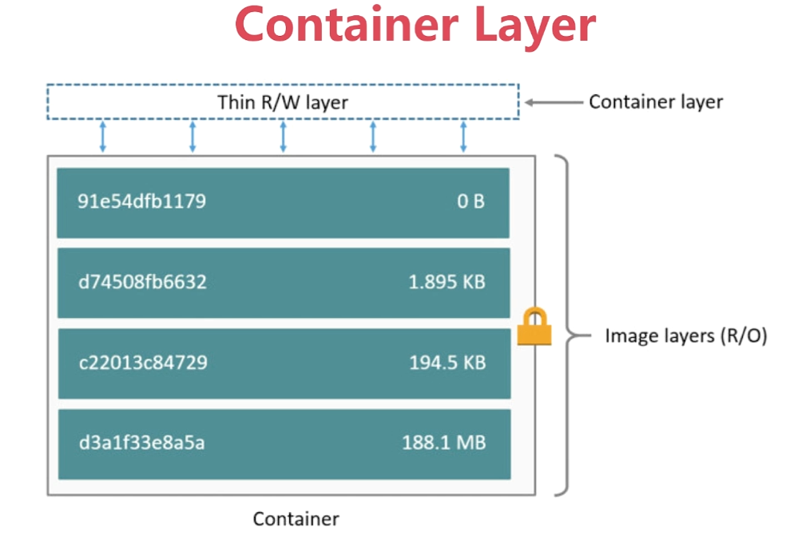
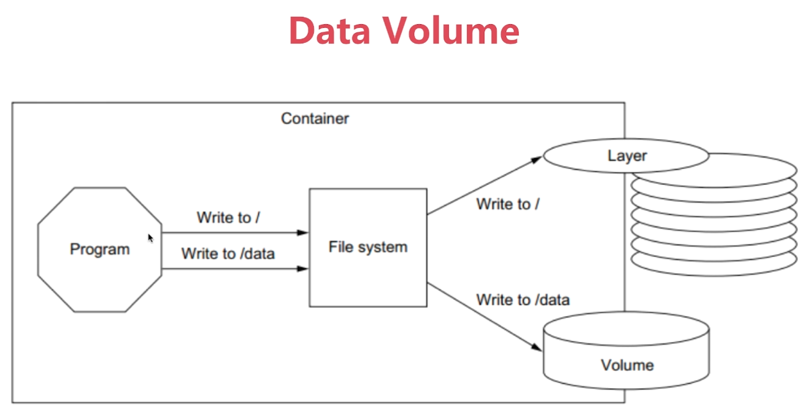

# 第7章 Docker的持久化存储和数据共享







## 1、Docker持久化数据的方案

### 1.1、Volume存储位置

- 基于本地文件系统的Volume

可以在执行Docker create或Docker run时，通过-v参数将主机的目录作为容器的数据卷。这部分功能便是基于本地文件系统的volume管理。

- 基于plugin的Volume

支持第三方存储方案，比如NAS，AWS，阿里云等等。

### 1.2、Volume的类型

- 受管理的data Volume，由docker后台自动创建。
- 绑定挂在的Volume，具体挂在位置可以由用户指定。

## 2、数据持久化：Data Volume

### 2.1、不指定volume

- 查看volume

```bash
$ docker volume ls
```

- 创建mysq容器，并查看volume

```bash
$ docker run -d --name mysql1 -e MYSQL_ALLOW_EMPTY_PASSWORD=yes mysql
$ docker volume ls
DRIVER              VOLUME NAME
local               97e57d5925b751eb3d8739722854a97f0e69d3370ae471a90af5e638e95dd692
$ docker volume inspect 97e57d5925b751eb3d8739722854a97f0e69d3370ae471a90af5e638e95dd692
[
    {
        "CreatedAt": "2022-03-15T22:44:57+08:00",
        "Driver": "local",
        "Labels": null,
        "Mountpoint": "/var/lib/docker/volumes/97e57d5925b751eb3d8739722854a97f0e69d3370ae471a90af5e638e95dd692/_data",
        "Name": "97e57d5925b751eb3d8739722854a97f0e69d3370ae471a90af5e638e95dd692",
        "Options": null,
        "Scope": "local"
    }
]
$ docker stop mysql1
$ docker rm mysql1
# 可见volume并不会随着容器停止或删除而丢失
$ docker volume ls
DRIVER              VOLUME NAME
local               97e57d5925b751eb3d8739722854a97f0e69d3370ae471a90af5e638e95dd692
```

- 删除volume

```bash
$ docker volume rm 97e57d5925b751eb3d8739722854a97f0e69d3370ae471a90af5e638e95dd692
```

### 2.2、指定volume

- 创建mysql容器

```bash
$ docker run -d -v mysql:/var/lib/mysql --name mysql1 -e MYSQL_ALLOW_EMPTY_PASSWORD=yes mysql
```

​	**权限被拒绝（Permission Denied）？**

- 添加权限标签（如 `:ro` 或 `:rw`）。

```bash
$ docker run -v /宿主机/data:/容器/data:rw nginx
```

- 对于 SELinux，使用 `:z` 或 `:Z`：

```bash
$ docker run -v /宿主机/data:/容器/data:z nginx
```

- 查看volume

```bash
$ docker volume ls
DRIVER              VOLUME NAME
local               mysql
```

- 访问mysql服务并生成数据

```bash
$ sudo docker exec -it mysql1 /bin/bash
# 不需要输入密码，直接回车
root@83fd8a3c376d:/# mysql -u root
mysql> create database docker;
Query OK, 1 row affected (0.01 sec)

mysql> show databases;
+--------------------+
| Database           |
+--------------------+
| docker             |
| information_schema |
| mysql              |
| performance_schema |
| sys                |
+--------------------+
5 rows in set (0.00 sec)
```

- 删除容器

```bash
$ docker rm -f mysql1
```

- 创建容器mysql2

```bash
$ docker run -d -v mysql:/var/lib/mysql --name mysql2 -e MYSQL_ALLOW_EMPTY_PASSWORD=yes mysql
```

- 访问mysql服务并验证docker数据库仍旧存在

```bash
$ sudo docker exec -it mysql2 /bin/bash
# 不需要输入密码，直接回车
root@5559c6857e88:/# mysql -u root
Welcome to the MySQL monitor.  Commands end with ; or \g.
Your MySQL connection id is 8
Server version: 8.0.27 MySQL Community Server - GPL

Copyright (c) 2000, 2021, Oracle and/or its affiliates.

Oracle is a registered trademark of Oracle Corporation and/or its
affiliates. Other names may be trademarks of their respective
owners.

Type 'help;' or '\h' for help. Type '\c' to clear the current input statement.

mysql> show databases;
+--------------------+
| Database           |
+--------------------+
| docker             |
| information_schema |
| mysql              |
| performance_schema |
| sys                |
+--------------------+
5 rows in set (0.00 sec)
```

## 3、数据持久化：Bind Mouting

1：创建目录

```bash
$ mkdir dockerdata/docker-nginx
$ cd dockerdata/docker-nginx/
```

2：编写内容

```bash
[emon@emon docker-nginx]$ vim index.html
```

```html
<!doctype html>
<html lang="en">
<head>
  <meta charset="utf-8">

  <title>hello</title>

</head>

<body>
  <h1>Hello Docker! </h1>
</body>
</html>

```

3：创建Dockerfile

```bash
[emon@emon docker-nginx]$ vim Dockerfile 
```

```dockerfile
# this same shows how we can extend/change an existing official image from Docker Hub

FROM nginx:latest
# highly recommend you always pin versions for anything beyond dev/learn

WORKDIR /usr/share/nginx/html
# change working directory to root of nginx webhost
# using WORKDIR is prefered to using 'RUN cd /some/path'

COPY index.html index.html

# I don't have to specify EXPOSE or CMD because they're in my FROM
```

4：创建镜像

```bash
[emon@emon docker-nginx]$ docker build -t rushing/my-nginx .
```

5：运行镜像

```bash
[emon@emon docker-nginx]$ docker run -d -p 80:80 --name web rushing/my-nginx
[emon@emon docker-nginx]$ curl 127.0.0.1
<!doctype html>
<html lang="en">
<head>
  <meta charset="utf-8">

  <title>hello</title>

</head>

<body>
  <h1>Hello Docker! </h1>
</body>
</html>
```

- 验证

访问：http://emon/

6：运行镜像：指定外部volume

```bash
# 删除旧容器
[emon@emon docker-nginx]$ docker rm -f web
# 指定外部volume启动容器
[emon@emon docker-nginx]$ docker run -d -p 80:80 -v $(pwd):/usr/share/nginx/html --name web rushing/my-nginx
# 进入容器，发现和$(pwd)外部目录一样；在容器目录创建了文件touch test.txt，外部也能查看到该文件。
[emon@emon docker-nginx]$ docker exec -it web /bin/bash
root@694fca15eaa1:/usr/share/nginx/html# ls
Dockerfile  index.html
root@694fca15eaa1:/usr/share/nginx/html# touch test.txt
root@694fca15eaa1:/usr/share/nginx/html# exit
exit
[emon@emon docker-nginx]$ ls
Dockerfile  index.html  test.txt
```


## 4、开发者利器：Docker+Bind Mouting

1：创建目录

```bash
$ mkdir dockerdata/flask-skeleton
$ cd dockerdata/flask-skeleton/
```

2：编写内容

一个PythonFlask项目。

https://github.com/EmonCodingBackEnd/demo-docker-source01

3：创建Dockerfile

```bash
[emon@emon flask-skeleton]$ vim Dockerfile 
```

```dockerfile
FROM python:2.7
LABEL maintainer="emon<emon@163.com>"

COPY . /skeleton
WORKDIR /skeleton
RUN pip3 install -r requirements.txt
EXPOSE 5000
ENTRYPOINT ["scripts/dev.sh"]
```

4：创建镜像

```bash
[emon@emon flask-skeleton]$ docker build -t rushing/flask-skeleton .
```

5：创建容器

```bash
[emon@emon flask-skeleton]$ docker run -d -p 80:5000 -v $(pwd):/skeleton --name flask rushing/flask-skeleton
```

## 5、综合演练：WordPress部署

1：创建目录

```bash
$ mkdir dockerdata/WordPress
$ cd dockerdata/WordPress/
```

2：创建MySQL容器

```bash
[emon@emon WordPress]$ docker run -d --name mysql -v mysql-data:/var/lib/mysql -e MYSQL_ROOT_PASSWORD=root123 -e MYSQL_DATABASE=wordpress mysql
```

3：创建WordPress容器

```bash
[emon@emon WordPress]$ docker run -d --name wordpress -e WORDPRESS_DB_HOST=mysql:3306 -e WORDPRESS_DB_USER=root -e  WORDPRESS_DB_PASSWORD=root123 --link mysql -p 8080:80 wordpress
```
