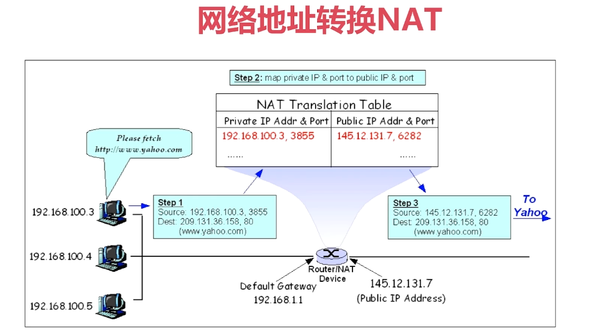
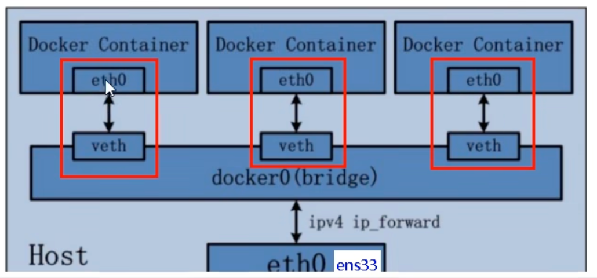
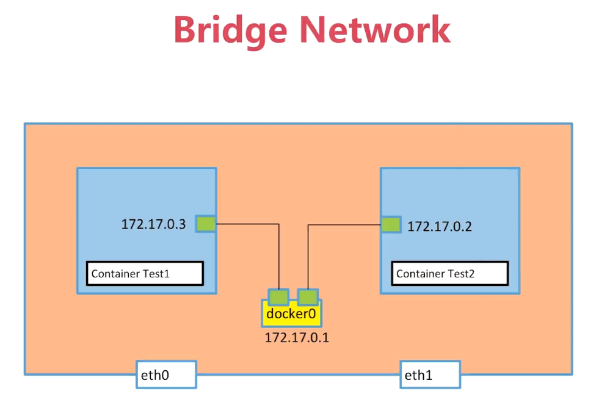
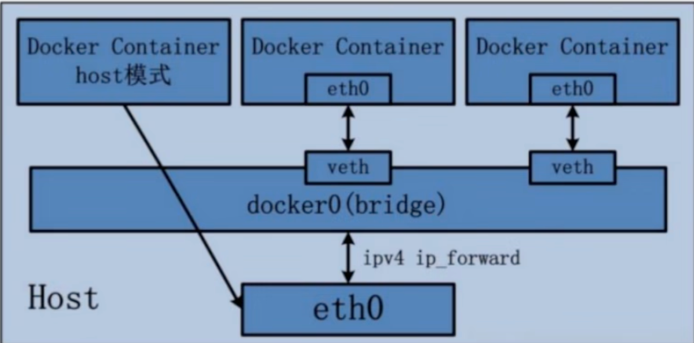
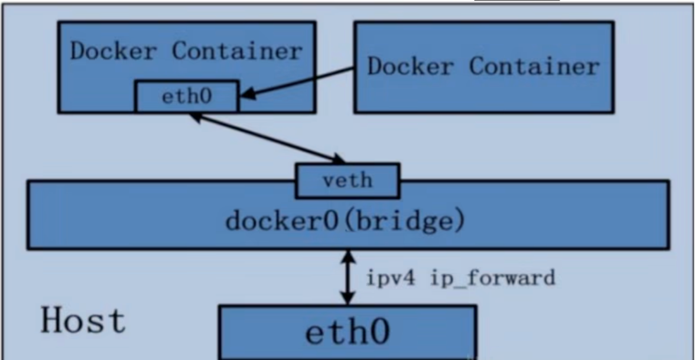
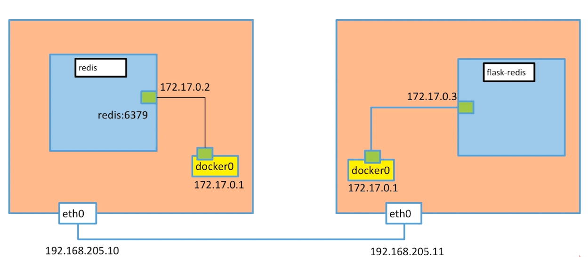

# 第7章 网络：端口映射与容器互联

## 1、网络的基础知识

### 1.1、网络的分类

- 单机
  - Bridge Network
  - Host Network
  - None Network
- 多机
  - Overlay Network

### 1.2、网络的分层


### 1.3、公有IP和私有IP

- Public IP：互联网上的唯一标识，可以访问internet
- Private IP：不可在互联网上使用，仅供机构内部使用

| 私有IP类别 | 网段                         | 示例           |
| ---------- | ---------------------------- | -------------- |
| A类        | 10.0.0.0--10.255.255.255     | 10.0.0.0/8     |
| B类        | 172.16.0.0--172.31.255.255   | 172.16.0.0/12  |
| C类        | 192.168.0.0--192.168.255.255 | 192.168.0.0/16 |

### 1.4、网络地址转换NAT



### 1.5、ping和telnet以及wireshark

- ping(ICMP)：验证IP的可达性
- telnet：验证服务的可用性
- wireshark：抓包工具


## 2、Linux网络命名空间

### 2.1、docker的网络命名空间

启动一个容器作为演示环境：

```bash
# 创建并启动容器
$ docker run -d --name test1 busybox /bin/sh -c "while true; do sleep 3600; done"
# 查看容器
$ docker ps 
CONTAINER ID   IMAGE     COMMAND                   CREATED         STATUS         PORTS     NAMES
7b06119db604   busybox   "/bin/sh -c 'while t…"   7 seconds ago   Up 7 seconds             test1

# 查看test1容器的网络命名空间，ip a （等效ip addr）
$ docker exec -it test1 ip a
1: lo: <LOOPBACK,UP,LOWER_UP> mtu 65536 qdisc noqueue qlen 1000
    link/loopback 00:00:00:00:00:00 brd 00:00:00:00:00:00
    inet 127.0.0.1/8 scope host lo
       valid_lft forever preferred_lft forever
225: eth0@if226: <BROADCAST,MULTICAST,UP,LOWER_UP,M-DOWN> mtu 1500 qdisc noqueue 
    link/ether 02:42:ac:11:00:02 brd ff:ff:ff:ff:ff:ff
    inet 172.17.0.2/16 brd 172.17.255.255 scope global eth0
       valid_lft forever preferred_lft forever
# 查看宿主机网络，可以看到 eth0的226对应veth的225
$ ip a
......省略无关内容......
226: vethde47d6c@if225: <BROADCAST,MULTICAST,UP,LOWER_UP> mtu 1500 qdisc noqueue master docker0 state UP group default 
    link/ether 8a:1c:b7:68:6a:82 brd ff:ff:ff:ff:ff:ff link-netnsid 0
    inet6 fe80::881c:b7ff:fe68:6a82/64 scope link 
       valid_lft forever preferred_lft forever
```

如上，`ip a`展示的结果，就是test1这个容器的网络命名空间。

再启动一个容器：

```bash
$ docker run -d --name test2 busybox /bin/sh -c "while true; do sleep 3600; done"
# 查看test2容器的网络命名空间
$ docker exec -it test2 ip a
```

### 2.2、linux的网络命名空间

#### 如何添加两个命名空间？

- 查看网络命名空间列表

```bash
$ sudo ip netns list
```

- 添加网络命名空间

```bash
$ sudo ip netns add test1
$ sudo ip netns add test2
```

- 查看某个网络命名空间详情

```bash
$ sudo ip netns exec test1 ip a
# 命令行输出结果
1: lo: <LOOPBACK> mtu 65536 qdisc noop state DOWN group default qlen 1000
    link/loopback 00:00:00:00:00:00 brd 00:00:00:00:00:00
$ sudo ip netns exec test1 ip link
# 命令行输出结果
1: lo: <LOOPBACK> mtu 65536 qdisc noop state DOWN mode DEFAULT group default qlen 1000
    link/loopback 00:00:00:00:00:00 brd 00:00:00:00:00:00
```

- 唤醒lo

```bash
$ sudo ip netns exec test1 ip link set dev lo up
$ sudo ip netns exec test1 ip link
1: lo: <LOOPBACK,UP,LOWER_UP> mtu 65536 qdisc noqueue state UNKNOWN mode DEFAULT group default qlen 1000
    link/loopback 00:00:00:00:00:00 brd 00:00:00:00:00:00
```

#### 如何打通两个命名空间？

- 宿主机添加veth pair

```bash
# 在宿主机生成veth pair
$ sudo ip link add veth-test1 type veth peer name veth-test2
# 查看宿主机ip link，可以看到veth-test1和veth-test2
$ sudo ip link

# 添加veth-test1到test1命名空间
$ sudo ip link set veth-test1 netns test1
# 查看test1命名空间下的ip link
$ sudo ip netns exec test1 ip link

# 添加veth-test2到test2命名空间
$ sudo ip link set veth-test2 netns test2
# 查看test2命名空间下的ip link
$ sudo ip netns exec test2 ip link

# 再次查看宿主机ip link，看不到veth-test1和veth-test2
$ sudo ip link
```

图解：


- 为命名空间test1和test2添加IP地址

```bash
# 为test1命名空间上的veth-test1添加IP地址
$ sudo ip netns exec test1 ip addr add 192.168.1.1/24 dev veth-test1
# 为test2命名空间上的veth-test2添加IP地址
$ sudo ip netns exec test2 ip addr add 192.168.1.2/24 dev veth-test2

# 唤醒test1上的veth-test1
$ sudo ip netns exec test1 ip link set dev veth-test1 up
# 唤醒test2上的veth-test2
$ sudo ip netns exec test2 ip link set dev veth-test2 up

# ==================================================
# 查看test1和test2的ip link
$ sudo ip netns exec test1 ip link
# 命令行输出结果
1: lo: <LOOPBACK,UP,LOWER_UP> mtu 65536 qdisc noqueue state UNKNOWN mode DEFAULT group default qlen 1000
    link/loopback 00:00:00:00:00:00 brd 00:00:00:00:00:00
101: veth-test1@if100: <BROADCAST,MULTICAST,UP,LOWER_UP> mtu 1500 qdisc noqueue state UP mode DEFAULT group default qlen 1000
    link/ether fa:6e:7e:58:57:03 brd ff:ff:ff:ff:ff:ff link-netnsid 1
$ sudo ip netns exec test2 ip link
# 命令行输出结果
1: lo: <LOOPBACK> mtu 65536 qdisc noop state DOWN mode DEFAULT group default qlen 1000
    link/loopback 00:00:00:00:00:00 brd 00:00:00:00:00:00
100: veth-test2@if101: <BROADCAST,MULTICAST,UP,LOWER_UP> mtu 1500 qdisc noqueue state UP mode DEFAULT group default qlen 1000
    link/ether fe:ca:9f:29:72:0b brd ff:ff:ff:ff:ff:ff link-netnsid 0
    
# 查看test1和test2的ip a
$ sudo ip netns exec test1 ip a
# 命令行输出结果
1: lo: <LOOPBACK,UP,LOWER_UP> mtu 65536 qdisc noqueue state UNKNOWN group default qlen 1000
    link/loopback 00:00:00:00:00:00 brd 00:00:00:00:00:00
    inet 127.0.0.1/8 scope host lo
       valid_lft forever preferred_lft forever
    inet6 ::1/128 scope host 
       valid_lft forever preferred_lft forever
101: veth-test1@if100: <BROADCAST,MULTICAST,UP,LOWER_UP> mtu 1500 qdisc noqueue state UP group default qlen 1000
    link/ether fa:6e:7e:58:57:03 brd ff:ff:ff:ff:ff:ff link-netnsid 1
    inet 192.168.1.1/24 scope global veth-test1
       valid_lft forever preferred_lft forever
    inet6 fe80::f86e:7eff:fe58:5703/64 scope link 
       valid_lft forever preferred_lft forever
$ sudo ip netns exec test2 ip a
# 命令行输出结果
1: lo: <LOOPBACK> mtu 65536 qdisc noop state DOWN group default qlen 1000
    link/loopback 00:00:00:00:00:00 brd 00:00:00:00:00:00
100: veth-test2@if101: <BROADCAST,MULTICAST,UP,LOWER_UP> mtu 1500 qdisc noqueue state UP group default qlen 1000
    link/ether fe:ca:9f:29:72:0b brd ff:ff:ff:ff:ff:ff link-netnsid 0
    inet 192.168.1.2/24 scope global veth-test2
       valid_lft forever preferred_lft forever
    inet6 fe80::fcca:9fff:fe29:720b/64 scope link 
       valid_lft forever preferred_lft forever
       
# 从test1连通test2验证
$ sudo ip netns exec test1 ping 192.168.1.2
```

## 3、Docker网络

### 3.1 Docker网络类型列表

- 查看Docker网络列表

```bash
$ sudo docker network ls
NETWORK ID          NAME                DRIVER              SCOPE
4350d5c6e428        bridge              bridge              local
4913d65f0331        host                host                local
5dddd8fbaae8        none                null                local
# 查看bridge详细信息中的 Containers 属性包含的容器信息
$ sudo docker network inspect bridge
```

- 安装网络工具

:::code-group

```bash [CentOS7]
$ sudo yum install -y bridge-utils
# 说明：有两对veth，对应两个容器，通过docker0这个bridge连接起来。拓扑图如下：
$ brctl show
bridge name	bridge id		STP enabled	interfaces
docker0		8000.02426f6e5033	no		veth3950c82
										veth4b7c084
```

```bash [Rocky 9]
# （1）创建/删除桥接设备
# 创建名为 br0 的桥接设备
$ sudo ip link add name br0 type bridge
# 启用桥接设备
$ sudo ip link set br0 up
# 删除桥接设备
$ sudo ip link delete br0

# (2) 将网卡绑定到桥接
# 将物理网卡 eth0 绑定到桥接 br0
$ sudo ip link set eth0 master br0
# 从桥接 br0 解绑 eth0
$ sudo ip link set eth0 nomaster

# (3) 查看桥接状态
# 查看所有桥接设备
$ ip link show type bridge
# 查看桥接 br0 的详细信息
$ bridge link show dev br0
```

:::


- 默认网络

| 网络模式  | 简介                                                         | 使用                             |
| --------- | ------------------------------------------------------------ | -------------------------------- |
| bridge    | 为每一个容器分配、设置IP等，并将容器连接到一个`docker0`。<br />**虚拟网桥，默认为该模式。** | `--network bridge`               |
| host      | 容器将不会虚拟出自己的网卡，配置自己的IP等，<br />而是使用宿主机的IP和端口。 | `--network host`                 |
| none      | 容器有独立的 Network namespace，<br />但并没有对其进行任何网络设置，如分配 veth pair 和网桥连接，IP等。 | `--network none`                 |
| container | 新创建的容器不会创建自己的网卡和配置自己的IP，<br />而是和一个指定的容器共享IP、端口范围等。 | `--network container:容器名或ID` |

- 用户自定义网络

| 自定义网络类型                  | 命令                                                         |
| :------------------------------ | ------------------------------------------------------------ |
| 自定义桥接网络（`bridge` 驱动） | `docker network create --driver bridge my_bridge`            |
| 覆盖网络（`overlay` 驱动）      | `docker network create --driver overlay my_overlay`          |
| MACVLAN 网络（`macvlan` 驱动）  | `docker network create --driver macvlan --subnet=192.168.1.0/24 --gateway=192.168.1.1 -o parent=eth0 my_macvlan` |

- 容器网络模式对比

| 网络类型         | 隔离性 | 性能 | 跨主机支持 | 典型场景              |
| :--------------- | :----- | :--- | :--------- | :-------------------- |
| `bridge`         | 高     | 中等 | 否         | 单机容器通信          |
| `host`           | 无     | 高   | 否         | 高性能需求            |
| `none`           | 完全   | -    | 否         | 完全隔离              |
| 自定义 `bridge`  | 高     | 中等 | 否         | 复杂单机应用          |
| `overlay`        | 高     | 较低 | 是         | Docker Swarm/K8s 集群 |
| `macvlan/ipvlan` | 低     | 高   | 是         | 直接接入物理网络      |


### 3.2 Docker网络之bridge

Docker服务默认会创建一个 `docker0` 网桥（其上有一个docker0内部接口），该桥接网络的名称为docker0，它在<span style="color:red;font-weight:bold;">内核层</span>连通了其他的物理或虚拟网卡，这就将所有容器和本地主机都放到<span style="color:red;font-weight:bold;">同一个物理网络</span>。Docker默认指定了 docker0 接口的IP地址和子网掩码，<span style="color:red;font-weight:bold;">让主机和容器之间可以通过网桥相互通信。</span>

```bash
$ docker network inspect bridge|grep name
```

```bash
            "com.docker.network.bridge.name": "docker0",
```


- 网桥 docker0 创建一对对等虚拟设备接口，一个叫 veth，另一个叫 eth0，成对匹配（称作 veth pair）。
  - 整个宿主机的网桥模式都是 docker0，类似一个交换机有一堆接口，每个接口叫 veth，在本地主机和容器内分别创建一个虚拟接口，并让他们彼此联通（这样一对接口叫veth pair）；
  - 每个容器实例内部也有一块网卡，每个接口叫eth0；
  - docker0上面的每个veth匹配某个容器实例内部的eth0，两两配对，一一匹配。

通过上述，将宿主机上的所有容器都连接到这个内部网络上，两个容器在同一个网络下，会从这个网关下各自拿到分配的ip，此时两个容器的网络是互通的。




#### 容器间互相访问拓扑图




#### 容器如何访问外网？


#### 3.2.1 容器间通过默认的birdge来link

- 删除并重新创建test2，把test2通过link方式连接到test1容器

```bash
$ docker rm -f test2
$ docker run -d --name test2 --link test1 busybox /bin/sh -c "while true; do sleep 3600; done"
# 可以通过test1的名称连通
$ docker exec -it test2 /bin/sh
/ # ping test1
PING test1 (172.17.0.2): 56 data bytes
64 bytes from 172.17.0.2: seq=0 ttl=64 time=0.056 ms
```

- 复原test2

```bash
$ docker rm -f test2
$ docker run -d --name test2 busybox /bin/sh -c "while true; do sleep 3600; done"
```

#### 3.2.2 容器间通过自定义的bridge来link

- 创建新的bridge

```bash
$ docker network create -d bridge my-bridge
```

- 创建容器并指定到新建的bridge

```bash
$ docker run -d --name test3 --network my-bridge busybox /bin/sh -c "while true; do sleep 3600; done"
# 查看容器与bridge绑定关系
$ brctl show
bridge name	bridge id		STP enabled	interfaces
br-1c371c5eabde		8000.02426de4ab41	no		veth911f9ea
docker0		8000.02426f6e5033	no		veth3950c82
										veth4b7c084
# 查看my-bridge详细信息中的 Containers 属性包含的容器信息
$ sudo docker network inspect my-bridge
```

- 调整已有容器test2连接到my-bridge

```bash
$ docker network connect my-bridge test2
# 查看my-bridge详细信息中的 Containers 属性包含的容器信息；发现test2仍旧和bridge保持连接
$ sudo docker network inspect bridge
# 查看my-bridge详细信息中的 Containers 属性包含的容器信息；发现test2也连接到my-bridge了
$ sudo docker network inspect my-bridge
```

- 如果两个容器连接到自定义bridge，可以通过name来ping通对方

```bash
$ docker exec -it test3 /bin/sh
/ # ping test2
PING test2 (172.18.0.3): 56 data bytes
64 bytes from 172.18.0.3: seq=0 ttl=64 time=0.058 ms

$ docker exec -it test2 /bin/sh
/ # ping test3
PING test3 (172.18.0.2): 56 data bytes
64 bytes from 172.18.0.2: seq=0 ttl=64 time=0.053 ms
```

### 3.3 Docker网络之host

直接使用宿主机的IP地址与外界进行通信，不再需要额外进行NAT转换。

容器将不会获得一个独立的Network Namespace，而是和宿主机共用一个Network Namespace。<span style="color:red;font-weight:bold;">容器将不会虚拟出自己的网卡而是使用宿主机的IP和端口</span>。

<span style="color:blue;font-weight:bold;">说明：host网络模式下，-p端口映射是无效的，因为共享宿主机网络了</span>



初始化环境：

```bash
# 清理容器
$ docker rm -f $(docker ps -qa)
# 清理自定义bridge
$ docker network rm my-bridge

$ docker network ls
NETWORK ID          NAME                DRIVER              SCOPE
4350d5c6e428        bridge              bridge              local
4913d65f0331        host                host                local
5dddd8fbaae8        none                null                local
$ docker ps
CONTAINER ID   IMAGE     COMMAND   CREATED   STATUS    PORTS     NAMES
```

- 创建容器基于host

```bash
$ docker run -d --name test1 --network host busybox /bin/sh -c "while true; do sleep 3600; done"
# 查看网络host的详情
$ docker network inspect host
# 查看test1的网络命名空间，可以得知共享了宿主机器的网络命名空间
$ docker exec -it test1 ip a
1: lo: <LOOPBACK,UP,LOWER_UP> mtu 65536 qdisc noqueue qlen 1000
    link/loopback 00:00:00:00:00:00 brd 00:00:00:00:00:00
    inet 127.0.0.1/8 scope host lo
       valid_lft forever preferred_lft forever
    inet6 ::1/128 scope host 
       valid_lft forever preferred_lft forever
2: ens160: <BROADCAST,MULTICAST,UP,LOWER_UP> mtu 1500 qdisc fq_codel qlen 1000
    link/ether 00:0c:29:af:34:bb brd ff:ff:ff:ff:ff:ff
    inet 192.168.200.116/24 brd 192.168.200.255 scope global noprefixroute ens160
       valid_lft forever preferred_lft forever
    inet6 fe80::20c:29ff:feaf:34bb/64 scope link noprefixroute 
       valid_lft forever preferred_lft forever
3: docker0: <NO-CARRIER,BROADCAST,MULTICAST,UP> mtu 1500 qdisc noqueue 
    link/ether 02:42:39:f2:d6:9a brd ff:ff:ff:ff:ff:ff
    inet 172.17.0.1/16 brd 172.17.255.255 scope global docker0
       valid_lft forever preferred_lft forever
    inet6 fe80::42:39ff:fef2:d69a/64 scope link 
       valid_lft forever preferred_lft forever
```

### 3.4 Docker网络之none

在 none 模式下，并不为 Docker 容器进行任何网络配置。

也就是说，这个 Docker 容器没有网卡、IP、路由等信息，只有一个lo。

需要我们自己为 Docker 容器添加网卡、配置IP等。

初始化环境：

```bash
# 清理容器
$ docker rm -f $(docker ps -qa)

$ docker network ls
NETWORK ID          NAME                DRIVER              SCOPE
4350d5c6e428        bridge              bridge              local
4913d65f0331        host                host                local
5dddd8fbaae8        none                null                local
$ docker ps
CONTAINER ID   IMAGE     COMMAND   CREATED   STATUS    PORTS     NAMES
```

- 创建容器基于none

```bash
$ docker run -d --name test1 --network none busybox /bin/sh -c "while true; do sleep 3600; done"
# 查看网络none的详情
$ docker network inspect none
# 查看test1的网络命名空间，查看得到：孤立的容器
$ docker exec -it test1 ip a
1: lo: <LOOPBACK,UP,LOWER_UP> mtu 65536 qdisc noqueue qlen 1000
    link/loopback 00:00:00:00:00:00 brd 00:00:00:00:00:00
    inet 127.0.0.1/8 scope host lo
       valid_lft forever preferred_lft forever
```

### 3.5 Docker网络之container

新建的容器和已经存在的一个容器共享一个网络IP配置而不是和宿主机共享。新创建的容器不会创建自己的网卡，配置自己的IP，而是和一个指定的容器共享IP、端口范围等。同样，两个容器除了网络方面，其他的如文件系统、进程列表等还是隔离的。



Alpine操作系统是一个面向安全的轻型Linux发行版。

Alpine Linux是一款独立的、非商业的通用Linux发行版，专为追求安全性、简单性和资源效率的用户而设计。可能很多人没听说过这个Linux发行版，但是经常用Docker的朋友可能都用过，因为他小、简单、安全而著称，所以作为基础镜像是非常好的一个选择。可谓是麻雀虽小但五脏俱全，镜像非常小巧，不到6M的大小，所以特别适合把容器打包。

```bash
$ docker run -it --name alpine1 alpine /bin/sh
$ docker run -it --network container:alpine1 --name alpine2 alpine /bin/sh
```

说明：alpine2和alpine1的网络一模一样（通过 `ip addr`查询），若alpine1停止了，则alpine2斤保留了 `lo` 网卡，丢失了 `eth0`。


## 4 Overlay和Underlay的通俗解释

**环境准备：emon和emon2环境。两台机器上docker恢复到没有容器在运行的状态。并安装etcd集群。**

### 4.1 多机器通信（Vxlan）



- underlay：可以理解为宿主机之间的通信；
- overlay：可以理解为不同宿主机中docker容器之间的通信；

### 4.2 安装etcd集群

| 机器名 | IP1-家庭      | IP2-公司   | 部署内容     |
| ------ | ------------- | ---------- | ------------ |
| emon   | 192.168.1.116 | 10.0.0.116 | docker-node1 |
| emon2  | 192.168.1.117 | 10.0.0.117 | docker-node2 |

1：安装etcd

```bash
# emon主机安装
$ sudo yum install -y etcd
# emon2主机安装
[emon@emon2 ~]$ sudo yum install -y etcd
```

2：修改配置

- emon宿主机：docker-node1

```bash
# 备份原配置文件并编辑
$ sudo cp /etc/etcd/etcd.conf /etc/etcd/etcd.conf.bak
$ sudo vim /etc/etcd/etcd.conf 
```

```properties
#[Member]
# 集群实例名称：每个机器填写自己主机名，取 hostname -s 值即可
ETCD_NAME="emon"
# 服务运行数据保存的路径，默认为 `$name}.etcd`
ETCD_DATA_DIR="/var/lib/etcd/default.etcd"
ETCD_WAL_DIR="/var/lib/etcd/default.etcd/wal"
# 用于监听其他 etcd member 连接：特别注意，ip地址不能使用主机名替代
ETCD_LISTEN_PEER_URLS="http://10.0.0.116:2380"
# 用于 etcdctl 命令连接，其中 localhost 用于本地连接
ETCD_LISTEN_CLIENT_URLS="http://10.0.0.116:2379,http://localhost:2379"

#[Clustering]
# 本地用于监听并连接其他 member 的地址
ETCD_INITIAL_ADVERTISE_PEER_URLS="http://10.0.0.116:2380"
ETCD_ADVERTISE_CLIENT_URLS="http://10.0.0.116:2379,http://localhost:2379"
# 启动集群时，使用静态连接方法，定义每个 member 主机名 endpoint
ETCD_INITIAL_CLUSTER="emon=http://10.0.0.116:2380,emon2=http://10.0.0.117:2380"
# 集群名称：用于标记集群唯一性的token
ETCD_INITIAL_CLUSTER_TOKEN="etcd-cluster"
# 表示初始化集群
ETCD_INITIAL_CLUSTER_STATE="new"
```

- emon2宿主机：docker-node2

```bash
# 备份原配置文件并编辑
[emon@emon2 ~]$ sudo cp /etc/etcd/etcd.conf /etc/etcd/etcd.conf.bak
[emon@emon2 ~]$ sudo vim /etc/etcd/etcd.conf 
```

```properties
#[Member]
# 集群实例名称：每个机器填写自己主机名，取 hostname -s 值即可
ETCD_NAME="emon2"
# 服务运行数据保存的路径，默认为 `$name}.etcd`
ETCD_DATA_DIR="/var/lib/etcd/default.etcd"
ETCD_WAL_DIR="/var/lib/etcd/default.etcd/wal"
# 用于监听其他 etcd member 连接：特别注意，ip地址不能使用主机名替代
ETCD_LISTEN_PEER_URLS="http://10.0.0.117:2380"
# 用于 etcdctl 命令连接，其中 localhost 用于本地连接
ETCD_LISTEN_CLIENT_URLS="http://10.0.0.117:2379,http://localhost:2379"

#[Clustering]
# 本地用于监听并连接其他 member 的地址
ETCD_INITIAL_ADVERTISE_PEER_URLS="http://10.0.0.117:2380"
ETCD_ADVERTISE_CLIENT_URLS="http://10.0.0.117:2379,http://localhost:2379"
# 启动集群时，使用静态连接方法，定义每个 member 主机名 endpoint
ETCD_INITIAL_CLUSTER="emon=http://10.0.0.116:2380,emon2=http://10.0.0.117:2380"
# 集群名称：用于标记集群唯一性的token
ETCD_INITIAL_CLUSTER_TOKEN="etcd-cluster"
# 表示初始化集群
ETCD_INITIAL_CLUSTER_STATE="new"
```

3：启动集群

确保emon和emon2机器能互通，且防火墙未限制！

```bash
# 启动etcd服务
$ sudo systemctl start etcd
[emon@emon2 ~]$ sudo systemctl start etcd

# 设置开机启动
$ sudo systemctl enable etcd
[emon@emon2 ~]$ sudo systemctl enable etcd
```

注意 , 第一台启动的etcd(master节点)(isLeader=true)会等待第二台启动之后 ,才会启动成功；在此之前会卡主。

- 查看版本

```bash
$ etcd --version
# 命令行输出结果
etcd Version: 3.3.11
Git SHA: 2cf9e51
Go Version: go1.10.3
Go OS/Arch: linux/amd64
```

- 服务状态检测

```bash
$ sudo systemctl status etcd
```

- 查看集群健康检测

```bash
$ etcdctl cluster-health
# 命令行输出结果
member 122b032f3d6b6b6 is healthy: got healthy result from http://10.0.0.117:2379
member 85cea699a6c68067 is healthy: got healthy result from http://10.0.0.116:2379
```

- 查看集群所有节点

```bash
$ etcdctl member list
# 命令行输出结果
122b032f3d6b6b6: name=emon2 peerURLs=http://10.0.0.117:2380 clientURLs=http://10.0.0.117:2379,http://localhost:2379 isLeader=false
85cea699a6c68067: name=emon peerURLs=http://10.0.0.116:2380 clientURLs=http://10.0.0.116:2379,http://localhost:2379 isLeader=true
```

- 把一台设备移除出集群，后面是集群节点号，使用list可以查看到

```bash
# 移除之后，该节点的etcd服务自动关闭
etcdctl member remove 122b032f3d6b6b6
```

- 更新一个节点

```bash
etcdctl member update 122b032f3d6b6b6
```

- 设置key=hello,value=world

```bash
etcdctl set hello world
```

- 查看key的值

```bash
etcdctl get hello
```

- 查看key列表

```bash
etcdctl ls /
```

- 查看etcdctl更多用法

```bash
etcdctl help
```

- 关闭集群

```bash
# 若需要对etcd集群进行重置，最简单的方式是关闭集群后，删除所有 etcd member 中的 ETCD_DATA_DIR 配置中定义的所有子目录。
$ sudo systemctl stop etcd
```

4：切换IP环境

- companys切换到houses

```bash
$ sudo sed -n 's/10.0.0/192.168.1/gp' /etc/etcd/etcd.conf
$ sudo sed -i 's/10.0.0/192.168.1/g' /etc/etcd/etcd.conf
```

- houses切换到companys

```bash
$ sudo sed -n 's/192.168.1/10.0.0/gp' /etc/etcd/etcd.conf
$ sudo sed -i 's/192.168.1/10.0.0/g' /etc/etcd/etcd.conf
```

5：集群新增额外节点（临时节点）

步骤1：加入成员

```bash
etcdctl member add name=emon3 --peer-urls="http://10.0.0.118:2380"
```

步骤2：删除新节点的data目录

```bash
# 注意，在新节点服务器操作
rm -rf /var/lib/etcd/default.etcd
```

步骤3：新节点增加配置etcd.conf

注意，里面的 `ETCD_INITIAL_CLUSTER_STATE="existing"`代表已存在节点。

步骤4：启动新节点的etcd服务

```bash
systemctl start etcd
```

PS : 步骤不能错 , 所以如果有可能 , 请新加节点之后 , 集群重启一下 , 比较不容易错


### 4.3 创建overlay network

#### 重启docker服务

**重要提示**：最好emon和emon2服务器的docker版本一致！如果不一致可能导致两台机器作为docker集群时通讯格式问题！

```bash
# emon宿主机重启
$ sudo systemctl stop docker
# 说明：如果第一次执行时，输出了类似 [1] 31966 时就没有信息了，要再试一次
$ sudo dockerd -H tcp://0.0.0.0:2375 -H unix:///var/run/docker.sock --cluster-store=etcd://10.0.0.116:2379 --cluster-advertise=10.0.0.116:2375&

# emon2宿主机重启
[emon@emon2 ~]$ sudo systemctl stop docker
# 命令行输出结果
Warning: Stopping docker.service, but it can still be activated by:
  docker.socket
# 停止docker.socket服务
[emon@emon2 ~]$ sudo systemctl stop docker.socket
# 说明：如果第一次执行时，输出了类似 [1] 31966 时就没有信息了，要再试一次
[emon@emon2 ~]$ sudo dockerd -H tcp://0.0.0.0:2375 -H unix:///var/run/docker.sock --cluster-store=etcd://10.0.0.117:2379 --cluster-advertise=10.0.0.117:2375&
```

#### 创建overlay network

在emon宿主机上创建一个demo的overlay network

```bash
$ sudo docker network ls 
NETWORK ID          NAME                DRIVER              SCOPE
b685c764ea40        bridge              bridge              local
4913d65f0331        host                host                local
5dddd8fbaae8        none                null                local
$ sudo docker network create -d overlay demo
a99463bedc7d7972ed5866607212d91b88e080e6ef56b87b2c21973146db7454
$ sudo docker network ls 
NETWORK ID          NAME                DRIVER              SCOPE
b685c764ea40        bridge              bridge              local
a99463bedc7d        demo                overlay             global
4913d65f0331        host                host                local
5dddd8fbaae8        none                null                local
$ docker network inspect demo
[
    {
        "Name": "demo",
        "Id": "a99463bedc7d7972ed5866607212d91b88e080e6ef56b87b2c21973146db7454",
        "Created": "2022-03-15T11:33:36.272826446+08:00",
        "Scope": "global",
        "Driver": "overlay",
        "EnableIPv6": false,
        "IPAM": {
            "Driver": "default",
            "Options": {},
            "Config": [
                {
                    "Subnet": "10.0.0.0/24",
                    "Gateway": "10.0.0.1"
                }
            ]
        },
        "Internal": false,
        "Attachable": false,
        "Ingress": false,
        "ConfigFrom": {
            "Network": ""
        },
        "ConfigOnly": false,
        "Containers": {},
        "Options": {},
        "Labels": {}
    }
]
```

我们会看到在emon2上，这个demo的overlay network会被同步创建。

```bash
[emon@emon2 ~]$ sudo docker network ls
NETWORK ID     NAME      DRIVER    SCOPE
986acb0bb4f2   bridge    bridge    local
a99463bedc7d   demo      overlay   global
82cc9a054945   host      host      local
490e5622c907   none      null      local
[emon@emon2 ~]$ docker network inspect demo
[
    {
        "Name": "demo",
        "Id": "a99463bedc7d7972ed5866607212d91b88e080e6ef56b87b2c21973146db7454",
        "Created": "2022-03-15T11:33:36.272826446+08:00",
        "Scope": "global",
        "Driver": "overlay",
        "EnableIPv6": false,
        "IPAM": {
            "Driver": "default",
            "Options": {},
            "Config": [
                {
                    "Subnet": "10.0.0.0/24",
                    "Gateway": "10.0.0.1"
                }
            ]
        },
        "Internal": false,
        "Attachable": false,
        "Ingress": false,
        "ConfigFrom": {
            "Network": ""
        },
        "ConfigOnly": false,
        "Containers": {},
        "Options": {},
        "Labels": {}
    }
]
```

通过查看etcd的key-value，我们获取到，这个demo的network是通过etcd从emon同步到emon2的。

```bash
[emon@emon2 ~]$ etcdctl ls /docker
/docker/network
/docker/nodes
[emon@emon2 ~]$ etcdctl ls /docker/nodes
/docker/nodes/10.0.0.116:2375
/docker/nodes/10.0.0.117:2375
[emon@emon2 ~]$ etcdctl ls /docker/network
/docker/network/v1.0
[emon@emon2 ~]$ etcdctl ls /docker/network/v1.0
/docker/network/v1.0/ipam
/docker/network/v1.0/idm
/docker/network/v1.0/overlay
/docker/network/v1.0/network
/docker/network/v1.0/endpoint_count
/docker/network/v1.0/endpoint
[emon@emon2 ~]$ etcdctl ls /docker/network/v1.0/network
/docker/network/v1.0/network/a99463bedc7d7972ed5866607212d91b88e080e6ef56b87b2c21973146db7454
# 依赖jq输出友好json格式，安装jq：sudo yum install -y jq
[emon@emon2 ~]$ etcdctl get /docker/network/v1.0/network/a99463bedc7d7972ed5866607212d91b88e080e6ef56b87b2c21973146db7454|jq .
{
  "addrSpace": "GlobalDefault",
  "attachable": false,
  "configFrom": "",
  "configOnly": false,
  "created": "2022-03-15T11:33:36.272826446+08:00",
  "enableIPv6": false,
  "generic": {
    "com.docker.network.enable_ipv6": false,
    "com.docker.network.generic": {}
  },
  "id": "a99463bedc7d7972ed5866607212d91b88e080e6ef56b87b2c21973146db7454",
  "inDelete": false,
  "ingress": false,
  "internal": false,
  "ipamOptions": {},
  "ipamType": "default",
  "ipamV4Config": "[{\"PreferredPool\":\"\",\"SubPool\":\"\",\"Gateway\":\"\",\"AuxAddresses\":null}]",
  "ipamV4Info": "[{\"IPAMData\":\"{\\\"AddressSpace\\\":\\\"GlobalDefault\\\",\\\"Gateway\\\":\\\"10.0.0.1/24\\\",\\\"Pool\\\":\\\"10.0.0.0/24\\\"}\",\"PoolID\":\"GlobalDefault/10.0.0.0/24\"}]",
  "labels": {},
  "loadBalancerIP": "",
  "name": "demo",
  "networkType": "overlay",
  "persist": true,
  "postIPv6": false,
  "scope": "global"
}
```

### 4.4 基于overlay创建docker容器

- 在emon服务器创建容器

```bash
$ docker run -d --name test1 --network demo busybox /bin/sh -c "while true; do sleep 3600; done"
# 命令行输出结果
0387344d96227605c6bf53376cc2db97fd345b9bc6a3f4bfe656d8d81c094c08
```

- 在emon2服务器创建容器

会提示test1容器已存在，这再次表明了emon和emon2服务器组合成了集群。

```bash
[emon@emon2 ~]$ docker run -d --name test1 --network demo busybox /bin/sh -c "while true; do sleep 3600; done"
# 命令行输出结果
/usr/bin/docker: Error response from daemon: Conflict. The container name "/test1" is already in use by container "d3701896a1dc65d50d26ffddbbb947f7a2d70c22e0daa7aed885b0f7205ea5fa". You have to remove (or rename) that container to be able to reuse that name.
See '/usr/bin/docker run --help'.
# 创建名称为test2的容器
[emon@emon2 ~]$ docker run -d --name test2 --network demo busybox /bin/sh -c "while true; do sleep 3600; done"
```

- 对比emon和emon2上容器的IP地址

```bash
# emon上容器test1的ip地址是：10.0.0.2
$ docker exec test1 ip a
1: lo: <LOOPBACK,UP,LOWER_UP> mtu 65536 qdisc noqueue qlen 1000
    link/loopback 00:00:00:00:00:00 brd 00:00:00:00:00:00
    inet 127.0.0.1/8 scope host lo
       valid_lft forever preferred_lft forever
157: eth0@if158: <BROADCAST,MULTICAST,UP,LOWER_UP,M-DOWN> mtu 1450 qdisc noqueue 
    link/ether 02:42:0a:00:00:02 brd ff:ff:ff:ff:ff:ff
    inet 10.0.0.2/24 brd 10.0.0.255 scope global eth0
       valid_lft forever preferred_lft forever
160: eth1@if161: <BROADCAST,MULTICAST,UP,LOWER_UP,M-DOWN> mtu 1500 qdisc noqueue 
    link/ether 02:42:ac:12:00:02 brd ff:ff:ff:ff:ff:ff
    inet 172.18.0.2/16 brd 172.18.255.255 scope global eth1
       valid_lft forever preferred_lft forever

# emon2上容器test2的ip地址是：10.0.0.3
[emon@emon2 ~]$ docker exec test2 ip a
1: lo: <LOOPBACK,UP,LOWER_UP> mtu 65536 qdisc noqueue qlen 1000
    link/loopback 00:00:00:00:00:00 brd 00:00:00:00:00:00
    inet 127.0.0.1/8 scope host lo
       valid_lft forever preferred_lft forever
6: eth0@if7: <BROADCAST,MULTICAST,UP,LOWER_UP,M-DOWN> mtu 1450 qdisc noqueue 
    link/ether 02:42:0a:00:00:03 brd ff:ff:ff:ff:ff:ff
    inet 10.0.0.3/24 brd 10.0.0.255 scope global eth0
       valid_lft forever preferred_lft forever
9: eth1@if10: <BROADCAST,MULTICAST,UP,LOWER_UP,M-DOWN> mtu 1500 qdisc noqueue 
    link/ether 02:42:ac:12:00:02 brd ff:ff:ff:ff:ff:ff
    inet 172.18.0.2/16 brd 172.18.255.255 scope global eth1
       valid_lft forever preferred_lft forever
       
# 查看网络命名空间demo的详细信息
$ sudo docker network inspect demo
......省略......
        "Containers": {
            "0387344d96227605c6bf53376cc2db97fd345b9bc6a3f4bfe656d8d81c094c08": {
                "Name": "test1",
                "EndpointID": "0085dc0851d2df72fa5f45be92afc77f624b2c6b946152a610fe1b34dbdd29fa",
                "MacAddress": "02:42:0a:00:00:02",
                "IPv4Address": "10.0.0.2/24",
                "IPv6Address": ""
            },
            "ep-7031fbe0e5201a4a55a6adb98fa3aac81ea12bb8e650ab4e14117870d9ab3315": {
                "Name": "test2",
                "EndpointID": "7031fbe0e5201a4a55a6adb98fa3aac81ea12bb8e650ab4e14117870d9ab3315",
                "MacAddress": "02:42:0a:00:00:03",
                "IPv4Address": "10.0.0.3/24",
                "IPv6Address": ""
            }
        },
......省略......

# emon上容器test1和emon2上容器test2已打通
$ docker exec test1 ping 10.0.0.3
PING 10.0.0.3 (10.0.0.3): 56 data bytes
64 bytes from 10.0.0.3: seq=0 ttl=64 time=1.018 ms

$ docker exec test1 ping test2
PING test2 (10.0.0.3): 56 data bytes
64 bytes from 10.0.0.3: seq=0 ttl=64 time=0.328 ms
```

### 4.5 overlay网络扩展

在创建了test1容器后，emon宿主机查看如下：

```bash
# 多了一个 docker_gwbridge
$ docker network ls
NETWORK ID          NAME                DRIVER              SCOPE
1a1afc340c27        bridge              bridge              local
d92a2f5020c6        demo                overlay             global
c735a7979dca        docker_gwbridge     bridge              local
4913d65f0331        host                host                local
5dddd8fbaae8        none                null                local
# 一探究竟：注意 eth0和eth1
$ docker exec test1 ip a
1: lo: <LOOPBACK,UP,LOWER_UP> mtu 65536 qdisc noqueue qlen 1000
    link/loopback 00:00:00:00:00:00 brd 00:00:00:00:00:00
    inet 127.0.0.1/8 scope host lo
       valid_lft forever preferred_lft forever
157: eth0@if158: <BROADCAST,MULTICAST,UP,LOWER_UP,M-DOWN> mtu 1450 qdisc noqueue 
    link/ether 02:42:0a:00:00:02 brd ff:ff:ff:ff:ff:ff
    inet 10.0.0.2/24 brd 10.0.0.255 scope global eth0
       valid_lft forever preferred_lft forever
160: eth1@if161: <BROADCAST,MULTICAST,UP,LOWER_UP,M-DOWN> mtu 1500 qdisc noqueue 
    link/ether 02:42:ac:12:00:02 brd ff:ff:ff:ff:ff:ff
    inet 172.18.0.2/16 brd 172.18.255.255 scope global eth1
       valid_lft forever preferred_lft forever
```

大体如下：


