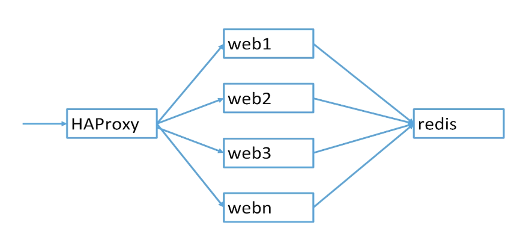
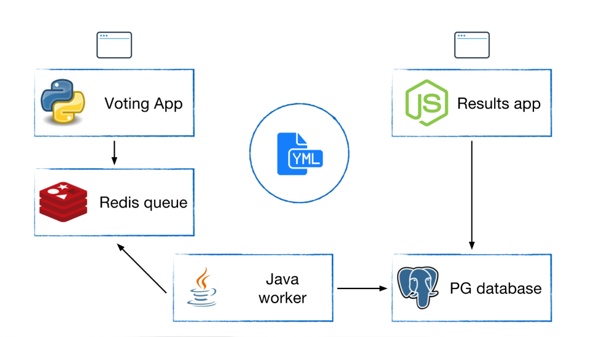

# 第8章 Docker Compose：单机编排

## 1、为什么诞生Docker Compose

### 1.1、多个容器的APP好难搞！

- 要从Dockerfile build image或者Dockerhub拉取image
- 要创建多个container
- 要管理这些container（启动停止删除）

所以，Docker Compose诞生了！

### 1.2、Docker Compose是什么

- Docker Compose是一个工具
- 这个工具可以通过一个yml文件定义多容器的docker应用
- 通过一条命令就可以根据yml文件的定义去创建或者管理这多个容器

## 2、docker-compose配置文件

- docker-compose.yml

    - Services
        - 一个Service代表一个container，这个container可以从dockerhub的image来创建，或者从本地的Dockerfile build出来的image来创建。
        - Service的启动类似docker run，我们可以给其指定network和volume，所以可以给service指定network和Volume的引用。
    - Networks
    - Volumes

## 3、安装docker-compose

1：下载

```bash
sudo curl -L "https://github.com/docker/compose/releases/download/1.29.2/docker-compose-$(uname -s)-$(uname -m)" -o /usr/local/bin/docker-compose
```

2：添加可执行权限

```bash
$ sudo chmod +x /usr/local/bin/docker-compose
# 创建软连，避免安装Harbor时报错：? Need to install docker-compose(1.18.0+) by yourself first and run this script again.
$ sudo ln -snf /usr/local/bin/docker-compose /usr/bin/docker-compose
```

3：配置alias

- 配置永久的alias

```bash
alias docker-compose="sudo /usr/local/bin/docker-compose"
```

- 使之生效

```bash
$ source .bashrc 
```

4：测试

```bash
$ docker-compose --version
docker-compose version 1.29.2, build 5becea4c
```

## 4、案例：docker-compose版wordpress

1：创建目录

```bash
$ mkdir -p dockerdata/compose/wordpress
$ cd dockerdata/compose/wordpress/
```

2：编写`docker-compose.yml`文件

```bash
[emon@emon wordpress]$ vim docker-compose.yml
```

```yaml
version: '3'

services:

  wordpress:
    image: wordpress
    ports:
      - 8080:80
    depends_on:
      - mysql
    environment:
      WORDPRESS_DB_HOST: mysql
      WORDPRESS_DB_PASSWORD: root
    networks:
      - my-bridge

  mysql:
    image: mysql:5.7
    environment:
      MYSQL_ROOT_PASSWORD: root
      MYSQL_DATABASE: wordpress
    volumes:
      - mysql-data:/var/lib/mysql
    networks:
      - my-bridge

volumes:
  mysql-data:

networks:
  my-bridge:
    driver: bridge
```

3：启动

```bash
[emon@emon wordpress]$ docker-compose -f docker-compose.yml up -d
# 或者
[emon@emon wordpress]$ docker-compose up -d
```

4：查看docker-compose启动状态

```bash
$ docker-compose -f /home/emon/dockerdata/compose/wordpress/docker-compose.yml ps
        Name                       Command               State          Ports        
-------------------------------------------------------------------------------------
wordpress_mysql_1       docker-entrypoint.sh mysqld      Up      3306/tcp, 33060/tcp 
wordpress_wordpress_1   docker-entrypoint.sh apach ...   Up      0.0.0.0:8080->80/tcp
```

5：停止并保留服务实例，然后查看状态（注意：docker ps已经无法查看到了）

```bash
$ docker-compose -f /home/emon/dockerdata/compose/wordpress/docker-compose.yml stop
Stopping wordpress_wordpress_1 ... done
Stopping wordpress_mysql_1     ... done
$ docker-compose -f /home/emon/dockerdata/compose/wordpress/docker-compose.yml ps
        Name                       Command               State    Ports
-----------------------------------------------------------------------
wordpress_mysql_1       docker-entrypoint.sh mysqld      Exit 0        
wordpress_wordpress_1   docker-entrypoint.sh apach ...   Exit 0 
```

6：启动

```bash
$ docker-compose -f /home/emon/dockerdata/compose/wordpress/docker-compose.yml start
Starting mysql     ... done
Starting wordpress ... done
```

7：停止并移除服务实例，然后查看状态（注意：docker ps已经无法查看到了）

```bash
$ docker-compose -f /home/emon/dockerdata/compose/wordpress/docker-compose.yml down
Stopping wordpress_wordpress_1 ... done
Stopping wordpress_mysql_1     ... done
Removing wordpress_wordpress_1 ... done
Removing wordpress_mysql_1     ... done
Removing network wordpress_my-bridge
$ docker-compose -f /home/emon/dockerdata/compose/wordpress/docker-compose.yml ps
Name   Command   State   Ports
------------------------------
```

8：其他命令

- 查看compose对应镜像

```bash
$ docker-compose -f /home/emon/dockerdata/compose/wordpress/docker-compose.yml images
      Container         Repository    Tag       Image Id       Size  
---------------------------------------------------------------------
wordpress_mysql_1       mysql        5.7      c20987f18b13   448.3 MB
wordpress_wordpress_1   wordpress    latest   c3c92cc3dcb1   616 MB
```

- 查看日志

```bash
$ docker-compose -f /home/emon/dockerdata/compose/wordpress/docker-compose.yml logs
```

- 进入某个服务

```bash
$ docker-compose -f /home/emon/dockerdata/compose/wordpress/docker-compose.yml exec mysql bash
$ docker-compose -f /home/emon/dockerdata/compose/wordpress/docker-compose.yml exec wordpress bash
```

## 5、案例：docker-compse版flask-redis

### 5.1、单个实例

1：创建目录

```bash
$ mkdir -p dockerdata/compose/flask-redis
$ cd dockerdata/compose/flask-redis/
```

2：编写内容

- 创建app.py

```bash
[emon@emon flask-redis]$ vim app.py
```

```python
from flask import Flask
from redis import Redis
import os
import socket

app = Flask(__name__)
redis = Redis(host=os.environ.get('REDIS_HOST', '127.0.0.1'), port=6379)


@app.route('/')
def hello():
    redis.incr('hits')
    return 'Hello Container World! I have been seen %s times and my hostname is %s.\n' % (redis.get('hits'),socket.gethostname())


if __name__ == "__main__":
    app.run(host="0.0.0.0", port=5000, debug=True)
```

3：创建Dockerfile

```bash
[emon@emon flask-redis]$ vim Dockerfile 
```

```bash
FROM python:2.7
LABEL maintainer="emon<emon@163.com>"
COPY . /app
WORKDIR /app
RUN pip install flask redis
EXPOSE 5000
CMD ["python", "app.py"]
```

4：编写`docker-compose.yml`文件

```bash
[emon@emon flask-redis]$ vim docker-compose.yml
```

```yaml
version: "3"

services:

  redis:
    image: redis

  web:
    build:
      context: .
      dockerfile: Dockerfile
    ports:
      - 8080:5000
    environment:
      REDIS_HOST: redis      
```

5：启动

```bash
[emon@emon flask-redis]$ docker-compose up
```


### 5.2、多个实例



- 修改`docker-compose.yml`

```bash
[emon@emon flask-redis]$ vim docker-compose.yml
```

```yaml
version: "3"

services:

  redis:
    image: redis

  web:
    build:
      context: .
      dockerfile: Dockerfile
#    ports:
#      - 8080:5000
    environment:
      REDIS_HOST: redis      
```

- 启动3个web实例

```bash
[emon@emon flask-redis]$ docker-compose up -d --scale web=3
# 命令行输出结果
Starting flask-redis_redis_1 ... done
Starting flask-redis_web_1   ... done
Creating flask-redis_web_2   ... done
Creating flask-redis_web_3   ... done
```

- 扩展到10个web实例

```bash
# 不需要停止，直接执行如下命令即可
[emon@emon flask-redis]$ docker-compose up -d --scale web=10
# 命令行输出结果
flask-redis_redis_1 is up-to-date
Creating flask-redis_web_4  ... done
Creating flask-redis_web_5  ... done
Creating flask-redis_web_6  ... done
Creating flask-redis_web_7  ... done
Creating flask-redis_web_8  ... done
Creating flask-redis_web_9  ... done
Creating flask-redis_web_10 ... done
```

### 5.3、HAProxy模式

1：创建目录

```bash
$ mkdir -p dockerdata/compose/lb-scale
$ cd dockerdata/compose/lb-scale/
```

2：编写内容

- 创建app.py

```bash
[emon@emon lb-scale]$ vim app.py
```

```python
from flask import Flask
from redis import Redis
import os
import socket

app = Flask(__name__)
redis = Redis(host=os.environ.get('REDIS_HOST', '127.0.0.1'), port=6379)


@app.route('/')
def hello():
    redis.incr('hits')
    return 'Hello Container World! I have been seen %s times and my hostname is %s.\n' % (redis.get('hits'),socket.gethostname())


if __name__ == "__main__":
    app.run(host="0.0.0.0", port=80, debug=True)
```

3：创建Dockerfile

```bash
[emon@emon lb-scale]$ vim Dockerfile
```

```bash
FROM python:2.7
LABEL maintainer="emon<emon@163.com>"
COPY . /app
WORKDIR /app
RUN pip install flask redis
EXPOSE 80
CMD [ "python", "app.py" ]
```

4：编写`docker-compose.yml`文件

```bash
[emon@emon lb-scale]$ vim docker-compose.yml
```

```yaml
version: "3"

services:

  redis:
    image: redis

  web:
    build:
      context: .
      dockerfile: Dockerfile
    environment:
      REDIS_HOST: redis

  lb:
    image: dockercloud/haproxy
    links:
      - web
    ports:
      - 8080:80
    volumes:
      - /var/run/docker.sock:/var/run/docker.sock
```

5：启动

```bash
[emon@emon lb-scale]$ docker-compose up -d --scale web=3
```

6：访问并测试负载均衡

```bash
[emon@emon lb-scale]$ curl 127.0.0.1:8080
Hello Container World! I have been seen 3 times and my hostname is 90ccc9fef955.
[emon@emon lb-scale]$ curl 127.0.0.1:8080
Hello Container World! I have been seen 4 times and my hostname is 7f0dfd6e4da5.
[emon@emon lb-scale]$ curl 127.0.0.1:8080
Hello Container World! I have been seen 5 times and my hostname is 357f9f38876b.
[emon@emon lb-scale]$ curl 127.0.0.1:8080
Hello Container World! I have been seen 6 times and my hostname is 90ccc9fef955.

[emon@emon lb-scale]$ for i in `seq 5`; do curl 127.0.0.1:8080; done
Hello Container World! I have been seen 7 times and my hostname is 7f0dfd6e4da5.
Hello Container World! I have been seen 8 times and my hostname is 357f9f38876b.
Hello Container World! I have been seen 9 times and my hostname is 90ccc9fef955.
Hello Container World! I have been seen 10 times and my hostname is 7f0dfd6e4da5.
Hello Container World! I have been seen 11 times and my hostname is 357f9f38876b.
```


## 6：案例：复杂Docker Compose演示



