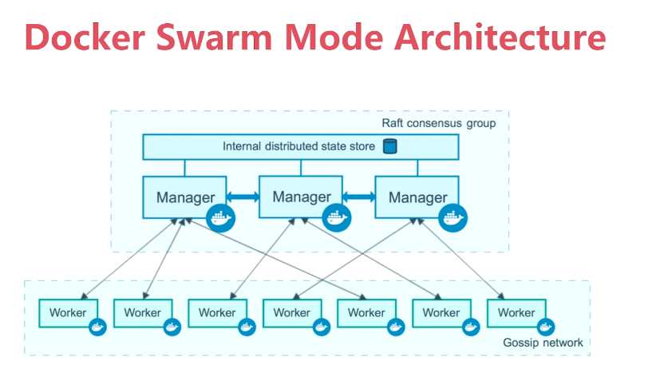
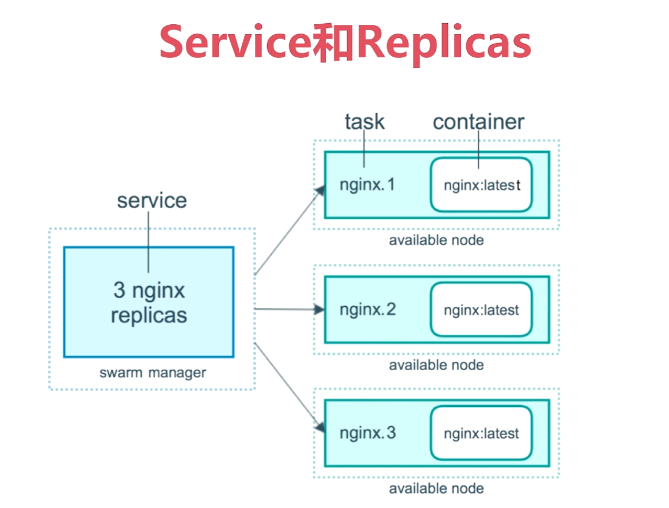

# 第9章 容器编排Swarm：多机编排

## 9.1、使用Docker的问题

- 怎么去管理这么多容器？

- 怎么能够方便的横向扩展？
- 如果容器down了，怎么能自动恢复？
- 如何去更新容器而不影响业务？
- 如何去监控追踪这些容器？
- 怎么去调度容器的创建？
- 保护隐私数据？


## 9.2、Docker Swarm Mode Architecture



## 9.3、Service和Replicas




## 9.3、创建一个三节点Swarm

- emon：初始化swarm

```bash
# 可以使用IP地址或者网络interface
$ docker swarm init --advertise-addr=10.0.0.116
# 命令行输出结果
Swarm initialized: current node (p4p7wgokuibrd13f7g1aydfxi) is now a manager.

To add a worker to this swarm, run the following command:

    docker swarm join --token SWMTKN-1-3jk4rzfw8491m0zf9djo8n7c35ncl9u3b1byxavhq1ms81g083-9k6i7t40cffw59gtty6ad6yl4 10.0.0.116:2377

To add a manager to this swarm, run 'docker swarm join-token manager' and follow the instructions.
```

- emon2：加入worker

```bash
[emon@emon2 ~]$ docker swarm join --token SWMTKN-1-3jk4rzfw8491m0zf9djo8n7c35ncl9u3b1byxavhq1ms81g083-9k6i7t40cffw59gtty6ad6yl4 10.0.0.116:2377
# 命令行输出结果
This node joined a swarm as a worker.
```

- emon3：加入worker

```bash
[emon@emon3 ~]$ docker swarm join --token SWMTKN-1-3jk4rzfw8491m0zf9djo8n7c35ncl9u3b1byxavhq1ms81g083-9k6i7t40cffw59gtty6ad6yl4 10.0.0.116:2377
# mlh输出结果
This node joined a swarm as a worker.
```

- emon：在swarm的manager节点上查看swarm节点

```bash
# 查看swarm的节点信息
$ docker node ls
ID                            HOSTNAME            STATUS              AVAILABILITY        MANAGER STATUS      ENGINE VERSION
p4p7wgokuibrd13f7g1aydfxi *   emon                Ready               Active              Leader              18.06.3-ce
jn5d90oue9zmwq8l9csa2ihpc     emon2               Ready               Active                                  18.06.3-ce
# 查看网络列表，注意产生了docker_gwbridge和ingress两个命名空间
$ docker network ls
NETWORK ID          NAME                DRIVER              SCOPE
68b3c334e418        bridge              bridge              local
f99f3ea28b9c        docker_gwbridge     bridge              local
4913d65f0331        host                host                local
zu0on261vwvj        ingress             overlay             swarm
5dddd8fbaae8        none                null                local
```

- 解散swarm集群

```bash
# 解除emon3节点
[emon@emon3 ~]$ docker swarm leave
Node left the swarm.
# 解除emon2节点
[emon@emon2 ~]$ docker swarm leave
Node left the swarm.
# 查看目前情况
$ docker node ls
ID                            HOSTNAME            STATUS              AVAILABILITY        MANAGER STATUS      ENGINE VERSION
p4p7wgokuibrd13f7g1aydfxi *   emon                Ready               Active              Leader              18.06.3-ce
jn5d90oue9zmwq8l9csa2ihpc     emon2               Down                Active                                  18.06.3-ce
r0xio3dgdcksegy5s7f8jaxjz     emon3               Down                Active                                  18.06.3-ce
# 解散emon管理节点，解散集群
$ docker swarm leave --force
Node left the swarm.
```


## 9.4、Service的创建维护和水平扩展

- 创建一个service

```bash
$ docker service create --name demo busybox sh -c "while true; do sleep 3600; done"
```

- 查看service

```bash
# 查看service列表
$ docker service ls
# 查看service详情，其中demo表示serviceId或serviceName
$ docker service ps demo
```

- 查看logs

```bash
$ docker service logs demo
```

- 水平扩展

```bash
# 可以确保5个实例
$ docker service scale demo=5
```

- 删除service

```bash
# 其中demo表示serviceId或serviceName
$ docker service rm demo
```

## 9.5、swarm版wordpress

- 创建overlay

```bash
# wordpress服务需要依赖mysql服务，且是跨机器的，先创建一个overlay的网络命名空间
$ docker network create -d overlay demo
```

- 创建MySQL的Service

```bash
$ docker service create --name mysql --env MYSQL_ROOT_PASSWORD=root --env MYSQL_DATABASE=wordpress --network demo --mount type=volume,source=mysql-data,destination=/var/lib/mysql mysql
```

- 创建WordPress的Service

```bash
$ docker service create --name wordpress -p 80:80 --env WORDPRESS_DB_USER=root --env WORDPRESS_DB_PASSWORD=root --env WORDPRESS_DB_HOST=mysql --network demo wordpress
```

- 访问

访问swarm的任一节点即可访问！

- 查看网络

```bash
$ docker network ls
# 命令行输出
NETWORK ID          NAME                DRIVER              SCOPE
68b3c334e418        bridge              bridge              local
61p94kyce782        demo                overlay             swarm
f99f3ea28b9c        docker_gwbridge     bridge              local
4913d65f0331        host                host                local
zu0on261vwvj        ingress             overlay             swarm
5dddd8fbaae8        none                null                local
```


## 9.6、集群服务间通信之Routing Mesh


- 创建名为whoami的Service

```bash
$ docker service create --name whoami -p 8000:8000 --network demo -d jwilder/whoami
# 发现在emon机器
$ docker service ps whoami
ID                  NAME                IMAGE                   NODE                DESIRED STATE       CURRENT STATE           ERROR               PORTS
wjm68kk7gdrk        whoami.1            jwilder/whoami:latest   emon                Running             Running 6 minutes ago                       
```

- 创建名为client的Service

```bash
$ docker service create --name client -d --network demo busybox sh -c "while true; do sleep 3600; done"
# 发现在emon2机器
$ docker service ps client
ID                  NAME                IMAGE               NODE                DESIRED STATE       CURRENT STATE           ERROR               PORTS
pazc25bkf58y        client.1            busybox:latest      emon2               Running             Running 3 minutes ago
```

- 在client去ping一下whoami发现可以通

```bash
[emon@emon2 ~]$ docker exec -it a671f0eb5e4c sh
/ # ping whoami
PING whoami (10.0.0.19): 56 data bytes
64 bytes from 10.0.0.19: seq=0 ttl=64 time=0.098 ms
64 bytes from 10.0.0.19: seq=1 ttl=64 time=0.064 ms
```

- 增加whoami到2个实例

```bash
$ docker service scale whoami=2
```