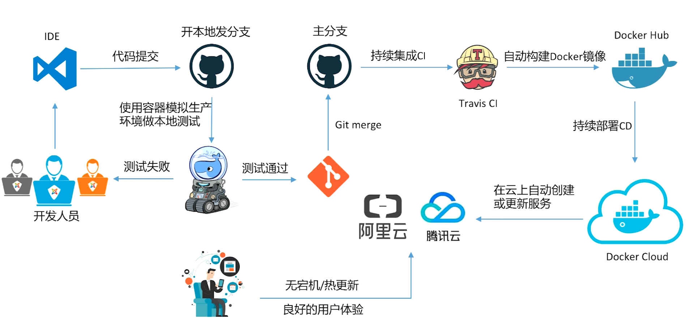

# 第99章 其他

- 查看docker占用空间

```bash
sudo du -sh /var/lib/docker
```

- 清理docker的`/var/lib/docker`目录

如果碰到问题：no space left on device

```bash
docker system prune -a -f
```

- 清理docker的volume

```bash
# 清理单个
docker volume rm < VOLUME NAME >
# 或者清理很多：如果volume不再被容器占用，才会被清理
docker volume prune
```

- 查看docker磁盘使用情况

```bash
$ docker system df
# 命令行输出结果
TYPE                TOTAL               ACTIVE              SIZE                RECLAIMABLE
Images              4                   4                   1.852GB             0B (0%)
Containers          4                   1                   149.2MB             149.2MB (99%)
Local Volumes       4                   1                   2.584GB             758MB (29%)
Build Cache         0                   0                   0B                  0B
```

- 清理

```bash
# 清理docker无用数据：会清理停止的容器，但不会清理镜像
$ docker system prune
# 清理docker无用数据：会清理停止的容器，也会清理镜像
$ docker system prune -a
```

## 99.1、查看容器的资源使用情况统计

- 查看所有运行中的容器

```bash
$ docker stats 
```

- 查看某些个运行中的容器

```bash
$ docker stats nginx
```


