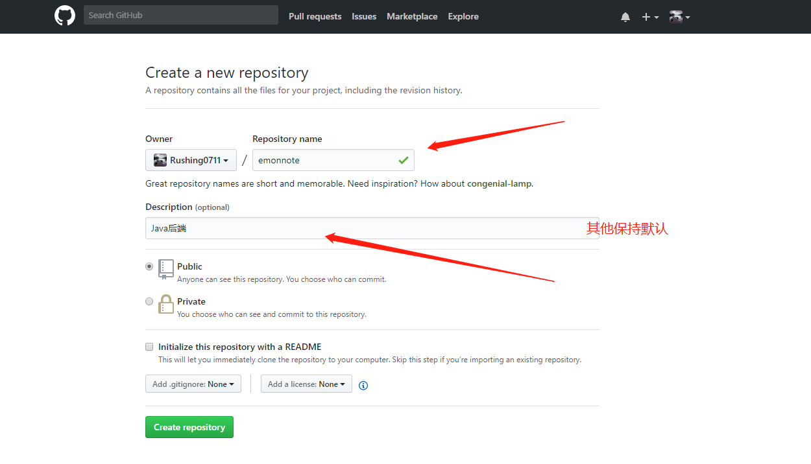
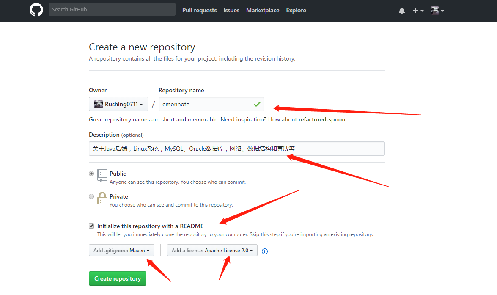

# 第3章 Git仓库

- Git仓库分类
    - 裸仓库
        - 用来搭建Git私有服务器时用到
    - 开发仓库
        - 本地仓库
            - 在用户本地创建的仓库
        - 远程仓库
            - 比如在GitHub上的仓库

## 3.1 如果先创建了本地仓库

1. 创建本地仓库

   关键命令： `git init`

   ```bash
   $ cd /usr/local/src/git-repository/
   [emon@emon git-repository]$ mkdir emonnote
   [emon@emon git-repository]$ cd emonnote/
   [emon@emon emonnote]$ git init
   Initialized empty Git repository in /usr/local/src/git-repository/emonnote/.git/
   ```

2. 创建远程仓库

   以GitHub为例，创建如图所示：

   

   获得仓库地址：`git@github.com:Rushing0711/emonnote.git`

3. 推送本地仓库到远程仓库

   ```bash
   [emon@emon emonnote]$ git remote add origin git@github.com:Rushing0711/emonnote.git
   # 实际使用中，本地创建了仓库，远程也创建了仓库，可能内容不一致，先pull下来，再push上去
   [emon@emon emonnote]$ git pull origin master --allow-unrelated-histories
   [emon@emon emonnote]$ git push -u origin master
   ```

- 命令解释：
    - `git push -u origin master`： -u表示--set-upstream，用于指定上游（远程仓库）。

## 3.2 如果先创建了远程仓库

1. 创建远程仓库

   以GitHub为例，创建如图所示：

   

   获得仓库地址：`git@github.com:Rushing0711/emonnote.git`

2. 克隆远程仓库到本地

   ```bash
   $ cd /usr/local/src/git-repository/
   [emon@emon git-repository]$ git clone git@github.com:Rushing0711/emonnote.git
   Cloning into 'emonnote'...
   remote: Counting objects: 5, done.
   remote: Compressing objects: 100% (5/5), done.
   remote: Total 5 (delta 0), reused 0 (delta 0), pack-reused 0
   Receiving objects: 100% (5/5), 4.78 KiB | 4.78 MiB/s, done.
   ```


## 3.3 如何更换仓库地址

- 设置远程仓库地址

```bash
$ git remote set-url <远程仓库名称> <新URL>
```

::: info

- 远程仓库名称：默认为 `origin` （首次克隆仓库时的默认名称），也可以是其他自定义名称。
- 新URL：新的远程仓库地址（支持HTTPS、SSH等协议）。

:::


- 查看当前关联的远程仓库URL

```bash
$ git remote -v
```

- 修改 origin 的 URL （例如修复错误或更换协议）

```bash
$ git remote set-url origin https://github.com/user/repo.git
```

- 切换到SSH

```bash
$ git remote set-url origin git@github.com:user/repo.git
```

- 修改非默认远程仓库的URL

```bash
$ git remote set-url <upstream> https://github.com/other/repo.git
```

- 强制覆盖远程仓库URL

如果当前URL配置错误，直接使用 `set-url` 覆盖即可，无需额外参数。


## 3.4 如何一个项目配置2个远程地址？

一个项目设置两个git地址，并最终实现一次性同时推送到两个git地址上。

前提：

1、假设你现在，在github上新创建了一个git地址A（里面已经有项目内容）

```bash
$ git@github.com:EmonCodingBackEnd/springcloud-config-repo.git
```

2、假设你在码云上面也创建了一个git地址B（可能是一个新建的空白项目地址）

```bash
$ git@gitee.com:EmonCodingBackEnd/springcloud-config-repo.git
```

现在想实现我在git地址A项目中，提交代码的同时，也提交到git地址B。

- 方法1：（需要push两次，不符合目标，但有一个优点是可以pull两次）

步骤1：在git地址A项目中添加另一个git地址B项目的远程地址

```bash
# origin2 可以自定义
$ git remote add origin2 git@gitee.com:EmonCodingBackEnd/springcloud-config-repo.git
```

> 添加之前查看：
>
> ```bash
> $ cat .git/config
> [core]
>      repositoryformatversion = 0
>      filemode = false
>      bare = false
>      logallrefupdates = true
>      symlinks = false
>      ignorecase = true
> [remote "origin"]
>      url = git@github.com:EmonCodingBackEnd/springcloud-config-repo.git
>      fetch = +refs/heads/*:refs/remotes/origin/*
> [branch "master"]
>      remote = origin
>      merge = refs/heads/master
> [branch "develop"]
>      remote = origin
>      merge = refs/heads/develop
> ```
>
> 添加之后查看：
>
> ```bash
> $ cat .git/config
> [core]
>      repositoryformatversion = 0
>      filemode = false
>      bare = false
>      logallrefupdates = true
>      symlinks = false
>      ignorecase = true
> [remote "origin"]
>      url = git@github.com:EmonCodingBackEnd/springcloud-config-repo.git
>      fetch = +refs/heads/*:refs/remotes/origin/*
> [branch "master"]
>      remote = origin
>      merge = refs/heads/master
> [branch "develop"]
>      remote = origin
>      merge = refs/heads/develop
> [remote "origin2"]
>      url = git@gitee.com:EmonCodingBackEnd/springcloud-config-repo.git
>      fetch = +refs/heads/*:refs/remotes/origin2/*
> ```

步骤2：先拉取git地址B项目上的数据

```bash
# --allow-unrelated-histories是为了解决冲突
$ git pull origin2 develop --allow-unrelated-histories
```

步骤3:在git地址A项目中把项目内容同步到git地址B项目中。

```bash
$ git push origin2 develop
```

此时，我们基本实现了可以把一个项目可以提交到两个git地址了，但是每次提交内容都需要进行如下两次提交，才能实现把一个项目同时提交到两个git地址。

```bash
$ git push origin develop
$ git push origin2 develop
```


- 方法2：如何提交一次，同步两个项目？

注意：删除上面添加的git地址B项目的远程地址。

```bash
# 查看
$ git remote -v
origin  git@github.com:EmonCodingBackEnd/springcloud-config-repo.git (fetch)
origin  git@github.com:EmonCodingBackEnd/springcloud-config-repo.git (push)
origin2 git@gitee.com:EmonCodingBackEnd/springcloud-config-repo.git (fetch)
origin2 git@gitee.com:EmonCodingBackEnd/springcloud-config-repo.git (push)

# 删除
$ git remote rm origin2

# 再次查看
$ git remote -v
origin  git@github.com:EmonCodingBackEnd/springcloud-config-repo.git (fetch)
origin  git@github.com:EmonCodingBackEnd/springcloud-config-repo.git (push)
```

给origin增加一个可以push的地址：

```bash
$ git remote set-url --add origin git@gitee.com:EmonCodingBackEnd/springcloud-config-repo.git

$ git remote -v
origin  git@github.com:EmonCodingBackEnd/springcloud-config-repo.git (fetch)
origin  git@github.com:EmonCodingBackEnd/springcloud-config-repo.git (push)
origin  git@gitee.com:EmonCodingBackEnd/springcloud-config-repo.git (push)
```

OK！完成！

```bash
$ git push origin develop
```

问？如何删除路径？

```bash
$ git remote set-url --delete origin git@gitee.com:EmonCodingBackEnd/springcloud-config-repo.git
```

