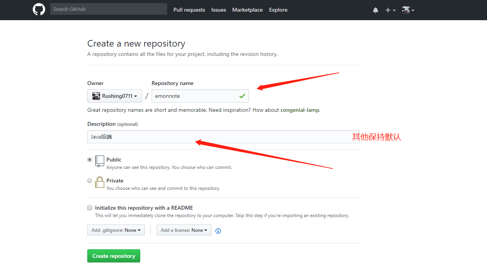
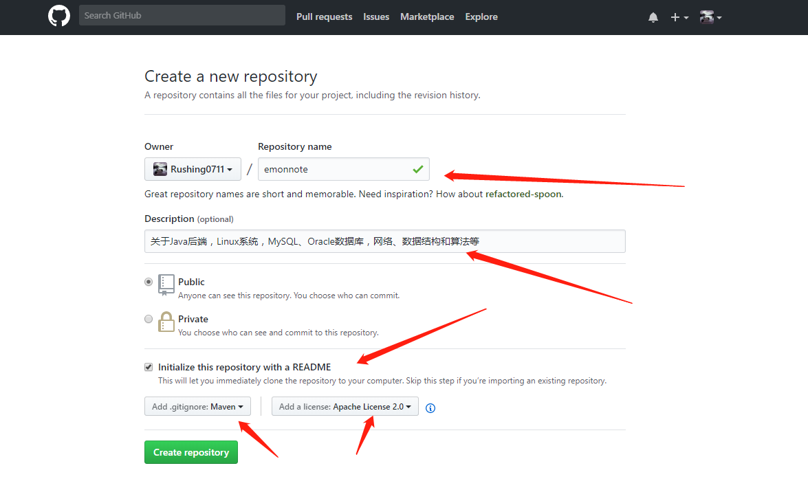

# 第3章 Git仓库

- Git仓库分类
    - 裸仓库
        - 用来搭建Git私有服务器时用到
    - 开发仓库
        - 本地仓库
            - 在用户本地创建的仓库
        - 远程仓库
            - 比如在GitHub上的仓库

## 3.1 如果先创建了本地仓库

1. 创建本地仓库

   关键命令： `git init`

   ```bash
   $ cd /usr/local/src/git-repository/
   [emon@emon git-repository]$ mkdir emonnote
   [emon@emon git-repository]$ cd emonnote/
   [emon@emon emonnote]$ git init
   Initialized empty Git repository in /usr/local/src/git-repository/emonnote/.git/
   ```

2. 创建远程仓库

   以GitHub为例，创建如图所示：

   

   获得仓库地址：`git@github.com:Rushing0711/emonnote.git`

3. 推送本地仓库到远程仓库

   ```bash
   [emon@emon emonnote]$ git remote add origin git@github.com:Rushing0711/emonnote.git
   # 实际使用中，本地创建了仓库，远程也创建了仓库，可能内容不一致，先pull下来，再push上去
   [emon@emon emonnote]$ git pull origin master --allow-unrelated-histories
   [emon@emon emonnote]$ git push -u origin master
   ```

- 命令解释：
    - `git push -u origin master`： -u表示--set-upstream，用于指定上游（远程仓库）。

## 3.2 如果先创建了远程仓库

1. 创建远程仓库

   以GitHub为例，创建如图所示：

   

   获得仓库地址：`git@github.com:Rushing0711/emonnote.git`

2. 克隆远程仓库到本地

   ```bash
   $ cd /usr/local/src/git-repository/
   [emon@emon git-repository]$ git clone git@github.com:Rushing0711/emonnote.git
   Cloning into 'emonnote'...
   remote: Counting objects: 5, done.
   remote: Compressing objects: 100% (5/5), done.
   remote: Total 5 (delta 0), reused 0 (delta 0), pack-reused 0
   Receiving objects: 100% (5/5), 4.78 KiB | 4.78 MiB/s, done.
   ```

   