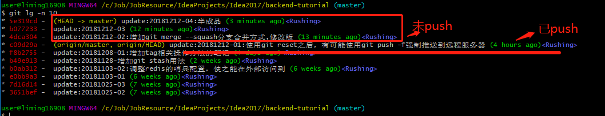
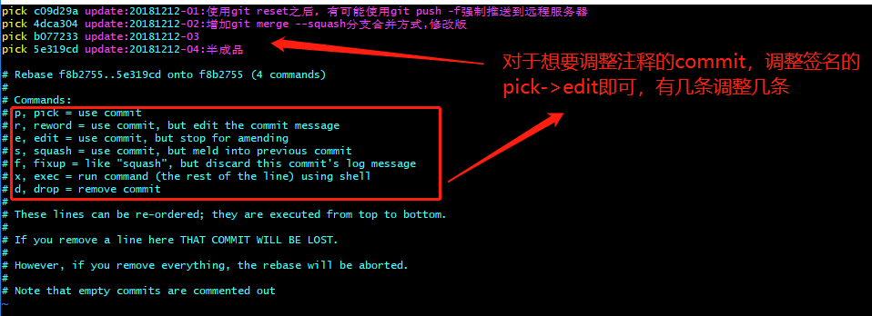
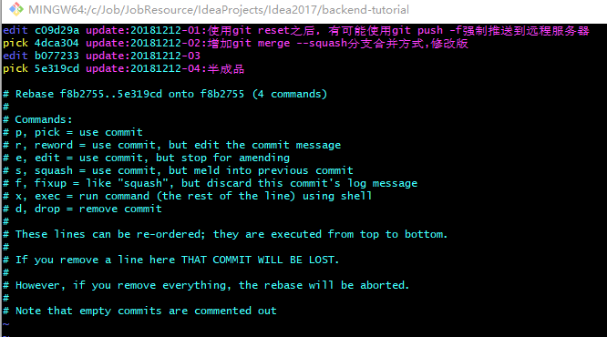
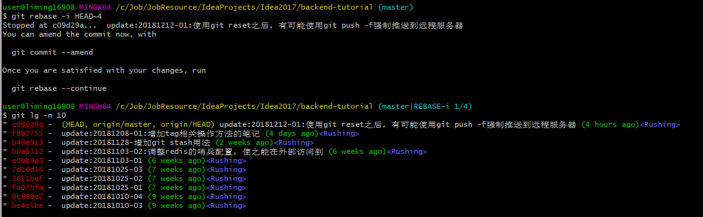
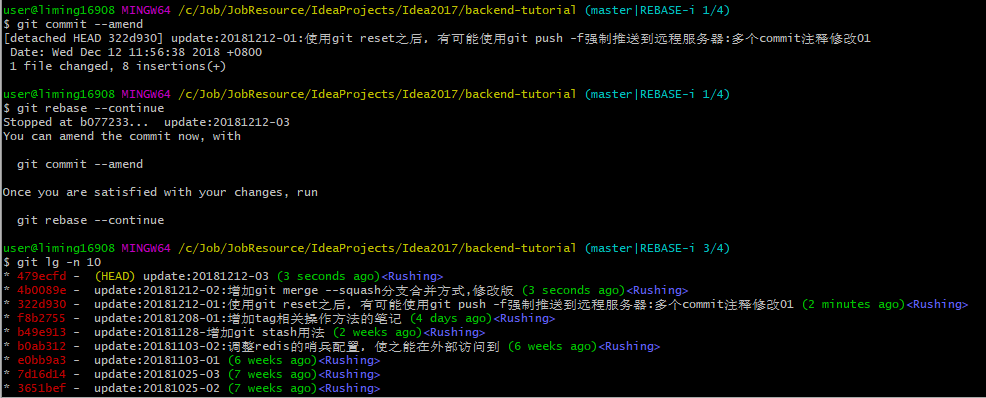

# 第4章 Git文件管理

## 4.1 添加和提交文件

- 添加指定文件

```shell
git add <filename>
```

- 添加指定目录所有文件

```shell
git add <directory>
```

- 添加当前目录所有文件

```shell
git add .
# 或者
git add *
```

- 提交新增文件

```shell
git add <filename>
git commit -m "<message>"
```

- 提交已经存在，但是修改过的文件

```shell
git commit -am "<message>"
```

- 提交远程仓库

```shell
git push <远程主机名> <本地主机名>:<远程分支名>
```

###  4.1.1 修改上一条commit注释（未push到远程)

- 修改上一条提交信息，未push的commit

```bash
# 该命令打开提交信息编辑窗口，你可以修改提交信息；--no-edit标记会修复提交但不会打开提交信息编辑窗口。
git commit --amend [--no-edit]
```

### 4.1.2 修改上X条commit注释（未push到远程)

- 第一步，X表示最近X条commit日志



```bash
git rebase -i HEAD~X
```





可以很明显的看到，`pick`了最近4次的commit日志，挑选其中的2次commit日志作为调整目标。

**`pick`窗口关闭后，进入rebase模式，显示1/4，表示命令执行时选择了4次commit注释，目前可以修改最早期的一个**



- 第二步，修改当前状态下上一条commit注释

```bash
# 调出注释修改窗口，修改注释
git commit --amend
# 调用continue编辑下一个edit
git rebase --continue
```



**可以看到，`git commit --amend`命令执行完毕后，当前状态下上一条commit已被修改；`git rebase --continue`命令执行完毕后，显示3/4；这是由于我们选择了4条commit中的2条进行edit，修改一条后，跳过中间的pick，到最近的edit。**

- 继续执行第二步的操作，直至完成所有注释的调整，并在最后一次`git rebase --continue`退出。

【备注】细心点可以看到我选择了已经push到远程的commit进行了注释调整，这样会导致修改注释后无法push到远程。

**所以不建议对已经push到远程的commit进行修改。非要修改，需要`git push -f <remote> <branchname>`强制push，但非常不推荐。**

## 4.2 合并更新

- 从远程仓库拉取

```shell
git pull <远程主机> <远程分支>:<本地分支>
```

- 从远端拉取最新代码，并合并到分支中

```shell
# 取回origin主机的next分支，与本地的master分支合并
git pull origin next:master
```

- 如果远程分支是与当前分支合并，则冒号后面的部分可以省略

```shell
git pull origin next
```

- `pull`的含义是先拉取更新，再与本地分支进行合并，是一个自动的过程，也可以手动实现

```shell
# 拉取更新
git fetch origin
# 合并更新
git merge origin/next
```

- 如果本地分支与远程分支建立了一种追踪关系，比如`git clone`时，所有本地分支默认与远程主机的同名分支建立了追踪关系，也就是说，本地的`master`分支自动`追踪`远程分支`origin/master`分支。此时，可以省略远程分支名

```shell
git pull origin
```


## 4.3 查看状态

### 4.3.1 `git status`

- 查看当前分支的状态

```shell
git status
```

- 以简单形式，查看当前分支的状态

```shell
git status -s
```

- 一个简单的查看忽略文件的方法

```shell
git status --ignored
```


## 4.4 文件还原与暂存

对于已经修改的文件，想要放弃当前的修改，还原为之前的状态：

```shell
git checkout <filename>
```

而如果不是想放弃当前的修改，只是想暂存起来，去处理一些比较紧急的事情，之后还是需要继续操作，那就需要stash命令：

- 暂存

```shell
# 保存当前修改，回退到修改之前，此时git diff HEAD查看工作区与暂存区以及最新提交的比较结果无差别
# save -u message，暂存未被.gitignore忽略的文件，包含修改过的、未被追踪【推荐】
# save -a message，暂存所有文件，包含修改过的、未被追踪的以及.gitignore忽略掉的【强烈不推荐】
git stash [save [-u|-a] [<message>]]
# 如果是 save -a message，在恢复暂存会出现 Could not restore untracked files from stash entry 的错误，此时如何解决？
# 第一步： git clean -fdx 清理掉本地 .gitignore 忽略掉的文件
# 第二部：git stash pop stash@{id} 恢复即可
```

- 显示已暂存列表

```shell
git stash list
stash@{0}: WIP on develop: e218dc5 tutorial update 20180415-10
```

- 恢复暂存区

```shell
# 执行后，会从stash list删除
git stash pop stash@{id}
# 执行后，不会从stash list删除
git stash apply stash@{id}
```

- 删除暂存区

```shell
# 如果不加stash编号，默认删除最新的编号为0的那个暂存
git stash drop <stash@{id}>
```

- 清除暂存区

```shell
# 清除所有的stash
git stash clear
```

- 查看暂存的文件列表

```bash
git stash show [<stash@{id}>]
```

- 查看暂存的文件内容

```bash
git stash show -p [<stash@{id}>]
```
