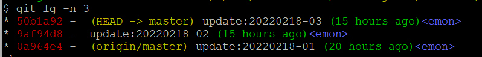
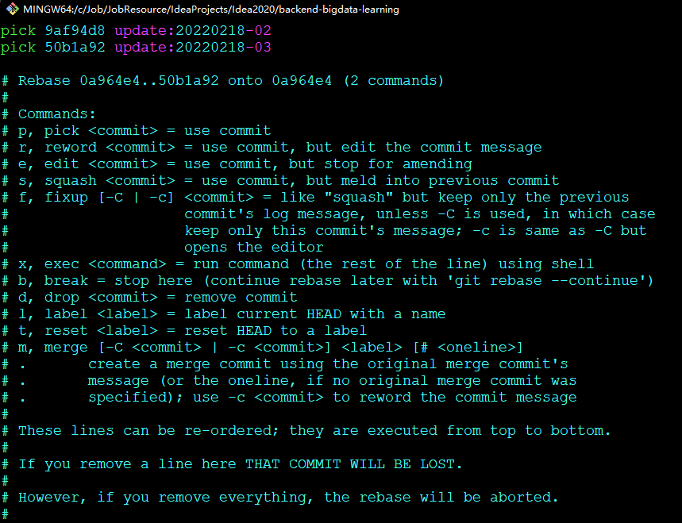
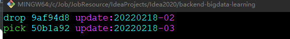
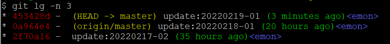

# 第7章 其他

## 7.0、基本命令补充

- 查看git版本

```shell
$ git --version
# 或者
$ git -v
```

- 增加配置项

```shell
$ git config core.hooksPath .mygithooks
```

- 删除配置项

```shell
$ git config --unset core.hooksPath
```


## 7.1 Git命令帮助文档的使用

- 为了方便起见，每个git子命令的文档都可以通过使用如下方式查看：
    - `man git subcommand` 【推荐】
    - `git help subcommand` 【推荐】
    - `git --help subcommand`
    - `git subcommand --help`


## 7.2 Git的配置文件

- Git支持不同层次的配置文件，按照优先级递减的顺序
    - `.git/config`：版本库特定的配置，可以通过--local选项修改，是默认选项。这些设置拥有最高优先级。
        - `--file <filename>`，该选项默认替换`--local`，可以通过`--system`和`--global`替换，来指定各级别配置文件的位置。
    - `/.gitconfig`：用户特定的配置，可以用--global选项修改。
        - Windows下是`%USERPROFILE%/.gitconfig`文件，Linux下是用户宿主目录下`$HOME/.gitconfig`文件。
    - `/etc/gitconfig`：这是系统范围的配置，如果你有它的UNIX文件写权限，你就可以用`--system`选项修改它了。
        - 根据实际的安装情况，这个系统设置文件可能在其他位置（也许在`/usr/local/etc/gitconfig`），也可能完全不存在。


## 7.3 常规配置

- 设置姓名和邮箱地址

```shell
git config --global user.name "[username]"
git config --global user.email "[useremail]"
```

- 设置禁止CRLF的自动转换

windows中的换行符为CRLF，而在linux下的换行符为LF，所以在执行add.时出现提示：

**warning: LF will be replaced by CRLF in .editorconfig.**

```shell
git config --global core.autocrlf false // 禁用自动转换
```

- 提高命令输出的可读性

```shell
git config --global color.ui auto
```

- 设置日志图示以及单行显示

```shell
git config --global alias.show-graph 'log --graph --abbrev-commit --pretty=oneline'
# 推荐如下形式
git config --global alias.show-graph 'log --graph --oneline --decorate --all'
# 又是一个棒棒的配置
git config --global alias.lg "log --color --graph --pretty=format:'%Cred%h%Creset - %C(yellow)%d%Creset %s %Cgreen(%cr)%C(bold blue)<%an>%Creset' --abbrev-commit"
# 查看最后一次提交
git config --global alias.last "log -1"
```

- 查看配置

```shell
git config --list
```


## 7.4 日志查看

- 常规的提交日志

```shell
git log
```

- 只显示提交信息的第一行

```shell
git log --pretty=short
```

- 只显示指定目录、文件的日志

```shell
git log README.md
```

- 显示文件的改动

```shell
git log -p README.md
```

- 查看最后一次提交

```shell
git log -n 1
```

- 查看最近一次提交所有更改过的文件

```shell
git log -n 1 --stat
```

- 查看最近一次提交所有更改的细节

```shell
git log -n 1 -p
```


## 7.5 查看文件区别

- 未加入暂存区，查看工作区与暂存区的差别

```shell
git diff [文件]
```

- 加入暂存区后，查看工作区与最新提交的差别

```shell
# 该命令还可以查看工作区与暂存区的差别，包含git diff的结果
git diff HEAD
```


## 7.6 版本回退

### 7.6.1、尚未暂存(git add)的文件回退

- 尚未使用`git add`添加到仓库的文件，想要使得他回退到编辑之前

```bash
git checkout -- <file name>
```

- 如何只回退某一个文件到指定`<commit id>`

```shell
git checkout <commit id> <absolute_file_path>
```

- 还可以放弃改变

```bash
git restore <file name>
```

### 7.6.2、已经暂存尚未commit的文件回退

- 已经使用`git add`暂存后的文件回退

```bash
git restore --staged <file name>
```

### 7.6.3、已经commit的文件回退

`git reset`是版本回退的基本命令，根据后面参数的不同，回退的形式也不同。

- 已经使用`git add`添加到仓库的文件，想要使得他回退到`git add`之前

```shell
# HEAD表示为当前的版本
git reset HEAD <file name>
```

- 对于每次的log记录，想回退到某一个log记录的时候，并且保留当前所做的修改

```shell
git reset <commit id>
```

- 对于已经`git commit`的提交，对于每次的log记录，想回退到某一个log记录的时候，并且**放弃**之后的修改

```
git reset --hard <commit id>
```

- 对于已经`git commit`的提交，对于每次的log记录，想要回退到某一个log记录的时候，并且**保留**之后的修改

```bash
git reset --soft <commit id>
```

- 回退到上一个版本

```shell
git reset --hard HEAD^
```

- 回退到之前第n个版本

```shell
# n表示之前第n个版本
git reset --hard HEAD~n
```

- 回退后放弃回退

如果在回退以后又想再回到之前的版本，`git reflog`可以查看所有分支的所有操作记录（包括commit和reset的操作），包括一家被删除的commit记录，`git log`则无法查看到已经删除了的commit记录。

```shell
# 查看之前的<commit id>
git reflog
# 放弃回退
git reset <commit id>
```

- 回退后强制提交到远程分支

```bash
git push -f <remote> <branchname>
```

- 回退后对其他用户造成的后果如何处理？

回退后，会导致其他在回退之前已经更新代码的用户，出现如下错误：

```bash
git status
Git Your branch is ahead of 'origin/master' by X commits
```

这时，如果采用命令`git push origin`会导致版本管理者的回退无效，所以不应该这样做。

应该如下，回退本地代码：

```bash
git reset --hard origin/master
```

### 7.6.4、git rebase -i commitId 方式删除中间某个commit

背景：假如有分支A（正常提交）->B(错误提交）->C（正常提交），现在想保留C删除B如何处理？

- 查看提交日志



注意：这里的git lg是自定义命令，可以使用git log替换。

- git rebase回退到A

```bash
# 回退到首次错误提交之前的commitId，会打开vim新窗口如下图
git rebase -i A
```



- 修改错误提交commitId的命令类型

**修改pick->drop**之后保存退出vim。



- 进入rebase编辑窗口，调整代码，重新commit
- 使用git rebase --continue进入下一个rebase进程，如果已经是最后一个了，会自动退出。
- 完成删除错误提交的任务，结果如下图：



可以看到，`update:20220218-02`已被删除，同时`update:20220218-03`受影响，重新提交了`update:20220219-01`解决了该影响。

**特别注意**：整个修复过程很凶险，如果对代码提交不熟悉，会导致代码丢失。而且该方法是一种commit之后的后悔药，在使用之后如果处理不当，会二次后悔，必须要慎之又慎的处理`git rebase -continue`的过程。

## 7.7 设置忽略文件

Git管理的项目，可以在仓库中添加`.gitignore`文件，配置需要忽略管理的文件或者目录。


## 7.8 定位问题

### 7.8.1 定位负责人

- 查看文件的每个部分是谁修改的

```shell
git blame <filename>
```


### 7.8.2 定位错误日志

Git提供了二分查找的概念，来帮助确定一个有关Bug的版本。

#### 使用演示：

- 第一步：启用二分查找

```shell
git bisect start
```

- 第二步：标记一个好的版本

```shell
git bisect good <tag|commit id>
```

- 第三步：标记一个坏的版本

```shell
# 注意，这里标记Bug版本后，后面会提示还有多少版本需要测试，大概需要多少步骤；并且还会切换到二分位置
git bisect bad <tag|commit id>
Bisecting: 7 revisions left to test after this (roughly 3 steps)
[67ec0234ab82b6821efef2d32b1091f6d560cb08] fix conflict
```

至此，Git已经自动为我们切换到下一个二分位置，并显示大概需要多少步骤可以定位到错误提交。

- 第四步：执行测试，查看当前自动切换到的二分位置是否有Bug

```shell
# do some test or check
```

- 第五步：如果有Bug，标记bad，否则，标记good；继续二分定位

```shell
# 这里不需要指定<commit id>，只需要第二步和第三步指定一个good位置和一个bad位置即可
git bisect <good|bad>
```

- 第六步：重复第四步和第五步的操作，直到找到Bug版本位置

#### 小技巧：

- 如果对版本标记错了，把good写成了bad或者相反，需要重新开始二分定位

```shell
# 如果不带<commit id>，会退出bisect，并切换到git bisect start之前的位置；
# 否则，会退出bisect，并切换到<commit id>指定的位置。
git bisect reset [<commit id>]
```

- 查看`git bisect`标记操作日志

```shell
git bisect log
```

## 7.9 git项目地址查询

```bash
git remote -v
```

## 7.10、git clone项目报错Filename too long

第一步：打开git bash

第二步：执行命令

```bash
git config --global core.longpaths true
```

## 7.11、拉取指定commit到一个新分支，会产生新commitId

```bash
# 拉取指定commit到当前分支，指定的commit可以是任何的其他分支
git cherry-pick <commit id>
```

## 7.12、Git 解决 error bad signature 0x00000000 错误

> 在 Git 运行时如果遇到强制中断的情形可能导致文件签名损坏，本文记录解决方案。

### 问题复现

- 当运行 git 指令时，如遇到蓝屏、断电、热拔内存条等突发的内存数据清除情况时可能会导致 git 中记录签名部分的数据错误
- 此时运行 `git  status` 指令会报错

```shell
error: bad signature 0x00000000
fatal: index file corrupt
```

- 如果不幸这个仓库中还有子模块(submodule)，那么子模块可能也会跟着报错

```shell
Failed to recurse into submodule path '../modules/controllers'
```

### 解决方案

- 因为断电导致的文件错误无法恢复，我们只能考虑 `拆掉重建` 的思路解决此类问题

#### 针对带子模块的仓库

-  如果错误信息中包含了子模块，此时子模块是可以进入的，并且一般情况下子模块的 git 可以正常运行（子模块损坏的情况我没有遇到过）
-  此时保存子模块工作状态，推到远程保护起来
-  返回大仓库目录，删除该子模块文件夹
-  如果删除后仍然有子模块报错，那么不断重复上述步骤

#### 无子模块 / 子模块工作正常

- 根仓库中 无子模块 或 子模块已经按照上述步骤操作过不再报错的情况下
- 删除 `.git/index` 文件
- 回到根仓库执行

```shell
git reset
```

- 此时 `git status` 应该可以正常运行，逐步恢复开发状态
- 恢复子模块

```shell
git submodule update --init --recursive
```

[参考资料](https://superuser.com/questions/837668/fatal-index-file-corrupt-keeps-repeating-in-git)

## 7.13、如何查看某个分支从哪个分支checkout -b出来的

```bash
git reflog --date=local | grep <branchName>
```

## 7.14、git显示中文文件名乱码

在默认设置下，中文文件名在工作区状态输出，中文名不能正确显示，而是显示未八进制的字符编码。

解决如下：

```shell
git config --global core.quotepath false
```

## 7.15 使用 git checkout 更新特定文件夹

如果你想从远程仓库拉取特定文件夹的最新更改：

```bash
$ git checkout origin/branch_name -- path/to/folder/
```

## 7.95、 什么是git lfs？

​	**Git LFS**（Git Large File Storage）是 Git 的一个扩展工具，用于高效地管理大文件。它通过将大文件存储在远程服务器上，而在本地仓库中仅保留文件的指针（pointer），从而解决 Git 本身对大文件支持不佳的问题。

1. **安装 Git LFS**：

    - 需要先安装 Git LFS 客户端。

    - 安装方法：

   ```bash
   # macOS (Homebrew)
   brew install git-lfs
   ```

    - 安装后初始化

   ```bash
   git lfs install
   ```

2. **跟踪大文件**：

    - 使用 `git lfs track` 命令指定需要跟踪的大文件类型。
    - 示例：

   ```bash
   git lfs track "*.psd"  # 跟踪所有 PSD 文件
   git lfs track "data/*.bin"  # 跟踪 data 目录下的所有 .bin 文件
   ```

    - 跟踪规则会写入 `.gitattributes` 文件。

3. **提交和推送**：

    - 像平常一样使用 `git add` 和 `git commit`。
    - 大文件会被上传到 LFS 服务器，本地仓库中只保存指针文件。

4. **克隆和拉取**：

    - 克隆仓库时，默认只下载指针文件。
    - 实际的大文件会在需要时按需下载（例如切换到某个分支或查看文件内容）。

**Git LFS 的常用命令**

| 命令                        | 说明                                          |
| :-------------------------- | :-------------------------------------------- |
| `git lfs install`           | 在当前仓库中初始化 Git LFS。                  |
| `git lfs track <pattern>`   | 跟踪指定模式的文件（如 `*.mp4`）。            |
| `git lfs untrack <pattern>` | 取消跟踪指定模式的文件。                      |
| `git lfs ls-files`          | 列出当前被 Git LFS 跟踪的文件。               |
| `git lfs pull`              | 拉取 LFS 文件（通常 `git pull` 会自动处理）。 |
| `git lfs fetch`             | 从远程服务器下载 LFS 文件，但不更新工作目录。 |
| `git lfs checkout`          | 将 LFS 文件从本地缓存恢复到工作目录。         |
| `git lfs status`            | 查看 Git LFS 文件的状态。                     |
| `git lfs prune`             | 删除本地不再需要的 LFS 文件缓存。             |

**Git LFS 的适用场景**

1. **大文件管理**：
    - 适合管理超过 100MB 的文件（如数据集、视频、图像、二进制文件等）。
2. **版本控制**：
    - 需要保留大文件的历史版本时，Git LFS 可以高效地管理这些版本。
3. **协作开发**：
    - 在团队协作中，避免每个成员都下载所有大文件的历史版本。

## 7.96、`.gitattributes`

- 什么是gitattributes

[gitattributes](https://git-scm.com/docs/gitattributes) 是 Git 提供的一种配置机制，允许你在 `.gitattributes` 文件中定义特定文件类型的属性和行为。这些属性可以影响诸如文本编码转换、行结束符处理、合并策略等关键操作。通过自定义这些设置，你可以确保代码在不同操作系统和开发环境中的一致性，从而提升团队协作效率。

- 技术分析

`.gitattributes` 文件通常放置在项目的根目录下，但也可以按需在子目录中创建。每一行定义一个或多个文件模式（基于文件名、扩展名、通配符）及对应的属性。例如：

```tex
*.txt eol=CRLF
*.java diff=java
```

上面的示例中，所有 `.txt` 文件将在提交时转换为 CRLF 行结束符，而 `.java` 文件则使用 `diff=java` 策略进行差异比较，这对于 Java 代码的阅读更为友好。

- 属性类型

gitattributes 支持多种属性，包括但不限于：

1. text: 控制是否将文件视为纯文本并进行自动换行转换。
2. eol: 指定文件的行结束字符。
3. diff: 使用特定的差异算法处理特定类型的文件。
4. merge: 定义如何处理合并冲突。
5. filter: 在 checkout 和 commit 之间应用过滤器，如 LFS (Large File Storage）。

- 应用场景

gitattributes 能解决以下常见问题：

1. 跨平台兼容性：通过统一行结束符，避免在 Windows/Linux/MacOS 环境间切换导致的问题。
2. 代码格式化：利用 filter 属性配合工具如 autopep8 或 clang-format 自动格式化代码。
3. 二进制文件管理：与 Git LFS 结合，管理大型二进制文件，防止仓库体积过大。
4. 语言特性支持：针对某些编程语言（如 Java, Go）提供更精确的差异和合并策略。

- 特点与优势

1. **灵活性**：可以根据不同的文件类型定制策略，针对性强。
2. **可扩展性**：易于添加新规则，并且可以覆盖全局默认设置。
3. **易用性**：只需简单修改 `.gitattributes` 文件即可生效，无需额外安装插件或配置。
4. **团队协作**：通过规范化文件处理，增强团队间的代码一致性，降低协同成本。

## 7.97、ssh: connect to host github.com port 22: Connection timed out

问题：

>$ git push
>ssh: connect to host github.com port 22: Connection timed out
>fatal: Could not read from remote repository.
>
>Please make sure you have the correct access rights
>and the repository exists.

解决：

22端口可能被防火墙屏蔽了，可以尝试连接GitHub的443端口。

这个解决方案的思路是：给`~/.ssh/config`文件里添加如下内容，这样ssh连接GitHub的时候就会使用443端口。

- $ vim `~/.ssh/config`

```bash
Host github.com
  Hostname ssh.github.com
  Port 443
```

- 测试：

> $ ssh -T git@github.com
> The authenticity of host '[ssh.github.com]:443 ([20.205.243.160]:443)' can't be established.
> ED25519 key fingerprint is SHA256:+DiY3wvvV6TuJJhbpZisF/zLDA0zPMSvHdkr4UvCOqU.
> This key is not known by any other names.
> Are you sure you want to continue connecting (yes/no/[fingerprint])? yes
> Warning: Permanently added '[ssh.github.com]:443' (ED25519) to the list of known hosts.
> Hi Rushing0711! You've successfully authenticated, but GitHub does not provide shell access.

## 7.98、git submodule

场景：

我在学习Vue3时，有一个git项目是：（这里称作A项目）

git@github.com:EmonCodingFrontEnd/frontend-vue-learning.git

然后我在该项目根目录下创建了新的子项目，并配置了单独的git提交了。（这里称作B项目）
${根目录}/vue3-03-inaction/vue3-admin-template

git@github.com:EmonCodingFrontEnd/vue3-admin-template.git

当我回到A项目并执行`git add`时得到提示：

>hint:   git submodule add `<url>` vue3-03-inaction/vue3-admin-template
>hint:
>hint: If you added this path by mistake, you can remove it from the
>hint: index with:
>hint:
>hint:   git rm --cached vue3-03-inaction/vue3-admin-template
>hint:
>hint: See "git help submodule" for more information.

根据提示，我需要添加A项目的gitmodule子模块，操作如下：

- 第一步，删除A项目对B项目的索引（若存在）

```bash
$ git rm -r -rf --cached vue3-03-inaction/vue3-admin-template
```

- 第二步，添加子模块 `git submodule add <url> <submodulepath>`

```bash
$ git submodule add git@github.com:EmonCodingFrontEnd/vue3-admin-template.git vue3-03-inaction/vue3-admin-template
```

> fatal: 'vue3-03-inaction/vue3-admin-template' already exists in the index
> 若出现错误，请转到第一步，先删除A项目对B项目的索引！！！

执行成功后，可以在A项目看到一个`.gitsubmodules`的文件，打开查看内容如下：

```bash
[submodule "vue3-03-inaction/vue3-admin-template"]
        path = vue3-03-inaction/vue3-admin-template
        url = git@github.com:EmonCodingFrontEnd/vue3-admin-template.git
```


