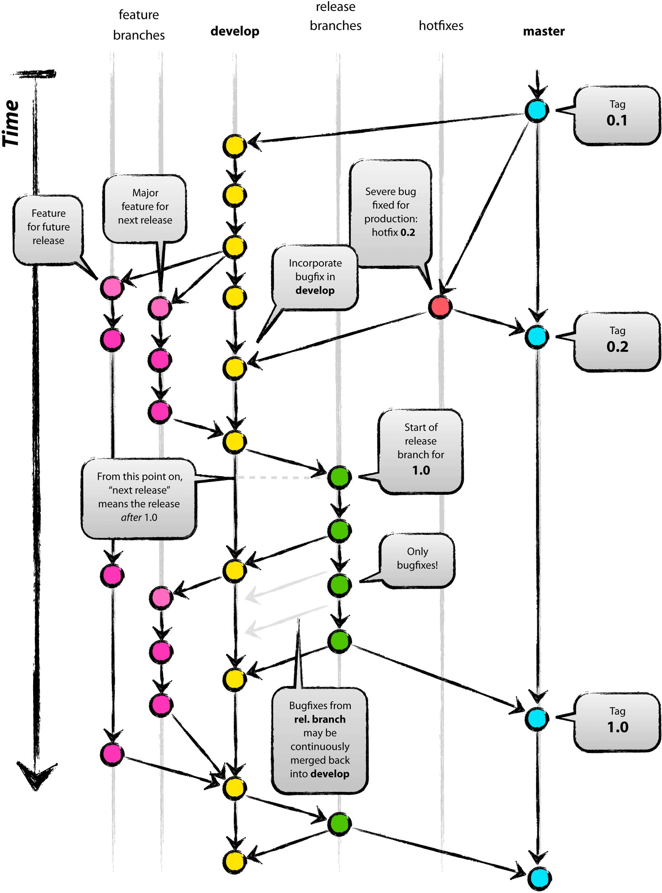
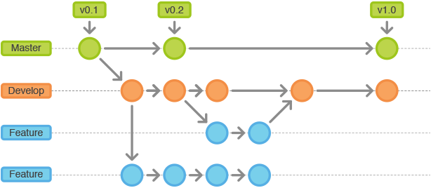

# 第8章 Git Flow——以发布为中心的开发模式

## 8.1 git flow的工作流程

	当在团队开发中使用版本控制系统时，商定一个统一的工作流程是至关重要的。



### 8.1.1 流程分支解析

| 名称    | 解释                                                         |
| ------- | ------------------------------------------------------------ |
| master  | 主分支，保存发布版本；不能直接在这个分支修改代码。           |
| develop | 开发分支，项目初始化时，基于master创建的分支；包含所有要发布到下一个Release的代码。 |
| feature | 功能分支，开发新功能时，基于develop创建的分支；功能完成后要合并到develop分支。 |
| release | 预发布分支，需要发布时，基于develop创建的分支；创建后可能有bugfixes，发布后合并到master和develop分支。 |
| hotfix  | 热修复分支，产品发布后，如果有bug需要基于master分支创建该分支；完成后要合并到master和develop分支。 |

#### master分支：


- Git主分支的名字，默认叫做`master`。该分支是自动建立，版本库初始化后，默认就是在主分支。

- 所有在`master`分支上的`commit`，应该是`tag`。

#### develop分支：

- `develop`分支基于`master`分支创建。


- 主分支只用来发布重大版本，日常开发应该在另一条分支上完成。我们把开发用的分支，叫做`develop`。
- 创建`develop`分支

```shell
git checkout -b develop master
git push -u origin develop
```


#### feature分支：



- `feature`分支基于`develop`分支创建。
- `feature`分支完成后，必须合并到`develop`分支，合并后一般会删除`feature`分支，但也可以保留。
- 创建`feature`分支，命名规则： feature-* 或者 feature/*

```shell
git checkout -b feature/x develop
# [可选项]提交分支到远程仓库
git push -u origin feature/x
```

- 开发完成后，将功能分支合并到`develop`分支，并删除功能分支

```shell
# 更新develop分支
git pull origin develop
# 切换到develop分支
git checkout develop
# 合并新开发的功能分支
git merge --no-ff feature/x
# 提交远程仓库
git push origin develop

# 删除新开发的功能分支
git branch -d feature/x
# [可选项]如果功能分支提交到远程仓库，可以如下删除
git push origin --delete feature/x
```

#### release分支：


- `release`分支基于`develop`分支创建。
- 正式版发布之前（即合并到`master`分支之前），我们需要一个预发布的版本进行测试，就是`release`了。
- 创建的`release`分支，可以进行测试和bug修复，但不应该从`develop`分支上合并新的更新了。
- 创建一个预发布分支，命名规则： release-* 或者 release/*

```shell
git checkout -b release/1.0.0 develop
# [可选项]提交分支到远程仓库
git push -u origin release/1.0.0
```

- 预发布结束以后，必须合并到`develop`和`master`分支，并在`master`上打一个`tag`。

```shell
git checkout master
git merge --no-ff release/1.0.0
# 提交远程仓库
git push

# 更新develop分支
git pull origin develop
git checkout develop
git merge --no-ff release/1.0.0
# 提交远程仓库
git push

# 删除预发布分支
git branch -d release/1.0.0
# [可选项]如果预发布分支提交到远程仓库，可以如下删除
git push origin --delete release/1.0.0

# 对合并生成的新节点，做一个标签
git tag -a v1.0.0 master
git push --tags
```

#### hotfix分支：


- `hotfix`分支基于`master`分支创建。
- 创建一个热修复分支，命名规则： hotfix-* 或者 hotfix/*

```shell
git checkout -b hotfix/1.0.1 master
# [可选项]提交分支到远程仓库
git push -u origin hotfix/1.0.1
```

- 完成热修复分支后，必须合并到`develop`和`master`分支，并在`master`上打一个`tag`。

```shell
git checkout master
git merge --no-ff hotfix/1.0.1
# 提交远程仓库
git push

# 更新develop分支
git pull origin develop
git checkout develop
git merge --no-ff hotfix/1.0.1
# 提交远程仓库
git push

# 删除热修复分支
git branch -d hotfix/1.0.1
# [可选项]如果热修复分支提交到远程仓库，可以如下删除
git push origin --delete hotfix/1.0.1

# 对合并生成的新节点，做一个标签
git tag -a v1.0.1 master
git push --tags
```


## 8.2 git flow的辅助工具

荷兰程序员Vincent Driessen曾发表了一篇博客，让一个分支策略广为人知，那就是`A succesful Git branching model`。

### 8.2.1 安装git flow

项目地址： https://github.com/nvie/gitflow

安装指南： https://github.com/nvie/gitflow/wiki/Installation

1. 下载

```shell
$ cd /usr/local/src/
[emon@emon src]$ curl -OL https://raw.github.com/nvie/gitflow/develop/contrib/gitflow-installer.sh
[emon@emon src]$ chmod +x gitflow-installer.sh
```

2. 执行安装

```shell
[emon@emon src]$ ./gitflow-installer.sh 
```

- 脚本解释：
    - 可通过`INSTALL_PREFIX=~/bin ./gitflow-installer.sh`形式指定安装目录

### 8.2.2 使用git flow

#### 初始化：

```shell
$ git flow init

Which branch should be used for bringing forth production releases?
   - develop
   - master
Branch name for production releases: [master]

Which branch should be used for integration of the "next release"?
   - develop
Branch name for "next release" development: [develop]

How to name your supporting branch prefixes?
Feature branches? [feature/]
Bugfix branches? [bugfix/]
Release branches? [release/]
Hotfix branches? [hotfix/]
Support branches? [support/]
Version tag prefix? []
Hooks and filters directory? [D:/Job/JobResource/IdeaProjects/Idea2017/git-tutorial/.git/hooks]
```

#### 特性：

- 为即将发布的版本开发新功能特性时创建特性分支，该分支通常只存在开发者的库中。
- 增加新特性，该操作创建了一个基于`develop`的特性分支，并切换到这个分支之下。

```shell
git flow feature start x
```

- 完成新特性
    - 合并`feature`分支到`develop`分支
    - 删除`feature`分支
    - 切换到`develop`分支

```shell
git flow feature finish x
```


- 发布新特性

```shell
git flow feature publish x
```

- 获取一个发布的新特性

```shell
git flow feature pull origin x
```

- 跟踪分支

```shell
git flow feature track x
```

#### 预发布分支：

- 支持一个新的用于生产环境的发布版本。
- 允许修正`bugfix`小问题，并为发布版本准备元数据。
- 创建`release`版本，它从`develop`分支开始创建一个`release`分支。

```shell
git flow release start 1.0.0 [BASE]
```

命令解释：[BASE]可以是`develop`分支下的`sha-1 hash`值，代表提交记录。

- 创建`release`分支后立即发布允许其他用户向这个`release`分支提交内容是个明智的做法。

```shell
git flow release publish 1.0.0
```

- 获取远程`release`

```shell
git flow release pull origin releasename
```

- 你也可以通过命令跟踪

```shell
git flow release track releasename
```

- 完成`release`	版本
    - 合并`release`分支到`master`分支
    - 用`release`分支名打`tag`
    - 合并`release`分支到`develop`分支
    - 移除`release`分支

```shell
git flow release finish 1.0.0
```

#### 紧急修复：

- 紧急修复来自这样的需求：生成环境的版本处于一个不预期状态，需要立即修正。
- 有可能是需要修正`master`分支上某个`tag`标记的生产版本。
- 创建`hotfix`分支，基于`master`分支

```shell
git flow hotfix start 1.0.1 [BASENAME]
```

其中，1.0.1标记着修正版本。[BASENAME]为finish release时填写的版本号。

- 完成`hotfix`分支
    - 代码归并回`develop`和`master`分支。
    - 相应地，`master`分支打上修正版本的`tag`。
    - 删除`hotfix`分支

```shell
git flow hotfix finish 1.0.1
```

### 8.2.3 git flow命令合集

