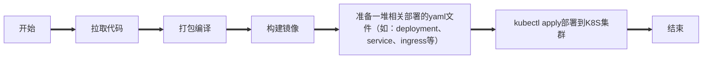

# 第1章 Helm介绍、组件、安装和目录结构

## 0 写在前面

### 0.1 环境准备

需要准备一套K8S集群，helm主要是K8S集群的包管理器，主要用来管理helm中的各种chart包。

### 0.2 传统服务部署到K8S集群的流程

拉取代码



### 0.3 传统方式部署引发的问题

- 随着引用的增多，需要维护大量的yaml文件
- 不能根据一套yaml文件来创建多个环境，需要手动进行修改

例如：一般环境都分为dev、预生产、生产环境，部署完了dev这套环境，后面再部署预生产和生产环境，还需要复制出两套，并手动修改才行。

### 0.4 什么是helm

Helm是Kubernetes的包管理工具，可以方便地发现、共享和构建Kubernetes应用。

Helm是K8S的包管理器，相当于CentOS系统中的yum工具，可以将一个服务相关的所有资源信息整合到一个chart包中，并且可以使用一套资源发布到多个环境中，可以将应用程序的所有资源和部署信息组合到单个部署包中。

就像Linux下的rpm包管理器，如yum/apt等，可以很方便的将之前打包好的yaml文件部署到kubernetes上。

### 0.5 helm的组件

- Chart：就是helm的一个整合后的chart包，包含一个应用所有的kubernetes声明模板，类似于yum的rpm包或者apt的dpkg文件。

理解：helm将打包的应用程序部署到K8S，并将他们构建成Chart。这些Chart将所有预配置的应用程序资源一级所有版本都包含在一个易于管理的包中。

helm把kubernetes资源（如：deployments、services或ingress等）打包到一个chart中，chart被保存到chart仓库。通过chart仓库可用来存储和分享chart。

- Helm客户端：heml的客户端组件，负责和K8S的apiserver通信。
- Repository：用于发布和存储chart包的仓库，类似yum仓库或docker仓库。
- Release：用chart包部署的一个实例。通过chart在K8S中部署的应用都会产生一个唯一的Release。同一chart部署多次就会产生多个Release。

理解：将这些yaml部署完成后，他也会记录部署时候的一个版本，维护了一个release版本状态，通过Release这个实例，他会具体帮我们创建pod、deployment等资源。

### 0.6 helm3和helm2的区别

- helm3移除了Tiller组件；helm2中helm客户端和K8S通信是通过Tiller组件，helm3移除了Tiller组件，直接使用kubeconfig文件和k8s的apiserver通信。

- 删除 release 命令变更

```bash
$ helm delete release-name --purge 
==>
$ helm uninstall release-name
```

- 查看 charts 信息命令变更

```bash
$ helm inspect release-name
==>
$ helm show release-name
```

- 拉取 charts 包命令变更

```bash
$ helm fetch chart-name
==>
$ helm pull chart-name
```

- helm3中必须指定 release 名称，如果需要生成一个随机名称，需要加选项`--generate-name`，helm2中如果不指定 release 名称，可以自动生成一个随机名称。

```bash
$ helm install ./mychart --generate-name
```

## 1 安装Helm

[Helm与K8S版本兼容性](https://helm.sh/zh/docs/topics/version_skew/) 发现Helm 3.11.x 与 K8S 1.23.17版本兼容。

下载Helm的二进制版本安装：https://github.com/helm/helm/releases/tag/v3.11.3

:::details 关于Helm安装到哪里的认知！

Helm是客户端工具，作用类似于`kubectl`；通过读取你的 `kubeconfig`文件（如`~/.kube/config`）与Kubernetes API Server通信。

若安装服务器没有kubeconfig，则报错：

> Error: Kubernetes cluster unreachable: Get "http://localhost:8080/version": dial tcp [::1]:8080: connect: connection refused

所以，Helm只需要安装在您用于管理Kubernetes集群的机器上（例如跳板机、本地开发及或Master节点），不需要安装到K8S集群的节点（包括Master节点和工作节点）。

当你执行`helm install`时，Helm CLI解析Chart模板，生成Kubernetes资源清单（YAML文件）。通过API Server将清单提交到集群，API Server负责将工作负载（Pod/Deployment等）调度到合适的Node上。

 **特殊情况**：如果您只在 Master 节点上执行管理操作，可在此节点安装 Helm，但这不是必须的。最佳实践是将 Helm 安装在专用的运维终端上。

:::

- 安装

  - 这里将Helm安装到K8S集群的Master节点（可以读取到`kubeconfig`文件）

  ```bash
  $ curl https://get.helm.sh/helm-v3.11.3-linux-arm64.tar.gz -O
  ```

  - 解压

  ```bash
  $ tar -zxvf helm-v3.11.3-linux-arm64.tar.gz 
  ```

  - 在解压目录中找到`helm`程序，移动到需要的目录中

  ```bash
  $ mv linux-arm64/helm /usr/local/bin/helm
  ```

  - 查看版本

  ```bash
  $ helm version --short
  v3.11.3+g3232493
  ```

  然后就可以执行客户端程序并 [添加稳定仓库](https://helm.sh/zh/docs/intro/quickstart/#初始化): `helm help`。

- 初始化

当您已经安装好了Helm之后，您可以添加一个chart 仓库。从 [Artifact Hub](https://artifacthub.io/packages/search?kind=0)中查找有效的Helm chart仓库。

```bash
$ helm repo add bitnami https://charts.bitnami.com/bitnami
$ helm repo list
```

当添加完成，您将可以看到可以被您安装的charts列表：

```bash
$ helm search repo bitnami
```

- 安装Chart示例

你可以通过`helm install`命令安装chart。Helm可以通过多种途径查找和安装chart，但最简单的是安装官方的`bitnami`charts。

```bash
$ helm repo update              # 确定我们可以拿到最新的charts列表
$ helm search repo mysql
$ helm install bitnami/mysql --generate-name \
	--set global.proxy.http=http://192.168.200.1:7890 \
  --set global.proxy.https=http://192.168.200.1:7890
```

:::info

> Error: INSTALLATION FAILED: failed to do request: Head "https://registry-1.docker.io/v2/bitnamicharts/mysql/manifests/13.0.2": dial tcp 162.125.34.133:443: i/o timeout

安装失败，请使用下面的 azure 仓库

:::

## 2 Chart的目录结构

```bash
$ helm create mychart
$ tree mychart/
mychart/ # chart包的名称
├── charts # 存放子chart的目录，目录里存放这个chart依赖的所有子chart
├── Chart.yaml # 保存chart的基本信息，包括名字、描述信息及版本等，这个变量文件都可以被templates目录下文件所引用
├── templates # 模板文件目录，目录里面存放所有yaml模板文件，包含了所有部署应用的yaml文件
│   ├── deployment.yaml # 创建deployment对象的模板文件
│   ├── _helpers.tpl # 放置模板助手的文件，可以在整个chart中重复使用，是放一些templates目录下这些yaml都有可能会用的一些模板
│   ├── hpa.yaml
│   ├── ingress.yaml
│   ├── NOTES.txt # 存放提示信息的文件，介绍chart帮助信息，helm install部署后展示给用户，如何使用chart等，是部署chart后给用户的提示信息
│   ├── serviceaccount.yaml
│   ├── service.yaml
│   └── tests # 用于测试的文件，测试完部署完chart后，如web，做一个链接，看看你是否部署正常
│       └── test-connection.yaml
└── values.yaml # 用于渲染模板的文件（变量文件，定义变量的值）定义templates目录下的yaml文件可能引用到的变量； values.yaml用于存储templaets目录中模板文件中用到变量的值，这些变量定义都是为了让templates目录下yaml引用

3 directories, 10 files
```

```bash
$ cat mychart/Chart.yaml 
```

:::details Chart.yaml详情

```yaml
apiVersion: v2
name: mychart
description: A Helm chart for Kubernetes

# A chart can be either an 'application' or a 'library' chart.
#
# Application charts are a collection of templates that can be packaged into versioned archives
# to be deployed.
#
# Library charts provide useful utilities or functions for the chart developer. They're included as
# a dependency of application charts to inject those utilities and functions into the rendering
# pipeline. Library charts do not define any templates and therefore cannot be deployed.
type: application

# This is the chart version. This version number should be incremented each time you make changes
# to the chart and its templates, including the app version.
# Versions are expected to follow Semantic Versioning (https://semver.org/)
version: 0.1.0

# This is the version number of the application being deployed. This version number should be
# incremented each time you make changes to the application. Versions are not expected to
# follow Semantic Versioning. They should reflect the version the application is using.
# It is recommended to use it with quotes.
appVersion: "1.16.0"
```

:::


## 5 Helm基本使用

主要介绍三个命令：

- chart install
- chart upgrade
- chart rollback

### 5.1 使用chart部署一个应用

查找chart：

```bash
$ helm search repo
$ helm search repo mysql
```

查看chart信息：

```bash
$ helm show chart azure/mysql
$ helm show values azure/mysql
```

安装包：

```bash
$ helm install db azure/mysql
```

:::details 安装详情

```bash
WARNING: This chart is deprecated
NAME: db
LAST DEPLOYED: Fri Jun 20 13:15:22 2025
NAMESPACE: default
STATUS: deployed
REVISION: 1
NOTES:
MySQL can be accessed via port 3306 on the following DNS name from within your cluster:
db-mysql.default.svc.cluster.local

To get your root password run:

    MYSQL_ROOT_PASSWORD=$(kubectl get secret --namespace default db-mysql -o jsonpath="{.data.mysql-root-password}" | base64 --decode; echo)

To connect to your database:

1. Run an Ubuntu pod that you can use as a client:

    kubectl run -i --tty ubuntu --image=ubuntu:16.04 --restart=Never -- bash -il

2. Install the mysql client:

    $ apt-get update && apt-get install mysql-client -y

3. Connect using the mysql cli, then provide your password:
    $ mysql -h db-mysql -p

To connect to your database directly from outside the K8s cluster:
    MYSQL_HOST=127.0.0.1
    MYSQL_PORT=3306

    # Execute the following command to route the connection:
    kubectl port-forward svc/db-mysql 3306

    mysql -h ${MYSQL_HOST} -P${MYSQL_PORT} -u root -p${MYSQL_ROOT_PASSWORD}
```

:::

解决运行问题：

- 查看是否运行成功

```bash
$ kubectl get po
NAME                        READY   STATUS    RESTARTS   AGE
db-mysql-599d764c8c-xxx8b   0/1     Pending   0          17h
```

- 查看为什么 Pending

```bash
kubectl describe po db-mysql-599d764c8c-xxx8b|grep Events -A 10
Events:
  Type     Reason            Age                   From               Message
  ----     ------            ----                  ----               -------
  Warning  FailedScheduling  3m23s (x344 over 9h)  default-scheduler  0/3 nodes are available: 3 pod has unbound immediate PersistentVolumeClaims.
```

- 查看 PersistentVolumeClaims 情况

```bash
$ kubectl get pvc
NAME       STATUS    VOLUME   CAPACITY   ACCESS MODES   STORAGECLASS   AGE
db-mysql   Pending                                                     17h

kubectl describe pvc db-mysql|grep Events -A 10
Events:
  Type    Reason         Age                  From                         Message
  ----    ------         ----                 ----                         -------
  Normal  FailedBinding  39s (x1401 over 9h)  persistentvolume-controller  no persistent volumes available for this claim and no storage class is set
```

- 查看pvc配置

```bash
$ kubectl get pvc db-mysql -oyaml
apiVersion: v1
kind: PersistentVolumeClaim
metadata:
  annotations:
    meta.helm.sh/release-name: db
    meta.helm.sh/release-namespace: default
  creationTimestamp: "2025-06-20T05:15:22Z"
  finalizers:
  - kubernetes.io/pvc-protection
  labels:
    app: db-mysql
    app.kubernetes.io/managed-by: Helm
    chart: mysql-1.6.9
    heritage: Helm
    release: db
  name: db-mysql
  namespace: default
  resourceVersion: "164007"
  uid: eed65961-9bb0-4b97-9c8b-4dbcee402f22
spec:
  accessModes:
  - ReadWriteOnce
  resources:
    requests:
      storage: 8Gi
  volumeMode: Filesystem
status:
  phase: Pending
```

- 准备pv配置

```bash
tee db-mysql.yaml << EOF
apiVersion: v1
kind: PersistentVolume
metadata:
  name: db-mysql
spec:
  capacity:
    storage: 8Gi
  accessModes:
    - ReadWriteOnce
  # 请确保nfs已安装好，并创建了 /nfs/data/db-mysql 目录
  nfs:
    path: /nfs/data/db-mysql
    server: 192.168.200.116
EOF
```

- 创建pv

```bash
$ kubectl apply -f db-mysql.yaml
```


