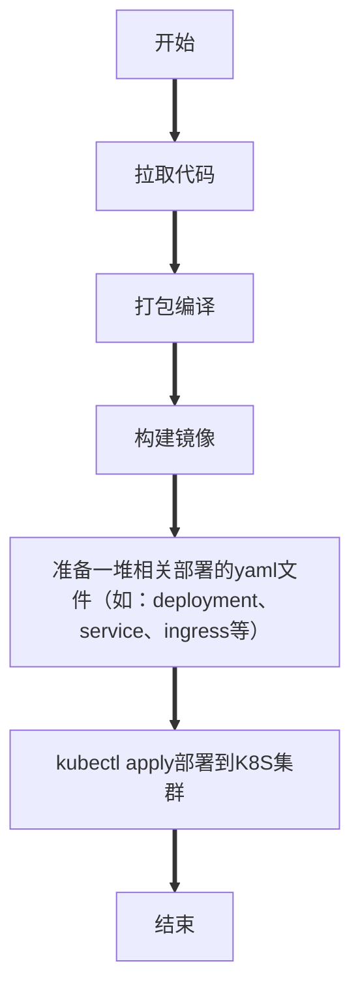

# 第1章 Helm介绍、组件、安装和目录结构

## 0 写在前面

### 0.1 环境准备

需要准备一套K8S集群，helm主要是K8S集群的包管理器，主要用来管理helm中的各种chart包。

### 0.2 传统服务部署到K8S集群的流程

拉取代码


```mermaid
graph TD
  Start[开始] ==> A
	A[拉取代码] ==> B[打包编译]
	B ==> C[构建镜像]
	C ==> D[准备一堆相关部署的yaml文件（如：deployment、service、ingress等）]
	D ==> E[kubectl apply部署到K8S集群]
	E ==> End[结束]
```


## 1 安装helm

[Helm与K8S版本兼容性](https://helm.sh/zh/docs/topics/version_skew/) 发现Helm 3.11.x 与 K8S 1.23.17版本兼容。

下载Helm的二进制版本安装：https://github.com/helm/helm/releases/tag/v3.11.3

:::details 关于Helm安装到哪里的认知！

Helm是客户端工具，作用类似于`kubectl`；通过读取你的 `kubeconfig`文件（如`~/.kube/config`）与Kubernetes API Server通信。

若安装服务器没有kubeconfig，则报错：

> Error: Kubernetes cluster unreachable: Get "http://localhost:8080/version": dial tcp [::1]:8080: connect: connection refused

所以，Helm只需要安装在您用于管理Kubernetes集群的机器上（例如跳板机、本地开发及或Master节点），不需要安装到K8S集群的节点（包括Master节点和工作节点）。

当你执行`helm install`时，Helm CLI解析Chart模板，生成Kubernetes资源清单（YAML文件）。通过API Server将清单提交到集群，API Server负责将工作负载（Pod/Deployment等）调度到合适的Node上。

 **特殊情况**：如果您只在 Master 节点上执行管理操作，可在此节点安装 Helm，但这不是必须的。最佳实践是将 Helm 安装在专用的运维终端上。

:::

- 安装

  - 这里将Helm安装到K8S集群的Master节点（可以读取到`kubeconfig`文件）

  ```bash
  $ curl https://get.helm.sh/helm-v3.11.3-linux-arm64.tar.gz -O
  ```

  - 解压

  ```bash
  $ tar -zxvf helm-v3.11.3-linux-arm64.tar.gz 
  ```

  - 在解压目录中找到`helm`程序，移动到需要的目录中

  ```bash
  $ mv linux-arm64/helm /usr/local/bin/helm
  ```

  - 查看版本

  ```bash
  $ helm version --short
  v3.11.3+g3232493
  ```

  然后就可以执行客户端程序并 [添加稳定仓库](https://helm.sh/zh/docs/intro/quickstart/#初始化): `helm help`。

- 初始化

当您已经安装好了Helm之后，您可以添加一个chart 仓库。从 [Artifact Hub](https://artifacthub.io/packages/search?kind=0)中查找有效的Helm chart仓库。

```bash
$ helm repo add bitnami https://charts.bitnami.com/bitnami
$ helm repo list
```

当添加完成，您将可以看到可以被您安装的charts列表：

```bash
$ helm search repo bitnami
```

- 安装Chart示例

你可以通过`helm install`命令安装chart。Helm可以通过多种途径查找和安装chart，但最简单的是安装官方的`bitnami`charts。

```bash
$ helm repo update              # 确定我们可以拿到最新的charts列表
$ helm search repo mysql
$ helm install bitnami/mysql --generate-name \
	--set global.proxy.http=http://192.168.200.1:7890 \
  --set global.proxy.https=http://192.168.200.1:7890
```

:::info

> Error: INSTALLATION FAILED: failed to do request: Head "https://registry-1.docker.io/v2/bitnamicharts/mysql/manifests/13.0.2": dial tcp 162.125.34.133:443: i/o timeout

安装失败，请使用下面的 azure 仓库

:::

## 2 Helm常用命令

| 命令       | 描述                                                         |
| ---------- | ------------------------------------------------------------ |
| create     | 创建一个chart并指定名称                                      |
| dependency | 管理chart依赖                                                |
| get        | 下载一个release。可用子命令：all/hooks/manifest/notes/values |
| history    | 获取release历史                                              |
| install    | 安装一个chart                                                |
| list       | 列出release                                                  |
| package    | 将chart目录打包到chart存档文件中                             |
| pull       | 从远程仓库中下载chart并解压到本地 `$ helm pull azure/mysql –untar` |
| repo       | 添加，列出，移除，更新和索引chart仓库。可用子命令：add/index/list/remove/update |
| rollback   | 从之前版本回滚                                               |
| search     | 根据关键字搜索chart。可用子命令：hub/repo                    |
| show       | 查看chart详细信息。可用子命令：all/chart/readme/values       |
| status     | 显示已命名版本的状态                                         |
| template   | 本地呈现模板                                                 |
| uninstall  | 卸载一个release                                              |
| upgrade    | 更新一个release                                              |
| version    | 查看helm客户端版本                                           |

## 3 配置国内Chart仓库

- 微软仓库

http://mirror.azure.cn/kubernetes/charts/

这个仓库强烈推荐，基本上官网有的chart这里都有

```bash
# 添加 azure 仓库【推荐】
$ helm repo add azure http://mirror.azure.cn/kubernetes/charts/
# 添加 aliyun 仓库【不稳定】
$ helm repo add aliyun https://kubernetes.oss-cn-hangzhou.aliyuncs.com/charts
# 查看一添加的仓库
$ helm repo list
# 更新本地仓库缓存
$ helm repo update
# 搜索 MySQL
$ helm search repo azure/mysql
# 安装
$ helm install azure/mysql --generate-name
```

## 4 Helm基本使用

主要介绍三个命令：

- chart install
- chart upgrade
- chart rollback

### 4.1 使用chart部署一个应用

查找chart：

```bash
$ helm search repo
$ helm search repo mysql
```

查看chart信息：

```bash
$ helm show chart azure/mysql
$ helm show values azure/mysql
```

安装包：

```bash
$ helm install db azure/mysql
```

:::details 安装详情

```bash
WARNING: This chart is deprecated
NAME: db
LAST DEPLOYED: Fri Jun 20 13:15:22 2025
NAMESPACE: default
STATUS: deployed
REVISION: 1
NOTES:
MySQL can be accessed via port 3306 on the following DNS name from within your cluster:
db-mysql.default.svc.cluster.local

To get your root password run:

    MYSQL_ROOT_PASSWORD=$(kubectl get secret --namespace default db-mysql -o jsonpath="{.data.mysql-root-password}" | base64 --decode; echo)

To connect to your database:

1. Run an Ubuntu pod that you can use as a client:

    kubectl run -i --tty ubuntu --image=ubuntu:16.04 --restart=Never -- bash -il

2. Install the mysql client:

    $ apt-get update && apt-get install mysql-client -y

3. Connect using the mysql cli, then provide your password:
    $ mysql -h db-mysql -p

To connect to your database directly from outside the K8s cluster:
    MYSQL_HOST=127.0.0.1
    MYSQL_PORT=3306

    # Execute the following command to route the connection:
    kubectl port-forward svc/db-mysql 3306

    mysql -h ${MYSQL_HOST} -P${MYSQL_PORT} -u root -p${MYSQL_ROOT_PASSWORD}
```

:::

解决运行问题：

- 查看是否运行成功

```bash
$ kubectl get po
NAME                        READY   STATUS    RESTARTS   AGE
db-mysql-599d764c8c-xxx8b   0/1     Pending   0          17h
```

- 查看为什么 Pending

```bash
kubectl describe po db-mysql-599d764c8c-xxx8b|grep Events -A 10
Events:
  Type     Reason            Age                   From               Message
  ----     ------            ----                  ----               -------
  Warning  FailedScheduling  3m23s (x344 over 9h)  default-scheduler  0/3 nodes are available: 3 pod has unbound immediate PersistentVolumeClaims.
```

- 查看 PersistentVolumeClaims 情况

```bash
$ kubectl get pvc
NAME       STATUS    VOLUME   CAPACITY   ACCESS MODES   STORAGECLASS   AGE
db-mysql   Pending                                                     17h

kubectl describe pvc db-mysql|grep Events -A 10
Events:
  Type    Reason         Age                  From                         Message
  ----    ------         ----                 ----                         -------
  Normal  FailedBinding  39s (x1401 over 9h)  persistentvolume-controller  no persistent volumes available for this claim and no storage class is set
```

- 查看pvc配置

```bash
$ kubectl get pvc db-mysql -oyaml
apiVersion: v1
kind: PersistentVolumeClaim
metadata:
  annotations:
    meta.helm.sh/release-name: db
    meta.helm.sh/release-namespace: default
  creationTimestamp: "2025-06-20T05:15:22Z"
  finalizers:
  - kubernetes.io/pvc-protection
  labels:
    app: db-mysql
    app.kubernetes.io/managed-by: Helm
    chart: mysql-1.6.9
    heritage: Helm
    release: db
  name: db-mysql
  namespace: default
  resourceVersion: "164007"
  uid: eed65961-9bb0-4b97-9c8b-4dbcee402f22
spec:
  accessModes:
  - ReadWriteOnce
  resources:
    requests:
      storage: 8Gi
  volumeMode: Filesystem
status:
  phase: Pending
```

- 准备pv配置

```bash
tee db-mysql.yaml << EOF
apiVersion: v1
kind: PersistentVolume
metadata:
  name: db-mysql
spec:
  capacity:
    storage: 8Gi
  accessModes:
    - ReadWriteOnce
  # 请确保nfs已安装好，并创建了 /nfs/data/db-mysql 目录
  nfs:
    path: /nfs/data/db-mysql
    server: 192.168.200.116
EOF
```

- 创建pv

```bash
$ kubectl apply -f db-mysql.yaml
```


