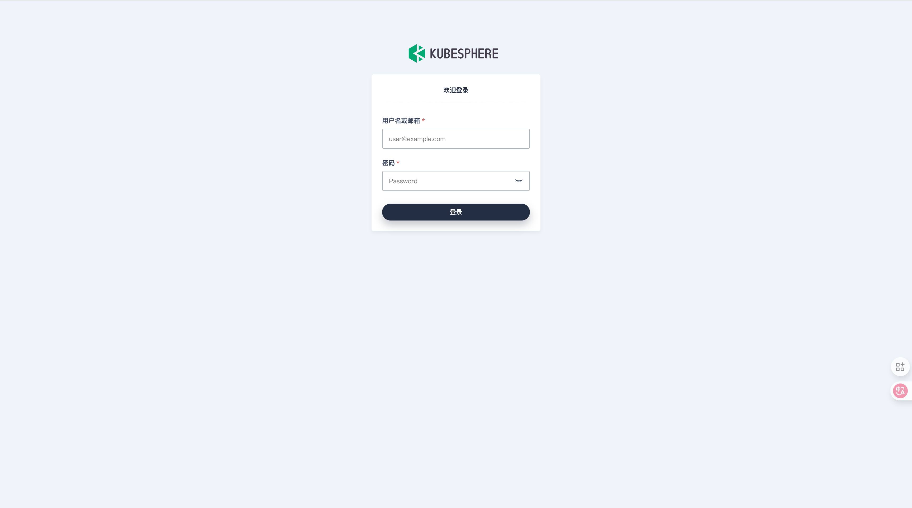
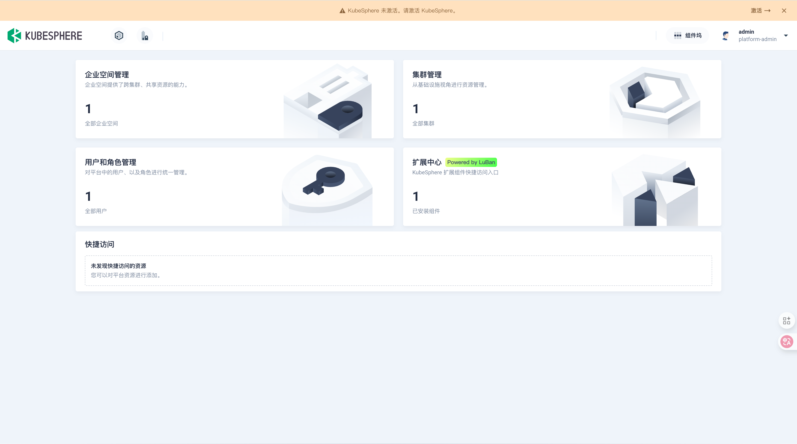
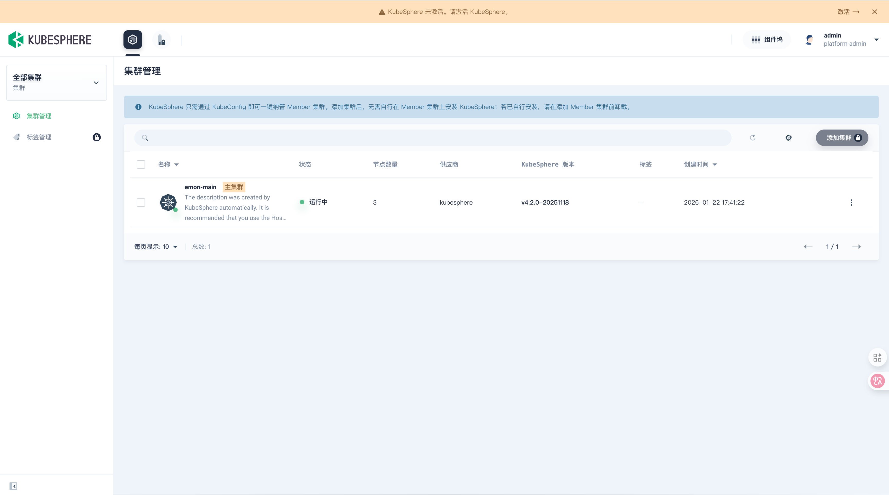
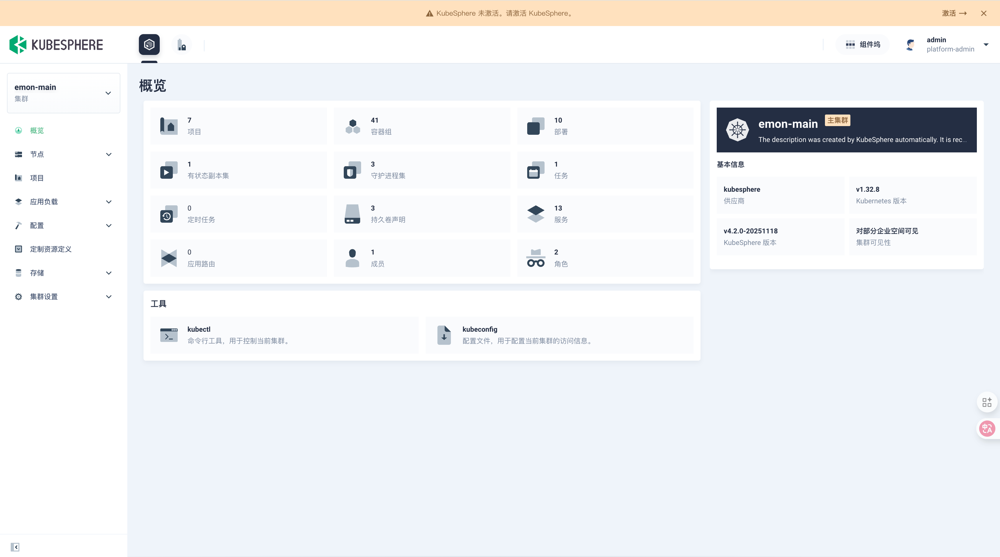

# 第1章 Kubesphere安装

KubeSphere Cloud 官网：https://kubesphere.com.cn/

KubeSphere 开源版官网：https://kubesphere.io/zh/

Github：https://github.com/kubesphere/kubesphere/blob/master/README_zh.md  可以查看与k8s版本关系

v3.4.1安装文档：

[在Kubernetes上最小化安装KubeSphere](https://kubesphere.io/zh/docs/v3.4/quick-start/minimal-kubesphere-on-k8s/)

[在Kubernetes上安装KubeSphere3.4.1](https://kubesphere.io/zh/docs/v3.4/installing-on-kubernetes/)

[启用可插拔组件](https://kubesphere.io/zh/docs/v3.4/pluggable-components/)

[从Kubenetes上卸载KubeSphere](https://kubesphere.io/zh/docs/v3.4/installing-on-kubernetes/uninstall-kubesphere-from-k8s/)

[KubeSphere 开源社区](https://ask.kubesphere.io/forum/)

v4.1.3安装文档：

[在 Kubernetes 上快速安装 KubeSphere](https://kubesphere.io/zh/docs/v4.1/02-quickstart/01-install-kubesphere/)

[在 Linux 上安装 Kubernetes 和 KubeSphere](https://kubesphere.io/zh/docs/v4.1/03-installation-and-upgrade/02-install-kubesphere/02-install-kubernetes-and-kubesphere/)

## 0 先决条件？

### 0.1 Kubesphere是什么？

KubeSphere就是Java编程界的Spring。

KubeSphere，这是国内唯一一个开源的Kubernetes（k8s）发行版，它的开源不涉及任何商业意图，它不属于青云而属于社区，它极大地降低了使用Kubernetes的门槛，它的出现将加速中国企业向云原生迈进的步伐。
“发行版”的说法常用于Linux操作系统。比如，虽有Linux内核，而Ubuntu、CentOS等等叫做Linux发行版，对应的，Kubernetes就相当于内核，KubeSphere就是Kubernetes的发行版，正常人类是很难使用Linux内核和Kubenetes的，为了让大家用起来，要基于Linux内核和Kubernetes做很多周边配套，Linux和Kubenetes就好像一台光秃秃的汽车发动机，为了把它当车开，你起码得有车架子、轮胎、方向盘、刹车、……等等。
所以，开源KubeSphere的青云就像一个汽车厂，负责KubeSphere牌汽车各个组件的组装搭配，不过，这个汽车不需要花钱就能获取到，这就是青云开源KubeSphere的实质。它的意义在于加快了大家使用k8s发动机的进程，让大家都能开上KubeSphere牌汽车。
云原生能帮助企业做数字化转型，帮助企业用数字化转型获取竞争力。而KubeSphere可以让企业更快地上原生，开上汽车。

### 0.2 服务器规划

| 主机名    | 系统类型 | IP地址          | CPU  | 内存  | 部署内容                            |
| --------- | -------- | --------------- | ---- | ----- | ----------------------------------- |
| k8s-node1 | Rocky9   | 192.168.200.116 | 4核  | >=16G | 控制节点/工作负载(control1/worker1) |
| k8s-node2 | Rocky9   | 192.168.200.117 | 4核  | >=16G | 控制节点/工作负载(control2/worker2) |
| k8s-node3 | Rocky9   | 192.168.200.118 | 4核  | >=16G | 控制节点/工作负载(control3/worker3) |

### 0.3 基础环境准备

参考：[基础环境准备](/devops/new/Kubernetes/01-%E7%AC%AC1%E7%AB%A0%20%E5%9F%BA%E7%A1%80%E7%8E%AF%E5%A2%83%E5%87%86%E5%A4%87.html)

### 0.4 安装Docker【若用KK安装，请忽略】

参考：[Docker的安装与配置.md](/devops/new/Docker/01-%E7%AC%AC1%E7%AB%A0%20Docker%E7%9A%84%E5%AE%89%E8%A3%85%E4%B8%8E%E9%85%8D%E7%BD%AE.html)

### 0.5 安装Kubernetes【若用KK安装，请忽略】

参考：[kubeadm创建K8S集群](/devops/new/Kubernetes/01-%E7%AC%AC1%E7%AB%A0%20Kubeadmin%E5%AE%89%E8%A3%85K8S%20V1.23.html#_3-kubeadm%E5%88%9B%E5%BB%BA%E9%9B%86%E7%BE%A4-%E4%BB%85master%E8%8A%82%E7%82%B9)

### 0.6 **创建数据目录（所有节点）**

#### 0.6.1 创建 **OpenEBS** 本地数据根目录

```bash
$ sudo mkdir -p /data/openebs/local
```

#### 0.6.2 创建 **Containerd** 数据目录

```bash
$ sudo mkdir -p /data/containerd
```

#### 0.6.3 创建 Containerd 数据目录软连接

```bash
$ sudo ln -snf /data/containerd /var/lib/containerd
```

:::info

**说明：** KubeKey 到 v3.1.11 版为止，一直不支持在部署的时候更改 Containerd 的数据目录，只能用这种目录软链接的方式，变相增加存储空间（**也可以提前手工安装 Containerd**）。

:::

### 0.7 别名定义

| 原名       | 别名 |
| ---------- | ---- |
| Kubernetes | k8s  |
| KubeKey    | kk   |
| KubeSphere | ks   |


## 1 部署 Kubernetes 集群（k8s-node1节点）

本文利用 KubeSphere 出品的 KubeKey 工具，部署一套包含**三个节点**， **Control 和 Worker 复用**的 K8s 高可用集群。

将 **k8s-node1** 作为部署节点，执行下面的操作。

- 开启代理

```bash
$ export https_proxy=http://192.168.200.1:7890 http_proxy=http://192.168.200.1:7890 all_proxy=socks5://192.168.200.1:7890
```

### 1.0 工具包安装（所有节点）

```bash
$ sudo dnf install socat conntrack ebtables ipset -y
```

### 1.1 下载 KubeKey

- 下载最新版（v3.1.11）

```bash
$ mkdir -pv ~/k8s_soft/kubekey
$ cd ~/k8s_soft/kubekey/

# 选择中文区下载(访问 GitHub 受限时使用)
$ export KKZONE=cn
# 下载完成后当前目录下将生成 KubeKey 二进制文件 kk。
$ curl -sfL https://get-kk.kubesphere.io | sh -
```

- 查看 KubeKey 支持的 Kubernetes 版本列表

```bash
$ ./kk version --show-supported-k8s
```

> KubeKey 支持的 Kubernetes 版本非常丰富且及时更新。本文选择最新稳定版 **v1.32.8**。对于生产环境，建议选择:
>
> - 次要版本号为双数的版本(如 v1.30.x、v1.32.x)
> - 补丁版本号不低于 5 的版本(如 v1.30.14、v1.32.8)
> - 避免使用太旧的版本，建议选择最近 2-3 个次要版本
> - 可以优先考虑 v1.30.14 或 v1.32.8 这类经过充分验证的版本
>
> 选择版本时需要平衡新特性和稳定性，既要确保关键功能可用,又要避免可能的兼容性问题。

### 1.2 创建 Kubernetes 集群部署配置

1. 创建集群配置文件

本文选择了 **v1.32.8**。因此，指定配置文件名称为 **kk-k8s-v1328.yaml**，如果不指定，默认的文件名为 **config-sample.yaml**。

```bash
$ ./kk create config -f kk-k8s-v1328.yaml --with-kubernetes v1.32.8
```

> **重要提示：**
>
> - 请妥善保管安装配置文件 **ksp-k8s-v1328.yaml**。该文件对于后续的集群维护工作（如节点扩容、集群卸载等）至关重要。如果文件丢失，您将需要重新创建配置文件，这可能会带来额外的工作量。
> - 配置文件包含大量可配置选项。如需了解全部配置参数及其用法，请查阅官方文档中的 [KubeKey 配置示例](https://github.com/kubesphere/kubekey/blob/master/docs/config-example.md)。这将帮助您更好地定制集群配置。

2. 修改配置文件

本示例采用 6 节点（3台虚拟机模拟，每一对Control+Worker共享同一台）高可用部署架构，其中:

- 3 个 Control 节点: 部署 control-plane 和 etcd 组件
- 3 个 Worker 节点: 部署业务工作负载

请使用 `vi` 编辑器，编辑配置文件 `kk-k8s-v1328.yaml`，修改 **kind: Cluster** 小节中 hosts 和 roleGroups 等信息，修改说明如下：

- metadata.name：自定义集群名称 **ks-k8s**，默认值 **sample**

- hosts：指定节点的 IP、ssh 用户、ssh 密码；若是arm架构，请指定 arch
- roleGroups：指定 3 个 etcd、control-plane 节点，并复用为 worker 节点
- internalLoadbalancer： 启用内置的 HAProxy 负载均衡器
- domain：自定义域名 **lb.emon.local**，没特殊需求可使用默认值 **lb.kubesphere.local**
- clusterName：自定义 **emon.com**，没特殊需求可使用默认值 **cluster.local**
- autoRenewCerts：该参数可以实现证书到期自动续期，默认为 **true**
- containerManager：容器运行时使用 **containerd**
- storage.openebs.basePath：**默认没有，新增配置**，指定 openebs 默认存储路径为 **/data/openebs/local**
- registry.privateRegistry：**可选配置，** 解决 Docker 官方镜像不可用的问题
- registry.namespaceOverride： **可选配置，** 解决 Docker 官方镜像不可用的问题

修改后的完整示例如下：

```bash
$ tee /home/emon/k8s_soft/kubekey/kk-k8s-v1328.yaml > /dev/null <<EOF
apiVersion: kubekey.kubesphere.io/v1alpha2
kind: Cluster
metadata:
  name: ks-k8s
spec:
  hosts:
  - {name: k8s-node1, address: 192.168.200.116, internalAddress: 192.168.200.116, user: emon, password: "emon123", arch: arm64}
  - {name: k8s-node2, address: 192.168.200.117, internalAddress: 192.168.200.117, user: emon, password: "emon123", arch: arm64}
  - {name: k8s-node3, address: 192.168.200.118, internalAddress: 192.168.200.118, user: emon, password: "emon123", arch: arm64}
  roleGroups:
    etcd:
    - k8s-node1
    - k8s-node2
    - k8s-node3
    control-plane:
    - k8s-node1
    - k8s-node2
    - k8s-node3
    worker:
    - k8s-node1
    - k8s-node2
    - k8s-node3
  controlPlaneEndpoint:
    ## Internal loadbalancer for apiservers 
    internalLoadbalancer: haproxy # 如需部署⾼可⽤集群，且⽆负载均衡器可⽤，可开启该参数，做集群内部负载均衡

    domain: lb.emon.local # 会被写入 /etc/hosts
    address: ""
    port: 6443
  kubernetes:
    version: v1.32.8
    clusterName: emon.com
    autoRenewCerts: true
    containerManager: containerd # 部署 kubernetes v1.24+ 版本，建议将 containerManager 设置为 containerd
  etcd:
    type: kubekey
  network:
    plugin: calico
    kubePodsCIDR: 10.233.64.0/18
    kubeServiceCIDR: 10.233.0.0/18
    ## multus support. https://github.com/k8snetworkplumbingwg/multus-cni
    multusCNI:
      enabled: false
  storage:
    openebs:
      basePath: /data/openebs/local # 默认没有的新增配置，base path of the local PV 
  registry:
    # privateRegistry: ""
    # namespaceOverride: ""
    privateRegistry: "registry.cn-beijing.aliyuncs.com" # 使用 KubeSphere 在阿里云的镜像仓库
    namespaceOverride: "kubesphereio"
    registryMirrors: []
    insecureRegistries: []
  addons: []
EOF
```

[ CIDR（无类别域间路由）在线工具](https://cidr.xyz/)

| 参数                         | 用途                        | 网段             | IP 范围                          | 总 IP 数 |
| ---------------------------- | --------------------------- | ---------------- | -------------------------------- | -------- |
| `--cluster-cidr`             | Pod IP 分配                 | `10.233.64.0/18` | `10.233.64.0` – `10.233.127.255` | 16,384   |
| `--service-cluster-ip-range` | Service (ClusterIP) 虚拟 IP | `10.233.0.0/18`  | `10.233.0.0` – `10.233.63.255`   | 16,384   |

### 1.3 部署 K8s 集群（无需代理）

使用上面生成的配置文件，执行下面的命令，创建 K8s 集群。

```bash
# 1. （非root用户安装）临时授权，用ssh -t打开伪终端，用户可以sudo时，允许你交互式输入密码。
for node in k8s-node1 k8s-node2 k8s-node3; do
  ssh -t emon@$node 'echo "emon ALL=(ALL) NOPASSWD: ALL" | sudo tee /etc/sudoers.d/emon'
  echo "=== $node ==="
  ssh emon@$node 'sudo whoami'
done

# 2. 运行安装
./kk create cluster -f kk-k8s-v1328.yaml --with-local-storage

# 3. （非root用户安装）安装成功后，撤销权限（可选但推荐）
for node in k8s-node1 k8s-node2 k8s-node3; do
  ssh emon@$node 'sudo rm -f /etc/sudoers.d/emon'
done
```

> **重要说明：**
>
> - 本文使用 **OpenEBS LocalPV** 作为默认存储解决方案，需要在命令中添加 `--with-local-storage` 参数启用本地存储功能
> - 该参数会自动部署 OpenEBS LocalPV 相关组件，简化存储配置流程

命令执行后，首先 **Kubekey** 会检查部署 K8s 的依赖及其他详细要求。通过检查后，系统将提示您确认安装。输入 **yes** 并按 **ENTER** 继续部署。

```bash


 _   __      _          _   __           
| | / /     | |        | | / /           
| |/ / _   _| |__   ___| |/ /  ___ _   _ 
|    \| | | | '_ \ / _ \    \ / _ \ | | |
| |\  \ |_| | |_) |  __/ |\  \  __/ |_| |
\_| \_/\__,_|_.__/ \___\_| \_/\___|\__, |
                                    __/ |
                                   |___/

01:14:25 CST [GreetingsModule] Greetings
01:14:26 CST message: [k8s-node3]
Greetings, KubeKey!
01:14:26 CST message: [k8s-node1]
Greetings, KubeKey!
01:14:26 CST message: [k8s-node2]
Greetings, KubeKey!
01:14:26 CST success: [k8s-node3]
01:14:26 CST success: [k8s-node1]
01:14:26 CST success: [k8s-node2]
01:14:26 CST [NodePreCheckModule] A pre-check on nodes
01:14:26 CST success: [k8s-node1]
01:14:26 CST success: [k8s-node3]
01:14:26 CST success: [k8s-node2]
01:14:26 CST [ConfirmModule] Display confirmation form
+-----------+------+------+---------+----------+-------+-------+---------+-----------+--------+--------+------------+------------+-------------+------------------+--------------+
| name      | sudo | curl | openssl | ebtables | socat | ipset | ipvsadm | conntrack | chrony | docker | containerd | nfs client | ceph client | glusterfs client | time         |
+-----------+------+------+---------+----------+-------+-------+---------+-----------+--------+--------+------------+------------+-------------+------------------+--------------+
| k8s-node1 | y    | y    | y       | y        | y     | y     | y       | y         | y      |        | y          |            |             |                  | CST 01:14:26 |
| k8s-node2 | y    | y    | y       | y        | y     | y     | y       | y         | y      |        | y          |            |             |                  | CST 01:14:26 |
| k8s-node3 | y    | y    | y       | y        | y     | y     | y       | y         | y      |        | y          |            |             |                  | CST 01:14:26 |
+-----------+------+------+---------+----------+-------+-------+---------+-----------+--------+--------+------------+------------+-------------+------------------+--------------+

This is a simple check of your environment.
Before installation, ensure that your machines meet all requirements specified at
https://github.com/kubesphere/kubekey#requirements-and-recommendations

Install k8s with specify version:  v1.32.8

Continue this installation? [yes/no]: yes
```

> **重要说明：**
>
> - 系统检查显示 nfs-client、ceph-client、glusterfs-client 等存储客户端组件未安装。这些组件将在后续存储系统对接实战中单独安装配置
> - 容器运行时(docker/containerd)将根据配置文件中 **containerManager** 参数自动选择安装

整个部署过程预计需要 5-10 分钟完成。具体耗时取决于:

- 网络带宽状况
- 服务器硬件配置
- 集群节点数量

本次部署完成耗时 2 分钟。

当终端显示以下信息时,表示 Kubernetes 集群已成功创建并完成初始化:

```bash
01:40:46 CST Pipeline[CreateClusterPipeline] execute successfully
Installation is complete.

Please check the result using the command:

        kubectl get pod -A
```

### 1.4 虚拟机挂起并恢复后k8s网络问题（所有节点）

[虚拟机挂起并恢复后k8s网络问题（所有节点）](/devops/new/Kubernetes/02-%E7%AC%AC2%E7%AB%A0%20Kubeadmin%E5%AE%89%E8%A3%85K8S%20V1.23.html#_3-4-%E8%99%9A%E6%8B%9F%E6%9C%BA%E6%8C%82%E8%B5%B7%E5%B9%B6%E6%81%A2%E5%A4%8D%E5%90%8Ek8s%E7%BD%91%E7%BB%9C%E9%97%AE%E9%A2%98-%E6%89%80%E6%9C%89%E8%8A%82%E7%82%B9)

### 1.5 配置Containerd代理服务器

[配置Containerd代理服务器](/devops/new/Containerd/01-%E7%AC%AC1%E7%AB%A0%20Containerd%E7%9A%84%E5%AE%89%E8%A3%85%E4%B8%8E%E9%85%8D%E7%BD%AE.html#_1-%E9%85%8D%E7%BD%AEdocker%E4%BB%A3%E7%90%86%E6%9C%8D%E5%8A%A1%E5%99%A8)

## 2 验证 K8s 集群状态

### 2.1 查看集群节点信息

在 **控制节点 1** 运行 `kubectl` 命令获取 K8s 集群上的可用节点列表。

```bash
$ kubectl get nodes -o wide
```

在输出结果中可以看到，当前的 K8s 集群有三个可用节点、节点角色、K8s 版本号、节点的内部 IP、操作系统类型、内核版本、容器运行时及版本号等信息。

```bash
NAME        STATUS   ROLES                  AGE   VERSION   INTERNAL-IP       EXTERNAL-IP   OS-IMAGE                      KERNEL-VERSION                  CONTAINER-RUNTIME
k8s-node1   Ready    control-plane,worker   20m   v1.32.8   192.168.200.116   <none>        Rocky Linux 9.7 (Blue Onyx)   5.14.0-611.20.1.el9_7.aarch64   containerd://1.7.13
k8s-node2   Ready    control-plane,worker   20m   v1.32.8   192.168.200.117   <none>        Rocky Linux 9.7 (Blue Onyx)   5.14.0-611.20.1.el9_7.aarch64   containerd://1.7.13
k8s-node3   Ready    control-plane,worker   20m   v1.32.8   192.168.200.118   <none>        Rocky Linux 9.7 (Blue Onyx)   5.14.0-611.20.1.el9_7.aarch64   containerd://1.7.13
```

### 2.2 查看 Pod 信息

输入以下命令获取在 K8s 集群上运行的 Pod 列表。

```bash
$ kubectl get pods -A -o wide
```

输出结果符合预期，所有 Pod 的状态都是 **Running**。

```bash
NAMESPACE     NAME                                          READY   STATUS    RESTARTS   AGE   IP                NODE        NOMINATED NODE   READINESS GATES
kube-system   calico-kube-controllers-678fc69664-bpwkf      1/1     Running   0          21m   10.233.76.2       k8s-node2   <none>           <none>
kube-system   calico-node-6h4sm                             1/1     Running   0          21m   192.168.200.117   k8s-node2   <none>           <none>
kube-system   calico-node-ghvwl                             1/1     Running   0          21m   192.168.200.118   k8s-node3   <none>           <none>
kube-system   calico-node-sxtwp                             1/1     Running   0          21m   192.168.200.116   k8s-node1   <none>           <none>
kube-system   coredns-7b9df87854-49nwc                      1/1     Running   0          12m   10.233.81.1       k8s-node1   <none>           <none>
kube-system   coredns-7b9df87854-8n9h7                      1/1     Running   0          12m   10.233.111.1      k8s-node3   <none>           <none>
kube-system   kube-apiserver-k8s-node1                      1/1     Running   0          21m   192.168.200.116   k8s-node1   <none>           <none>
kube-system   kube-apiserver-k8s-node2                      1/1     Running   0          21m   192.168.200.117   k8s-node2   <none>           <none>
kube-system   kube-apiserver-k8s-node3                      1/1     Running   0          21m   192.168.200.118   k8s-node3   <none>           <none>
kube-system   kube-controller-manager-k8s-node1             1/1     Running   0          21m   192.168.200.116   k8s-node1   <none>           <none>
kube-system   kube-controller-manager-k8s-node2             1/1     Running   0          21m   192.168.200.117   k8s-node2   <none>           <none>
kube-system   kube-controller-manager-k8s-node3             1/1     Running   0          21m   192.168.200.118   k8s-node3   <none>           <none>
kube-system   kube-proxy-jpkc4                              1/1     Running   0          21m   192.168.200.118   k8s-node3   <none>           <none>
kube-system   kube-proxy-nzpcs                              1/1     Running   0          21m   192.168.200.116   k8s-node1   <none>           <none>
kube-system   kube-proxy-t74df                              1/1     Running   0          21m   192.168.200.117   k8s-node2   <none>           <none>
kube-system   kube-scheduler-k8s-node1                      1/1     Running   0          21m   192.168.200.116   k8s-node1   <none>           <none>
kube-system   kube-scheduler-k8s-node2                      1/1     Running   0          21m   192.168.200.117   k8s-node2   <none>           <none>
kube-system   kube-scheduler-k8s-node3                      1/1     Running   0          21m   192.168.200.118   k8s-node3   <none>           <none>
kube-system   nodelocaldns-cxrj7                            1/1     Running   0          21m   192.168.200.116   k8s-node1   <none>           <none>
kube-system   nodelocaldns-jgwz5                            1/1     Running   0          21m   192.168.200.118   k8s-node3   <none>           <none>
kube-system   nodelocaldns-z4wrm                            1/1     Running   0          21m   192.168.200.117   k8s-node2   <none>           <none>
kube-system   openebs-localpv-provisioner-9644bcfd5-267fz   1/1     Running   0          21m   10.233.76.3       k8s-node2   <none>           <none>
```

### 2.3 查看 Image 列表

输入以下命令获取在 K8s 集群节点上已经下载的 Image 列表。

```bash
$ sudo crictl images ls
```

输入以下命令获取在 K8s 集群节点上已经下载的 Image 列表。

```bash
IMAGE                                                                   TAG                 IMAGE ID            SIZE
registry.cn-beijing.aliyuncs.com/kubesphereio/cni                       v3.27.4             eaa2969f27e4f       81.3MB
registry.cn-beijing.aliyuncs.com/kubesphereio/coredns                   1.9.3               b19406328e70d       13.4MB
registry.cn-beijing.aliyuncs.com/kubesphereio/haproxy                   2.9.6-alpine        f6930329d1bbb       12.2MB
registry.cn-beijing.aliyuncs.com/kubesphereio/k8s-dns-node-cache        1.22.20             c98d4299ba7a2       27.9MB
registry.cn-beijing.aliyuncs.com/kubesphereio/kube-apiserver            v1.32.8             61d628eec7e21       26.3MB
registry.cn-beijing.aliyuncs.com/kubesphereio/kube-controller-manager   v1.32.8             f17de36e40fc7       24.1MB
registry.cn-beijing.aliyuncs.com/kubesphereio/kube-controllers          v3.27.4             624858d5c19fe       29.9MB
registry.cn-beijing.aliyuncs.com/kubesphereio/kube-proxy                v1.32.8             2cf30e39f99f8       27.4MB
registry.cn-beijing.aliyuncs.com/kubesphereio/kube-scheduler            v1.32.8             fe86d26bce3cc       19MB
registry.cn-beijing.aliyuncs.com/kubesphereio/node                      v3.27.4             c3c4dda1645a0       115MB
registry.cn-beijing.aliyuncs.com/kubesphereio/pause                     3.10                afb61768ce381       268kB
registry.cn-beijing.aliyuncs.com/kubesphereio/pause                     3.9                 829e9de338bd5       268kB
registry.cn-beijing.aliyuncs.com/kubesphereio/pod2daemon-flexvol        v3.27.4             1088adbc5e875       5.87MB
```

至此，我们已经完成了在三台服务器部署 Control 和 Worker 节点复用的高可用 Kubernetes 集群。

## 3 部署 KubeSphere

完成 Kubernetes 集群部署后，我们将通过 Helm 安装 KubeSphere v4.1.3，为集群提供强大的可视化管理能力。

### 3.1 安装核心组件 KubeSphere Core（无需代理）

KubeSphere Core (ks-core) 是 KubeSphere 的核心组件，为扩展组件提供基础的运行环境。KubeSphere Core 安装完成后，即可访问 KubeSphere Web 控制台。

在集群节点上，执行以下命令安装 KubeSphere Core。

> **说明：** KubeKey 部署 Kubernetes 集群时会自动安装 Helm，无需手动安装。
>
> ```bash
> $ helm version
> version.BuildInfo{Version:"v3.18.5", GitCommit:"b78692c18f0fb38fe5ba4571a674de067a4c53a5", GitTreeState:"clean", GoVersion:"go1.24.5"}
> ```

```bash
$ helm upgrade --install -n kubesphere-system --create-namespace \
		 ks-core oci://hub.kubesphere.com.cn/kse/ks-core \
     --set extension.imageRegistry=swr.cn-north-9.myhuaweicloud.com/ks \
     --set ha.enabled=true \
     --set redisHA.enabled=true \
     --set multicluster.hostClusterName=emon-main \
     --debug \
     --wait \
     --version 1.2.3-20251118 \
     --reset-values
```

> **重要配置说明：**
>
> - `ha.enabled`: 设置为 true，启用 KubeSphere 组件高可用部署
> - `redisHA.enabled`: 设置为 true，启用 Redis 高可用集群
> - `multicluster.hostClusterName`: 自定义主集群名称，默认为 host。**版本兼容性提示:** ks-core-1.1.4 之前版本使用 `hostClusterName`
> - `imageRegistry`: 指定组件镜像仓库国内镜像源地址
> - `global.imageRegistry`：官网显示默认 `registry.cn-beijing.aliyuncs.com`
>
> 如果您访问 Docker Hub 受限，请在命令后添加如下配置，修改扩展组件镜像的拉取地址。
>
> ```bash
>      --set extension.imageRegistry=swr.cn-north-9.myhuaweicloud.com/ks \
> ```

部署过程预计需要 5-10 分钟完成，具体取决于:

- 网络带宽状况
- 服务器配置
- Redis HA 集群初始化时间（占比较大）

当安装命令执行完成后，系统将输出 KubeSphere 控制台访问信息，包括:

- Web 控制台访问地址
- 默认管理员账号
- 默认管理员密码

看到以下信息表明 KubeSphere Core 已成功完成部署。

```bash
NOTES:
Thank you for choosing KubeSphere Helm Chart.

Please be patient and wait for several seconds for the KubeSphere deployment to complete.

1. Wait for Deployment Completion

    Confirm that all KubeSphere components are running by executing the following command:

    kubectl get pods -n kubesphere-system
2. Access the KubeSphere Console

    Once the deployment is complete, you can access the KubeSphere console using the following URL:  

    http://192.168.200.116:30880

3. Login to KubeSphere Console

    Use the following credentials to log in:

    Account: admin
    Password: P@88w0rd

NOTE: It is highly recommended to change the default password immediately after the first login.
For additional information and details, please visit https://kubesphere.io.
```

从成功信息中的 **Console**、**Account** 和 **Password** 参数分别获取 KubeSphere Web 控制台的 IP 地址、管理员用户名和管理员密码，并使用网页浏览器登录 KubeSphere Web 控制台

### 3.2 命令行验证 KubeSphere Core 状态

1. 查看 Pod 列表

```bash
$ kubectl get pods -n kubesphere-system -o wide
```

**正确执行后，输出结果如下 :**

```
NAME                                         READY   STATUS      RESTARTS        AGE     IP              NODE        NOMINATED NODE   READINESS GATES
extensions-museum-966b486b-fh86s             1/1     Running     0               48m     10.233.76.24    k8s-node2   <none>           <none>
helm-install-ks-console-embed-lc6z2m-2x6cm   0/1     Completed   0               4h38m   10.233.111.25   k8s-node3   <none>           <none>
ks-apiserver-5b49b8b79c-brk82                1/1     Running     0               48m     10.233.111.35   k8s-node3   <none>           <none>
ks-apiserver-5b49b8b79c-g7khx                1/1     Running     0               48m     10.233.81.24    k8s-node1   <none>           <none>
ks-apiserver-5b49b8b79c-nc5bf                1/1     Running     0               48m     10.233.76.22    k8s-node2   <none>           <none>
ks-console-5b6d6996c9-2772m                  1/1     Running     1 (3h41m ago)   4h38m   10.233.81.20    k8s-node1   <none>           <none>
ks-console-5b6d6996c9-7l7t2                  1/1     Running     1 (3h6m ago)    4h38m   10.233.76.16    k8s-node2   <none>           <none>
ks-console-5b6d6996c9-tgkdw                  1/1     Running     1 (3h23m ago)   4h38m   10.233.111.24   k8s-node3   <none>           <none>
ks-console-embed-68b6bfc6dc-gp6dw            1/1     Running     2 (3h41m ago)   4h38m   10.233.81.19    k8s-node1   <none>           <none>
ks-controller-manager-6c75f98797-8f6jw       1/1     Running     0               48m     10.233.81.25    k8s-node1   <none>           <none>
ks-controller-manager-6c75f98797-bn4nb       1/1     Running     0               48m     10.233.111.36   k8s-node3   <none>           <none>
ks-controller-manager-6c75f98797-db42g       1/1     Running     0               48m     10.233.76.23    k8s-node2   <none>           <none>
ks-core-redisha-haproxy-944b499f4-9xh6f      1/1     Running     3 (3h23m ago)   4h43m   10.233.111.21   k8s-node3   <none>           <none>
ks-core-redisha-haproxy-944b499f4-kc8td      1/1     Running     3 (3h6m ago)    4h43m   10.233.76.12    k8s-node2   <none>           <none>
ks-core-redisha-haproxy-944b499f4-nqr8r      1/1     Running     3 (3h41m ago)   4h43m   10.233.81.13    k8s-node1   <none>           <none>
ks-core-redisha-server-0                     3/3     Running     0               4h43m   10.233.76.18    k8s-node2   <none>           <none>
ks-core-redisha-server-1                     3/3     Running     1 (3h23m ago)   4h34m   10.233.111.27   k8s-node3   <none>           <none>
ks-core-redisha-server-2                     3/3     Running     0               4h31m   10.233.81.23    k8s-node1   <none>           <none>
ks-posthog-dc697467d-tlbj7                   1/1     Running     0               4h43m   10.233.81.15    k8s-node1   <none>           <none>
```

分析 Pod 列表中的核心组件分布情况。

KubeSphere 核心组件高可用部署:

- ks-apiserver、ks-console、ks-controller-manager 各部署了3个实例
- 这些实例分布在不同节点上，确保了控制组件的高可用性

Redis 集群高可用部署:

- redisha-haproxy 和 redisha-server 各部署了3个实例
- 实例分布在不同节点上，实现了 Redis 服务的高可用性


当Pod状态都为Running时，使用默认的账户和密码（admin/P@88w0rd）通过`<NodeIP>:30880`访问KubeSphere Web控制台。

> 取决于您的网络环境，您可能需要配置流量转发规则并在防火墙中放行 30880 端口。


2. 首次登录后修改密码

http://192.168.200.116:30880

| 用户名 | 原密码   | 新密码   |
| ------ | -------- | -------- |
| admin  | P@88w0rd | P@88word |

## 4 KubeSphere Core 功能概览

### 4.1 工作台

我们打开浏览器访问 **Control-1** 节点的 IP 地址和端口 **30880**，可以打开熟悉的 KubeSphere 管理控制台的登录页面。



输入默认用户 **admin** 和默认密码 **P@88w0rd**，然后点击「登录」。

登录后，系统会要求您更改 KubeSphere 默认用户 admin 的默认密码，输入新的密码并点击「提交」。


提交完成后，系统会跳转到**新的风格**的 KubeSphere 用户工作台页面。




### 4.2 集群管理

在「工作台」页面，点击「集群管理」，进入集群管理页面，页面风格更方便多集群管理。



注意！ 集群名称**符合**我们自定义的 **emon-main**，默认名称 **host** 。

点击「emon-main 」主集群，进入集群管理页面。新版本的集群管理菜单更加简洁，默认只有基本的 k8s 管理功能。

- 集群概览



至此，我们完成了 KubeSphere Core 的安装部署。

## 5 通过域名访问 KubeSphere 控制台

### 5.1 前提条件

- 已安装 Kubernetes 集群。
- [已安装 Helm](https://helm.sh/zh/docs/intro/install/)（用于安装 cert-manager 和 ingress-nginx）。
- 已安装 KubeSphere 或准备安装 KubeSphere。

### 5.2 步骤 1：安装 NGINX Ingress Controller

如果您尚未安装 [NGINX Ingress Controller](https://kubernetes.github.io/ingress-nginx/)，请按照以下步骤安装。

```bash
# 添加 ingress-nginx 仓库
$ helm repo add ingress-nginx https://kubernetes.github.io/ingress-nginx

# 更新仓库
$ helm repo update

# 安装 ingress-nginx
$ helm install ingress-nginx ingress-nginx/ingress-nginx \
  --namespace ingress-nginx \
  --create-namespace \
  --version 4.2.5

# 验证安装结果
$ kubectl -n ingress-nginx get svc ingress-nginx-controller

# 检查 IngressClass
$ kubectl get ingressclass
```

### 5.3 步骤 2：安装 cert-manager

[cert-manager](https://cert-manager.io/docs/) 是一个 Kubernetes 原生的证书管理控制器，可以帮助您自动化 TLS 证书的管理和签发。

```bash
# 添加 cert-manager 仓库
$ helm repo add jetstack https://charts.jetstack.io

# 更新仓库
$ helm repo update

# 安装 cert-manager
$ helm install cert-manager jetstack/cert-manager \
  --namespace cert-manager \
  --create-namespace \
  --version v1.12.0 \
  --set installCRDs=true

# 验证安装结果
$ kubectl get pods -n cert-manager
```

### 5.4 步骤 3：为 KubeSphere 配置 TLS

##### 方法 1：安装 KubeSphere 时，配置 TLS

如果您尚未安装 KubeSphere，可以在安装时配置 TLS。以下命令采用 cert-manager 生成自签证书。

```bash
$ helm upgrade --install -n kubesphere-system --create-namespace ks-core https://charts.kubesphere.io/main/ks-core-1.1.4.tgz \
--set portal.hostname=k8s.flyin.com \   # 将 kubesphere.my.org 替换为您的自定义域名
--set portal.https.port=30880 \
--set ingress.enabled=true \
--set ingress.tls.source=generation \
--set ingress.ingressClassName=nginx
```

> 说明：以上参数的更多信息，请参阅 [KubeSphere Core 高级配置](https://kubesphere.io/zh/docs/v4.1/03-installation-and-upgrade/02-install-kubesphere/05-appendix/)。

##### 方法 2：安装 KubeSphere 后，手动配置自签名TLS

如果已安装 KubeSphere，需手动配置 TLS。

- 创建 Issuer

```bash
$ cat <<EOF | kubectl apply -f -
apiVersion: cert-manager.io/v1
kind: Issuer
metadata:
  name: self-signed
  namespace: kubesphere-system
spec:
  selfSigned: {}
EOF
```

- 创建 Certificate

```bash
$ cat <<EOF | kubectl apply -f -
apiVersion: cert-manager.io/v1
kind: Certificate
metadata:
  name: kubesphere-tls-certs
  namespace: kubesphere-system
spec:
  duration: 2160h # 90天
  # 设置在证书到期前15天开始更新
  renewBefore: 360h # 15天 (15 * 24小时)
  dnsNames:
  - kubesphere.my.org # 替换为您的自定义域名
  issuerRef:
    group: cert-manager.io
    kind: Issuer
    name: self-signed
  secretName: kubesphere-tls-certs
  usages:
  - digital signature
  - key encipherment
EOF
```

- 创建 Ingress

```bash
$ cat <<EOF | kubectl apply -f -
apiVersion: networking.k8s.io/v1
kind: Ingress
metadata:
  annotations:
    cert-manager.io/issuer: self-signed
    cert-manager.io/issuer-kind: Issuer
  name: ks-console
  namespace: kubesphere-system
spec:
  ingressClassName: nginx
  rules:
  - host: k8s.flyin.com # 替换为您的自定义域名
    http:
      paths:
      - backend:
          service:
            name: ks-console
            port:
              number: 80
        pathType: ImplementationSpecific
  tls:
  - hosts:
    - k8s.flyin.com # 替换为您的自定义域名
    secretName: kubesphere-tls-certs
EOF
```

#### 验证配置结果

验证证书签发状态：

```bash
$ kubectl describe certificate kubesphere-tls-certs -n kubesphere-system
```

查看证书签发过程：

```bash
$ kubectl get challenges,orders,certificaterequests -n kubesphere-system
```

### 5.5 步骤 4：验证 TLS 配置

- 检查证书是否成功签发。

```bash
$ kubectl get certificate -n kubesphere-system
```

输出示例如下：

```bash
NAME                   READY   SECRET                 AGE
kubesphere-tls-certs   True    kubesphere-tls-certs   7m51s
```

- 检查 Ingress 配置。

```bash
$ kubectl get ingress -n kubesphere-system
```

输出示例如下：

```bash
NAME         CLASS   HOSTS           ADDRESS   PORTS     AGE
ks-console   nginx   k8s.flyin.com             80, 443   6m49s
```

- 使用 curl 测试 HTTPS 访问。

```bash
$ INGRESS_IP=$(kubectl -n ingress-nginx get svc ingress-nginx-controller -o jsonpath={.spec.clusterIP})
$ curl --resolve k8s.flyin.com:443:$INGRESS_IP https://k8s.flyin.com -k
```

输出示例如下：

```bash
Redirecting to <a href="/login">/login</a>.
```

### 5.6 步骤 5：访问 KubeSphere Web 控制台

在使用自定义 DNS 的情况下，如果要在其他机器使用域名访问 KubeSphere Web 控制台，还需要执行以下步骤。

- 设置 Service 使用 NodePort 模式。

```bash
$ kubectl -n ingress-nginx patch svc ingress-nginx-controller -p '{"spec": {"type": "NodePort"}}'
```

- 查询 Service 信息。

```bash
$ kubectl -n ingress-nginx get svc ingress-nginx-controller
```

- 获取 https 访问地址。

```bash
$ echo https://k8s.flyin.com:$(kubectl -n ingress-nginx get svc ingress-nginx-controller -o jsonpath='{.spec.ports[?(@.port==443)].nodePort}')
```

输出示例如下（您的访问地址可能不同）：

```bash
https://k8s.flyin.com:31869
```

- 获取节点 IP。

```bash
$ kubectl get nodes -o jsonpath='{.items[0].status.addresses[?(@.type=="InternalIP")].address}'
```

- 在访问 KubeSphere 控制台的机器上添加节点 IP 的 DNS，以配置域名解析规则。

```bash
vim /etc/hosts
```

添加节点 IP 和域名。

```bash
<Node IP> k8s.flyin.com
```

- 如果一切配置正确，您将能够通过第 3 步获取的 https 访问地址，如 [https://k8s.flyin.com:31655](https://kubesphere.my.org:31655/) 访问 KubeSphere Web 控制台。


## 6 KubeSphere核心概念关系梳理

### 6.1 资源种类

- 平台
- 企业空间
- 集群
- 项目

### 6.2 直观层级关系

```bash
KubeSphere 平台 (Platform)
│
├── 集群 (Cluster) —— 物理或虚拟的 Kubernetes 集群
│   │
│   ├── 企业空间 (Workspace) —— 跨集群的逻辑租户单元
│   │   │
│   │   ├── 项目 (Namespace/Project) —— Kubernetes 命名空间的增强版
│   │   ├── 用户/角色 (RBAC) —— 租户内的权限控制
│   │   ├── 资源配额 (Quota) —— CPU/内存等限制
│   │   └── 其他资源（如 DevOps 工程、应用模板等）
│   │
│   └── 其他企业空间...
│
└── 其他集群...
```

### 6.3 示例场景

```bash
平台：公司云平台
├── 集群：生产集群（Cluster-Prod）
│   └── 企业空间：电商事业部
│       ├── 项目：前端服务（属于 Cluster-Prod）
│       └── 项目：订单服务（属于 Cluster-Prod）
└── 集群：测试集群（Cluster-Test）
    └── 同一企业空间：电商事业部
        └── 项目：电商测试环境（属于 Cluster-Test）
```

:::info

**电商事业部**（企业空间）横跨生产集群和测试集群，但项目必须绑定到具体集群。

**总结**

- **企业空间**是面向租户（如团队/部门）的抽象层，用于跨集群管理资源。
- **项目**是面向应用的最小单元，必须属于某个企业空间和集群。
- **集群**是资源的物理载体，可以被多个企业空间共享。

这种设计既支持多租户隔离，又允许灵活的资源分配。

:::

### 6.4 各种角色

#### 6.4.1 平台角色

KubeSphere 平台提供以下预置平台角色，您也可以创建角色以自定义角色权限。

| 参数                      | 描述                                                         |
| :------------------------ | :----------------------------------------------------------- |
| platform-admin            | 平台管理员，在 KubeSphere 平台具有所有权限，包括平台角色管理、用户管理、平台设置管理、安装和卸载扩展组件等。 |
| platform-regular          | 平台普通用户，在平台级别只有应用查看权限。该角色一般授予不需要其他平台权限的企业空间成员。 |
| platform-self-provisioner | 创建企业空间并成为所创建的企业空间的管理员。                 |

#### 6.4.2 企业空间角色

KubeSphere 平台提供以下预置企业空间角色：

| 角色                       | 描述                                                         |
| :------------------------- | :----------------------------------------------------------- |
| workspace-admin            | 企业空间管理员，在企业空间内具有全部权限。                   |
| workspace-self-provisioner | 企业空间自治用户，在企业空间内可以创建项目、查看企业空间设置，同时对自身创建的项目具有管理权限。 |
| workspace-viewer           | 企业空间观察员，可以查看企业空间内的所有资源。               |
| workspace-regular          | 企业空间普通用户，在企业空间内只具有企业空间设置查看权限。该角色一般授予不需要其他企业空间权限的项目成员。 |

#### 6.4.3 集群角色

KubeSphere 平台提供以下预置集群角色：

| 角色           | 描述                                                     |
| :------------- | :------------------------------------------------------- |
| cluster-admin  | 集群管理员，在集群内具有除创建和删除集群以外的所有权限。 |
| cluster-viewer | 集群观察员，在集群内具有所有资源的查看权限。             |

#### 6.4.4 项目角色

KubeSphere 提供以下预置项目角色：

| 角色     | 描述                                                         |
| :------- | :----------------------------------------------------------- |
| admin    | 项目管理员，在项目中具有所有权限。                           |
| operator | 项目操作员，在项目中具有除项目设置管理、角色管理、成员管理以外的权限。 |
| viewer   | 项目观察员，在项目中具有资源查看权限。                       |

## 7  如何控制用户权限？【快速了解】

<span style="color:red;font-weight:bold;">目标：快速了解如何创建用户，并使用企业空间、项目和角色控制用户的访问权限。</span>

作为多租户系统，KubeSphere 支持在平台、集群、企业空间和项目级别基于角色对用户的权限进行控制，实现逻辑层面的资源隔离。

### 7.1 前提条件

您需要准备一个 Kubernetes 集群，并已安装 KubeSphere。

### 7.2 创建用户

1. 使用默认用户 **admin** 和密码 **P@88w0rd** 登录 KubeSphere Web 控制台。

	> 为了您的账户安全，首次登录时系统会提示您修改密码。密码修改后，后续请使用新密码登录。

2. 点击**用户和角色管理**。

3. 在左侧导航栏，选择**用户**。

4. 在用户列表页面，点击**创建**。

5. 在**创建用户**对话框，输入以下必填参数：

- **用户名**：用户的名称（例如 **demo-user**）。
- **邮箱**：用户的邮箱地址。
- **密码**：用户的密码（**P@88w0rd**）。

6. 点击**确定**。用户创建后将显示在用户列表中。

### 7.3 创建企业空间

1. 登录 KubeSphere Web 控制台。

2. 点击**企业空间管理**，点击**创建**。

3. 在**创建企业空间**的**基本信息**页面，

  1. 输入企业空间的名称（例如 **demo-workspace**）。
  2. 选择企业空间管理员（例如 **demo-user**）
  3. 点击右下角下一步，选择集群。猩红<span style="color:red;font-weight:bold;">若这一步不选择集群，只能在集群设置=>集群可见性中授权企业空间了。</span>

  > 对于多集群环境，设置企业空间的基本信息后，点击**下一步**。在**集群设置**页面，选择企业空间需要使用的集群。

4. 点击**确定**。企业空间创建后将显示在企业空间列表中。

### 7.4 创建企业空间角色

1. 在企业空间列表页面，点击企业空间的名称 **demo-workspace** 进入该企业空间。

2. 在左侧导航栏，选择**企业空间设置** > **企业空间角色**。

   企业空间角色列表页面默认列出以下四个内置角色。

   | 角色                           | 描述                                                         |
   | :----------------------------- | :----------------------------------------------------------- |
   | **workspace-viewer**           | 企业空间观察员，可以查看企业空间中的所有资源。               |
   | **workspace-self-provisioner** | 企业空间普通成员，可以查看企业空间设置、管理应用模板、创建项目。 |
   | **workspace-regular**          | 企业空间普通成员，可以查看企业空间设置。                     |
   | **workspace-admin**            | 企业空间管理员，可以管理企业空间中的所有资源。               |

   > 企业空间内置角色的名称以 <企业空间名称>-<角色名称> 格式显示。例如，在名称为 **demo-workspace** 的企业空间中，角色 **admin** 的实际角色名称为 **demo-workspace-admin**。

3. 在企业空间角色列表页面，点击**创建**。

4. 在**创建企业空间角色**对话框，输入**名称**（**demo-workspace-role**），然后点击**编辑权限**继续。

5. 在**编辑权限**对话框，权限归类在不同的**功能模块**下。

   在本示例中，点击**项目管理**，并为该角色选择<span style="color:blue;font-weight:bold;">**项目创建**、**项目管理**和**项目查看**</span>。

   > **依赖于**表示当前授权项依赖所列出的授权项，勾选该权限后系统会自动选上所有依赖权限。

6. 点击**确定**。新创建的角色将显示在企业空间角色列表中。

### 7.5 邀请用户到企业空间

1. 在左侧导航栏，选择**企业空间设置** > **企业空间成员**。
2. 在企业空间成员列表页面，点击**邀请**。
3. 在**邀请成员**对话框，点击用户（**demo-user**）右侧的并为用户分配在当前企业空间中的角色（**demo-workspace-role**）。
4. 点击**确定**。用户被邀请后将显示在企业空间成员列表中。

### 7.6 创建项目

1. 在左侧导航栏，选择**项目**。

2. 在**项目**页签，点击**创建**。

3. 在**创建项目**对话框，输入项目的**名称**（例如 **demo-project**）。

   > 对于多集群环境，您需要选择要创建项目的集群。

4. 点击**确定**。项目创建后将显示在项目列表中。

### 7.7 创建项目角色

1. 在**项目**页签，点击项目的名称 **demo-project** 进入该项目。

2. 在左侧导航栏，选择**项目设置** > **项目角色**。

   项目角色页面默认列出以下三个内置角色。

   | 角色         | 描述                                               |
   | :----------- | :------------------------------------------------- |
   | **viewer**   | 项目观察员，可以查看项目中的所有资源。             |
   | **operator** | 项目管理员，可以管理项目中除用户和角色之外的资源。 |
   | **admin**    | 项目管理员，可以管理项目中的所有资源。             |

3. 在项目角色列表页面，点击**创建**。

4. 在**创建角色**对话框，输入**名称**（比如：**demo-project-role**），然后点击**编辑权限**继续。

5. 在**编辑权限**对话框，权限归类在不同的**功能模块**下。

   在本示例中，点击**访问控制**，并为该角色选择<span style="color:blue;font-weight:bold;">**成员查看**和**角色查看**</span>。

6. 点击**确定**。新创建的角色将显示在项目角色列表中。

### 7.8 邀请用户到项目

1. 在左侧导航栏，选择**项目设置** > **项目成员**。
2. 在项目成员列表页面，点击**邀请**。
3. 在**邀请成员**对话框，点击用户（**demo-user**）右侧的并为用户分配在当前项目中的（**demo-project-role**）。
4. 点击**确定**。用户被邀请后将显示在项目成员列表中。

### 7.9 登录

首次登录后修改密码

http://192.168.200.116:30880

| 企业空间            | 项目              | 用户名    | 原密码   | 新密码   |
| ------------------- | ----------------- | --------- | -------- | -------- |
| demo-workspace      | demo-project      | demo-user | P@88w0rd | P@88word |
| 企业空间角色        | 项目角色          |           |          |          |
| demo-workspace-role | demo-project-role |           |          |          |


## 99、FAQ

### FAQ1：如何重置用户密码

https://www.kubesphere.io/zh/docs/v3.4/faq/access-control/forgot-password/

### FAQ2：玩转kubesphere之cni网络插件异常问题

问题描述：Failed to create pod sandbox: rpc error: code = Unknown desc = [ ......getting ClusterInformation: connection is unauthorized: Unauthorized

问题解决：https://blog.csdn.net/weixin_40807433/article/details/135240300

简述：删除异常节点的容器组 calico-node，让它拉起重新同步数据即可修复。

### FAQ3：KubeSphere 镜像构建器（S2I）服务证书过期(x509)问题

问题描述：Internal error occurred: failed calling webhook "s2ibuilder.kb.io": failed to call webhook......x509: certificate has expired or is not yet valid

问题解决：https://ask.kubesphere.io/forum/d/23239-kubesphere-jing-xiang-gou-jian-qi-s2ifu-wu-zheng-shu-guo-qi-x509wen-ti

简述：这个是由于之前 DevOps S2I 内置的证书过期时间是 2024.02.14 ，现在只需要更新证书就可以了；