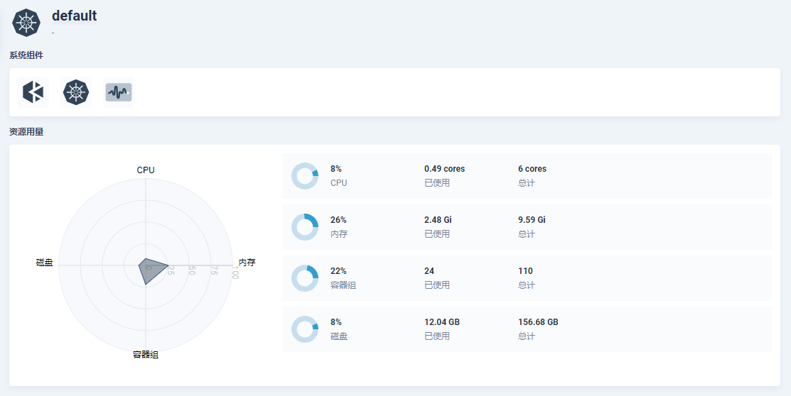
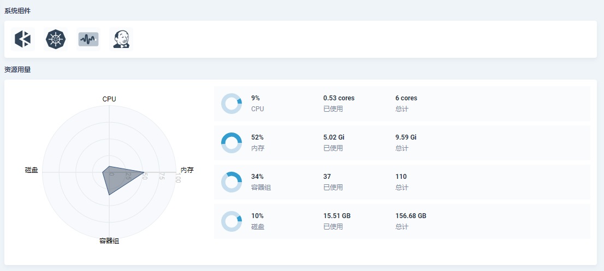
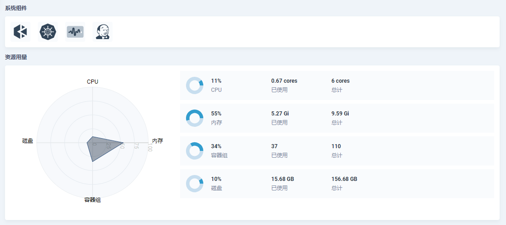
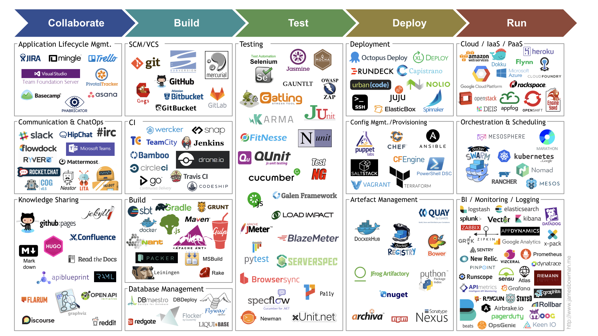
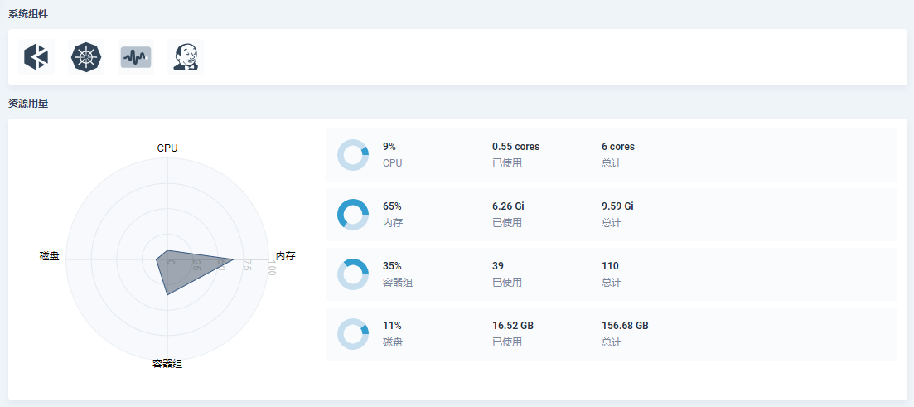
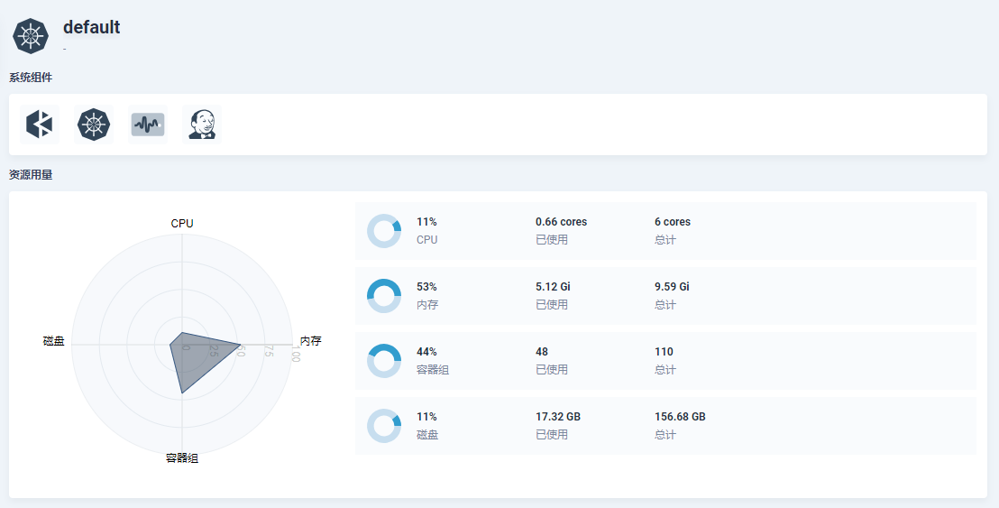
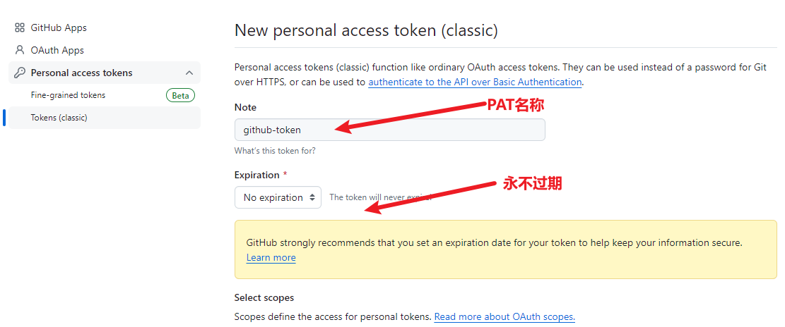
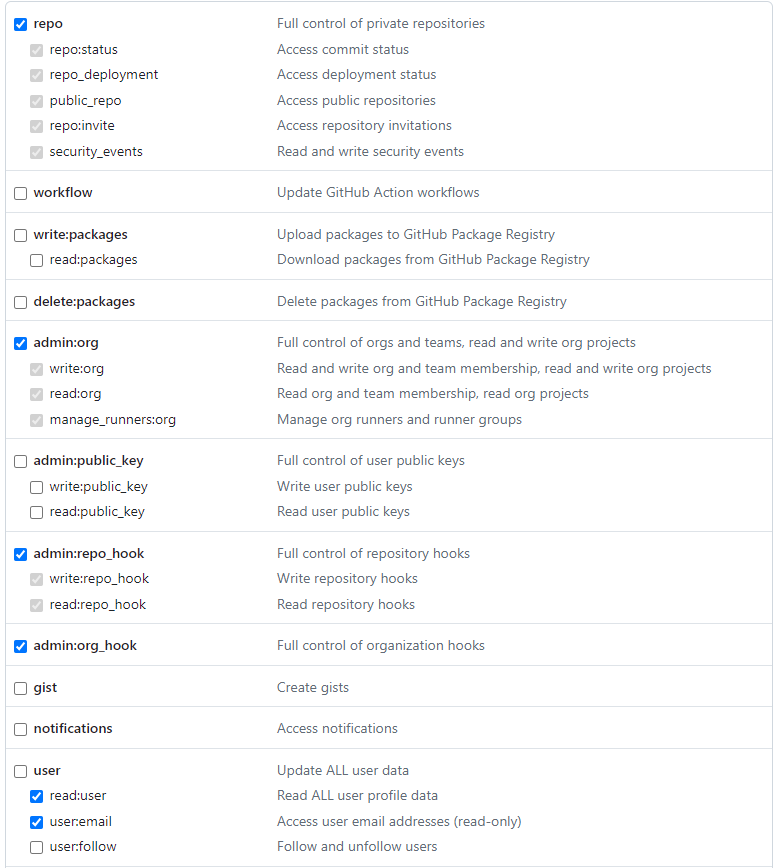

# 第1章 Kubesphere安装

KubeSphere Cloud 官网：https://kubesphere.com.cn/

KubeSphere 开源版官网：https://kubesphere.io/zh/

Github：https://github.com/kubesphere/kubesphere/blob/master/README_zh.md  可以查看与k8s版本关系

v3.4.1安装文档：

[在Kubernetes上最小化安装KubeSphere](https://kubesphere.io/zh/docs/v3.4/quick-start/minimal-kubesphere-on-k8s/)

[在Kubernetes上安装KubeSphere3.4.1](https://kubesphere.io/zh/docs/v3.4/installing-on-kubernetes/)

[启用可插拔组件](https://kubesphere.io/zh/docs/v3.4/pluggable-components/)

[从Kubenetes上卸载KubeSphere](https://kubesphere.io/zh/docs/v3.4/installing-on-kubernetes/uninstall-kubesphere-from-k8s/)

[KubeSphere 开源社区](https://ask.kubesphere.io/forum/)

## 0 先决条件？

### 0.1 Kubesphere是什么？

KubeSphere就是Java编程界的Spring。

KubeSphere，这是国内唯一一个开源的Kubernetes（k8s）发行版，它的开源不涉及任何商业意图，它不属于青云而属于社区，它极大地降低了使用Kubernetes的门槛，它的出现将加速中国企业向云原生迈进的步伐。
“发行版”的说法常用于Linux操作系统。比如，虽有Linux内核，而Ubuntu、CentOS等等叫做Linux发行版，对应的，Kubernetes就相当于内核，KubeSphere就是Kubernetes的发行版，正常人类是很难使用Linux内核和Kubenetes的，为了让大家用起来，要基于Linux内核和Kubernetes做很多周边配套，Linux和Kubenetes就好像一台光秃秃的汽车发动机，为了把它当车开，你起码得有车架子、轮胎、方向盘、刹车、……等等。
所以，开源KubeSphere的青云就像一个汽车厂，负责KubeSphere牌汽车各个组件的组装搭配，不过，这个汽车不需要花钱就能获取到，这就是青云开源KubeSphere的实质。它的意义在于加快了大家使用k8s发动机的进程，让大家都能开上KubeSphere牌汽车。
云原生能帮助企业做数字化转型，帮助企业用数字化转型获取竞争力。而KubeSphere可以让企业更快地上原生，开上汽车。

### 0.2 服务器规划

| 机器名 | 系统类型 | IP地址          | CPU  | 内存  | 部署内容 |
| ------ | -------- | --------------- | ---- | ----- | -------- |
| emon   | Rocky9.5 | 192.168.200.116 | 4核  | >=8G  | master   |
| emon2  | Rocky9.5 | 192.168.200.117 | 4核  | >=16G | worker   |
| emon3  | Rocky9.5 | 192.168.200.118 | 4核  | >=16G | worker   |

### 0.3 基础环境准备

参考：[基础环境准备](http://localhost:8751/devops/new/Kubernetes/01-%E7%AC%AC1%E7%AB%A0%20Kubeadmin%E5%AE%89%E8%A3%85K8S%20V1.23.html#_1-%E5%9F%BA%E7%A1%80%E7%8E%AF%E5%A2%83%E5%87%86%E5%A4%87)

### 0.4 安装Docker

参考：[Docker的安装与配置.md](http://localhost:8751/devops/new/Docker/01-%E7%AC%AC1%E7%AB%A0%20Docker%E7%9A%84%E5%AE%89%E8%A3%85%E4%B8%8E%E9%85%8D%E7%BD%AE.html)

### 0.5 安装Kubernetes

参考：[kubeadm创建K8S集群](http://localhost:8751/devops/new/Kubernetes/01-%E7%AC%AC1%E7%AB%A0%20Kubeadmin%E5%AE%89%E8%A3%85K8S%20V1.23.html#_3-kubeadm%E5%88%9B%E5%BB%BA%E9%9B%86%E7%BE%A4-%E4%BB%85master%E8%8A%82%E7%82%B9)


## 1 【过时】在Linux上以All-in-One模式安装（v3.4.1版本）

https://kubesphere.io/zh/docs/v3.4/quick-start/all-in-one-on-linux/

### 准备

- 服务器规划

| 机器名 | 系统类型 | IP地址          | CPU  | 内存  | 部署内容   |
| ------ | -------- | --------------- | ---- | ----- | ---------- |
| emon   | Rocky9.5 | 192.168.200.116 | 8核  | >=16G | All-in-One |

> 此配置可以开启全部组件

- 容器运行时

| 支持的容器运行时              | 版本     |
| :---------------------------- | :------- |
| Docker                        | 19.3.8 + |
| containerd                    | 最新版   |
| CRI-O（试验版，未经充分测试） | 最新版   |
| iSula（试验版，未经充分测试） | 最新版   |

- 检测依赖项要求

```bash
$ yum install -y socat conntrack-tools ebtables ipset
```

KubeKey 可以将 Kubernetes 和 KubeSphere 一同安装。针对不同的 Kubernetes 版本，需要安装的依赖项可能有所不同。您可以参考以下列表，查看是否需要提前在节点上安装相关的依赖项。

| 依赖项      | Kubernetes 版本 ≥ 1.18 | Kubernetes 版本 < 1.18 |
| :---------- | :--------------------- | :--------------------- |
| `socat`     | 必须                   | 可选但建议             |
| `conntrack` | 必须                   | 可选但建议             |
| `ebtables`  | 可选但建议             | 可选但建议             |
| `ipset`     | 可选但建议             | 可选但建议             |

- 下载 KubeKey

先执行以下命令以确保您从正确的区域下载 KubeKey。

```
$ export KKZONE=cn
```

```bash
$ curl -sfL https://get-kk.kubesphere.io | VERSION=v3.0.13 sh -
```

- 开始安装

```bash
$ ./kk create cluster --with-kubernetes v1.23.17 --with-kubesphere v3.4.1
```

```bash
#####################################################
###              Welcome to KubeSphere!           ###
#####################################################

Console: http://192.168.200.116:30880
Account: admin
Password: P@88w0rd
NOTES：
  1. After you log into the console, please check the
     monitoring status of service components in
     "Cluster Management". If any service is not
     ready, please wait patiently until all components 
     are up and running.
  2. Please change the default password after login.

#####################################################
https://kubesphere.io             2024-06-26 16:46:46
#####################################################
16:46:48 CST success: [emon]
16:46:48 CST Pipeline[CreateClusterPipeline] execute successfully
Installation is complete.

Please check the result using the command:

	kubectl logs -n kubesphere-system $(kubectl get pod -n kubesphere-system -l 'app in (ks-install, ks-installer)' -o jsonpath='{.items[0].metadata.name}') -f
```

- 查看kubesphere安装日志，验证安装结果

```bash
$ kubectl logs -n kubesphere-system $(kubectl get pod -n kubesphere-system -l 'app in (ks-install, ks-installer)' -o jsonpath='{.items[0].metadata.name}') -f
```

```bash
PLAY RECAP *********************************************************************
localhost                  : ok=30   changed=22   unreachable=0    failed=0    skipped=17   rescued=0    ignored=0   
Start installing monitoring
Start installing multicluster
Start installing openpitrix
Start installing network
**************************************************
Waiting for all tasks to be completed ...
task network status is successful  (1/4)
task openpitrix status is successful  (2/4)
task multicluster status is successful  (3/4)
task monitoring status is successful  (4/4)
**************************************************
Collecting installation results ...
#####################################################
###              Welcome to KubeSphere!           ###
#####################################################

Console: http://192.168.200.116:30880
Account: admin
Password: P@88w0rd
NOTES：
  1. After you log into the console, please check the
     monitoring status of service components in
     "Cluster Management". If any service is not
     ready, please wait patiently until all components 
     are up and running.
  2. Please change the default password after login.

#####################################################
https://kubesphere.io             2024-06-26 16:46:46
#####################################################
```

- 登录

http://192.168.200.116:30880

修改密码为： admin/Ks@12345

- 安装后资源概况



- 虚拟机挂起并恢复后k8s网络问题

    - 查看设备状态

  ```bash
  $ nmcli device status
  ```

    - 永久unmanaged

  ```bash
  $ vim /etc/NetworkManager/conf.d/99-unmanaged-devices.conf
  ```

  ```bash
  [keyfile]
  unmanaged-devices=interface-name:docker*;interface-name:veth*;interface-name:br-*;interface-name:vmnet*;interface-name:vboxnet*;interface-name:cni0;interface-name:cali*;interface-name:flannel*;interface-name:tun*
  ```

    - 重启NetworkManager

  ```bash
  $ systemctl restart NetworkManager
  ```

## 2 【过时】在Kubernetes上最小化安装KubeSphere（v3.4.1版本）

### 准备

- 服务器规划

| 机器名 | 系统类型 | IP地址          | CPU  | 内存 | 部署内容 |
| ------ | -------- | --------------- | ---- | ---- | -------- |
| emon   | Rocky9.5 | 192.168.200.116 | 2核  | >=8G | master   |
| emon2  | Rocky9.5 | 192.168.200.117 | 4核  | >=8G | worker   |
| emon3  | Rocky9.5 | 192.168.200.118 | 4核  | >=8G | worker   |

> 此配置可以开启全部组件

- 您的 Kubernetes 版本必须为：v1.20.x、v1.21.x、v1.22.x、v1.23.x、* v1.24.x、* v1.25.x 和 * v1.26.x。带星号的版本可能出现边缘节点部分功能不可用的情况。因此，如需使用边缘节点，推荐安装 v1.23.x。

- 确保您的机器满足最低硬件要求：CPU > 1 核，内存 > 2 GB。CPU 必须为 x86_64，暂时不支持 Arm 架构的 CPU。
- 在安装之前，需要配置 Kubernetes 集群中的**默认**存储类型。【重要】

<span style="color:green;font-weight:bold;">3台3G的服务器，安装后emon剩余1.2G/emon2剩余1.8G/emon3剩余1.8G。</span>

若直接按照官网安装，会报错：“Default StorageClass was not found”，原因是K8S没有默认的存储，需要安装storageclass和persistentVolumeClaim。

- 检查集群中是否有**默认** StorageClass（准备默认 StorageClass 是安装 KubeSphere 的前提条件）

<span style="color:red;font-weight:bold;">这里，也可以使用：[安装NFS存储抽象](http://localhost:8751/devops/new/Kubernetes/01-第1章 Kubeadmin安装K8S V1.23.html#_7-存储抽象)替换</span>

```bash
$ kubectl get sc
```

- 创建文件 default-storage-class.yaml

```yaml
apiVersion: storage.k8s.io/v1
kind: StorageClass
metadata:
  name: local
  annotations:
    storageclass.kubernetes.io/is-default-class: "true"
provisioner: kubernetes.io/no-provisioner
volumeBindingMode: WaitForFirstConsumer
```

- 创建文件 persistentVolumeClaim.yaml

```yaml
apiVersion: v1
kind: PersistentVolumeClaim
metadata:
  name: local-pve
  namespace: kubesphere-monitoring-system
spec:
  accessModes:
     - ReadWriteOnce
  resources:
    requests:
      storage: 20Gi
  storageClassName: local
```

- 剔除master节点的污点Taint，避免prometheus-k8s-0无法安装

```bash
# 确认master节点是否有Taint
$ kubectl describe node emon|grep Taint
Taints:             node-role.kubernetes.io/master:NoSchedule
# 去掉master节点的Taint
$ kubectl taint node emon node-role.kubernetes.io/master:NoSchedule-
node/emon untainted
```

### 下载kubersphere安装文件

```bash
$ wget https://github.com/kubesphere/ks-installer/releases/download/v3.4.1/kubesphere-installer.yaml
$ wget https://github.com/kubesphere/ks-installer/releases/download/v3.4.1/cluster-configuration.yaml
```

### 执行安装

- 安装存储

```bash
$ kubectl apply -f default-storage-class.yaml
$ kubectl apply -f persistentVolumeClaim.yaml
```

- 安装kubesphere

```bash
$ kubectl apply -f kubesphere-installer.yaml   
$ kubectl apply -f cluster-configuration.yaml
```

### 查看安装日志，确认安装成功

```bash
$ kubectl logs -n kubesphere-system $(kubectl get po -n kubesphere-system|grep 'ks-installer'|awk '{print $1}') -f
# 或者
$ kubectl logs -n kubesphere-system $(kubectl get pod -n kubesphere-system -l 'app in (ks-install, ks-installer)' -o jsonpath='{.items[0].metadata.name}') -f
```

```bash
PLAY RECAP *********************************************************************
localhost                  : ok=30   changed=22   unreachable=0    failed=0    skipped=17   rescued=0    ignored=0   
Start installing monitoring
Start installing multicluster
Start installing openpitrix
Start installing network
**************************************************
Waiting for all tasks to be completed ...
task network status is successful  (1/4)
task openpitrix status is successful  (2/4)
task multicluster status is successful  (3/4)
task monitoring status is successful  (4/4)
**************************************************
Collecting installation results ...
#####################################################
###              Welcome to KubeSphere!           ###
#####################################################

Console: http://192.168.200.116:30880
Account: admin
Password: P@88w0rd
NOTES：
  1. After you log into the console, please check the
     monitoring status of service components in
     "Cluster Management". If any service is not
     ready, please wait patiently until all components 
     are up and running.
  2. Please change the default password after login.

#####################################################
https://kubesphere.io             2024-06-25 23:10:14
#####################################################
```

### 登录

http://192.168.200.116:30880

- 安装后资源概况


## 3 在 Kubernetes 上快速安装 KubeSphere（v4.1.x版本）

### 准备

- 准备一台 Linux 主机，并确保其满足最低硬件要求：CPU > 2 核，内存 > 4 GB， 磁盘空间 > 40 GB。
- 您需要提前[安装 Helm](https://helm.sh/zh/docs/intro/install/)。

### 操作步骤

#### 1 （可选）安装Kubernets集群

如果你没有可用的Kubernetes集群，执行以下命令快速创建一个Kubernetes集群。

a、如果你访问GitHub/Googleapis受限，请登录Linux主机，执行以下命令设置下载区域。

```bash
$ export KKZONE=cn
```

b、执行以下命令安装⼯具 KubeKey。

下载完成后当前目录下将生成 KubeKey 二进制文件 **kk**。

```bash
$ curl -sfL https://get-kk.kubesphere.io | sh -
```

c、执行以下命令安装依赖项

```bash
$ dnf install -y socat conntrack
```

d、执行以下命令快速创建一个Kubernetes集群。

```bash
$ ./kk create cluster --with-local-storage  --with-kubernetes v1.23.17 --container-manager containerd  -y
```

#### 2 安装KubeSphere

如果你已经拥有可用的Kubernetes集群，执行以下命令通过`helm`安装KubeSphere的核心组件KubeSphere Core。

```bash
# 如果无法访问 charts.kubesphere.io, 可将 charts.kubesphere.io 替换为 charts.kubesphere.com.cn
$ helm upgrade --install -n kubesphere-system --create-namespace ks-core https://charts.kubesphere.io/main/ks-core-1.1.4.tgz --debug --wait
```

> 说明：
>
> 如果你访问Docker Hub受限，请在命令后添加如下配置，修改默认的镜像拉取地址。
>
> ```bash
> --set global.imageRegistry=swr.cn-southwest-2.myhuaweicloud.com/ks
> ```
>
> ```bash
> --set extension.imageRegistry=swr.cn-southwest-2.myhuaweicloud.com/ks
> ```

#### 3 安装完成

安装完成后，输出信息会显示KubeSphere Web控制台的IP地址和端口号，默认的NodePort是30880.

```
......
NOTES:
Thank you for choosing KubeSphere Helm Chart.

Please be patient and wait for several seconds for the KubeSphere deployment to complete.

1. Wait for Deployment Completion

    Confirm that all KubeSphere components are running by executing the following command:

    kubectl get pods -n kubesphere-system
2. Access the KubeSphere Console

    Once the deployment is complete, you can access the KubeSphere console using the following URL:  

    http://192.168.200.116:30880

3. Login to KubeSphere Console

    Use the following credentials to log in:

    Account: admin
    Password: P@88w0rd

NOTE: It is highly recommended to change the default password immediately after the first login.
For additional information and details, please visit https://kubesphere.io.
```

- 执行以下命令检查Pod状态

```bash
$ kubectl get pods -n kubesphere-system
```

当Pod状态都为Running时，使用默认的账户和密码（admin/P@88w0rd）通过`<NodeIP>:30880`访问KubeSphere Web控制台。

> 取决于您的网络环境，您可能需要配置流量转发规则并在防火墙中放行 30880 端口。

- 首次登录后修改密码

http://192.168.200.116:30880

| 用户名 | 原密码   | 新密码   |
| ------ | -------- | -------- |
| admin  | P@88w0rd | P@88word |


## 3、启用可插拔组件

### 3.1、DevOps组件

- 安装后资源概况



### 3.2、应用商店组件

- 安装后资源概况



### 3.3、安装OpenELB负载均衡器

OpenELB安装：https://github.com/openelb/openelb/blob/master/README_zh.md

[openelb0.5版官网文档](https://openelb-05x-openelb.vercel.app/docs/getting-started/)

[openelb最新版官网文档](https://openelb.io/docs/getting-started/)

#### 3.3.1、通过应用商店OpenELB(vip模式)

备注：安装的是0.5.0版本。

##### 1、准备企业空间与项目

- 创建企业空间

<span style="color:green;font-weight:bold;">登录 admin 创建企业空间</span>

企业空间： openelb 邀请管理员 admin

- 创建项目

<span style="color:green;font-weight:bold;">登录 admin 在企业空间创建项目</span>

企业空间：openelb 创建项目 openelb

##### 2、安装

在项目中，点击【应用负载】=>【应用】=>【创建】=>【从应用商店】=>搜索“OpenELB”并安装。

- 查看安装结果

```bash
$ kubectl get po -n openelb
```

##### 3、创建默认Eip对象

```bash
$ vim vip-eip.yaml
```

```yaml
apiVersion: network.kubesphere.io/v1alpha2
kind: Eip
metadata:
  name: vip-eip
  annotations:
	# 指定是默认EIP
    eip.openelb.kubesphere.io/is-default-eip: "true"
spec:
  # 一个或多个ip地址，需要与k8s集群节点属于同一个网段
  address: 192.168.32.91-192.168.32.100
  interface: ens33
  protocol: vip
```

```bash
$ kubectl apply -f vip-eip.yaml
# 查看eip
$ kubectl get eip
```

> 备注：若不创建一个默认的eip，则创建的service需要配置注解：
>
> ```yaml
>    lb.kubesphere.io/v1alpha1: openelb
>    protocol.openelb.kubesphere.io/v1alpha1: vip
>    eip.openelb.kubesphere.io/v1alpha2: vip-eip
> ```

#### 3.3.2、命令行安装OpenELB(layer2模式)

备注：安装的是0.5.0版本。

##### 1、下载并安装

```bash
$ wget https://raw.githubusercontent.com/openelb/openelb/release-0.5/deploy/openelb.yaml
kubectl apply -f openelb.yaml
```

##### 2、查看安装结果

```bash
$ kubectl get po -n openelb-system
```

##### 3、为kube-proxy启用strictARP

- 编辑kube-proxy配置

```bash
$ kubectl edit configmap kube-proxy -n kube-system
```

- 设置`data.config.conf.ipvs.strictARP`为true

```bash
    ipvs:
      strictARP: true
```

- 重启kube-proxy

```bash
$ kubectl rollout restart daemonset kube-proxy -n kube-system
```

##### 4、为OpenELB指定NIC网络适配器

如果OpenELB的安装节点有多个网络适配器，需要指定OpenELB在Layer 2模式下使用哪一个。如果节点只有1个网络适配器，就不需要指定了。

```bash
$ kubectl annotate nodes emon layer2.openelb.kubesphere.io/v1alpha1="192.168.200.116"
```

##### 5、创建默认Eip对象

```bash
$ vim layer2-eip.yaml
```

```yaml
apiVersion: network.kubesphere.io/v1alpha2
kind: Eip
metadata:
  name: layer2-eip
  annotations:
	# 指定是默认EIP
    eip.openelb.kubesphere.io/is-default-eip: "true"
spec:
  # 一个或多个ip地址，需要与k8s集群节点属于同一个网段；注意：请为网卡配置如下地址段的ip，不然外部无法访问！！！
  address: 192.168.32.91-192.168.32.100
  interface: ens33
  protocol: layer2
```

```bash
$ kubectl apply -f layer2-eip.yaml
# 查看eip
$ kubectl get eip
```

> 备注：若不创建一个默认的eip，则创建的service需要配置注解：
>
> ```yaml
>    lb.kubesphere.io/v1alpha1: openelb
>    protocol.openelb.kubesphere.io/v1alpha1: layer2
>    eip.openelb.kubesphere.io/v1alpha2: layer2-eip
> ```

### 3.4、配置集群网关设置

admin 账户操作

- 群设置=>网关设置=>启用网关

    - LoadBalancer
        - 负载均衡器提供商：默认 QingCloud Kubernets Engine，这里选择 OpenELB（选择哪一个都没关系，使用的是默认EIP）
        - 注解：默认

    - 点击确定

> 由于上面创建了默认eip，这里可以不用配置注解

- 查看是否启用成功

```bash
# 查看 EXTERNAL-IP 字段是否已经分配了eip地址，比如：192.168.32.91
$ kubectl -n kubesphere-controls-system get svc
```

<span style="color:green;font-weight:bold;">注意：192.168.32.91可以通过网络适配器ens33添加新ip的方式达到宿主机本地DNS访问</span>

## 4、用户-企业空间-项目

- 登录 admin 创建如下用户

| 用户名          | 密码     | 角色                      | 作用                                                         |
| --------------- | -------- | ------------------------- | ------------------------------------------------------------ |
| admin           | Ks@12345 | platform-admin            | 平台管理员，可以管理平台内的所有资源。                       |
| ws-manager      | Ws@12345 | platform-self-provisioner | 创建企业空间并成为所创建企业空间的管理员。                   |
| ws-admin        | Ws@12345 | platform-regular          | 平台普通用户，在被邀请加入企业空间或集群之前没有任何资源操作权限。 |
| project-admin   | Ws@12345 | platform-regular          | 平台普通用户，在被邀请加入企业空间或集群之前没有任何资源操作权限。 |
| project-regular | Ws@12345 | platform-regular          | 平台普通用户，在被邀请加入企业空间或集群之前没有任何资源操作权限。 |

- <span style="color:green;font-weight:bold;">登录 ws-manager 创建企业空间</span>

企业空间： demo-workspace 邀请管理员 ws-admin

- 登录 ws-admin 邀请 project-admin/project-regular 进入企业空间，分别授予 demo-workspace-self-provisioner 和 demo-workspace-viewer 角色。<span style="color:red;font-weight:bold;">可编辑项目配额、默认容器配额</span>

> 备注：
>
> 实际角色名称的格式：`<workspace name>-<role name>`。例如，在名为 demo-workspace 的企业空间中，角色viewer的实际角色名称为 demo-workspace-viewer

| 用户名          | 角色             | 企业空间角色                    |                                                              |
| --------------- | ---------------- | ------------------------------- | ------------------------------------------------------------ |
| ws-admin        | platform-regular | demo-workspace-admin            | 管理指定企业空间中的所有资源（在此示例中，此用户用于邀请新成员加入企业空间）。 |
| project-admin   | platform-regular | demo-workspace-self-provisioner | 创建和管理项目以及 DevOps 项目，并邀请新成员加入项目。       |
| project-regular | platform-regular | demo-workspace-viewer           | `project-regular` 将由 `project-admin` 邀请至项目或 DevOps 项目。该用户将用于在指定项目中创建工作负载、流水线和其他资源。 |

- <span style="color:green;font-weight:bold;">登录 project-admin  创建项目 demo-project</span>，邀请 project-regular 进入项目，并授权 operator 角色。<span style="color:red;font-weight:bold;">可编辑项目配额（仅1次）、默认容器配额</span>

| 用户名          | 角色             | 企业空间角色                    | 项目角色 |
| --------------- | ---------------- | ------------------------------- | -------- |
| project-admin   | platform-regular | demo-workspace-self-provisioner | admin    |
| project-regular | platform-regular | demo-workspace-viewer           | operator |

- <span style="color:green;font-weight:bold;">登录 project-admin  创建项目 demo-devops</span>，邀请 project-regular 进入项目，并授权 operator 角色。<span style="color:red;font-weight:bold;">可编辑项目配额（仅1次）、默认容器配额</span>

| 用户名          | 角色             | 企业空间角色                    | 项目角色 |
| --------------- | ---------------- | ------------------------------- | -------- |
| project-admin   | platform-regular | demo-workspace-self-provisioner | admin    |
| project-regular | platform-regular | demo-workspace-viewer           | operator |



## 5、DevOps项目部署

### 5.1、准备工作

您需要[启用 KubeSphere DevOps 系统](https://www.kubesphere.io/zh/docs/v3.3/pluggable-components/devops/)。

注意：若内存不是很大，建议开启 devops 时内存可以限制为2G。

### 5.2、[将 SonarQube 集成到流水线](https://kubesphere.io/zh/docs/v3.4/devops-user-guide/how-to-integrate/sonarqube/)

要将 SonarQube 集成到您的流水线，必须先安装 SonarQube 服务器。

- 登录

http://192.168.200.116:30712

默认用户名密码：admin/admin

修改密码为： admin/Sq@12345

- 安装后资源概况



### 5.3、将 Harbor 集成到流水线

在应用商店安装Harbor

- 创建企业空间

<span style="color:green;font-weight:bold;">登录 admin 创建企业空间</span>

企业空间： harbor 邀请管理员 admin

- 创建项目

<span style="color:green;font-weight:bold;">登录 admin 在企业空间创建项目</span>

企业空间：harbor 创建项目 harbor

- 安装

在项目中，点击【应用负载】=>【应用】=>【创建】=>【从应用商店】=>搜索“Harbor”并安装。

> 如果不想使用ingress网关访问Harbor，则需要进行以下设置，然后点击**安装**
>
> 请按照如下指示的”修改x”进行修改（不是复制粘贴）

```yaml
expose:
  type: nodePort # 修改1：ingress => nodePort
  tls:
    enabled: false # 修改2：true=>false
      commonName: "192.168.200.116" # 修改3：""=>将commonName更改成你自己的值
externalURL: http://192.168.200.116:30002 # 修改4：使用自己的ipi
```

更改了应用设置后，点击安装即可！等待项目harbor下【应用负载】变成 running 后服务即可使用。

- 登录

http://192.168.200.116:30002

admin/Harbor12345

- 获取Harbor凭证

1. 安装 Harbor 后，请访问 `<NodeIP>:30002` 并使用默认帐户和密码 (`admin/Harbor12345`) 登录控制台。在左侧导航栏中点击**项目**并在**项目**页面点击**新建项目**。
2. 在弹出的对话框中，设置项目名称  ks-devops-harbor  并点击**确定**。
3. 点击刚刚创建的项目，在**机器人帐户**选项卡下点击**添加机器人帐户**。
4. 在弹出的对话框中，为机器人帐户设置名称  robot-test 以及设置永不过期，并点击**添加**。请确保在**权限**中勾选推送制品的权限选框。
5. 在弹出的对话框中，点击**导出到文件中**，保存该令牌。

- 启用 Insecure Registry

您需要配置 Docker，使其忽略您 Harbor 仓库的安全性。

1. 在您的主机上运行 `vim /etc/docker/daemon.json` 命令以编辑 `daemon.json` 文件，输入以下内容并保存更改。

```json
{
  "insecure-registries" : ["192.168.200.116:30002"]
}
```

2. 运行以下命令重启 Docker，使更改生效。

```bash
# 执行重启后，会影响到k8s环境，需要等待一会才可以继续访问k8s
$ systemctl daemon-reload && systemctl restart docker
```

- 安装后资源概况



- 测试

    - 创建凭证

    1. 以 `project-regular` 身份登录 KubeSphere 控制台，转到您的 DevOps 项目，在 **DevOps 项目设置**下的**凭证**页面为 Harbor 创建凭证。
    2. 在**创建凭证**页面，设置凭证 ID (`robot-test`)，**类型**选择**用户名和密码**。**用户名**字段必须和您刚刚下载的 JSON 文件中 `name` 的值相同，并在**密码/令牌**中输入该文件中 `token` 的值。
    3. 点击**确定**以保存。

    - 创建流水

    1. 转到**流水线**页面，点击**创建**。在**基本信息**选项卡，输入名称 (`demo-pipeline`)，然后点击**下一步**。
    2. **高级设置**中使用默认值，点击**创建**。

    - 编辑Jenkinsfile

    1. 点击该流水线进入其详情页面，然后点击**编辑 Jenkinsfile**。
    2. 将以下内容复制粘贴至 Jenkinsfile。请注意，您必须将 `REGISTRY`、`HARBOR_NAMESPACE`、`APP_NAME` 和 `HARBOR_CREDENTIAL` 替换为您自己的值。

  ```groovy
  pipeline {  
    agent {
      node {
        label 'maven'
      }
    }
  
    environment {
      // 您 Harbor 仓库的地址。
      REGISTRY = '192.168.200.116:30002'
      // 项目名称。
      // 请确保您的机器人帐户具有足够的项目访问权限。
      HARBOR_NAMESPACE = 'ks-devops-harbor'
      // Docker 镜像名称。
      APP_NAME = 'docker-example'
      // ‘robot-test’是您在 KubeSphere 控制台上创建的凭证 ID。
      HARBOR_CREDENTIAL = credentials('robot-test')
    }
  
    stages {
      stage('docker login') {
        steps{
          container ('maven') {
            // 请替换 -u 后面的 Docker Hub 用户名，不要忘记加上 ''。您也可以使用 Docker Hub 令牌。
            sh '''echo $HARBOR_CREDENTIAL_PSW | docker login $REGISTRY -u 'robot$robot-test' --password-stdin'''
          }
        }  
      }
  
      stage('build & push') {
        steps {
          container ('maven') {
            sh 'git clone https://github.com/kstaken/dockerfile-examples.git'
            sh 'cd dockerfile-examples/rethinkdb && docker build -t $REGISTRY/$HARBOR_NAMESPACE/$APP_NAME:devops-test .'
            sh 'docker push  $REGISTRY/$HARBOR_NAMESPACE/$APP_NAME:devops-test'
          }
        }
      }
    }
  }
  ```

    - 运行流水线

  保存该 Jenkinsfile，KubeSphere 会自动在图形编辑面板上创建所有阶段和步骤。点击**运行**来运行该流水线。如果一切运行正常，Jenkins 将推送镜像至您的 Harbor 仓库。

### 5.4、[使用 Jenkinsfile 创建流水线涉及的凭证](https://kubesphere.io/zh/docs/v3.4/devops-user-guide/how-to-use/pipelines/create-a-pipeline-using-jenkinsfile/)

| 凭证ID          | 类型                                     |
| --------------- | ---------------------------------------- |
| harbor-id       | 用户名和密码（密码填写Harbor机器人令牌） |
| github-id       | 用户名和密码（密码填写PAT令牌）          |
| demo-kubeconfig | kubeconfig                               |
| github-token    | 访问令牌                                 |
| gitee-id        | 用户名和密码（密码填写私人令牌）         |
| gitee-token     | 访问令牌                                 |

其中，github-id的创建方式：





### 5.5、为 KubeSphere 中的 Jenkins 安装插件（可选）

- 获取Jenkins地址

1. 运行以下命令获取 Jenkins 的地址。

```bash
export NODE_PORT=$(kubectl get --namespace kubesphere-devops-system -o jsonpath="{.spec.ports[0].nodePort}" services devops-jenkins)
export NODE_IP=$(kubectl get nodes --namespace kubesphere-devops-system -o jsonpath="{.items[0].status.addresses[0].address}")
echo http://$NODE_IP:$NODE_PORT
```

2. 您会得到类似如下的输出。您可以通过输出的地址使用自己的 KubeSphere 用户和密码（例如 `admin/P@88w0rd`）访问 Jenkins 面板。

http://192.168.200.116:30180

- 在Jenkins面板上安装插件

1. 登录 Jenkins 面板，点击**系统管理**。

2. 在**系统管理**页面，下滑到**插件管理**并点击。

3. 点击**可选插件**选项卡，您必须使用搜索框来搜索所需插件。例如，您可以在搜索框中输入 `git`，勾选所需插件旁边的复选框，然后按需点击**直接安装**或**下载待重启后安装**。

   备注

   Jenkins 的插件相互依赖。安装插件时，您可能还需要安装其依赖项。

4. 如果已预先下载 HPI 文件，您也可以点击**高级**选项卡，上传该 HPI 文件作为插件进行安装。

5. 在**已安装**选项卡，可以查看已安装的全部插件。能够安全卸载的插件将会在右侧显示**卸载**按钮。

6. 在**可更新**选项卡，先勾选插件左侧的复选框，再点击**下载待重启后安装**，即可安装更新的插件。您也可以点击**立即获取**按钮检查更新。

## 9、FAQ

### FAQ1：如何重置用户密码

https://www.kubesphere.io/zh/docs/v3.4/faq/access-control/forgot-password/

### FAQ2：玩转kubesphere之cni网络插件异常问题

问题描述：Failed to create pod sandbox: rpc error: code = Unknown desc = [ ......getting ClusterInformation: connection is unauthorized: Unauthorized

问题解决：https://blog.csdn.net/weixin_40807433/article/details/135240300

简述：删除异常节点的容器组 calico-node，让它拉起重新同步数据即可修复。

### FAQ3：KubeSphere 镜像构建器（S2I）服务证书过期(x509)问题

问题描述：Internal error occurred: failed calling webhook "s2ibuilder.kb.io": failed to call webhook......x509: certificate has expired or is not yet valid

问题解决：https://ask.kubesphere.io/forum/d/23239-kubesphere-jing-xiang-gou-jian-qi-s2ifu-wu-zheng-shu-guo-qi-x509wen-ti

简述：这个是由于之前 DevOps S2I 内置的证书过期时间是 2024.02.14 ，现在只需要更新证书就可以了；