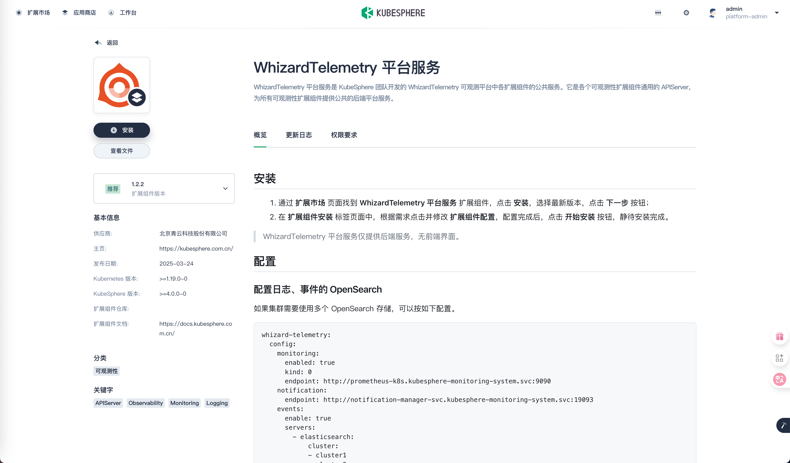
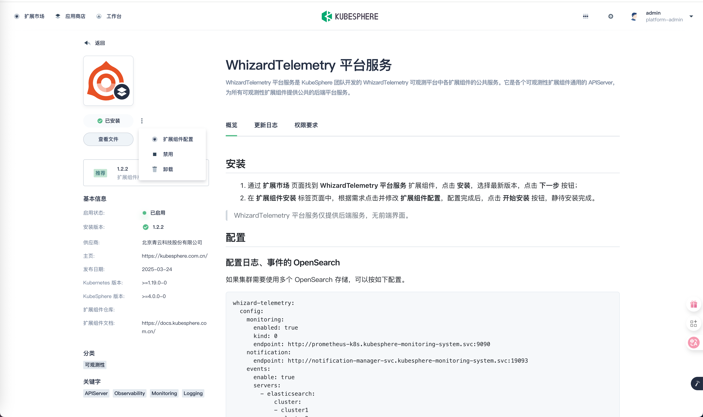
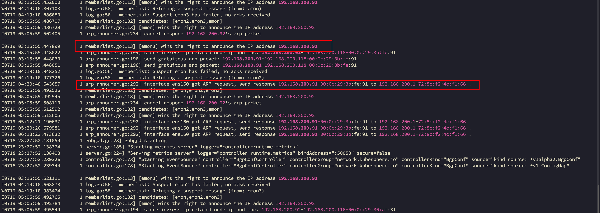

# 第1章 Kubesphere安装

KubeSphere Cloud 官网：https://kubesphere.com.cn/

KubeSphere 开源版官网：https://kubesphere.io/zh/

Github：https://github.com/kubesphere/kubesphere/blob/master/README_zh.md  可以查看与k8s版本关系

v3.4.1安装文档：

[在Kubernetes上最小化安装KubeSphere](https://kubesphere.io/zh/docs/v3.4/quick-start/minimal-kubesphere-on-k8s/)

[在Kubernetes上安装KubeSphere3.4.1](https://kubesphere.io/zh/docs/v3.4/installing-on-kubernetes/)

[启用可插拔组件](https://kubesphere.io/zh/docs/v3.4/pluggable-components/)

[从Kubenetes上卸载KubeSphere](https://kubesphere.io/zh/docs/v3.4/installing-on-kubernetes/uninstall-kubesphere-from-k8s/)

[KubeSphere 开源社区](https://ask.kubesphere.io/forum/)

v4.1.3安装文档：

[在 Kubernetes 上快速安装 KubeSphere](https://kubesphere.io/zh/docs/v4.1/02-quickstart/01-install-kubesphere/)

[在 Linux 上安装 Kubernetes 和 KubeSphere](https://kubesphere.io/zh/docs/v4.1/03-installation-and-upgrade/02-install-kubesphere/02-install-kubernetes-and-kubesphere/)

## 0 先决条件？

### 0.1 Kubesphere是什么？

KubeSphere就是Java编程界的Spring。

KubeSphere，这是国内唯一一个开源的Kubernetes（k8s）发行版，它的开源不涉及任何商业意图，它不属于青云而属于社区，它极大地降低了使用Kubernetes的门槛，它的出现将加速中国企业向云原生迈进的步伐。
“发行版”的说法常用于Linux操作系统。比如，虽有Linux内核，而Ubuntu、CentOS等等叫做Linux发行版，对应的，Kubernetes就相当于内核，KubeSphere就是Kubernetes的发行版，正常人类是很难使用Linux内核和Kubenetes的，为了让大家用起来，要基于Linux内核和Kubernetes做很多周边配套，Linux和Kubenetes就好像一台光秃秃的汽车发动机，为了把它当车开，你起码得有车架子、轮胎、方向盘、刹车、……等等。
所以，开源KubeSphere的青云就像一个汽车厂，负责KubeSphere牌汽车各个组件的组装搭配，不过，这个汽车不需要花钱就能获取到，这就是青云开源KubeSphere的实质。它的意义在于加快了大家使用k8s发动机的进程，让大家都能开上KubeSphere牌汽车。
云原生能帮助企业做数字化转型，帮助企业用数字化转型获取竞争力。而KubeSphere可以让企业更快地上原生，开上汽车。

### 0.2 服务器规划

| 机器名 | 系统类型 | IP地址          | CPU  | 内存  | 部署内容 |
| ------ | -------- | --------------- | ---- | ----- | -------- |
| emon   | Rocky9.5 | 192.168.200.116 | 4核  | >=16G | master   |
| emon2  | Rocky9.5 | 192.168.200.117 | 4核  | >=16G | worker   |
| emon3  | Rocky9.5 | 192.168.200.118 | 4核  | >=16G | worker   |

### 0.3 基础环境准备

参考：[基础环境准备](http://localhost:8751/devops/new/Kubernetes/01-%E7%AC%AC1%E7%AB%A0%20Kubeadmin%E5%AE%89%E8%A3%85K8S%20V1.23.html#_1-%E5%9F%BA%E7%A1%80%E7%8E%AF%E5%A2%83%E5%87%86%E5%A4%87)

### 0.4 安装Docker【若用KK安装，请忽略】

参考：[Docker的安装与配置.md](http://localhost:8751/devops/new/Docker/01-%E7%AC%AC1%E7%AB%A0%20Docker%E7%9A%84%E5%AE%89%E8%A3%85%E4%B8%8E%E9%85%8D%E7%BD%AE.html)

### 0.5 安装Kubernetes【若用KK安装，请忽略】

参考：[kubeadm创建K8S集群](http://localhost:8751/devops/new/Kubernetes/01-%E7%AC%AC1%E7%AB%A0%20Kubeadmin%E5%AE%89%E8%A3%85K8S%20V1.23.html#_3-kubeadm%E5%88%9B%E5%BB%BA%E9%9B%86%E7%BE%A4-%E4%BB%85master%E8%8A%82%E7%82%B9)

### 0.6 **创建数据目录**

#### 0.6.1 创建 **OpenEBS** 本地数据根目录

```bash
$ mkdir -p /data/openebs/local
```

#### 0.6.2 创建 **Containerd** 数据目录

```bash
$ mkdir -p /data/containerd
```

#### 0.6.3 创建 Containerd 数据目录软连接

```bash
$ ln -snf /data/containerd /var/lib/containerd
```

:::info

**说明：** KubeKey 到 v3.1.1 版为止，一直不支持在部署的时候更改 Containerd 的数据目录，只能用这种目录软链接的方式，变相增加存储空间（**也可以提前手工安装 Containerd**）。

:::

## 1 部署 Kubernetes 集群

本文利用 KubeSphere 出品的 KubeKey 工具，部署一套包含**三个节点**， **Control 和 Worker 复用**的 K8s 高可用集群。

将 **Control 1节点** 作为部署节点，执行下面的操作。

### 1.1 下载 KubeKey

- 下载最新版（v3.1.10）

```bash
$ mkdir /k8s_soft/kubekey
$ cd /k8s_soft/kubekey/

# 选择中文区下载(访问 GitHub 受限时使用)
$ export KKZONE=cn
$ curl -sfL https://get-kk.kubesphere.io | sh -
```

- 查看 KubeKey 支持的 Kubernetes 版本列表

```bash
$ ./kk version --show-supported-k8s
```

> KubeKey 支持的 K8s 版本相对较新。本文选择 v1.30.6，而在生产环境中，建议选择 v1.28.15 或其他次要版本为双数且补丁版本超过 5 的版本，以确保更高的稳定性和兼容性。建议避免选择过老的版本，毕竟目前 v1.31.2 已经发布，可以为集群提供更强的功能和安全性。

### 1.2 创建 Kubernetes 集群部署配置

1. 创建集群配置文件

本文选择了 **v1.30.6**。因此，指定配置文件名称为 **ksp-k8s-v1306.yaml**，如果不指定，默认的文件名为 **config-sample.yaml**。

```bash
$ ./kk create config -f ksp-k8s-v1306.yaml --with-kubernetes v1.30.6
```

> **注意：**
>
> - 安装完成后，请勿删除安装配置文件 **ksp-k8s-v1306.yaml**，后续进行节点扩容、卸载等操作时仍需要使用该文件。如果该文件丢失，您需要重新创建安装配置文件。
> - 生成的默认配置文件内容较多，请参阅 [KubeKey 配置示例](https://github.com/kubesphere/kubekey/blob/master/docs/config-example.md) 了解完整配置说明。

2. 修改配置文件

请使用 `vi` 编辑器，编辑配置文件 `ksp-k8s-v1306.yaml`，修改 **kind: Cluster** 小节中 hosts 和 roleGroups 等信息，修改说明如下：

- metadata.name：自定义集群名称 **kspxlab**，默认值 **sample**

- hosts：指定节点的 IP、ssh 用户、ssh 密码；若是arm架构，请指定 arch
- roleGroups：指定 3 个 etcd、control-plane 节点，并复用为 worker 节点
- internalLoadbalancer： 启用内置的 HAProxy 负载均衡器
- domain：自定义域名 **lb.kspxlab.local**，没特殊需求可使用默认值 **lb.kubesphere.local**
- clusterName：自定义 **kspxlab.local**，没特殊需求可使用默认值 **cluster.local**
- autoRenewCerts：该参数可以实现证书到期自动续期，默认为 **true**
- containerManager：容器运行时使用 **containerd**
- storage.openebs.basePath：**默认没有，新增配置**，指定 openebs 默认存储路径为 **/data/openebs/local**
- registry.privateRegistry：**可选配置，** 解决 Docker 官方镜像不可用的问题
- registry.namespaceOverride： **可选配置，** 解决 Docker 官方镜像不可用的问题

修改后的完整示例如下：

```yaml

apiVersion: kubekey.kubesphere.io/v1alpha2
kind: Cluster
metadata:
  name: kspxlab
spec:
  hosts:
  - {name: emon, address: 192.168.200.116, internalAddress: 192.168.200.116, user: root, password: "root123", arch: arm64}
  - {name: emon2, address: 192.168.200.117, internalAddress: 192.168.200.117, user: root, password: "root123", arch: arm64}
  - {name: emon3, address: 192.168.200.118, internalAddress: 192.168.200.118, user: root, password: "root123", arch: arm64}
  roleGroups:
    etcd:
    - emon
    - emon2
    - emon3
    control-plane:
    - emon
    - emon2
    - emon3
    worker:
    - emon
    - emon2
    - emon3
  controlPlaneEndpoint:
    ## Internal loadbalancer for apiservers 
    internalLoadbalancer: haproxy # 如需部署⾼可⽤集群，且⽆负载均衡器可⽤，可开启该参数，做集群内部负载均衡
    domain: lb.kubesphere.local
    address: ""
    port: 6443
  kubernetes:
    version: v1.30.6
    clusterName: cluster.local
    autoRenewCerts: true
    containerManager: containerd # 部署 kubernetes v1.24+ 版本，建议将 containerManager 设置为 containerd
  etcd:
    type: kubekey
  network:
    plugin: calico
    kubePodsCIDR: 10.233.0.0/17
    kubeServiceCIDR: 10.96.0.0/16
    ## multus support. https://github.com/k8snetworkplumbingwg/multus-cni
    multusCNI:
      enabled: false
  storage:
    openebs:
      basePath: /data/openebs/local # 默认没有的新增配置，base path of the local PV 
  registry:
    privateRegistry: "registry.cn-beijing.aliyuncs.com" # 使用 KubeSphere 在阿里云的镜像仓库
    namespaceOverride: "kubesphereio"
    registryMirrors: []
    insecureRegistries: []
  addons: []

```

### 1.3 部署 K8s 集群

使用上面生成的配置文件，执行下面的命令，创建 K8s 集群。

```bash
$ export KKZONE=cn
$ ./kk create cluster -f ksp-k8s-v1306.yaml --with-local-storage
```

> 说明：
>
> 如需使用 openebs localpv，可在命令后添加参数 --with-local-storage。如需对接其他存储，可在配置文件 addons 中添加配置相关存储插件，或 Kubernetes 集群部署完成后自行安装。

命令执行后，首先 **Kubekey** 会检查部署 K8s 的依赖及其他详细要求。通过检查后，系统将提示您确认安装。输入 **yes** 并按 **ENTER** 继续部署。

```bash


 _   __      _          _   __           
| | / /     | |        | | / /           
| |/ / _   _| |__   ___| |/ /  ___ _   _ 
|    \| | | | '_ \ / _ \    \ / _ \ | | |
| |\  \ |_| | |_) |  __/ |\  \  __/ |_| |
\_| \_/\__,_|_.__/ \___\_| \_/\___|\__, |
                                    __/ |
                                   |___/

10:43:06 CST [GreetingsModule] Greetings
10:43:07 CST message: [emon3]
Greetings, KubeKey!
10:43:07 CST message: [emon2]
Greetings, KubeKey!
10:43:07 CST message: [emon]
Greetings, KubeKey!
10:43:07 CST success: [emon3]
10:43:07 CST success: [emon2]
10:43:07 CST success: [emon]
10:43:07 CST [NodePreCheckModule] A pre-check on nodes
10:43:07 CST success: [emon]
10:43:07 CST success: [emon2]
10:43:07 CST success: [emon3]
10:43:07 CST [ConfirmModule] Display confirmation form
+-------+------+------+---------+----------+-------+-------+---------+-----------+--------+--------+------------+------------+-------------+------------------+--------------+
| name  | sudo | curl | openssl | ebtables | socat | ipset | ipvsadm | conntrack | chrony | docker | containerd | nfs client | ceph client | glusterfs client | time         |
+-------+------+------+---------+----------+-------+-------+---------+-----------+--------+--------+------------+------------+-------------+------------------+--------------+
| emon  | y    | y    | y       | y        | y     | y     | y       | y         | y      |        | y          |            |             |                  | CST 10:43:07 |
| emon2 | y    | y    | y       | y        | y     | y     | y       | y         | y      |        | y          |            |             |                  | CST 10:43:07 |
| emon3 | y    | y    | y       | y        | y     | y     | y       | y         | y      |        | y          |            |             |                  | CST 10:43:07 |
+-------+------+------+---------+----------+-------+-------+---------+-----------+--------+--------+------------+------------+-------------+------------------+--------------+

This is a simple check of your environment.
Before installation, ensure that your machines meet all requirements specified at
https://github.com/kubesphere/kubekey#requirements-and-recommendations

Install k8s with specify version:  v1.30.6

Continue this installation? [yes/no]: yes
```

> **注意：**
>
> - nfs client、ceph client、glusterfs client 3 个与存储有关的 client 显示没有安装，这个我们后期会在对接存储的实战中单独安装
> - docker、containerd 会根据配置文件选择的 **containerManager** 类型自动安装

部署完成需要大约 10-20 分钟左右，具体看网速和机器配置，本次部署完成耗时 6 分钟（千兆宽带）。

部署完成后，如果在终端上显示如下信息，则表明 K8s 集群创建成功。

```bash
10:49:12 CST Pipeline[CreateClusterPipeline] execute successfully
Installation is complete.

Please check the result using the command:

        kubectl get pod -A
```

### 1.4 虚拟机挂起并恢复后k8s网络问题（所有节点）

[虚拟机挂起并恢复后k8s网络问题（所有节点）](http://localhost:5173/devops/new/Kubernetes/01-%E7%AC%AC1%E7%AB%A0%20Kubeadmin%E5%AE%89%E8%A3%85K8S%20V1.23.html#_3-4-%E8%99%9A%E6%8B%9F%E6%9C%BA%E6%8C%82%E8%B5%B7%E5%B9%B6%E6%81%A2%E5%A4%8D%E5%90%8Ek8s%E7%BD%91%E7%BB%9C%E9%97%AE%E9%A2%98-%E6%89%80%E6%9C%89%E8%8A%82%E7%82%B9)

## 2 验证 K8s 集群状态

### 2.1 查看集群节点信息

在 **控制节点 1** 运行 `kubectl` 命令获取 K8s 集群上的可用节点列表。

```bash
$ kubectl get nodes -o wide
```

在输出结果中可以看到，当前的 K8s 集群有三个可用节点、节点角色、K8s 版本号、节点的内部 IP、操作系统类型、内核版本、容器运行时及版本号等信息。

```bash
NAME    STATUS   ROLES                  AGE   VERSION   INTERNAL-IP       EXTERNAL-IP   OS-IMAGE                      KERNEL-VERSION                  CONTAINER-RUNTIME
emon    Ready    control-plane,worker   19m   v1.30.6   192.168.200.116   <none>        Rocky Linux 9.5 (Blue Onyx)   5.14.0-503.40.1.el9_5.aarch64   containerd://1.7.13
emon2   Ready    control-plane,worker   18m   v1.30.6   192.168.200.117   <none>        Rocky Linux 9.5 (Blue Onyx)   5.14.0-503.40.1.el9_5.aarch64   containerd://1.7.13
emon3   Ready    control-plane,worker   18m   v1.30.6   192.168.200.118   <none>        Rocky Linux 9.5 (Blue Onyx)   5.14.0-503.40.1.el9_5.aarch64   containerd://1.7.13
```

### 2.2 查看 Pod 信息

输入以下命令获取在 K8s 集群上运行的 Pod 列表。

```bash
$ kubectl get pods -A -o wide
```

输出结果符合预期，所有 Pod 的状态都是 **Running**。

```bash
NAMESPACE     NAME                                           READY   STATUS    RESTARTS        AGE     IP                NODE    NOMINATED NODE   READINESS GATES
kube-system   calico-kube-controllers-848b87ffbc-dgctg       1/1     Running   6 (130m ago)    10h     10.233.73.3       emon    <none>           <none>
kube-system   calico-node-d5t6l                              1/1     Running   0               10h     192.168.200.118   emon3   <none>           <none>
kube-system   calico-node-mxsg8                              1/1     Running   0               10h     192.168.200.117   emon2   <none>           <none>
kube-system   calico-node-w6tn8                              1/1     Running   0               10h     192.168.200.116   emon    <none>           <none>
kube-system   coredns-7849b497cd-wtk4b                       1/1     Running   0               83m     10.233.73.4       emon    <none>           <none>
kube-system   coredns-7849b497cd-zv6cw                       1/1     Running   0               83m     10.233.68.2       emon3   <none>           <none>
kube-system   kube-apiserver-emon                            1/1     Running   6 (130m ago)    10h     192.168.200.116   emon    <none>           <none>
kube-system   kube-apiserver-emon2                           1/1     Running   7 (127m ago)    10h     192.168.200.117   emon2   <none>           <none>
kube-system   kube-apiserver-emon3                           1/1     Running   7 (130m ago)    10h     192.168.200.118   emon3   <none>           <none>
kube-system   kube-controller-manager-emon                   1/1     Running   2 (4h1m ago)    10h     192.168.200.116   emon    <none>           <none>
kube-system   kube-controller-manager-emon2                  1/1     Running   4 (128m ago)    10h     192.168.200.117   emon2   <none>           <none>
kube-system   kube-controller-manager-emon3                  1/1     Running   3 (3h44m ago)   10h     192.168.200.118   emon3   <none>           <none>
kube-system   kube-proxy-fz9ln                               1/1     Running   0               10h     192.168.200.118   emon3   <none>           <none>
kube-system   kube-proxy-p4sx7                               1/1     Running   0               10h     192.168.200.117   emon2   <none>           <none>
kube-system   kube-proxy-p6b6c                               1/1     Running   0               10h     192.168.200.116   emon    <none>           <none>
kube-system   kube-scheduler-emon                            1/1     Running   3 (4h1m ago)    10h     192.168.200.116   emon    <none>           <none>
kube-system   kube-scheduler-emon2                           1/1     Running   3 (4h2m ago)    10h     192.168.200.117   emon2   <none>           <none>
kube-system   kube-scheduler-emon3                           1/1     Running   2 (3h44m ago)   10h     192.168.200.118   emon3   <none>           <none>
kube-system   nodelocaldns-8th4p                             1/1     Running   0               10h     192.168.200.116   emon    <none>           <none>
kube-system   nodelocaldns-httvk                             1/1     Running   0               10h     192.168.200.118   emon3   <none>           <none>
kube-system   nodelocaldns-tf6r4                             1/1     Running   0               10h     192.168.200.117   emon2   <none>           <none>
kube-system   openebs-localpv-provisioner-677c4fdd9b-4rbc2   1/1     Running   0               83m     10.233.82.3       emon2   <none>           <none>
```

### 2.3 查看 Image 列表

输入以下命令获取在 K8s 集群节点上已经下载的 Image 列表。

```bash
$ crictl images ls
```

输入以下命令获取在 K8s 集群节点上已经下载的 Image 列表。

```bash
IMAGE                                                                   TAG                 IMAGE ID            SIZE
registry.cn-beijing.aliyuncs.com/kubesphereio/cni                       v3.27.4             eaa2969f27e4f       81.3MB
registry.cn-beijing.aliyuncs.com/kubesphereio/coredns                   1.9.3               b19406328e70d       13.4MB
registry.cn-beijing.aliyuncs.com/kubesphereio/haproxy                   2.9.6-alpine        f6930329d1bbb       12.2MB
registry.cn-beijing.aliyuncs.com/kubesphereio/k8s-dns-node-cache        1.22.20             c98d4299ba7a2       27.9MB
registry.cn-beijing.aliyuncs.com/kubesphereio/kube-apiserver            v1.30.6             6c71f76b69610       29.9MB
registry.cn-beijing.aliyuncs.com/kubesphereio/kube-controller-manager   v1.30.6             b572f51d3f4cc       28.3MB
registry.cn-beijing.aliyuncs.com/kubesphereio/kube-controllers          v3.27.4             624858d5c19fe       29.9MB
registry.cn-beijing.aliyuncs.com/kubesphereio/kube-proxy                v1.30.6             95ea5eecb1c87       25.7MB
registry.cn-beijing.aliyuncs.com/kubesphereio/kube-scheduler            v1.30.6             41769a7fc0b67       17.6MB
registry.cn-beijing.aliyuncs.com/kubesphereio/node                      v3.27.4             c3c4dda1645a0       115MB
registry.cn-beijing.aliyuncs.com/kubesphereio/pause                     3.9                 829e9de338bd5       268kB
registry.cn-beijing.aliyuncs.com/kubesphereio/pod2daemon-flexvol        v3.27.4             1088adbc5e875       5.87MB
registry.cn-beijing.aliyuncs.com/kubesphereio/provisioner-localpv       3.3.0               2f625755a998b       27.3MB
```

至此，我们已经完成了在三台服务器部署 Control 和 Worker 节点复用的高可用 Kubernetes 集群。

## 3 对接 NFS 存储

[部署NFS](http://localhost:5173/devops/new/Kubernetes/01-%E7%AC%AC1%E7%AB%A0%20Kubeadmin%E5%AE%89%E8%A3%85K8S%20V1.23.html#_7-1-%E9%83%A8%E7%BD%B2nfs)

[安装Kubernetes NFS Subdir External Provisioner](http://localhost:5173/devops/new/Kubernetes/01-%E7%AC%AC1%E7%AB%A0%20Kubeadmin%E5%AE%89%E8%A3%85K8S%20V1.23.html#_7-2-%E5%AE%89%E8%A3%85kubernetes-nfs-subdir-external-provisioner)

## 4 部署 KubeSphere

接下来我们部署最新的 KubeSphere 4.1.3，实现 K8s 集群的可视化管理。

### 4.1 安装核心组件 KubeSphere Core

执行以下命令通过 `helm` 安装 KubeSphere 的核心组件 KubeSphere Core。

KubeSphere Core (ks-core) 是 KubeSphere 的核心组件，为扩展组件提供基础的运行环境。KubeSphere Core 安装完成后，即可访问 KubeSphere Web 控制台。

> **说明：** KubeKey 部署 Kubernetes 集群时会自动安装 Helm，无需手动安装。

```bash
# 如果无法访问 charts.kubesphere.io, 可将 charts.kubesphere.io 替换为 charts.kubesphere.com.cn
$ helm upgrade --install -n kubesphere-system --create-namespace ks-core https://charts.kubesphere.com.cn/main/ks-core-1.1.4.tgz --debug --wait \
--set multicluster.hostClusterName=kspxlab-main
```

> 说明：
>
> 如果你访问Docker Hub受限，请在命令后添加如下配置，修改默认的镜像拉取地址。
>
> ```bash
> --set global.imageRegistry=swr.cn-southwest-2.myhuaweicloud.com/ks
> ```
>
> ```bash
> --set extension.imageRegistry=swr.cn-southwest-2.myhuaweicloud.com/ks
> ```
>
> - multicluster.hostClusterName： 修改主集群的名字，默认为 host

部署过程需要大约 1-2分钟，具体看网速和机器配置，如果镜像提前下载到本地，基本上能实现 KubeSphere Core 的**秒级**部署。

安装命令执行完成后，如果显示如下信息，则表明 **ks-core** 安装成功：

```bash
NOTES:
Thank you for choosing KubeSphere Helm Chart.

Please be patient and wait for several seconds for the KubeSphere deployment to complete.

1. Wait for Deployment Completion

    Confirm that all KubeSphere components are running by executing the following command:

    kubectl get pods -n kubesphere-system
2. Access the KubeSphere Console

    Once the deployment is complete, you can access the KubeSphere console using the following URL:  

    http://192.168.200.116:30880

3. Login to KubeSphere Console

    Use the following credentials to log in:

    Account: admin
    Password: P@88w0rd

NOTE: It is highly recommended to change the default password immediately after the first login.
For additional information and details, please visit https://kubesphere.io.
```

从成功信息中的 **Console**、**Account** 和 **Password** 参数分别获取 KubeSphere Web 控制台的 IP 地址、管理员用户名和管理员密码，并使用网页浏览器登录 KubeSphere Web 控制台

### 4.2 命令行验证 KubeSphere Core 状态

1. 查看 Pod 列表

```bash
$ kubectl get pods -n kubesphere-system
```

**正确执行后，输出结果如下 :**

```
NAME                                     READY   STATUS    RESTARTS   AGE
extensions-museum-7c9b99d474-5rgkh       1/1     Running   0          2m47s
ks-apiserver-6464f89bd-5qgz9             1/1     Running   0          2m47s
ks-console-64c56484d6-dwvrg              1/1     Running   0          2m11s
ks-controller-manager-7667854855-cv5hd   1/1     Running   0          2m47s
```

当Pod状态都为Running时，使用默认的账户和密码（admin/P@88w0rd）通过`<NodeIP>:30880`访问KubeSphere Web控制台。

> 取决于您的网络环境，您可能需要配置流量转发规则并在防火墙中放行 30880 端口。

2. 首次登录后修改密码

http://192.168.200.116:30880

| 用户名 | 原密码   | 新密码   |
| ------ | -------- | -------- |
| admin  | P@88w0rd | P@88word |

## 5 KubeSphere Core 功能概览

### 5.1 工作台

我们打开浏览器访问 **Control-1** 节点的 IP 地址和端口 **30880**，可以打开熟悉的 KubeSphere 管理控制台的登录页面。


输入默认用户 **admin** 和默认密码 **P@88w0rd**，然后点击「登录」。

登录后，系统会要求您更改 KubeSphere 默认用户 admin 的默认密码，输入新的密码并点击「提交」。


提交完成后，系统会跳转到**新的风格**的 KubeSphere 用户工作台页面。


### 5.2 集群管理

在「工作台」页面，点击「集群管理」，进入集群管理页面，页面风格更方便多集群管理。


> 注意： 集群名称显示符合自定义的 **kspxlab-main**, 默认名称为 host。

点击「opsxlab-main 」主集群，进入集群管理页面。新版本的集群管理菜单更加简洁，默认只有基本的 K8s 管理功能。

- 集群概览


- 集群节点


- 存储类


> **注意：** 可以正常显示 K8s 集群已经配置的nfs-client 和 local两个存储类。

至此，我们完成了 KubeSphere Core 的安装部署。

## 6 安装扩展组件

本文以最常用的监控扩展组件为例，演示扩展市场的功能特性和扩展组件的安装方法，其它组件的安装配置过程基本类似。

### 6.0 安装流程介绍

1. 以具有 **platform-admin** 角色的用户登录 KubeSphere Web 控制台。
2. 点击**扩展中心**，搜索您要安装的扩展组件。
3. 点击扩展组件名称，然后点击**安装**，进入组件安装页面。
4. 在组件安装对话框的**版本选择**页签，选择扩展组件的版本号，并安装好所有必装组件（若有），点击**下一步**。

:::info

安装检测时，会识别扩展组件是否有依赖组件。依赖组件分为必装组件和选装组件。若必装组件的状态为**未就绪**，您需要先行安装正确版本的必装组件，以确保扩展组件的正常使用。而选装组件不会影响扩展组件的安装

:::

5. 在**扩展组件安装**页签，修改扩展组件的配置后（可选），点击**开始安装**，开始安装扩展组件。


6. 待安装完成后，点击**下一步**，配置集群 Agent。

7. 在**集群选择**页签，根据名称、标识选择集群（可选择多个集群），以便在目标集群中开启扩展组件。

8. 在**差异化配置**页签，分别编辑选中集群的 YAML 配置，也可不修改，使用初始默认配置。点击**确定**，开始安装集群 Agent，等待完成即可。

安装完成后，默认启用扩展组件。

:::info
部分扩展组件不需要安装集群 Agent（即没有**集群选择**和**差异化配置**页签），请以实际页面为准。

:::

### 6.1 查看扩展市场

点击左上角的「扩展市场」，进入扩展市场管理页面，您可以安装、管理插件市场已有的插件。4.1.3 默认自带 **23 个** 插件。


### 6.2 安装监控组件

接下来以监控（WhizardTelemetry）组件为例实战演示如何安装、配置扩展组件。

KubeSphere v4 将原有的监控功能拆解成了 8个新版的监控组件并新增了 2个额外的组件。


点击扩展市场「WhizardTelemetry 监控」组件的「管理」按钮，打开监控组件的详情页面：


依次点击“管理”、“安装”，选择合适的扩展组件版本：


依赖组件检测功能页面提示需要安装**必装组件**「WhizardTelemetry 平台服务」。


我们先返回扩展市场首页，先安装「WhizardTelemetry 平台服务」组件。



**版本选择:** 选择扩展组件版本。


**扩展组件安装：** 镜像仓库默认使用国外镜像，为了避免部署失败，在扩展组件配置页，修改 **imageRegistry** 为 KubeSphere 官方提供的华为云镜像仓库地址。


点击开始安装，**安装过程可视化**，安装完成后**显示成功**的图标。


安装完成后，默认启用该组件。您可以在扩展中心对扩展组件进行扩展组件配置、禁用、卸载等操作：



接下来，我们返回扩展市场首页，再次安装「WhizardTelemetry 监控」组件。

**集群选择：** 安装完成后点击下一步，选择需要开启扩展组件的目标集群，目前只有一个集群，选择后点击「下一步」。


**扩展组件安装：** 在扩展组件配置页，修改 **imageRegistry** 为 KubeSphere 官方提供的华为云镜像仓库地址。

点击开始安装，**安装过程可视化**，安装完成后**显示成功**的图标。

**集群选择：** 安装完成后点击下一步，选择需要开启扩展组件的目标集群，目前只有一个集群，选择后点击「下一步」。

**差异化配置：** 对目标集群中扩展组件进行差异化配置，在差异化配置页，编辑选中集群的 YAML 配置。

编辑差异化配置，需要参阅组件配置说明进行调整。本文暂不修改，使用初始默认配置。


点击「确认」，开始安装配置**集群 Agent。


在扩展组件详情页面，点击「组件安装状态」图标，点击「查看日志」，查看安装过程。等待扩展组件集群 Agent 安装完成后**关闭页面**。


安装完成后，默认启用该组件。您可以在扩展中心对扩展组件进行启用、配置变更、禁用、卸载、集群 Agent 配置等操作：


**注意：** 本文只安装了 WhizardTelemetry 的**平台服务和监控**组件，还有通知、日志、事件、告警、数据流水线、OpenSearch 分布式检索与分析引擎等组件，请根据需求自行安装。

### 6.3 插件验证

不同的扩展组件会有不同的集成方式，有的会将扩展组件的功能入口放在顶部导航栏，有的扩展组件会将功能入口放在企业空间或项目的侧边栏，有的扩展组件会将功能入口放在快捷访问入口。

「WhizardTelemetry 监控」组件的集成采用了我们熟悉的方式，扩展组件安装完成之后，进入到集群管理页面，**概览**页面展示了优化后的新版大屏页面。


监控告警也出现在了集群管理页面左侧菜单列表中，接下来我们查看细节（**与之前版本展示效果基本一致**）：

- 集群状态


- 物理资源监控


- API Server 监控


- 调度器监控


- 资源用量排行


至此，我们顺利完成了今天的实战部署任务：

- 利用 KubeKey 在三台虚拟机上安装 K8s 1.30.6 高可用集群
- K8s 集群对接 NFS 存储
- 利用 Helm 安装 KubeSphere 4.1.2
- KubeSphere v4 新特性扩展组件介绍及监控组件安装配置实战

### 6.9 安装问题与解决方案锦集

#### 6.9.1 安装opensearch引发的日志问题

- 问题

```
ERROR: [1] bootstrap checks failed
[1]: max virtual memory areas vm.max_map_count [65530] is too low, increase to at least [262144]
ERROR: OpenSearch did not exit normally - check the logs at /usr/share/opensearch/logs/opensearch-cluster.log
```

- 永久修改内核参数

```bash
# 修改配置文件
$ echo "vm.max_map_count=262144" | sudo tee -a /etc/sysctl.conf

# 立即生效（无需重启）
$ sudo sysctl -p

# 验证
$ sysctl vm.max_map_count  # 应显示 262144
```

- **重启 OpenSearch Pod**

```bash
$ kubectl delete pod <opensearch-pod-name>
```

#### 6.9.2 安装Grafana Loki for WhizardTelemetry的错误

- 问题

```bash
$ kubectl logs helm-install-loki-agent-jsbqvg-kkd8w -n loki
......
Error: client rate limiter Wait returned an error: rate: Wait(n=1) would exceed context deadline
helm.go:84: [debug] client rate limiter Wait returned an error: rate: Wait(n=1) would exceed context deadline
```

- 调整 Kubernetes API 速率限制（需要集群管理员权限）

```bash
# 修改 kube-apiserver 配置（所有控制平面节点）
$ vim /etc/kubernetes/manifests/kube-apiserver.yaml
```

```js
spec:
  containers:
  - command:
    - kube-apiserver
    - --max-requests-inflight=2000    # 默认值 400 // [!code ++]
    - --max-mutating-requests-inflight=1000  # 默认值 200 // [!code ++]
```

#### 6.9.3 loki安装失败

- 问题

```bash
$ kubectl logs loki-agent-gateway-68fc65fbc9-jh72v -n loki
/docker-entrypoint.sh: No files found in /docker-entrypoint.d/, skipping configuration
2025/07/10 05:09:59 [emerg] 1#1: host not found in resolver "coredns.kube-system.svc.cluster.local." in /etc/nginx/nginx.conf:38
nginx: [emerg] host not found in resolver "coredns.kube-system.svc.cluster.local." in /etc/nginx/nginx.conf:38
```

- 执行以下命令，确认集群 DNS 服务的真实名称：

  ```basH
    $ kubectl get svc -n kube-system -l k8s-app=kube-dns
    NAME       TYPE        CLUSTER-IP   EXTERNAL-IP   PORT(S)                  AGE
    kube-dns   ClusterIP   10.96.0.10   <none>        53/UDP,53/TCP,9153/TCP   23d
  ```

  - 如果输出显示 Service 名称为 `kube-dns`（常见情况），则需修改 Nginx 配置。

  - 如果名称为 `coredns`，检查其是否正常运行。

- 调整“扩展组件配置”

```js
loki:
  global:
    dnsService: coredns // [!code --][!code focus:2]
    dnsService: kube-dns // [!code ++]
```

#### 6.9.4 devops安装失败

 quay.io 镜像仓库里没有这个镜像 arm 版本的；可以手动编辑下 Deployment devops-agent-argocd-applicationset-controller，更新下 image 为 kubespheredev/argocd-applicationset-arm64:v0.4.1

## 7 通过域名访问 KubeSphere 控制台

### 7.1 前提条件

- 已安装 Kubernetes 集群。
- [已安装 Helm](https://helm.sh/zh/docs/intro/install/)（用于安装 cert-manager 和 ingress-nginx）。
- 已安装 KubeSphere 或准备安装 KubeSphere。

### 7.2 步骤 1：安装 NGINX Ingress Controller

如果您尚未安装 [NGINX Ingress Controller](https://kubernetes.github.io/ingress-nginx/)，请按照以下步骤安装。

```bash
# 添加 ingress-nginx 仓库
$ helm repo add ingress-nginx https://kubernetes.github.io/ingress-nginx

# 更新仓库
$ helm repo update

# 安装 ingress-nginx
$ helm install ingress-nginx ingress-nginx/ingress-nginx \
  --namespace ingress-nginx \
  --create-namespace \
  --version 4.2.5

# 验证安装结果
$ kubectl -n ingress-nginx get svc ingress-nginx-controller

# 检查 IngressClass
$ kubectl get ingressclass
```

### 7.3 步骤 2：安装 cert-manager

[cert-manager](https://cert-manager.io/docs/) 是一个 Kubernetes 原生的证书管理控制器，可以帮助您自动化 TLS 证书的管理和签发。

```bash
# 添加 cert-manager 仓库
$ helm repo add jetstack https://charts.jetstack.io

# 更新仓库
$ helm repo update

# 安装 cert-manager
$ helm install cert-manager jetstack/cert-manager \
  --namespace cert-manager \
  --create-namespace \
  --version v1.12.0 \
  --set installCRDs=true

# 验证安装结果
$ kubectl get pods -n cert-manager
```

### 7.4 步骤 3：为 KubeSphere 配置 TLS

##### 方法 1：安装 KubeSphere 时，配置 TLS

如果您尚未安装 KubeSphere，可以在安装时配置 TLS。以下命令采用 cert-manager 生成自签证书。

```bash
$ helm upgrade --install -n kubesphere-system --create-namespace ks-core https://charts.kubesphere.io/main/ks-core-1.1.4.tgz \
--set portal.hostname=k8s.flyin.com \   # 将 kubesphere.my.org 替换为您的自定义域名
--set portal.https.port=30880 \
--set ingress.enabled=true \
--set ingress.tls.source=generation \
--set ingress.ingressClassName=nginx
```

> 说明：以上参数的更多信息，请参阅 [KubeSphere Core 高级配置](https://kubesphere.io/zh/docs/v4.1/03-installation-and-upgrade/02-install-kubesphere/05-appendix/)。

##### 方法 2：安装 KubeSphere 后，手动配置自签名TLS

如果已安装 KubeSphere，需手动配置 TLS。

- 创建 Issuer

```bash
$ cat <<EOF | kubectl apply -f -
apiVersion: cert-manager.io/v1
kind: Issuer
metadata:
  name: self-signed
  namespace: kubesphere-system
spec:
  selfSigned: {}
EOF
```

- 创建 Certificate

```bash
$ cat <<EOF | kubectl apply -f -
apiVersion: cert-manager.io/v1
kind: Certificate
metadata:
  name: kubesphere-tls-certs
  namespace: kubesphere-system
spec:
  duration: 2160h # 90天
  # 设置在证书到期前15天开始更新
  renewBefore: 360h # 15天 (15 * 24小时)
  dnsNames:
  - kubesphere.my.org # 替换为您的自定义域名
  issuerRef:
    group: cert-manager.io
    kind: Issuer
    name: self-signed
  secretName: kubesphere-tls-certs
  usages:
  - digital signature
  - key encipherment
EOF
```

- 创建 Ingress

```bash
$ cat <<EOF | kubectl apply -f -
apiVersion: networking.k8s.io/v1
kind: Ingress
metadata:
  annotations:
    cert-manager.io/issuer: self-signed
    cert-manager.io/issuer-kind: Issuer
  name: ks-console
  namespace: kubesphere-system
spec:
  ingressClassName: nginx
  rules:
  - host: k8s.flyin.com # 替换为您的自定义域名
    http:
      paths:
      - backend:
          service:
            name: ks-console
            port:
              number: 80
        pathType: ImplementationSpecific
  tls:
  - hosts:
    - k8s.flyin.com # 替换为您的自定义域名
    secretName: kubesphere-tls-certs
EOF
```

#### 验证配置结果

验证证书签发状态：

```bash
$ kubectl describe certificate kubesphere-tls-certs -n kubesphere-system
```

查看证书签发过程：

```bsah
$ kubectl get challenges,orders,certificaterequests -n kubesphere-system
```

### 7.5 步骤 4：验证 TLS 配置

- 检查证书是否成功签发。

```bash
$ kubectl get certificate -n kubesphere-system
```

输出示例如下：

```bash
NAME                   READY   SECRET                 AGE
kubesphere-tls-certs   True    kubesphere-tls-certs   7m51s
```

- 检查 Ingress 配置。

```bash
$ kubectl get ingress -n kubesphere-system
```

输出示例如下：

```bash
NAME         CLASS   HOSTS           ADDRESS   PORTS     AGE
ks-console   nginx   k8s.flyin.com             80, 443   6m49s
```

- 使用 curl 测试 HTTPS 访问。

```bash
$ INGRESS_IP=$(kubectl -n ingress-nginx get svc ingress-nginx-controller -o jsonpath={.spec.clusterIP})
$ curl --resolve k8s.flyin.com:443:$INGRESS_IP https://k8s.flyin.com -k
```

输出示例如下：

```bash
Redirecting to <a href="/login">/login</a>.
```

### 7.6 步骤 5：访问 KubeSphere Web 控制台

在使用自定义 DNS 的情况下，如果要在其他机器使用域名访问 KubeSphere Web 控制台，还需要执行以下步骤。

- 设置 Service 使用 NodePort 模式。

```bash
$ kubectl -n ingress-nginx patch svc ingress-nginx-controller -p '{"spec": {"type": "NodePort"}}'
```

- 查询 Service 信息。

```bash
$ kubectl -n ingress-nginx get svc ingress-nginx-controller
```

- 获取 https 访问地址。

```bash
$ echo https://k8s.flyin.com:$(kubectl -n ingress-nginx get svc ingress-nginx-controller -o jsonpath='{.spec.ports[?(@.port==443)].nodePort}')
```

输出示例如下（您的访问地址可能不同）：

```bash
https://k8s.flyin.com:31869
```

- 获取节点 IP。

```bash
$ kubectl get nodes -o jsonpath='{.items[0].status.addresses[?(@.type=="InternalIP")].address}'
```

- 在访问 KubeSphere 控制台的机器上添加节点 IP 的 DNS，以配置域名解析规则。

```bash
vim /etc/hosts
```

添加节点 IP 和域名。

```bash
<Node IP> k8s.flyin.com
```

- 如果一切配置正确，您将能够通过第 3 步获取的 https 访问地址，如 [https://k8s.flyin.com:31655](https://kubesphere.my.org:31655/) 访问 KubeSphere Web 控制台。

## 8 安装OpenELB负载均衡器

OpenELB 是一个开源的云原生负载均衡器实现，可以在基于裸金属服务器、边缘以及虚拟化的 Kubernetes 环境中使用 LoadBalancer 类型的 Service 对外暴露服务。

OpenELB安装：https://github.com/openelb/openelb/blob/master/README_zh.md

[openelb最新版官网文档](https://openelb.io/docs/getting-started/)

### 8.0 为什么选择 OpenELB

在云服务环境中的 Kubernetes 集群里，通常可以用云服务提供商提供的负载均衡服务来暴露 Service，但是在本地没办法这样操作。而 OpenELB 可以让用户在裸金属服务器、边缘以及虚拟化环境中创建 LoadBalancer 类型的 Service 来暴露服务，并且可以做到和云环境中的用户体验是一致的。

- 核心功能

  - BGP 模式和二层网络模式下的负载均衡

  - ECMP 路由和负载均衡

  - IP 池管理

  - 基于 CRD 来管理 BGP 配置

  - 支持 Helm Chart 方式安装

- 网络协议支持

  | 协议类型   | 适用场景                 | 工作原理                      |                                                          |
  | :--------- | :----------------------- | :---------------------------- | -------------------------------------------------------- |
  | **Layer2** | 同子网环境               | 通过 ARP(IPv4)/NDP(IPv6) 响应 | 简单易用，适合小型环境，<br />但有单点瓶颈（10节点以下） |
  | **BGP**    | 跨路由器环境             | 通过 BGP 协议广播路由         | 专业级解决方案，适合生产环境，<br />需要网络设备支持     |
  | **VIP**    | 需要虚拟 IP 的高可用场景 | 配合 Keepalived 实现          |                                                          |


- 核心工作流程


- 绑定方式对比

  [官网OpenELP IP 地址分配](https://openelb.io/docs/getting-started/usage/openelb-ip-address-assignment/#there-is-a-default-eip-in-the-cluster)

  | 特性            | 自动分配          | 指定 Eip 池     | 静态 IP 绑定         |
  | :-------------- | :---------------- | :-------------- | :------------------- |
  | **IP 确定性**   | 随机分配          | 池内随机        | 固定 IP              |
  | **配置复杂度**  | 最简单（1个注解） | 中等（2个注解） | 最复杂（显式声明IP） |
  | **跨命名空间**  | 需 Eip 授权       | 需 Eip 授权     | 需 Eip 授权          |
  | **IP 冲突风险** | 低（自动管理）    | 低（自动管理）  | 高（需人工保障）     |
  | **适用场景**    | 测试环境          | 多团队生产环境  | 关键基础设施         |

  - 指定Eip池分配

  为服务添加注解，指定 OpenELB 作为负载均衡插件，并确保指定的 EIP 存在，无需检查是否分配给了命名空间。

  ```yaml
  apiVersion: network.kubesphere.io/v1alpha2
  kind: Eip
  metadata:
    name: layer2-eip # 定义elp资源
  spec:
    address: 172.31.73.130-172.31.73.132
    namespaces: 
    - project
    interface: eth0
    protocol: layer2
  
  ---
  kind: Service
  apiVersion: v1
  metadata:
    name: nginx
    namespace: project-test
    annotations:
      lb.kubesphere.io/v1alpha1: openelb # 指定 OpenELB 作为负载均衡插件
      eip.openelb.kubesphere.io/v1alpha2: layer2-eip # 指定elp资源
  spec:
    selector:
      app: nginx
    type: LoadBalancer
    ports:
      - name: http
        port: 80
        targetPort: 80
    externalTrafficPolicy: Cluster
  ```

  - 指定静态IP分配

  为服务添加注解，指定 OpenELB 作为负载均衡插件，并确保指定的 IP 在现有 EIP 的 CIDR 范围内，无需检查 EIP 是否分配给了命名空间。

  如果指定的 IP 已经分配，将会共享。

  ```yaml
  apiVersion: network.kubesphere.io/v1alpha2
  kind: Eip
  metadata:
    name: layer2-eip
  spec:
    address: 172.31.73.130-172.31.73.132 # 定义elp资源的ip范围
    namespaces: 
    - project
    interface: eth0
    protocol: layer2
  
  ---
  kind: Service
  apiVersion: v1
  metadata:
    name: nginx
    namespace: project-test
    annotations:
      lb.kubesphere.io/v1alpha1: openelb # 指定 OpenELB 作为负载均衡插件
      eip.openelb.kubesphere.io/v1alpha1: "192.168.1.10" # 指定一个在elp资源ip范围内的一个ip
  spec:
    selector:
      app: nginx
    type: LoadBalancer
    ports:
      - name: http
        port: 80
        targetPort: 80
    externalTrafficPolicy: Cluster
  
  
  # You can also set spec.loadBalancerIP to the specified ip. This method is recommended.
  ---
  kind: Service
  apiVersion: v1
  metadata:
    name: nginx1
    namespace: project-test
    annotations:
      lb.kubesphere.io/v1alpha1: openelb
  spec:
    loadBalancerIP: 192.168.1.10
    selector:
      app: nginx
    type: LoadBalancer
    ports:
      - name: http
        port: 80
        targetPort: 80
    externalTrafficPolicy: Cluster
  ```

  - 自动分配

    - 自动分配（没有默认elp）

    当您仅在注解中配置 `openelb` 而未指定 `eip` 和 `ip` 时，将进入自动分配。OpenELB 首先会找到一个合适的 eip，然后选择一个合适的 ip 完成分配。

    向 Service 添加注解，指定 OpenELB 作为负载均衡插件，并<span style="color:red;font-weight:bold;">确保命名空间分配给可用的 Eips</span>。

    ```yaml
    apiVersion: network.kubesphere.io/v1alpha2
    kind: Eip
    metadata:
      name: layer2-eip
    spec:
      address: 172.31.73.130-172.31.73.132
      namespaces: 
      - project
      interface: eth0
      protocol: layer2
    
    ---
    kind: Service
    apiVersion: v1
    metadata:
      name: nginx
      namespace: project
      annotations:
        lb.kubesphere.io/v1alpha1: openelb
    spec:
      selector:
        app: nginx
      type: LoadBalancer
      ports:
        - name: http
          port: 80
          targetPort: 80
      externalTrafficPolicy: Cluster
    ```

    :::info
  
    自动分配期间的 eip 选择策略：
  
    - 根据 `eip.namespace` 和 `eip.namespaceSelector` 预选可用的 Eips。
    - 按优先级对预选的 Eips 进行排序，并选择优先级最高的 Eip。
    - 如果没有预选 Eips，则使用默认 Eip。
    - 如果没有可用的 Eips，则分配失败并等待合适的 Eip。
    - 分配失败并等待 IP 释放，如果所有可用的 Eips 都已完全分配。
  
    :::
  
    - 自动分配（集群中有一个默认的 EIP）
  
      这里有一个如图所示的示例：
  
      - 使用注解 `"eip.openelb.kubesphere.io/is-default-eip": "true"` 将 `default-eip` 设置为默认的 EIP。
      - 命名空间 `namespace-1` 和 `namespace-2` 具有标签 `label: test` ，该标签被 `eip-selector` 的 `namespaceSelector` 用于匹配和选择。
      - `eip-ns` 的 Eip 有一个 namespaces 字段，它指定了 `namespace-1` 。这使得 `eip-ns` 能够匹配并被分配给 `namespace-1` 。
      - `eip` 弹性公网 IP 没有任何特殊配置。它只能用于指定分配，不能自动分配。
  
    ```yaml
    ```
  
    
  
    | Namespace 命名空间 | Available Eip Count 可用 Eip 数量 |
    | ------------------ | --------------------------------- |
    | `namespace-1`      | 3                                 |
    | `namespace-2`      | 2                                 |
    | `namespace-3`      | 1                                 |
  
    :::info
  
    当可用 Eip 数量大于 1 时，将根据优先级选择最终的 Eip。
  
    - 命名空间绑定的 Eip 优先级高于默认 Eip。
    - 对于多个命名空间绑定的 Eip，将根据优先级字段确定优先级。优先级值越低，优先级越高。
  
    :::

### 8.1 使用kubectl安装和卸载OpenELB（v0.6.0）

#### 0 前置条件

你需要准备一个 Kubernetes 集群，并确保 Kubernetes 版本为 1.15 或更高版本。OpenELB 需要 CustomResourceDefinition (CRD) v1，而 Kubernetes 1.15 或更高版本才支持 CRD v1。

#### 1 下载并安装

```bash
$ cd /k8s_soft
$ wget https://raw.githubusercontent.com/openelb/openelb/release-0.6/deploy/openelb.yaml
$ kubectl apply -f openelb.yaml
```

#### 2 查看安装结果

```bash
$ kubectl get po -n openelb-system
```

#### 3 卸载

```bash
$ kubectl delete -f openelb.yaml
```

### 8.2 使用helm安装

#### 1 配置helm仓库并安装

```bash
$ helm repo add openelb https://openelb.github.io/openelb
$ helm repo update
$ helm install openelb openelb/openelb -n openelb-system --create-namespace
```

> 若网络不通，设置代理：
>
> ```bash
> $ export https_proxy=http://192.168.200.1:7890 http_proxy=http://192.168.200.1:7890 all_proxy=socks5://192.168.200.1:7890 no_proxy="xxx"
> ```

#### 2 查看安装结果

```bash
$ kubectl get po -n openelb-system
```

#### 3 卸载

```bash
$ helm delete openelb -n openelb-system
```

### 8.3 在 Layer 2 模式下使用 OpenELB

#### 8.3.0 前置条件

- 您需要准备一个已安装 OpenELB 的 Kubernetes 集群。所有 Kubernetes 集群节点必须在同一个 Layer 2 网络（同一路由器下）。
- 您需要准备一台客户端机器，用于验证 OpenELB 在 Layer 2 模式下的功能是否正常。客户端机器需要与 Kubernetes 集群节点位于同一网络。
- Layer 2 模式需要您的基础设施环境允许匿名 ARP/NDP 数据包。如果 OpenELB 在基于云的 Kubernetes 集群中进行测试安装，您需要向您的云供应商确认是否允许匿名 ARP/NDP 数据包。如果不允许，则无法使用 Layer 2 模式。

- <span style="color:red;font-weight:bold;">为OpenELB指定NIC网络接口卡（Network Interface Card）</span>

  如果OpenELB的安装节点有多个网卡（比如：eth0,eth1等），需要指定OpenELB在Layer 2模式下使用哪一个网卡。如果节点只有1个网卡，就不需要指定了。

  - **按需给节点添加注解**

  ```bash
  # 只给有多接口的节点添加注解："当此节点被选为 EIP 的 ARP 响应节点时，请使用 `192.168.200.116` 对应的接口"
  $ kubectl annotate nodes emon layer2.openelb.kubesphere.io/v1alpha1="192.168.200.116"
  ```

  > 查看是否存在多个网络适配器：
  >
  > ```bash
  > $ ip -o link show | awk '{print $2}' | cut -d':' -f1 | grep -Ev "lo|cali"
  > ```

  - **验证注解添加情况**

  ```bash
  $ kubectl describe node emon | grep openelb.kubesphere.io
  ```

  - **删除无用注解**（如果需要）：

  ```bash
  $ kubectl annotate node emon layer2.openelb.kubesphere.io/v1alpha1-
  ```

  - **影响选举行为**：

  ```mermaid
  graph TD
      A[EIP 192.168.200.91] --> B{选举 ARP 响应节点}
      B --> C[已注解节点]
      B --> D[未注解节点]
      C -->|优先选择| E[使用指定 IP 的接口]
      D -->|自动选择| F[同子网的第一个接口]
  ```

  

#### 8.3.1 第一步：确保已启用 Layer 2 模式

Layer 2 模式可以通过命令行参数启用或禁用。在使用 Layer 2 模式时，请确保 Layer 2 发言人已正确启用。

运行以下命令以编辑 openelb-speaker DaemonSet

```bash
$ kubectl edit ds -n openelb-system openelb-speaker
```

将 `enable-layer2` 设置为 `true` 并保存更改。openelb-speaker 将自动重启。

```yaml
    spec:
      containers:
      - args:
        - --api-hosts=:50051
        - --enable-keepalived-vip=false
        - --enable-layer2=true
        command:
        - openelb-speaker
```

#### 8.3.2 第二步：为 kube-proxy 启用 strictARP

在 Layer 2 模式下，您需要为 kube-proxy 启用 strictARP，以便 Kubernetes 集群中的所有网络接口卡停止应答来自其他网络接口卡的 ARP 请求，并由 OpenELB 处理 ARP 请求。

1. 登录到 Kubernetes 集群并运行以下命令编辑 kube-proxy ConfigMap：

```bash
$ kubectl edit configmap kube-proxy -n kube-system
```

2. 在 kube-proxy ConfigMap 的 YAML 配置中，将 `data.config.conf.ipvs.strictARP` 设置为 `true` 。

```yaml
ipvs:
  strictARP: true
```

3. 运行以下命令重启 kube-proxy：

```bash
$ kubectl rollout restart daemonset kube-proxy -n kube-system
```

#### 8.3.3 第三步：创建 Eip 对象

Eip 对象作为 OpenELB 的 IP 地址池使用。

1. 运行以下命令创建 Eip 对象的 YAML 文件：

```bash
$ vim layer2-eip.yaml
```

2. 将以下信息添加到 YAML 文件中：

```yaml
apiVersion: network.kubesphere.io/v1alpha2
kind: Eip
metadata:
  name: layer2-eip
spec:
  address: 192.168.200.91-192.168.200.100
  interface: ens160
  protocol: layer2
```

:::info

`spec:address` 中指定的 IP 地址必须与 Kubernetes 集群节点位于同一网络段。

有关 Eip YAML 配置中字段的详细信息，请参阅[使用 Eip 配置 IP 地址池](https://openelb.io/docs/getting-started/configuration/configure-ip-address-pools-using-eip/)。

:::

3. 运行以下命令创建 Eip 对象：

```bash
$ kubectl apply -f layer2-eip.yaml
```

#### 8.3.4 第四步：创建部署

以下使用 nginx 镜像创建一个包含两个 Pod 的 Deployment。每个 Pod 都会将其自己的 Pod 名称返回给外部请求。

1. 运行以下命令创建 Deployment 的 YAML 文件：

```bash
$ vim layer2-openelb.yaml
```

2. 将以下信息添加到 YAML 文件中：

```yaml
apiVersion: apps/v1
kind: Deployment
metadata:
  name: layer2-openelb
spec:
  replicas: 2
  selector:
    matchLabels:
      app: layer2-openelb
  template:
    metadata:
      labels:
        app: layer2-openelb
    spec:
      containers:
        - image: nginx:1.25.4
          name: nginx
          ports:
            - containerPort: 80
```

3. 运行以下命令创建 Deployment：

```bash
$ kubectl apply -f layer2-openelb.yaml
```

#### 8.3.5 第五步：创建服务

1. 运行以下命令为服务创建一个 YAML 文件：

```bash
$ vim layer2-svc.yaml
```

2. 将以下信息添加到 YAML 文件中：

```yaml
kind: Service
apiVersion: v1
metadata:
  name: layer2-svc
  annotations:
    lb.kubesphere.io/v1alpha1: openelb
    # For versions below 0.6.0, you also need to specify the protocol
    # protocol.openelb.kubesphere.io/v1alpha1: layer2
    eip.openelb.kubesphere.io/v1alpha2: layer2-eip
spec:
  selector:
    app: layer2-openelb
  type: LoadBalancer
  ports:
    - name: http
      port: 80
      targetPort: 80
  externalTrafficPolicy: Cluster
```

:::warning

- 你必须将 `spec:type` 设置为 `LoadBalancer` 。
- `lb.kubesphere.io/v1alpha1: openelb` 注释指定该服务使用 OpenELB。
- `protocol.openelb.kubesphere.io/v1alpha1: layer2` 注释指定 OpenELB 使用 Layer 2 模式。自 0.6.0 版本起已弃用。
- `eip.openelb.kubesphere.io/v1alpha2: layer2-eip` 注释指定 OpenELB 使用的 Eip 对象。如果未配置此注释，OpenELB 会自动选择一个可用的 Eip 对象。或者，您可以移除此注释并使用 `spec:loadBalancerIP` 字段（例如， `spec:loadBalancerIP: 192.168.200.91` ）或添加注释 `eip.openelb.kubesphere.io/v1alpha1: 192.168.200.91` 为服务分配特定的 IP 地址。当您将多个服务的 `spec:loadBalancerIP` 设置为相同的值以进行 IP 地址共享（这些服务通过不同的服务端口区分）时，在这种情况下，您必须将 `spec:ports:port` 设置为不同的值并将 `spec:externalTrafficPolicy` 设置为 `Cluster` 。有关 IPAM 的更多详细信息，请参阅 openelb ip address assignment。
- 如果 `spec:externalTrafficPolicy` 设置为 `Cluster` （默认值），OpenELB 会从所有 Kubernetes 集群节点中随机选择一个节点来处理 Service 请求。<span style="color:#9400D3;font-weight:bold;">其他节点上的 Pod 也可以通过 kube-proxy 访问</span>。
- 如果 `spec:externalTrafficPolicy` 设置为 `Local` ，OpenELB 会随机选择 Kubernetes 集群中包含 Pod 的节点来处理 Service 请求。<span style="color:#9400D3;font-weight:bold;">只有选中节点上的 Pod 才能被访问</span>。

:::

3. 运行以下命令创建服务：

```bash
$ kubectl apply -f layer2-svc.yaml
```

#### 8.3.6 第六步：验证 OpenELB 在 Layer 2 模式下的功能

以下验证 OpenELB 是否正常运行。

1. 在 Kubernetes 集群中，运行以下命令以确认容器组、部署都已成功，并获取服务的外部 IP 地址：

```bash
$ kubectl get deploy,po,svc
NAME                             READY   UP-TO-DATE   AVAILABLE   AGE
deployment.apps/layer2-openelb   2/2     2            2           168m

NAME                                 READY   STATUS    RESTARTS   AGE
pod/layer2-openelb-c689cf6cd-8vkhl   1/1     Running   0          7m46s
pod/layer2-openelb-c689cf6cd-gqw6n   1/1     Running   0          7m35s

NAME                 TYPE           CLUSTER-IP     EXTERNAL-IP      PORT(S)        AGE
service/kubernetes   ClusterIP      10.233.0.1     <none>           443/TCP        6d
service/layer2-svc   LoadBalancer   10.233.18.27   192.168.200.91   80:30996/TCP   147m
```

2. 在 Kubernetes 集群中，运行以下命令以获取集群节点的 IP 地址：

```bash
$ kubectl get nodes -o wide
```

3. 在 Kubernetes 集群中，运行以下命令以检查 Pod 的节点：

```bash
$ kubectl get pod -o wide
```

> 在这个示例中，Pods 会自动分配到不同的节点。你可以手动将 Pods 分配到不同的节点。

4. 在客户端机器（<span style="color:blue;font-weight:bold;">同一网段机器，非集群节点</span>）上，运行以下命令来 ping 服务 IP 地址并检查 IP 邻居：

- 通过 <span style="color:blue;font-weight:bold;">查看邻居</span> 命令查看IP绑定到哪一个集群节点了

```bash
# 无法ping通
$ ping 192.168.200.91 -c 4
# 查看邻居：在Linux机器上使用 `ip neigh`；在Mac机器上使用`arp -a`
$ arp -a
```

```bash
? (192.168.3.1) at f8:20:a9:5e:6d:7b on en0 ifscope [ethernet]
? (192.168.3.4) at 82:2d:64:e0:81:25 on en0 ifscope [ethernet]
? (192.168.3.49) at 40:f9:46:43:dd:42 on en0 ifscope [ethernet]
? (192.168.3.255) at ff:ff:ff:ff:ff:ff on en0 ifscope [ethernet]
? (192.168.32.255) at ff:ff:ff:ff:ff:ff on bridge101 ifscope [bridge]
? (192.168.186.255) at ff:ff:ff:ff:ff:ff on bridge100 ifscope [bridge]
? (192.168.200.91) at 0:c:29:3b:fe:91 on bridge102 ifscope [bridge]
? (192.168.200.92) at 0:c:29:30:af:3f on bridge102 ifscope [bridge]
emon (192.168.200.116) at 0:c:29:30:af:3f on bridge102 ifscope [bridge]
emon2 (192.168.200.117) at 0:c:29:49:3b:3e on bridge102 ifscope [bridge]
emon3 (192.168.200.118) at 0:c:29:3b:fe:91 on bridge102 ifscope [bridge]
? (192.168.200.255) at ff:ff:ff:ff:ff:ff on bridge102 ifscope [bridge]
mdns.mcast.net (224.0.0.251) at 1:0:5e:0:0:fb on en0 ifscope permanent [ethernet]
```

> 在 <span style="color:red;font-weight:bold;">查看邻居</span> 命令的输出中，服务 IP 地址 <span style="color:blue;font-weight:bold;">192.168.200.91</span> 的 MAC 地址与 <span style="color:blue;font-weight:bold;">emon3 (192.168.200.118)</span> 的 MAC 地址相同。因此，OpenELB 已将服务 IP 地址映射到 <span style="color:blue;font-weight:bold;">emon3</span> 的 MAC 地址。

- 通过容器组日志查看IP绑定到哪一个集群节点了

```bash
$ kubectl get pods -n openelb-system -l component=speaker -o name|xargs -I {} kubectl logs -n openelb-system {} | grep -A5 "192.168.200.91"
```



> 如图所示，服务 IP 地址 <span style="color:blue;font-weight:bold;">192.168.200.91</span> 绑定到了集群节点 <span style="color:blue;font-weight:bold;">emon3 (192.168.200.118)</span>  上的 <span style="color:blue;font-weight:bold;">ens160</span> 网卡上

5. 在客户端机器（<span style="color:blue;font-weight:bold;">同一网段机器，非集群节点</span>）上，运行 `curl` 命令以访问服务：

```bash
$ curl 192.168.200.91
```

### 8.4 在 VIP 模式下使用 OpenELB

#### 8.4.0 前置条件

- 您需要准备一个已安装 OpenELB 的 Kubernetes 集群。所有 Kubernetes 集群节点必须在同一个 Layer 2 网络（同一路由器下）。

- <span style="color:#9400D3;font-weight:bold;">所有 Kubernetes 集群节点必须只有一个网卡。当前 VIP 模式不支持具有多个网卡的 Kubernetes 集群节点</span>。
- 您需要准备一台客户端机器，用于验证 OpenELB 在 Layer 2 模式下的功能是否正常。客户端机器需要与 Kubernetes 集群节点位于同一网络。

- <span style="color:red;font-weight:bold;">为OpenELB指定NIC网络接口卡（Network Interface Card）</span>

  如果OpenELB的安装节点有多个网卡（比如：eth0,eth1等），需要指定OpenELB在Layer 2模式下使用哪一个网卡。如果节点只有1个网卡，就不需要指定了。

  - **按需给节点添加注解**

  ```bash
  # 只给有多接口的节点添加注解："当此节点被选为 EIP 的 ARP 响应节点时，请使用 `192.168.200.116` 对应的接口"
  $ kubectl annotate nodes emon layer2.openelb.kubesphere.io/v1alpha1="192.168.200.116"
  ```

  > 查看是否存在多个网络适配器：
  >
  > ```bash
  > $ ip -o link show | awk '{print $2}' | cut -d':' -f1 | grep -Ev "lo|cali"
  > ```

  - **验证注解添加情况**

  ```bash
  $ kubectl describe node emon | grep openelb.kubesphere.io
  ```

  - **删除无用注解**（如果需要）：

  ```bash
  $ kubectl annotate node emon layer2.openelb.kubesphere.io/v1alpha1-
  ```

  - **影响选举行为**：

  ```mermaid
  graph TD
      A[EIP 192.168.200.91] --> B{选举 ARP 响应节点}
      B --> C[已注解节点]
      B --> D[未注解节点]
      C -->|优先选择| E[使用指定 IP 的接口]
      D -->|自动选择| F[同子网的第一个接口]
  ```

#### 8.4.1 第一步：确保已启用 VIP 模式

VIP 模式可以通过命令行参数启用或禁用。使用 VIP 模式时，请确保 VIP 发言人已正确启用。

运行以下命令以编辑 openelb-speaker DaemonSet：

```bash
$ kubectl edit ds -n openelb-system openelb-speaker
```

将 `enable-keepalived-vip` 设置为 `true` 并保存更改。openelb-speaker 将自动重启。

```yaml
    spec:
      containers:
      - args:
        - --api-hosts=:50051
        - --enable-keepalived-vip=true
        - --enable-layer2=false
        command:
        - openelb-speaker
```

#### 8.4.2 第二步：创建 Eip 对象

Eip 对象作为 OpenELB 的 IP 地址池使用。

1. 运行以下命令创建 Eip 对象的 YAML 文件：

```bash
$ vim vip-eip.yaml
```

2. 将以下信息添加到 YAML 文件中：

```yaml
apiVersion: network.kubesphere.io/v1alpha2
kind: Eip
metadata:
  name: vip-eip
spec:
  address: 192.168.200.91-192.168.200.100
  interface: ens160
  protocol: vip
```

:::info

- `spec:address` 中指定的 IP 地址必须与 Kubernetes 集群节点位于同一网络段。
- 有关 Eip YAML 配置中字段的详细信息，请参阅[使用 Eip 配置 IP 地址池](https://openelb.io/docs/getting-started/configuration/configure-ip-address-pools-using-eip/)。

:::

3. 运行以下命令创建 Eip 对象：

```bash
$ kubectl apply -f vip-eip.yaml
```

#### 8.4.3 第三步：创建部署

以下使用 nginx 镜像创建一个包含两个 Pod 的 Deployment。每个 Pod 都会将其自己的 Pod 名称返回给外部请求。

1. 运行以下命令创建 Deployment 的 YAML 文件：

```bash
$ vim vip-openelb.yaml
```

2. 将以下信息添加到 YAML 文件中：

```yaml
apiVersion: apps/v1
kind: Deployment
metadata:
  name: vip-openelb
spec:
  replicas: 2
  selector:
    matchLabels:
      app: vip-openelb
  template:
    metadata:
      labels:
        app: vip-openelb
    spec:
      containers:
        - image: nginx:1.25.4
          name: nginx
          ports:
            - containerPort: 80
```

3. 运行以下命令创建 Deployment：

```bash
$ kubectl apply -f vip-openelb.yaml
```

#### 8.4.4 第三步：创建服务[ ](https://openelb.io/docs/getting-started/usage/use-openelb-in-vip-mode/#step-4-create-a-service)

1. 运行以下命令为服务创建一个 YAML 文件：

```bash
$ vim vip-svc.yaml
```

2. 将以下信息添加到 YAML 文件中：

```yaml
kind: Service
apiVersion: v1
metadata:
  name: vip-svc
  annotations:
    lb.kubesphere.io/v1alpha1: openelb
    # For versions below 0.6.0, you also need to specify the protocol
    # protocol.openelb.kubesphere.io/v1alpha1: vip
    eip.openelb.kubesphere.io/v1alpha2: vip-eip
spec:
  selector:
    app: vip-openelb
  type: LoadBalancer
  ports:
    - name: http
      port: 80
      targetPort: 80
  externalTrafficPolicy: Cluster
```

:::warning

- 你必须将 `spec:type` 设置为 `LoadBalancer` 。
- `lb.kubesphere.io/v1alpha1: openelb` 注释指定该服务使用 OpenELB。
- `protocol.openelb.kubesphere.io/v1alpha1: vip` 注释指定 OpenELB 以 VIP 模式使用。自 0.6.0 版本起已弃用。
- `eip.openelb.kubesphere.io/v1alpha2: vip-eip` 注释指定 OpenELB 使用的 Eip 对象。如果未配置此注释，OpenELB 会自动选择一个可用的 Eip 对象。或者，您可以移除此注释并使用 `spec:loadBalancerIP` 字段（例如， `spec:loadBalancerIP: 192.168.200.91` ）或添加注释 `eip.openelb.kubesphere.io/v1alpha1: 192.168.200.91` 为服务分配特定的 IP 地址。当您将多个服务的 `spec:loadBalancerIP` 设置为相同的值以进行 IP 地址共享（这些服务通过不同的服务端口区分）时，在这种情况下，您必须将 `spec:ports:port` 设置为不同的值并将 `spec:externalTrafficPolicy` 设置为 `Cluster` 。有关 IPAM 的更多详细信息，请参阅 openelb ip address assignment。
- 如果 `spec:externalTrafficPolicy` 设置为 `Cluster` （默认值），OpenELB 会从所有 Kubernetes 集群节点中随机选择一个节点来处理 Service 请求。<span style="color:#9400D3;font-weight:bold;">其他节点上的 Pod 也可以通过 kube-proxy 访问</span>。
- 如果 `spec:externalTrafficPolicy` 设置为 `Local` ，OpenELB 会随机选择 Kubernetes 集群中包含 Pod 的节点来处理 Service 请求。<span style="color:#9400D3;font-weight:bold;">只有选中节点上的 Pod 才能被访问</span>。

:::

3. 运行以下命令创建服务：

```bash
$ kubectl apply -f vip-svc.yaml
```

#### 8.4.5 第五步：验证 VIP 模式下的 OpenELB

以下验证 OpenELB 是否正常运行。

1. 在 Kubernetes 集群中，运行以下命令以获取服务的外部 IP 地址：

```bash
$ kubectl get deploy,po,svc
NAME                          READY   UP-TO-DATE   AVAILABLE   AGE
deployment.apps/vip-openelb   2/2     2            2           38s

NAME                               READY   STATUS    RESTARTS   AGE
pod/vip-openelb-64fcb9fb58-d55tm   1/1     Running   0          38s
pod/vip-openelb-64fcb9fb58-jmhn6   1/1     Running   0          38s

NAME                 TYPE           CLUSTER-IP     EXTERNAL-IP      PORT(S)        AGE
service/kubernetes   ClusterIP      10.233.0.1     <none>           443/TCP        6d10h
service/vip-svc      LoadBalancer   10.233.41.54   192.168.200.91   80:31293/TCP   7s
```

2. 在 Kubernetes 集群中，运行以下命令以获取集群节点的 IP 地址：

```bash
$ kubectl get nodes -o wide
```

3. 在 Kubernetes 集群中，运行以下命令以检查 Pod 的节点：

```bash
$ kubectl get pod -o wide
```

>  在这个示例中，Pods 会自动分配到不同的节点。你可以手动将 Pods 分配到不同的节点。

4. 在客户端机器（<span style="color:blue;font-weight:bold;">同一网段机器，非集群节点</span>）上，运行以下命令来 ping 服务 IP 地址并检查 IP 邻居：

- 通过 <span style="color:blue;font-weight:bold;">查看邻居</span> 命令查看IP绑定到哪一个集群节点了

```bash
$ ping 192.168.200.91 -c 4
PING 192.168.200.91 (192.168.200.91): 56 data bytes
64 bytes from 192.168.200.91: icmp_seq=0 ttl=64 time=0.256 ms
64 bytes from 192.168.200.91: icmp_seq=1 ttl=64 time=0.258 ms
64 bytes from 192.168.200.91: icmp_seq=2 ttl=64 time=0.509 ms
64 bytes from 192.168.200.91: icmp_seq=3 ttl=64 time=0.427 ms

--- 192.168.200.91 ping statistics ---
4 packets transmitted, 4 packets received, 0.0% packet loss
round-trip min/avg/max/stddev = 0.256/0.363/0.509/0.109 ms
```

```bash
# 查看邻居：在Linux机器上使用 `ip neigh`；在Mac机器上使用`arp -a`
$ arp -a
? (192.168.3.1) at f8:20:a9:5e:6d:7b on en0 ifscope [ethernet]
? (192.168.3.45) at 96:61:e1:c9:b0:67 on en0 ifscope [ethernet]
? (192.168.3.49) at 40:f9:46:43:dd:42 on en0 ifscope [ethernet]
? (192.168.3.255) at ff:ff:ff:ff:ff:ff on en0 ifscope [ethernet]
? (192.168.32.255) at ff:ff:ff:ff:ff:ff on bridge101 ifscope [bridge]
? (192.168.186.255) at ff:ff:ff:ff:ff:ff on bridge100 ifscope [bridge]
? (192.168.200.91) at 0:c:29:3b:fe:91 on bridge102 ifscope [bridge]
emon (192.168.200.116) at 0:c:29:30:af:3f on bridge102 ifscope [bridge]
emon2 (192.168.200.117) at 0:c:29:49:3b:3e on bridge102 ifscope [bridge]
emon3 (192.168.200.118) at 0:c:29:3b:fe:91 on bridge102 ifscope [bridge]
? (192.168.200.255) at ff:ff:ff:ff:ff:ff on bridge102 ifscope [bridge]
mdns.mcast.net (224.0.0.251) at 1:0:5e:0:0:fb on en0 ifscope permanent [ethernet]
```

> 在 <span style="color:red;font-weight:bold;">查看邻居</span> 命令的输出中，服务 IP 地址 <span style="color:blue;font-weight:bold;">192.168.200.91</span> 的 MAC 地址与 <span style="color:blue;font-weight:bold;">emon3 (192.168.200.118)</span> 的 MAC 地址相同。因此，OpenELB 已将服务 IP 地址映射到 <span style="color:blue;font-weight:bold;">emon3</span> 的 MAC 地址。

5. 在客户端机器（<span style="color:blue;font-weight:bold;">同一网段机器，非集群节点</span>）上，运行 `curl` 命令以访问服务：

```bash
$ curl 192.168.200.91
```

### 8.5 配置集群网关设置

admin 账户操作

- 集群设置=>网关设置=>启用网关

    - LoadBalancer
        - 负载均衡器提供商：默认 QingCloud Kubernets Engine，这里选择 OpenELB（选择哪一个都没关系，使用的是默认EIP）
        - 注解：添加下面注解

        | 注解key                                 | 注解value | 备注                                      |
        | --------------------------------------- | --------- | ----------------------------------------- |
        | lb.kubesphere.io/v1alpha1               | openelb   |                                           |
        | protocol.openelb.kubesphere.io/v1alpha1 | vip       | v0.6.0之前必须配置，自 0.6.0 版本起已弃用 |
        | eip.openelb.kubesphere.io/v1alpha2      | vip-eip   |                                           |
    
    - 点击确定

> 由于上面创建了默认eip，这里可以不用配置注解

- 查看是否启用成功

```bash
# 查看 EXTERNAL-IP 字段是否已经分配了eip地址，比如：192.168.200.91
$ kubectl -n kubesphere-controls-system get svc
```

<span style="color:green;font-weight:bold;">注意：192.168.200.91可以通过网络适配器ens160添加新ip的方式达到宿主机本地DNS访问</span>

## 9、用户-企业空间-项目

- 登录 admin 创建如下用户

| 用户名          | 密码     | 角色                      | 作用                                                         |
| --------------- | -------- | ------------------------- | ------------------------------------------------------------ |
| admin           | Ks@12345 | platform-admin            | 平台管理员，可以管理平台内的所有资源。                       |
| ws-manager      | Ws@12345 | platform-self-provisioner | 创建企业空间并成为所创建企业空间的管理员。                   |
| ws-admin        | Ws@12345 | platform-regular          | 平台普通用户，在被邀请加入企业空间或集群之前没有任何资源操作权限。 |
| project-admin   | Ws@12345 | platform-regular          | 平台普通用户，在被邀请加入企业空间或集群之前没有任何资源操作权限。 |
| project-regular | Ws@12345 | platform-regular          | 平台普通用户，在被邀请加入企业空间或集群之前没有任何资源操作权限。 |

- <span style="color:green;font-weight:bold;">登录 ws-manager 创建企业空间</span>

企业空间： demo-workspace 邀请管理员 ws-admin

- 登录 ws-admin 邀请 project-admin/project-regular 进入企业空间，分别授予 demo-workspace-self-provisioner 和 demo-workspace-viewer 角色。<span style="color:red;font-weight:bold;">可编辑项目配额、默认容器配额</span>

> 备注：
>
> 实际角色名称的格式：`<workspace name>-<role name>`。例如，在名为 demo-workspace 的企业空间中，角色viewer的实际角色名称为 demo-workspace-viewer

| 用户名          | 角色             | 企业空间角色                    |                                                              |
| --------------- | ---------------- | ------------------------------- | ------------------------------------------------------------ |
| ws-admin        | platform-regular | demo-workspace-admin            | 管理指定企业空间中的所有资源（在此示例中，此用户用于邀请新成员加入企业空间）。 |
| project-admin   | platform-regular | demo-workspace-self-provisioner | 创建和管理项目以及 DevOps 项目，并邀请新成员加入项目。       |
| project-regular | platform-regular | demo-workspace-viewer           | `project-regular` 将由 `project-admin` 邀请至项目或 DevOps 项目。该用户将用于在指定项目中创建工作负载、流水线和其他资源。 |

- <span style="color:green;font-weight:bold;">登录 project-admin  创建项目 demo-project</span>，邀请 project-regular 进入项目，并授权 operator 角色。<span style="color:red;font-weight:bold;">可编辑项目配额（仅1次）、默认容器配额</span>

| 用户名          | 角色             | 企业空间角色                    | 项目角色 |
| --------------- | ---------------- | ------------------------------- | -------- |
| project-admin   | platform-regular | demo-workspace-self-provisioner | admin    |
| project-regular | platform-regular | demo-workspace-viewer           | operator |

- <span style="color:green;font-weight:bold;">登录 project-admin  创建项目 demo-devops</span>，邀请 project-regular 进入项目，并授权 operator 角色。<span style="color:red;font-weight:bold;">可编辑项目配额（仅1次）、默认容器配额</span>

| 用户名          | 角色             | 企业空间角色                    | 项目角色 |
| --------------- | ---------------- | ------------------------------- | -------- |
| project-admin   | platform-regular | demo-workspace-self-provisioner | admin    |
| project-regular | platform-regular | demo-workspace-viewer           | operator |


## 10、DevOps项目部署

### 10.1、准备工作

您需要[启用 KubeSphere DevOps 系统](https://www.kubesphere.io/zh/docs/v3.3/pluggable-components/devops/)。

注意：若内存不是很大，建议开启 devops 时内存可以限制为2G。

### 10.2、[将 SonarQube 集成到流水线](https://kubesphere.io/zh/docs/v3.4/devops-user-guide/how-to-integrate/sonarqube/)

要将 SonarQube 集成到您的流水线，必须先安装 SonarQube 服务器。

- 登录

http://192.168.200.116:30712

默认用户名密码：admin/admin

修改密码为： admin/Sq@12345

- 安装后资源概况


### 10.3、将 Harbor 集成到流水线

在应用商店安装Harbor

- 创建企业空间

<span style="color:green;font-weight:bold;">登录 admin 创建企业空间</span>

企业空间： harbor 邀请管理员 admin

- 创建项目

<span style="color:green;font-weight:bold;">登录 admin 在企业空间创建项目</span>

企业空间：harbor 创建项目 harbor

- 安装

在项目中，点击【应用负载】=>【应用】=>【创建】=>【从应用商店】=>搜索“Harbor”并安装。

> 如果不想使用ingress网关访问Harbor，则需要进行以下设置，然后点击**安装**
>
> 请按照如下指示的”修改x”进行修改（不是复制粘贴）

```yaml
expose:
  type: nodePort # 修改1：ingress => nodePort
  tls:
    enabled: false # 修改2：true=>false
      commonName: "192.168.200.116" # 修改3：""=>将commonName更改成你自己的值
externalURL: http://192.168.200.116:30002 # 修改4：使用自己的ipi
```

更改了应用设置后，点击安装即可！等待项目harbor下【应用负载】变成 running 后服务即可使用。

- 登录

http://192.168.200.116:30002

admin/Harbor12345

- 获取Harbor凭证

1. 安装 Harbor 后，请访问 `<NodeIP>:30002` 并使用默认帐户和密码 (`admin/Harbor12345`) 登录控制台。在左侧导航栏中点击**项目**并在**项目**页面点击**新建项目**。
2. 在弹出的对话框中，设置项目名称  ks-devops-harbor  并点击**确定**。
3. 点击刚刚创建的项目，在**机器人帐户**选项卡下点击**添加机器人帐户**。
4. 在弹出的对话框中，为机器人帐户设置名称  robot-test 以及设置永不过期，并点击**添加**。请确保在**权限**中勾选推送制品的权限选框。
5. 在弹出的对话框中，点击**导出到文件中**，保存该令牌。

- 启用 Insecure Registry

您需要配置 Docker，使其忽略您 Harbor 仓库的安全性。

1. 在您的主机上运行 `vim /etc/docker/daemon.json` 命令以编辑 `daemon.json` 文件，输入以下内容并保存更改。

```json
{
  "insecure-registries" : ["192.168.200.116:30002"]
}
```

2. 运行以下命令重启 Docker，使更改生效。

```bash
# 执行重启后，会影响到k8s环境，需要等待一会才可以继续访问k8s
$ systemctl daemon-reload && systemctl restart docker
```

- 安装后资源概况


- 测试

    - 创建凭证

    1. 以 `project-regular` 身份登录 KubeSphere 控制台，转到您的 DevOps 项目，在 **DevOps 项目设置**下的**凭证**页面为 Harbor 创建凭证。
    2. 在**创建凭证**页面，设置凭证 ID (`robot-test`)，**类型**选择**用户名和密码**。**用户名**字段必须和您刚刚下载的 JSON 文件中 `name` 的值相同，并在**密码/令牌**中输入该文件中 `token` 的值。
    3. 点击**确定**以保存。

    - 创建流水

    1. 转到**流水线**页面，点击**创建**。在**基本信息**选项卡，输入名称 (`demo-pipeline`)，然后点击**下一步**。
    2. **高级设置**中使用默认值，点击**创建**。

    - 编辑Jenkinsfile

    1. 点击该流水线进入其详情页面，然后点击**编辑 Jenkinsfile**。
    2. 将以下内容复制粘贴至 Jenkinsfile。请注意，您必须将 `REGISTRY`、`HARBOR_NAMESPACE`、`APP_NAME` 和 `HARBOR_CREDENTIAL` 替换为您自己的值。

  ```groovy
  pipeline {  
    agent {
      node {
        label 'maven'
      }
    }
  
    environment {
      // 您 Harbor 仓库的地址。
      REGISTRY = '192.168.200.116:30002'
      // 项目名称。
      // 请确保您的机器人帐户具有足够的项目访问权限。
      HARBOR_NAMESPACE = 'ks-devops-harbor'
      // Docker 镜像名称。
      APP_NAME = 'docker-example'
      // ‘robot-test’是您在 KubeSphere 控制台上创建的凭证 ID。
      HARBOR_CREDENTIAL = credentials('robot-test')
    }
  
    stages {
      stage('docker login') {
        steps{
          container ('maven') {
            // 请替换 -u 后面的 Docker Hub 用户名，不要忘记加上 ''。您也可以使用 Docker Hub 令牌。
            sh '''echo $HARBOR_CREDENTIAL_PSW | docker login $REGISTRY -u 'robot$robot-test' --password-stdin'''
          }
        }  
      }
  
      stage('build & push') {
        steps {
          container ('maven') {
            sh 'git clone https://github.com/kstaken/dockerfile-examples.git'
            sh 'cd dockerfile-examples/rethinkdb && docker build -t $REGISTRY/$HARBOR_NAMESPACE/$APP_NAME:devops-test .'
            sh 'docker push  $REGISTRY/$HARBOR_NAMESPACE/$APP_NAME:devops-test'
          }
        }
      }
    }
  }
  ```

    - 运行流水线

  保存该 Jenkinsfile，KubeSphere 会自动在图形编辑面板上创建所有阶段和步骤。点击**运行**来运行该流水线。如果一切运行正常，Jenkins 将推送镜像至您的 Harbor 仓库。

### 10.4、[使用 Jenkinsfile 创建流水线涉及的凭证](https://kubesphere.io/zh/docs/v3.4/devops-user-guide/how-to-use/pipelines/create-a-pipeline-using-jenkinsfile/)

| 凭证ID          | 类型                                     |
| --------------- | ---------------------------------------- |
| harbor-id       | 用户名和密码（密码填写Harbor机器人令牌） |
| github-id       | 用户名和密码（密码填写PAT令牌）          |
| demo-kubeconfig | kubeconfig                               |
| github-token    | 访问令牌                                 |
| gitee-id        | 用户名和密码（密码填写私人令牌）         |
| gitee-token     | 访问令牌                                 |

其中，github-id的创建方式：


### 10.5、为 KubeSphere 中的 Jenkins 安装插件（可选）

- 获取Jenkins地址

1. 运行以下命令获取 Jenkins 的地址。

```bash
export NODE_PORT=$(kubectl get --namespace kubesphere-devops-system -o jsonpath="{.spec.ports[0].nodePort}" services devops-jenkins)
export NODE_IP=$(kubectl get nodes --namespace kubesphere-devops-system -o jsonpath="{.items[0].status.addresses[0].address}")
echo http://$NODE_IP:$NODE_PORT
```

2. 您会得到类似如下的输出。您可以通过输出的地址使用自己的 KubeSphere 用户和密码（例如 `admin/P@88w0rd`）访问 Jenkins 面板。

http://192.168.200.116:30180

- 在Jenkins面板上安装插件

1. 登录 Jenkins 面板，点击**系统管理**。

2. 在**系统管理**页面，下滑到**插件管理**并点击。

3. 点击**可选插件**选项卡，您必须使用搜索框来搜索所需插件。例如，您可以在搜索框中输入 `git`，勾选所需插件旁边的复选框，然后按需点击**直接安装**或**下载待重启后安装**。

   备注

   Jenkins 的插件相互依赖。安装插件时，您可能还需要安装其依赖项。

4. 如果已预先下载 HPI 文件，您也可以点击**高级**选项卡，上传该 HPI 文件作为插件进行安装。

5. 在**已安装**选项卡，可以查看已安装的全部插件。能够安全卸载的插件将会在右侧显示**卸载**按钮。

6. 在**可更新**选项卡，先勾选插件左侧的复选框，再点击**下载待重启后安装**，即可安装更新的插件。您也可以点击**立即获取**按钮检查更新。

## 99、FAQ

### FAQ1：如何重置用户密码

https://www.kubesphere.io/zh/docs/v3.4/faq/access-control/forgot-password/

### FAQ2：玩转kubesphere之cni网络插件异常问题

问题描述：Failed to create pod sandbox: rpc error: code = Unknown desc = [ ......getting ClusterInformation: connection is unauthorized: Unauthorized

问题解决：https://blog.csdn.net/weixin_40807433/article/details/135240300

简述：删除异常节点的容器组 calico-node，让它拉起重新同步数据即可修复。

### FAQ3：KubeSphere 镜像构建器（S2I）服务证书过期(x509)问题

问题描述：Internal error occurred: failed calling webhook "s2ibuilder.kb.io": failed to call webhook......x509: certificate has expired or is not yet valid

问题解决：https://ask.kubesphere.io/forum/d/23239-kubesphere-jing-xiang-gou-jian-qi-s2ifu-wu-zheng-shu-guo-qi-x509wen-ti

简述：这个是由于之前 DevOps S2I 内置的证书过期时间是 2024.02.14 ，现在只需要更新证书就可以了；